# 附录 B. Pygame 在 Windows、Mac 和 Linux 上的设置

安装 Python 后（参见附录 A），你需要安装 Pygame 以运行第八章到第十章中的动画和游戏。本附录将帮助你完成安装。如果你在学校或工作单位的电脑上安装 Pygame，可能需要 IT 部门的帮助或许可才能完成安装。如果遇到问题，向 IT 部门寻求帮助。

# Windows 上的 Pygame

对于 Windows，我们将使用适用于 Python 3.2 的 Pygame 1.9.2 版本（有关 Python 3.2.5 设置的帮助，请参见附录 A）。

1.  访问 *[`pygame.org/`](http://pygame.org/)*，然后点击左侧的 **Downloads** 链接，如图 B-1 所示。

    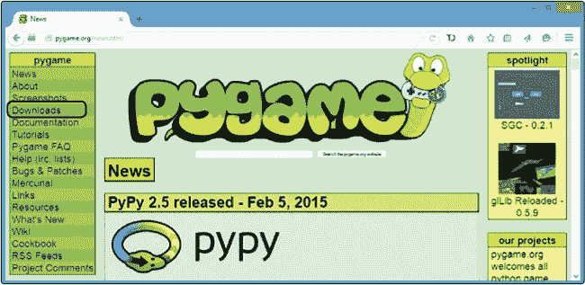

    图 B-1. 点击“下载”链接。

1.  在 Windows 部分，找到 *pygame-1.9.2a0.win32-py3.2.msi* 的链接，点击下载安装程序，如图 B-2 所示。

    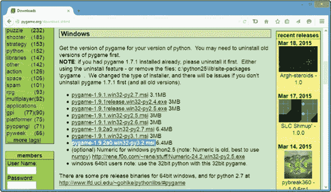

    图 B-2. 下载适用于 Windows 的安装程序。

1.  下载完成后，打开 *Downloads* 文件夹，找到 *pygame-1.9.2a0.win32-py3.2* Windows 安装程序文件，如图 B-3 所示。双击该文件开始安装。如果弹出“安全警告”窗口，请点击 **运行**。Windows 只是提醒你软件正在尝试安装到你的电脑上。

    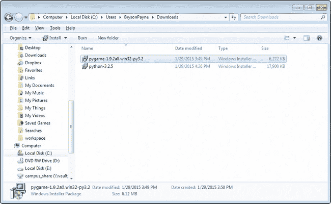

    图 B-3. 双击 *Downloads* 文件夹中的安装程序。

1.  安装程序可能会询问你是否希望为所有用户安装 Pygame，还是仅为你自己安装。通常最好选择 **为所有用户安装**，但如果在学校或办公室不允许这么做，或者无法使其正常工作，可以尝试选择 **仅为我安装**。然后点击 **下一步 >**，如图 B-4 所示。

    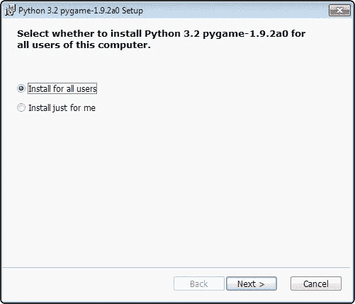

    图 B-4. 为所有用户安装。

1.  程序应该能够从附录 A 中找到你的 Python 3.2.5 安装。选择**从注册表中选择 Python 3.2**。点击**下一步 >**继续安装，如图 B-5 所示。（如果你在学校或公司安装时遇到问题，IT 支持人员可能需要选择其他位置的 Python 安装选项。）

    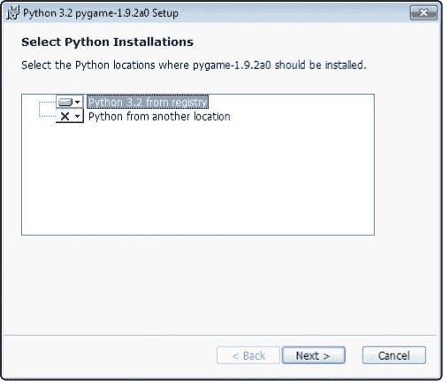

    图 B-5. 从注册表中选择 Python 3.2。

1.  完成安装程序后，点击**完成**退出，如图 B-6 所示。

    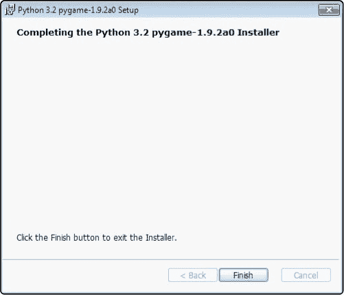

    图 B-6. 点击“完成”退出。

1.  前往**开始**▸**程序**▸**Python 3.2**▸**IDLE（Python GUI）**，如图 B-7 所示。（在 Windows 8 及更高版本上，你可以按 Windows/开始按钮，打开搜索工具，输入**`IDLE`**。）

    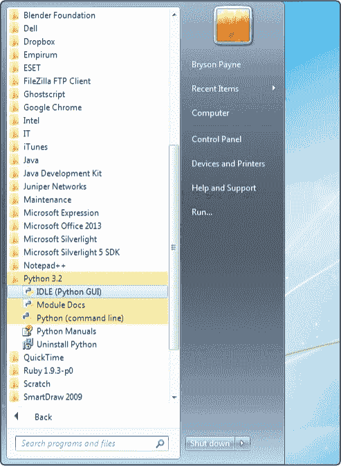

    图 B-7. 从开始菜单打开 IDLE。

1.  在 Python shell 编辑器中，输入 **`import pygame`** 并按下 ENTER 键。Python shell 应该会以 `>>>` 做出响应，如图 B-8 所示。如果是这样，那么说明 Pygame 安装正确，已准备好使用。

    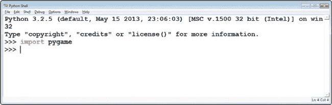

    图 B-8. 在 Python shell 中导入 Pygame。

    现在你已经准备好运行从第八章到第十章的程序了。祝编程愉快！

# Pygame for Mac

在 Mac 上安装 Pygame 比在 PC 上更复杂。你有三种选择：

1.  如果你有 Windows PC 的使用权限，可能会发现安装 Windows 版本的 Python 和 Pygame 更容易，这样就能运行从第八章到第十章的程序。如果选择这个选项，请按照 Windows 上的 Python 安装指南中的步骤操作。然后，按照 Pygame for Windows 中的步骤操作。

1.  你可以安装较旧版本的 Python，例如 Python 2.7.9，并搭配 Pygame 1.9.2 用于 OS X，以便运行第八章到第十章中的 Pygame 程序。安装 Python 2.7.9 和 Pygame 1.9.2 比让 Pygame 与 Python 3.4.2 配合工作要容易。但 Python 2 和 3 之间有一些区别，因此对于第一章到第七章的内容，我建议使用 Python 3.4.2，以确保示例能够正常运行。然后，对于第八章到第十章，你可以使用 Python 2.7 和 Pygame 1.9.2 来运行 Pygame 示例。如果选择这个选项，请遵循下一节中的 Python 2.7 和 Pygame 1.9.2 中的步骤。

1.  要在你的 Mac 上安装适用于 Python 3.4 的 Pygame，请查看在线说明，地址为 *[`www.nostarch.com/teachkids/`](http://www.nostarch.com/teachkids/)*。如果你在学校或工作中进行此操作，你几乎肯定需要 IT 支持。把在线说明交给你的 IT 专业人员，让他们作为指南来使用。

## Python 2.7 和 Pygame 1.9.2

较新的 Mac 设备预装了一个由 Apple 提供的 Python 2.7 版本，作为 OS X 的一部分。但 Apple 提供的 Python 版本可能无法与 Pygame 安装程序兼容。我建议在尝试安装 Pygame 之前，先从 *[`python.org/`](http://python.org/)* 安装最新版的 Python 2.7。

1.  要在你的 Mac 上安装 Python 2.7，请返回附录 A，然后再次按照 Mac 上的 Python 部分的步骤进行。但这一次，不是从 Mac 下载页面 *[`python.org/`](http://python.org/)* 下载 3.4.2 安装程序，而是下载并运行 2.7 安装程序（截至本文写作时为 2.7.9），如图 B-9 所示。

    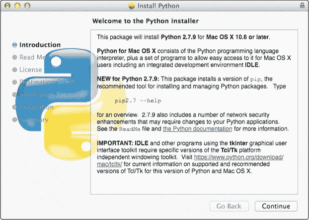

    图 B-9. 安装 Python 2.7。

1.  安装 Python 2.7 的过程应该类似于 3.4 的安装程序。继续按照附录 A 中 Mac 上的 Python 部分的步骤进行，直到完成安装。

1.  检查你的 *应用程序* 文件夹。现在应该除了你的 *Python 3.4* 文件夹外，还有一个 *Python 2.7* 文件夹，如图 B-10 所示。

    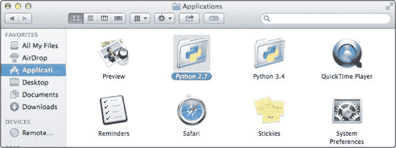

    图 B-10. 你应该同时安装 Python 2.7 和 Python 3.4。

1.  访问 *[`pygame.org/`](http://pygame.org/)*，进入下载页面，下载适用于 Python 2.7 的 Pygame 1.9.2 安装程序：*pygame-1.9.2pre-py2.7-macosx10.7.mpkg.zip*。

1.  通过按住 CONTROL 键，点击文件，并从弹出菜单中选择 **打开方式**▸**安装程序**，来运行 Pygame 安装程序。安装步骤将与安装 Python 时类似：点击 **继续** 几次，接受许可协议，并选择安装驱动器。安装完成后，点击 **关闭**。

1.  为了测试 Pygame 的安装，进入你的 *应用程序* 文件夹，选择 Python 2.7，并打开 IDLE。在 Python 2.7 的 IDLE 中，输入 **`import pygame`**。IDLE 应该会显示 `>>>`，如 图 B-11 所示。

    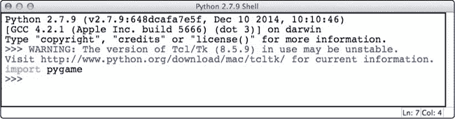

    图 B-11. 在 Python shell 中导入 Pygame。

1.  你可能会看到像 图 B-12 中那样的弹出通知，提示你需要安装 X11，这是 Pygame 使用的窗口系统。点击 **继续** 进入 XQuartz 网站，* [`xquartz.macosforge.org/`](http://xquartz.macosforge.org/)*。下载 *XQuartz-2.7.7.dmg*，打开文件并运行安装程序。

    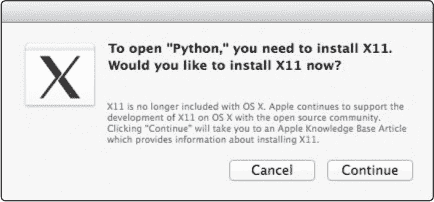

    图 B-12. 点击继续以安装 X11。

1.  若要运行 第八章至 第十章中的 Pygame 程序，请使用 Python 2.7 IDLE，而不是 Python 3.4 IDLE。

### 注意

*在配备 Retina 显示屏的新款 Mac 上，使用 Python 2.7 运行 Pygame 的效果与其他电脑有所不同，因为 Retina 显示屏使用了更高的屏幕分辨率。你的程序应该能正常运行，但它们会出现在屏幕的较小区域。*

# Linux 上的 Pygame

类似于在 Mac 上安装 Pygame，你在 Linux 上有两种安装 Pygame 的选择：

1.  你可以为 Python 2 安装 Pygame，这是你使用的 Linux 版本可能已经预安装的 Python 版本。对于第一章到第七章，你需要使用 Python 3，因此请按照附录 A 中的说明操作，并使用该版本的 IDLE 来完成前七章中的应用程序。然后，对于第八章到第十章，你可以使用 Python 2 的 Pygame 来运行这些章节中的 Pygame 示例。如果你选择此选项，请在下一节中按照 Python 2 的 Pygame 中的步骤操作。

1.  要在 Linux 上为 Python 3.4 安装 Pygame，请参考在线说明 *[`www.nostarch.com/teachkids/`](http://www.nostarch.com/teachkids/)*。如果你是在学校或工作中进行此操作，可能需要 IT 支持。将这些在线说明提供给你的 IT 专业人员，让他们作为参考指南。

## Python 2 的 Pygame

大多数 Linux 操作系统已预装 Python，通常是 Python 2。第八章到第十章中的基于游戏和图形的应用可以在这个旧版本的 Python 上正常运行。以下步骤将帮助你在 Linux 系统上安装并运行 Pygame。

1.  在 Dash 菜单中，进入系统工具，运行 Synaptic 包管理器或适用于你 Linux 版本的类似应用程序。图 B-13 显示了 Lubuntu 上运行的包管理器。

    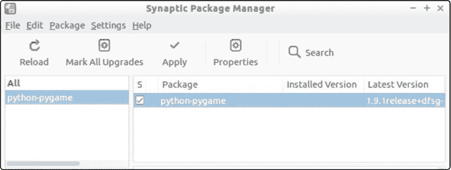

    图 B-13. 在 Linux 上安装 Python 2 的 Pygame

1.  搜索 *python-pygame*。在搜索结果中勾选 *python-pygame* 旁边的框，并点击 **应用** 完成安装。

1.  运行 **系统工具**▸**终端**（或 **XTerm** 或适用于你 Linux 版本的类似应用程序）。你可以在终端窗口中输入 **`python2`** 启动 Python 2。然后，在 `>>>` 提示符下输入 **`import pygame`** 来测试 Pygame 的安装，如图 B-14 所示。如果 Pygame 成功导入，Python 应该会以 `>>>` 响应，表示安装成功。

    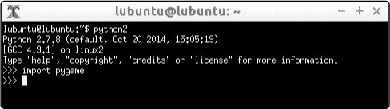

    图 B-14. 你可以从 Linux 命令行终端测试 Python 2 的 Pygame 安装情况。

1.  你可以使用软件中心（如 Linux 上的 Python 所示）或在图 B-13 中显示的 Synaptic 包管理器来搜索并安装适用于 Python 2 的 IDLE。运行来自第八章到第十章的 Pygame 应用时，使用此版本的 IDLE。
