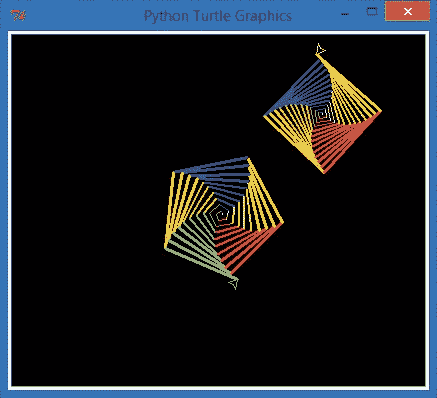
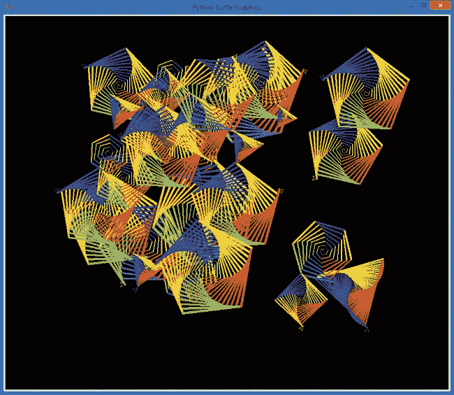

# 附录 C. 构建你自己的模块

在本书中，你已经将像` turtle`、`random`和`pygame`这样的模块导入到你的程序中，以便添加绘图、生成随机数和动画图形的功能，而不需要从头编写它们。但你知道吗，你也可以编写自己的模块并将其导入到程序中？Python 使得构建模块变得简单，你可以保存有用的代码，并在多个程序中使用它。

要创建可重用的模块，我们像编写其他程序文件一样，在 IDLE 的文件编辑窗口中编写模块，并将其保存为一个新的*.py*文件，文件名就是模块的名称（例如，*colorspiral.py*可能是一个用于绘制彩色螺旋的模块的文件名）。我们在模块中定义函数和变量。然后，为了在另一个程序中重用它们，我们通过键入`import`和模块名称将模块导入到程序中（例如，`import colorspiral`将使程序能够使用*colorspiral.py*中的代码来绘制彩色螺旋）。

为了练习编写我们自己的模块，让我们创建一个实际的`colorspiral`模块，看看它如何帮助我们避免重复编写代码。

# 构建 colorspiral 模块

让我们创建一个`colorspiral`模块，帮助我们在程序中快速轻松地绘制螺旋，只需调用`import colorspiral`。将以下代码输入到新的 IDLE 窗口，并将其保存为*colorspiral.py*。

## colorspiral.py

```
➊ """A module for drawing colorful spirals of up to 6 sides"""
   import turtle
➋ def cspiral(sides=6, size=360, x=0, y=0):
➌     """Draws a colorful spiral on a black background.

       Arguments:
       sides -- the number of sides in the spiral (default 6)
       size -- the length of the last side (default 360)
       x, y -- the location of the spiral, from the center of the screen
       """
       t=turtle.Pen()
       t.speed(0)
       t.penup()
       t.setpos(x,y)
       t.pendown()
       turtle.bgcolor("black")
       colors=["red", "yellow", "blue", "orange", "green", "purple"]
       for n in range(size):
           t.pencolor(colors[n%sides])
           t.forward(n * 3/sides + n)
           t.left(360/sides + 1)
           t.width(n*sides/100)
```

这个模块导入了` turtle`模块，并定义了一个名为`cspiral()`的函数，用于绘制不同形状、大小和位置的彩色螺旋。让我们看看这个模块和我们编写的其他程序之间的区别。首先，在➊处，我们有一个特殊的注释，称为*文档字符串*。文档字符串是一种向我们打算重用或与他人共享的文件添加文档的方式；在 Python 中，模块应该包含文档字符串，以帮助未来的用户理解该模块的功能。文档字符串总是模块或函数中的第一个语句，每个文档字符串都以*三重双引号*（`"""`，三个双引号连在一起且中间没有空格）开头和结束。文档字符串之后，我们导入` turtle`模块——是的，我们可以将模块导入到我们的模块中！

在➋位置，我们定义了一个名为`cspiral()`的函数，该函数最多接受四个参数——`sides`、`size`、`x`和`y`——用于指定螺旋的边数、螺旋的大小，以及螺旋从海龟屏幕中心开始的（*x*，*y*）位置。`cspiral()`函数的文档字符串从➌开始；这个多行文档字符串提供了关于函数的更具体信息。文档字符串的第一行以三重双引号开始，描述了函数的总体功能。接下来，我们留空一行，随后列出了该函数接受的参数。通过这些文档，未来的用户可以轻松阅读函数接受哪些参数以及每个参数的含义。函数的其余部分是绘制彩色螺旋的代码，类似于第二章、第四章和第七章中的代码。

## 使用 Colorspiral 模块

一旦我们完成并保存了*colorspiral.py*，我们就可以将它作为模块导入到另一个程序中。创建一个新的文件，在 IDLE 中保存为*MultiSpiral.py*，并将其与*colorspiral.py*保存在同一文件夹中。

## MultiSpiral.py

```
import colorspiral
colorspiral.cspiral(5,50)
colorspiral.cspiral(4,50,100,100)
```

这个三行程序导入了我们创建的`colorspiral`模块，并使用该模块的`cspiral()`函数在屏幕上绘制了两个螺旋，如图 C-1 所示。



图 C-1. 通过三行程序创建的两个彩色螺旋，感谢*colorspiral.py*模块

使用`colorspiral`模块，程序员想要创建彩色螺旋时，只需导入该模块并调用`colorspiral.cspiral()`即可！

## 重新使用 Colorspiral 模块

让我们重用`colorspiral`模块来绘制 30 个随机的彩色螺旋。为此，我们将导入我们之前使用过的另一个模块`random`。在 IDLE 中输入以下八行代码并将文件保存为*SuperSpiral.py*。

## SuperSpiral.py

```
import colorspiral
import random
for n in range(30):
    sides = random.randint(3,6)
    size = random.randint(25,75)
    x = random.randint(-300,300)
    y = random.randint(-300,300)
    colorspiral.cspiral(sides, size, x, y)
```

该程序以两个`import`语句开始：一个用于我们创建的`colorspiral`模块，另一个用于我们在整个书中使用的`random`模块。`for`循环将执行 30 次。该循环生成四个随机值，分别用于确定边数（3 到 6 之间）、螺旋的大小（25 到 75 之间），以及用于在屏幕上绘制螺旋的 x 和 y 坐标，坐标范围在（–300，–300）到（300，300）之间。（请记住，海龟的原点（0，0）位于绘图屏幕的中心。）最后，每次循环都会调用我们模块中的`colorspiral.cspiral()`函数，绘制一个带有随机生成属性的彩色螺旋。

尽管这个程序只有八行代码，但它可以生成令人惊艳的图形，参考 图 C-2。



图 C-2. `colorspiral`模块使得 *SuperSpiral.py* 仅用八行代码就能生成一个美丽的多螺旋拼贴。

创建可重用模块的能力意味着你可以花更多的时间解决新问题，而不是重复编写已有的解决方案。每当你构建一个有用的函数或一组函数，想要反复使用时，你可以创建一个模块来自己使用或与其他程序员分享。

# 其他资源

Python 的官方文档中包含了关于模块和 Python 语言的更多信息，访问地址是 *[`docs.python.org/3/`](http://docs.python.org/3/)*。Python 教程中有一个关于模块的章节，地址是 *[`docs.python.org/3/tutorial/modules.html`](http://docs.python.org/3/tutorial/modules.html)*。在你学习新的 Python 编程技能时，可以利用这些资源来丰富你的编程工具集。
