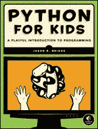
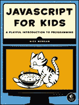
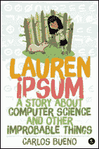
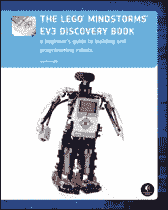
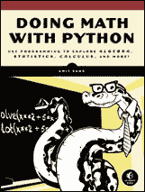
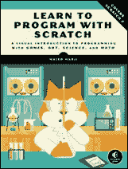

# 附录 E：更新

访问 *[www.nostarch.com/teachkids/](http://www.nostarch.com/teachkids/)* 获取更新、勘误、项目的程序文件、编程挑战和其他信息。

**更多适合好奇孩子的智能书籍！** 

**孩子们的 Python**

**编程的趣味入门**

*作者* JASON R. BRIGGS

2012 年 12 月，344 页，$34.95

ISBN 978-1-59327-407-8

*全彩*

**孩子们的 JavaScript**

**编程的趣味入门**

作者 NICK MORGAN

2014 年 12 月，336 页，$34.95

ISBN 978-1-59327-408-5

*全彩*

**LAUREN IPSUM**

**关于计算机科学和其他不太可能的事情的故事**

*作者* CARLOS BUENO

2014 年 12 月，192 页，$16.95

ISBN 978-1-59327-574-7

*全彩*

**乐高® MINDSTORMS® EV3 探索书**

**机器人构建与编程的初学者指南**

*作者* LAURENS VALK

2014 年 6 月，396 页，$34.95

ISBN 978-1-59327-532-7

*全彩*

**用 Python 做数学**

**用编程探索代数、统计学、微积分等！**

*作者* AMIT SAHA

2015 年春季，304 页，$29.95

ISBN 978-1-59327-640-9

**使用 Scratch 学习编程**

**通过游戏、艺术、科学和数学的视觉编程入门**

*作者* MAJED MARJI

2014 年 2 月，288 页，$34.95

ISBN 978-1-59327-543-3

*全彩*

**800.420.7240 或 415.863.9900 | sales@nostarch.com | [www.nostarch.com](http://www.nostarch.com)**
