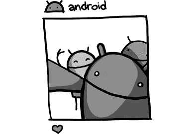

# 第一章：Android。。。相机操作系统？

> 数码相机的 Wi-Fi 接口在一些高端单反相机中开始出现。这些设备越来越强大，但用户界面（UI）非常糟糕。
> 
> —布莱恩·斯威特兰

一开始，Android 正在开发一个名为 FotoFarm 的数码相机平台。

2003 年的数码相机技术变得越来越有趣；数码单反相机（DSLR）结合了高质量的镜头和越来越大的传感器，能够在数码图像文件中捕捉更多的细节。但这些相机的软件……并不太好。

安迪·鲁宾曾创办并刚刚离开了手机制造商 Danger，他在寻找新的项目。与前 WebTV 同事克里斯·怀特一起，他们成立了一家公司，目标是制作更好的相机软件。安迪担任 CEO，克里斯担任 CTO，他们在 2003 年底创立了 FotoFarm，为数码相机提供操作系统。他们设想的软件将提供更好的用户界面和网络功能，还能运行应用程序。结合更强大的相机硬件，他们将推动摄影和成像功能与体验的极限。

克里斯告诉安迪，他认为他们能想到一个比“FotoFarm”更好的名字。安迪已经有了网址 android.com，于是他们将名字改为 Android，并聘请了设计公司 Character 来帮助创建公司的品牌形象，包括他们的 logo 和名片。

他们所需要的只是让投资者相信他们的 Android 相机平台的愿景。但其他人并不关心相机，大家都只想谈论手机。

安迪邀请尼克·西尔斯到 Android 位于帕洛阿尔托的办公室，向他推销相机操作系统。两人曾在 Danger 的 T-Mobile Sidekick 手机项目中紧密合作过。尼克决定离开 T-Mobile，但仍希望继续从事手机领域的工作。他想打造一款比他们在 Danger 所做的更先进的消费类智能手机。尼克认为，Danger 未能达到预期成功的原因之一，是设备本身的界面和形态设计。“每个人都把它看作是一款标志性设备，但我们知道它的形态设计还不够小，无法让人们想要随身携带。它仍然是一款厚重的设备，屏幕也是一个独立的部分。”

Android 的愿景并没有吸引尼克，他对相机不感兴趣。手机才是他经验和兴趣的所在。他告诉安迪，“如果你改变主意，做手机的话，给我打个电话。”

在那次谈话后不久，安迪与另一位来自 Danger 时期的同事里奇·迈纳进行了交谈。里奇代表他的雇主——移动运营商 Orange，成为 Danger 的早期投资者。通过与安迪的合作，里奇了解了他，并一直保持联系，想看看他将来会做什么。

Rich 和 Nick 一样，建议安迪的初创公司应该考虑制造手机，而不是相机。Rich 在手机市场有着悠久的历史，他看到了 Android 在该领域改变局势的机会。Chris 也在和 Andy 讨论这个可能性。但 Andy 仍然心存抗拒。

安迪*不想*再做手机了。他最终对在 Danger 的经历感到失望，因为那并没有按照他预期的方式发展。但与此同时，他向风险投资家（VCs）推销相机的想法，却没有得到任何兴趣。而且，他也看到了相机市场的现实，当时的销量开始下滑，因为制造商们开始将相机集成到手机中。

2004 年 11 月，安迪又一次与风险投资家开会。他推销相机操作系统时依然没有引起兴趣。所以他提到了手机作为一个可能性，结果房间里的人开始关注起来。

安迪放弃了。他重新联系了 Nick 和 Rich，并告诉他们，他现在准备做一个手机操作系统了。

这正是 Rich 和 Nick 所需要的。他们开始与 Andy 一起合作，制定关于手机操作系统的商业计划和推介资料。在 2005 年初，他们作为共同创始人加入了 Android。

安迪没有建成自己的相机操作系统。但鉴于今天手机上相机的重要性，你可以说他创造了史上最广泛使用的相机操作系统；他只是通过间接的方式做到了这一点。
