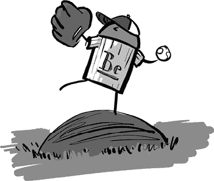
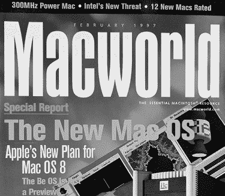
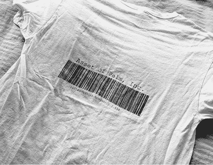
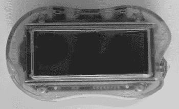
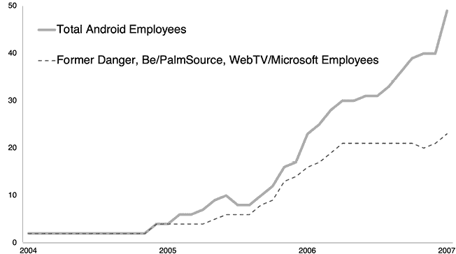

# 第二章：农场团队

> 这就是 Android 最酷的部分之一：在最初的一百人中，几乎每个人之前都做过类似的事情。我在做那些我已经犯过错误并从中吸取教训的事情。每个人都是如此。
> 
> —Joe Onorato

和几乎所有其他技术产品一样，Android 的成功不仅仅是产品和发布的结果，更在于那些构建它的人以及他们在塑造过程中所带来的集体经验。所以，Android（这个手机操作系统）是如何诞生的故事，早在这家创业公司成立之前，就已经开始了，源自团队成员们的集体历史。

Android 的诞生是因为许多其他努力先行发生了。或者更确切地说，Android 的存在源于那些构建它的人，之前曾在多个其他公司一起工作，这些公司在移动平台和桌面平台之间不断变化的 Venn 图中互有交集。正是在这些公司中，早期的 Android 开创者们积累了他们的知识、技能和与同行的协作经验。当他们加入 Android 团队时，他们能够迅速上手，并在相对较短的时间内从零开始构建一个全新的操作系统。

对早期 Android 团队影响最大的一些公司包括 Be/PalmSource，^(1) WebTV/Microsoft 和 Danger。虽然这些公司没有直接为 Android 提供支持，并且大多数未能在市场上产生大的影响，但它们都提供了一个肥沃的试验场，工程师们在这里学到了重要的技能，这些技能在他们后续开发 Android 操作系统时得到了充分应用。

## Be 公司

Be 操作系统（BeOS）如今只不过是计算机历史中的一个脚注^(2)。事实上，你甚至可能从未听说过 Be 或 BeOS，更不用说使用过这家公司的软件或硬件了。但 Be 对计算平台的影响是巨大的，至少有一个原因就是它集结了大量后来组成 Android 团队的员工、热衷用户和开发者。^(3)

Be 是在桌面计算机战争的后期加入的，出现在 1990 年代初期，推出了一款新操作系统，试图与已占据市场的微软和苹果桌面系统竞争。但它的表现并不理想。

Be 在发展的过程中尝试了许多不同的方向。他们出售了自己的计算机硬件（BeBox）。他们将 BeOS 移植到 PC 和 Mac 硬件上，并尝试销售操作系统。他们差点被苹果收购（事实上，苹果给了他们一个收购报价，但当 Be 的 CEO 利用拖延时间作为谈判策略时，史蒂夫·乔布斯突然介入，成功说服苹果收购他的公司 NeXT Computer）。1999 年，他们进行了一次不太成功的首次公开募股（IPO）。^(4) 然后在 2000 年，当没有人购买 Be 的硬件和操作系统时，这家公司尝试了他们称之为“聚焦转变”的举措，开发了一个为互联网设备设计的操作系统，但人们还是没有购买。

*Macworld*曾刊登过一篇关于苹果收购 Be 的故事，然而在苹果收购 NeXT Computer 后，这笔交易没有成行。（图片由 Steve Horowitz 提供。）

最终，在 2001 年，Be 被 Palm 收购（当时 Palm 将该部门拆分成一个新公司，名为 PalmSource），以为未来的 Palm 设备构建操作系统。具体来说，Palm 收购了 Be 的知识产权（IP），并聘用了许多 Be 的员工；Palm 并未收购该公司、债务或资产（如办公家具）。^(5)

Be 在 Android 历史上具有重要意义，原因有几个。首先，Be 吸引了许多对操作系统开发各个方面感兴趣的工程师，从用户界面、图形、设备驱动程序（让系统与硬件（如打印机和显示器）进行交互）到内核（处理平台基础设施重任的低级系统软件）。从事这些项目培养了构建像 Android 这样的操作系统所需的技能。

此外，BeOS 成为了操作系统中的经典之作。世界各地的工程师们在大学或个人项目中接触到 Be，并对其进行实验。Be 在多媒体^(6)、多处理^(7)和多线程^(8)方面的先进能力使其成为了操作系统开发爱好者的有趣乐园。许多在 Android 团队工作的工程师虽然没有真正加入过 Be，但他们在个人时间里曾经玩过 BeOS，并对操作系统开发产生了热情，这种热情后来被带入了 Android 团队。

当 Be 被收购时，一半的工程师去了 Palm 工作（很快进入 PalmSource）。^(9) 在那里，他们继续从事操作系统的开发，构建 Palm OS Cobalt，尽管最终没有在任何设备上发布。在此过程中，工程团队继续磨砺操作系统开发技能，同时也积累了在移动设备上的经验，这些设备正是他们 Palm OS 工作的目标。

加入 Palm 的 Be 工程师们制作了印有他们对收购的讽刺看法的 T 恤。（图片由 Mathias Agopian 提供。）

PalmSource 在 2005 年底被 ACCESS 收购。由于对新公司发展方向缺乏热情，许多前 Be 的工程师最终加入了谷歌的 Android 项目。到 2006 年中，前 Be 员工占据了 Android 团队的三分之一。

## WebTV/微软

WebTV 成立于 1995 年中期，并在不到两年后的 1997 年 4 月被微软收购。^(10) 那些在 Android 早期加入的微软员工，特别来自于最初成立 WebTV 团队的人，以及其他电视/互联网团队（如 IPTV），他们都属于同一部门。

WebTV 提供了第一个将互联网带到电视机上的系统之一。今天看来，这似乎有些可笑，因为我们中的许多人通过电视上的互联网服务消费几乎所有电视内容。但在当时，这些是完全不同的世界，大多数人访问互联网的方式是通过个人电脑。

WebTV 团队正在创建一个供用户消费内容的平台，这些内容不仅限于电视节目，因此他们需要开发在硬件上运行的软件平台、用于构建应用的用户界面层，以及该平台的应用程序。团队开发了一个操作系统，一个 UI 工具包（负责在应用程序中进行用户交互的系统），一个编程层（用于编写应用程序），以及适用于互联网设备的应用程序。所有这些努力都积累了实践经验，这些经验对后来加入 Android 团队并构建类似东西的人来说非常有用。

## Danger 公司

Danger 公司成立于 1999 年 12 月，由 Andy Rubin、Matt Hershenson 和 Joe Britt 创办。最初，公司正在开发一款便携的数据交换设备，昵称为“Nutter Butter”^(11)，因为它的外形像这种名字的饼干。

Danger 的 Nutter Butter 设备。它是用来交换数据的，而不是用来当零食吃的。（图片由 Nick Sears 提供。）

在 2000 年至 2001 年点 com 泡沫破裂期间，公司转向开发一种能够自动无线同步数据的设备。但那还不是一部手机。还不是。然后，在 2001 年 1 月，Andy 在 CES 上与 T-Mobile 的 Nick Sears 会面。^(12)

## Nick Sears 与移动数据

1984 年，Nick 在美国陆军服役，从事行政工作以赚取大学福利。然后，他在超级碗期间观看了苹果公司传奇的 1984 年广告。“我知道我们正处在技术革命的起点。我走进 ComputerLand，花了 3200 美元，买了一台 IBM PC（一个软盘驱动器），DOS，Turbo Pascal，Lotus Notes，WordStar 和一个点阵打印机。白天，我是每分钟 40 个字的打字机。晚上，我成了一个温和的计算机迷。”

Nick 将自己的计算机技能与商业学位相结合，并在 80 年代末加入了 McCaw Communications。在 McCaw 公司内部，他见证了移动行业和互联网的成长，持续了十年。到了 2000 年，他加入了 T-Mobile，^(13)成为公司负责无线数据战略的副总裁。

T-Mobile 最近专门组建了一个团队，致力于无线互联网的发展。它们是美国唯一拥有 GPRS^(14)技术的运营商，而且它们的数据网络在其他运营商之前大约一年就准备好了。Nick 的任务就是实现这一目标。这意味着要出去寻找，或者必要时创造，能够利用这个新数据网络的设备。

Nick 和他的团队意识到，如果没有更好的键盘体验，丰富的互联网体验将无法实现。在当时的手机上，仅使用传统的 12 键拨号盘进行任何有趣的网上操作既不可行也不愉快^(15)。因此，团队专门寻找带有 QWERTY 键盘的潜在设备^(16)。

T-Mobile 当时已经与 RIM^(17)合作，并说服他们为之前仅限数据的黑莓设备加入手机功能。但是，那些设备的外形设计（尤其是深受用户喜爱的腰带夹）不会吸引消费者，因为他们更倾向于寻找一些不那么以商业为中心的设备。

Nick 于 2001 年参加了 CES，寻找消费类设备的可能性。他与 Danger 的 CEO 安迪·鲁宾会面，安迪向他展示了 Danger 设备的最新版本的模型。像黑莓一样，它也是仅限数据的。和黑莓一样，Nick 告诉安迪，T-Mobile 需要将其做成手机，于是 Danger 开始调整，加入了手机功能，并与 T-Mobile 合作推出了第一款设备。

Nick 回忆起 T-Mobile 推动这些新型数据启用手机的过程时说：“我们是第一个将手机带入智能手机时代的人。”

2002 年 10 月，Danger 推出了他们的*Hiptop*^(18)手机……但 T-Mobile 坚持要更改名称。正如 Nick 所解释的：“商务高管和工程师像佩戴 HP 计算器一样把黑莓设备挂在腰间，我们认为消费者不会用手机这样做。”于是，这款设备以 T-Mobile Sidekick 的名称发布。

这款设备占据了当时功能手机和未来智能手机之间的一个中间地带。例如，Hiptop 提供了一个真正的网页浏览器（相比于当时手机上普遍使用的非常有限的移动浏览器）。此外，Danger 手机还拥有一个应用商店，这是同类产品中的先驱之一。但该商店由 T-Mobile 进行策划；当时运营商控制着能够在其网络上运行的应用程序，这被称为*围墙花园*^(19)。

这些功能，加上云/网络能力，包括 Hiptop 的持久连接，能够即时更新电子邮件和聊天信息，再加上空中更新，后来在安卓系统上也得以体现，一些开发者也曾在 Danger 手机上让这些功能得以实现。

最终，Danger 手机未能从小众市场突破到大众市场的成功。互联网电子邮件、消息传递和浏览的结合，加上 T-Mobile 激进的无限数据定价，创造了一款在当时具有强大功能的手机。Danger 设备吸引了很多关注，尤其是在科技^(20)和流行文化圈子中（包括 2006 年电影《穿普拉达的女王》中的第二款 Hiptop 设备）。但这些手机未能赢得消费者的心和钱包。尽管如此，这些设备在推动移动领域发展方面起到了重要作用，从创造出的技术，到这些设备所带来的新体验，再到 Danger 在此过程中培养出的工程师团队。

## 一起努力

早期大部分安卓团队成员曾在以下一家公司或多家公司工作过：Be/PalmSource、WebTV/Microsoft 和 Danger。直到 2006 年中期，这些人占团队的至少 70%，并且一直是团队的多数，直到 2007 年。

到 2006 年为止，加入安卓团队的大多数人曾在以下一家公司或多家公司工作过：Be/PalmSource、WebTV/Microsoft 和 Danger。

在科技界，尤其是硅谷，这一直是一个事实：人们在公司之间流动，并在职业生涯中不断在不同的地方和背景下共同工作。当你离开公司时，永远不应该断绝关系。首先，待人得体本就是正确的做法。但在硅谷，断绝关系是一个非常糟糕的主意，因为很有可能你未来的某个时刻会需要与那些同样的人再次合作；如果当时这些桥梁没有被焚毁，那将是非常方便的。^(21)

在安卓的案例中，这远远超出了人们最终进入同一家公司这一间接且偶然的效果。早期团队在很大程度上依赖他们之前的公司经验，并招募了那些（a）他们已经有工作关系的人，以及（b）那些有着安卓所需的工作经验的人：操作系统、嵌入式设备和开发者平台。

通过早期加入安卓，这些人启动了一个紧密合作的团队，大家都知道自己在做什么，这使得他们能够比预期更快地构建这个新操作系统。

2007 年加入安卓团队负责工具开发的 Xavier Ducrohet 观察到：“那些最早加入的人来自其他地方——很少有来自谷歌的。那些已经发布过操作系统的人。能做到这一点的人有多少？他们发布过小型操作系统，并从他们的错误中吸取了教训。”

Dan Egnor 也于 2007 年加入，负责开发空中更新系统，他注意到团队中已经在的成员之间的动态。“有一种强烈的感觉，通过共同的历史，大家彼此了解，他们知道彼此的不满点，尊重的方面，哪些人可以信任完成任务，他们有清晰的责任领域。即使只有几个月的时间，大家也能流畅地提起对方的名字。人们有强烈的感觉，知道别人做了什么，以及如何做的。”

这些公司或它们的产品并非都成功，但在它们的建设过程中获得的知识极大地促进了 Android 团队后来建立一个可行平台的能力。Steve Horowitz 曾在 Be 和微软的 WebTV 团队工作，后来管理 Android 工程团队，他说：“这就是这个世界的一部分：你从失败中学到的可能比从成功中学到的更多。”

Dianne Hackborn 曾在 Be 和 PalmSource 工作，加入早期 Android 团队之前，她说：“我们大多数人在加入 Android 团队之前，都经历过不少失败，其中可能是时机、情况或其他原因没有促成成功。我算过，我在 Android 之前参与过三到四个失败的平台。但我们一直在尝试，从每次失败中吸取教训，并将从中获得的知识运用到 Android 的工作中。”

Android 在成立之前已经有了悠久的历史，这建立在所有为其早期团队做出贡献的公司历史之上。
