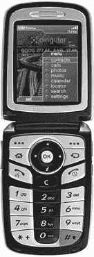
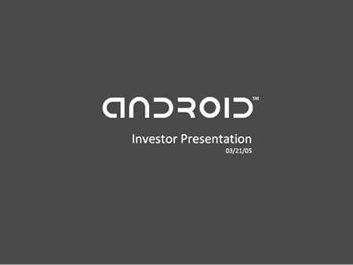
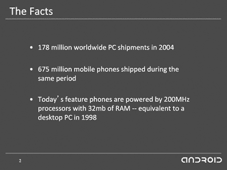
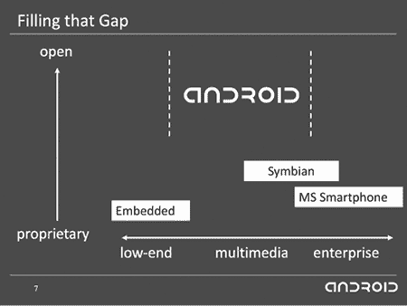
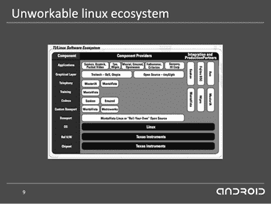
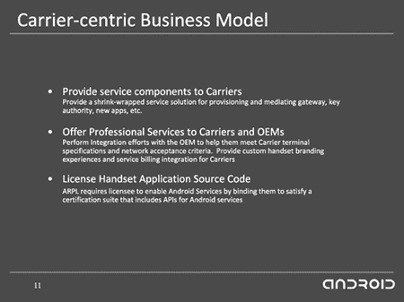

# 第四章：投资展示

到 2005 年中，Android 被收购，未来看起来一片光明。但仅仅六个月前，情况并非如此乐观。那年 1 月，这家初创公司急需资金，他们的主要任务和大多数初创公司一样：获得资金。在从相机操作系统转向开源手机平台之后，他们仍然面临着真正构建产品的艰巨任务，这意味着他们需要更多的资金来雇佣足够大的团队来完成工作。

因此，公司专注于三件事。首先，他们需要一个演示来展示可能性。接下来，他们需要阐明他们的愿景，并制作一份演示文稿来帮助解释这一愿景。最后，他们需要将演示和幻灯片文稿带上路，向潜在投资者推销他们的故事。

## 演示时间

Fadden 加入时的第一个任务是巩固演示，完善 Swetland 和 Chris 一直在开发的原型手机系统。这个系统实际上并不可用（例如，它在主屏幕上显示一个股票行情，使用了一组硬编码的符号和过时的数据）。但该演示代表了产品在实际实施时可能的样子。

最初的演示由 Brian Swetland 和 Chris White 编写，后来由 Fadden 进行了增强，展示了一个主屏幕和几个应用程序（其中大多数并未实现）。这与现代 Android 主屏幕相差甚远。

Fadden 在演示中添加的一个应用是一个简单的日历应用。这一早期的演示项目最终成了他心头的痛。经过多年在 Android 平台上的工作，他最终帮助开发了 Android 日历应用。时间不等人……但日历应用会。

## 移动机会

随着团队不断完善他们的愿景，他们制作了一份幻灯片演示文稿来解释这一愿景。这些幻灯片展示了他们在市场上为 Android 看到的机会，以及 Android 如何为投资者带来收益的构想。

2005 年 3 月的幻灯片文稿有十五张幻灯片，足以引起风险投资者和谷歌的关注。

投资展示文稿在第二张幻灯片开始变得有趣，比较了 PC 和手机市场。2004 年，全球 PC 出货量为 1.78 亿台。同一时期，手机出货量为 6.75 亿部；手机出货量几乎是 PC 的四倍，但其处理器和内存的能力与 1998 年的 PC 相当。

移动硬件的潜力是 Dianne Hackborn 当时在 PalmSource 工作，后来加入 Android 团队时也在思考的一个问题。移动行业已经准备好爆发，因为硬件终于足够强大，可以提供一个真正强大的计算平台：Dianne 说，“你可以看到墙上的字。硬件变得更强大，市场已经比 PC 更大了。”

演示文稿的第一页。那种定制字体的“ANDROID”字样在这次创业阶段后多年仍然是该操作系统的标志。

到 2004 年，手机的数量已经远超个人电脑的销量，这为拥有更强大软件的手机提供了巨大的机会。

演示文稿还指出了移动软件成本日益增长的问题。硬件成本在下降，但软件成本却没有下降，导致软件在每部手机成本中的比例越来越大。然而，手机制造商并非软件平台开发专家，他们既没有相关技能，也没有兴趣提供区分自己软件与竞争对手软件的所需功能。

## 开放机会

演示文稿中的第二个主要观点是，市场上存在一个空白和机会，可以推出一个*开放*平台。也就是说，Android 将是一个自由且通过开源提供给制造商的操作系统。公司可以在自己的手机上使用并分发这个操作系统，无需依赖软件提供商，也无需自己构建。这样的开放方式在当时是根本不存在的。

微软提供了一种专有操作系统，制造商可以授权使用并移植到自己的硬件上。Symbian 主要由诺基亚使用，索尼和摩托罗拉也有一定的采用。RIM 则有自己专属的平台，仅用于其 BlackBerry 设备。但对于那些希望拥有功能强大智能手机的制造商来说，市面上并没有替代选择，他们既不想自己构建操作系统，也不想投入大量精力定制现有操作系统，或支付高额授权费用。

更加严重的问题是，现有的系统未能为应用程序提供一个完整的生态系统。Symbian 提供了一些操作系统的核心基础设施，但 UI 层则交给了制造商处理，这导致了一个应用程序模型，其中为某一版本的 Symbian 编写的应用程序未必能在同一制造商的其他版本手机上运行。

第 7 页图示了开放平台的潜力，提供了当时其他地方无法获得的东西。

作为在服务器和桌面 PC 领域被称为“一次编写，到处运行”的 Java 编程语言，可能本来可以提供这种跨设备应用程序的能力，但 Java ME^(1)在移动领域远远没有达到这种水平。虽然它确实在不同设备间提供了至少相同的语言（就像 Symbian 为其所有实现提供了相同的 C++语言一样），但 Java ME 通过提供被称为*profiles*的不同平台版本来解决手机中各种形态因素和架构的广泛差异。这些配置文件具有不同的功能，因此开发人员需要更改其应用程序以在不同设备上运行，而在设备功能差异显著时，这种方法通常会失败。

TI 提供了一个基于 Linux 的解决方案，但许多驱动程序和其他组件的详细信息留给制造商去解决，这并不是一个令人信服的选择。

救星 Linux！ . . . 差一点。德州仪器（TI）提供了基于 Linux 操作系统内核的开放平台。所有制造商所需的只是 Linux 本身，TI 的参考硬件，以及来自 40 个不同供应商的大量其他模块，制造商必须获取、许可、构建或以其他方式提供以创建自己的设备。正如 Brian Swetland 所说：“你可以使用 TI 的 OMAP^(2)芯片来打造 Linux 手机。因此，你需要 TI 的 OMAP，然后还需要来自四十个不同中间件供应商的四十个组件。你将所有这些组件整合在一起，然后你就有了一个 Linux 手机。这实在是太荒谬了。”

安卓希望提供全球第一个*完整的*开放式手持设备平台解决方案。它将建立在 Linux 之上，类似于 TI 的提议，但还将提供所有必要的组件，以便制造商只需采用一个系统即可构建和推出其设备。安卓还将为应用程序开发人员提供一个统一的编程模型，以便他们的应用程序在平台运行的所有设备上都能同样工作。通过拥有一个在所有使用该平台的设备上都有效的单一平台，安卓将简化制造商和开发人员的手机开发过程。

## 赚钱

融资的最后一部分（对于他们向风险投资者进行的演讲来说，这是最重要的部分）是关于安卓如何赚钱的。在幻灯片中描述的开源平台基本上是安卓团队最终构建和推出的内容。但如果仅此而已，公司将不值得风险投资者投资。从拯救世界的角度来看，开发并免费提供开源平台听起来很好，但利润在哪里？对投资者来说，这有什么好处？也就是说，安卓计划如何从他们计划中简单地提供的产品中赚钱？风险投资家资助那些他们希望能带来比他们投资回报更多（远远更多）的公司。

对于游戏中的其他平台公司，通向收入的道路是清晰的。微软通过将其平台授权给 Windows Phone 合作伙伴来赚钱；每卖出一部手机，微软都会收到每部设备的费用。RIM 通过销售手机以及他们的忠实企业客户签署的有利服务合同来赚钱。诺基亚和其他采用 Symbian 的公司通过销售他们制造的手机（这些手机使用了该操作系统的不同版本）来赚钱。类似地，所有其他手机制造商通过他们销售的手机产生的收入来资助自己的软件开发。

那么，Android 的策略是什么呢？他们如何资助这个尚未建立的强大平台，并且会将其免费提供给其他制造商，让他们制造自己的设备？

运营商服务。

运营商将为 Android 手机提供应用、联系人以及其他基于云的数据服务。运营商会为提供这些服务向 Android 支付费用。Swetland 解释道：“我们不会像 Danger 为其 Hiptop 手机所做的那样运行和托管服务，我们会构建这些服务并将它们卖给运营商。”^(3)

第 11 张幻灯片展示了通向利润的路径，基于运营商将从 Android 授权的服务。

## 推销梦想

Android 团队向一些风投推介，主要是在东海岸，远离硅谷。正如 Rich Miner 所说：“Andy 曾多次走上 Sand Hill Road^(4)，以 Android 作为相机操作系统进行推介，已经收到了一堆‘不行’的答复，其中包括 Red Point 那里，他曾是 EIR（驻场创业者）。我加入的部分原因就是想说，‘我有一堆东海岸的风投和其他人，可以介绍给你们。’所以我们开始去见一些之前没听说过 Android 的人。”

与这些风投会议并行，团队还在与 Google 进行会谈。今年 1 月初，Larry Page^(5)邀请 Andy 到 Google 开会。Larry 是 Andy 之前公司制作的 T-Mobile Sidekick（Danger Hiptop）手机的忠实粉丝，因此他希望与 Andy 讨论移动领域的事情。Andy 打电话给仍在 T-Mobile 工作的 Nick Sears，邀请他也来参加这次会议。

这是一次小型会议，只有来自 Android 的 Andy 和 Nick，以及来自 Google 的 Larry、Sergey Brin^(6)和 Georges Harik（Google 的早期员工）。Nick 记得这次会议非常随意，但也明确感到 Google 对 Andy 和 Android 正在做的事情非常感兴趣。“会议开始时，Larry 说 Sidekick 是有史以来做得最好的手机。Larry 非常希望看到一款更好的手机被制造出来，而他知道 Andy 和我们团队正在致力于这项工作。会议结束时，他们说：‘我们希望能帮助你们。’”

那次会议令人鼓舞，但没有取得任何实质性的成果。事实上，安迪怀疑他们是否只是把这次会议当作一种方式，想要从安迪那里了解他在 2003 年创办并离开过的公司 Danger 的情况。他认为谷歌可能有意收购 Danger。

与此同时，团队继续向风险投资公司（VC）进行推介。然后在三月，他们前往谷歌进行另一次会议。这一次，他们展示了一个演示并分享了更多的计划。虽然这次会议也没有发生什么重大事件，但谷歌更明确表示他们希望帮助这家初创公司。

此时，团队还在与潜在的制造合作伙伴进行会谈。他们前往韩国和台湾，拜访了三星和 HTC。与三星的会议开始时，手机部门的首席执行官李健熙说他错失了与 Danger 合作的机会，不希望再发生这种事，因此他有兴趣加入 Android。尼克描述了这次会议：“李健熙告诉他的团队让它成真，我们以为这是一笔已成的交易。但随后我们与他 10 多位中层经理开会，他们问，‘谁来打造你们的操作系统？’我们说‘布赖恩’，他们笑了。他们有 300 人在开发他们自己的操作系统。”

三星问团队是否是在做梦。尼克回答说：“不，真的，布赖恩和其他几个人将会打造这个操作系统。”他们问这怎么可能实现，我们回应说不仅可能，而且布赖恩已经在 Sidekick 上做到了。

商务会议结束后，三星举办了一场晚宴以庆祝新合作关系。然而，Android 团队后来得知，交易的达成还取决于是否能从运营商那里拿到订单，尼克承认，“那根本不算一笔交易。我们花了大约 18 个月才说服 T-Mobile 成为我们的 Android 启动合作伙伴。”

团队没有带回一个正式的交易，但他们确实从中获得了一个设备名称。后来，当他们选择成为 G1 的设备时，他们给它取了代号“Dream”，以纪念那次会议。

从韩国，团队飞往台湾，与 HTC 的首席执行官周永明会面。尼克回忆起这次会议：“周永明提到关于我们第一款设备的独占性，这被布赖恩听到了。当我们回到酒店房间时，斯威特兰威胁要辞职，因为‘我加入 Android 不是为了变成另一个 Danger。’^(7) 我很担心，因为布赖恩对我们的成功至关重要，但第二天见到他时，一切都没问题。”

团队继续向风险投资公司推介并取得了一些成功。Charles River Ventures 和 Eagle River Holdings 都表现出兴趣。就在他们等待这些公司的文件时，谷歌邀请他们进行第三次会议。

这次，房间里有更多的人，Google 准备好讨论具体细节了。安迪和他的团队原本以为他们是来更新自上次会议以来公司进展的。但在展示过程中，尼克记得，“他们只是说，‘让我们打断一下。我们只是想收购你们。’”

Google 将安迪团队认为是 Android 向 Google 推销的会议，转变为 Google 向他们推销的会议。Google 表示，如果 Android 愿意被收购，它将比原本独立发展时做得更好。Android 不需要再应对风险投资者的要求，也不必向客户和运营商收取专业服务费，他们可以直接将操作系统免费提供给运营商。事实上，这甚至比免费还要好：Google 通过搜索获得的收入，可能可以与运营商共享。因此，他们不再需要向运营商推销某些东西，而是可以与运营商建立合作伙伴关系。尼克记得，这是一个说服运营商加入的有力论点：“我们实际上是在通过与我们达成合作伙伴协议来帮助他们*赚钱*。”

Android 团队愿意加入 Google，但仍有许多细节需要解决。与此同时，在四月中旬，他们收到了来自 Eagle River 和 Charles River 的条款清单，并决定选择 Eagle River 的交易。Google 的交易距离最终确定还很远，但在五月初已进入谈判阶段，因此他们在条款清单中添加了一个 carve-out^(8)，以应对他们可能会与 Google 达成协议的情况。
