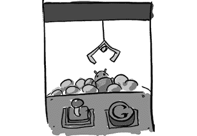

# 第五章：收购

> 他们买下了一支团队和一个梦想。我希望相信我们在这方面执行得相当出色。
> 
> —布莱恩·斯韦特兰德

当 Android 团队与 Google 会面时，拉里·佩奇观察到，Google 收购这家小公司是合乎逻辑的，这将帮助他们构建一个平台，使 Google 能够进入移动市场。

尽管双方原则上达成了共识，但仍有许多细节需要解决。Nick 回忆起 Android 需要与 Google 解决的两个大问题。第一个是资金问题：他们需要就公司的估值和支付方式达成一致，包括初始支付和团队加入后持续的里程碑支付。第二个问题是承诺：Android 希望确保他们能够真正实现最初的目标，而不是被吞并进更大的公司后被遗忘。他们需要 Google 承诺，在收购后继续支持 Android 的努力，并提供持续的内部支持。

谈判始于 2005 年春季。但 Rich Miner 遇到了一个问题：一次家庭度假与这些时间紧迫的会议发生了冲突。他最终将两者同时进行，从英国维尔京群岛的一艘帆船上参加会议。“我必须找到有手机信号的港口。在这两个小时的电话会议期间，我得让所有人都上岸去海滩享受时光，只有我一个人在船上。”

“我们担心的一件事是，‘这对 Google 来说没有战略意义。你们甚至没有开始关注 WAP^(1)或任何移动相关的事情。我们认为这将会非常费力，需要大量资源。如果你们不想做这件事怎么办？我们怎么知道能得到成功所需的资源？’”

拉里·佩奇建议他们去与负责产品和市场的 Google 高管 Jonathan Rosenberg 谈谈。Rich 记得他的建议：“‘Google 与其他公司不同。很多公司，当项目进展不顺利时，他们会投入大量资源。而在 Google，我们更愿意将资源投入到顺利进行的项目中。所以，如果你们按照计划执行，表现好，就会得到更多的资源。’这本质上就是他的信任跳跃演讲；如果我们相信自己，就应该做这件事，因为如果我们执行得好，就能获得资源。”

Android 团队回到了谈判桌（和船上），达成了协议，团队于 2005 年 7 月 11 日开始在 Google 工作。

在安卓团队加入谷歌几周后，他们再次展示了演示文稿。这一次是在谷歌的一次内部会议上，向一群高管展示。安迪和其他团队成员展示了这个新收购团队的计划。斯韦特兰描述了这次会议：“我们展示了我们做的演示。安迪正在逐页讲解。我记得当他讲到盈利模式时，拉里打断了他，说：‘不用担心那个。我希望你们做出最好的手机，其他的事情我们以后再想办法解决。’”
