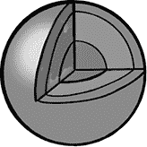
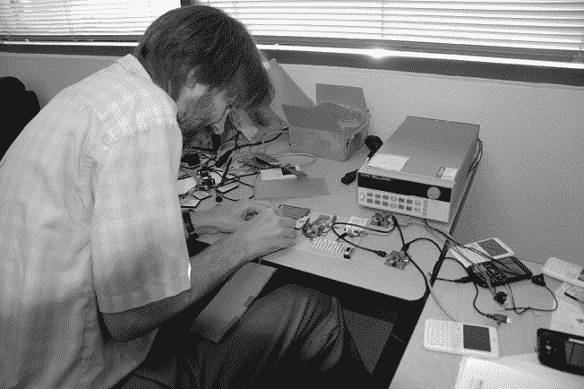
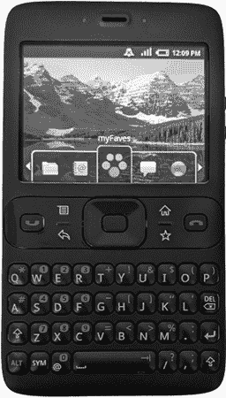
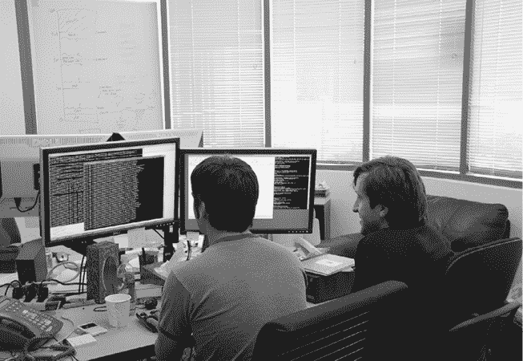
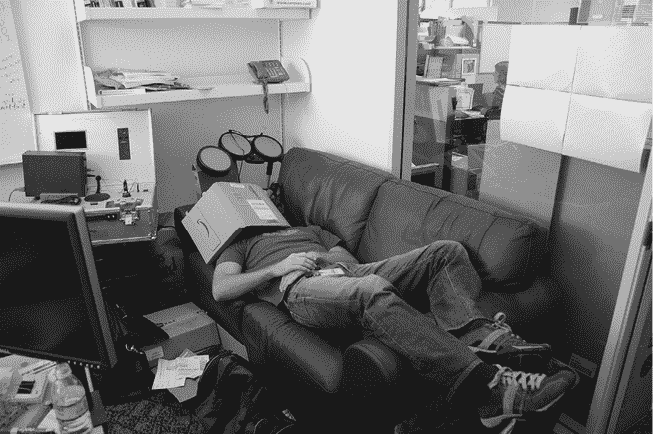
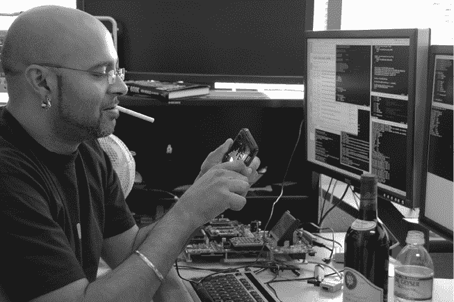
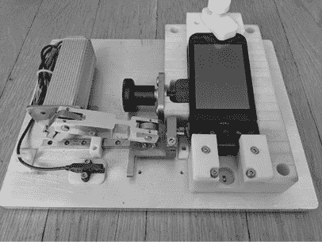
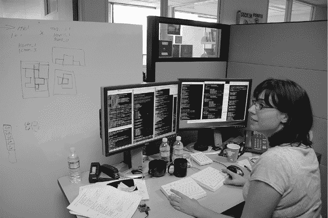
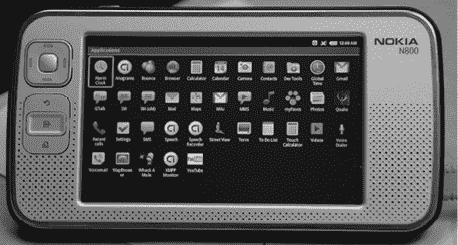
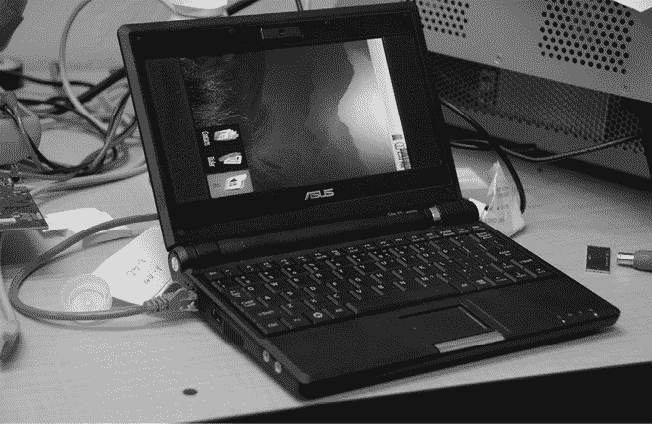

# 第七章：系统团队

系统团队负责软件堆栈的最低层。你可以把他们的工作理解为将手机硬件（如 Sooner、Dream/G1、Droid，以及团队参与过的其他设备）与每个设备上运行的其余软件连接起来。

在 Android（或任何操作系统）上运行的所有内容的最底层是内核。内核是实际硬件与系统其他部分之间的接口， plus 操作系统必须执行的一切任务（如启动系统、创建进程、^(1)管理内存以及处理进程间通信）。如果一部手机是一个房子，那么内核就是基础、线路和墙壁中的管道，它们发出的“滴答滴答”声会让你在半夜醒来，难以重新入睡。

硬件通信由内核中的*设备* *驱动程序* 处理，驱动程序是与设备上实际硬件进行通信的软件模块。例如，为了在屏幕上显示像素，驱动程序在图形软件（它负责计算每个像素的颜色，以便显示图像、文本和按钮等）和物理屏幕硬件之间进行转换。同样，当用户触摸屏幕时，这一操作会转化为原始硬件信号，指示触摸的位置。这些信号会作为*触摸事件*传入系统，然后由软件进行处理，包括希望处理这些事件的应用程序。

系统组的一个基本任务是*启动*，即从拥有一块硬件（比如一部手机，或者甚至是一个手机原型，包含一系列芯片、电路和显示屏）到能够启动 Android 操作系统的过程。

## Brian Swetland 和内核

由于 Swetland 在低层系统方面的背景，以及他是第一个加入的人，因此从第一天起，他就自然地领导了 Android 系统团队。Brian 在收购前就已经开始工作并领导系统团队；他在加入 Google 后继续担任这个角色，随着团队的壮大，仍然负责这个工作。

系统团队的主要工作是让内核在早期的 Android 设备上运行，并为每一款新 Android 设备提供支持。^(2) 当 Android 还是一家初创公司时，内核只需要足够好，以便演示可以运行。但在团队进入 Google 后，他们需要转向构建一个真正的产品：一个完整的操作系统和平台，基于一个坚实的内核。

幸运的是，Swetland 确保了早期的原型内核为后续开发提供了一个不错的起点：“我所做的一切都是朝着最终成为产品的方向进行的。我不相信做完全是一次性的演示。我们当时没有流程分离，^(3) 但我们知道那将走向何方。我们仍然需要内核、引导加载程序、^(4) 图形驱动程序以及所有东西。我们在过程中做了一些演示性质的事情，但我们始终试图规划一条道路，让它不是纯粹的演示。它是朝着一个系统前进的进展。”

Swetland 对 demo-ware 的看法源于他在以前公司中的经历，那时商业部门的人误解了优秀的演示和实际产品之间的区别。“构建纯粹的 demo-ware 的危险在于，某人决定将其发布。然后你就麻烦大了。”

所以，Swetland 负责开发 Android 要建立在其上的内核：“我们继续使用那个[演示用的内核]。它基本上是现成的 Linux 内核，然后在其上进行驱动程序工作。Linux 主线^(5) 中有一些我提交的补丁，上面有我的名字，是在我加入 Google 后提交的。我们在早期并没有太多考虑将东西上游化^(7)。”

与此同时，Swetland 和他的团队开始看到成为 Google 一部分的一些实际优势。在加入 Google 之前，“作为一家小公司与 TI [德州仪器] 合作推进，确实有些痛苦。得到的支持远不如后来从 Google 得到的。” 然后，在加入 Google 后，“从供应商那里获得支持变得极为容易。意外，意外。人们不再讨论我们需要支付多少费用来获得开发板。他们会主动给我们提供硬件，这真的很不错。这就是 Google 的一个大优势，成为一个被认可的品牌，而不是一个默默无闻的小初创公司。人们愿意接起电话并回答你的问题。我们仍然在一些地方需要争取支持，但情况本可以更糟。”

Brian Swetland 的传奇之一是他在 G1 发布前不久“发现”了额外的内存。他在发布前提交了一个修复，扩大了设备上可用的 RAM 从 160MB 增加到 192MB，为操作系统和所有应用程序提供了 20% 更多的内存，这对于这个内存极其紧张的系统来说是一个显著的提升。

诀窍在于他知道在哪里找到那块内存，因为它最初就是他藏起来的。内核负责让其他系统可以使用内存。当他首次在 G1 上启动内核时，他配置它报告的内存量比实际拥有的少。对于其他系统来说，实际上可用的内存比硬件物理上可用的少了 32MB。他这样做的目的是明确知道，如果内存是可用的，每个开发者都会使用它，但如果必须在更紧张的预算下工作，他们就会适应这种限制。

每个人都在这更小的内存池中使软件正常运行，因为那是他们唯一拥有的。当他在 G1 发布前释放了其余的内存时，这意味着可以同时运行更多的应用程序，因为他已将整个系统强行压缩到一个比实际需要的更小的空间。

后来加入团队负责蓝牙的 Nick Pelly 记得，并不是所有人都满意这种做法：“天啊，这给我们带来了多大的戏剧性效果。浏览器团队为了适应（虚假的）内存预算，已经连续好几个星期天都在加班。我记得有一个人怒气冲冲地冲进 Brian 的办公室，嘴里骂骂咧咧，当他‘发现’那额外的内存时。”

## Ficus Kirkpatrick 与驱动程序

内核本身并不需要额外的人员来进行工作。这可能令人惊讶，考虑到内核的复杂性以及它在整个系统中的重要性。但 Linux 已经存在，在不够用的地方，Swetland 就负责解决。但是内核的*驱动程序*，另一方面，确实非常紧缺。系统需要各种各样的硬件，而这些硬件必须由内核来处理。所以当 Ficus Kirkpatrick 加入 Swetland 的团队时，他就开始忙于编写驱动程序，从相机驱动开始。

“我一直专注于操作系统和底层技术，这是我在进入 Android 时最擅长的核心领域。刚开始的第一两年[在 Android 上]，主要做底层系统工作。我们决定使用 Linux，所以没有太多内核方面的工作。于是我做了很多驱动相关的工作。我做了第一个相机驱动，让它在 OMAP 上运行。^(8) 还让音频也能工作。” 一旦音频实现，“我们可以传递缓冲区，或者获取相机数据，那我们接下来要做什么呢？”于是，Ficus 开始着手媒体框架，创建了 API^(9) 和功能，使应用程序能够访问设备的新音频和相机功能。

## Arve Hjønnevåg 与通信

早期缺失的驱动程序之一是无线电^(10) 硬件；新的手机操作系统无法进行电话通话。所以 Swetland 请来了一位擅长通信驱动的专家。

Arve Hjønnevåg 于 2006 年 3 月加入 Swetland 的系统团队。他在 Android 社区中因其…沉默而闻名。他的队友 Rebecca（几页后将出现）说，她有时会请他帮忙处理他们用于管理源代码的系统。她已经习惯了用“再说一次，更多的词”来回应他的回答。

一旦 Arve 使系统与无线电硬件进行通信，他便专注于电源管理。具体来说，既然硬件能够进行电话通话，它还需要在通话过程中保持清醒，不会进入睡眠状态。

当时，Linux 在服务器和桌面系统（包括笔记本）上表现出色。但它并不是为手机而设计的，需要新功能来处理这种新的使用场景。当你合上笔记本电脑的盖子时，你希望它完全进入睡眠状态。你不希望或不需要系统上有任何东西运行，直到你稍后再打开盖子。

但手机是完全不同的。当屏幕关闭时，你不希望它继续做你在主动使用时可能进行的所有操作，但你希望它保持足够清醒，比如，继续进行你正在进行的电话通话^(11)，或者继续播放你正在听的音乐。

所以 Arve 向 Android 的 Linux 内核中加入了*唤醒锁*的概念，以确保屏幕关闭时并不意味着完全关闭。Android 会在屏幕关闭时强制让应用程序和大部分系统进入睡眠状态（因为电池消耗总是一个巨大的问题），但唤醒锁确保系统可以保持清醒状态，如果有事情需要继续进行，即使屏幕关闭了。

Arve 在 2007 年 10 月调试 G1 原型硬件，使用了 TEK 电池仿真器和几台预 G1 设备（“Sooners”）（照片由 Brian Swetland 提供）

Arve 将唤醒锁功能提交到了 Android 版本的 Linux 中。这个功能在 Linux 社区引起了些许波动，因为一些开源社区的坚定支持者将这个功能视为 Android 分叉^(12)Linux 内核的例证。Chris DiBona（他曾处理^(13)很多开源项目）记得在那个时候，他曾在一个 Linux 会议上与社区的人交谈。“有一个人怒不可遏，‘我简直不敢相信你们在做这个！’”

“我当时想，‘三年后，这将不再是问题。在此之前，Linux 社区要么接受我们当前形态的补丁，要么稍微修改它们，可能会换个名字，或者你就会抛弃市场上所有的移动设备。所以和我们合作，做出一个可以接受的方案。否则，我们将继续发布，因为这对我们来说，确保有一个良好的电池续航非常重要。’”

最终，Linux 并没有直接采用 Android 的唤醒锁实现，但他们确实实现了一个解决相同问题的方案。

## Iliyan Malchev 和蓝牙

显示驱动程序是系统团队必须解决的另一个问题。如果无法看到操作系统的显示效果，那么即便是一个强大的操作系统也毫无意义。Iliyan Malchev 在加入团队后开始处理这个问题。

Iliyan 在八岁时就开始学习编程，那时他住在保加利亚，使用的是一种他不懂的语言。父母为家里买了一台电脑，Iliyan 开始玩弄它。“那太神奇了；我敲打键盘，屏幕上发生了事情——这才让我真正对编程产生兴趣。我当时不知道自己在做什么。这并不是说我马上就成了一个程序员。在保加利亚，一切都使用西里尔字母。而编程代码都是拉丁字母，比如程序清单。我既不会说英语，也不懂拉丁字母，所以我只能一个字母一个字母地抄。”

Iliyan 去美国上大学，后来在高通公司工作了几年。这段经历对他后来的 Android 工作，尤其是对系统团队的工作帮助巨大，因为 Android 设备大量使用高通的硬件。

Iliyan 于 2006 年 5 月加入了 Swetland 的系统团队。他的第一个项目是让副显示器工作：“[Swetland] 给我扔了一个有两个显示屏的翻盖手机。他说，‘让外部显示器工作。’作为 Swetland，他直接在没有任何文档的情况下将 Linux 系统启动在这台设备上。我猜他只是想给我点事情做，好让我不再烦他。”

在那个项目之后，Sooner 设备^(14)开始进入团队。Iliyan 负责让设备上的硬件输入正常工作：包括方向键（上/下/左/右箭头）和轨迹球。与此同时，他注意到 Android 系统越来越庞大，已无法适应设备有限的存储空间，而且系统持续增长，因此他花时间优化系统大小，以便让它能够适配。

配备硬件键盘、方向键和许多按钮的 Soonerc 设备

然后他开始研究蓝牙。这包括使蓝牙硬件的驱动程序能够正常工作，以及为应用程序提供与设备通信的蓝牙软件。“这是 Android 上的第一版蓝牙软件，而它……并不好。[蓝牙]是一个糟糕的标准。他们发明了一个像互联网一样规模和复杂度的东西，结果只是为了支持无线耳机。它被过度设计了。我做完这一部分后，将它交给了另一位工程师 Nick Pelly。Nick 接手了蓝牙堆栈并让它正常工作。他值得所有的荣誉。”

## Nick Pelly 和蓝牙

Nick 在澳大利亚的大学学习计算机科学，但并没有认为自己会以编程为生。毕业后，他打算开始一份在 Telstra 的通信工程工作，并计划在全球旅行一年的间隙后回去。

但当他在加利福尼亚旅行时，他在 Telstra 的工作告吹了，所以他需要另寻出路。他一直对硅谷很感兴趣，所以他迅速在该地区投出了求职信息。只有一家公司回复了他：Google。幸运的是，他拿到了这份工作，并于 2006 年加入了 Google 搜索设备（GSA）团队。

Ficus 和 Iliyan 调试…… 2007 年 8 月的某个事情（照片由 Brian Swetland 提供）

GSA 是 Google 早期认为能够赚到钱的产品之一，当时他们的主要产品是搜索引擎。他们向公司销售一种机架式硬件，用来索引公司内部的文档。它将 Google 的互联网搜索能力扩展到公司的内部网站。但后来 Google 进入了广告业务，GSA 很快就不再是焦点。当 Nick 加入团队时，这个产品已经不像以前那样被积极追求，但 Nick 承认：“这对一个新工程师来说，是学习 Google 搜索堆栈的绝佳方式。”

2007 年夏天，他参加了 Android 团队首次向 Google 其他部门展示他们正在做的事情。Nick 被深深吸引。“我没有相关背景。我是团队中最早加入的几个人之一，我之前没做过消费电子产品，也没有做过像 San、Rebecca 和 Mike 那样从 Google 平台团队出来的人做过平台级别的工作。我只有一年半的专业经验。”

“但是我来到他们面前，说：‘这太棒了。我什么都愿意做，你们需要我帮忙什么？’”

“Brian 说：‘蓝牙！’”

“我知道他们太有雄心壮志了，最终会失败。我告诉我的女朋友和妈妈：‘根本行不通。但是这些人很棒，我会学到很多东西。’”

Nick 承接了蓝牙项目，并迅速掌握了它。“这真是一个陡峭的学习曲线，一旦我开始理解，就再也脱不了身了。”他不仅需要让蓝牙作为驱动程序工作，还要在 Android 的平台和应用层中让它正常运作。这个工作的最困难、也是最持续的部分，是要让它与世界上各种各样的蓝牙外设正确配合。

“大多数蓝牙外设都带有大量‘怪癖’（bug），而且永远不会得到固件更新。所以我们不得不绕过这些问题。我想出了一个简单的策略——每当发现一个蓝牙互操作性 bug 时，我就会购买该设备，加入到我桌子上的设备集合中，并把它纳入我的手动测试中。不久后，我有两张额外的桌子，堆满了蓝牙设备。我会保持它们都插着充电——这样我就不会丢失那些不常见的充电器，而且测试前也不需要等设备充电。多次，我不得不把这些设备清空，因为一旦听说有防火管理员的检查，我们得赶紧收起所有串联的充电器。”

“汽车套件有点难，因为你无法在办公室放下整辆车。但我很快发现，主要的汽车制造商很乐意给我寄来包含汽车信息娱乐系统核心部件的 Pelican 箱子，这样我就可以在办公桌上测试相关的硬件。这些箱子堆满了我的桌子，甚至溢出了走廊的角落。”

Nick 的经理是 Brian Swetland。像许多早期 Android 时代的经理一样，Swetland 并不太参与日常操作。这包括他抵制与团队成员的同步会议，正如 Nick 回忆的那样：“我记得几周后，我问我们是否会有 1 对 1 的会议。他似乎对这个问题不太高兴，但说我可以自己安排一个。我确实安排了，他迟到了十分钟，第一句话就是‘我#%&()#讨厌 1 对 1 的会议......’从那以后，我们再也没有开过 1 对 1 的会议。”

“然而，我记得 Brian 是我最喜欢的经理之一。他的系统知识无可匹敌。他在职责和范围上慷慨大方，并且没有微观管理。他全身心投入到手机的开发中，对员工非常忠诚且关怀。为 Brian 工作是我职业生涯中的亮点。”

2008 年 3 月，Nick 在办公室小睡。左上角是一个汽车信息娱乐系统，仍在汽车制造商提供的保护外壳内。（图片由 Brian Swetland 提供）

## San Mehat 和 SD 机器人

> 百度高温，正值夏季，我看着这部电话，听着那个人一次又一次地说着废话。
> 
> —San Mehat

在驱动程序和系统启动方面，San Mehat 的帮助为我们带来了更多支持。San 于 2007 年加入了 Swetland 的团队，与 Nick 差不多是在 SDK 发布前的那段时间。

San 小时候通过在键盘上随机敲打来学习编程。他的父母在地下室开了一家电脑店，他就在那里的电脑上玩。“有一天我很沮丧，就开始猛敲键盘。结果不小心按到了 ctrl-C，屏幕跳出了一个提示框，我根本不知道那是什么。于是我开始输入一些东西，结果显示‘语法错误’。我当时就想，‘这是什么意思？’我再输入一些东西，它说，‘未定义函数错误。’我想，‘这是什么意思？’”他的表哥建议他输入‘LIST’，结果他正在玩的游戏的 BASIC 代码就显示在了屏幕上。

San 的编程学习方法最终成为了构建驱动程序的宝贵经验。编写硬件驱动程序的大部分工作就是弄清楚硬件能做什么，以及如何让它做那些事。这项工作大部分是实验，目的是理解硬件如何工作，和与它沟通的规则和协议是什么。San 从一开始就在自己家地下室的电脑上随便敲打，看看会发生什么，从而在摸索这些规则。

他在童年时期继续通过兴趣项目进行编程教育，例如破解软件版权保护机制。他这样做是因为当时加拿大的软件市场不发达，自己有限的游戏资源只能通过这种方式解决。他在高中期间继续编程，之后通过为芯片和其他硬件系统开发内核和驱动程序，始终在学习如何让软件与硬件进行对话。

San 没有上大学。讽刺的是，正是为了向孩子们展示上大学的好处而设立的实习项目，最终让他决定不去上大学。

他通过一个实习（后来转为暑期工作）与贝尔北方研究公司（BNR）一起做 CPU 模拟器，在那里他学习了新的编程语言和处理器内部原理。他对这项工作非常热衷，甚至想最终留在 BNR 工作，但他意识到自己的高中成绩永远无法让他进入那种能为他提供工作的大学。所以他决定跳过这一环节，自己独立完成，于是和一些朋友一起创办了一个互联网服务提供商（ISP）。在此过程中，他一直在黑客操作系统和各种硬件，积累了成为一名优秀驱动开发人员所需的技能。

“给我一块你不知道它如何工作的奇怪硬件，再给我一段能让它工作的软件。通过拆解软件和分析硬件，我可以反向工程并创建另一个有效的驱动程序。”

2005 年，San 加入了谷歌的平台组，负责为定制硬件编写驱动程序。2007 年，他转到安卓，加入了 Swetland 的系统团队。

“我加入是为了工作在 G1 上。最初，这个工作形式是‘frankenboard’，高通的‘surfboard’，这是一个大而疯狂的原型手机板，搭载了 MSM 芯片组^(17)，并且进行了大范围的扩展。它看起来像一部手机，但被各种测试点搞得像是爆炸开了一样，可以将代码加载到里面并做各种实验。”

2008 年 2 月，San 正在对一块电池进行热测试（用打火机），背景中桌子上是用于 G1 处理器的高通“surfboard”。（图片由 Brian Swetland 提供。）

当他加入团队时，San 的主要工作是引导启动。“当时的引导启动是非常低级的工作，涉及到时钟控制、电源轨和电源控制。”那个第一个系统，G1，异常复杂。它实际上有*两个*CPU，一个由高通的控制芯片（ARM 9）控制，另一个由安卓（ARM 11）控制。启动 G1 需要先启动高通芯片，再启动安卓芯片。

“我的工作是弄清楚如何构建驱动程序。我必须弄清楚如何让这两者互相通信。然后接上时钟控制，接上电源轨道，以便我们可以开始启动外设，比如 SD^(18)控制器，以便 SD 卡能够启用，再比如图形控制器。所以我做了所有底层的琐碎工作，然后转向了 SD 卡。”

G1 的 SD 卡带来了一个有趣的问题。首先，SD 卡有两个不同的用途：存储和 Wi-Fi。SD 卡大多数被认为是可拆卸存储。但当时，SD 卡有时也被用来提供 Wi-Fi（卡上会有一个 Wi-Fi 芯片，而不是存储硬件）。

让 SD 卡工作很重要，因为它控制了这两个方面。但这很困难。“没有人（安卓团队的人）知道 SD 卡是怎么工作的。你无法获得 SD 卡的规格说明，因为要获得规格说明，你必须加入 SD 协会，而他们不会让你做任何开源的事情。^(19)所以我不得不对 SD 卡、SD 卡协议和 SD IO 协议（用于 Wi-Fi）进行逆向工程，并逆向工程大量驱动程序，弄清楚如何编写我自己的驱动程序。我花了几个月时间弄清楚如何让它工作。”

San 让 SD 卡正常工作（包括存储和 Wi-Fi），但出现了一个问题。G1 的 SD 卡对用户来说非常容易接触，因此可以随时插入或拔出。“有人决定将 SD 卡放在侧面，支持热插拔，是个好主意。如果你试着在 Linux 系统中插拔硬盘，你会发现这很麻烦。这是最糟糕的：设备几乎没有任何警告就被拔出。你可能正在写入磁盘。也许你三十秒前拍了一张照片，那些缓存数据仍然在操作系统页面缓存中，它们还不会被写入，可能还要等三十秒。”

G1 的 SD 卡槽有个盖子，用户必须先打开这个盖子才能拔出卡片。打开这个盖子会向系统发送一个信号，这个信号可以用作一个提示，快速让系统进入稳定状态，以防用户拔出卡片。但找到代码中需要执行此操作的所有地方是非常困难的。更糟糕的是，调试这个情况需要很多重复的拔卡操作。一次又一次，反复操作。最终，San 请求了帮助。

他联系了 Andy：“‘嘿，你对机器人感兴趣。我们有没有人能帮我做一个可以做这个的机器人？’他把我介绍给了某个人。我告诉他们我需要什么：一个小机器人，通过软件控制它的进出，然后我会创建一个闭环测试。这让我能够追踪到所有这些 bug。”San 利用 SD 卡机器人一个一个地追踪这些 bug，直到系统稳定运行。

San 的 SD 卡机器人，通过不断地将卡片插入和拔出插槽来强制发生崩溃，方便 San 进行调试（图片由 San Mehat 提供）。

## G1 发布后：Sapphire 和 Droid

G1 发布后，San 开始了代号为“Sapphire”的设备开发工作，最终成为 T-Mobile G2 MyTouch。这个设备的主要任务是提升性能。“它慢得要死。虽然比 G1 稍微快一点，但与此同时，Romain^(20)，真是好人，和平台及应用团队的其他人都在上面堆积着越来越厚的软件。所以切换应用时，总是卡顿和延迟。我花了很多时间在这个项目上优化内核。所以基本上就是不断地提升性能，重复这个过程。”

G2 发布后，San 的下一个挑战是摩托罗拉 Droid。他必须处理的一个问题是电源关闭场景，这个问题非常复杂。“这些小家伙们有大约三十个不同的电源域，它们都是单独控制的。要关闭设备，必须非常小心地依次操作：先关*这个*，等一段时间，再关*这个*，然后关*这个*，最后关*这个*……一路上，手机变得越来越傻。”

“Droid 的故障案例是这样的：手机进入休眠状态，或者你关闭它的时候，恰巧接到一个电话，结果手机根本不会响铃。我们会进入这些电源状态，然后停止监听调制解调器，因为我们会关闭它。调制解调器会试图唤醒我们，但我们不再监听调制解调器了；我们已经决定要睡觉了。所以我们睡着了，而调制解调器就在那边‘可是，可是，可是……！’”

“我们最终意识到，硬件缺少了一根线，它应该连接调制解调器和 CPU，用来告知 CPU 唤醒。”因为已经太晚了^(21)，无法更改硬件，所以他们最终通过在其他系统组件的线路上发送唤醒信号来解决问题。

在工作中，San 还遇到了一个问题，涉及 Droid 的 Wi-Fi 系统，它导致视频播放时出现卡顿。“那次美国小姐选美比赛里有个关于‘男人与女人结婚’的非常有争议的评论。广志走进我的办公室，说，‘我们遇到了一个大问题，YouTube 视频在 Wi-Fi 下会卡顿。’我说，‘好吧，没问题，可能是 DMA^(22)的问题。给我一段参考视频。’”

广志给了他视频和故障发生的时间，恰好是美国小姐选美比赛中的那个尴尬片段。San 花了两天时间调试，反复听同一段视频。“每当我听到有人提到美国小姐时，我就会有一种强烈的[感觉]，仿佛我正在沃尔纳特溪，气温有一百度，正值夏天，我盯着这部手机，听着这个人不断地说废话。”

## Rebecca Zavin 和这款不被喜爱的设备

> 我们建了这个保险箱，只是忘了做墙壁。
> 
> —Rebecca Zavin

系统团队需要更多的支持来推动 1.0 版本的发布。Rebecca Zavin 于 2008 年初加入了团队。

Rebecca 开始编程的时间比她的许多 Android 团队成员要晚；她直到大学才真正接触编程。她一直认为自己会成为一名医生，于是去大学学化学工程，准备攻读医学院预科。然而，她在学习过程中发现自己讨厌化学。与此同时，她在大学的计算机科学系找到了一份工作，帮助设置计算机实验室。她开始越来越多地待在那个系里。一旦她开始上计算机科学的课程，就再也离不开了。

大学毕业后，Rebecca 进入了研究生院，最终加入了 Google，与 San 一起在平台团队工作。在 San 离开她的团队加入 Android 团队约一年后，Rebecca 也开始寻求新的挑战。“我想要有点不舒服，想要有点挑战。”她于 2008 年 1 月加入了 Swetland 的系统团队，距离 SDK 发布仅两个月，正好赶上了 1.0 版本的长时间推进。

在新团队的第一天，她就在办公室调试内核中的一个问题，直到晚上 9 点之后。“Swetland 当时说，‘好吧，这个肯定能成功。’”

团队刚刚发布了 SDK，现在他们需要让一切在真正的设备上运行。Rebecca 最初负责为 Android 开发显示驱动程序。Swetland 给了她一个最小化的驱动程序作为起点。在调试了一段时间后，她抱怨说驱动程序非常有漏洞。他告诉她这只是一个原型，实际上不应该使用它。她说，“我真希望你能告诉我这一点。我以为你知道自己在做什么。”

在成功让驱动程序工作之后，Rebecca 开始着手处理内存子系统，并在接下来的几年里继续工作。她的目标是让位数据通过系统流动时，复制的次数尽可能少（因为复制操作代价很高）。例如，当相机拍照时，会有很多像素存储在某个缓冲区中，这些像素需要传送到 GPU（图形处理单元），再到视频解码器，最后到显示内存。最简单的实现方法是将像素复制到每个新的子系统中。这样需要很长时间，而且会消耗大量内存，尤其是在那时的相机还比较有限的情况下。最终，她让系统实现了零复制。

在 2008 年底 G1 发布后，Rebecca 开始着手下一个设备：摩托罗拉 Droid。

Droid 是一个不被喜爱的项目和设备。团队的其他成员正在开发代号为 Passion 的设备，后来它成为了 Nexus One。Passion 将会是一款 Google 手机，拥有所有最新最强的功能，团队对此充满了兴奋。然后就有了这款摩托罗拉设备。

“Rebecca 说，‘没有人愿意碰它。它很丑。大家都对 Nexus One 很兴奋。至于 Droid？我们只能自生自灭。不久之后，它成了团队的大事，因为它成了第一个 Verizon 的发布。’”^(23)

“芯片组来自 TI，TI 有这些芯片的驱动程序。但是诺基亚有一版替代的驱动实现，Rebecca 建议他们应该从这个实现开始。”

“我们和摩托罗拉开了一个三方会议，我告诉他们，‘我认为我们不应该使用这个 TI 内核；它很乱。我觉得我们应该使用这个诺基亚内核。’然后我接到了 TI 销售员的电话，他说，‘摩托罗拉打电话给我，说你说我们的代码很糟糕。’”

“我说，‘我觉得我在会议中没有使用任何脏话。’”

## 那个尴尬的 root 漏洞

“早期 Android 开发的一个标志性特点就是团队执行的速度非常快。从零到 1.0 只用了三年，这真是令人吃惊，尤其是那个首次发布版本就包含了确保 Android 很快成为全球最广泛分发的操作系统之一的大部分基础功能。”

“我发现自己把咖啡洒到身上的概率和我移动的速度成正比。执行速度是有权衡的。在那些早期，大家都跑得很快，以至于有时忽略了在一个更小心、更慢的环境中本可以发现的问题。一个典型的例子就是那个著名的（至少在内部是）‘功能’，就是你可以从聊天应用重启手机。”

“Jeff Sharkey 和 Kenny Root 是 1.0 发布时的外部开发者（他们后来都被招聘到 Android 团队）。他们在那次发布之前就开始折腾 Android。Kenny 开发了一个 SSH 客户端（一个允许你登录远程计算机的应用）。Kenny 的版本是针对早期的、1.0 之前的 SDK 开发的。Jeff 更新了它，使其可以兼容后来的 Android 版本，并添加了更多功能。最终他们将它发布为 ConnectBot，这是 Android Market 上的第一个应用之一，^(24)至今仍是顶级 SSH 客户端。”

“当他们第一次开发 ConnectBot 时，他们收到了用户的一些奇怪的 bug 报告。Jeff 说，‘我们收到了一条奇怪的 bug 报告，有人说他们通过 SSH 连接到家里的服务器，输入 `reboot` 后，手机就重启了。我们以为他们一定是在抽什么东西，结果把它标记为不可重现。’”^(25)

“但这个漏洞实际上完全有效，而且对 Android 来说，的确有点可怕。”

“Rebecca Zavin 说，‘人们发现，如果你在 Gchat 中输入 `root`^(26)，你就可以获得手机的 root 权限。然后人们意识到，当你输入 `shutdown` 或 `reboot` 时，它也能工作。’”

Rebecca 解释了这个 bug 是怎么产生的。“键盘事件被发送到一个一直打开的控制台。你总是想要有一个串行控制台^(28)。那很方便。所以我们把 root 控制台放在那里调试 . . . 本该做个记录去关掉它。”

“有一段时间，我们遇到一个持续存在的 bug，之前我们支持帧缓冲控制台，所以你可以切换到一种模式，看到日志，和你在 Linux PC 上一样。我们有一个经常出现的 bug，就是你会看到左上角有一个黑色方块。那是一个计时器问题。某个竞争条件^(29)会导致光标在你返回图形界面时闪烁。所以我会听到 Steve Horowitz [对我说]，‘那个黑色方块。我有一个黑色方块！’

“在花了很多时间试图修复这个问题后，我想，‘我们干脆关掉帧缓冲控制台算了。我们为什么要在设备屏幕上看到内核日志？这太傻了。关掉它，我们就不用再处理这个问题了。’

“但是当我们关掉控制台时，它仍然在那儿[只是看不见]。我们都像是：‘糟糕，哎呀！’

“我们建了这个保险箱。我们只是忘了加墙。”

Jeff 说，“输入 `reboot` 命令到 ConnectBot 的人，实际上是在将它同时输入到他们的远程服务器和手机上，这解释了意外重启的原因。”

Nick Pelly 记得那个 bug：“我们以为那是某个聪明的黑客搞出来的微妙技巧。结果不是，不是：你每按下一个键，都会进入 root shell。”

Kenny Root 补充道，“这可能为 G1 的第一个‘root’打开了道路，但我保证那不是以我名字命名的。”

Rebecca 在 2008 年 3 月调试（照片由 Brian Swetland 提供）

还有其他一些例子，Android 在过程中错过了某些细节；大家都在非常非常快地奔跑，忙于把事情做起来。幸运的是，平台足够持久，团队能够随着时间推移回过头来修复这些问题。至少是我们知道的那些。

## Mike Chan 和 B 团队

> 我们觉得自己将要改变世界，结果我们做到了。
> 
> —Mike Chan

在 1.0 版本之前加入系统团队的最后一位成员是 Mike Chan。

Mike 从中学开始就想成为一名程序员。当他看到游戏 *Lode Runner* 时，他就想长大后编写视频游戏。然而，这个梦想并没有持续多久；在高中时，他更感兴趣的是计算机系统的管理。但在大学时，他上了编程课，重新回到了成为程序员的初衷。他毕业后找到的第一份工作是在 Google，这决定了他的命运。

他在 2006 年加入了 Google，加入了 San 和 Rebecca 所在的平台团队。像他们一样，他也最终转入了 Android 团队，并在 2008 年 2 月，Rebecca 后一个月到达。SDK 已经发布，但仍有很多工作要做，才能将产品推向 1.0 版本。

## 安全保护

Mike 的启动项目是在发布 1.0 版本之前使 Android 变得安全。没有压力。

Android 从一开始就考虑了安全性。Swetland 特别希望为 Android 实现一个比他在 Danger 工作时使用的更安全的模型。那些 Hiptop 设备的资源更加紧张，并且没有硬件设施来保护应用程序之间的安全，所以它们依赖软件机制。Brian 坚持要求所有 Android 硬件必须具备 MMU^(30)，以提供硬件安全保护。

平台上安全的另一个重要方面是将所有应用程序视为设备上的独立“用户”。在其他操作系统中，用户之间会相互保护，但不会保护自己。所以，例如，你可以在 PC 上创建一个用户账户，且你在该账户中创建的数据会受到系统中其他用户的保护。然而，任何你安装的应用程序都会以你本人身份运行，因此所有的应用程序都可以访问你账户中的所有数据。用户与其安装的所有应用程序之间存在隐性信任。

但是，Android 工程师认为（这完全正确）设备上的应用程序不应当天生就值得信任。因此，Brian 的设计让每个应用程序作为设备上的独立、唯一的用户来运行，而不是以安装该应用程序的用户身份运行。这种方法通过 Linux 内核机制中的用户 ID（UID）保证了应用程序无法自动访问同一设备上任何其他应用程序的数据，即使这些应用程序是由同一设备所有者安装的。Brian 提供了一个低级服务来创建、销毁或以某个用户身份运行应用程序。框架团队的 Dianne Hackborn 将此服务与更高层次的应用程序权限集成，并构建了应用程序 UID 管理的策略。

这种硬件保护的进程和将应用程序视为用户的系统大致已经设置并运行，但还有许多细节需要打磨。例如，虽然应用程序进程相互之间是受保护的，但许多内置系统进程是以具有提升权限的用户身份运行，这使得它们能访问设备上超出其严格需要的数据。

与此同时，iPhone 最近被越狱过^(31)，这成为了一个很好的提醒，促使他们在发布 1.0 之前完成这项安全工作。

迈克认为这个项目不仅是学习安卓操作系统和安全模型的绝佳入门，更是对斯韦特兰管理风格的初步了解，“布赖恩有一种有趣的方式，把你直接扔进深水区，看你能否自救。”

作为入门项目来说，这个算是……一个大项目。不仅有压力要完成，因为显然必须在发布第一个设备之前完成，而且这件事影响到当时在安卓平台上构建平台和应用的所有其他团队。压力山大。“当我试图做出改变时，我左冲右突，搞得一团糟。所有团队都在抱怨某些东西坏了，而我在尽快修复这些问题，尽量预见到它们。”

“当时的安卓工程总监史蒂夫·霍罗威茨一直在盯着我。‘你把构建弄坏了！’我说，‘我知道，史蒂夫，我知道我把构建弄坏了，我正在修复它。你站在那里并不会让我修得更快。’”

“那简直是一次火中取栗。学了很多东西，涉及了系统的各个部分，最后把所有东西都弄坏了。”

迈克的下一个项目是提高电池寿命。当时，在 G1 发布之前，电池寿命非常糟糕。更糟糕的是，所有团队都在互相指责这个问题。“应用团队会怪框架团队，框架团队会怪系统团队，系统团队则会怪应用团队。”

安迪并不在乎是谁的错，他只是希望问题能尽快解决。他把问题交给了斯韦特兰，斯韦特兰又把问题交给了迈克。

布赖恩问道：“你对电源管理了解多少？”

迈克说：“布赖恩，我什么都不知道。”

“那么，我建议你开始学习，因为你现在负责这个事情了。”

迈克很快意识到问题的一部分在于预期。“我跟大家解释的问题是：你们告诉我，我们的电池寿命必须和 iPhone 一样好。我们有能力在后台运行所有这些应用，^(32)我们的硬件有更大的屏幕，我们运行后台任务，我们是第一个支持 3G 的，而且我们的电池物理上更小。”

迈克做的其中一项主要工作是向系统中添加仪表，以了解电源的去向。在此之前，他们能看到电池在消耗，但不知道是谁在做什么，所以很难找到并修复根本问题。一旦他们知道了问题所在，就可以去解决它们。

Mike 还与框架团队的 Dianne 进行了持续的辩论。许多电池问题源自应用程序中的不良行为，比如长时间持有唤醒锁^(33)，但用户通常会归咎于 Android。“我一直在推动一种更明确的系统，如果一个应用进入后台，系统就强制释放资源。也就是说，平台的灵活性减少了。Dianne 坚信这不是平台的问题，而是开发者的问题，正确的解决方案是教育所有这些应用开发者。”

“这是我们争论了多年的问题。”

Mike 参与的另一个项目是*调速器*。

操作系统中的调速器（governor）是通过改变 CPU 的速度或频率来节省电力的机制。例如，如果 CPU 运行得非常快，它会消耗更多的电力，从而消耗更多的电池。但是如果设备此时处于空闲状态，这就是一种巨大的不必要的电池浪费。调速器的作用就是检测这些不同的运行模式，并相应地调整 CPU 的频率。

当 G1 发布时，唯一有效的调速器是*ondemand*调速器，它是核心 Linux 的一部分。这是一个简单的系统，只有两种设置：全速和空闲。这总比什么都没有要好，但对于 Android 来说还不够，特别是因为该调速器的启发式设置是为 Linux 在服务器或桌面计算机上运行时调优的，而不是为移动设备这个受限的环境设计的。

Mike 在 1.0 的后期开始玩调速器，但在 Andy 向 Google 高层展示演示的过程中发生了不幸事件后，他不得不将这个项目搁置一旁。

Mike 提交了一个更改，不小心使手机变得非常缓慢。“我在 master 版本上实验了保守型调速器，这种调速器极度倾向于通过牺牲性能来节省电力，结果手机几乎无法使用。”

与此同时，Andy 和 Larry、Sergey 进行了月度回顾，向他们展示了该项目的进展。Andy 将一个 master 版本的构建刷入手机，然后去参加他的会议。

在会议上，他展示了使用该版本的演示，但…并不顺利。

“他回来了，气得不行。”

这次事件对 Mike 来说是一个很好的学习经验。一方面，他学会了在将更改推送给可能使用该构建的每个人之前，必须先进行测试。但另一方面，他也意识到拥有一个支持自己的经理是多么重要。

“Brian 在走廊上和 Andy 面对面争吵，喊着说使用 master 版本没有经过任何测试是他的错。我们做这些工作是为了按时推出 Android，我们没有时间确保你的演示完美无缺。我从没见过有人对 Andy 大声吼叫过，他从未提到我的名字，他知道这是我的代码。”

“他后来回到我的桌前，平静地告诉我撤回所有更改，并且在我们发布之后才去处理这个问题。”

## B 团队

Mike 加入了 Rebecca 的 Droid 项目。系统团队在致力于 Passion（后来的 Nexus One）和 Droid 的人员之间进行了分工。Swetland 回忆道：“我当时决定，我们需要把系统小组分成两个团队，将工作分配到 N1 和 Droid 之间，并在团队会议上说，‘我们需要像 A 队和——’。在我还没来得及完善这个说法时，Erik^(36)接过话说‘B 队！’，令我震惊的是，他们居然把这个作为了荣誉徽章（可能也是因为它让我感到尴尬）。”参与 Passion 项目的人大多对该硬件更为熟悉。但 Rebecca 开玩笑说，Droid 项目有“B 队”，因为他们在做一个团队不太感兴趣的设备。Passion 当时得到了团队的所有喜爱和，嗯，*激情*。

Mike 说道：“每个人都认为 Nexus 会是那个将要推出的超级手机：第一款 Google 品牌的手机，没有键盘，设计非常流畅，采用 OLED 屏幕。这是一款很棒的手机。”

与此同时，Droid 硬件设计当时让人失望。“一直都在炒作设计会非常棒。当他们最终揭开设计的面纱时，它是一个丑陋的方形东西。我记得我当时想，这只是初步的原型吧。之后会有一个新的版本，带着最终的设计吧？不，这是我们要出货的设计。”

最终，Verizon 对 Droid 的品牌宣传和市场营销远远超过了 Google 对 Nexus One 的任何投入。更多内容见第四十五章（“Droid 做到了”）。

## 构建一个稳健的系统

在继续处理其余的软件堆栈之前，值得反思一下系统团队的做法和成就。首先，他们所构建的一切对于操作系统能够启动，更不用说正常运行，都是至关重要的。此外，他们处理工作的方式也体现了 Android 的一个总体主题，即完成一项完整（即便是快速完成）的工作，不仅满足当时的需求，而且展望未来，期待 Android 最终会变成什么样子（或者说是他们所希望的样子）。

例如，他们不仅仅是关注当前在开发中的一两款设备。在 Android 的其他团队专注于开发 Sooner 和 Dream 手机，准备 1.0 版本之前的工作时，系统团队则在让 Android 适配完全不同的设备，使其在未来的制造商世界中更加稳健和灵活，能够应对完全不同的硬件。

此外，团队不仅仅是将硬件厂商的驱动程序拼接在一起并交付结果；他们从零开始编写了一切，确保其稳定和稳健。

Nick 谈到团队中的这种动态：“为什么系统团队不是一个集成团队呢？集成更像是把各个部分连接起来让它们工作，从硬件厂商那里拿到驱动程序并让 Android 在这些硬件上运行，而不是自己写驱动程序。”

Android 移植到这款诺基亚设备上被斯韦特兰称为“假期移植”，它发生在 2007 年的感恩节周末。（图片由布赖恩·斯韦特兰提供。）

“我们当时写了一大堆设备驱动程序，很多其他公司是不会写这些的；他们只是会拿取硅芯片提供商交付的参考 Linux 驱动程序。那时候，参考 Linux 驱动程序真是糟透了。一个关键的决策就是我们决定不只是接受那些参考驱动，而是要重写它们，使其达到一个可以上传并且我们可以支持、维护的质量。其余的生态系统可以跟随我们的领导，分叉我们的驱动程序，或者直接重用它们。”

2008 年 3 月，Android 移植到 PC 上。横屏笔记本电脑屏幕并不能很好地展示竖屏模式的手机屏幕。（图片由布赖恩·斯韦特兰提供。）

“我们最终得到了质量更高的驱动程序。当然，我们也有一些 bug，但最终我们达到了稳定性。如果你有糟糕的驱动程序，它会让你失去稳定性——外设会随机失败，设备会重启。而且没有好的驱动程序、没有唤醒锁和类似的东西，很难正确地做电源管理；你就会把电池寿命摧毁。”

“这是我认为布赖恩在很大程度上负责的一个关键决策，它使我们走上了正确的道路。我们在这里构建一个高质量的代码库，做事的方式也是正确的。”
