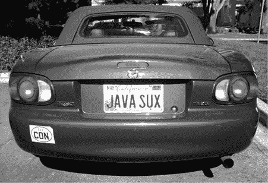
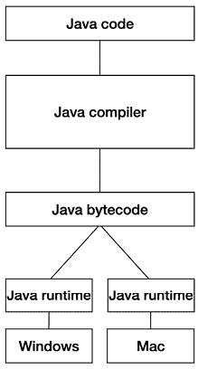
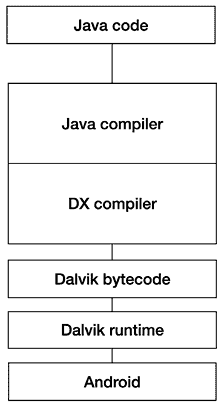

# 第八章：Java

> 我们从圣诞假期回来。我很早就到达，精神焕发，与 Rubin 交谈。他告诉我，他和 Brian 在假期期间共进晚餐，并决定我们将使用 Java 来编写所有内容。
> 
> —乔·奥诺拉托

## 语言选择

选择一个编程语言来开发 Android，可能比表面看起来更紧密地与 Android 的成长有关。毕竟，编程语言只是向计算机输入信息的媒介：这真的那么重要吗？

是的，的确如此。经验丰富的程序员可以并且确实会不断学习新语言。但即使是这些专家，也会形成一些模式，使得他们在熟悉的语言上更加高效。而中间件的效果，或者开发者可以在项目间迁移的工具库，也是不可忽视的。一个程序员可以在一个项目中依赖某些库^(1)，然后在其他项目中继续使用它，这意味着他们在每个新项目中都能更加高效和富有生产力，因为他们无需重新发明轮子。

选择使用 Java 编程语言^(2)是一个重要决策，因为在 Android 发布时，Java 是全球软件开发者广泛使用的主要语言之一。Android 允许这些开发者利用他们现有的语言技能来开发应用，这意味着许多开发者可以避免学习新语言所需的上手时间。

但在 Android 早期，这个语言选择并不是显而易见的，也没有立即确定。实际上，内部讨论了三种语言。

首先是 JavaScript。事实上，最初只有*JavaScript*，因为 Android 最初是一个基于网络编程语言编写的桌面应用。

JavaScript 是开发者用来编写网页代码的编程语言。当我们在浏览器页面上看到某些动画时，这些动画通常是由 JavaScript 代码驱动的。但 JavaScript 作为一种编程语言，稍显*凌乱*。对于开发者来说，使用 JavaScript 让东西基本上能工作很容易，但它的一些基本概念^(3)使得编写大型系统变得更加困难。

在 Android 的真实平台开发开始后，选择使用哪种语言成为了一个问题：JavaScript、C++，还是 Java。

C++ 很有吸引力，因为许多开发者熟悉它，并且它至今仍用于低级编程任务。C++ 开发者对应用程序操作的许多重要方面拥有很大的控制权，例如内存分配。但另一方面，开发者必须在应用程序中管理这些信息。如果他们分配了内存来存储一个对象（比如图像），他们必须确保在使用完后释放内存。不这样做（这是软件中非常常见的问题）可能会导致 *内存* *泄漏*，即内存被不断浪费，应用程序会无限膨胀，直到耗尽系统中可用的所有内存，最终由于系统没有更多内存可用而崩溃。

Java 是一种围绕 *运行时* 或 *虚拟机 (VM)* 概念构建的编程语言，它处理所有 C++ 程序员必须自行处理的内存管理琐事。在上面的图像示例中，Java 程序员只需加载图像，这样内存就会被分配。当图像不再被使用时，运行时会自动 *回收* 这些内存，这被称为 *垃圾回收*。Java 开发者可以忽略内存回收（和内存泄漏）的细节，专心编写实际的应用逻辑。

团队考虑选择 Java 的另一个原因是 J2ME^(4) 的存在，这是一个基于 Java 的平台，已经能够在各种设备上运行。Ficus Kirkpatrick 说：“当时，要在手机上运行并获得这些运营商的合作，你必须支持 J2ME。” 选择 Java 提供了一定的能力在平台上运行 J2ME 代码，而这一点在 Android 最初创建时被认为是有用的。

最终，强大的 Java 代码编写工具，包括 Eclipse 和 NetBeans，都是免费的。而 C++ 则没有很好的免费 IDE^(5) 支持。微软提供了 VisualStudio，这是一个非常适合 C++ 开发的工具，但它并不是免费的，而 Android 想要吸引所有开发者，而不要求使用昂贵的工具。

最初的计划并不是只选择一种语言，而是提供多种选择。再次引用 Ficus：“我们最初的想法是要以语言无关的方式做一切。你可以用 JavaScript、C++ 和 Java 编写应用程序。最终我们意识到，只有我们十二个人，根本做不到这一点。所以我们决定‘好吧，我们必须选一种语言。’”

Andy Rubin 认为只选择一种语言是对开发者的简化。Swetland 说：“我们曾考虑过同时使用 Java 和 C++。Andy 强烈认为我们需要一种语言，一种 API，这样就不会让事情变得复杂。他认为 Symbian^(6) 以及他们的 *n* 种不同工具包^(7)会让人感到困惑。”

这些是参与辩论的技术细节和优点。实际的决定过程则没有那么正式；是安迪做出了决定，并在某个晚餐时告诉了斯威特兰德。

语言选择很好地展示了 Android 决策的快速性。部分原因是因为这是安迪的决定，而安迪往往做出艰难的决定，然后组织会匆忙执行。但更重要的是，决策迅速做出，以便组织可以继续前进，做剩下的无限多需要做的事情。语言选择曾在内部讨论了一段时间，没有正确答案，但拥有一个决策，比每个人都对那个决定感到满意更为重要。所以，选择了 Java，团队也继续前行。

费库斯谈到这个决定时说：“考虑到运营商希望支持 J2ME^(8)应用，并且当时存在这种生态系统，实际上这并不算是一个真正的选择。而且我们中的一些人曾在 Danger 工作过，做过 Hiptop，我们知道我们可以让 Java 在低端设备上运行。”

黛安·哈克博恩回忆起这个决定时说：“安迪非常正确地说，‘我们不能使用三种不同的语言，那太荒谬了，我们需要选一种。我们就选 Java 吧。’那时关于这个决定有很多戏剧性的争论。没有人关心 JavaScript，但很多人关心 C++。”

选择 Java 是有多方面原因的，其中包括团队的专业能力。例如，来自 Danger 的工程师们曾学会了如何用 Java 为那些早期极其受限的设备高效地编写操作系统。最终，对于这一决定以及其他许多决策，团队采取了务实的态度。正如黛安所说：“不是因为有人特别喜欢它，而是因为它是实现平台成功的合理选择，然后团队进行调整。”

虽然 Java 被选为 Android 开发的主要语言，但事实上（并且现在仍然是）很多 Android 代码是用其他语言编写的。平台本身的大部分是用 C++编写的（甚至有一些部分使用汇编语言）。此外，大多数游戏都是用 C++编写的，其他一些应用也是用 C++编写的，完全或部分如此。C++是一种受开发者欢迎的语言，因为它为低级代码提供了一些性能优势，并且能够与现有的 C++库和工具进行集成。但主要的语言，尤其是对于大多数非游戏应用来说，变成了 Java，这也是所有 Android API 所用的语言。

并不是每个人都对语言的选择感到满意。San Mehat 并不是 Java 的忠实粉丝，尤其是在他从事低级系统编程时。“我对语言本身没有问题。嗯，可能有，因为它隐藏了许多写出高效、可扩展代码时重要的细节。”他为自己的车订了一块新车牌，写着 JAVA SUX。“当你去申请车牌时，车管局会问你那是什么意思。我说我以前在 Sun 工作，我们做了这个 Java 东西，它代表着‘Secondary User Extensions’，他们就说‘好的’。”

San 的车牌。San 并不喜欢 Android 的语言选择。（图片由 Eric Fischer 提供。）

## 运行时

要理解运行时，你需要对编程语言有一些了解。程序员使用他们选择的任何语言编写代码（C、Java、C++、Kotlin、Python、汇编语言……随便什么）。计算机并不能理解这些语言，它们只理解二进制代码（0 和 1）……就这么简单。二进制代码表示计算机执行的指令，比如“将这两个数字相加”。为了将典型的编程语言转换为计算机能够理解的二进制编码指令，程序员使用一种叫做编译器的工具。

编译器将程序员使用的任何语言翻译成计算机理解的二进制指令。例如，你可以将一段用 C 语言编写的代码编译成 PC 可执行的二进制表示，使得编译后的 C 代码能够在该 PC 上运行。

然而，这段编译过的代码可能无法在其他类型的计算机上运行，比如 Mac 或 Linux 服务器，因为其他计算机可能没有相同的 CPU，因此编译器生成的二进制指令在这些系统上无法理解。相反，原始源代码需要针对你希望运行的每种硬件编译成不同的二进制版本。

单独的编译器为每种机器类型创建独特的可执行文件，用于运行代码。

然后出现了 Java。Java 编译器将源代码转换的不是机器可读的代码，而是一个叫做*字节码*的中间表示。这个字节码可以在任何安装了额外软件的计算机平台上执行，这个额外的软件就是*运行时*。运行时会解释字节码，并将其转换为该计算机的二进制表示，本质上是在运行时编译它。Java 能够在不同硬件上运行的能力就是 Sun Microsystems（詹姆斯·高斯林在创建 Java 时所在的公司）所说的“写一次，到处运行”。代码会被编译成字节码，然后可以在任何安装了 Java 运行时的目标计算机上运行。

Java 代码只需要编译一次。这将生成一个可以在所有目标机器上运行的单一可执行文件，只要该机器拥有 Java 运行时环境。

由于 Android 团队希望使用 Java，因此他们也需要一个运行时环境。事实上，他们经历了多个不同的运行时环境。

起初，团队仅仅使用了现有的运行时环境。其中第一个是 Waba。^(9) 后来，JamVM^(10) 虚拟机替代了 Waba。到这时，Mike Fleming 加入了团队，并帮助启动了 JamVM：“Dan Bornstein 的虚拟机还需要一段时间才能准备好，而我们将编写大量代码。如果我们要成为一个 Java 平台，就需要一个能够运行的东西，至少暂时能用。Swetland 和 Fadden 帮了我很多忙。” JamVM 一直被 Android 使用，直到 2007 年，Android 运行时（Dalvik）开始运行。

## Dan Bornstein 和 Dalvik 运行时

> 打开一个文件，随意敲击几下键盘，然后调试直到完成。
> 
> —Dan Bornstein（根据 Andy McFadden 的说法）

尽管 Waba 和 JamVM 足以进行原型设计和早期开发，但团队希望拥有自己的运行时环境，能够根据需要进行控制和定制。Brian Swetland 参与了 Danger 编写的运行时环境，但他在 Android 的内核和系统工作上已经忙不过来了。因此，团队聘请了 Dan Bornstein，Brian 曾在 Danger 与他共事过。

Dan（团队称他为“danfuzz”）接手了来自 Brian 在 Danger 的运行时工作。“我被聘用后没多久，我开始称自己为‘Brian Jr.’他真的不喜欢这个名字……这也是我为什么一直这么叫的原因。”

Dan 七岁时开始接触编程。他和哥哥只是想玩视频游戏，于是他们最终说服父母购买了一台 Apple II，而父母认为这既是游戏机又是教育机器。显然父母赢了，因为 Dan 不仅仅玩游戏；他开始编写游戏：“我完全编写了些糟糕的电子游戏，大多数是文本和低分辨率图形。” Dan 和他的哥哥最终都成为了软件工程师。

Dan 在 90 年代和 2000 年代初期曾在硅谷的多家公司工作，包括 Danger，在那里他曾从事（等等……）Java 编程语言的运行时工作。因此，当他于 2005 年 10 月加入 Android 团队时，他是这项工作的自然人选。

Dan 的第一个任务是评估可能的选项。对于当时 Android 小团队来说，是否可以简单地使用现有的东西（无论是开源的，还是能够获取的技术），或者是否需要内部构建一些东西，并不明显。Dan 开始同时进行这两项工作，评估现有的运行时环境，同时也在从零开始构建一个运行时环境。

尽管 Waba 和 JamVM 非常适合快速使团队能够使用 Java，但它们并未被认真考虑为长期的解决方案。这两种运行时直接解释 Java 字节码。但团队认为，通过将 Java 代码转换为另一种更优的格式，可以获得性能和内存方面的提升。新的字节码格式意味着新的运行时环境，因此 Dan 开始了这项工作。

Dan 开始着手开发一个新的运行时环境，他将其命名为*Dalvik*：“我刚读完一本[《McSweeney’s》]的期刊，内容是现代冰岛小说的英文翻译。所以那时我脑子里一直想着冰岛。我查看了冰岛的地图，试图找到一个简短且易于发音的名称，并且没有任何奇怪的字符，最后我找到了 Dalvík^(11)（或者‘Dal-veek’，就是这样发音的）。它听起来像是一个不错的小镇。”

为 Android 编写的 Java 代码经过了两个编译步骤：一个是创建 Java 字节码，另一个是将其转换为 Dalvik 字节码，然后在 Android 的 Dalvik 运行时中运行。

Dalvik 虚拟机并不是直接运行 Java 字节码，而是运行另一种从 Java 字节码编译而来的字节码格式。采用自己特有的字节码格式在大小上可以获得效率提升，而当时设备上的存储空间非常紧张。Dalvik 字节码需要一个额外的编译步骤（使用另一个编译器，叫做 DX）才能转换为 Dalvik 可读取的格式，称为 dex^(12)。

Dan Bornstein，位于冰岛 Dalvík 镇外。在完成 G1 工作和设备实际发货之间的这段时间，Dan 从 Dalvik 的开发工作中休息，去了一趟 Dalvík。（照片由 Dan Bornstein 提供。）

最终，Fadden 也参与了运行时环境的开发。“Danfuzz 已经让字节码转换器运行得相当不错，他需要有人加入并编写虚拟机。我自愿参与，但指出我对 Java 和虚拟机了解甚少，也不太清楚从哪里开始。他说，‘打开一个文件，随便敲几下键盘，然后调试直到完成。’”

团队的另一位工程师 Dave Bort 编写了 Dalvik 垃圾回收器的第一个版本。这个垃圾回收器与 1.0 版本的运行时一起发布，并成为几年优化和改进的基础。

在这段时间里，运行时环境一直在不断变化，而所有为平台编写的 Java 代码都在适应这些变化。从 Waba 到 JamVM，再到初步的 Dalvik 运行时，发生了巨大的转变，但代码依然在运行。Romain Guy 评论道，即便团队在更改系统中一个巨大且关键的部分^(13)，“我不记得曾遇到过致命的错误，甚至根本没有错误。我不记得 Android 的其他部分曾那么稳定过。”Dan 回答道，“这部分系统的本质在某种程度上有助于这个问题——如果虚拟机不工作，整个系统就会崩溃。”

## 胚胎（Zygote）

为了让 Android 在 1.0 版本上正常运行，Dalvik 团队创建了一项技术（直到现在依然在使用），它被称为 Zygote。^(14) Zygote 就像是你做三明治时用来切片的面包。你当然可以每次做三明治时从零开始烤面包，但那样会浪费很多时间和精力。显然，拥有一条可以随时切片的面包，更加快捷和方便，用来快速开始做三明治。Zygote 就像是应用程序的三明治面包。

Dan 有一个想法，这个想法来源于 Emacs^(15)（一款流行的 Unix 系统文本编辑器）的一个特性，它允许你随时保存当前状态，然后从这个保存的状态重新启动 Emacs（巧妙地称为*undump*）。这意味着 Emacs 可以更快启动，因为它只是从磁盘中加载状态，而不是在启动时执行一大堆代码逻辑。“我的想法是，我们实现一个类似 undumper 的系统，正如 Emacs 所做的那样，Mike [Fleming]说，‘我们能不能跳过将状态保存到磁盘然后重新加载的步骤？’然后他就开始着手实现了。”Mike 使这个系统成功运行，极大地改变了应用程序的启动方式。不同于每个应用程序加载它所需要的所有代码并在加载时初始化，Zygote 系统创建了一个单独的进程，包含了大部分核心平台代码，基本上是预加载并初始化了所有代码。每当一个应用程序启动时，Zygote 进程会被*fork*（复制成一个新的进程），从而几乎可以立即启动新应用程序的早期阶段。

Bob Lee（曾负责核心库开发，下一章将讨论的内容）谈到 Zygote 时说：“它简直太简单了！就像一个 API 调用！我们能够做到这一点的原因是内存采用了写时复制（copy-on-write）技术。^(16) 所以只要你不去触碰那些来自初始 Zygote 进程的内存页面，所有的内存就会在整个操作系统中共享。这个方法真是一个聪明、优美的解决方案，充分利用了已经存在的技术。”

该系统起初并没有按预期工作。Bob 追踪了垃圾回收器的问题：“经过一次垃圾回收后，我发现‘我的应用又占用了这么多内存！’这是因为垃圾回收器会触及每一页内存。”也就是说，运行时的正常操作会写入内存中的某些页面，而这些页面需要保持只读，以便 Zygote 的共享内存方法能够正常工作。

Fadden 提出了一个解决方案。每个新的进程会在 Zygote 阶段之后将堆与垃圾回收器分离，不再让垃圾回收器检查这些内存。共享内存部分在新应用程序中甚至不存在，因此不会被触及。

在此之后，Bob 和 Fadden 继续致力于 Zygote 的工作，找出哪些类^(17)需要驻留在 Zygote 中，以便从所有应用中获得最佳的共享效果。Bob 说：“我修改了虚拟机并添加了一些工具，能够记录每个类的初始化时间，找出每个类分配了多少内存，然后通过算法决定哪些类需要预加载。你不希望为那些只会被一个应用使用的共享进程占用过多内存。”

Bob 归功于 Zygote，让 Android 在那个时候能够正常运行：“Zygote 的出现帮了大忙，它使得共享内存成为可能，从仅运行几个 Java 进程到在一个非常小的设备上运行数十个进程。而且不再需要等待整个虚拟机启动，我们的应用实际上看起来更快；它们会瞬间启动，因为我们只需分叉一个进程并从那里开始。所有东西已经预热完毕。”最终，Zygote 不仅包含代码，还包括共享数据，如图像，并继续为 Android 提供内存和启动的好处，随着平台的增长，Zygote 的作用也日益重要。
