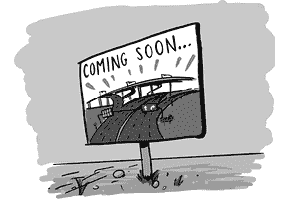
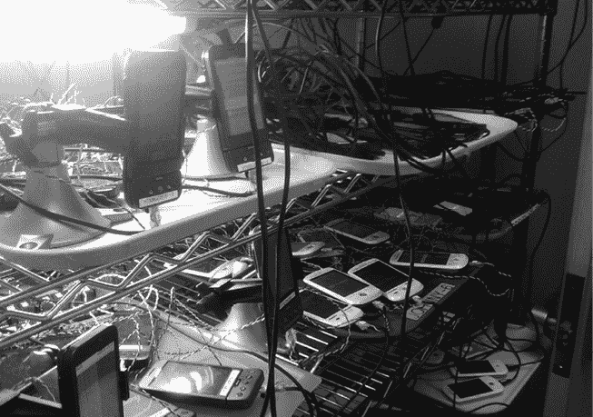

# 第十章：基础设施

在任何软件项目中，尤其是当项目不止一个或两个人在合作时，一个不太明显的部分就是实际构建产品所需要的基础设施。*基础设施*可能涉及多个方面，包括：

1.  构建 你如何将随机工程师不断提交的代码构建成产品？如果产品需要在多种不同的设备上运行，而不仅仅是一个设备，怎么办？你将如何存储这些构建文件以便进行测试、调试和发布？

1.  测试 一旦产品构建完成，你如何进行测试？你如何进行持续测试，以便在问题变得严重之前抓住潜在的错误（并且在出现问题时，可以更容易追溯到错误最初被提交的时刻，进而定位和修复）？

1.  源代码控制 你将所有代码存储在哪里？如何让一个团队的成员同时修改相同的源代码文件？

1.  发布 你如何将产品实际发布到需要它的设备上？

Android 需要专门的人来解决这些基础设施问题。

## 乔·奥诺拉托和构建

在最初的阶段，Android 的构建是由一个脆弱且耗时的系统拼凑起来的，这个系统为内核、平台、应用以及其他所有部分构建了组件。在早期，构建的内容并不复杂，系统能够满足需求，但随着 Android 的规模扩大，原有的系统已经无法再适用了。因此，在 2006 年春天，乔·奥诺拉托开始着手解决这个问题。

乔认为自己注定要成为程序员，因为他的父母都是麻省理工学院的毕业生。“他们在技术模型铁路俱乐部相遇；^(1) 一见钟情。几乎可以预见我会成为一名计算机科学家。”

在高中时，乔与他的朋友 Jeff Hamilton（未来的 Be、PalmSource 和 Android 同事）一起参与了年鉴的制作，制作了第一本完全数字化的 Jostens^(2)年鉴。他们的系统包括一个定制的搜索算法和一个数字化系统，这些都简化了出版过程并降低了学生的成本。乔后来（再次与 Jeff 一起）在 Be 公司和 PalmSource 公司从事类似的操作系统项目，这些项目与他后来在 Android 所从事的工作非常相似。

2005 年末，乔对 PalmSource 的未来方向感到不满，因此他联系了曾在 Be 公司共事的前同事。那人认识 Swetland，并把乔推荐到了 Android 团队。乔收到了一份邀请，但不确定自己加入的是什么团队，因此招聘人员把他介绍给了 Andy。在得到保密承诺后，Andy 告诉乔：“我们将打造最棒的手机。” 就这样，乔加入了 Android 团队。

乔在早期参与了多个项目，包括框架和 UI 工具包。但是在 2006 年春天，他发现构建系统需要进行大规模重构。

“我们有一个很大的递归^(3)make 构建系统，我当时想，‘我们该有一个真正的构建系统了。’这有点有争议：这甚至可能吗？”幸运的是，Joe 有 Be 公司的经验。Be 使用了一个类似的构建系统，那个系统是由一群人编写的，其中包括未来的 Android 工程师 Jean-Baptiste Quéru（团队称他为“JBQ”）。Joe 回忆道，“我想一些危险公司的人[他们也曾在 Be 工作]在那之前就离开了，认为这是不可能完成的事。怎么可能有一个 make 文件知道所有的事情？它会搞得一团糟。但...它成功了。”

Joe 深入工作，成功让 Android 的构建系统运作起来，在这个过程中加速了构建并增强了系统的稳定性。整个项目持续了几个月，最终形成了一个名为“总依赖感知”的系统。

## Ed Heyl 和 Android 基础设施

> 第一个猴子实验室是我的笔记本电脑和七台 Dream 设备。我写了一些脚本和工具，把它们弄得崩溃。
> 
> ——Ed Heyl

Joe 编写的构建系统在一段时间内运作得足够好。但随着团队的扩大和代码提交数量的增多，出现了一个需求：一个能够在开发者提交更改时自动构建产品的系统。例如，如果有人提交的代码导致了一个 bug，最好能仅凭这次更改就构建并测试产品，而不是等到其他多个更改叠加后才进行构建和测试，这样会掩盖问题的根本原因。

在 2007 年 9 月，为了控制构建和测试基础设施，团队引入了当时在微软工作的 Ed Heyl。

Ed 在大学学习计算机科学，但迫不及待想毕业。“我想尽快毕业进入职场。我在学校表现还可以…但在工作中我表现得更好。”

Ed 于 1987 年加入了苹果公司，并在那里工作了五年。“那时公司处于一个非常奇怪的状态。他们仍然靠 Apple II 赚钱，但所有的关注都集中在 Mac 上。”几年后，Ed 加入了 Taligent^(4)的分拆公司，随后不久加入了 General Magic，“正好在他们进行 IPO 的时候。它创下了 IPO 增幅的记录，但在之后几个月股价暴跌。公司当时状况并不健康，所有人都有些失望。IPO 前的炒作太过火了，之后的落差很大。”

Ed 在 General Magic 工作了大约十个月，然后加入了 WebTV。他一直待到微软收购，并在微软继续工作了十年，直到加入 Android 团队。在 WebTV 和微软，Ed 与未来的 Android 团队成员合作，包括 Andy Rubin、Steve Horowitz、Mike Cleron 和 Andy McFadden。

Ed 在 2007 年 10 月 Android SDK 首次发布时加入了 Android 团队。Ed 加入时，Android 已经有了一个名为*Launch Control*的自动化构建系统。每天三次，它会接收所有提交的代码并进行构建，生成的结果随后可供自动化测试系统使用。

Launch Control 比什么都没有好，但远远不足以满足 Android 的需求。“它只是供 QA 测试使用，而不是一个展示系统状态的仪表盘。它缺乏追溯性。持续集成^(5)尽可能多地构建和测试，以提供尽可能多的数据点。”

团队需要一个可以更频繁地构建和测试的系统。这个系统还需要具备可扩展性。当时，它只为一个设备构建：Sooner。但不久后，团队将拥有 Dream 设备（该设备与 1.0 一起发布，成为 G1），系统必须能够为多个目标构建。

Ed 最初是独自开始工作的，但最终他领导了一个团队，专注于构建工作。Ed 说：“是 Dave Bort 接手了这个工作，并真正把它做得足够好，可以用于产品开发。让它变得非常稳固，设计合理，工作方式布局清晰。Dave Bort 将它从一个不错但有些粗糙的构建系统，做成了一个产品。”

“在重新组织构建系统的同时，他也重新组织了整个源代码树。他为开源和架构级的事情奠定了所有基础。尽管他主要在构建系统上工作，但它是架构性的；这种变化影响了整个系统。他为此奠定了所有基础。可以说，他让 Android 准备好了开源。”

## 测试，测试

另一个需要解决的问题是测试。如何验证不断从不同工程师在系统不同部分提交的随机软件片段不会破坏系统？在任何软件系统中，都需要有某种自动化测试框架^(6)，以便快速捕捉问题。那时，Android 并没有自动化测试系统，于是 Ed 让一些 monkeys 来完成这项工作。

“在 WebTV 时，我们有一个叫做 monkey 的东西^(7)，它会在网页上找到链接，然后疯狂地到处冲浪。”

“我记不清楚 Dianne 是否已经为 Android 平台做过这件事，还是我们在与她讨论时她做了这件事。但她将随机化和事件注入的系统集成到了框架中，今天我们称之为‘monkey’。”

“我建立了第一个猴子实验室，它就是我的笔记本电脑和七台 Dream 设备。我编写了一些脚本和工具，让它们不停地崩溃，抓取崩溃的[报告]，然后让它们重新工作。我会分析这些报告并总结出来。这样每天我们就可以知道它能够处理的事件数量以及遇到的崩溃情况。我和 Jason Parks，以及最终的 Evan Millar，连接了一套工具来帮助创建我们的第一个稳定性数据。那套系统坚持了很多年，尽管它很糟糕。它只是一些 Python^(8)脚本，用来分析错误报告并输出 HTML 报告。2008 年末，我雇佣了来自微软的 Bruce Gay。他接手后把这些变成了一个真正的实验室环境。”^(9)

Bruce 在这些年中把实验室从最初的七台设备扩展到超过 400 台。他提到，在这个过程中有一些预料之外的问题需要解决。“有一天我走进猴子实验室，听到一个声音说，‘911——发生了什么紧急情况？’” 这个情况促使 Dianne 在 API 中添加了一个新功能，`isUserAMonkey()`，它用来限制猴子在测试过程中不应该执行的操作（包括拨打电话和重置设备）。

早期的猴子测试在崩溃之前会运行最多 3,000 个输入事件。到 1.0 版本时，这个数字已经达到约 5,000。Bruce 说，“‘通过’的标准是 125K 个事件。我们花了几年才达到这个目标。”

2009 年 5 月的猴子测试实验室（照片由 Brian Swetland 提供）

Romain Guy 谈到猴子测试在 1.0 版本发布前的重要性。“那时候我们非常依赖猴子测试。每天晚上我们都会跑这些猴子测试，每天早上我们都会有很多崩溃需要修复。我们的目标是提高猴子的测试数量；我们能让猴子在不崩溃的情况下运行多久？因为崩溃无处不在，从小部件到内核再到 SurfaceFlinger^(10)，尤其是我们切换到触摸屏后，情况变得更加复杂。”

除了猴子测试，团队中的其他成员也在进行不同类型的测试，以验证平台的正确行为。Evan Millar 在 2007 年初从研究生院加入团队，他负责早期的性能测试框架，测量应用程序启动所需的时间。他还参与了早期的自动化测试系统——Puppet Master，它允许测试脚本驱动 UI（打开窗口、点击按钮），并与黄金图像进行正确性比对^(11)。由于比较黄金图像的困难，加上测试和平台的异步性，结果是喜忧参半的。测试脚本会请求特定的 UI 操作，比如点击一个按钮或启动一个应用程序，但平台处理该事件可能需要一段时间，这使得正确性测试变得复杂且容易出错。

Chiu-Ki Chan 在加入地图团队后，曾在服务和 Android Market 团队工作，处理了一些这些内在的测试困难。她一直在开发一个系统来自动化地图应用的测试，但越来越对在一个并非为测试设计的系统上测试她的应用感到沮丧。她说：“测试？根本没有所谓的测试。”

Android 测试的一个重要部分是兼容性测试套件（CTS）。这个系统最初由外部承包商构建（由 Patrick Brady^(12)) 管理）。CTS 测试非常重要，因为它们不仅测试系统中特定功能块，并在测试失败时捕捉回归^(13)，而且它们也是合作伙伴通过认证所必需的，确保他们发布的 Android 设备符合 Android 定义的平台行为。例如，如果有一个测试将屏幕变成白色，并测试结果是否确实是白色像素，那么设备不应该将“白色”误解为红色并且仍然通过该测试。

## 精益基础设施

Android 构建、测试和发布基础设施，像 Android 的其他部分一样，最初是由一个资源有限的小团队创建的。这是关于如何在有限预算内做出投资的一个有意识的决策，考虑到产品尽快发布的优先级。Ed Heyl 说：“我们根本不知道我们正在做的事情是否会成功。我们只是尽力制造一款新设备并让它有影响力。苹果已经占据了所有的市场关注，微软不打算放手，他们在那个时刻处于最佳位置。所以我们的一切思维方式都是：我们能做的任何事情，只为向前推进。我们没有优先考虑投资很好的解决方案，只是‘我们得让这个开始，证明我们能交付并持续迭代。’我们从未停下来想，我们真的需要投资建立一个构建基础设施，Python 脚本无法带我们走得太远，所以我们应该认真思考如何使用 Google 的后台基础设施。我们从未停下来想过这个问题。我们只是全速前进。”

“如果它是核心产品的一部分，我们会投入更多资源。但如果它只是测试或构建，那就只做最低限度的工作来让它启动。我们就是这么操作的。”
