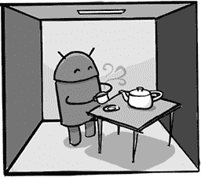
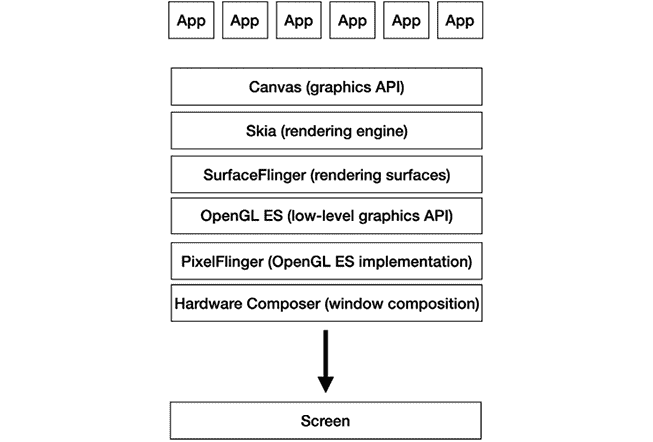
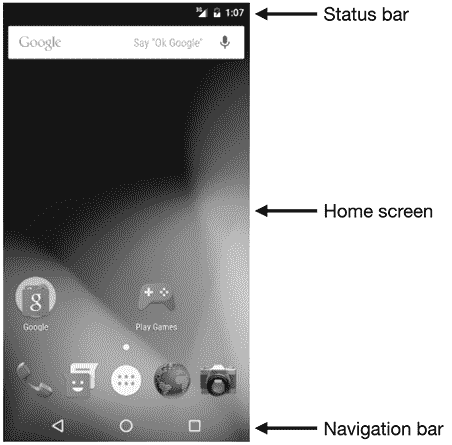

# 第十一章：图形

当 Android 团队的人说“图形”时，他们可能指的是完全不同的内容，因为图形功能有很多层次，这些功能由不同的团队实现，目的也各不相同。例如，有使用 OpenGL ES 的 3D 图形系统^1，以及最近的 Vulkan，支持从游戏到地图应用、虚拟现实和增强现实等各种应用。还有 UI 工具包中的图形功能，负责绘制文本、形状、线条和图像等内容，以便应用开发者能够用图形填充他们的用户界面。然后就是系统中最低层的图形功能，它提供了像素和窗口显示在屏幕上的基本能力。

我们将从图形的最低层开始，这一层是通过 Mathias Agopian 的工作而实现的，他是从 Be 和 PalmSource 招募的另一位成员，于 2006 年底加入 Android 团队。

一个极度简化的 Android 图形系统视图。应用程序调用 Canvas API 来绘制内容。Canvas API 由 Skia 渲染引擎实现，将形状和文本等转化为像素。SurfaceFlinger 提供了一个缓冲区或表面，像素被绘制到其中。SurfaceFlinger 调用 OpenGL ES，这是一个低级图形 API，用于渲染三角形。OpenGL ES 使用 PixelFlinger 来绘制缓冲区：注意，当 GPU（图形处理单元）成为智能手机的标准配置后，PixelFlinger 最终被 GPU 替代。最后，所有需要显示在屏幕上的表面（包括前景应用程序以及状态栏和导航栏）都在硬件合成器中合成，然后显示在屏幕上供用户查看。

## Mathias Agopian 和 Android 图形

> 在我看来，软件渲染注定会消亡。
> 
> —Mathias Agopian

Mathias 是一个冷静、安静的人，他总是很晚到办公室，工作到很晚，几乎完全专注于编码（尽量避免电子邮件和会议）。

在早期，Mathias 有时会显露出脾气^2，有时会因为某些事情而生气，气冲冲地离开办公室，甚至几天或几周都不回来。有一次，Mathias 对 Brian Swetland 生气，他把手机摔了出去，愤怒地走出办公室，几分钟后又返回，要求拿回手机，因为他需要手机的内存卡^3。

Mathias 从小就学习如何编程各种计算机，从 Armstrad CPC 到多个 Atari 计算机，再到 BeBox。他为他的 Atari Falcon 写了图形和音频应用（包括一个为 Falcon 编写的音轨应用，他以 Crazy Music Machine^(4) 的名义出售），并且他因撰写关于编程的文章而在法国的计算机杂志中出名。他还将写 Epson 打印机驱动程序作为爱好，开发了 Atari 和 BeBox 的打印机驱动，这些驱动程序被这些公司随系统一起发布。他在 Be 打印机驱动方面的工作为他带来了工作机会；他于 1999 年离开法国，加入了 Be。

Mathias 曾在 Be 工作，直到该公司被 Palm 收购，并继续与 PalmSource 的其余团队一起工作，主要负责图形软件，直到他决定离开，觉得 PalmSource 的方向不适合他。他在 2005 年底与 Joe Onorato 一起离开，加入 Google 开始从事 Android 开发。

## 基础知识

当 Mathias 加入 Android 时，他从操作系统基础开始。那个时候操作系统基本上还不存在，所以所有加入的成员都参与了构建基本需求的工作。

例如，平台当时还没有 C++ 的核心数据结构（如 Vector 和 HashMap）。在桌面或服务器环境中，这些结构通常不需要，因为它们包含在标准库中，开发者通常会使用这些库。但在 Android 上，尤其是在当时，平台仅包括绝对必要的代码和库。添加标准库会引入太多不必要的部分，占用存储空间，而那时的存储空间有限。因此，Mathias 为 Android 开发编写了这些数据结构的版本，大家都可以使用。

Mathias 还优化了 memcpy^(6) 和 memset，这些是用于处理内存块的低级工具。Memcopy 是系统中至关重要的软件，整个系统都在使用它^(7)，它通常在内存密集型的情况下成为性能瓶颈。Bob Lee 评论了这项工作：“他为 memcpy 手写了汇编语言，使其速度非常快，并带来了巨大的性能提升。真是太聪明了。”

## PixelFlinger^(8)

Mathias 为图形系统设定的主要目标是实现他所称之为 SurfaceFlinger 的功能，这一功能用于显示由系统中所有应用生成的图形缓冲区（*表面*）。但是，这个系统依赖于一些尚未存在的低级功能，因此他从这些功能开始开发。

Mathias 的假设之一是，SurfaceFlinger 需要一个 GPU^(9) 来完成工作；它将使用 OpenGL ES 执行从应用程序获取图形数据到缓冲区并将其显示到屏幕上的低级操作。问题是，当时 Android 并没有运行在带有 GPU 的设备上。Android 在那时及整个 SDK 发布之前所面向的设备是 Sooner，它没有 GPU，因此也没有 OpenGL ES。

但 Mathias 看到的未来是，GPU 将成为智能手机的标准。“在加入 Android 之前，我有一点移动平台的经验。我非常明确地意识到，未来我们将使用硬件进行渲染。^(10) 在我看来，软件渲染将会消亡。”

“我的想法是：我要让一切为我们拥有硬件做好准备。问题是，我们没有硬件。我们也不知道何时会发生。所以我想，我负责图形，我就假装自己有 GPU。于是我本质上写了一个 GPU。通过这种方式，我能够使用‘GL’来编写 SurfaceFlinger。它使用的是实际的 OpenGL ES，但默认使用软件。然后，渐渐地，真正的硬件开始出现了。”

当 Mathias 说他写了一个 GPU 时，他的意思是他写了一个 *虚拟* GPU；即软件，它执行与 GPU 相同的工作，但由软件代替专用硬件。GPU 不是魔法；GPU 中的专用硬件并没有做任何 CPU 上的软体无法完成的事情。它只是做得更快，因为它有为图形操作优化的硬件。^(11) 在编写这个假 GPU 时，Mathias 提供了一个软件层，来处理通常由 GPU 处理的图形操作，将这些命令转化为现有 Android 显示系统可以理解的低级信息。

他编写的 OpenGL ES 层向一个处理纹理三角形绘制的下层发出了命令，^(12) 该下层叫做 PixelFlinger。将 OpenGL ES 放置在 PixelFlinger 之上这一额外的抽象层增加了工作量和开销，如果 Android 只面向单一设备，这种做法是没有意义的。但在一个 Android 面向未来的世界中，未来几乎肯定包括 GPU 硬件，这意味着 SurfaceFlinger 只需要编写一次，目标是 OpenGL ES。当未来与 Mathias 的愿景匹配且 GPU 可用时，它将继续按原样工作，但速度会更快（使用硬件，而不是基于软件的 PixelFlinger）。

Mathias 编写 PixelFlinger 虚拟 GPU 的方法是 Android 初期采取的*产品与平台*方法的典型例子。^(13) *产品*方法是团队尽可能快速让初始手机工作，这样做不会花费太多时间。但 Mathias 采用的*平台*方法，通过构建超越初始发布版本的软件层次，最终证明对 Android 长期有利。“必须经历那一步，以便为硬件到位时做好准备。同时，也为了说服人们，这是必须要做的。”

这种长期的图形系统方法以及平台的其他部分，正是团队在早期阶段所采用的一种策略。总体而言，团队非常务实，倾向于组成小型而高效的团队，并在推进 1.0 的过程中做出快速且务实的决策。但团队早期做出的一些决策及其所需的额外工作，正是因为它们是平台未来发展的正确选择，尽管那个未来并不确定。因此，尽管团队的目标是发布 1.0，他们仍然力图构建一个能够超越这个单一发布日期的、面向未来的 Android 平台。

PixelFlinger 在 Android 手机中的生命周期是有限的。它对早期开发中使用的 Sooner 设备至关重要，但搭载 1.0 的 G1 已经具备了 Mathias 所期望并预测的 GPU 能力^(14)。PixelFlinger 的重要性不在于它为特定产品提供的功能，而在于它对平台的意义，构建了能够推动架构和生态系统走向硬件加速未来的前瞻性能力。^(15)

## SurfaceFlinger

一旦 PixelFlinger 和 OpenGL ES 正常工作，Mathias 就可以实现 SurfaceFlinger。应用程序将图形对象（按钮、文本、图像——等等）绘制到内存中的缓冲区，然后 SurfaceFlinger 将该缓冲区发布到屏幕上，用户可见。SurfaceFlinger 本质上是应用程序中发生的高级图形操作与他之前编写的 OpenGL ES 层之间的胶合剂，负责复制缓冲区并将其显示给用户。应用程序渲染和屏幕像素显示的分离是有意为之；Mathias 的设计目标之一是通过确保没有应用程序能够导致其他应用程序的渲染性能问题，从而实现平滑的图形渲染（这与 Android 平台的整体安全策略有关，其中始终保持应用程序之间的清晰隔离）。因此，应用程序会将图形绘制到缓冲区中，SurfaceFlinger 会负责后续处理。

## 硬件合成器

Mathias 编写的图形系统的另一部分是硬件合成器（HWC）。SurfaceFlinger 负责将 UI 图形绘制到屏幕上的窗口中。但有几个窗口需要组合在一起，以生成屏幕上的最终像素。

一个典型的 Android 屏幕示例，显示了状态栏、导航栏和主屏幕

想象一下用户看到的典型 Android 屏幕。上面有一个状态栏（显示当前时间和各种状态及通知图标）、一个导航栏（包含返回和主页按钮），最后是实际的前景应用程序（或主屏幕）。也可能有其他窗口，如在前景应用程序上方的弹出菜单。

所有这些都是独立的窗口，通常运行在不同的进程中。例如，导航栏和状态栏由系统进程管理，而应用程序窗口则由应用程序进程拥有。这些窗口需要以某种合理的方式一起显示，这是硬件合成器的工作。

Mathias 提出的 HWC 方案是使用专用图形硬件，称为硬件覆盖层，^(16) 该硬件为每个应用程序提供专用的显示内存，避免了所有应用程序共享同一视频内存的开销。使用覆盖层硬件还节省了功耗，并为应用程序提供了更高的性能。通过使用专用的覆盖层硬件，系统避免了使用耗电量较大的 GPU 来处理这些简单且频繁的窗口操作。此外，使用覆盖层使得 GPU 可以被应用程序使用，^(17) 以加速游戏或其他图形密集型操作。

他们的解决方案不是手动在屏幕上绘制每一个窗口，或者通过 OpenGL ES 告诉 GPU 来绘制它们，而是 HWC 将每个窗口发送到不同的覆盖层。然后显示硬件将这些覆盖层合成到屏幕上，使其看起来像是一个无缝的信息屏幕，而不是实际上是几个完全不同的进程。

问题在于，覆盖层在实际使用中很难操作，因为每个设备的覆盖层数量和功能都不相同。但是，考虑到 G1 的 GPU 限制，以及该设备上相对较好的覆盖层支持，Mathias 和 Jason Sams 提出了一种创新的解决方案。与其直接在 HWC 中处理覆盖层的无限变化，他们的软件会告诉底层硬件 HWC 需要什么，硬件要么支持他们的要求，要么 HWC 会退回使用 OpenGL ES。随着时间的推移，硬件厂商看到了直接处理这些覆盖层操作的好处，并将其作为在平台这个关键领域为设备提供额外性能的一个方向。

## Mike Reed 和 Skia

Mathias 的所有工作都基于需要在屏幕上展示某些内容：应用程序的图形内容。为应用程序绘制图形内容的系统也需要被创建。为此，Android 使用了一个名为 Skia 的渲染系统，这个系统最初是从 Mike Reed 那里收购的。

如果“连续的图形创业者”真的是一个存在的概念，那么 Mike Reed 就是其中之一。

Mike 比许多早期的 Android 工程师晚才开始编程，至少与他们相比是这样。Mike 获得了科学和数学的大学学位。但 1984 年，原版 Macintosh 发布，并出现在他的校园里。“那一切都改变了。我想做图形设计，因为 Mac 正是展示了这一点。所以我拿到了数学学位，但自学了编程。”

Mike 在研究生毕业后成功进入了 Apple 工作（“我差点才拿到那份工作”），在那里他遇到了 Cary Clark，未来的 Skia 联合创始人。^(18) 在 Apple 工作几年后，Mike 离开了并创办了 HeadSpin，开发了一款用于 CD-ROM 游戏的游戏引擎。HeadSpin 被 Cyan 收购，Cyan 是游戏 *Myst* 的开发商，而 Mike 随后离开去创办了一家新的图形技术公司，名为 AlphaMask。AlphaMask 被提供移动设备浏览器软件的公司 Openwave 收购。

Mike 在 2004 年离开了 Openwave，并与他的前 Apple 同事 Cary 一起创办了 Skia，开发了一款图形渲染引擎。Skia 将其引擎授权给多个客户，其中包括一些位于加利福尼亚的客户。在一次 Mike 去加州的旅行中，Cary 建议他与一个名为 Android 的初创公司见面，Android 由 Cary 的一些前同事在 WebTV 时期共同创办，创始人包括 Andy Rubin 和 Chris White。

2004 年底，Android 仍然很小，只有两位联合创始人以及新员工 Brian Swetland 和 Tracey Cole。Android 正在从构建相机操作系统转向构建手机操作系统。然而，Andy 知道他们需要一个渲染引擎来显示 UI，因此他支付给 Mike 一笔评估许可证费用，并同意之后再联系。但 Mike 没有收到回应：“Andy 就这样消失了，他没有回复我的邮件。”

几个月后，在 2005 年夏天，Andy 最终联系了 Mike。“他说，‘抱歉我消失了，但我现在是通过一个新的邮箱地址联系你。’果然，他发来的邮箱地址是 something@google.com。他说，‘嘿，我被收购了，我们应该完成那个许可证的事情。’”

但 Google 并不是仅仅成为 Skia 渲染引擎的另一个许可证持有者，而是收购了 Mike 的公司。毕竟，Android 正处于招聘阶段，收购可以是一个有效的方式（如果你有足够的资金）来迅速招聘多位员工。

这项收购在 2005 年 11 月 9 日宣布，来自 Skia 的四位工程师（Mike、Cary、Leon Scroggins 和 Patrick Scott）于 12 月开始加入。

谈判的一个重点是地点。Mike 和 Cary 多年前就决定离开加利福尼亚，定居在北卡罗来纳州，他们并不太热衷于回到湾区。谷歌同意将团队留在北卡罗来纳州，在那里他们建立了新的 Chapel Hill 办公室。^(19)

团队开始在谷歌工作后，他们着手将 Skia 打造成 Android 的图形引擎。底层渲染软件本身已经相当完备；他们在 C++ 中完全支持 Android 所需的各种 2D 绘图操作（如线条、形状、文本和图像）。事实上，Skia 在 Android 中的原始图形功能自早期以来几乎没有变化（尽管在这过程中进行了一些重大改进，例如硬件加速）。但是鉴于 Android 选择 Java 作为应用程序的主要编程语言，他们需要让 Skia 能够通过 Java 调用，而不是 C++，因此团队编写了 Java 绑定。^(20)

为 Skia 编写绑定并将引擎集成到 Android 平台的其余部分并不太难，因此 Skia 团队很快就接手了几个其他项目。 其中一个项目——新的 UI 系统——寿命很短。Mike 的团队建议 Android 使用 Skia 现有的 UI 显示系统。他们已经有一个可用的系统，开发人员通过 JavaScript 和 XML 的组合来编程。但由于转向 Java，以及 Joe Onorato 的一些深夜工作，^(21) 团队走上了不同的道路。
