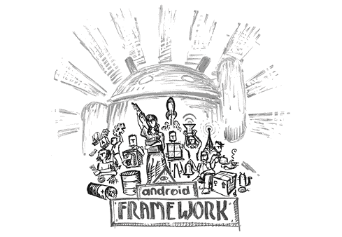

# 第十三章：框架

每当 Dan Sandler 访问 Mountain View 办公室时，他通常会在白板上留下些艺术作品。这次，他在其中一次出访时留下了这幅画，出现在框架区。

F*ramework*^(1)是 Android 团队用来描述核心平台中大部分内容的术语，涵盖了内部操作系统级别的内容（几乎支撑整个系统的除内核外的所有软件部分），以及应用程序用来访问这些功能的 API。框架功能的示例包括：

+   包管理器，负责在设备上安装和管理应用程序。

+   电源管理，例如控制屏幕的亮度设置（屏幕是任何设备上最耗电的部分）。

+   窗口管理，在屏幕上显示应用程序，并在打开和关闭时进行动画效果。

+   输入，接收来自触摸屏硬件的信息，并将其转化为输入事件，路由到应用程序中。

+   Activity 管理器，处理 Android 的多任务系统，决定在设备内存不足时应该关闭哪些应用。

当框架工程师在 2005 年底开始加入 Android 时，框架的所有内容都不存在，因此当时加入 Android 团队的人们必须一点一点地构建框架。

## Dianne Hackborn 与 Android 框架

> 那位最能定义[Android 平台]形态的人显然是 Dianne。我敢肯定她可能会低调自己在这里的影响力，但她错了。
> 
> —Ficus Kirkpatrick

到 2005 年底，部分将成为框架的组件已开始构建，但仍有很长的路要走，包括供应用程序使用的 API 和系统所需的所有其他功能。然后，Dianne Hackborn 加入了团队。

Dianne（团队中也称她为“hackbod”^(2))是大多数团队成员公认的，最了解整个 Android 框架和整体平台的人。首先，她对平台中所有部分如何协同工作有全面的了解，同时也对操作系统和 API 有着广泛的知识。

另外，她写了大部分的框架代码。

Dianne 来自计算机界的名门望族。她的父亲曾在惠普创立了打印机部门，并曾一度被考虑担任 CEO。在其他孩子通过玩电子游戏接触电脑的年龄段，她却已经涉足系统设计。“我会研究系统是如何工作的，以及它与应用程序和线程的协同方式。”

大学毕业后，她在 Lucent Technologies 工作，并在闲暇时间玩 BeOS（“编写框架，一些应用程序，UI 布局框架……类似的东西”）。最终，她希望这项工作能成为她的主业，因此她搬到了湾区，开始在 Be 公司工作。

“那时正值互联网泡沫时期。你在一家没有盈利、也不知道如何赚钱的公司工作，但每个人都希望能参与操作系统的开发。那就是他们来这里的原因。这里不是为了赚钱。”^(3)

Dianne 在 1999 年底加入 Be，成为那里一群人中的一员，她之后又在 PalmSource 与这些人合作，随后在加入 Android 时再次与他们共事。她在 Be 负责框架工作，之后又在 PalmSource 继续从事相同的工作。

在 Be 公司，Dianne 参与了 BeOS 下一个版本的开发，但这也标志着该操作系统的终结。“他们试图与微软竞争。你无法与一个根深蒂固的平台竞争。除非他们自作自受，否则这是不可能的，因为他们的生态系统已经有了如此强大的势头，你做得比他们更好，他们有几年时间来对你做出反应，直到这变得有意义。”

“这就像是一个‘鸡与蛋’的难题。你需要吸引用户来让应用开发者对你感兴趣，而你也需要吸引开发者，才能让用户对你感兴趣。你可以吸引一些用户，但每当你尝试积累势头时，主导平台总能找到方法去解决特定市场的问题并击败你。这个过程几乎是不可能的。”

最终，Palm 收购了 Be，因为 Palm 计划为其设备打造一个更强大的操作系统，并需要具备相关专业知识的工程师来实现这一目标。这也是 Dianne 第一次接触到移动计算。“当时我从未考虑过移动领域。但一旦我开始了解 Palm，我就变得非常感兴趣。这似乎是与微软竞争的方式。它是一种新型的设备，如果你能成为该设备上的平台，那么你将拥有比 Windows 更大的生态系统，你就有机会。你能看到未来的趋势。硬件正在变得越来越强大，而市场已经比 PC 更大。”

然而，PalmSource 却陷入了困境。Palm 与 PalmSource 分开时，最初的构想是，PalmSource 会提供 Palm（以及其他公司）所使用的操作系统。但到了 PalmSource 发布 Palm OS 6 的时候，Palm 决定继续使用他们在 Palm 和 PalmSource 分裂时开始使用的操作系统。接着，当团队几乎完成为三星设备打造的高质量操作系统时，协议破裂。之后，再也没有其他买家对该操作系统产生兴趣，因此公司开始寻求被收购的机会。

当时，Dianne 和她的团队不得不应对一个有趣的移动操作系统动态，这个问题后来在 Android 上以更成功的方式浮现。“要让手机制造商对其他人的平台感兴趣真的很难。他们做自己的软件，而且他们害怕手机变得和 PC 一样，成了由一个软件供应商控制的平台，最终让硬件商品化。”

当硬件公司自行开发操作系统的模式在软件较为简单时是行得通的。对于一部翻盖手机来说，处理电话和联系人信息完全在这些公司能力范围之内。但随着所需功能和特性的不断增加，尤其是在 iPhone 推出之后，这些公司很难跟上。iPhone 发布后，急需操作系统的公司寻找的东西远比他们自己能做的要复杂，因此他们更愿意与 Android 合作。

“软件变得比硬件更有价值。你大部分的投资现在都在软件上。如果是这样的话，那么谁能在软件上投入最多，谁就会最具吸引力，而这可能是一个致力于跨不同硬件平台的软件的人。”

Palm OS 6 的一部分是一个强大的 UI 框架。摩托罗拉，一家有意收购 PalmSource 的潜在公司，对这个框架以及 Palm OS 6 本身都非常感兴趣，想将其用于自己的设备。但摩托罗拉的收购尝试失败了，而 PalmSource 则被 ACCESS 公司收购了。“被摩托罗拉收购本来会很有趣。我们都在希望那样。他们想拿我们做的事情并利用它。”然而，ACCESS 对于当前的方向并不认同。

收购后，ACCESS 改变了团队的操作系统战略。Dianne 和她的团队结束了他们的工作。“PalmSource 完了。手机制造商不想接触别人的平台，因为他们不想成为一个推动者。我看到我的团队一个个离开（我当时负责框架团队）。Mathias 和 Joe 要离开了，他们来找我说‘你应该来 Google—这里有很多酷的事情。’他们给了我一些暗示：‘这是一个平台…它是开源的…’在 Google 做开源的移动平台工作，你不必担心钱？怎么能拒绝呢？简直太完美了。”

Dianne 于 2006 年 1 月加入 Google，并开始加入 Android 团队。

她早早就接触到了 Google 关于 Android 战略的看法。“当我加入时，Larry 和 Sergey 的谈话方式，以及 Andy 的展示方式，他们不仅仅想要一款产品。那比那更宏大：是 Google 未来生存的问题。他们不希望有一个拥有封闭专有平台的公司主导这个领域，就像微软拥有 PC 平台一样。这并不是为了赚钱。”^(5)

## 活动

> 当 Dianne 狂热工作时，很难超越她的编程能力。她有一个明确的愿景，便直接坐下来敲代码实现它。
> 
> — Jeff Hamilton

在她加入 Android 后，Dianne 开始参与许多现在被称为框架的基础模块工作。其中一个模块是 Activities，它是从 Joe Onorato 的一些初步工作中接手过来的。

Activities，起源于团队在 PalmSource 时更长远的构想，是一种独特的 Android 应用管理方式。在传统操作系统中，应用程序启动时会调用 `main()` 方法，然后进入一个循环（绘制、轮询输入、执行必要的计算等）。而在 Android 中，应用程序被拆解成一个或多个“活动”模块，每个模块都有自己的窗口。Activities（和应用程序）没有 `main()` 方法，而是由操作系统响应事件（如活动的创建/销毁、用户输入等）进行调用。

Activities 的另一个重要特点是它们定义了可以从其他应用程序调用的特定入口点，比如系统 UI 中的通知或快捷方式，可以将用户带到应用程序内部的某个位置。

Dianne 说：“Palm 对移动设备有很深的理解。在那里我们学到的一件事是，移动应用与桌面应用有根本的不同：用户一次只能使用一个应用，并且这些应用通常较小，专注于某个特定任务。从这一点出发，我们需要让应用能够轻松协同工作。Palm OS 有一个叫做‘子启动’的技巧，允许一个应用有效地调用另一个应用，做一些诸如显示 UI 以便用户添加联系人之类的操作。我们认为这是移动应用中一个重要的特性，但我们需要将其规范化，形成一个定义明确的概念，以便它在复杂的多进程保护内存（和应用沙箱）环境中更为健壮并且有效。因此就有了 Activities，定义了应用可以如何暴露部分功能，供其他应用（和系统）按需启动。”

Activities 对于 Android 来说是一个强大的概念。它们也是工程团队第一次大规模意见分歧的核心问题之一。与一些人偏好的传统方法相比，Activities 确实更为复杂。特别是，Android 的应用生命周期（处理活动创建/销毁等）仍然是难以理解的，而处理其复杂性往往是许多 Android 开发者的一项艰难且容易出错的任务。

正如 Jeff Hamilton（我们很快就会了解的框架工程师）所说的，“在 Android 的早期，有两个关于操作系统应该是什么样子的竞争性愿景。一个是围绕 Activities 的模糊特性，另一个是有一个被调用的 `main()` 方法。Dianne 和 Joe 推动的是更加模块化的应用程序设置方式，其中包含 Activities。”

“还有一些其他人，比如 Mike Fleming^(6)，他们倾向于推动更简单的模型。那里曾经有一段时间的激烈冲突。”

Mike Fleming 说：“我曾对应用生命周期持怀疑态度。我担心它太复杂了。” Wei Huang^(7) 同意：“在某些方面，我认为活动生命周期过于复杂了，它变得有些失控。”

但团队决定采用活动方式。Jeff 解释了事情是如何发生的：“Dianne 对她想要的有一个清晰的愿景，她只是坐下来把它打出来。这就是方法，因为她很有生产力，事情也都完成了。”

这种决策模式在其他地方也有体现，比如 Joe 实现的初始视图系统。团队没有太多时间开会、组成委员会或辩论事情该如何进行，所以最终总是有人直接敲定一个解决方案，然后事情就从那里继续发展。正如 Dianne 所说：“当时人很少，如果你做了，就直接做了。人们之间有很多讨论，但都是由正在做事情的人发起的。” Romain Guy（后来加入工作在 UI 工具包的开发）补充道：“在 Android 上，最受尊敬的是有人能够真正把事情做成。” 而且，通常这个人就是 Dianne。

## 资源

Dianne 还参与了资源系统的开发^(8)，这是另一个非常 Android 特有的概念。在 Android 上，应用程序开发者可以在所谓的 *资源文件* 中定义文本、图像、尺寸及其他元素的不同版本。

比如，你的应用程序中可能有一个按钮，上面应该写 *Click*，这样用户就知道点击这个按钮。但是，单词 *Click* 只有在用户讲英语时才有意义。如果他们讲俄语呢？或者法语？或者……任何其他非英语语言呢？开发者使用资源文件来存储不同语言版本的字符串。当按钮填充字符串时，资源系统会根据用户在手机上选择的语言，选择合适的版本。

同样，开发者可以定义屏幕配置的 UI 样式，并根据不同的屏幕密度使用不同的图像尺寸。资源系统会根据用户设备在应用启动时加载适当的变体。

资源，以及它们如何解决特别是变量密度问题的方式，是 Android 作为一个软件平台（而不仅仅是作为一款手机产品）发展的一个很好的例子，即使在 1.0 之前的那些早期阶段。如果团队当时只是针对某个特定设备，并有一个预定义的屏幕尺寸（正如当时大多数厂商所做的那样），那么这些问题就不需要解决。但这样一来，应用就会在最初的假设基础上编写。当不同尺寸的屏幕出现时，应用就会显示不正确。

Dianne：“这些设备与桌面不同，因为设备对应用的影响比桌面更大。在桌面上，你可以有更大的屏幕，但这对应用并没有太大影响，你可能只是能调整窗口的大小。但在这些设备上，如果屏幕变大，应用需要能够在更大的屏幕上正确绘制。”

另一个因素是屏幕密度。^(9)“在桌面上，屏幕密度永远不会变化。但我们知道，移动设备的密度会发生变化。我们在 Palm 公司看到过这种情况。我们需要设计一些东西，让平台能够在长期内不断发展，因为我们看到了 Palm OS 及其更简化方法的问题。让它支持不同的屏幕密度时，完全是一场灾难。我们一直都[对于 Android 平台]抱着这样的想法：‘我们在为移动设备构建这个，但我们希望它能够扩展，长期应对其他使用场景。’”

相比之下，iOS 和 iPhone 最初并没有考虑屏幕密度。“苹果没有考虑这些问题。苹果是为数不多的既能做高质量软件开发，又专注硬件的公司之一。大多数硬件公司只关注硬件产品，软件只是硬件所需的一部分。而苹果能够将软件作为一个长期投资的方向，独立于某个特定硬件产品。不过你仍然会看到他们在硬件方面的思维，比如‘我们想改变屏幕尺寸……我们没有考虑到这一点。’”

## WindowManager

> Dianne 说：“我要做一个窗口管理器，”然后嘀嘀嘀嘀，窗口管理器就出来了。
> 
> —Mike Cleron

Dianne 早在 1.0 发布之前，就编写了 WindowManager，它处理窗口的打开、关闭、动画进场和动画出场。这个工作很有意义，因为它不仅解决了复杂的问题，还因为 Dianne 在做这件事时，只是她众多工作中的一项。^(10)

## 软键盘

在 1.0 发布后，仍然有很多工作要做。Dianne 当时与框架团队的 Amith Yamasani 一起工作的一项任务就是支持*软键盘*，即触摸设备所需的屏幕键盘。

原版 G1 配备了硬件键盘。进入应用程序时需要将键盘滑出。这个机制工作得很好（事实上，很多智能手机用户在几年后仍然偏爱硬件键盘，特别是黑莓的粉丝）。但对更大屏幕和更小设备的需求意味着支持全触摸设备和屏幕上的虚拟键盘变得至关重要。事实上，随着即将发布的 Cupcake 版本，设备将不再配备硬件键盘。

按照典型的 Android 开发方式，软键盘并不是直接硬加到框架中的。Android 因为要在性能和发布时间之间做取舍而闻名，但团队始终优先考虑创建通用平台能力，而不是针对特定产品特性的黑客解决方案，这也是他们键盘解决方案的做法。团队创建了一个系统，提供可扩展且灵活的通用输入支持。例如，键盘支持不仅仅被称为*键盘*，而是输入法编辑器（IME）。仅仅提供常规键盘的支持是不够的，系统需要能够接受来自任何输入机制的输入，包括语音输入。

与此同时，输入支持不仅仅是作为框架内部的机制，而是作为一个可扩展的特性，开发者可以利用这一点。Android 提供了输入法框架（IMF），它接受任何用户提供的 IME 输入，而不仅仅是随 Android 系统一起发布的键盘。也就是说，Android 不仅仅为用户提供了软键盘；他们还为开发者提供了 API，让他们创建自己的键盘应用，供用户选择使用。短期需求是提供一个足够好的输入系统，满足大多数使用场景。但团队意识到，可能还会有其他用户想要的体验，或是其他开发者可以提供的功能，因此他们构建了一个允许实现这些功能的系统。即便市场上只有少数几款 Android 设备，团队仍在进行长期布局，预见到可能会有一个庞大且多样化的设备和用户生态系统。

戴安娜说：“我不记得曾经考虑过将其硬编码到平台中的路径。从能够满足不同语言需求的实际考虑出发，我们认为这应该是一个用户可选择的组件。”

IME 支持是吸引许多开发者（和用户）早期加入 Android 的一个重要例子。早期的设备，如 G1，可能并不是最美观的智能手机，但开放生态系统的力量和灵活性吸引了许多用户和开发者。尽管 iPhone 最终提供了除了 iOS 自带的键盘外，还可以安装其他键盘应用的功能，但这发生在很晚之后，远远晚于 Android 开发者提供这些应用的时间。

2009 年，Shumin Zhai 在 IBM 从事研究工作。他在研究替代输入机制，使用他自己开发的一款应用 ShapeWriter^(11)。这款应用不需要逐个输入字母，而是允许用户在键盘上滑动手指，在字母之间画出形状，从而输入单词。这个键盘通过使用概率和启发式算法，解读这些形状为单词，来确定用户正在输入的词。

Shumin 在 2004 年与 Per Ola Kristensson 一起开发了 ShapeWriter，并最初在 Windows Tablet PC 上发布。2008 年，他们将 ShapeWriter 发布到 iPhone，但它只能与他们提供的记事本应用一起使用，因为当时 iPhone 没有类似 Android IMF 的功能，所以无法替代系统键盘。当 Android 在 2009 年中期的 Cupcake 版本中发布了对 IMF 的支持后，Shumin 将 ShapeWriter 的重点转向了 Android，并于当年晚些时候在 Android Market 发布了这款应用。^(12)

他特别喜欢为 Android 开发^(13)，因为这让他能够进行实验，能够将系统键盘换成自己的键盘，从而提供这种新功能。Shumin 是一位研究员，虽然这看起来似乎不是一个庞大的目标市场，但就在同一时期，一家公司在 Android 平台上发布了一款名为 Swype 的流行应用，拥有类似的手势输入功能。

Shumin 最终加入了 Android 团队，并领导了实现 Android 标准 IME 手势输入的团队。如今，Android 的键盘默认内置了这种绘制单词的功能。但 Android 仍然允许开发者提供自己的键盘应用，以进行自定义和开发者希望创建的功能。

## Jeff Hamilton 逐步在技术栈中晋升

尽管 Dianne 的生产力令人传奇，但要让整个框架真正成型，还有很多工作超出了她一个人能够完成的范围。还有一些其他人也在编写大量的框架代码，其中之一就是 Jeff Hamilton（团队内称他为“jham”）。

Jeff 和 Dianne 在同一天加入了 Google。他们曾在 Be 和 PalmSource 一起合作过框架代码，现如今准备在 Android 上再次合作。

Jeff 的工作生涯始于大学时期，在 Be 公司实习时开始了他的平台开发工作。他在面试时实际上失败了，因为他关于 BeOS 中中断处理程序的工作原理的回答有误，BeOS 与 Linux 的处理方式不同。他回家后研究了这个差异，重新提交了解释，并给出了正确答案，团队改变了主意，决定聘用他在夏天实习，并在他大学期间继续工作...最终在他大学毕业后，聘用了他成为全职员工。

在 Be，Jeff 在内核团队工作，负责硬件驱动开发，如触摸屏显示器和 USB。他还很好地了解了如何在一个充满活力的硅谷公司开始工作：“第一天，他们把我带到我的工作区，那里有一个机箱和键盘。他们说，‘那边有主板，去找 George 要个 CPU。’他们没有内存条，我得去 Fry's 买。”^(15)

大学毕业后，Jeff 全职加入了 Be，后来在 2001 年 Be 被收购后加入了 PalmSource。但和团队里的其他成员一样，包括 Joe、Dianne 和 Mathias，Jeff 最终也厌倦了 PalmSource。“到 2005 年 8 月，情况已经很明显，他们没有客户了。”他搬到了德克萨斯州奥斯汀，因此开始在那个地区找工作，发现摩托罗拉有一个非常合适的机会。“那是一个本地的工作。他们想要建立一个新的现代智能手机操作系统，能够在所有手机上发布，而不是只做一个一次性的产品。我加入的团队已经签署了一项收购 PalmSource 的协议^(16)，他们说我非常合适。听起来一切都很不错，所以我在 2005 年 8 月辞去了 PalmSource 的工作，加入了摩托罗拉。”

但在 PalmSource 交易关闭之前，ACCESS 突然出价更高，PalmSource 选择了更高的报价。由于摩托罗拉的智能手机操作系统计划被叫停，Jeff 没有太大的动力留下来。幸运的是，他在 Be/PalmSource 的同事们正在面试并加入谷歌的 Android 团队。Jeff 从他的朋友 Joe 那里听说了这个机会。“我说我对搜索和网络一无所知，我不想远程开始新工作，而且我不认识团队里的任何人。Joe 说，‘别担心第一个问题，你已经认识团队的一半人了。来面试吧。’”Joe 通过把 Jeff 引进 Be 的机会，回报了他多年前的帮助：“他说服 Andy 在我还在奥斯汀、在家工作的情况下雇佣我。”

当 Jeff 加入团队时，Android 还不是一个*平台*，而只是一些随机的代码片段、原型和技术演示。“Joe 有一个窗口管理器的演示，画了一个正方形——屏幕上的基本形状。还有一个人^(17)在做电话功能。Mathias 在做图形工作。但当时没有任何功能。根本没有真正的操作系统。”

Jeff 的第一个任务之一来自 Brian Swetland，任务是为在设备上运行的 Android 应用程序构建一个调试协议^(18)。Jeff 没有从头开始实现自己的系统，而是让 gdb（一个标准的调试工具）运行起来。这意味着要在操作系统上让其他 gdb 需要的东西运行起来，比如线程和调试符号的支持^(19)。

一旦调试工作完成，Jeff 开始了 Binder 的开发。

## Binder

Binder 是 PalmSource 工程师在之前的公司和操作系统中熟悉的概念^(20)。Binder 是一个进程间通信（IPC）^(21) 机制。每当操作系统中发生需要多个进程参与的事件时，IPC 是用于在这些不同进程之间发送消息的系统。例如，当用户在 PC 上输入时，系统进程会将包含该信息的消息发送给前台应用程序进程，以处理该按键事件。IPC 系统（在 Android 中是 Binder）定义了这种通信机制。

在 Android 设备上，许多进程始终在运行，处理系统的不同部分。系统进程处理进程管理、应用程序启动、窗口管理以及其他底层操作系统功能。电话进程保持电话连接活跃。前台应用程序是用户实际交互的应用。系统 UI 负责导航按钮、状态栏和通知等等——有很多进程，它们都需要在某个时刻与其他进程进行通信。

IPC 机制通常简单且底层，这正是前 Danger 工程师所希望的。正如 Wei Huang 所说：“Danger 喜欢做事快速。简单且快速。但主要是简单。”然而，包括 Jeff、Joe 和 Dianne 在内的 Be 团队更倾向于采用 Binder 方法，这种方法在 PalmSource 中已经实现，功能更全（且更复杂）。而且，由于 Binder 是开源的，因此可以用于这个新平台。

这种分歧导致了团队之间的问题。Mike Fleming 站在 Danger 一方：“我是一个 Binder 怀疑者。我认为它并没有经过充分的考虑。确实，他们在 Palm 做过，但同样也没有在产品中推出过。”

“我特别生气的是，你必须进行一个阻塞调用^(22)，这个调用会在另一方进行一个阻塞调用。我觉得这会导致不必要的线程操作，而且对我的使用案例没有任何价值。而且，原始的 Binder Linux 内核驱动并不完全健壮。要让它真正可靠，需要做大量的工作。”^(23)

Binder 怀疑者没有赢得那场战斗：Jeff 和团队继续推进并实现了 Binder，Binder 成为 Android 框架架构的基础部分。与此同时，Mike 在他的电话工作中忽略了 Binder：“我在 Java 进程和本地接口层进程之间打开了一个 Unix 域套接字^(24)。”

## 数据库

在 Jeff 让初始 Binder 模块工作后，他转向了数据库。应用通常需要存储信息。如果数据较为复杂，他们需要一个强大且功能齐全的解决方案；他们需要一个数据库。在 PalmSource，Jeff 曾与数据库打交道，但那家公司希望创造一些新的东西。Android 并没有试图发明任何新东西；他们只需要一个解决方案。“我看过 SQLite^(25)，我想，如果我们想要建立我们自己的手机并尽快推出，可能不应该从零开始构建自己的数据库系统。SQLite 已经存在——它能用。”于是，Jeff 将 SQLite 库移植到 Android 上，创建了供应用开发者访问的 API，之后他继续转向下一个项目。

## 联系人和其他应用

因为他已经在处理应用数据，Jeff 被拉入了一个项目，定义应用如何共享数据。某人的联系人数据需要对设备上的其他应用可用（例如，可以拨打电话或发信息给朋友）。这促成了 ContentProvider APIs 的出现，Jeff 随后在开始开发 Contacts 应用时使用了这些 API。“显然，我们应该有一个通讯录和通话记录，于是我开始构建 Contacts ContentProvider，拥有一个通讯录，这样你就可以拨打电话了。”一旦这一功能实现，他继续往上移动软件栈，开始着手开发 Contacts 应用的 UI。

在 Contacts 之后，Jeff 继续参与了平台的其他部分和核心应用。他曾在某个阶段帮助开发短信应用，那个应用主要由 Wei Huang 开发。他还帮助编写了 Mike Fleming 负责的电话软件，之后又协助了电话拨号应用的开发。

当时，Dialer 和 Contacts 是同一个应用的一部分。Jeff 想要在 Dialer 中简化一些操作，于是他创建了一个有争议的 UI 功能，叫做“Strequent”。“在拨号器中，有一个标签是拨号器，一个标签是通话记录，还有一个标签是联系人。我创建了另一个标签叫 Strequent。它是你的星标联系人，接着是你常拨打的联系人。大家觉得这真的很奇怪。我记得 Steve Horowitz^(26)一点也不喜欢它，但 Rich Miner 却喜欢。”Rich 说服 Steve 接受了这个功能。

Jeff 最终参与了大多数核心应用的开发，并最终负责管理应用团队。他记得有一个特别的日历用户问题：“Sergey[Google 的联合创始人]来了。Calendar 应用崩溃了。他的妻子从 Outlook 向他共享了日历。结果发现 Outlook 中有一些带有例外的重复事件，这是我们之前从未见过的。我们的事件解析器崩溃了。”

Jeff 去找 Sergey 解释问题。“‘我们找出了问题：你的日历里有一些我们以前从未见过的数据，我们没有预料到这些数据，导致我们的应用崩溃了。’他说，‘我的数据不会导致你们的应用崩溃！是你们的应用在我的数据上崩溃！’”Jeff 记得多年后这个情况依然清晰。这种与谷歌创始人和高管争论的经历很难忘记。

Jeff 所经历的过程，从系统的最低层开始让本地调试器工作，然后处理核心框架内部和 API，再到数据功能和 API，最后编写使用他构建的某些底层功能的应用程序，^(27) 是团队成员所做工作的一个很好的例子。基本上，在 Jeff 到来之前什么都不存在，所以他帮助逐步创建这些模块，将每个新模块建立在前一个模块的基础上，随着更多功能的上线。以类似的方式，团队中的每个人都从最基础的部分开始构建，并随着能力的提升逐步实现更高层次的功能，最终编写出定义 Android 用户体验的应用程序。

## Jason Parks 搞砸了

另一个来帮助 Dianne 框架团队的 Be/PalmSource 校友是 Jason Parks，他于 2006 年春季加入了 Google 的 Android 团队。

Jason Parks（团队称他为“jparks”）在成长过程中有一个口号：“我没有搞砸，但我知道如何修复！”这个口号和概念一直陪伴着他，最终他在自己工作的操作系统中使用了 `JPARKS_BROKE_IT` 作为错误代码标签。

Jason 很早就开始编程，从六年级时就学习 BASIC。儿童时期和大学期间他一直在编程，但并没有毕业。“我不是很擅长语言类课程，我从来没完成过英语课。我还差二十二个学分才能毕业，但我却意外地申请了一份工作。”Jason 一直在自学 BeOS，因此当他看到 Be 的招聘广告时，他就申请了。

“但我申请了错误的职位；我申请的是一个经理/架构师职位。在他们的系统中，你一次只能申请一个职位。我当时想，‘那就算了，得等他们重置了才能再申请。’结果我收到了一个电话面试的邮件，面试的是我显然不符合资格的职位。”最后他确实获得了面试机会和工作邀请，但职位不同。他问为什么他们会回邀他，明明他申请的是错误的职位，得到的回答是，他们之所以注意到他的申请，是因为他显然不符合该职位的要求。^(28)

Jason 曾与其他未来的 Android 人员一起在 Be 工作，比如 Dianne、Jeff 和 Joe，之后跟随他们转到 Palm，最终离开 PalmSource 加入 Android 团队。

和 Jeff、Joe 一样，Jason 也参与了平台的多个不同领域。他的第一周，他在做处理时区的软件。然后在第二周，他让电话数据正常工作。接着随着时间的推移，他转向了框架和应用的其他部分。

Jason 在整个组织中也扮演了重要角色——让人们去做事。这样的一种方式是作为不同小组之间的调解人。当人们有分歧时（比如各种 Danger 与 PalmSource 派系之间的冲突），Jason 会尽力化解这些问题。“当通讯团队的成员对 API 感到不满时，他会来找我，让我去和他们[框架团队]沟通。Swetland 也是如此。Horowitz 会派我去找 Swetland 跟他谈一谈，平息他的情绪。我和 Mike [Cleron] 以及 Dianne 之间有很好的合作关系。我会向其他人解释事情应该怎么做。”

“这里有很多急性子的人，很多冲突。不仅有 PalmSource/Danger 的问题，还有一些 Google 员工进来说‘你们必须这样做’。但我认为这些冲突对我们有帮助。”

Jason 还会被 Steve Horowitz 指派确保某些事情的发生。“团队中的一些人称我为斗牛犬，因为我是 Steve 的攻击犬。当他需要完成某件事时，他会派我去做。”

## 框架开发

框架团队上进行的项目清单长得让人难以置信，因为它真的就是 Android 平台的核心。系统的许多其他部分都依赖于 Dianne、Jeff、Jason 和其他人在这个团队中创建的基础工作。而这一切都是从零开始构建的，始于这些人于 2005 年底加入团队时。与此同时，平台的其他部分和应用也在框架之上构建，就像是在飞机飞行中还要建造飞机，而机舱里挤满了乘客，大家都希望飞机在坠落之前能够抵达目的地。
