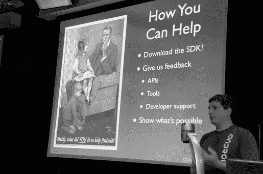
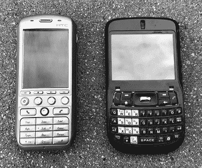

# 第十四章：UI 工具包

UI 工具包提供屏幕上的大多数视觉元素。按钮、文本、动画，以及绘制这些元素的图形，都是 Android 上 UI 工具包的一部分。

2005 年底，UI 工具包尚不存在（当时几乎没有其他任何东西）。有一种低级图形功能，允许使用 Skia 库在屏幕上绘制一些东西。并且有两个关于如何在该图形引擎上构建 UI 工具包的相互冲突的想法。

在一边，Mike Reed 的 Skia 团队有一个工作的系统，使用 XML 来描述 UI，并用 JavaScript 代码来提供编程逻辑。

另一方面，框架团队更倾向于一种以代码为中心的方法。

这个决定，像 Android 中的许多决策一样，是通过纯粹的努力达成的。Andy Rubin 最近决定 Android 将使用 Java 作为主要编程语言。Joe Onorato 决定是时候深入并用 Java 实现 UI 层了。“基本上是一个愤怒的‘让我们做点什么’时刻。花了一天时间，24 小时的马拉松。^(1) 我把 Views [UI 元素] 展示到屏幕上。”

Mathias Agopian 评价 Joe 说：“他没有告诉任何人。一天早上，他出现并说，‘问题解决了，它现在是用 Java 做的了。现在我们不用再讨论这个问题，因为它已经在那里了。’”

Mike Reed 回忆起决定采纳 Joe 的实现方案：“Joe 来时带来了非常明确的想法。尤其是因为我们是远程的 [Skia 团队在北卡罗来纳州]，我们只是退后一步，让它自行解决。”

Joe 向 Andy 演示了他的工作，但效果不如他预期。“第一次我向 Rubin 演示时，他并不怎么印象深刻。我做的第一件事是在 UI 上画了一个红色的 X。显然，那是 Danger 内核崩溃时会绘制的东西。^(2) 我向他展示了我认为是重大成就的东西：‘看，我完成了 View 层次结构！’。但在他看来，这就像是手机崩溃了。他说，‘哇，你让内核崩溃了。’”

但 Joe 的工作是重要的。它使得团队中的开发者能够开始编写其他需要 UI 功能的系统部分。

当然，系统的许多部分在早期开发过程中都在变化，UI 工具包就是其中之一。Joe 构建的系统是多线程的。^(3) 这种方法在 UI 工具包中不常见，因为它需要非常小心的编码，以正确处理那些随意而来的请求，而不考虑线程问题。

2006 年 3 月，在 Joe 编写了初始的 View 系统三个月后，Mike Cleron 加入了 Android。他看到了随着代码库的不断增长，依赖 Joe 的多线程 UI 工具包的复杂性越来越高。

## Mike Cleron 和 UI 工具包重写

Mike Cleron 从未想过自己会进入计算机科学领域，直到大学时才改变主意。“我本以为自己会成为经济学专业的学生，直到我上了经济学 1 课。”他的计算机科学课程反而更为顺利：“我非常喜欢大一时的课程，我们学的不是编程，而是数据结构和算法。我觉得二叉树遍历是最酷的事情。真的是个大书呆子。”

“这是我唯一能获得学位的专业，因为这是唯一一个当我大脑因疲劳而几乎停止工作时，我仍然能相对胜任的事。 我上过一堆政治学课程，差点成为该专业的学生，但在凌晨一点，当我还差 250 页就完成 500 页的阅读作业时，我已经睡着了。但是当我做一个 16 小时的编程作业时，我的爬虫大脑仍然让我在 VT100 上用 Emacs 编程。^(4) 我当时想，‘我最好还是选这个专业，因为我能顺利毕业。’”

他继续深造计算机科学，最终获得了硕士学位，并留在斯坦福大学担任讲师，开发一些本科课程，旨在让学生进入计算机科学的门槛不再像他当年那么高（Mike 所在的那一年，斯坦福大学才首次提供计算机科学学位）。“我在斯坦福的使命就是尽量让那些跟随我脚步的人，少走一些我曾经走过的弯路。斯坦福基本上把所有研究生课程的难度减去 100 分，然后就说‘现在你有了一门本科课程’。他们都假设你已经接受过计算机科学教育，现在只需要学一点关于编译器或自动机的知识。”

Mike 离开学术界后曾在 Apple 工作，1996 年加入 WebTV，在那里与许多未来的 Android 工程师一起工作。WebTV 在 1997 年被微软收购，Mike 继续在那里工作了几年。

2006 年初，Mike 在微软的经理 Steve Horowitz 离开，加入了 Google 的 Android 团队。“正是 Steve 的离开让我觉得是时候离开了。我在微软已经不再那么开心了，而 Steve 的离开也不会让情况变得更好。”

Steve 说：“我记得我和 Mike Cleron 谈话的时候，在我正式加入 Google 之前就告诉了他。我说，‘Mike，我必须告诉你，我刚刚接受了一个去 Google 领导 Android 收购工程的邀请。’我话还没说完，他就拿出了‘这是我的简历！’Mike 是我在 Google 的第一位员工，他在我加入后不久就加入了团队。”

Mike 在 2006 年 3 月加入 Android 后，开始了他在 Android 上的工作，参与了 UI 工具包的开发以及其他许多工作，包括启动器^(5)和系统 UI。他最终成为了被称为“框架团队”的负责人，该团队包含了 UI 工具包、框架团队^(6)，以及系统 UI 的多个部分，如锁屏、启动器和通知系统。^(7)

Mike 在 2006 年 3 月加入 Android 后的第一个项目之一是重写 Joe Onorato 编写的 UI 工具包代码。关于工具包架构的分歧不断加剧；团队中的一些人认为系统的多线程特性使得代码以及使用它的应用程序变得过于复杂。

Mike 认为 UI 工具包有三种可能的方案。“最好的结果是线程安全、易于使用的多线程。第二种是单线程，但至少能理解它。最糟的情况是多线程但有 bug，因为你无法推理它。我们当时正朝着最糟的情况前进。”

Mathias Agopian 讲述了为多线程系统编写代码的过程。“当你写一个 View 时，你不能像传统方式那样写它，不能使用成员变量。^(8) 这导致了很多多线程的 bug，因为应用开发者不习惯这种方式。特别是，Chris DeSalvo^(9) 强烈反对这种多线程方式。Joe 和 Chris 总是争论不休，Chris 说这不行，根本无法工作。Mike 尝试着介入，看看能做些什么。”

Steve Horowitz 作为工程团队的主管也参与其中：“最后是我决定我们要选哪个方向，因为他们彼此无法说服对方。老实说，我认为我们对任何方向都能接受，但我必须做出决定。”

Mathias 继续说道：“Joe 直接放弃了：‘你想怎么做就怎么做。它不再属于我了。’”

之后，Mike 将 UI 工具包重写成现在的单线程形式。“这是我做过的最棘手的 CL^(10)，试图以不同的方式让所有这些东西正常工作。” Mike 的代码为 Android 系统从那时起的 UI 工具包奠定了基础。^(11)

在此过程中，Mike 编写了或至少继承并增强了 Android UI 工具包的其他基本组成部分，如 View（每个 UI 类的基本构建块）、ViewGroup（视图的父容器）、ListView（可滚动、用户可以滑动的数据列表）和各种布局类（定义其子视图大小和位置的 ViewGroups）。

Mike Cleron，在 2007 年 8 月 Google 内部首次关于 Android 的技术演讲中展示（图片由 Brian Swetland 提供）

但 Android 的 UI 工具包不仅仅是视图和布局类。例如，UI 工具包还负责处理文本。

## Eric Fischer 和 TextView

Mike Cleron 说，当他到达 Android 时，“Eric Fischer，就我所知，就是在某座山的石洞里发现了 TextView。TextView 已经是完成的版本。我从来没见过有人在创建 TextView，它一直都在那里。”

几年前，Eric 和 Mike Fleming 曾在 Eazel 合作，Eazel 是由一些早期 Macintosh 团队成员创办的初创公司。当 Eazel 在 2001 年解散后，Eric 和 Mike 一起去了 Danger。

像 Danger 这样的小公司吸引人的一个原因是能够参与多种不同类型的项目，而不像只支持大产品一部分的团队那样机会有限。在 Danger 工作时，Eric 涉及了从文本和国际化到构建系统，再到性能优化的各个方面。多年后，Eric 对 Android 更快的开发过程有了更深的理解。“Android 通过让 Google 而不是运营商最终决定软件中包含的内容，提供了更快、更灵活的开发承诺。”

Eric 于 2005 年 11 月加入 Google 的 Android 团队。“我为 Android 编写的第一段代码是一个 C++ 文本存储类。在我刚到的几周里，我们原以为我们会将用户界面元素编写成 C++ 类，并使用 JavaScript 绑定。”几周后，Andy 决定统一使用 Java 来开发 Android。

“一旦我们决定改用 Java，朝着建立一个可用系统的第一步就是编写 Java 标准库核心类的新实现，我做了一些这方面的工作。除了时区处理外，我相信在第一次公开发布之前，所有这些代码都被 Apache Commons 的实现所取代。”

“我接触过一些软件的其他部分，但大部分工作都集中在文本显示和编辑系统上。最早的开发硬件是带有 12 键数字键盘的‘糖果条’手机，这也是为什么有了 `MultiTapKeyListener` 类来处理那种痛苦而缓慢的文本输入方式。幸运的是，我们很快过渡到了带有迷你 QWERTY 键盘的 Sooner 开发硬件。”

左边是早期的“糖果条”手机，绰号“龙卷风”，团队一直使用它，直到后来的 Soonerc 设备。右边的手机是 HTC Excalibur，它在经过一些工业设计修改后（并将 Windows Mobile 操作系统替换为 Android）成为 Soonerc 的基础。（图片来源：Eric Fischer）

“从一开始，我就确保处理双向文本布局，这对于希伯来语是足够的，但对阿拉伯语就不够了。”^(13)

软件工程师往往会对自己的代码产生情感依赖，Eric 就是如此，他将这种热情体现在了他的车牌上。“我有一块加州的 EBCDIC 个性化车牌，代表了 1960 年代 IBM 的字符编码，它与 ASCII 竞争。44 楼的另一位同事则有 UNICODE 的车牌。”^(14)

在 Google 停车场，UNICODE 与 EBCDIC 作为文本标准进行较量（Eric Fischer 的车上使用的是 EBCDIC）。(图片由 Eric Fischer 提供。)

文本渲染（即绘制屏幕上显示的实际文本像素）由 Skia 在不同的层级处理，这在第十一章（“图形”）中有讨论。Skia 使用一个名为 FreeType 的开源库将字体字符渲染成位图（图像）。^(15)

Android 初期一个普遍存在的问题是性能；当时硬件能力有限，这驱动了很多软件设计和实现的决策。这些决策影响了平台和应用的代码编写方式。正如 Eric 所说，“我所有关于通用性的尝试都被必须足够快速以便在非常缓慢的早期硬件上运行的迫切性能问题所削弱。我不得不做出各种特殊的快速路径，以避免内存分配和浮点运算，尤其是在布局和绘制没有样式标记且没有变换（如省略或密码隐藏）的普通 ASCII 字符串时。”

Eric 观察到团队内部存在持续的紧张气氛，大家对如何构建系统存在分歧。“有时候感觉这个项目本不该成功。这是一个典型的‘第二系统效应’，我们中的许多人之前做过类似的事情，认为可以在没有第一次错误的情况下重新做一遍。来自 Danger 的我们想要基于 Java 类继承构建另一个用户界面工具包，但这次要确保在真实操作系统的基础上，再加上网络另一端强大的服务架构。来自 PalmSource 的人们则想要重新做他们的活动生命周期模型和进程间通信模型，但这次要做到完美。来自 Skia 的人们则想要再次做 QuickDraw GX，但这次要做到正确。我们都错了，而且错得彼此冲突。我们花了几年的时间才理清我们所有早期错误决策的后果以及它们之间的相互影响。”

## Romain Guy 与 UI 工具包性能

2007 年，一位来自法国的实习生 Romain Guy 为正在成长的 UI 工具包提供了更多帮助。

Romain 在高中时成为了一名科技记者，撰写关于各种编程语言、操作系统和编码技术的文章。这份自由职业工作让他获得了当时许多流行平台和语言的经验和接触。他接触到了像 Linux、AmigaOS 和 BeOS 这样的操作系统，并且成为了 Java 的专家。

Romain 在法国的大学里攻读计算机科学专业。但那所学校更注重领导力和项目管理技能，而不是纯粹的编程，Romain 更喜欢软件开发中的编程部分。因此，他来到了硅谷。^(16)

Romain 曾在 Sun Microsystems^(17)实习，在那里他花了一年时间工作于 Swing，这是 Java 平台的 UI 工具包。

第二年，即 2007 年 4 月，Romain 回到美国，在 Google 进行实习。他加入了 Google Books 团队，并被要求参与一个与 Gmail 相关的桌面应用程序的开发。这不是一个让他感兴趣的话题，他在那个项目上只坚持了一周。他认识 Google 的许多人，比如 Bob Lee（大约在同一时间转到 Android 核心库团队）、Dick Wall（负责 Android 开发者关系）和 Cédric Beust（负责编写 Android Gmail 应用程序）。他们说服 Romain 加入 Android 团队，并说服管理层认为团队需要他。Cédric 让 Steve Horowitz 伸出援手，在 Steve 和 Andy 的帮助下，这一切得以实现。^(18) Romain 转到了 UI 工具包团队，在那里他协助 Mike Cleron 工作。

夏天结束时，Romain 飞回法国拿到学位，然后回到 Google^(19)开始了全职工作。他曾收到 Sun 和 Google 的工作邀请，但最终决定加入 Google。“Sun 给我的工作邀请比 Google 的要好得多。我加入 Android 团队是因为我喜欢那个愿景，喜欢我们做这件事的原因。加入 Google 有很多原因，但同样重要的是：这是一个可以使用一个好的开源操作系统的领域。那时，没有一个可行的东西能够大规模服务消费者。”

“Linux 已经有了一些东西。但对我来说，这个项目的机会更大，因为它专注于一个特定的产品。它不仅仅是一个操作系统的规范或理念；它还在构建产品。显然这是一个挑战，成功的可能性不大，但我们有机会实现它。实现这一点的最好方法就是帮助。”

“这实际上是早期工作如此有趣的一部分。直到大概 Gingerbread^(20)，甚至可能是 ICS^(21)，我们都不确定它是否成功到足以存活下来。每次发布并不完全是‘生死攸关’，但也有点像是‘做或者也许你应该小心接下来会发生什么’。”

当 Romain 于 2007 年 10 月作为全职员工加入时，初始的 SDK 就要发布了。平台上仍然有很多工作要做才能达到 1.0 版本。他开始时从使触摸输入功能化做起，这是第一个发布版本的硬性要求。

他还花了大量时间和精力使工具包代码更快。“Mike 要求我提高失效^(22) 和重新布局^(23) 的性能。直到那时，`invalidate()`^(24) 是非常笨的；它会向上遍历整个层级并标记所有项为无效。如果你再调用一次，它会再次向上遍历。这个过程非常慢。所以我花了很多时间添加所有这些脏标志^(25)。这带来了巨大的改善。”

但要做这些工作，他需要一个并不存在的工具。

在 Android 团队有一个悠久的传统，就是开发许多小型、单一用途的开发者工具，每个工具的工作方式都有些不同，而且它们之间并不兼容。随着时间的推移，这种情况发生了变化，大多数这些应用程序现在已经并入 Android Studio IDE 中，以便开发者能够使用一致的工具。但在早期，这些工具是由需要它们的开发者一个一个单独编写的。

在进行视图失效性能优化工作时，Romain 需要一个新工具。“我写了一个 ‘hierarchyviewer’，因为很难知道到底是哪个部分被标记为失效。所以我写了这个查看器，它可以显示视图树，并在视图被标记为脏时用不同的颜色闪烁，显示它们何时会被绘制，以及何时有 `requestLayout()`。^(26) 当我进行优化时，我能够看到发生了什么。它的闪烁次数减少了！”

另一个 Romain 承接的 UI 性能项目是 ListView。

ListView 是一个容器，用于包含（等一下……）一系列项。这个元素的诀窍在于，它天生对性能非常敏感。它的唯一目的是包含大量数据（图像和文本），并能够快速地滚动浏览这些项。关键是“快速”。当项进入屏幕时，UI 工具包必须创建、调整大小并放置这些新项，然后它们在滚动出屏幕的另一边时就会消失。做这些工作需要付出很多努力，而在早期硬件上，工具包无法跟上这些需求，因此用户体验……并不理想。

当 Romain 从 Mike Cleron 那里接手这个小部件时，它能够容纳、渲染并滚动项。但是它的性能远不能令人接受，因此 Romain 花费了大量的精力进行优化。出于性能考虑，避免创建对象和 UI 元素在当时的 Android 开发中是一个通用的模式，而 ListView 是一个很好的例子，能够让我们理解为什么这个模式会演变。

## 启动器和应用

和团队中的其他成员一样，Romain 在那些早期（以及之后）也参与了许多其他 Android 项目。除了核心的 UI 工具包职责外，他还接管了 Mike 负责的启动器应用（Mike 开始领导框架团队并承担了除代码之外的其他职责），并且在负责 Email^(27)应用的承包商离开后，他也提供了帮助。幸运的是，Romain 有相关的技术记者经验。“我曾写过关于如何实现 IMAP 协议的文章，所以我并不完全不懂。但这又是在我们做的其他所有事情之上...这有点多。”

他还帮助了其他应用程序。由于平台是新的，许多功能是为了响应应用需求而开发的。应用程序需要平台的新功能，因此他们与平台团队合作来实现这些功能。

当时应用团队的一个持续努力是性能。“满足他们的需求很重要，但同样重要的是让他们理解事物的成本。这就是为什么 HierarchyViewer 出现的原因，因为应用程序创建了太多的视图。视图层次结构对于我们的设备来说太昂贵了。这是一个向他们展示‘你们创建的这个庞大树形结构，给我们带来了很高的成本’的方式。尽管我们做了所有的优化，但这依然是非常昂贵的。所以它帮助他们了解如何优化代码。这也是我想出`merge`标签、`include`标签和`viewstub`标签的原因，^(28)帮助他们完成需求的同时，也能重新夺回一些性能。”

## 清单密度

在 1.0 版本发布后，仍然有很多工作要做，以便将平台发展到团队最初设想的状态。一个早期开始但在 1.0 时未完全实现的项目是对不同屏幕密度的支持，这在第十三章（“框架”）的资源部分中有所描述。1.0 之后，Romain 接管了 Dianne 早期开始的工作，并在 2009 年秋季的 Eclair 版本发布时完成了它。^(29)

屏幕密度直接影响该屏幕上图像的质量；高密度屏幕可以在相同的空间内呈现更多信息，从而产生更清晰、更好的图像。近年来，高密度屏幕导致了手机和笔记本显示器质量的提升。高密度的摄像头传感器也带来了更高质量的照片，因为这些传感器拍摄的图像的百万像素数大幅增加。^(30)

最初的 G1 设备，以及直到 Droid 发布之前的所有其他 Android 设备，屏幕密度为 160 像素每英寸（PPI），这意味着每英寸的屏幕空间中，垂直和水平方向上都有 160 个不同的颜色值。Droid 的屏幕密度为 265 PPI。更高的密度意味着可以表示更多的信息，从而带来例如更平滑的曲线和文字，或者具有更多细节的图像。但开发者需要一种方式来定义他们的 UI，以便利用这些密度变化。

Dianne 和随后 Romain 实现的系统，允许开发者在不依赖设备上像素实际大小的情况下，使用 *dp*（*密度无关像素*）来定义他们的 UI。然后该系统会根据应用程序运行设备的实际屏幕密度适当调整这些 UI。处理屏幕密度的这一机制，以及资源系统中基于密度提供不同资源的相关功能和整个 UI 布局系统，这些都是 Android 发展过程中至关重要的。随着制造商开始为其客户推出各种不同格式的设备，Android 从一个仅在一种设备类型（G1 及其后续设备，具有相同的大小和密度）上运行的平台，转变为一个充满各种屏幕大小和密度的世界。

## 工具包性能

团队所称的 UI 工具包由许多部分组成，因为它基本上是整个框架的视觉部分。真正定义那个时期团队工作（Joe、Mike、Eric、Romain 和其他人）的，是制定工具包 API 和核心功能，然后专注于性能、性能、再性能。^(31) Android 的 UI 基本上是用户所看到的一切，因此这个平台前沿部分的性能更加重要，因为那里的问题是非常明显的。所以团队不断地优化……并在某种程度上，至今仍在优化。
