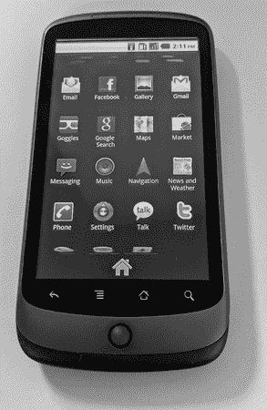
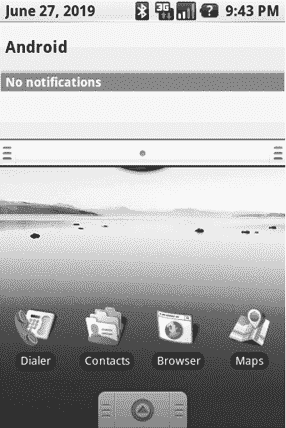
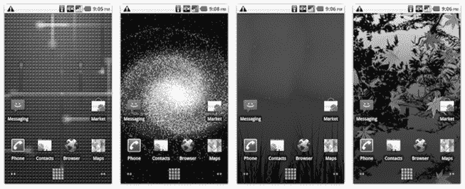
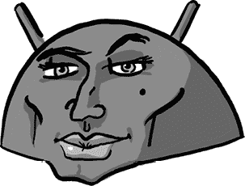

# 第十五章：系统 UI 和启动器

Android 系统 UI 是用户在屏幕上与应用外部的所有视觉元素交互的集合，包括导航栏、通知面板、状态栏、锁屏和启动器等元素。

在团队的早期，所有这些工作都发生在整体框架团队中，这个团队只有少数几个人。像状态栏、锁屏和启动器这样的功能都是由编写核心框架和 UI 工具包代码的人来完成的^(1)。这种处理方式非常高效，因为编写这些功能的人同时也在编写所需的系统平台功能，因此他们能够在问题的两面都实现所需的内容。另一方面，这也意味着他们都非常忙碌。

## 启动器

在 2008 年 1.0 版本发布之前，启动器（负责查看和启动应用的主屏幕应用）仅仅是 UI 工具包的另一个实现细节。UI 工具包团队的原始开发者 Mike Cleron 在将其交给 Romain Guy 之前一直在做启动器的工作。Romain 在接手后继续拥有并改进这个应用，直到多个版本发布^(2)，同时还负责其他 UI 工具包的工作。

Romain 在启动器（以及整个系统）的一个持续项目中，专注于性能优化。Romain 记得 Steve Horowitz 给他的一个限制：“启动器需要在半秒内冷启动^(3)。启动器必须查看每个 apk^(4) 并加载图标和字符串，因此涉及大量多线程代码、批处理和延迟更新 UI 线程。”

Romain 还不断为启动器添加新功能，例如用于组织应用图标的文件夹、应用小部件和快捷方式（主屏幕上的图标），以及主屏幕壁纸背景和页面之间的视差效果。

后来，为了 Nexus One 的发布，Andy Rubin 希望能够呈现一些视觉上令人兴奋的效果。Joe Onorato 解释道：“对于 Eclair，Rubin 想要一些炫酷的东西。”Andy 对具体细节没有过多要求；Joe 记得他说：“做点酷的东西。”在这两个月的时间里，他们利用新设备的 3D 能力写了一个新的启动器。“GL 刚开始变得足够稳定，所以我们做了那个 3D 启动器。”

3D 启动器是所有应用屏幕中的一种特殊效果，持续了几个版本。用户看到的是一个普通的 2D 应用网格，但当他们上下滚动列表时，顶部和底部边缘会像*星际大战*的开场文字效果一样渐隐到远处。这个效果既微妙又强大，暗示了系统背后的 3D 功能（以及系统中可能包含的大量应用），同时又不显得过于张扬或难以操作。

Nexus One 的所有应用屏幕有一个 3D 效果，显示应用列表的顶部和底部滚动消失在远处。

## 通知

几年前，在智能手机出现之前，我经常错过或者迟到参加各种会议。我在电脑上使用一个日历应用，但它更擅长告诉我错过了哪些约会，而不是提醒我即将错过的约会。我记得曾经希望能有一种方式，能实时提醒我这些事件，这样我就不会再错过它们了。^(5)

这种将数字数据与及时更新连接起来的方式，最终通过智能手机上的通知得以实现。当然，这些更新远远超出了日历事件，还包括电子邮件、短信以及来自手机上各种应用和服务的海量更新。

Android 自始至终的一个独特且强大的功能，就是其通知系统，能够在用户没有使用应用时，提醒用户其安装应用中的信息。

在智能手机出现之前，通知功能要简单得多（也没那么有用）。早期的数据设备，如 Palm Pilot PDA，就有日历和闹钟应用中的提醒功能。用户可以配置这些应用播放声音、显示对话框或点亮 LED 灯。因此，这种提醒仅限于用户想到要输入的内容。设备上的所有数据都是由用户创建并同步的；没有信息会从空中传送到设备上。但一旦设备开始连接到互联网，新信息（包括电子邮件、消息，甚至新的日历约会）就可以异步地传送到设备上，用户必须被告知。因此，通知的需求和解决方案应运而生。Dan Sandler，2009 年加入 Android 并领导系统 UI 团队，曾说：“Danger Hiptop/Sidekick 设备在用户提醒的艺术上迈出了谨慎的一步，它在滚轮下方有一个彩虹通知灯，可用于短信和新电子邮件。Android 接过了这个接力棒，并把它做得非常非常好。”

应用程序与操作系统之间一直存在紧张关系。每个应用程序都认为自己是用户生活中最重要的东西，因此用户显然希望随时了解该应用程序的所有信息。与此同时，用户可能会感到惊讶和烦恼，因为他们刚安装的游戏发来了一个通知，告诉他们有一个新关卡可以玩。多年来，系统 UI 团队的工作之一就是为应用程序设定限制，并为用户提供工具，以便用户能够静音那些话多的应用程序。事实上，操作系统本身的部分工作正如 Dan 所解释的那样，“就是为应用程序提供限制。通常这与设备上的共享资源有关，比如文件、CPU 时间和网络。对于通知来说，Android 将用户的注意力添加到了操作系统调解的资源集合中。”

Dianne Hackborn 实现了第一个通知系统；图标出现在屏幕顶部的状态栏中，提醒用户有其他应用程序中的信息。随后，Dianne 和 Joe Onorato 共同开发了通知面板，用户可以从屏幕顶部下拉该面板以显示更多通知信息。用户可以点击面板中的某个项目，从而启动该应用程序，查看新邮件、阅读新短信等等。Joe 解释道：“[Dianne] 做了第一个下拉。但是我花了很多时间让它的物理效果正常工作。”^(6)

Ed Heyl 说：“我记得 Joe 在周末不停地工作，终于弄好了。他在办公室里走来走去，向大家展示，‘看，这个怎么样？看，你只需这样做，拉下来，它就会显示内容，然后就消失。’”

这就是早期 Android 版本中通知的样子。通知栏从屏幕顶部下拉，向用户展示来自所有应用程序的当前警报。

从第一天起，通知就被认为是 Android 区别于其他智能手机平台的一个重要特征。在《*The Verge*》的文章《Android：十年视觉历史》中^(7)，这样写道：“几乎普遍认为，Android 在第一天就做对了通知系统。iOS 要等到三年后才推出一个有效的设计，能够有效地整理来自用户日益增多的移动应用程序的消息和警报。秘密在于 G1 独特的状态栏，可以向下拖动，显示所有通知，形成一个单一列表：短信、语音邮件、闹钟等。这个基本概念（以更精致的形式）延续到今天最新版本的 Android。”

## 动态壁纸

Android 1.0 推出时包含了一个名为*Wallpapers*的功能，允许用户选择一张图片作为主屏幕的背景。壁纸是展示和个性化智能手机大屏幕的好方式。

但 Andy 希望为 Nexus One 带来一些新的和特别的东西，这款手机将与 Eclair 2.1 版本一起在 2010 年 1 月发布。他要求开发一个名为*Live Wallpapers*的功能。既然智能手机不仅拥有大屏幕，而且屏幕后面还有强大的计算机，那么利用计算机来实现动感十足的图形体验，岂不是很好？

所以 Andy 要求框架团队实现这一功能。Dianne Hackborn 和 Joe Onorato 负责底层系统的开发，而 Romain 等人则负责实际的壁纸设计，制定整体外观，并为第一组壁纸确定功能。

他们只有五周的时间来完成这项工作。

Andy 最初要求这些壁纸使用 Processing 图形渲染系统实现。这在功能上是一个很棒的主意，但当 Romain 在 Android 上实现时，他发现这个方法对于手机来说速度不够快。由于动画速率只有每秒一帧，壁纸更像是“死”而不是“活”。因此，Romain 找到了一种不同的方式使它们能够运行。

Jason Sams（团队中的一位图形工程师，曾与 Mathias、Dianne、Joe 等人一起在 Be 和 PalmSource 工作）当时正在开发一个名为 RenderScript 的低级图形系统，该系统允许应用程序利用 CPU 和 GPU 快速绘制图形。Romain 使用 RenderScript 实现了需要流畅动画的壁纸，并最终为发布编写了以下四款壁纸：

+   Grass，展示了草叶在天空背景下轻轻摇曳，背景的颜色会根据手机所在位置的时间变化。

+   Leaves，展示了树叶在水面上飘落，形成涟漪。这是团队的共同努力，Mike Cleron 将一个由 Mathias Agopian（或者是 Jason Sams）编写的涟漪效果整合进壁纸中，并加入了他自己拍摄的^(8)来自他庭院中日本枫树的叶子照片。

+   Galaxy，展示了一个“3D”^(9)的宇宙视图，庞大的星空围绕中心旋转。

+   Polar Clock，以更具视觉趣味的方式显示时间。

四款随 Nexus One 发布的 Live Wallpapers：Particles、Galaxy、Grass 和 Leaves（图片来源：Android 开发者博客，2010 年 2 月 5 日）

除了这些壁纸外，Mike Cleron 编写了一个名为 Particles 的壁纸，Marco Nelissen（负责平台音频的开发人员）编写了三款壁纸，其中包括两个声音可视化器。

在五周的周期结束时，团队完成了一个完全功能化的动态壁纸系统，包括一个 API，外部开发者可以使用这个 API 来编写自己的壁纸。遗憾的是，Romain 在这五周期间只发明、设计、原型和实现了四个壁纸，最终团队发布的设备壁纸数量少于 Andy 所要求的十个。

## Android 的面孔

Android 的系统 UI 提供了图形化的功能，让用户能够控制他们的设备。从登录、及时通知、到浏览界面、再到启动应用程序，系统 UI 是用户在设备上交互的第一个类似应用的界面。它使用户能够获取所需的功能和信息，这正是智能手机的核心所在。

Dan Sandler 给我发了这张图，说：“在我多次将系统 UI 描述为‘Android 的面孔’之后，我创造了这个非官方的 logo... 这让大多数团队成员都感到震惊。”
