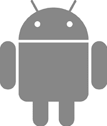
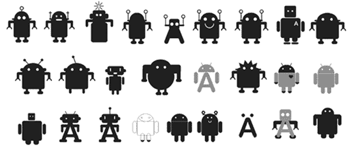
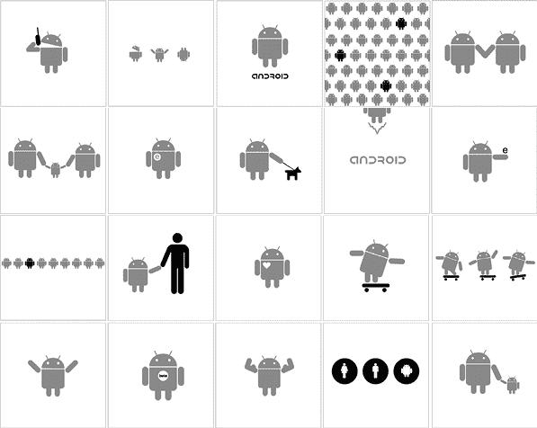
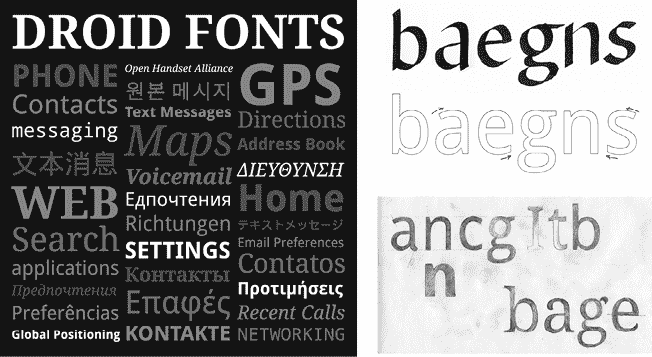
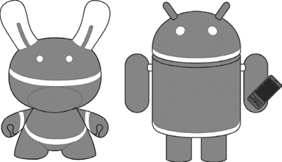
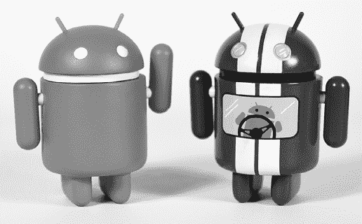
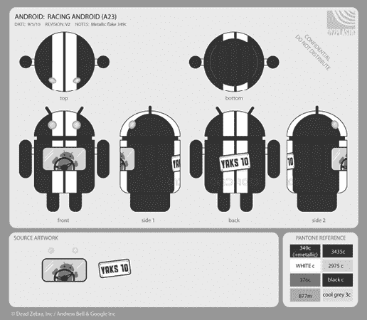
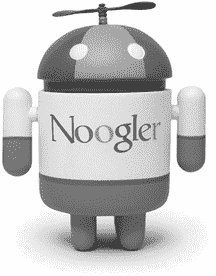
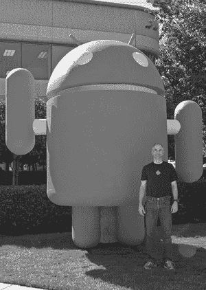

# 第十六章：设计

> 设计就是一切。设计就是人们如何看待一个产品，使用产品时的感受。它是某个东西成功和失败的原因之一。
> 
> —Irina Blok

## Irina Blok 和 Android 吉祥物

Android 操作系统最具辨识度的方面之一就是绿色机器人吉祥物，由 Irina Blok 设计：

尽管这个标志现在已经成为全球 Android 的象征，但最初只是为开发者设计的。Irina 说：“我们的目标是激发开发者社区的兴奋感，创造出类似 Linux 企鹅的东西。”

这个设计项目没有太多的约束。Android 团队来找 Irina 的内部品牌团队并提出了请求。他们说产品的名字是 Android，并且希望有一个引人注目的发布故事。他们建议将其设计得像人类，并希望设计能够激发开发者的兴趣。

Irina 花了大约一周时间提出各种想法，才提交了最终设计。

Irina 在创作最终 bugdroid 图像（如右侧第二排最右端的图片；图片由 Irina Blok 提供）之前制作的一系列草图。

请注意，草图中的黑色标志并非“黑色”，它们实际上是无色的；黑色只是她在早期形状和想法迭代时使用的中性色。你可以看到许多设计中都有 Android 的字母 A（尽管不是最终版本）。你也可以看到早期设计中标志的黑色版本，位于底部中央。那接近设计的最终结果（加上了两根天线），但 Irina 记得这是她最初的一个想法。

最终设计中一个重要的元素就是形状本身。“这个标志的灵感来自一个国际符号。它是一个非常简单的人类符号。我尝试为 Android 想出一个类似的符号。” Irina 曾在其他品牌项目中使用过象形符号的概念，这些符号之所以有力，是因为“人们如何看待象形符号和标志，以及它们如何在没有语言的情况下进行交流。它们如此简单，能够跨越所有文化进行交流。”

Irina 还追求简洁：“因为这个标志是作为蓝图设计的，所以形状本身不能过于复杂。”

*蓝图*指的是最终设计的另一个方面：它被发布为开源，鼓励开发者使用并创造基于这个主题的变体：“它可以有不同的装饰。这就是这个标志系统的含义。”

关于吉祥物发布的一些元素使她的蓝图系统得以实现。其中之一是 bugdroid^(1) 被明确授权用于再利用，采用了 Creative Commons 许可证。在 Android 品牌指南网站上写道：“绿色的 Android 机器人可以复制和/或修改，只要包括以下 Creative Commons 署名行…”

这个许可赋予任何人使用和修改机器人的权利。但如果它只是一个小小的 JPEG 文件，便不会产生有趣的变化。这就是战略的第二部分开始发挥作用的地方：标志以多种文件格式发布，这些格式便于重新设计。首先，有一个高分辨率版本的 PNG 格式，带有透明背景。但如果你真的想修改图像，你会需要其他*矢量*格式（EPS、SVG 和 AI），这些格式可以让你直接处理机器人的几何形状。

让机器人自由可用是一次革命性的举措。伊琳娜谈到了更传统的品牌塑造方式：“身份体现在品牌指南中，那是一本内容非常庞大的书，里面有很多限制：‘这是标志周围的清晰空间，这里是颜色...’ 标志是神圣的。而这完全摧毁了传统观念。” 这个标志的这一方面并不是来自安卓团队，而是来自伊琳娜的品牌团队，回应安卓开源的做法：“这是我们为此提出的创意方案。作为设计师，你的工作就是传达产品的意义。这在当时是一个革命性的创意。这个并不是我们作为一个限制被赋予的；这是我们的解决方案，我认为这是这个标志最棒的地方。”

一旦机器人被释放到公共领域，它就开始超越谷歌和安卓的范围。“这个标志作为一个系统发布，它开始拥有了自己的生命。它开始有了维度，你可以看到雕塑。它几乎就像是生下一个孩子然后看着这个孩子成长。它开始迈出第一步，然后开始说话。等它走了出去，我从远处看着它成长。”

一旦外部社区接手了机器人，它便超越了最初面向开发者的目标受众：“它最初只是一个面向开发者的发布，原本并不打算成为面向消费者的标志。这是一个小项目，专注于开发者。但它变得如此受欢迎，以至于它变得越来越大，最终发展成了面向消费者的标志。”

衡量任何产品品牌的有效性可能是困难的。“有时候你根本无法衡量品牌的影响力。品牌赋予了产品个性，并激发了兴奋感。因为我们都是人类，这很情绪化，它有助于讲述故事，并与品牌建立联系。这也激励了开发者开发更多的东西，同时也激发了消费者的热情。”

“设计就是一切。设计是人们如何看待一个产品，以及他们在使用产品时的感受。这是某些东西成功和失败的原因之一。”

“当时，你并不会考虑这些事情——你只是在完成任务。所以这非常直观。你不会为标志做用户研究：你只会去完成它。”

## 获得绿灯

那么，最初 logo 中标志性的绿色呢？机器人的变体有各种颜色，但绿色是最初的颜色，也是与之相关的主要颜色。Irina 说：“绿色是代码的原始颜色。”

就像绿色文字显示在黑色终端屏幕上，比如 VT100，这是一种回顾早期编程的方式（也是电影*黑客帝国*中的场景，这些视觉效果回溯到同样的终端编码起源）。这个 logo 永远都和软件有关。

随着最终设计的完成，Irina 还提交了一些变体，激励大家进行创意尝试。

Irina 提交的机器人变体，用来激发灵感，其中许多最终出现在 Google 商城的 T 恤上（图片由 Irina Blok 提供）

“我的工作是激发灵感，并试图提出使用这个标志的指南。但不是根据我个人的理解来反复修改。因为这不是关于我，而是关于每个人。”

## Jeff Yaksick 和 UI 设计

Android 用户界面的设计多年来经历了几次重大变化和几代人不断的完善，每一次努力都让其更加精致和一致。但在开始时，甚至没有一个单独的设计师，更不用说设计团队或设计理念了。

Jeff Yaksick 是最初的 Android 设计团队成员。他直到 2005 年 12 月才加入 Android 团队，那时 Android 团队在 Google 已经成立了六个月，差不多是在招聘开始加速的时期。

Jeff 的职业生涯始于 NeXT Inc.，但后来他转到 WebTV（该公司后来被微软收购），在那里他与未来的 Android 团队成员合作，包括 Chris White、Andy Rubin 和 Steve Horowitz。在共同创立 Android 后，Chris 联系了 Jeff，看看他是否有兴趣加入他们的创业公司（当时专注于相机操作系统）。但 Chris 无法保证 Android 的未来能像 Jeff 在微软的工作那样稳定，于是 Jeff 选择留在原地。然后，Google 在 2005 年 7 月收购了 Android，Jeff 于同年 12 月加入了 Android 团队。

当 Jeff 加入时，并没有太多需要设计的东西；最初的 Android 系统刚刚开始成型。所以他处理了一些基础的视觉设计，比如按钮的外观和复选框。他还参与了配色方案、渐变和字体的设计。

“其中一件最早的事情就是：我们用什么字体？我看了当时所有开源字体的资料。我找到的原始字体不够广泛，无法满足 Google 想要全球化的需求。^(2) 所以我和 Ascender 字体工作室合作。我帮助艺术指导了‘Droid’字体的设计，这是系统字体。”

设计草图和最终版的 Droid 字体（图片由 Steve Matteson 提供）

最终，当德国·鲍尔（German Bauer）于 2006 年 9 月加入时，Jeff 得到了一些帮助。Jeff 和德国一起处理了广泛的设计任务，从 UI 控件的外观到启动器，再到邮件和浏览器应用程序的设计。

最终，由于首个版本发布需要大量设计工作，Andy 与瑞典的 UX 设计公司 The Astonishing Tribe（TAT）签订了合同。TAT 设计了系统的整体外观和随 G1 发布的核心体验。^(3) Jeff 和 German 继续协助处理各种应用程序，如设置，并为系统完善了小部件集（按钮、复选框和其他 UI 元素）。当 TAT 的合同到期时，他们也接手了 TAT 的所有工作。

在 1.0 发布前的紧张时刻，有一股疯狂的压力去重新实现手机 UI。由于必须符合一些法律约束，手机界面外观和功能必须做出一些调整，这需要大量的重新设计工作，而时间却所剩无几。“我们拼尽全力，做了巨大的努力去重新设计手机体验，以便能够真正发布一款手机。我设计了这种带有渐变色的暗主题 UI：连接时为绿色，挂断时为红色。接近发布时，在我们发货前，Andy Rubin、我和 Sergey Brin 进行了一次审查。Brin 对速度非常挑剔，他说，‘为什么需要渐变色？它们消耗更多的处理能力。’我想他会更喜欢屏幕上有大按钮，没什么特别的。我从微软来到 Google，还是有点新，我并不完全了解 Sergey Brin 和 Larry Page 其实是掌控全局的。所以，我对 Sergey 有点带刺。”

Bob Lee 也提到了创始人与设计师之间的这种动态：“我们刚开始时，Larry 和 Sergey，可能是 Sergey，坚持认为不需要动画^(4)，因为那是浪费时间。从现在看手机... 这也可以解释为什么 Android 一开始显得更加简朴。”

在 1.0 发布之后，仍有很多工作要做，因为系统不断发展。Jeff 开始着手早期的软件键盘体验，这是 1.0 之后的新功能，因为 G1 在 1.0 时只使用硬件键盘。设计团队在 1.0 之后也开始壮大，加入了更多的设计师和团队领导。

## 玩具

Jeff 还帮助处理了一件事，那就是 Android 玩具。

Jeff 在接近 1.0 的早期就开始对*城市塑料*^(5)玩具产生兴趣。他有了制作一个 Android 玩具的想法。Android 工程师 Dave Bort 与 Andrew Bell 是朋友，后者经营着 Dead Zebra 艺术工作室。^(6) Jeff 向 Andrew 发送了一些他的想法，他们与 Dave 和 Dan Morrill（Android 开发者关系团队成员）合作，让这个想法成真。

Jeff 向 Andy 发送的原始效果图，提议制作一系列 Android 小玩偶（图片由 Jeff Yaksick 提供）

从那个最初的玩具开始，逐渐发展出了一个持续的 Android 收藏玩具系列。定期（几乎每年）推出一套新的设计（然后迅速售罄）。Jeff 为这些设计贡献了三款：Noogler、Racer 和 Mecha。

Jeff 设计的 Racer 小雕像（右侧），与经典的 Bugdroid 一同展示（图片由 Andrew Bell 提供）

Racer 小雕像的设计图（图片由 Andrew Bell 提供）

Jeff 设计的 Noogler 小雕像。“Noogler”是谷歌用来称呼新加入公司的人的术语（如“新谷歌员工”）。小雕像上的帽子类似于所有 Noogler 在谷歌第一周获赠的帽子。（图片由 Andrew Bell 提供。）

Jeff 参与设计的另一件小雕像略有不同：第一座草坪雕像。在接近 1.0 版本发布时，Andy 决定在谷歌校园的 Android 大楼前放置一座雕像。Andy 认识一个制作泡沫雕像的人：Giovanni Calabrese，他是 Themendous 公司的老板。他把 Jeff 介绍给了 Giovanni，Jeff 发送了一些设计稿，他们完成了这件事。最初，Andy 要求一个比现实情况中可能的更大的雕像，但考虑到从工作室运输的现实情况，他们缩小了尺寸以便顺利进行。^(7)

最初的 Android 雕像（昵称为“bigdroid”），2008 年 10 月，与 Andy McFadden 一起展示，用于比例显示，雕像多年来一直矗立在 44 号楼前的草坪上，那里是大部分初始团队的工作地点。（图片由 Romain Guy 提供。）

Jeff 回顾了 Android 和谷歌的设计演变：“当我加入谷歌时，它可能类似于微软早期，当他们开始制作 Windows 95 和 Vista 时。那时，设计开始变得重要起来。NeXT、微软、谷歌——它们都是工程为基础的公司。说服工程人员这些东西很重要一直是个挑战。我认为苹果绝对帮助推动了这一进程：设计很重要。”
