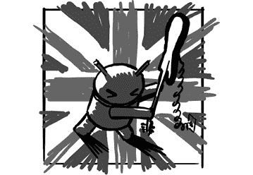

# 第十八章：倫敦呼叫

来自大西洋另一侧的浏览器团队也得到了促进。

谷歌的伦敦工程办公室最初是为了从事移动项目而设立的……但并非 Android 项目。伦敦的工程师们使谷歌的应用程序和服务能够在当时多种移动平台和设备上运行。在 iPhone 和 Android 推出之前（以及它们发布后的最初几年），全球有许多手机平台，谷歌希望将其应用程序提供给这些平台。

移动项目最初在山景城开始，吸引了像 Cédric Beust 这样的人才，他领导了一个团队，使 Gmail 能够在移动设备上运行。但最终，谷歌在伦敦开设了一个新办公室，负责为当时两大主流移动操作系统——Symbian 和 Windows Mobile——开发软件。

早期团队成员 Andrei Popescu^(2)谈到了为何选择伦敦来进行这项工作：“2007 年，核心的移动专业技术在欧洲，而不是美国。欧洲的 3G 技术发展早于美国。如果你看看当时开发的移动操作系统，技术中心就在欧洲。Symbian^(3)是在伦敦开发的，Series 60 和 UIQ^(4)是诺基亚和爱立信在 Symbian 之上开发的。所以谷歌做出了一个有意识的决定，将移动技术中心建立在伦敦。”

“我们在招聘方面也做得很好——伦敦是一个很棒的招聘地点。我们能够吸引来自世界各地的人才，而且欧洲有许多优秀的计算机科学学校。从地理位置上来看也很合理，”因为伦敦是距离加利福尼亚（谷歌总部所在）的主要欧洲城市之一，而且两地之间有直飞航班。

但该网站需要为移动项目寻找负责人，因此在 2007 年初，谷歌聘请了 Dave Burke。

## Dave Burke 和伦敦移动团队

Dave Burke 从小就对计算机感兴趣。他将一个操纵杆、一个光电池、一只家庭投影仪的放大镜、一台录音机、一台语音合成器和一些自己写的代码结合在一起，制造了一个装置，可以向进入他房间的人发射橡皮筋。“我上瘾了。我的可怜的妹妹。”

他在本科和博士阶段学习了电气工程，之后在一家初创公司管理工程团队。到 2007 年，他决定自己想要更多的经验，而这些经验是那家小公司无法提供的，于是他加入了谷歌，领导新的移动团队。当时他想搬到硅谷，但伦敦正是当时的机会所在。^(5)

2007 年，伦敦发生了两项独立的移动项目：移动搜索和浏览器相关工作。该团队使谷歌的软件在这些领域能够在各种非 Android 设备上运行。与此同时，Dave 开始接触 Android，学习 API 并编写 Android 应用程序。

在 Dave 加入后的九个月，Android SDK 正式上线。伦敦将举办一个大型活动，Rich Miner 邀请 Dave 做一个关于 Android 的演讲，向观众介绍 SDK。于是 Dave 在众人面前进行了现场编码^(6)，在八分钟内创建了一个简单的网页浏览器应用。

演讲进行得很顺利，Dave 对结果感到很满意，直到第二天。“我收到了 Andy Rubin 发来的邮件，内容是‘这个人到底是谁，为什么他要公开谈论我的项目？’”显然，Rich 还没来得及告诉 Andy，他已经邀请 Dave 做这个演讲。

Dave 说：“我和 Andy 的关系一开始非常简单。我觉得，关系只会越来越好。”

随着时间的推移，伦敦团队开始为 Android 做更多的项目。与此同时，Dave 的团队正在开发的应用最终被产品团队直接接管（例如 YouTube）。移动团队被解散，Dave 的团队进入了 Android。

## Andrei Popescu 和伦敦浏览器团队

Andrei Popescu 的团队负责伦敦的移动浏览器项目。由于 Andrei 曾在诺基亚从事过类似的工作，他自然成为了该项目的首选。

在罗马尼亚布加勒斯特获得计算机科学本科学位后，Andrei 离开了祖国，前往芬兰赫尔辛基攻读硕士学位。他原本计划在拿到学位后返回罗马尼亚。那是二十多年前的事了：“我仍然在这条路上。”

在完成研究生学业后，2002 年，Andrei 在赫尔辛基的诺基亚找到了一份工作，参与了 MMS^(7)编辑器的开发。“我当时非常沮丧：我在两个国家完成了所有的学习，获得了硕士学位，但现在却在做这个小小的垃圾东西，功能有限，且是在一个当时已经显得非常古怪和难懂的 C++变种上做的系统。那时候，我没有远见去意识到，我正在从事一项将改变世界并塑造我未来几十年职业生涯的技术（移动技术）。”

幸运的是，他在诺基亚遇到了 Antti Koivisto，Antti 当时正在做一些更有趣的事情。“他正在低调地为诺基亚手机开发一个完整的网页浏览器，基于一个叫做 WebKit 的库，支持 Symbian 操作系统。”他们成功地实现了这一点，并将完整的浏览器应用发布给了大量的诺基亚用户。

在那个项目之后，Andrei 想搬到伦敦。他不在乎具体的工作内容，只想搬家。“谷歌对我来说是一种梦想。但对我而言，当时唯一的动力就是搬到伦敦。我投了数百份简历，收到了一个回复：谷歌。”

Andrei 在 2007 年 1 月加入谷歌，成为移动团队的一员。最初，他负责将 Google Maps 应用到诺基亚手机上的项目。但很快，他开始了一个名为 Lithium 的项目，计划为 Windows Mobile 开发一个完整的网页浏览器。

安德烈的团队包括本·默多克（当时是实习生^(8))、史蒂夫·布洛克和尼古拉斯·鲁阿尔。

## 尼古拉斯·鲁阿尔，准备起航

在法国上大学并在一家创业公司工作后，尼古拉斯开始了在威尔士的博士课程。最终，研究资助用完了，“我还需要养活自己。”于是，尼古拉斯带着博士学位申请了伦敦的谷歌，并于 2007 年 4 月加入，开始参与安德烈的锂电池项目。

锂电池是基于 WebKit 浏览器引擎构建的一个应用程序。想象一下，如果你手机上使用的浏览器不是预装的，而是需要作为一个独立的应用程序下载。原型看起来有希望，但……体积庞大。锂电池要求用户为手机下载一个非常大的（二进制文件，尤其在当时）文件。该项目最终被取消，安德烈的团队转而开始开发 Google Gears。

Google Gears 是谷歌推出的一项努力，旨在为当时的浏览器提供更丰富的功能，如本地存储和地理定位^(9)。随着 HTML5 的出现，这些功能逐渐成为浏览器的标准，Gears 最终被停用。Gears 于 2007 年首次发布在桌面平台上，安德烈的团队使其在移动浏览器上也得以运行。

最初，团队将 Gears 移植到 Windows Mobile 平台。到这个时候，当 Android SDK 发布时，已经可以明确看出，Android 平台和产品至少在某种程度上将会存在。因此，团队开始将 Gears 移植到 Android 浏览器。Gears 作为浏览器的一部分继续发布，直到 2009 年底的 Donut 版本被最终弃用；这时将这些功能直接集成到浏览器中更为合理。

在安卓初期，安卓团队以外的谷歌工程师并不能轻松地向安卓贡献代码。事实上，他们无法做到；安卓团队以外的人甚至没有权限或许可这么做^(10)。但安德烈团队的工作对安卓平台至关重要，因此他们被纳入其中。安迪授予安德烈的团队完整的源代码访问权限，使他们成为当时唯一能访问这些源代码的安卓以外的团队。

随着团队与安卓浏览器的合作越来越多，他们逐渐成为了整个浏览器团队的一部分。安德烈的团队主要专注于前瞻性的浏览器功能。例如，他们致力于创建和实施地理定位的网页标准。他们还让视频元素^(11)（HTML5 中的另一个特性）在浏览器中得以实现。

2008 年，在 Android 1.0 发布前夕，移动团队的副总裁（Vic Gundotra）解散了移动团队，包括 Dave Burke 的伦敦团队。移动项目被吸收到各个独立的产品团队中。自从开始进行移动努力以来，移动计算和设备的格局发生了剧烈变化。iPhone 自 2007 年中期发布并且很受欢迎，而 Android 也即将发布。智能手机引领着一个新世界，移动应用将变得越来越重要，公司也在将移动能力更直接地融入到其产品中。

Dave 的团队已经证明对 Android 非常成功和有用，因此在 Hiroshi Lockheimer 的帮助下，他们说服 Andy 将他们全部引入 Android 团队。他们放弃了为其他平台所做的工作，完全专注于 Android 的工程努力。

## Android 和 Web 应用

Android 的浏览器和网页技术持续改进，团队也不断投入更多的努力和人力到这个项目中。2013 年，Android 浏览器（以及 WebView）被 Chrome 取代，公司决定，多个团队和项目专注于类似的技术目标可能没有意义。WebView 和浏览器仍然是移动技术栈中重要的一部分，允许用户浏览丰富的网站，也允许开发者使用网页技术编写应用程序。
