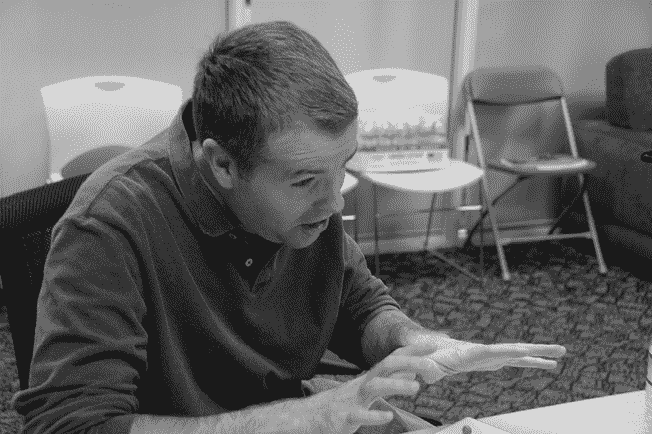

# 第二十章：Android 服务

> 只需轻轻点击鼠标，就可能导致移动行业前所未有的灾难^(1)。
> 
> — Android 服务团队口号

在大多数情况下，Android 团队与 Google 其他团队独立运作。Google 为项目提供资金，并与领导团队保持联系，但其他方面则让他们自行决定。Android 团队低调工作，编写操作系统、工具、应用程序及其他所需的所有内容，而无需与 Google 更大的工程团队互动。

除了服务团队。

如果你正在开发一款单机游戏，只需处理本地设备和存储，你可以独立完成，不需要任何后端基础设施或机制。但对于大多数其他应用程序，它们需要处理应用外的信息，或是你希望存储在设备外的数据，你可能需要与后端系统进行交互。运行在设备上的应用程序，实际上只是通向存储在外部服务器上的数据和服务的窗口。地图、搜索、Gmail、日历、联系人、Talk、YouTube：所有这些应用程序都依赖于存储在 Google 服务器上的数据和功能。

Google 希望通过 Android 操作系统使其应用和服务能够在移动设备上使用。因此，解决如何将 Android 设备连接到 Google 后端服务的问题变得至关重要。

为了确保这项工作得以完成，Android 成立了服务团队，最初只有三个人：Fred Quintana、Malcolm Handley 和 Debajit Ghosh。

## Debajit Ghosh 和日历

Debajit 一直以为他会在大学学习科学，同时通过编程来支持他的主要学术兴趣。但在高中时，他意识到他可以将编程作为自己的*主要*兴趣。因此，他改变了方向，进入计算机科学专业，1998 年获得硕士学位。

Debajit 花了几年时间从事语音识别工作，这项工作结合了他对移动设备日益增长的兴趣以及让用户能够随时随地获取信息的能力。2005 年，一位同事加入了 Google，组建了语音识别团队。他联系了 Debajit，看看他是否有兴趣加入 Google，参与移动技术的工作。

起初，Debajit 并不感兴趣，他想：“Google？我不想去 Google 工作——那家公司太大了。”但当他想到一些移动技术的可能性时，他改变了主意，想：“我不确定 Google 适不适合我，但了解移动技术真的很有趣。”

Debajit 于 2005 年初加入了 Google 的小型移动团队（不是 Android 团队）。该团队的任务是将公司服务提供给现有的移动设备，并邀请 Debajit 领导服务器端团队。“我开始做的第一个项目是将传统网页转码为可以在当时手机上极为简陋的浏览器上查看的格式。”手机上的浏览器应用会发出请求，试图查看某个网站。该网站的内容会下载到 Google 服务器，并转换为该有限设备可以处理的格式，然后这种简化版的网页会被发送到手机上。这与 Danger 多年前为 Hiptop 手机浏览器使用的方法相似，也与 WebTV 早期为其电视浏览器采用的方法类似，服务器负责转换网页的实际显示效果与设备实际能显示的内容之间的差异。

2005 年春天，Debajit 度假归来时，发现桌上堆满了简历，并收到了一项任务，要面试一个名为“Android”的初创公司，Google 有意收购这个公司。“我还处于度假后的迷茫状态，试图搞清楚，‘Android？这到底是个什么东西？’”

他对团队中的工程师进行了面试，包括 Brian Swetland 和 Ficus Kirkpatrick。“Ficus 花了很多时间谈论 Brian，所以我很早就了解了一些团队成员的个性。”

Debajit 继续在移动团队工作，偶尔与 Andy Rubin 和他的团队进行沟通。然后，在 2006 年底，他联系了 Cédric Beust，他曾是移动团队的同事。他还与 Android 的工程总监 Steve Horowitz 进行了交流，进一步了解他们的需求。团队开始考虑 Google 服务的内容。例如，Android 需要为日历应用程序制定一个方案，并考虑如何与 Google 的日历服务进行同步。

与此同时，Debajit 一直在做一个副项目，将日历信息同步到 J2ME 设备。他仍然对如何将信息传递给随时在外的人感兴趣，而日历数据是解决这一问题的重要组成部分。在与 Android 团队交谈时，他意识到，通过加入他们，他可以将副项目转变为全职工作。因此，他转到了 Android 团队，加入了现在由三人组成的 Google 服务开发团队。

团队中的每位工程师都负责为特定应用开发服务。Fred Quintana 与 Jeff Hamilton 合作，后者负责为 Android 编写联系人应用。Malcolm Handley 与 Cédric 一起开发 Gmail。Debajit 与 Jack Veenstra 一起负责日历应用程序。^(2) 所有这些应用程序都有相同的需求，即在 Google 服务器之间发送和接收数据，因此团队在一个集中式同步机制上进行了合作。

在初期的服务工程团队开始运作后，Andy Rubin 从他在 Danger 时认识的人那里引入了一位领导者来带领这个项目：Michael Morrissey。

## Michael Morrissey 与服务团队

Michael Morrissey 在大学和研究生院学的是数学，但他意识到自己更喜欢做编程。^(3)他开始玩 BeBox，最终得到了 Be 的工作。

Michael 最感兴趣的事情之一是打印——他喜欢操作系统、驱动程序和图形代码之间的互动。这对他来说是件好事，因为当时 BeOS 的打印状态非常糟糕。Michael 记得，“Jean-Louis Gassée，Be 的创始人兼首席执行官，有一天因为无法打印而非常生气。他总是必须切换到 Mac 上打印东西。他真的，非常生气。”

Michael 鼓励外部开发者为 Be 编写打印机驱动程序。这也是他第一次遇到 Mathias Agopian（后来加入了 Android 的图形团队）。 “他编写了所有这些了不起的 Epson 驱动程序。他非常热衷于色彩方面的工作。他一直在不断发送这些驱动程序。”Mathias 做这些工作是作为兴趣爱好，但最终他加入了 Be。

Michael 在 Be 经历了一个毫无灵感的首次公开募股（IPO）后，离开了公司，并且公司接着转向了一个注定失败的互联网设备。根据 Hiroshi Lockheimer 的建议，他最终于 2000 年 3 月加入了 Danger。最初，公司在开发一款小型设备，可以携带联系人和电子邮件，然后通过连接其他设备进行同步。但是在 Michael 加入后不久，互联网泡沫破裂，迫使公司开始考虑其他产品方向，最终推出了 Danger 的 Hiptop 手机。

在 Danger 工作的期间，Michael 负责后端服务，将手机上的应用程序与 Danger 服务器上的数据以及互联网进行连接。“我喜欢服务器端的工作，于是我开始构建后端和设备与服务器之间的协议。”例如，Danger 手机用户需要连接许多不同种类的电子邮件服务。Danger 服务器不会将这些服务都本地化到设备上，而是通过服务器连接这些不同的电子邮件服务，并将结果翻译成 Danger 设备能够理解的单一协议。同样，浏览器也是通过服务器将完整的网页翻译成简化版，并发送到手机上。

Danger 的创新之一是设备与服务器之间的持久连接。通过这种连接，设备可以立即收到新的电子邮件或消息。这在 2002 年是一个巨大的突破。即使你当时拥有少数几款具备电子邮件功能的手机，这些设备通常也需要手动与计算机同步。所以，你会在会议结束一小时后才收到关于你需要参加的会议的消息。但在 Danger 手机上，你会在会议进行时就知道自己错过了会议。

2005 年，Michael 离开 Danger 加入微软，受到一个新兴项目的吸引，该项目旨在制造微软手机。当时，微软将操作系统授权给像 HTC 这样的制造商。但微软内部有人设想了一个未来，认为公司也可以制造自己的手机。这基本上就是苹果所追求的模式，只不过微软当时的操作系统是可以授权的（类似于 Android，不过 Android 是免费的）。

但该项目在公司内部难以获得支持，因为它与微软传统的软件业务背道而驰。在一次令人沮丧的会议中，Michael 回忆说，一位高管因为手机无法运行 PowerPoint 而拒绝签署该手机为 Windows 设备，尽管这个应用场景并不是手机的重点，而且这个功能非常有限的设备根本无法承担额外的负担。通过类似的会议和其他各种障碍，该项目在推进过程中遇到了很大困难。

与此同时，Andy Rubin 每个季度都会与 Michael 联系，看看他是否想来帮助 Android。最终，Michael 对微软的项目失去了耐心，于 2007 年春季加入了 Android，领导服务团队。他看了看团队的现状，告诉 Andy 和 Steve 他们需要做什么。“他们说，‘太棒了！去吧。去做。’”

Michael 帮助组织团队，确保所有事情都能顺利进行。“我在 Danger 工作时有幸接触过这些事情，所以我知道什么样的模式适用于这些事情。我看到了更大的图景，理解服务架构的必要性：如何建立持久连接，传输层应该是什么样的，以及你需要注意的所有‘地雷’。”

Michael 也在努力扩大团队规模。他需要那些懂得如何处理 Google 基础设施的人。“我很早就意识到，如果我们没有来自 Google 内部的人，我们就不会有任何进展，因为 Google 做事情的方式非常独特。如果我们引入那些拥有移动行业领域知识的人，但没有 Google 知识的人，那就不好，因为他们需要花费很长时间才能适应 Google 的工作流程。我觉得，如果我们从 Google 内部找人，然后把他们转到 Android，并且在此过程中向他们传授移动领域的知识，会更有效率。”

其中一个早期需要解决的问题是推送功能：当服务器端发生变化时（例如，用户的邮箱收到新邮件，或者日历事件更新），服务器需要更新设备，以确保手机上的数据与服务器上的数据匹配。Debajit 创造了“tickle”这个术语。“我们想要‘tickle’设备。我们提出了像 Light Tickle 这样的术语，告诉设备发生了变化，请进行同步。Heavy tickle：包括负载。我们更倾向于使用 Light Tickle 方法，但这取决于具体的使用场景。”

团队提出了一种方法，手机将与 Google 服务器后端建立一个单一的、专用的连接。这个连接被称为移动连接服务器（MCS），将是持久的，以确保信息可以随时发送或接收，保证手机在服务器上有新信息时能得到通知。每个应用都有其特定的数据需求，但它们都共享这个单一的连接，通过这个连接，服务器会提醒设备某些信息已发生变化。该连接还用于最初的 Google Talk 功能，用于发送和接收消息。

建立与 Google 服务器的持久连接不仅是一个技术问题，还涉及到资源有限的问题。

Michael Morrissey，2008 年 10 月 21 日——G1 发布前一天（图片由 Brian Swetland 提供）

网络运维团队控制着 Android 所需的持久连接机制。当时，Google 假设所有需要网络连接的东西都是基于 Web 的；数据传输请求使用标准的 Web HTTP 请求机制。但 Android 需要使用完全不同的协议，因此他们需要一个专用的网络资源，叫做虚拟 IP（VIP）。问题是，网络团队不愿意给他们提供一个。“Google 的构建方式，出于一些无聊的原因我不想细说，这些 VIP 非常稀缺。实际上，只能容纳大约 200 个。已经有一些被占用了，网络团队根本不愿意发放。”

Debajit 和 Michael 经常与网络团队会面，劝说他们为 Android 提供 VIP。这类讨论对 Michael 来说并不陌生：“我的很多工作都是四处奔走，试图说服 Gmail、日历、联系人以及所有其他团队，这对 Google 来说是一个重要的事情，他们应该在工程和 SRE^(4)支持方面帮助我们。”

最终，网络运维团队让步，临时为他们提供了所需的 VIP，并附带了一场友好的赌注。他们说，如果 Android 在前六个月内没有达到一百万用户，他们将收回 VIP，而 Michael 和 Debajit 则需要给他们送上一箱威士忌。Debajit 记得：“威士忌绝对是讨论的一部分，那就是我们的货币。”

他们成功建立了持久连接，并让 MCS 在 5228 端口号上运行。^(5)

Android 赢得了赌注，尽管 Michael 表示，这取决于你如何定义时间框架。网络运维团队说，从他们给了 VIP 的那一刻起算，而 Michael 则从 1.0 版本发布的那一刻起算。无论如何，当时显然 Android 已经足够成功，不会失去与这些 Android 设备的连接。

## 启动消防演习

Android 对持久连接的独特需求意味着它需要在特定数据中心配置专用的服务器。任何涉及数据的工作都知道，必须准备备份以防主系统出现故障。这就是为什么我们有冗余磁盘阵列和备份存储的原因，也正因为如此，许多家庭会有两个父母，以便孩子可以在第一次得不到答案时去问另一个父母。

但 Android 不仅仅是为了服务单个用户，或少数几个用户；他们需要一个能够扩展到更多用户的系统。一个备份站点是不够的。一个系统完全可能会宕机。而且，虽然不太可能，但第二个系统也可能会出现问题。因此，他们启用了第三个数据中心以防万一；三个肯定足够应对所有这些情况。

发布日：2008 年 10 月 22 日。Android 的一个服务器在那周早些时候已经宕机，但幸运的是在发布前恢复了。发布当天，第二个服务器由于“计划外维护”宕机。谷歌想要进行维护，所以直接将其从系统中移除。因此，在发布当天，Android 只剩下了两台服务器。幸运的是，两个服务器仍然足够支撑一个强大且具有故障容错的系统。

然后其中一台服务器着火了。

那天数据中心出现了过热问题，因此他们不得不关闭系统进行处理。迈克尔说：“我们真的是汗流浃背——我们只剩下一个数据中心！我们失去了两个；如果第三个也挂了，所有同步功能就无法正常工作——就不能有聊天什么的了。我们真的慌了。”

最后那个服务器保持运行，所以没有发生停机。但团队实际上距离失败比他们预想的要近得多。

## Dan Egnor 和 OTA

> 如果不小心，你的 OTA 下载可能会导致世界“死机”^(6)。
> 
> ——迈克尔·莫里西（由丹·埃格诺回忆）

从一开始，Android 操作系统的一个令人印象深刻的特点就是其无线（OTA）更新系统。偶尔（或者，如果你在运行内部的预发布版本，频率会更高），你的手机会收到系统需要更新的通知。最终你会厌倦它不断的提醒，决定让它继续更新，然后它就开始了。它下载更新，重启，进行配置，并显示登录界面；一切准备就绪。

作为用户，这可能不太明显，但你已经让手机在运行过程中完全替换了它的核心部分，而且一切都顺利运行。这就像是你在咖啡店排队时，大脑被替换了，然后继续点咖啡，仿佛什么都没发生过。

而且一切都正常运作。每次都是如此。嗯，好吧，有那么一次……稍后再讲。

在早期，团队就认识到远程更新手机的重要性。更新可能是针对平台下一个版本的重大更新（例如从 Android 8.1 Oreo 升级到 Android 9 Pie），也可能是较小的更新，比如每月的安全补丁或漏洞修复更新。或者，如果发布出现严重问题，可能还需要紧急修复。无论如何，必须有一种机制，让设备能够接收这些更新，而无需通过合作伙伴、运营商或其他可能阻碍 Android 更新传播的渠道。

2007 年 8 月，Michael Morrissey 把 Dan Egnor 带进来，负责更新系统的工作。

Dan 从小就开始编程，常常待在母亲所在大学的计算机实验室里。最终，学校加强了管理，不允许教职工的子女进入实验室，这时他的母亲给他买了一台 Atari 400。“我用得非常频繁。所有的大人都对我在这个滑稽的薄膜键盘上打字的速度感到印象深刻。”

大学毕业后，他先是在微软工作，然后去了一个初创公司，接着成为了华尔街的一名量化分析师^(7)。2002 年，谷歌举办了一场编程竞赛，Dan 出于兴趣参加了，并获得了胜利。“他们提供了一些文档，并让我们做些有趣的事情。我做了一个小型的地理搜索应用。他们把我飞到山景城，让我和一群人谈话，并问我是否有兴趣加入他们的团队。”

Dan 拒绝了他们的邀请。他希望留在纽约，而谷歌那时在纽约没有办公室。他的拒绝让谷歌团队感到困惑，因为那场竞赛本来是作为招聘手段的。一年后，谷歌在纽约开设了办公室，Dan 作为第二名员工加入了公司。他开始从事搜索和地图相关的项目，最终搬到了山景城。

与此同时，Dan 和谷歌的其他人一起听到了一些关于 Andy Rubin 的那个秘密项目的传闻。“一切都非常保密。‘他们在做相机吗？Andy Rubin——他不是 Danger 的那个人吗？’”

Dan 一直是移动设备的爱好者。“我从 Hiptops 问世起就一直在使用[Danger] Hiptop，还是它的忠实粉丝。而且，我也是移动计算的粉丝。那时我就是那个带着奇怪的小型迷你 PC 和无线电系统的人，能够随时随地上网，当时做到这一点可是非常疯狂的。我是早期 Wi-Fi 和相关技术的爱好者，那时候 Wi-Fi 还非常新鲜，甚至有用户组可以参加，你可以和其他 Wi-Fi 爱好者交流，这将改变一切。”所以他对 Android 小组的动向很感兴趣。

与此同时，Michael Morrissey 正在寻找像 Dan 这样的工程师加入服务团队；他需要熟悉 Google 后端的工程师，因为 Android 设备需要与这些服务器进行通信，所以需要专家来创建相关的软件。时机恰到好处，Dan 在 2007 年 8 月加入了团队，距离 SDK 发布还有三个月，距离 1.0 版本的发布还有一年。

Dan 加入了那个小型服务团队，团队成员当时包括经理 Michael Morrissey，以及工程师 Debajit Ghosh、Malcolm Handley 和 Fred Quintana。其他三位工程师专注于数据同步以及他们所使用应用的具体细节（分别是 Calendar、Gmail 和 Contacts）。Dan 在这些方面提供了一些帮助，同时也负责整体服务的核心基础设施，但他主要负责他们所称之为设备管理的工作。这项工作包括空中下载（Over the Air, OTA）更新以及签到服务。虽然当时已经有一个基本的更新机制，但 Dan 重写了它，最终形成了 Android 启动时使用的系统。

Dan 得到了经理的帮助和建议。“Michael Morrissey 就是那种经验丰富的老手——我的意思是，他并不比我年长——但他有着智慧的声音。他在 Danger 管理过类似的事情，见识过很多复杂的情况，确实有着非常智慧的经验，知道该关注什么、该集中精力做什么、哪些架构可能有效、哪些可能会成为痛点。他记得很多时候，能够迅速推送 OTA 更新来解决问题，拯救了公司。所以这非常重要：如果你的设备出现了问题，能够快速发布一个修复补丁。或者如果遇到安全问题，快速的 OTA 解决方案也至关重要。如果可以避免，我们绝对不希望把这个交给运营商。”

同时，OTA 系统本身必须经过精心设计，以预见所有可能出错的情况，从设备存储空间不足、更新过程中重启到安全漏洞。团队对这些问题进行了深思熟虑，提出了一个架构，到目前为止似乎运行得相当顺利。

首先，团队将设备上的数据分为*系统*和*数据*两个部分。系统分区包含了 Android 平台本身以及预装应用程序，并且是只读的（除了 OTA 更新）。设备上的其余信息，包括下载的应用程序、应用程序数据、用户偏好设置和账户信息，都存储在数据分区中。这种分区方式意味着，如果发生严重故障，设备可以进行恢复出厂设置，清除整个数据分区，至少手机还能继续使用。用户需要重新设置账户并重新安装应用程序，可能会丢失一些应用程序特定的数据^(8)。但大部分数据依然是安全的，因为它们要么存储在外部 SD 卡上，要么保存在云端。

在更新过程中，只读的系统分区必须被修改，因为更新的内容必须写入该分区。问题是：更新系统如何确保有足够的空间，正确的部分被修改，并且即使在极端情况下，如手机在更新过程中重启或电池耗尽，更新仍能顺利进行？

解决方案是采用一系列增量更新。因此，更新不再将整个 Android 系统视为一个单一的、没有形状的整体，而是将系统划分为独立的部分，逐一处理。例如，一个更新可能包含框架、媒体堆栈和短信驱动程序的新部分。这些部分可能会被存储在不同的模块中，可以独立处理。更新系统将这些模块的更新打包，在开始更新过程之前下载所有模块的更新。更新会重启并启动更新应用程序，逐一处理每个模块，安装每个模块，验证结果是否如预期，并将新模块替换旧模块，然后继续处理下一个模块。如果手机在更新过程中死机或重启，更新会从中断处继续，而不会留下一个未完成、不确定的状态。“我们的目标是，即使屏幕上显示‘请勿关闭手机’，如果发生多次重启、电池拔出等情况，最终仍能完成更新。”

其中一个可能出现的问题是存储空间不足。如果设备上没有足够的空闲内存来下载更新怎么办？或者，如果更新导致系统文件过大，超过了可用内存，并在更新过程中空间用尽怎么办？这在早期的 Android 设备上尤为令人担忧，因为那时空间非常紧张，用户很可能已经使用了大部分可用存储空间。

幸运的是，团队预见到了这个问题。确保更新有足够空间的主要策略是使用缓存。“我们有一个专门为此目的设置的缓存分区。它是共享的。应用程序可以把临时数据放在里面，这些数据是允许被删除的。但它的主要存在是为了让 OTA 系统能够下载到其中。”虽然缓存名义上是供应用程序使用临时文件，但它的真正目的是让更新系统能够正常运行，以便始终有足够的空间供更新下载和安装。

当然，理论上系统可能还是会用完空间。毕竟，Android 是为各类制造商和各种不可预测的配置而创建的。在这种情况下，可能就无法进行 OTA 更新；但它仍然不会让手机变成无法使用的状态。“有时候设备满了，缓存满了，又没人删除这些数据，那么 OTA 下载可能会失败。所以你可能得不到 OTA 更新，如果它是至关重要的，那就糟糕了。但这总比更新后让你把手机变成砖头要好。”

更新的最终领域要解决的是安全问题。更新被允许写入本应只读的分区，以便它们可以更新设备上的核心操作系统。那么，是什么阻止了恶意软件伪装成更新并同样更改系统软件呢？

Dan 和团队在 Android 安全团队的帮助下，采用的方法是只允许受信任的文件替换系统中的文件。更新模块每个都用密钥签名，系统可以验证这些密钥是否被 Android 信任。安全团队增加了另一个保护层，使得每个完整的更新除了每个单独模块使用的密钥外，还增加了一层密钥加密。通过所有这些层次，系统被认为是安全的，可以进行发布（并且可以更新）。

发布后，Dan 在网上搜索，看看是否有人在探讨更新的安全性，以确保没有问题。他在一个黑客论坛上发现了相关讨论。“人们对黑进这部手机很感兴趣。有一个在论坛上相当受人尊敬的人说，‘放弃吧。代码很稳。我能读懂它的工作原理。你不会突破的。游戏结束——去别的地方找吧。’”

Dan 在当年的年度绩效评审中引用了这个讨论，当时他在谈论自己在 OTA 系统方面的工作时总结道：“互联网已经审查过我的代码。”

Android OTA 的一个令人印象深刻的地方是它们自始至今的可靠性。团队的工程师们已经进行了数百次更新，既包括内部的预发布版本，也包括官方版本，而且没有出现问题。

但是有一次……

最初，更新机制提供了一个整个系统的单一、大型二进制文件。因此，即使只是对平台的某个特定区域做了小的更新，更新也需要下载并安装整个系统。这对用户或运营商来说并不是一个良好的体验，因为这样大规模的更新需要大量的存储、带宽和时间。

在 1.0 版本发布后不久，OTA 团队（现在包括道格·宗克尔和丹·埃格诺）实施了差异更新。系统会识别出之前的系统和新系统之间发生了什么变化，只下载和安装那些发生变化的部分。系统正常运行，团队准备将其发布到实际使用中。

当时，迈克尔正从西雅图搬到山景城。他想着：“一切看起来还不错，我打算休息一周，搬家给家人安排一下。几天后，周二晚上十点，我的手机响了。是丹·埃格诺打来的。我接起电话，问‘丹，怎么了？’他说，‘首先，我想让你知道，一切都很好。’那一瞬间我就知道——这根本不好。‘但是……我们把一堆设备弄成了砖头。’”

问题出在用来创建此次更新的差异镜像与 HTC（G1 的制造商）放入手机中的镜像稍有不同。使用差异更新的机制只有在系统完全匹配时才会正常工作。所以当该更新应用到这些手机时，系统被破坏，设备被变砖。

好消息是，只有 129 个设备受到了问题的影响。对于这些用户来说，情况仍然很糟糕，需要大量客户服务工作来更换这些手机。但考虑到所有 G1 设备的数量，129 个受影响的设备对于这种灾难性故障来说已经算是不错了。问题之所以得以有效控制，是因为团队使用的分阶段推出和检查服务机制按预期工作；丹和道格在更新发布过程中一直在监控进展。他们立刻发现了问题，并停止了更新，直到诊断并修复了问题。

这次故障还导致了新政策和新流程的出台，以确保类似问题不再发生。到目前为止，它确实没有再发生。

当团队开发 OTA 系统时，更新并不是移动设备的常见功能（当然，Danger 设备除外）。iPhone 首次发布时也没有这种更新功能。要更新 iPhone，你需要将它连接到你的 Mac，和同步 iPod 上的音乐一样。如今，空中下载更新已成为我们无线移动现实的一部分。你的手机会无线下载并重新配置整个操作系统，然后重新启动到新的操作系统中，当然，一切都会好起来的。有什么可能会出问题呢？

使 OTA 更新能够可靠工作的另一个必要部分是签到服务，它为 Android 服务器提供了监控现场设备的能力。Dan 写下了该系统的基础部分，但在 2008 年初，当 Chiu-Ki Chan 加入团队时，他获得了一些帮助。

## Chiu-Ki Chan 与签到服务

Chiu-Ki 在 8 岁时开始了软件开发的旅程，那时她母亲让她参加了一个暑期编程课程。他们原本以为她只是学会一些计算机使用技能，但课程内容也涉及了 BASIC 编程，而 Chiu-Ki 很享受，特别是她从中获得的那种掌控感。“作为一个 8 岁的孩子，我真的很喜欢指挥计算机。在现实生活中，人们指挥*我*，但作为孩子，你可以告诉计算机做点什么。”

多年后，在获得计算机科学硕士学位后，她于 2003 年加入谷歌，从事搜索质量工作。这个项目很合适，因为她在研究生阶段专攻文本处理。

在从事搜索工作几年后，她希望尝试一些新的事情。她在 Android 团队有朋友，包括她在搜索团队认识的 Dan Egnor，因此她在 2008 年 2 月加入了服务团队。Android 团队在前一年的秋天发布了公共 SDK，但距离 1.0 版本发布还有几个月。

和 Dan 一样，Chiu-Ki 有着 Google 后台基础设施的经验，因此服务团队成了她开始 Android 之旅的理想地方。最终，她会在 Android 市场团队和地图团队工作。但刚加入时，她帮助处理签到服务，为 1.0 版本的发布做准备。

签到服务与 OTA（空中下载）紧密配合，随着更新推出到设备群体中。根据他在 Danger 的经验，Michael 相信应该慢慢推出更新，采取可追踪和回滚的方式。Dan 记得 Michael 曾告诉他，“‘如果你不小心，你的 OTA 下载可能会把整个世界搞崩溃。’他坚持非常正确地认为，应该采取分阶段推出的‘金丝雀’过程，我们首先向内部用户推出更新。我们将有办法监控他们是否能够启动并运行新操作系统，并且是否仍然在进行签到。我们会有这些图表[签到结果的实时图表]，以便我们能交付给内部用户，观察他们重新启动时的变化。然后我们会将其发布给 0.01%的外部用户，观察相同的图表，看看是否有异常。接着我们会从 0.01%到 0.1%到 1%到 10%的逐步推送，始终观察这些图表，寻找信号。”

## 杰出服务

服务团队为 Android 提供的基础功能不可小觑；它们是让 Android 平台对用户如此强大的基础。像内核和框架这样的平台组件仅仅是为了让设备能够启动和运行。但如果没有那些让用户能够即时接收消息和电子邮件、同步日历或联系人信息，或者获取必要的版本更新的服务，Android 就不可能像现在这样成为一个有吸引力的智能手机平台。
