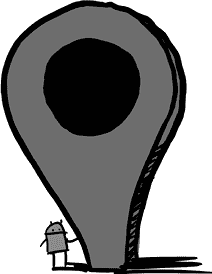

# 第二十一章：21  

位置，位置，位置  

## 查尔斯·门迪斯和 Bounce  

最具吸引力的移动应用之一是地图。能够看到你的位置并导航到你想去的地方，几乎是所有手机的杀手级应用。但在很久以前，在 Android 1.0 之前，这个应用并不存在。Android 必须组建一个团队来实现这一目标。  

与此同时，谷歌的另一位工程师查尔斯·门迪斯有了一个需要地图技术的不同应用的想法。  

查尔斯·门迪斯曾在澳大利亚的银行业工作，但他的一位朋友鼓励他申请加入谷歌。那位朋友最终去了亚马逊，而查尔斯在 2006 年加入了谷歌。“我加入谷歌是想借此机会看看美国。我以前从未去过。我的妻子和我结婚了，我们想旅行，看看这个世界。这看起来是一个很好的方式，让我可以住在美国，看看这个国家。计划是四年后回到悉尼，开始组建家庭。”那已经是很多年前的事了，查尔斯现在依然住在加利福尼亚，依然在谷歌工作。  

查尔斯最初加入了广告团队。“当你刚开始的时候，你有两个选择：选择搜索还是广告。^(1)你是想做搜索方面的工作，还是想赚钱？我被分配到了 AdSense。”  

当时查尔斯对移动技术并不感兴趣。“我那时没有手机。我从不喜欢手机；它们很麻烦。人们可以随时打扰你。谁想要那种生活？”  

但第二年，查尔斯的妻子怀上了他们的第一个孩子，这让查尔斯产生了一个应用的想法。“我想知道她在哪里。如果我需要去接她带她去医院，我希望能够看到她的位置。”他想开发一个可以提供这些信息的应用。  

2007 年春天，他设法从 Android 团队那里得到了些硬件。“我一直催 Ryan Gibson 和 Brian Jones，他们给了我几台 Android 设备。”  

“我想熟悉安卓开发，所以我说服了我所在的团队，AdSense 前端团队，加入开发者计划。Ryan 面临一个挑战，他们希望人们开发应用，获胜者将获得更多的 Sooner 设备。我想要多几个设备，^(2)因为我希望我的妻子有一个，我也要一个。所以我们开发了一个叫 *Spades* 的游戏。^(3)这是一个网络多人游戏，四个人可以加入并玩一局 Spades。我以前每周五都和同一群人一起在家里玩。”  

团队在几个月内开发了 Spades 应用。  

“我们开发完这个应用后，再也没有玩过这个游戏。我一直在催他们测试这个应用，他们就像‘我讨厌这个游戏，我再也不想玩了。无论何种形式，我都不想再玩这个游戏了’。”  

“但幸运的是，我们得了第三名，并且作为参与的一部分得到了很多设备。”  

这是 2007 年 8 月初。查尔斯拥有了他团队所需的设备，并且他也有编写 Android 应用的经验。现在他可以编写他最初设想的定位应用，用来追踪朋友们的位置。他把它叫做 *Bounce*。

“我们想象着人们在四处‘弹跳’。随时，我都能看到你的位置。问题是，我怎么获得位置呢？那时 [在 Sooner 设备上]，我们没有 GPS。所以我从亚马逊上买了这些蓝牙 GPS 设备。蓝牙在 Android 上并不好用。它是有的，但没有 API。”也就是说，系统具备蓝牙功能，但没有办法通过应用访问这一功能，因此 Bounce 无法使用蓝牙与 GPS 设备进行通信。

然而，一个应用程序可以像在 Windows 的 DOS shell 或 Mac 的 Terminal 控制台中输入命令一样，向系统发出命令。

“有一个非常长且复杂的命令，它实际上是为了设置蓝牙连接到你的 GPS 设备，所有这些都绕过了我们没有 GPS 的事实。然后我就可以读取通过蓝牙输出的 GPS 数据流。”

所以现在查尔斯通过蓝牙从 GPS 设备获取了位置数据。但该如何处理这些数据流呢？他不想写一个服务器来记录位置；他只想用它来和朋友之间实时地发送位置。

“我们开始使用 SMS 作为我们的传输协议和服务器。你会有一个 GPS 设备，我也有一个。当我打开应用时，我可以说‘请求 [朋友的] 位置。’它会发送一条 SMS 到你的设备，Bounce 应用会拦截这条 SMS 并询问，‘查尔斯是我的朋友吗？如果是的话，让我把我的 GPS 位置发回去。’

“所以我们有了一个基本版本，在这个版本中，我妻子可以看到我的位置。”

在 9 月 15 日，将会有一次关于是否启动 Android SDK 的执行审查。埃里克·施密特、拉里·佩奇和谢尔盖·布林都会出席。安迪·鲁宾会进行展示，并且斯蒂夫·霍洛威茨也在场，他们请求查尔斯带上他的 Bounce 演示。

那天早上，演示仍然没有完成。查尔斯和团队为 Bounce 添加了一个功能，叫做 *Memory Lane*，它会显示你的位置信息历史。但这个功能是最近才上线的，自那时起，他只是去过工作和（偶尔）家里。他需要添加一些实际的位置信息来演示这个功能，所以他开车四处绕行，路上添加了一些数据点，最终进入办公室。

早上 9 点，他准备好出发了。“我只是确保蓝牙设备已经配对，然后走进会议室。埃里克坐在桌子的首位，拉里和谢尔盖坐在他们常坐的位置。乔纳森·罗森伯格也在场。会议室已经很拥挤了，整个团队都在场。我坐在后面，然后安迪·鲁宾开始了演讲，‘我们今天要讲讲 Android，最后我们会做一些演示。’

“埃里克说，‘我们跳过演示吧。’”

“他们转向我说：‘好了，查尔斯，轮到你了。’”

查尔斯向他们展示了 Bounce，接下来的时间里，他回答了他们关于当时为 Android 开发的经验问题。

最后，埃里克告诉安迪，他们获得了启动的批准。^(4) 两个月后，他们确实启动了。

“会议结束后，安迪转向 Steve，说‘那个人会加入我的团队，搞定它。’然后 Steve 告诉我，‘嘿，你要加入 Android 团队了！’”

“我当时想，‘其实，我挺喜欢做 AdSense 的工作。’” 查尔斯刚刚成为团队的技术负责人，一切都很不错。“但是 Steve 和我聊了聊，他相当擅长说服我。几周后，我加入了 Android 团队。”

原本计划在 11 月的发布会上展示 Bounce。到那时，Bounce 已经使用了与其他 Google 服务相同的 Google Talk 连接，这比以前用的 SMS 破解方法要好。但是当时 Google Talk 并不稳定，经常掉线，双方的应用无法做任何处理。最后，Steve 决定不在发布会上演示 Bounce，以避免在媒体面前出现失败的可能性。

最终，查尔斯需要将 Bounce 从一个演示版本转变为一个产品。他做的第一件事就是解决 Google Talk 的连接问题。查尔斯和魏黄一起合作，最终让其在 Bounce 以及其他 Google 服务应用中都能正常工作。

另一个需要改进的方面是定位服务。查尔斯在演示中使用的 GPS 设备仅仅是一个权宜之计，因为早期的 Sooner 设备没有内置 GPS。在那次 9 月的高层会议上，谢尔盖建议他通过蜂窝塔和 Wi-Fi 数据来获取位置。这种方法已经在进行中：查尔斯已经开始与同一楼栋中另一个团队合作，那个团队正在实现地图功能 *我的位置*（也叫做“蓝点”）。这种技术使用蜂窝塔和 Wi-Fi 路由器的数据来定位蓝点，周围圆圈的大小表示不确定性半径（因为蜂窝和 Wi-Fi 定位不如 GPS 精确）。

但查尔斯也需要为其他内建更多定位功能的设备做好计划。G1 设备实际上有 GPS 硬件，因此当 GPS 可用时，Bounce 可以直接使用这些数据。

查尔斯与迈克·洛克伍德合作，后者负责为 GPS 和其他硬件传感器编写支持代码。但查尔斯在使用设备上的 GPS 时遇到了一个问题：“它非常耗电，而且非常慢。”解决方案是，位置服务通常使用更轻量且更大致的蜂窝/Wi-Fi 数据，但当用户直接使用地图应用时，会启动 GPS 以获取更精确的位置数据。这种方法避免了 GPS 硬件持续运行导致的电量消耗，同时在用户明确需要时提供更精确的位置数据。

Bounce 最后需要的是一个名字。Bounce 只是一个代号，但产品在发布时需要一个真实的、可以注册商标且不侵权的名字，于是团队开始讨论一些创意。

“我们在谷歌有一个团队：他们专门负责命名。我们去找了他们，他们有一堆名字，其中很多已经被版权保护。我们说，‘不如选一个描述性的名字叫 Friend Finder。’然后有人提醒我们，那个名字已经被一个成人交友网站注册，叫做 Adult Friend Finder。所以我们完全不打算接近那个名字。”

团队在没有名字的情况下卡住了。然后，他们在发布前的几周与拉里·佩奇进行了交谈。“拉里说：‘Latitude 怎么样？你知道，代表自由、运动……而且它与位置相关。’于是，拉里想出了这个名字。”

显然，对于拉里来说，成为谷歌的创始人和高管还不足以占据他的全部工作时间；他还负责命名产品。

到这时，Latitude 已经作为地图的一个功能集成，而不是一个单独的应用。它没有出现在 1.0 版本中，因为初始发布需要优先完成其他工作。但它在几个月后，也就是 2009 年 2 月，首次上线，并同时支持安卓、黑莓、Windows、塞班系统和网页版。

## 地图

“应用有些争议，主要是因为所有权问题。”史蒂夫·霍洛威茨说。“比如：地图。地图是谷歌的明星移动应用。事实上，谷歌在移动端真正拥有的就是地图。所以我们想要开发地图，或者把地图从[移动团队]那边移过来，但移动团队并不完全相信[安卓]。最终我们说服他们派了一位工程师来帮忙将地图移植到安卓操作系统。他[亚当·布利斯]从地图团队过来，帮助使地图应用能够在安卓上运行。”

鲍勃·李和亚当共用一个办公室。“他在开发安卓上的第一版地图应用。我们有了一个 G1 屏幕的原型。他做了一个演示，这就是第一次完整的地图界面。你可以在大屏幕上四处拖动。安迪[鲁宾]因为这个原因把团队里的第一个 G1 原型机给了他。”

2007 年末，查尔斯加入了亚当的团队，他放下了自己的 Bounce 应用，专注于地图应用的发布。“我加入安卓是为了开发[Bounce]，但很快它就被取消了，因为我们有更重要的事情要做。在我们推出位置追踪这个闪亮的新特性之前，我们需要先有地图应用。”

地图并不是 Charles 唯一的工作内容。像其他 Android 团队成员一样，他做了许多必要的工作。“我做了很多 Dialog API，工作于 ListView、TextView，以及系统服务器的一些基础工作。每当 Dianne 的工作过载时，我会修复她的一些小 bug，或者是 Jason Parks、Jeff Hamilton、Mike Cleron 的 bug。我最终成了一个消防员，无论哪里需要，我都会去。短信应用、彩信应用、Gmail 应用，我做了不少工作。但主要还是在与 Adam 一起开发地图应用。我还希望能够使用 MapView API 和 Location API，因为我们需要 Location API [用于 Bounce]。”

大约在他加入 Android 一年后（大约在 Android 1.0 发布时），Charles 转到了地图团队，并成为了团队负责人。“那时有一个地图团队，我曾和他们一起工作，主要是处理 My Location 的功能。我想说，‘嘿，我们应该将地图应用程序和那个团队合并，实际上扩展地图应用的功能。’因为如果你回顾一下那个时候，地图应用运行在 Windows Mobile、Symbian 和 BlackBerry 上。那时 BlackBerry 可以说是霸主，几乎占据了大部分市场份额。它的功能远比其他平台丰富，比如交通功能。因为他们在全球有大约 30 到 80 人在开发这个应用，而在 Android 上，只有我和 Adam 在做这项工作。但是我们都是基于相同的 API 开发，我们使用的是他们的服务器 API。所以最后，在经过多次讨论后，我从 Android 团队转到了地图团队[和 Adam Bliss 一起]。我依然待在 44 号楼，只是把我的办公桌搬到了几间隔间外。”

转到那个团队的一部分工作是成为移动地图的总体负责人（包括 Android 和其他平台）。但领导这个团队并不意味着可以随心所欲。“当时，我试图说服大家，‘我们应该停止在 Symbian、Windows Mobile 和 BlackBerry 上工作，转向 Android，因为我认为 Android 将是未来。’大家都说，‘你疯了吗！我们没有 Android 用户。看看每个月有多少 BlackBerry 出货！这比你一年出货的量还多。’”

“最后，我们决定从为 Android 构建的代码库转移到我们所称的‘统一代码库’。所以我们简化了，并没有使用所有的 Android API。你不能使用 HashMap，只能使用 Vector。你不能使用 LinkedList，只能使用 Vector。基本上，Vector 是你能使用的唯一数据结构。”

“我们转到了那个代码库，这给了我们很多 Android 上的功能，因此 Android 用户突然拥有了更多功能完整的地图应用。但我不能使用 Android 的所有功能。”

最终，在 2009 年底 Droid 发布后，Android 开始获得大量用户，地图团队的讨论发生了变化。“那时，我终于可以带着 Android 的增长回到团队，并开始将我们从 Symbian、Windows Mobile 和 BlackBerry 转向 Android。”

“我记得接管团队时的情景。两年后，我说服他们全力投入 Android 平台。在此之前，他们一直认为‘不，我们必须支持所有平台。’但是特别是在 Droid 发布后，我们的用户群开始急剧增长。我们开始能够进行 Wi-Fi 扫描、蜂窝扫描。当我刚开始的时候，我记得蓝色圆圈，表示不确定性的半径，一度达到 800 米。经过一两年，我们将蜂窝的误差缩小到了 300 米以内，而 Wi-Fi 的误差从大约 300 米降到 75 米。所以，单是 Android 收集到的数据^(5)，就极大地帮助了让蓝点更精确。”

## 导航

“我加入地图团队的同时，”查尔斯说，“我也开始研究逐步导航功能。那时候，你要购买 Garmin 设备，并且需要付费。即使是在 iPhone 上，你也需要每月支付 30 美元。我们觉得我们可以做出这个令人惊艳的体验。”

但是首先必须解决另一个问题：地图应用程序使用的数据格式。当时应用中显示的地图基本上是静态图片，这在可用性和尺寸上都有问题。“我们使用的是栅格地图，也就是 PNG 格式的图像。^(6) 如果你旋转地图，文字会倒过来。如果你想倾斜地图，是做不到的。”此外，用于地图的图像非常大，需要大量带宽来下载。

当时在西雅图办公室的基思·伊藤，正致力于逐步导航功能。为了解决数据问题，他研究了一种新的地图显示方式，使用了矢量图。^(7) 矢量图是一种用几何学来描述图像（如地图）图形的方式，而不是使用图片。服务器传输的不是嵌入文本的地图图像，而是通过几何描述，设备在适当的分辨率和旋转角度下绘制地图。这种方式比 PNG 格式的地图所需的数据量要小得多。

基思制作了一个新型基于矢量的地图演示，并将其发送给查尔斯，查尔斯带到安迪的办公室：“拉里在办公室。我给他们看了矢量地图。你可以进行倾斜和缩放。以前我们只有离散的缩放级别，现在你可以稍微缩放或者大幅缩放，文字也不会扭曲。”

但是有一个权衡：性能。“在 G1 上做这件事是非常困难的，因为我们需要渲染它。”也就是说，逐个矢量地绘制地图几何图形，比直接显示图像要花费更多的时间和精力，但所需的数据量却减少了一千倍。

安迪知道即将推出的 Verizon 设备对他来说很重要。“在 Droid 上的逐步导航，成为了其标志性功能之一。”基思继续与查尔斯合作，既推进矢量地图的产品化，又推进逐步导航功能的开发。

在将这个功能推出 Droid 上时，仍然有一些障碍需要跨越。首先，Verizon 已经有一个现有的应用程序 VZ Navigator，他们对这个应用收费，并希望继续提供它。但这个功能最终还是成功地推出了 Droid^(8)，并进入了市场。逐步导航不仅推动了导航和地图的使用，而且还促进了 Droid 的销量。人们意识到，他们可以利用自己的手机和现有的数据计划到达目的地。
