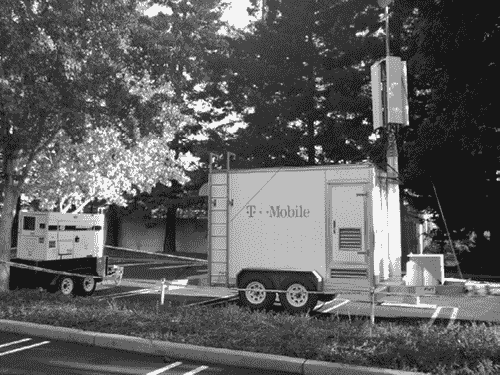
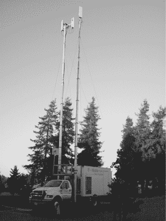
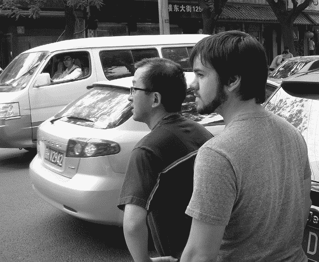

# 第二十三章：通信

## Mike Fleming 和电话通信

有人说，手机不仅仅是用来浏览内容、玩游戏和查看电子邮件及信息的；也有人用它们来打电话。^(1) 至少这是 Android 为 1.0 版本构建通信软件时的理论。

设备通信有两个重要方面：电话通话和消息传递。Android 为这些功能设立了不同的团队。而所谓“团队”，是指每个功能由不同的人负责。

为了让 Android 的电话平台正常工作，团队引入了 Mike Fleming。Mike 对这个领域已经很熟悉，因为他之前在 Danger 编写过电话通信软件。

Mike Fleming 在 2000 年初来到硅谷，加入了一家名为 Eazel 的公司，在那里他遇到了 Eric Fischer（后来的 Android 文本功能开发者）。一年内，Eazel 因资金短缺而裁员，几乎所有人都被裁掉。Eazel 的创始人之一、原 Macintosh 团队工程师 Andy Hertzfeld，帮助许多员工在 Apple 或 Danger 找到了新职位。Mike 和 Eric 来到 Danger。

Danger 最近将产品重心转向了移动电话。Mike 被引入来使电话应用程序正常工作，工程经理认为这会花费几周时间。Mike 说：“我们发现这实际上是进入一整套行业标准和认证的入口。所以它比预期要复杂得多。”

Mike 在 Danger 待了大约四年，然后面试了 Android，那时他已经认识了一些前 Danger 的人。他在 2005 年 11 月加入，并被赋予了让 Android 电话功能正常工作的任务。至少第二次他对这个工作有了更清楚的认识，知道这项任务有多么复杂。

Mike 对接受这份工作有些复杂的心情。“我加入 Android 是因为我真的希望它能存在。但说实话，我并不太想在它上面工作。我做过电话通信的工作，已经有些疲倦了。但总得有人带来这个领域的专业知识。我加入 Google 是为了做 Android，但我没打算待到 Android 1.0 以后。所以我进入这个项目时，心态有点奇怪。”

Dan Bornstein 在一个在家工作的日子里，给 Android 工程团队发了一封主题为“Logcat 阻止我使用键盘”的邮件。（图片由 Dan Bornstein 提供。）

在当时的 Android 状况下，除了电话通信之外还有大量其他工作需要做，因此 Mike 也承担了其他任务。例如，他与 Swetland 一起工作，提高了调试日志的效率，并让开发者更容易访问。在 Android 中，这个系统被称为 *logcat*，即对日志文件进行 `cat` 命令操作。

Mike 还帮助了 Java 运行时的工作。Dan Bornstein 当时正在致力于使新的 Dalvik 运行时工作，但团队需要一个占位符以便暂时使用。Mike 引入了 JamVM，一个开源的 Java 运行时。这为团队提供了编写 Java 代码的基础，并且给了他足够的功能来开始编写电话软件的代码，等 Dalvik 运行时工作起来后，他就完成了这部分工作。

电话工作中一个棘手的部分是 G1 手机将配备 3G 连接，而这是 T-Mobile 的新技术。由于 T-Mobile 同时在其网络上实现这一功能，Android 团队需要一种方式来进行测试，于是 T-Mobile 在 Google 园区停放了一个专用的 3G COW^(5)，以便 G1 用户可以测试新的网络。

COW #1：这是 T-Mobile 在 Android 大楼附近设置的移动电话塔之一。（图片由 Eric Fischer 提供）

尽管 Mike 使 Android 上的电话功能得以实现，但他并没有参与电话应用程序（也称为拨号器）的开发，尽管他当时确实想做这项工作。曾在 Danger、Be/PalmSource 和 WebTV/Microsoft 工作过的不同派系之间存在深刻的架构分歧。最终，负责工程工作的 Steve Horowitz 介入并达成了一项协议，帮助团队度过了这一冲突和不确定的阶段。Mike 回忆道：“某个时候，我们做出了一个决定，由 Danger 的人负责系统的底层部分，而 Palm 和 Microsoft 的人则负责上层部分。我认为是 Steve Horowitz 与 Brian [Swetland]达成了这个妥协。我记得当时对此并不满意。我不太认同这种做法。但这就是达成的协议。”

COW #2：另一个为测试设置的手机塔（图片由 Eric Fischer 提供）

将 Danger 和 Be/PalmSource/Microsoft 团队进行拆分引发了其他的紧张局势和哲学上的分歧。例如，Dianne 提出了一种*Intents*模型，Android 通过该机制允许应用程序启动其他应用来处理特定操作，例如“拍照”启动相机应用，或者“发送邮件”启动电子邮件应用。应用程序可以在其*manifest*文件中注册它能处理的 Intents（manifest 是一个与应用程序捆绑在一起的文件，包含关于应用的概要信息）。将这些信息存储在 manifest 文件中，而不是仅仅存储在应用程序的代码中，意味着系统可以快速识别出哪些应用处理了哪些 Intents，而不需要启动应用程序来查看。

但团队中的其他人并不信服。黄伟说：“当时我们在想，‘为什么要把事情搞得这么复杂？’我记得克里斯·德萨尔沃和迈克·弗莱明主张简单化：只要在应用程序运行时做就行了。有些事情我觉得黛安对平台如何扩展有更深入的理解。但与此同时，我认为活动生命周期^(6)有些复杂。而斯威特兰对事情的复杂性感到非常沮丧。”

迈克·弗莱明补充道：“我认为从来没有真正的讨论平台，去讨论活动和意图的替代方案。我认为这大概是我最不满的地方。作为一个在底层工作的人员，因为我恰好有领域专业知识，也曾在以前的公司参与过上层工作，我非常不满自己无法参与到整个愿景中。”

黄伟观察到：“这些人有很多构建移动操作系统的经验。这并非没有挑战；我们必须弄清楚如何合作，因为我们有不同的看法。而且是非常强烈的看法。总体来说，我认为我们设法解决了这些分歧。并不是所有分歧都解决了，因为迈克·弗莱明离开了。”

2008 年春天，在 1.0 发布前的六个月，迈克离开了安卓。他说：“产品很难凑合在一起。我感觉完全有可能它无法发布。它在设备上表现不好，运行很慢，而且经常崩溃。它足够用了，但我发现这是一个非常令人沮丧和失望的产品。”

“电话功能掌握在了合适的人手里。Dalvik 相关的工作也在合适的人手里。我觉得我已经没有任何可以做的事情来帮助它发布了。我没有预料到自己会待到完成后。我看不出自己能做些什么来帮助完成它。所以我离开去加入了一家创业公司。”

尽管迈克当时对安卓的看法不佳，他在离开之前已使电话功能得以实现，且产品继续朝着 1.0 版本迈进。

## 黄伟与消息传递

最近安卓版本的用户可能会对谷歌最近推出的众多消息传递应用感到疑惑，但安卓一直以来就有许多这样的应用。从某种程度上说，这种现象是因为有如此多种类的消息传递方式：短信（通过运营商发送文本消息）、彩信（发送图片或群聊）、即时消息（各种不同的类型）、视频聊天等等。即使在早期，也有多种方式进行消息传递，大多数使用不同的底层协议，并且需要不同的应用程序，但只有一名工程师负责所有这些应用：黄伟。

2006 年春天，魏加入了 Android 浏览器团队，但在多年从事浏览器工作的经历之后（先是在微软，然后是 AvantGo，再到 Danger，最后是 Android），他已经准备好迎接新的挑战。Steve Horowitz 建议他接手消息传递功能，因为 Android 需要这个功能，而当时没有其他人负责这个任务。于是，魏开始参与 Google Talk 应用和短信（SMS）的开发工作。

拥有这两个应用似乎对一个工程师来说是一个庞大的工作量（事实上，现在多个团队的成员在开发类似的应用）。实际上，这些应用的底层机制是完全不同的，特别是短信（SMS）消息传递所需的运营商要求。但在 Android 的早期，这种工作量是很常见的。魏表示：“那时候，我们甚至没有每个功能分配一个工程师的奢侈。其他人可能负责一到两个应用。”

魏首先深入研究了 Google Talk，并且很快就能使演示版应用运行起来。促使这一进展的一项因素是，Google Talk（作为一个已经存在的桌面应用，并且在 Google 服务器上有完整的后端支持）使用了一种功能非常齐全的消息传递协议（XMPP^(7))，因此魏能够相对简单地编写应用程序，通过该协议建立与服务器的连接，并进行消息的双向传输。

将他的应用从演示版转变为产品的一大难点是如何保持服务器和客户端之间的连接。这种连接经常会掉线，但客户端并不会立即发现，仍然继续发送消息，而没有意识到消息实际上并没有成功发送。魏花了大量时间在项目中，致力于让连接更加稳定，设计了处理掉线和重试的逻辑。

当系统的基本功能开始运作时，负责服务团队的 Michael Morrissey 建议将这个连接用于所有 Google 应用（包括 Gmail、联系人和日历）。这样，所有这些应用就不需要各自维护与后端的连接，而是可以共享这个单一的、持久的连接。设备上的软件会将各应用的数据合并，通过这个连接发送到服务器，并从服务器接收响应，将其传递给相应的应用程序。这与 Michael 曾经在 Danger 参与设计的架构相似。

这个连接不仅对现有应用程序可用，还可能用于推送其他应用的消息。Charles Mendis 的 Bounce 应用希望能够在朋友位置变化时通知地图应用。通过这个持久连接启用推送消息功能，地图服务器就能够得知位置变化，并将更新发送到设备，设备再将其传递给地图应用，以更新屏幕上的位置。

Wei 与 Debajit 合作实施这一功能，将所有基础设施搭载到现有的 Google Talk 连接上。他们希望在 1.0 版本中发布这一功能，作为不仅仅用于 Google 应用的连接，也能供任何想使用推送消息的应用使用。但后来他们与安全团队进行了讨论，安全团队告诉他们：“你们不可能发布这个东西。”它不够安全。

尽管推送消息的功能和 API 在 1.0 版本之前的发布中已经对开发者开放，但它在.9 版本中被移除了。关于这一点在 Android 0.9 SDK Beta 发布说明中有提到：^(8)

> *由于接受来自设备“外部”的任意数据存在安全风险，GTalkService 的消息传递功能将不会出现在 Android 1.0 中。GTalkService 将提供与 Google 服务器的连接，用于 Google Talk 即时消息传递，但该 API 已从此版本中移除，以便我们改进该服务。请注意，这将是一个 Google 特定的服务，不属于 Android 核心的一部分。*

这个功能后来进入了 Android（在团队修复了安全问题之后），最终作为 Google Cloud Messaging 出现在 Google Play 服务库中。^(9)

## 短信（SMS）

与此同时，Wei 也在努力让 SMS 功能正常工作。该项目的大部分工作集中在实现和完善所有复杂的功能和要求，以便通过运营商认证。他说：“这很痛苦，因为运营商的问题。”

很长一段时间里，Wei 都是独自工作。但随着 1.0 版本的临近，Android 团队与来自中国 Esmertec 的工程师合作，尤其是帮助集成 SMS 和 MMS 并确保它们符合运营商的要求。

Ficus 曾负责摄像头和音频驱动的工作，他也加入了这一努力，帮助让它更加可靠。他个人热衷于改善 Android 上的消息传递功能。“我试图做一个好的 Android 内部用户^(10)，我在发短信……但它就是不行。我觉得年轻时的视角让我看到了一些其他地方缺失的东西；这是 2000 年代中期社交生活的一个重要部分。我开始修复 bug，提交代码。我没有得到任何允许停止我其他工作的授权，也没有获得开始做 SMS 的批准，我只是做了。我感觉应该有人去修复它。”

另一位参与帮助的人是 Peisun Wu^(11)，他负责管理该项目（除了其他 Android 项目）。从外部承包商到运营商测试，有许多细节需要管理。

运营商测试使得像这样的通信项目变得复杂。榕解释道：“有很多运营商合规认证的事情，这让我疯狂。尤其是 MMS 标准非常复杂。你可以用它做很多事情，比如制作幻灯片、图像动画和播放声音。尽管大家都知道，实际上任何人最想做的事情就是只发送一张图片，但你必须实现所有功能，因为必须通过运营商认证。”

2008 年 6 月，榕、魏和佩孙飞往中国与承包商合作。四川刚刚经历了一场大地震，他们在北京见面，并在谷歌办公室工作了两周。

2008 年 6 月，魏和榕在北京旅行期间（图片由佩孙·吴提供）

榕记得后来一次与同一团队合作的旅行：“2008 年夏天，尝试发布。所有的原型设备都不能离开谷歌员工的监督。所有承包商都在中国成都。我们之前在北京见过面，但那时候正值奥运会，我们无法找到合适的地方开会。我们得找到一个有 GSM 网络和谷歌办公室的地方，这样我们才能带着这些测试设备，并且工程师们能获得签证。因此，我们在苏黎世待了两周。”

谷歌 Talk 和短信（带 MMS）都及时赶上了 1.0 版本的发布。
