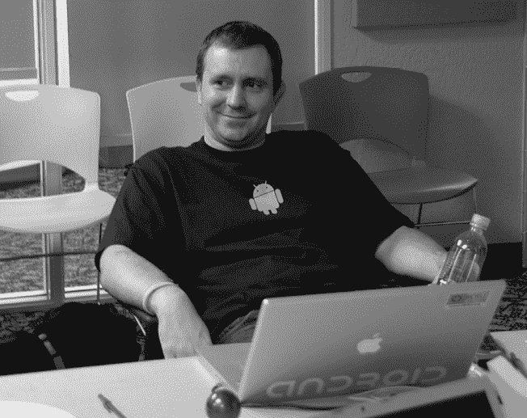

# 第二十四章：开发者工具

> 开发者，开发者，开发者，开发者，开发者，开发者，开发者，开发者，开发者，开发者，开发者，开发者，开发者，开发者。
> 
> — 史蒂夫·巴尔默，微软^(1)

Android 成长的原因之一是一路上创建的开发者生态系统，这使得成千上万（现在是数百万）的应用程序得以让人们找到、下载和使用。

但这种生态系统并不是自动就能形成的，尤其对于一个没有市场份额的新平台。为了降低应用开发者的入门门槛，使他们能够更轻松地编写和发布应用，Android 需要为开发者提供工具。

一个有决心的开发者可以编写代码并使用一些晦涩的命令在终端中将代码编译成应用。如果这个开发者只是想写一个“Hello, World!”^(2) 程序，那可能只需要这些。

但任何真正的应用程序都涉及大量的代码和其他材料，包括多个文件、图像资源、文本字符串等。如果你只能在文本编辑器中手动编写代码，并且仅有一个命令行编译器作为工具，那种复杂性会让人不堪重负。

这就是为什么 Xavier Ducrohet 于 2007 年 4 月加入团队的原因。

## Xavier Ducrohet 与 SDK

Xavier（大家叫他 “Xav”）一直在从事工具开发工作。最近，他在 Beatware 开发绘图工具。这并不是一份最稳定的工作：“我们并不总是按时拿到工资。”但 Xav 的绿卡还在处理中，这让他不得不再待一段时间，离开公司可能会影响绿卡处理进程。另外，他感到有责任不让这家公司陷入危机。“如果我离开了，公司就完了。”

Beatware 最终于 2006 年底被 Hyperion Software 收购。Xav 决定再坚持一段时间，因为他还有一些股票还在归属中。但在 2007 年 3 月，Oracle 收购了 Hyperion，这一切就结束了；Xav 不想加入 Oracle。他联系了在 Google 的老朋友 Mathias Agopian。

尽管该项目是保密的，Xav 已经对 Android 有了很好的了解。Beatware 曾早期与 Android 进行过交流，提供一些图形技术。Beatware 提供了一款基于矢量的图像编辑工具，Android 本可以用来处理 UI 图形。矢量图像的优势在于，在缩放时比纯位图图像表现得更好，因为位图图像在缩放时会变得模糊或失真。但 Android 最终开发了自己的一种图像格式，称为 *NinePatch*。^(3)

Xav 已经认识 Mathias 好几年了，来自 Be 社区。Xav 在法国上大学时曾玩过 BeOS。那时，他在巴黎认识了 Be 社区的人，包括 Mathias 和未来的 Android 工程师 Jean-Baptiste Quéru。所以，当 Xav 想换工作时，他联系了 Mathias。他之前已经在 Beatware 公司面试过这个团队，所以这次的面试只是和 Steve Horowitz 一起吃午饭。他在 2007 年 4 月三周后开始工作。

在第一天，Xav 和 Steve 及 Mike Cleron 坐下来，Mike 建议他从工具入手。首先，Xav 深入研究了 DDMS^(4)。DDMS 是一个在开发者桌面系统上运行的工具，它是许多不同工具的容器。例如，DDMS 提供了一个当前正在运行的 Android 设备上的应用列表。选择其中一个应用后，该应用会连接到主机计算机的 8700 端口，此时你可以通过调试工具连接该端口来调试这个应用。

Xav 的初始项目^(5)是使 DDMS 能够可视化本地内存。对于大多数 Android 开发者来说，这并不是一个特别关键的需求，但对当时的 Android 平台团队来说，这非常重要。在完成该项目后，他将庞大的 DDMS 工具重构为独立的几个部分，包括核心功能、用户界面层和将其他两部分连接起来的粘合层，形成一个独立的工具。

通过重构 DDMS，Xav 能够将现有的开源开发 IDE Eclipse 与其连接起来。到 6 月时，他能够向更大的 Android 团队演示整个工作流程：在这个 IDE 中打开应用项目，编译它，部署到模拟器上，在模拟器上运行，停在代码中的断点^(6)，然后逐行调试代码。

这个项目很好地展示了 Android 上的工作方式。有人发现了问题，然后快速地解决它。Xav 在 4 月下旬加入。到 6 月，也就是他加入两个月后，他向团队演示了全新的功能工具流程。这套工具在几个月后随着 SDK 的发布交付给了外部开发者，并成为 Android 开发工具链的基础，持续了很多年。他从加入公司和团队时对 Android 一无所知，到仅仅几个月后提供了一个为所有 Android 开发者（平台和应用程序，内部和外部）提供基础支持的工具。

2007 年 11 月 12 日，Xav——第一个 SDK 发布日（图片来自 Brian Swetland）

Xav 完成那个 IDE 项目后，他创建了安卓的 SDK。SDK 是一个可安装的工具包，包含了为应用开发者准备的工具和其他组件，其中包括 Android Eclipse 插件（以及所有的子工具，如 DDMS、ADB 和 Traceview）和 Android 本身。Android 部分包括开发者编写程序时所依赖的代码库，运行在模拟器中的安卓系统镜像，以及文档，帮助开发者搞清楚他们该做什么。同样，Xav 识别到了需求并将各个部分组合起来。幸好他这么做了。这项工作大约在 2007 年 8 月完成。同时，安卓的 SDK 计划在 11 月发布，因此他们有了一些可以发布的东西，真是太好了。

## David Turner 与模拟器

开发人员在平台开发初期所需的关键工具之一就是运行该平台的设备；如果你无法运行应用程序，怎么能验证它是否按预期工作呢？

但是，当安卓首次开发时，能够运行该平台的设备几乎不可用，^(7)于是团队找来了一位写虚拟设备的人：David Turner（团队称他为“digit”）。

在编写原始的安卓模拟器之前，David 在编程圈子里以 FreeType 字体渲染库的原始作者而闻名。关于谷歌的一个迷人之处在于，许多公司里的员工都因做某一特定事情而出名……而这些事情与他们在谷歌做的工作完全无关。我认识一些著名的经典游戏开发者、基础图形算法的发明者和 3D 图形专家，他们都没有在谷歌从事与他们曾经取得的成就相关的工作。

其他公司雇佣人是因为他们做过的事情，然后要求他们做更多相同的事。而谷歌雇佣人是看中他们是谁，然后要求他们做任何需要做的事情。过去的经历是他们能力的一个好例子，但在谷歌眼中，这并不会限制他们能做的事情。这就是谷歌如何发现拥有世界级字体渲染专家的原因，他正从事安卓模拟器的工作。

David 从小就学会了性能编程，当时他在 Apple II+上用 BASIC 和汇编语言编程，并在过程中领悟到性能编程的重要性。“这些机器性能如此有限，每一个细节都很关键，要从中得到令人满意的效果。”

几年后，他开始使用一台运行 OS/2 的计算机，但不喜欢它所使用的字体，于是他给自己设定了一个挑战：他根据 TrueType^(8)字体规范，尽可能少地使用内存和代码编写了一个渲染器。最终结果就是 FreeType 渲染器。他将其作为开源项目发布。它受到了广泛关注，并被广泛应用于有限的嵌入式系统，从电视到相机再到…Android。FreeType 是（并且仍然是）Skia 的字体渲染器，Skia 是 Android 的图形引擎。

2006 年，Android 团队的一名工程师（该团队一直在寻找嵌入式程序员）在 FreeType 的源代码中看到了 David 的名字并联系了他。“当然，没有人告诉我为什么 Google 联系我，所以我准备面试时读了大量关于 HTML、SQL、网页服务器和数据库的资料。令我惊讶的是，所有面试问题都涉及基础的数据结构、算法和嵌入式系统，因此面试进展得比我最初预期的要顺利得多。”

David 在 2006 年 9 月加入了 Android 团队。

David 的第一个项目是为 C 编程语言建立并运行一个工具库。^(9) 当时，Android 使用的是一个非常小且基础的 C 库，但它缺乏一些必要的功能，并且拥有比最终开源平台更为限制的许可证。David 将 Android 的“Bionic”库从各种许可证兼容的 BSD^(10) Unix 库中汇总，并结合新的代码以集成 Linux 内核，支持 Linux 或 Android 特有的功能，这些在 BSD 代码库中是没有的。

在完成这项库的工作后，David 继续进行模拟器的开发。

最初，Android 有一个*模拟器*，这是一个在开发者的桌面电脑上运行的程序，模仿 Android 设备的行为。但模拟器会伪造许多细节；它们模仿系统的外部行为，却忽略了内部的许多细节，这意味着整体系统的行为并不符合实际设备（因此不能依赖于它进行真实测试）。

Fadden 编写了最初的模拟器，但当 Android 处于不断变化中时，他逐渐厌倦了维护它。David 记得，“它由唯一的一名工程师维护，每次我们添加新特性时他都会感到疲惫不堪。我们的计划是：模拟器基本上已经死了，我们需要一个好的模拟器。”

Android 已经有了一个初步的模拟器，基于一个名为 QEMU 的开源项目，该项目由 David 的朋友 Fabrice Bellard 创建。David 对这个实现进行了彻底改造：“当时我们使用的是一个非常旧的 QEMU 版本，这个版本被修改得相当激进。没有人完全理解发生了什么。”David 从拉取一个更新的 QEMU 版本开始，尽管这个版本也有自己的问题。“当时（大约 2006 年到 2010 年），QEMU 的开发状况相当糟糕。完全没有单元测试，全球变量^(11)到处都是。”

他最终让系统运行得更好，但仍然有很多工作要做，比如让基于 Linux 的 QEMU 项目能够在 Windows 和 Mac 上运行，并将模拟器中特定于 Android 的部分分离出来，以便进行更好的测试。

当时，模拟器至关重要。硬件设备非常难得。拥有一个模拟器，它能够模拟真实设备的功能，使得（Android 团队的开发者，最终是外部开发者）能够编写和测试他们的 Android 代码成为可能。

模拟器就像一台真正的设备，因为它模拟了真实设备上发生的所有事情。它不仅看起来像一部 Android 手机（在你的桌面计算机上的一个窗口中），而且内部运行的每一个比特，直到芯片级别，和实际硬件设备上的完全相同。

模拟器的另一个优势是速度，相对于实际的硬件设备（对于有设备的开发者）。与主机上的模拟器通信比通过 USB 电缆与真实设备通信要快得多。将应用程序或整个 Android 平台通过 USB 电缆传输可能需要几分钟，而将代码推送到模拟器（它运行在同一台计算机上，代码也是从这台计算机推送的）则要快得多，因此工程师可以使用虚拟设备而不是实际设备时更具生产力。

另一方面，模拟器一直因其极其缓慢而受到批评，尤其是在启动时，启动模拟器的过程模仿了手机启动，因为它精确地模拟了手机启动时的每个步骤。你可以在大多数情况下让模拟器保持运行，特别是在纯粹的应用开发中。但模拟器的启动和运行性能，直到最近的版本发布，仍然是常见的抱怨来源。^(12)

模拟器项目也是 Android 在早期阶段，呃，*坚韧不拔*精神的伟大展示。并不是说团队很小……实际上甚至没有团队。负责这项庞大工作的只有一个人，而模拟器只是他参与的多个项目之一。

David 多年来一直独自开发和维护模拟器，这只是他工作中的一部分。

## Dirk Dougherty 的文档：RTFM^(13)

即使拥有全世界最好的工具，也无法帮助开发者编写代码，如果他们不知道该写什么的话。开发者在某个时候需要了解系统以及如何将各种组件组合起来，以便创建应用程序。他们需要文档。

对于 Android（以及许多其他平台）来说，“参考文档”往往是由编写 API 和底层功能的工程师来编写的。也就是说，如果一位工程师添加了一个名为 Thingie 的类，那么他们会（或应该^(14)) 编写一种概述文档，说明这个类的用途以及为什么开发者应该关注它。Thingie 类中的函数也会（或应该）有文档，描述何时以及如何调用这些函数。

但参考文档只能帮你走到一定程度。能够查阅文档，了解如何使用例如 Activity 类，固然很棒。但是你是怎么学会足够的知识，甚至知道要查找 Activity 的呢？开发者们真正需要的，特别是对于像 Android 这样的新平台，是一些更高层次的文档，提供概述并教授基础知识。这个平台是什么？我们如何为它编写应用？在哪里可以找到示例代码，看看是如何做的？

Android SDK 将在 2007 年 11 月发布。在此之前的三个月，团队决定他们需要一位技术写作人员，并请来了 Dirk Dougherty。

Dirk 曾在 Openwave 工作，那是一家为手机开发浏览器的公司。一位前同事将他的简历转发给了 Android 团队。Dirk 参加了面试，并在几周后开始了工作。

“我来到 44 号楼，找到了我的办公桌。它在大厅旁边的一间会议室里，后来那间会议室成为了游戏区。^(15) 房间里堆放着一堆空的桌子。我不知道发生了什么，也不确定我是不是在正确的地方。最终，Jason、Dan、Dick、David 和 Quang 进来了，他们正组建即将成为 DevRel^(16) 团队的成员。我们都搬进了那里，开始学习这个平台。有人在我们的白板上画了一个倒计时日历，显示 SDK 发布的天数，从那时起我们就开始朝着发布目标推进。”

Dirk 和 DevRel 团队整理了 SDK 所需的各个部分。“第一年我们基本上是在不断冲刺，搭建网站，完成基本的文档编写。大部分是参考文档和工具，再加上一些指南和 API 教程。随着平台稳定，我们发布了持续的预览版本和 SDK 更新。由于开发者挑战赛和开发者们的强烈兴趣，我们需要扩展文档。我得到了一个我曾合作过的外部作家的帮助，^(17) 他与我合作撰写了 Android 基础文档，解释这些东西是如何工作的。几个月后，我们得到了更多的增援，另一个内部作家 Scott Main 加入了我们的工作。我们把所有的时间都花在了围绕参考文档构建基础文档，然后再搭建网站。整个工程团队也给予了我们巨大的支持。项目启动是一个完全的团队合作过程。”^(18)
