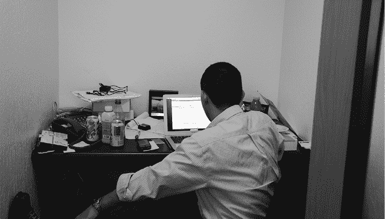

# 第二十七章：管理所有事务

本书的其他章节大多是为了讲述 Android 是如何一点一点建立起来的，以及那些将这些碎片拼接在一起的人们的故事。但有一些帮助推动项目进展的人，并没有负责单独的某些部分；他们负责的是整体的努力。欢迎来到 Android 的“商业”层面。

## 安迪·鲁宾与 Android 管理

安迪·鲁宾对机器人的兴趣从他职业生涯的起点就有了，当时他在卡尔·蔡司公司从事机器人工作。后来，他加入了苹果公司，并获得了“Android”的绰号。此后，他在 WebTV 工作，那里有其他未来的 Android 团队成员，迈克·克莱龙记得他是“走廊里那个玩机器人、疯疯癫癫的家伙”。

在 WebTV 之后，安迪创办了 Danger，最终成立了一家名为“Android”的初创公司。

虽然安迪一直在领导 Android，无论是在谷歌收购之前还是之后，但他通常让其他人管理团队成员。克里斯·怀特在前六个月领导工程工作，并且还参与了系统架构和设计的工作，但最终，史蒂夫·霍罗维茨被引入来管理日益壮大的团队。史蒂夫离开后，约 1.0 版本左右，广志·洛克海默接管了工作。安迪依赖这个管理层来处理团队中的人事问题，而他自己则专注于项目的商业层面，比如合作伙伴会议。

安迪在 2013 年初参加巴塞罗那的世界移动大会时离开了团队。广志讲述了他和特雷西与安迪一起参加的一系列合作伙伴会议：“就是在那个时候，他决定告诉我们他要离开。那是在与 LG 的会议之后、与三星的会议之前。我们有一个 15 分钟的休息时间。他已经在某个休息时告诉了[特雷西]，我完全没有察觉。把大家都赶了出去。就剩下我和安迪了。他说，‘我做这件事已经 10 年了，我累了，我要离开了。’”

## 特雷西·科尔与 Android 管理

在安迪·鲁宾离开后，负责顺利过渡的人员之一是特雷西·科尔。特雷西曾是安迪的行政助理，已经工作了 14 年，在安迪离开时，她是 Android 的首席行政人员。她了解如何在 Android 和谷歌中推动事情进展，而且她并没有打算离开。

2000 年 8 月，特雷西·科尔在一家生物技术公司担任行政职务，并希望辞职。一个朋友建议她去找他朋友安迪，安迪当时在 Danger 工作。她与安迪和 Danger 的其他创始人（Joe Britt 和 Matt Hershenson，他们后来也加入了 Android 团队）进行了面试，最终成为该团队的行政人员。2003 年安迪离开 Danger 时，特雷西留了下来，但继续在旁协助他。随后，在 2004 年秋季，她加入了安迪的初创公司——Android，并与布莱恩·斯威特兰德同一天开始工作。

当 Google 收购 Android 时，Tracey 与团队其他成员一起加入了 Google。她知道他们正在与 Google 接洽，但并不清楚进展到何种程度，“我记得他见了 Larry，他们很投缘。我去度假，回来后突然发现我们将要在 Google 工作了。”

Tracey 继续在 Google 担任 Andy 的助手，并领导 Android 的行政团队，直到 2013 年他离开了 Android。到那时，她继续担任管理整个 Android 团队的角色，并领导项目中的其他管理员，同时也成为了弘志的助手。

## 弘志·洛克海默与合作伙伴

弘志·洛克海默（Hiroshi Lockheimer）刚到 Google 时，负责管理合作伙伴公司，与 OEM 厂商和运营商合作，将 Android 系统移植到他们的设备和网络上。

弘志一直想做一名建筑师：“是建造大楼的那种建筑师。不是软件架构师。就是实际的建筑设计。”他对计算机不感兴趣，直到大学的第一次（也是唯一一次）学期才接触编程。学校并不适合他，他回到了日本家乡。但他已经迷上了软件开发。在家时，他自学了编程，并开始接一些咨询工作。他还做了一些业余项目，包括为 Be 操作系统开发了一个文本引擎^(1)，并将其开源。这项工作引起了 Be 公司员工的注意，弘志最终在那里找到了工作，并于 1996 年 12 月搬到了加利福尼亚。

弘志在苹果差点收购 Be 公司以提供下一个 MacOS 版本的一次事件后加入了 Be。但最终苹果收购了 NeXT 计算机。弘志回忆道：“我们是那家没有被收购的公司。”

三年后，弘志准备寻找新的机会。Be 公司时的同事 Steve Horowitz 将弘志介绍给了 Andy Rubin，弘志随后加入了 Danger。“我成了 Danger Research 的第一位员工。那时有三位创始人，而我是他们雇佣的第一个小角色。”

弘志将其他 Be（以及未来 Android）工程师带入了 Danger：Brian Swetland 和 Ficus Kirkpatrick。但弘志自己在那里的时间并不长，仅待了八个月就离开了。

在离开 Danger 后，弘志曾短暂地在 Palm 工作，而这家公司也是很多 Be 工程师在 Palm 收购 Be 后加入的公司。离开 Palm 后，他管理了 Good Technology 的一支工程团队（该公司当时正在开发移动通信软件），然后在 2005 年初再次加入了 Steve Horowitz。Steve 当时领导着微软的 IPTV 团队。

到了 2005 年底，弘志再次准备迎接新的挑战。“我当时正在日本度假，Andy 突然给我发了封电子邮件。自从我离开 Danger 后就没再和他联系过。他写道，‘嘿，我现在在 Google 做一些你可能会喜欢的事情。’他知道我喜欢无线设备，‘我觉得你应该来跟我们聊聊。’”

“当时我在微软工作，负责机顶盒的开发。这不是我想要的工作，我真的很怀念做移动设备的感觉。所以我在一月时给他打了电话。”

谷歌的面试和招聘过程从来都不以迅速或简单著称，但浩史的情况尤其独特。

尽管浩史在相关科技公司有着丰富的经验和悠久的工作记录，但他并不是谷歌面试的必胜之选，特别是因为他没有大学学位。Steve Horowitz 说：“当时的谷歌非常看重学历。谷歌那时的态度是，‘他没有学位，我不确定我们能否雇用他。’他们当时给出了很大的反抗。”

浩史说：“经过二十多次面试，因为他们无法搞清楚如何雇用我。他们让我写一篇文章。字面上说。我不知道他们是否完全理解^(2)这其中的讽刺。他们给我布置了作业，要我写一篇关于为什么我没完成大学学业的文章。”

“我差点说‘算了’。”

最终，团队成功说服了谷歌招聘委员会聘用浩史。然而，即使有了这一协议，加上超过 20 次面试的结果，以及那篇必定出色的“为什么我辍学”的文章，招聘委员会仍然拒绝聘用浩史为工程师。浩史说：“他们在某种程度上把我归为‘杂项’，并决定给我一个‘技术项目经理’的职位。”

在 1.0 版本的过程中，浩史参与了与合作伙伴公司的初步会议，并与他们合作确保事情的顺利进行。“这是技术和商业的结合，或者说是从不同角度来看，既是技术层面，也可能是商业层面。我们构建软件，但没有合作伙伴，没有来自其他公司的硬件，尤其是在当时我们没有 Nexus 或 Pixel...那时一切都依赖于 OEM 合作伙伴和运营商，这些公司将负责发布这些产品。我的工作就是负责项目管理。”

Brian Swetland 评论浩史在管理合作伙伴方面的角色：“没有人像他那样与合作伙伴打交道，部分原因是 a) 他非常专注，b) 他技术非常强。所以他总是能够理解潜在的技术问题，这在我们尝试从合作伙伴那里提取所需信息，或者让他们做一些需要解释的事情时，非常有帮助。”

浩史与系统团队紧密合作，因为那是安卓软件与合作伙伴硬件对接的地方。“Swetland 和我会一起去台北。他会在那里待三周。我去一周，然后他会独自待剩下的时间。确保启动顺利进行。启动内核，启动外围设备——他会与他们的工程师一起做这些，硬件和软件。然后原型机会送到这里，高层人员会在上面运行他们的东西。”

1.0 版本发布的同时，Steve Horowitz 离开了谷歌。Andy 仍然负责安卓，但当时有人来做工程总监的角色与 Steve 的合作非常顺利，于是浩史接任了这个角色。Tracey Cole 说：“Andy 非常依赖浩史，让他管理团队。他不喜欢管理人，他让浩史接手了这个工作。”

黄伟把 Android 的工程文化归功于广濑浩：“广濑愿意和我一起深入细节，了解事情是如何运作的。即便他后来成为了副总裁，仍然在负责 Android，他依然会联系我们，搞清楚‘嘿，短信不行了，Hangouts 坏了’。我认为他能够与团队其他成员建立联系，而不仅仅是与直接向他汇报的人员沟通。而且，他关心产品，这一点显而易见。我也很喜欢他作为我们和安迪之间的桥梁。”

“我不知道他是怎么做到的。你怎么才能做到既真诚，又具备足够的技术知识去问出正确的问题？这就是为什么他能走到今天的原因。”

广濑继续管理工程团队，直到 Droid 发布之后，并建立了像 Bacon Sundays^(3)这样的传统，在每次发布之前通过集体努力确保发布顺利进行。^(4)

广濑浩在 44 号楼里他那狭小的办公室，2008 年 9 月（图片由布赖恩·斯威特兰提供）

## 史蒂夫·霍罗维茨与工程学

> 如果你回顾我们所处的位置以及谁“懂得”移动技术，谁“不了解”，这一切都可以追溯到领导者们当时是否有信念或远见。
> 
> —史蒂夫·霍罗维茨

史蒂夫·霍罗维茨曾是 Android 团队的工程总监，直到 1.0 版本发布。他在 2006 年 2 月加入 Android 团队，那个时候团队刚开始扩张。当他加入时，团队大约有 20 名工程师，到了他们发布 1.0 版本时，团队成员几乎增加到了 100 人，历时将近三年。

史蒂夫·霍罗维茨在小学时学习了 BASIC 和汇编语言，使用的是 Apple II。到了高中，他将时间分配在科技新闻和编程之间。高中毕业后，他直接进入苹果公司实习，并且之后每年暑假都在苹果工作，直到大学毕业。毕业后，他全职加入苹果，参与了开发下一代 MacOS 的项目 Pink，以及开发下一代硬件的项目 Jaguar。

在苹果待了两年后，史蒂夫去了 Be 公司，在那里他为 BeOS 开发了 UI 工具包功能，比如 Tracker（相当于 Mac 上的 Finder）。在 Be 公司待了几年后，史蒂夫转到微软，加入了刚被微软收购的 WebTV 部门。在那里，他与未来的 Android 团队成员，如迈克·克莱伦、安迪·鲁宾和黄伟等人一起工作。他还最终聘请了广濑浩来负责微软 IPTV 平台的系统软件组。在微软期间，史蒂夫逐渐转向管理职务，这也为他日后在 Android 的角色奠定了基础。

在微软工作期间，史蒂夫收到了苹果公司 Tony Fadell^(6)的一个有趣邀请，要求他负责 iPod 的系统软件团队，而那时该团队正开始考虑 iPhone 的开发。“这是一个不错的提议。但我持有很多微软股票，而他们给我的只是一些苹果股票。那时，我喜欢我在微软做的工作。苹果的提议看起来很有趣，但苹果的[股票]必须上涨一百倍，才能接近微软的价值。当然，正如预料的那样，它们确实涨了——超过了一百倍。”

“Tony 的团队中的一些成员，以及另一个人 Scott Forstall，正在争夺 iPhone 操作系统架构的主导权。最终，我认为 Forstall 的版本赢了，但 Tony 团队的人加入了这个项目，成为其中的一部分。所以，在某种奇怪的平行宇宙中，我本可以在 iOS 上工作，而不是 Android。”

在史蒂夫在微软工作的这些年里，Andy Rubin 曾试图邀请他加入 Danger 公司，但史蒂夫并不相信他们具备成功的条件，所以他留在了微软。

然后在 2005 年秋季，也就是 Android 被 Google 收购几个月后，Andy 再次尝试。“他说，‘我希望你能过来负责 Android 的工程工作——我们刚刚被 Google 收购了。’当我和他交谈并意识到是 Google 将尝试这个项目时，我觉得现在所有的要素都具备了，能够真正颠覆移动行业。我告诉 Andy，我会加入。”

史蒂夫在 2006 年 2 月加入 Android，担任 Android 工程总监。

史蒂夫在 Android 的工作之一是招募人才。他几乎立即就把他的微软团队成员 Mike Cleron 引入了 Android 团队。

团队中的工程师们记得史蒂夫强大的管理技能，他让团队保持冷静，并严格裁剪功能，以便他们能够按计划发布 1.0 版本。史蒂夫的首要任务始终是确保产品能够按时发布。

Michael Morrissey 还记得史蒂夫处理 Google 事务的高效：“史蒂夫真的非常擅长管理 Google 的官僚体系。他知道如何绕过那些对 Android 不利的流程和程序。”

经理的职责之一是帮助团队成员的职业发展。但那时职业发展并不是迫切的问题；1.0 版本发布后才有时间讨论这个问题。那时工作是最重要的。Romain 记得在那个紧张的阶段，史蒂夫经常在周末给他发 IM 消息，通常是一句：“yt？”，^(7)接着就是关于需要修复的 bug 的讨论。

## 移动世界大会

史蒂夫是 Android 团队的领导层成员，因此他既负责工程管理，也协助商业方面的工作。“在我刚加入后，Andy、Rich Miner 和我一起去了 MWC^(8)，带着 Android 的这个想法。那时基本上只是一个 Flash 演示，实际上并没有太多内容。”

“我们一直在尽可能多地与人会面，并向他们推销安卓的理念。我们有一个小房间，专门用来接待这些人。大部分人都对我们嗤之以鼻：‘等你们长大了再回来吧。’但我们和保罗·雅各布斯与桑贾伊·贾（高通高管）开了会，他们对此感到兴奋。他们很热情，想要探索更多。其他人则不屑一顾。”

“如果你回顾我们的历史，看看是谁‘理解’了移动领域，谁在移动领域成功，谁又没有成功，这一切都归结于领导者们是否在当时拥有信念或远见。”

“关于 MWC，有趣的是对比。如果你回顾当时的情况，它不过是我们在推销的这个理念，而现在，情况完全不同——现在它几乎是*全部*安卓。” 也就是说，安卓从当时在 MWC 上难以引起任何关注，到如今安卓在展会上占据如此重要的位置。

## 管理冲突

史蒂夫的一项重要工作就是调解各子团队之间的差异。来自 Danger 的工程师与来自 Be/PalmSource 和 WebTV/Microsoft 的工程师之间有着非常强烈的分歧。

“这就是安卓的特点——就像任何团队一样，它是由各种个性拼凑而成的。这个教训对任何人来说都是：小团队中的顶尖人才，最终会战胜大团队。这是毫无疑问的。而这正是我们在安卓中所拥有的。但是，正是这些才华和能量带来了冲突的机会，无论是在个人之间，还是在架构上。这就是我帮助引导的方向。”

## 离开安卓

1.0 版本发布后不久，史蒂夫离开了安卓（和谷歌）。他希望能担任更大的职位，做更多的不仅仅是工程管理的工作。离开之后，广志接管了团队。总有一种好奇，当我们在职业或生活中选择某条道路时：如果我们选择了另一条路会怎样？史蒂夫反思道：“有一个有趣的问题，没有人能够真正回答，包括我自己：如果我当时知道安卓会发展成今天这个样子，我会做出相同的决定吗？老实说，我不知道。”^(9)

## 瑞安·PC·吉布森得到了应有的回报

> 当时安卓还处于“雷达下”，但我听到了低语声。那是令人兴奋的低语声。
> 
> —瑞安·PC·吉布森

项目越大，团队越庞大，确保事情按计划进行，或者按特定的时间表完成就越困难。每个人都有责任确保这一点，但正是谷歌所称的技术项目经理（TPM）具有将细节落实的特别技能。广志（Hiroshi）在合作伙伴方面做这项工作，而瑞安·PC·吉布森（Ryan PC Gibson）则负责平台方面的工作。

瑞安接触编程的契机来自于看着母亲认真地将 BASIC 程序从杂志上抄写到他们的 Atari 800XL 上。“我学到编程大多数时候就是打字。直到今天，我还是不明白为什么软件开发需要这么长时间。”

Ryan 在 2005 年 7 月加入了 Google。他到达的那个月，Android 刚刚被收购，但他在 Google 的其他部门工作，参与一个内部销售工具的软件项目。他一直对移动技术很感兴趣，所以开始四处寻找是否有更符合自己兴趣的项目。“当时 Android 还处于‘低调阶段’，但我听到了些许风声，挺酷的风声。”

他认识了 Andy 和 Hiroshi，并与 Mike Cleron 进行了面试。“他给我展示了 Sooner，它有一个键盘和小的 D-pad。与那些老款诺基亚手机相比，它非常棒，尽管在 2D 应用矩阵中导航感觉有些笨拙。触摸屏就在眼前，改变了一切。我在 2007 年 1 月加入了[Android 团队]，感觉就像回到我以前的创业公司（只是这次有了更好的食物和更稳固的财务状况）。”

那时作为 TPM（技术项目经理）是非常具有挑战性的，因为许多团队对这个角色并不熟悉，Ryan 自己也是如此。“我大部分职业生涯都是软件开发人员，但逐渐开始转向管理。我以前从未正式做过项目管理或程序管理，所以我必须边走边学。更具挑战性的是，当时 Google 的 TPM 非常少，而且大多数 Google 员工从未在他们的团队中拥有 TPM。”

幸运的是，Android 为良好的项目管理提供了充足的机会，早期团队也认识到了这一点的好处。“Hiroshi、Mike Cleron、Dianne 和 Brian Swetland 都曾在过去的公司中与项目经理有过良好的合作经验。他们理解项目经理在成功发布产品中的价值。我们仍然有点麻烦，但都是以有益的方式。其次，Android 项目的性质使得专门的项目管理成为可能，满足了三个重要标准：1）有大量多样化的贡献者——Android 开发人员、Google 应用开发人员、开源开发人员；2）有大量多样化的利益相关者——OEM 厂商、运营商、SOC 供应商；3）电子产品销售周期的紧迫时间表。所以 Android 是一个非常适合做项目经理的地方。”

问题非常巨大：如何尽快创建、巩固并发布一个完整的操作系统、应用程序和设备。同时，团队仍在组建当中，平台的许多基本组成部分甚至还没有确定，更不用说编写了。但他们仍然需要提出一个现实的时间表并开始执行。而且他们需要产品尽早推出，以确保它能够真正产生影响。“项目管理在其中扮演了非常重要的角色。我们落后了一年，如果拖延到下一年，可能就会变成历史的脚注，而不是一个可行的替代方案。但我们不能随便发布任何东西——它必须是扎实的。”

“第一天，Hiroshi 递给我一张电子版的甘特图，列出了数百个任务，日期远远超出了我们的交付日期。他附带了一句‘啊，救命！’我想。在回顾时，这确实是一个典型的项目管理挑战，但对我来说一切都是新的。我和当时大约 30 个开发人员进行了交流。作为一个具有初创公司背景的开发人员，这确实帮了我很多。”

“我一开始帮助软件工程师们将他们的工作组织成一系列的里程碑，直到 1.0 发布。那是一个疯狂的时期，因为我们需要在商业和产品计划仍未明确的情况下，搞清楚如何稳定代码基础。在那些早期，我对敏捷开发^(10)感到非常兴奋，但安卓内部却存在深深的怀疑。其他公司在实施敏捷方法时的一些失败经验，令很多领导层产生了抵触情绪。但随着产品定义的不断发展，项目实际上非常适合进行时间框架开发。没人知道我们什么时候能完成，因为当时还不清楚‘完成’到底是什么意思。”

“我制定了几个初步的里程碑，‘m1’、‘m2’等，并将问题倒过来问：‘我们在每个里程碑之前能完成什么？’我小心翼翼地询问开发人员关于‘理想工程日’（IEDs）的粗略估算，但尽量避免使用传统的敏捷术语。IEDs 在最初的几个里程碑中大致有效，我们弄清楚了如何逐步减少特性工作，并朝着一些目标取得进展。最大的收获是将特性工作追踪从甘特图转移到之前已经用于追踪 Bug 工作的地方。多年来，我们逐渐不再使用 IEDs 来估算，但发布过程中的很多节奏——比如零缺陷跳跃^(11)、特性完成等——依然保留了下来。随着我们从错误中吸取教训，发布流程得到了极大的改善，并且逐步变得更加庞大和复杂。”

## 甜点时光

安卓系统使用甜点名称来命名发布版本的传统，源自于 Ryan 的项目管理技巧。“我记得很多关于‘1.0’意味着什么的早期辩论。Dianne、Swetland 和其他人对这个定义非常有热情。为了推进讨论，我建议我们使用代号，并稍后再确定哪个代号会是 1.0。Dianne 同意了，但条件是这些代号要按字母顺序排列，因此‘Astro Boy’^(12)和‘Bender’^(13)显然会成为我们的第一个安卓代号！我们计划将‘C3PO’作为第三个，而这看起来最终会是 1.0……但这后来成了一个问题^(14)。处理许可问题会拖慢我们的进度，我们意识到未来很多版本也可能遇到这种情况。我们需要找到其他办法，而我（现在仍然）对杯子蛋糕着迷。我也很喜欢这个想法：我们可以用‘Sprinkles’^(15)来庆祝我们的发布，因此甜点的概念就这样真正地启动了！”

Michael Morrissey 记得 Ryan 对发布的贡献，“通过不断的软性推动，Ryan 理解足够的技术层面，但始终专注于推动进度。”

## Peisun Wu 与项目管理

Ryan 的同事之一，是 Hiroshi TPM 团队的成员 Peisun Wu，她于 2007 年 9 月加入。尽管她当时已经在谷歌担任工程经理，但她作为 TPM 加入 Android 团队，因为她之前做过这份工作，而那时 Android 团队正需要这种角色，尤其是在向 1.0 版本发布过渡时。

Peisun 接触计算机编程的方式和许多工程师一样：视频游戏。当她读三年级时，她的父母决定她玩得够多了，不再为她买游戏。“天哪，”她想，“如果我不能买游戏，或许我可以试着弄明白如何制作自己的游戏。”接下来的一年，她大部分时间都在图书馆，阅读编程书籍并在图书馆的电脑上进行实验，直到她通过做家务赚够了钱，买了一台属于自己的电脑。

几年后，凭借认知科学学位，她在几家初创公司工作，处理如何管理非结构化数据的问题。这些公司中的第二家，Applied Semantics，在 2003 年被谷歌收购，收购是为了其广告技术，这项技术最终成为了谷歌的 AdSense 产品。

在谷歌，Peisun 曾参与搜索设备的工作^16，然后是 Google Checkout，最终在 2007 年加入了 Android 团队，恰好是在公开 SDK 首次发布的时候。

Peisun 在 Android 工作期间与多个不同小组合作，最初是与媒体团队合作。她负责管理与外部公司及其技术的关系，包括 PacketVideo（为 Android 的视频功能提供软件）和 Esmertec。

Esmertec 提供了 Android 设备随附的媒体应用程序，包括一个音乐应用和一个即时消息（IM）客户端。要让这个应用程序与 Android 上的基础消息平台以及 UI 设计的晚期变更正常工作，需要处理很多细节，Peisun 加入了团队，前往北京和苏黎世，与位于中国成都的 Esmertec 工程团队一起合作，确保这些细节得到妥善处理。

在她一次前往苏黎世的旅行中，她注意到一位 Esmertec 的工程师带了一个行李箱，里面全是辣酱。四川省的成都以辛辣食物闻名，而苏黎世则……并非如此。这个装满辣椒的行李箱被视为在那两周里在苏黎世生活的一项重要应急措施。

除了在媒体和信息传递方面的工作，佩孙还帮助丹·博尔斯坦（Dan Borstein）制定了 Dalvik 的发布计划，协助获取设备的早期字体，并在硬件团队进行设备 FCC 认证测试时提供帮助。团队当时进行这种多项目工作的情况并不罕见：“那时并不像现在这样‘某人属于某个团队’，而是任何需要帮助的地方都会有人参与。只要有空的人，就会跳进去帮忙。”
