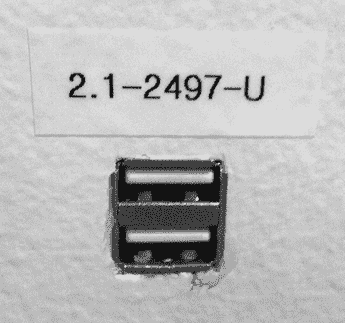
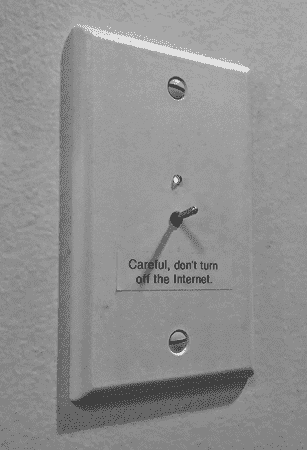

# 第三十二章：硬件的乐趣

由于那时每个人都花费大量时间在办公室，偶尔会有人尝试修改和个性化工作环境。

## 禁止枪支

罗曼·盖谈到了他尝试通过强硬手段来阻止干扰。

“我们都很努力工作，很多人总是要求我们[框架团队]做很多事情。不知道为什么，我下单买了一把泡泡枪，因为显然这是美国公司开放空间里的常见做法。”

“它被挂在我的办公室天花板上，所以当你打开门时，枪口正对着门。上面有一张纸条，写着‘禁止’。”

“有一天我在家工作，第二天回来后发现我的泡泡枪被安装在了三脚架上，电动机加速了。”

“安迪看到了那把枪，虽然我不在现场，但他把它安装在三脚架上，还加了电动机。桌上有一个轨迹球，可以旋转三脚架上的枪支，并且比正常情况下更快地发射，因为他用了一个更强力的电动机。”

## 风雨中的任何港口

有一天，丹·莫里尔注意到墙中间插座板上有一个可疑的 USB 端口，除了它那神秘的标签外，完全没有任何提示说明它的用途。

建筑 44 墙中间的一个神秘 USB 端口（图片由乔·奥诺拉托提供）

丹提交了一个工作请求，要求网络基础设施团队调查此事，标题为“B44-2 墙上为什么会有一个 USB 端口？”

谷歌非常重视安全问题，包括物理安全和技术安全。一个裸露的、带有神秘标签的 USB 端口引发了担忧。工单被提交，安全人员被警告，并且展开了移除该端口的操作。

一支电气团队接管了这个插座另一边的房间，并在外面安置了守卫。电工们在面板后面切开了干墙，揭示了事情的真相。

墙面板背后是……什么都没有。它只是一个嵌入墙里的 USB 端口。原来是个恶作剧。或者，更准确地说，是一些工程师（特别是布莱恩·琼斯、乔·奥诺拉托和布鲁斯·盖）拥有了比计划更多的硬件。他们小心地在干墙上切了个洞，凭借热熔胶和灵感，将一个从旧工作站借来的 USB 端口插了进去。布鲁斯还添加了标签，试图让它看起来更正式。他们并没有更复杂的计划；他们只是觉得它放在那里什么都不做，挺有意思的。谷歌安全部门并不这么认为。

电工将现有的墙面板更换为一个空白面板，虽然提供了相同的功能，但空间更小，不容易搞恶作剧。

## 开关语句

USB 端口修复后留下的空白墙面板的诱惑太大了；它迫切需要一些东西来填补。团队不想再让谷歌安全部门感到紧张，但他们必须做些什么。

Android 部门里总是有各种杂乱的硬件，尤其是布莱恩·琼斯的桌子附近。所以乔和布莱恩翻找了周围的零件，最终做出了一个控制互联网的开关。

翻转开关^(1)导致灯变为绿色，并且开关开始振动（团队找到了某些触觉硬件，使得开关关闭时，面板会振动）。

绿色的灯表示互联网已开启。翻转开关会导致灯变红并且开关开始振动。（照片由杰里米·米洛提供。）

安全部门对这个没有问题；他们允许它在 Android 团队占据那栋楼的整个时间里保持原样。

互联网仍然正常工作，所以可以推测还没有人关掉它。
