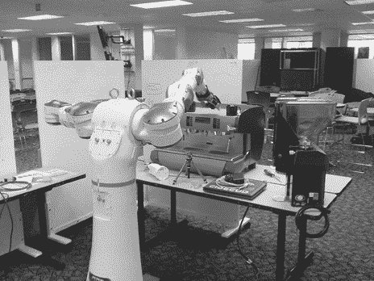
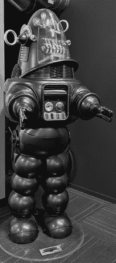
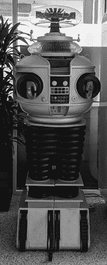
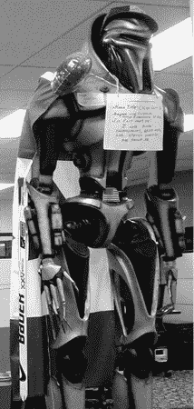

# 第三十三章：与机器人一起玩耍

安迪·鲁宾一直对机器人和各种机器有浓厚的兴趣。他在所有的项目中都延续了这一兴趣，包括在 2013 年离开安卓，转而在谷歌的一个不同部门从事机器人工作。

对机器人和各种小工具的偏爱在早期的安卓中以不同的方式表现出来。

安迪参与的一个机器人项目是咖啡师机器人；他造了一个机器人来制作拿铁艺术。尚不清楚它是否完全正常工作，但在 45 号楼的某个楼上的微型厨房里，确实有一台外形奇怪的机器。该区域被用绳索围了起来，以保护潜在客户^(1)。

你更喜欢脱脂牛奶还是全脂牛奶？安迪的咖啡师机器人制作了一杯拿铁。（图片提供：Daniel Switkin。）

机器人还装饰了安卓大楼的走廊。随着安卓的发展并扩展到其他大楼，它们分布在谷歌校园各地。

电影*禁忌星球*中的机器人罗比。罗比目前住在 43 号楼的二楼，该楼曾是安卓团队的办公楼。

来自*太空失落*的机器人，现栖息在谷歌 43 号楼大堂后方

这位威武的赛隆战士（来自*太空堡垒卡拉狄加*）在 44 号楼的框架团队区域守卫着。随着时间的推移，他积累了配件，如加拿大国旗披风、曲棍球棍和一顶 Noogler 帽子。（图片提供：Anand Agarawala。）
