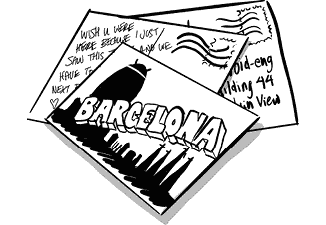

# 第三十六章：来自巴塞罗那的明信片

GSM 世界移动通信大会（MWC）是移动行业的首要商业活动。公司和个人聚集在一起，听取该领域的最新发展，结识合作伙伴，推销自己的想法，并了解竞争对手的动向。

这个活动在 Android 的早期尤其有趣，因为这个领域随着智能手机功能的不断演变而快速变化。Android 领导团队每年都会跋涉到现场，展示 Android 在做什么，并看看生态系统和各种潜在合作伙伴公司有什么新动态。

每年，Andy 都会去巴塞罗那的 MWC，看到 Android 需要融入的功能，以保持领先或保持竞争力。他将报告发回 Mountain View，要求开发这些新功能，而这些功能通常会出现在发布的最后阶段，导致团队在发布前的这段时间里不得不迅速投入到功能开发中，而此时产品本应专注于发布前的质量和稳定性。

这些年度事件被称为*来自巴塞罗那的明信片*，在这些事件中，Andy 会随意地提出一些功能请求，这些请求通常已经太晚无法包含在发布版本中……但团队还是匆忙地去实现，因为这是 Andy。

Hiroshi 记得这些迟到的功能请求。“那时我会发这些邮件说，‘我刚和 Andy 开完会，他真的希望在我们发布之前修复这些问题。’这总是和 MWC 时间重合。有两个原因。首先，那时候通常是我们的维护版本发布计划，所以我们会在秋天做一次发布，然后在那个时候有一个大的后续维护版本发布。所以它通常发生在发布周期的末尾，我们正试图获得发布批准。那时 Andy 是最大的批准者。另一个原因是因为我和他在巴塞罗那，我可以直接给他看：‘Andy，我们得发布这个东西。看看，你准备好了吗？’然后几乎每次，他都会指出一两件事情，这几乎成了他的风格。”

Andy 的迟到请求也是发布计划和软件开发周期固有延迟的结果。“从我们完成软件到它真正出现在消费者手中之间有一个滞后的时间。他不喜欢这种延迟，所以他不想等。当我们说‘下一个发布’时，他知道那意味着六个月、九个月甚至一年的时间，他就会说，‘我不想等那么久，现在就做，发布之前先做完。’

“所以我就会收起尾巴，给团队发邮件说，‘抱歉，不过……’”
