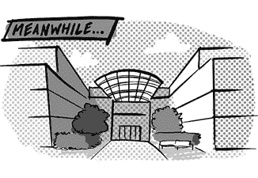

# 第三十八章：与此同时，在库比蒂诺……

Bob Borchers 曾是苹果 iPhone 产品营销的高级总监^(1)，负责 iPhone 的开发和发布。

当 iPhone 发布时，Bob 出现在了苹果官网的原版 iPhone 教程视频中。这个视频令人印象深刻的地方，不仅仅是它是一个 iPhone 教程，或者它有 Bob 的身影，而是它没有由史蒂夫·乔布斯出演。苹果在业界因将公司大部分高管隐藏在严密的门后而闻名，只有少数人被选中作为公司面孔代表。那时（当然）主要是史蒂夫·乔布斯。

一位在那里工作的朋友向我解释过。苹果是一个消费品牌。与谷歌或微软这样的公司不同，它不是关于技术的，也不是关于工程师和工程本身，而是关于那些恰好用技术构建的消费产品。向世界展示一个非常光鲜、精致且一致的形象是这种消费品牌策略的一部分。

Bob 解释了他是如何出现在那个视频中的。“当史蒂夫介绍 NeXT 时，他做了一个视频，坐下来一个半小时，向大家介绍 NextStep 操作系统以及硬件，展示所有的优点，并帮助人们在 NextStep 上构建他们的第一个程序。当我们在思考如何向世界介绍 iPhone 时，我们采用了那个模板，决定‘在这里再做一次’。最初，我们的工作是写一个粗略的脚本，由我来做测试主持人。结果，那个测试环节变成了几个月的黑衬衫试镜。”当团队准备录制最终版本时，史蒂夫太忙了，所以 Bob 接下了这个工作。

当时，苹果内部关于谷歌正在发生的事情有很多传言。“有传闻说谷歌将要做一些关于移动操作系统的事情。这不仅仅是‘会有一款令人惊叹的硬件’，而是‘他们要打造一个平台，供其他人使用’。”

Bob 能够确认这些谣言的时间框架，因为那时他与谷歌有一个会议。“2006 年 10 月。我记得，因为我第一次和我们谈判的团队在[谷歌]开会时，首席产品经理穿着修女服出现。2006 年 10 月，苹果、iPhone、谷歌、地图的第一次碰撞发生在万圣节。我和一位修女坐在会议室里待了 2 个小时。还是一位男修女。”

但是，为什么 Apple 特别关注 Google，尤其是考虑到 Google 在移动设备方面几乎没有任何经验呢？在移动领域已经有了很多其他竞争者，包括 RIM、诺基亚和微软。“微软已经在市场上推出了 Windows Mobile。我们的分析是，微软不懂硬件，所以那是一个糟糕的体验。其他所有的竞争者都不懂软件。我们认为，软件将是主导移动世界的关键。”

“Google 的重大威胁是，Google 对软件和服务的了解。事实上，可能比 Apple 更了解。所以我认为根本的担忧是，这里有 Google，一家曾经在大规模构建软件和服务的公司，它可以并且会对像 iOS 这样的新平台构成重大威胁。”

“另一个问题是，Google 是唯一一家在与运营商合作时，没有现有业务需要冒险的公司。”

Apple 非常关注第一款 Android 设备 G1 发布后的结果。“我记得在它们上市的第一天，我去了旧金山的商店买了一部，然后带回库比蒂诺玩。软件体验是……我们看到了潜力。”实际的 G1 产品并没有在库比蒂诺引起太大的恐慌。[2]

在他们看到 G1 设备之后，Apple 对 Android 并不那么担心，至少对 G1 不太担心，因为他们确实认为自己是在产品层面上竞争，而不是平台层面：“我们当时并没有把 iOS 看作一个平台。当我们正式发布第一个 SDK 和 App Store 时，大约是两三年之后，那时我们才开始把它当作一个平台来考虑。”

与此同时，Android 领先于 Apple 进入了应用市场，Android 1.0 搭载了 Android Market 应用程序，允许开发者分发自己的应用程序。iPhone 最初发布时根本没有 App Store，也没有计划提供。

在 iPhone 发布后，人们对更多应用程序的需求不断增加。“开发者的需求非常大，大家都在请求。第一步是去构建 Web 应用程序。这是完美的，因为当时没有人在手机上安装软件，但你可以拥有类似应用的体验。我们的希望是，Web 应用会成为主流。”

但最终，Apple 在消费者和开发者的压力下，提供了一种方式，让开发者为 iPhone 提供高质量的原生应用程序。“我们完全专注于消费者体验，而消费者告诉我们，他们希望有更高质量的应用程序，同时开发者也告诉我们，他们希望开发出更高质量的应用程序。”App Store 被推出，采用了比 Android 更加精选的模式，符合 Apple 更加严格控制整体体验的方法。

Bob 还评论了 iPhone 对运营商的影响。iPhone 在美国与 AT&T 签订了独家合作协议，并且在其他国家也有类似的独家运营商合作协议。这迫使其他运营商，如 T-Mobile 和 Verizon，寻找其他选项。“我们早期就确定了要在每个市场与一个运营商独家合作。这意味着在每个市场都会有两到三个其他运营商需要以某种方式填补这个空缺。所以，Android 就在这个空缺中找到了机会。”

Bob 于 2009 年离开了 Apple^(3)，也就是在 iPhone 发布两年后。^(4)
