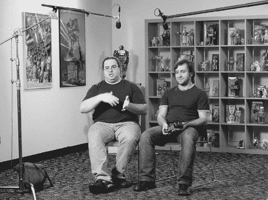
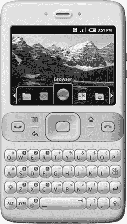
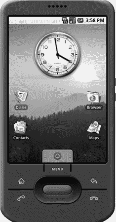

# 第三十九章：SDK 发布

Brian Swetland 和 Iliyan Malchev 录制了一段介绍视频，该视频于 2007 年 11 月 5 日发布^(1)。（图片由 Peisun Wu 提供。）

> 通过为开发者提供一种新的开放性，使他们能够更具协作性地工作，Android 将加快推出新颖且具有吸引力的移动服务的步伐，供消费者使用。
> 
> —开放手机联盟新闻稿，2007 年 11 月 5 日

在发布 1.0 版本、源代码或任何物理硬件之前，Android 就已经发布了早期版本的 SDK。提前发布 SDK 为开发者提供了充足的时间来了解 Android，并构建和测试他们的应用程序。对平台的早期访问也给团队提供了一个机会，收集开发者的反馈，指出在 1.0 发布前需要修复的问题。

## 2007 年 11 月 5 日：开放手机联盟

2007 年 11 月 5 日，Google 宣布成立开放手机联盟^(2)。OHA 是团队所构想的生态系统中的重要一步。与由 Apple 和 Microsoft 主导的传统模式截然不同，在这些传统模式中，单一公司控制着平台，OHA 承诺提供一个开放源代码的平台，所有公司都可以使用。它是由运营商、硬件制造商和软件公司组成的联盟，包括：

+   移动运营商，包括 T-Mobile、Sprint Nextel 和 Vodafone 等公司

+   手机制造商，包括 ASUS、Samsung 和 LG

+   半导体公司（制造集成到手机中的芯片的公司），如 ARM 和 NVIDIA

+   软件公司，包括 Google 和 ACCESS^(3)

该声明承诺了许多美好的未来，但它仅仅是一份新闻稿——充满了美好的词句，描绘着光明的未来，却没有实际产品展示出来。

## 11 月 7 日至 8 日：行业接待

不属于 OHA 的现有移动领域参与者似乎对这一声明不太看重。

11 月 7 日，在 OHA 宣布两天后，Symbian 的高管 John Forsyth 在接受 BBC 采访时表示：“搜索和移动平台是完全不同的事情。这是一个昂贵、艰巨、有时甚至是非常不吸引人的工作——每天支持客户发布手机。这是 Google 环境中几乎没有经验的领域。他们说要在明年年底推出手机，但那款手机不会引起开发者的兴趣。”

第二天，微软时任 CEO Steve Ballmer 在新闻发布会上表示：“他们的努力目前只是纸面上的一些文字，很难与 Windows Mobile 进行明确的比较。现在他们有一份新闻稿，而我们有很多很多的客户，优秀的软件，众多的硬件设备。”

空气中似乎弥漫着一种*虚拟软件*^(4)的感觉。新闻稿是一回事，但发布一个手机平台则是另一种完全不同的软件挑战。

## 11 月 11 日：SDK 发布

11 月 11 日，在 OHA 宣布后的六天，Android SDK 发布了，版本被亲切地命名为 *m3*。^(5)

当初 OHA 宣布时，SDK 已经完全准备好了。但决定先发布新闻稿，并让它在发布代码之前流传几天。这为行业情绪和普遍的误解提供了滋生的空间。六天后，团队发布了实际的软件，使得这个宣布变得非常真实。

既然 SDK 已经发布，应用开发者可以下载它，进行尝试并开始开发应用，但这远不是最终版本。例如，第一次发布的版本有一个模拟器，看起来像 Sooner 设备（配有硬件键盘，占据了比小屏幕更多的空间，但也具备了实际 Sooner 设备所不具备的触控支持）。这个模拟器还已经有许多功能性应用。Android 确实是一个基本完整的系统，尽管没有可以发布的物理设备，并且 API 也尚未最终确定。

第一次 SDK 发布中的模拟器类似于原始的 Sooner 设备，配有硬件键盘，尽管与 Sooner 不同，它还具备了功能性的触摸屏。

2007 年 12 月发布的 SDK m3-r37 版本中包含的模拟器。

在第三个 SDK 版本 *m3-r37a* 中，发布仅一个月后，模拟器提供了一个更现代的设备，配有更大的触摸屏。

值得注意的是，所有这些 SDK 仍然可以在 [`www.android.com/`](https://www.android.com/) 网站上获取，包括仍然能够运行的模拟器。你为何想花时间使用这些 Android 的预发布版本是另一个问题，但能够使用它们还是挺酷的；Android 一直以来都强调开放性，显然这一点也延续到了从未实际搭载运行硬件的过时操作系统版本上。

## 名字代表什么？

给产品命名可能是一个困难的任务，特别是当律师参与其中时。^(7) 有一个内部代号供团队使用是一回事。它可能是任何名称，因为外界可能永远不会知道，也不会与其他人或公司的产品或名称产生冲突。^(8) 但当这个内部产品变得外部化并公开时，事情就变得复杂了。你必须做商标搜索。当别人已经拥有你想要的名字时，你必须弄清楚该怎么做，通常这意味着要想出一个新的名字。

在发布前的几周，人们担心*Android*这个名字无法在外部使用。黛安娜说：“我记得我们当时非常担心可能需要更改名字，因为那个时候‘Android’这个词几乎无处不在——在 SDK 上，到处都是。如果我们不得不在 API 中更改它，那将是一团糟。”

团队还集思广益，提出了其他一些选项，包括*Mezza*。丹·莫里尔解释了这个名字背后的逻辑：“它本应意味着‘夹层’，就像是中间件的作用。”不用说，没人喜欢这个名字，最终做出了正确的决定。

## Android 开发者挑战赛

发布一个新的软件平台的其中一个难点是让任何人都开始使用它。当 SDK 发布时，全球除了 Android 团队之外没有任何用户，直到 1.0 版本发布之前，Android 设备都无法购买，所以这个数字可能需要好几个月才能发生变化。团队必须想办法让开发者对投入时间和精力开发这个没有用户、充满不确定性的全新平台产生兴趣。

所以团队想出了 Android 开发者挑战赛。2007 年 11 月 12 日，关于 Android 的第一篇博客以一个引人注目的钩子结束：“我们真的很期待看到开发者在开放的移动平台上创造出所有令人惊叹的应用程序。事实上，你可能还想把你的应用程序提交到*Android 开发者挑战赛*——这是由 Google 赞助的 1000 万美元挑战赛，旨在支持和表彰为 Android 平台开发出优秀应用程序的开发者。”

2008 年 1 月 3 日，比赛正式启动。团队接受参赛作品直到 4 月 14 日，然后将它们送往全球的评审团，评选出前 50 名应用程序。这 50 名开发者每人获得了 25,000 美元的奖励，并要求提交第二轮作品。在第二轮中，前 10 名应用程序获得了每个 27.5 万美元的奖励，接下来的 10 名则每个获得 10 万美元。如果你算一下，这次比赛 Google 一共发放了 500 万美元的奖金。

因为这些应用程序当时连用户都无法使用，所以很难说团队是否得到了应有的回报。那时，Android 外的人连一台可以运行这些应用程序的设备都买不到；而决赛选手的名单在 2008 年 8 月公布，距离第一台 G1 手机上市整整有两个月。但这个挑战赛确实吸引了开发者的兴趣，因为有 1,788 个应用程序参加了这个比赛，尽管平台没有用户且发布日期未知。

这项活动不仅让开发者对平台产生了极大的兴趣；将所有这些开发者引导上手并获得他们的反馈，也帮助平台团队在最终发布 1.0 版本时更好地完善了系统。Dirk Dougherty 解释说：“我们必须弄清楚如何编写应用，然后再将这个过程解释清楚。处理所有的反馈。今天我们可能会收到大量反馈，但这是一个全新的 API 接口，运行在一个全新的平台上，以前没有人真正用这种方式接入传感器等设备来编写应用。所以出现了大量我们没有想到的全新使用案例。”

即使是评审应用的过程也颇为独特……Google 希望能够请到全球知名的评审来评判，这些评审在开发者社区中有一定的知名度。Google 希望能够让这些远程评审的工作变得简单，但那时 Android 的开发并不“简单”。为了运行一个应用，评审必须先在自己的电脑上安装 SDK，运行工具，启动模拟器，运行命令将应用加载到模拟器中，并启动应用。要评审近 1800 个应用，这根本无法扩展。

所以 Google 为每一位评审发送了预装工具的笔记本电脑，这些工具是 Dan Morrill 的开发者关系团队编写的，能够启动模拟器，并提供一个界面来选择测试的应用，自动安装并在模拟器上运行。“我们给全球的每一位评审都寄出了笔记本电脑。那真是疯狂！这些笔记本电脑大多数都没能归还。有一个评审把它寄回时，包装盒里塞满了各种毛绒玩具，不知道为什么。”

初赛的前 50 名获奖者仍然可以在 Android 开发者博客上找到；^(11) 名单上的第一个是由 Android 团队的 Jeff Sharkey 创作的“AndroidScan”。^(12) 不，他并没有通过以 Google 员工身份参加比赛来作弊：Jeff 是因为平台团队看到他在比赛中的表现才被招募的。“我被邀请到山景城，参与开发机密设备（G1）。我当时兴奋得完全没在山景城时继续开发那个应用。相反，我开发了另一个应用^(13)，这个应用使用超级优化算法进行区号到城市的来电显示查询，不需要网络连接。”后来，Jeff 继续开发 AndroidScan，并将其改名为 CompareEverywhere，最终成为了 10 位总冠军之一。

一旦比赛结束，团队继续完善产品，并在 2008 年 10 月发布了 1.0 版本。2009 年 5 月，他们举办了第二次挑战赛，奖池再次提供了五百万美元。但与此同时，Android 已经吸引了真正的用户，Android Market 也开始营业。现在，Android 拥有了一个真实的用户和开发者基础，不再仅仅是一个预发布平台的参赛者。
