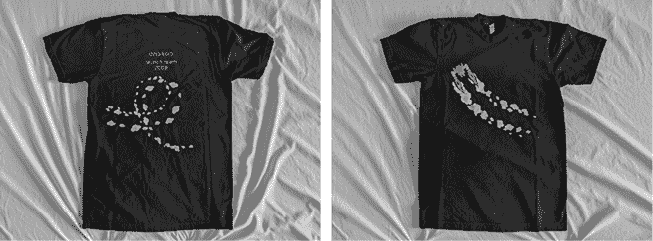
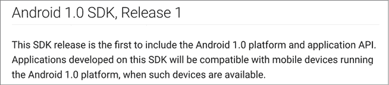
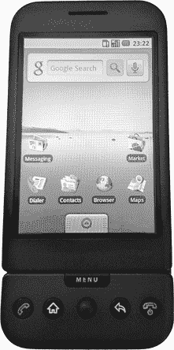
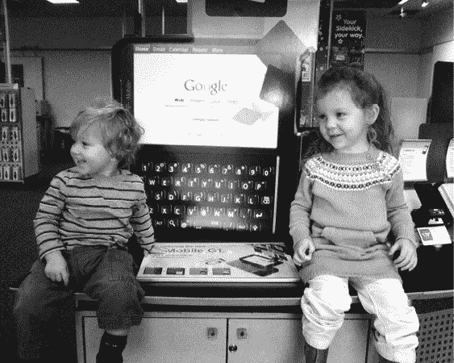

# 第四十一章：1.0 版本发布

在科技行业，软件发布通常会通过为团队提供纪念 T 恤来庆祝。这款 1.0 版本发布的 T 恤是 Android 发布中的第一款类似纪念 T 恤。（图片由 Chiu-Ki Chan 提供）

Android 1.0 的发布分为四个阶段，于 2008 年秋季进行。

## 9 月 23 日：Android SDK

发布的第一部分是 SDK 本身，1.0 于 2008 年 9 月 23 日发布。一方面，1.0 只是自从 10 个月前的初始 m3 发布以来的又一次更新，直到 8 月 18 日才发布了 0.9 版本，距离它只有短短五周。

但 1.0 版不仅仅是另一个迭代版本；它，嗯，*就是 1.0 版*。它代表了团队对 Android 官方支持的 API 的最终思考，因为从现在起，如果没有打破已经构建的应用程序，就无法再更改 API。

按照惯例，Google 并未对这个开发者产品进行大肆宣传。没有新闻发布会；只是在服务器上上传了一些文件，并附带了这版中的修复说明。即便是发布说明的开头句子也非常克制。如果你不知道你在看什么，可能会以为这只是另一次更新（实际上，在某种程度上，它确实是）。

1.0 发布的重大爆炸性新闻的发布说明... 语气很克制。

但这些发布说明确实包含了一个重要的功能缺失道歉：“我们遗憾地通知开发者，Android 1.0 将*不*支持点阵打印机。”

## 9 月 23 日：T-Mobile G1 公布

Google 没有为面向开发者的 SDK 发布会召集媒体，但他们确实在纽约市的新闻发布会上与 T-Mobile 一起上台，宣布了将运行 1.0 的消费者手机。与 1.0 SDK 一同发布的当天，代表们讨论了新设备，并且 T-Mobile 发布了一份题为“T-Mobile 推出首款 Android 手机 T-Mobile G1”的新闻稿。

G1 设备将配备触摸屏、滑动开启的 QWERTY 键盘以及轨迹球。它将运行 Google Maps、搜索，并提供来自 Android Market 的应用程序。设备配备三百万像素的相机，并将运行 T-Mobile 的全新 3G 网络。它将以合约价 179 美元或解锁版 399 美元的价格销售，初期将在美国推出，随后几周扩展到其他国家。

而且，它将在一个月后上市。顾客可以预订 G1，但必须等到 10 月 22 日才能拿到。

## 10 月 21 日：开源

就在 G1 发布前一天，1.0 的源代码被发布了。再次提醒，这次的开发者发布没有任何盛大的活动。实际上，这次甚至没有新闻稿，只有一篇简短的三段式内容发布在 Android 开发者博客上，标题是：“Android 现在是开源的。”

这不算什么。但它是*一切*。

Android 从诞生之初就计划推出开源平台。它将这一构想向投资者、谷歌、团队成员、运营商和制造商合作伙伴以及全球开发者进行了推介。如今，在首个公开 SDK 发布 11 个月后，1.0 版本发布 1 个月后，它兑现了所有承诺，将所有代码公开，供大家查看和使用。

## 10 月 22 日：T-Mobile G1 发布

10 月 22 日，在 Android 开源的次日，G1 终于对谷歌以外的人开放，大家可以尝试并购买。

T-Mobile G1

当 G1 在旧金山 Market 街的 T-Mobile 店铺开始销售时，Romain Guy 在场，拍下了第一位购买者的照片。如今，想象谁在什么地方购买手机似乎不再重要，但在当时，这第一笔购买标志着开发团队多年辛勤工作的结晶；看到他们的努力走向现实，并看到人们排队购买，令人兴奋。那天在店里还有另一位人物，他是 iPhone 的产品营销高级总监 Bob Borchers。他当时为自己的团队购买了一部 G1，让他们回到苹果公司后好好体验。

Michael Morrissey 和他的孩子们在 G1 开售的第一周参观了 T-Mobile 店铺中的 G1 展示。（图片由 Michael Morrissey 提供。）

G1 是制造商（HTC）、运营商（T-Mobile）和谷歌之间合作开发的第一款设备。最初，这些谷歌合作设备的想法是展示最新版本的功能。同时，这些手机也让团队能够验证新功能，确保所构建的东西能够在真实硬件上运行。对于 G1 来说，这款硬件帮助团队验证了 Android 平台是否可行，是否能为功能齐全的消费设备提供支持，并为更多平台功能和设备的到来提供了基础。
