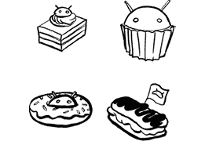
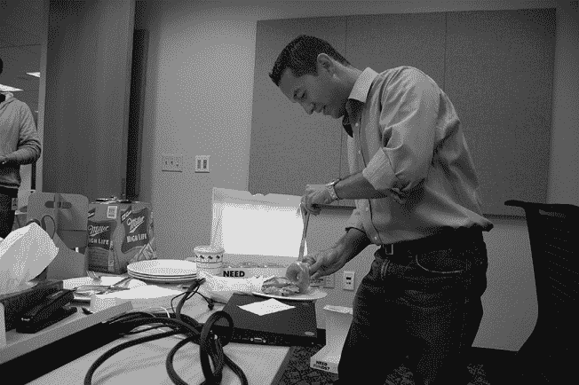

# 第四十三章：43  

**甜点**  

  

1.0 版本发布，G1 手机上市，大家松了一口气，完成了这项艰巨的任务。然后他们又回到了工作中。  

对团队来说，Android 显然还远未完成；在功能和质量上还有很多工作要做，以使 Android 更具竞争力。而且，更多的设备也在陆续推出。  

在接下来的一年里，团队拼命工作，发布了多个小型的错误修复版本以及更大的“甜点”版本，最终以 2009 年底与 Droid 设备一起发布的 Eclair 版本为高潮。仅仅一年时间，团队就发布了四个主要版本：1.1（Petit Four）、1.5（Cupcake）、1.6（Donut）和 2.0（Eclair）。  

Tom Moss 指出，这种疯狂的节奏是故意为之：“有两个原因：Andy 是个完美主义者，他希望产品变得更好。当产品不够好时，他个人会感到非常不满。但这也是一种战略，故意让 OEM 厂商不敢分叉，他们会说，‘等你们的分叉版本发布时，我们的新版本 Android 已经出来了，你们得重新开始。’”  

“他故意推动我们每年发布多个版本，以此来阻止或使得别人不再尝试分支。”  

## 1.0 r2：2008 年 11 月  

第一个错误修复版本之所以值得注意，是因为它是第一个。1.0 版本于 2008 年 9 月发布。这个版本被安装在了当年 10 月出售的 G1 手机上。随后在 11 月发布了 r2 版本，除了各种错误修复外，还增加了一些功能和应用。

## 1.1 Petit Four：2009 年 2 月  

1.1 版本是第一个命名的版本：*Petit Four*（一种小蛋糕，法语为“小烤箱”）。这是一个相对较小的版本，包含了错误修复和一些 API 的新增功能。它还为其他语言提供了本地化支持（1.0 仅支持英语），这对于这个国际化的平台来说，成为了一个重要的特性。  

从这一点开始，每当“点”版本号（第一个点后面的数字）有变动时（例如 1.1 与最初发布的 1.0 相比），意味着该版本中有 API 变化。API 的变化意味着基于旧版本 SDK 构建的应用程序可以在新版本上运行（Android 始终尽力保持向后兼容性），但基于新版本构建的应用程序可能无法在旧版本上运行（因为新 API 在旧版本中不存在，使用这些 API 会导致旧系统出错）。  

1.1 版本是第一个允许在 Android Market 上出售应用程序的版本。在 1.1 之前，向用户收费的机制尚未生效，因此 Market 只允许免费应用程序。  

Petit Four 也是第一次将甜点名称用于 Android 版本，尽管它显然没有遵循按字母顺序依次命名的传统；这一传统从下一个版本“Cupcake”开始。  

## 1.5 Cupcake：2009 年 4 月

Cupcake 是首个建立了连续字母甜点传统的版本。它以“C”开头，因为这是第三个主要版本，而“Cupcake”被选为 C 字母的甜点名称，因为当时负责发布的 Ryan PC Gibson 对杯形蛋糕（cupcakes）情有独钟。^(1)

Cupcake 为开发者和用户带来了一些显著的功能。首次出现了应用程序小部件（App Widgets）。现在可以进行视频录制。开发者可以开发并分发自己的键盘应用程序。此外，还新增了一种传感器和逻辑来检测旋转，因此用户可以将手机旋转至横屏或竖屏模式显示。在此之前，用户需要滑出 G1 的键盘，这样显示屏就会自动转为横屏模式。

Cupcake 版本的发布恰逢一款新设备的推出：HTC Magic。Magic 是首款仅支持触摸的设备；G1 的硬件键盘被现在大家熟悉的屏幕软件键盘所取代。

Cupcake 的发布说明中有一则对开发者和用户来说不太好的消息：*“我们遗憾地通知开发者，Android 1.5 将不支持 Zilog Z80 处理器*^(3) *架构。”*

## 1.6 Donut：2009 年 9 月

Donut 版本完善了平台的一些基本功能。电信堆栈现在支持 CDMA，这是 Verizon 使用的系统（例如在 Verizon 网络上推出的摩托罗拉 Droid 便采用此系统）。框架团队完成了对任意屏幕大小和密度的支持，这对于推动不同形式因子的更广泛生态系统至关重要。^(4) Donut 还包括了语音转文本引擎。虽然它远不如今天手机中使用的系统强大，但它表明了技术的潜力。

Donut 版本的发布说明也带来了一则不幸的消息：*“我们遗憾地通知开发者，Android 1.6 将不支持 RFC 2549。”*^(5)

广志正在享受一个“甜甜圈汉堡”。Peisun Wu 向团队介绍了这一概念，以庆祝 2009 年 9 月的 Donut 版本发布。（图片由 Brian Swetland 提供。）

## 2.0 Eclair：2009 年 10 月

另一个有趣的地方是 Eclair 版本发布的时间非常接近 Donut 版本—仅相隔一个月。^(6) 当时团队在多个频繁的发布中并行工作得非常努力，实际上 Eclair 版本的开发工作在 Donut 版本发布之前就已完成。

在 Eclair 中增加了多种功能，包括动态壁纸和逐步导航。^(7) 但也许 Eclair 最值得注意的是，它与新推出的 Droid 和 Passion（Nexus One）设备一同发布，这些设备在 Eclair 发布后不久就推出了。Passion 设备是团队真正倾心的产品，但 Droid 是首个成功打入大规模消费市场的设备。
