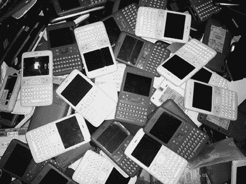
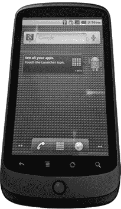
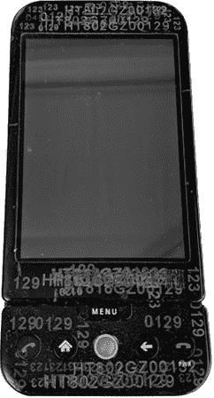
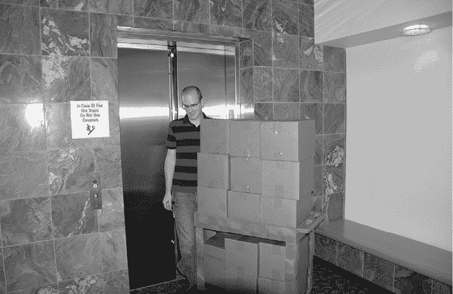

# 第四十四章：早期设备

一堆 Sooner（图片由 Brian Jones 提供）

如今，Android 生态系统的一个特点是几乎无限种类的设备。不仅有许多不同制造商生产的不同型号的手机，还有平板、相机、电视、汽车、手表、物联网设备，甚至是飞机上的娱乐屏幕^(1)。

## 1.0 之前：Sooner、Dream（HTC G1）及更多

很早的计划包括四款手机。正如 Swetland 回忆的那样，“2006 年 6 月讨论中的四款设备是 Sooner（HTC wedge）、Later（LG wedge）、Dream（HTC G1）和 Grail（摩托罗拉设备，可以一侧滑出 QWERTY 键盘，另一侧滑出数字键盘）。Grail（或其某些变种）多年来一直时隐时现。”但最终计划仅定下了 Sooner 和 Dream，关于它们的终结与发展在前面章节中有讨论。

## 蓝宝石（HTC Magic）

Android 的第二款旗舰设备，代号 Sapphire，是基于 HTC Magic 的。它在 2009 年春季随 Android 1.5 Cupcake 版本发布。实际硬件规格与原始的 G1 类似，尽管 Magic 有更多的内存。但最大变化是键盘：Android 终于决定全面转向触摸屏，放弃了早期 G1 上的硬件键盘。Magic 还首次支持 Android 的多点触控^(2)。

## 摩托罗拉 Droid

Droid 手机对早期 Android 系统的重要性，以至于它有自己的专章（第四十五章，“Droid 做到了”）。如果你愿意，可以现在去读那个章节。我等你。

## 热情与 Nexus

与 Droid 手机并行，团队还在研发另一款代号为 Passion 的设备。它在 2010 年初作为 Nexus One 发布。

Nexus One 于 2010 年 1 月发布，紧随其后的是摩托罗拉 Droid。

Passion 是“Google Experience”系列手机之一。Google Experience 的过程经过多年变化，曾有过许多不同的名称和合作形式。在 Nexus One 发布时，与 HTC 的合作被赋予了“With Google”这一品牌。这个口号是在工程团队中诞生的。市场部原本提出的口号是“它有 Google”。但系统团队的 Rebecca 向 Andy Rubin 抱怨：“这句话都不合语法！那‘With Google’怎么样？”Andy 说：“好的！”于是，这一联合品牌口号诞生了。

Passion 拥有当时较大的屏幕和适合手持的曲线。但 Passion 的独特之处并非硬件或软件，而是 Android 所尝试的销售模式。在美国，大家当时（现在大部分时间也是）购买手机的方式是通过与运营商签订合同。与其单独购买设备，再支付运营商费用接入其网络，人们会去 T-Mobile 商店（例如）购买他们提供的手机。手机以大幅折扣出售，并附带一定期限的合同锁定。这就是手机市场的运作方式。

但 Android 的领导层有一个想法，那就是人们应该有选择权。假如他们独立选择手机，而不是通过运营商选择手机，且只支付运营商费用以连接到他们的网络呢？这样他们就不受合同约束，用户的选择也更多了，因为他们不必从运营商店铺里那些偶然摆放的设备中挑选。

Google 没有实体店铺，因此他们在线销售 Nexus One。他们耐心等待。但事实证明，人们并不真正理解这种购机模式，也不急于去弄明白。此外，如果他们从网站上购买的手机出现问题，他们没有客服热线可以联系，也没有实体店铺可以退货或寻求帮助。

最终，Android 放弃了这个想法，Nexus One 由运营商提供。它的销量远未达到 Google 的预期，且被摩托罗拉 Droid 远远超越。

Nexus One 是 Nexus 系列中第一款手机。Nexus 手机是 Android 团队与制造商合作开发的设备，目的是创造一个整体的 Android 手机体验。团队无法控制其他制造商在硬件、软件以及可能在 Android 上层叠加的应用程序的生产与销售。通过推出自己的手机，Android 可以确保这些设备拥有他们想要的硬件（至少在硬件合作伙伴可以提供的范围内），并且拥有他们想要的软件。

Nexus 项目的另一个，或许是主要的，原因是生产一款“参考设备”。Nexus 手机向世界（以及合作伙伴）展示了该版本的 Android 所能实现的功能。但团队也确保平台可靠地支持新功能，这在硬件与软件分开开发的情况下可能会更难实现。在许多年和多个版本中，新的 Nexus 手机会与每次软件发布同时推出，展示最新的硬件进展以及 Android 的新功能。

在 Android 的历史上，Nexus 和其他 Google 帮助推出的设备的一个重要特点是它们由不同的制造商生产。这是非常有意为之的，目的是让整个合作伙伴社区都能参与到 Android 中。Google 的早期设备包括 HTC、摩托罗拉、LG 和三星的手机。

Charles Mendis 说：“Andy 和业务开发的功劳很大。我们不仅仅和一个厂商合作；我们会在他们之间切换。我们成功地让硬件领域的一些最大厂商投入到 Android 中，使它成为*他们*的平台，现在所有这些手机硬件都由他们制造。我们让他们觉得 Android 是大家的；Android 并不是 Google 的独占。^(3) 我认为这对它的成功起到了很大作用。”

## Brian Jones 与设备分发

> 我是[设备]连接人员。
> 
> —Brian Jones

在每个科技公司里，总有一个你必须认识的人，才能得到最好的设备来完成你的工作。这个人是内外部所有人和他们所需物品之间的纽带。

在 Android 团队中，这个人就是 Brian Jones（大家都叫他“bjones”）。

Brian 一直是个喜欢动手的研究者。小学早期，他想知道电话是如何工作的，于是他的老师组织了一次课堂活动，并带来了她自己家里的电话。“我把它拆开，直到看到封装在蜡里的变压器。根本没有可能把它重新装好。它是蜡状的，弄得自助餐厅一片狼藉。我以前从来没做过这事，我惹了大麻烦，因为老师本来指望能带着她的电话回家晚上继续用，但那显然不可能了。”

Brian 进入 Android 团队的路径并不典型，他最初获得的是古典学的大学学位。当他搬到湾区并需要工作时，他在 Android 团队工作的 44 号楼做接待员。他结识了团队中的许多人，包括 Andy 的管理员 Tracey Cole。Brian 的建议是：“和管理员建立友谊。她们是你可能在生活中最值得争取信任的第二重要—如果不是第一重要—的人。”

2007 年春季，Tracey 开始休假，Andy 需要有人在她休假期间替代她的工作。“Tracey 说，‘我不想再去找一个临时工。Brian 是我们已经信任的人，我只希望把这个工作交给他。’所以我当了 Andy 的管理员三到四个月。”

Brian 的刻印机，放在一个小厨房区域。Brian 编程控制它开关并旋转设备，同时配合激光进行工作。（图片由 Daniel Switkin 提供。）

当特雷西回来后，布赖恩在团队中担任了新的角色：他成了“狗粮”经理，负责 Android 设备的分配。当手机从制造商那边进来时，布赖恩会给它们刻上独特的 ID。“那就是我的工作，尽可能快地刻印每一部手机，给成百上千需要拿到它们的人。如果发生泄密，我们可以追溯源头。但这对设备管理也是有好处的。”

激光刻印不仅仅限于测试设备。“杯子。眼镜。我们还尝试过火腿。火鸡。我们点燃了好几个火。我在那段时间学到了很多关于激光的知识。”

布赖恩喜欢那些完成工作所需的随机硬件。“有激光。有紫外线打印机。我记得在看着定制背壳 G1 打印时被晒伤了，因为每个背壳都会稍微变化一下，如果它们弯曲得太多，你就得调整打印机设置。我被晒伤了。就在室内。在没有窗户的楼区。”

布赖恩·琼斯的测试设备，一部预发布版 G1 手机，他用它来在刻印一批新设备之前先校准机器。

布赖恩负责设备分配的原因之一是，他的优先事项总是帮助产品。他不参与企业游戏。“决定谁拿到什么，是落在我肩上的事。我认为自己擅长的一件事就是不被人们的头衔、销售技巧或个性所左右。如果有人过来说，‘我需要这个东西’，我的第一个问题是，‘你为什么需要它，如果没有它，会有什么影响？’

“如果你是高管，有些影响是：我们不能做产品决策。但判断这些高管实际上如何发挥作用很重要。在早期，如果你是销售或广告部门的副总裁或高级副总裁，但这与 Android 无关，我根本不在乎你是谁。那与我的产品线无关。你和街上的任何人没什么区别。”

“我完全不介意告诉别人滚蛋，无论你是谁。如果我认识的团队成员，比如迈克·克莱隆（Mike Cleron），说‘我们的团队人手不够，我们需要一些设备，你能帮忙吗？’你们要什么就有什么。你们让产品得以实现，任何事都没有官僚障碍。我知道你们很重要，是核心组成部分，你们的请求绝对不是在抬高要求。”

最终，布赖恩成了每个需要 Android 设备的人的焦点。当设备到货时，他的桌子前会排着一条不间断的人龙。还有一波接一波的人会进大楼，找他和他的设备，并且问大楼里的人他在哪里。布鲁斯·盖伊（Bruce Gay），他坐在布赖恩旁边，在他的桌子上挂了一个牌子，上面写着“不是 Bjones”，就是为了搞清楚这一点。

布莱恩在 2007 年 12 月交付成果。这些要么是 Sooners，要么是正在向工程团队传递的非常早期的 G1 版本。（图片由布莱恩·斯威特兰德提供。）
