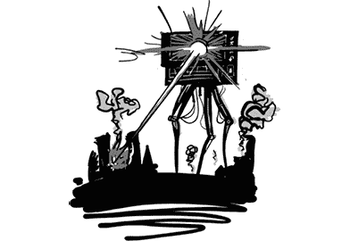
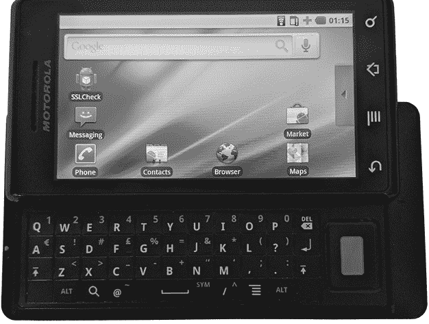

# 第四十五章：Droid 做到了

> “我做不到，但 Droid 做到了”
> 
> 肌肉梗挑起了争斗
> 
> 请处理受损的水果
> 
> —Mike Cleron

摩托罗拉 Droid 的市场成功是 Android 可能会成功的第一个信号。Android 一直在缓慢地获得采用和接受，但 Droid 是第一个大获成功的基于 Android 的产品，尤其是在美国。与之前的 Android 设备不同，Droid 的一个特点是它是第一个拥有真正营销活动的 Android 设备。Verizon 投入了 1 亿美元用于营销，并通过他们的“Droid 做到了”广告覆盖了无线电波。

Droid 于 2009 年 10 月 17 日发布，并于 11 月初正式发售，成为了商业上的成功，因为消费者开始更加认真地对待 Android 手机。同时，合作伙伴也开始更认真地看待 Android，最终推动了更多的产品（*许多*产品）的推出，进一步促进了基于 Android 的设备销量。

Michael Morrissey 记得发布时的影响：“我们很小，很拼命，不断推出所有这些操作系统更新，但我们觉得自己根本没能打动消费者。然后 Droid 有了一个大销售日。接着第二天也和第一天差不多，可能卖出了 65,000 部设备。但接下来我们就想，‘天啊，现在该怎么办？就这样吗？这些只是超级激动的早期采用者，它会消失吗？’但销量持续不错。我对数字的记忆不太准确，但大概是每天 30,000 部，持续了一段时间。一旦这种情况继续下去，Droid 真正成为了大热产品，我们就觉得‘我们现在有希望了’。”

摩托罗拉 Droid。滑开手机后，显示出一个硬件键盘。

但在 Android 团队内部，Droid 的开发情况却截然不同。起初，这是一个没人想要的产品。就在摩托罗拉接触 Google 合作开发这款设备的同时，HTC 也接触了 Google，想要共同开发 Passion 手机（最终发布为 Nexus One）。团队对 Passion 设备更为兴奋，因为它将是 Google 品牌的手机，意味着可以更好地掌控最终产品。

与此同时，Droid 在内部缺乏关注。Andy Rubin 起初甚至不想做这笔交易，原因包括运营商网络的细节。Rich Miner 回忆道：“Andy 不想做 CDMA（Verizon 的手机网络技术），因为我们在 T-Mo 上的第一批手机都是 GSM。我们（Rich 和 Hiroshi）必须把这件事推进到足够远的程度，基本上是违背 Andy 的意愿，以确保它有足够的动力，让我们清楚地意识到不能停止它。”

黄伟记得 Droid 和 Nexus One 之间的紧张关系：“Andy 更倾向于 Nexus One，因为它是他设想的产品。我认为它是一款更好的设备。”

与此同时，尼克萨斯一号将获得比 Droid 更多的联合品牌支持。Verizon 希望 Droid 成为一款 Verizon 设备，主要品牌包括 Verizon（运营商）和摩托罗拉（制造商）。而谷歌品牌并未出现在 Droid 上。

Droid 不仅在品牌和归属感上存在问题，它还……丑。Tom Moss 说：“它的边缘都是尖的，角落能把自己划伤。”

但营销能够起到作用，而 Droid 的营销活动正是做到了这一点。该活动利用了这款设备的独特之处，并将其潜在的弱点转化为强项，把它宣传成一款能够做更多事情的机器人设备，超越了竞争对手。显然，这个策略奏效了，美国市场上购买 Droid 的数量远超过了以前购买任何其他 Android 手机的人。Android 手机销量曾被竞争对手远远甩在后面，但到了 2010 年底，Android 的市场份额持续增长，完全超过了 iPhone 的销量。^(1)

Cédric Beust 在内部评论 Droid 与 Nexus 竞争时说道：“所以我们当时都有些得意洋洋，心里想着，‘是的，我们在做 Verizon，但更多是因为我们需要把钱放到桌面上。但真正重要的是 Nexus。’谷歌，或者说 Android，曾经傲慢地认为仅仅在我们的网站^(2)上卖手机就足够了。回想起来，真是太天真了。”

“然后我们看到了第一个电视广告，^(3) 这个广告给我们很多人留下了深刻印象。那真的是一个非常棒的广告。最终，Droid 手机大获成功，而我们的手机[尼克萨斯一号]表现不佳。我认为这对我们来说是一个非常谦逊的教训。我们开始意识到产品和营销的重要性，并且明白也许是时候传递接力棒了。我们一直被技术驱动。技术基础已经打好；现在需要让真正的市场接管。像 Verizon 这样的大公司将会把它带到下一个层次。”

Charles Mendis 表示同意。“他们的营销活动真的很有意思。”

“最初，特别是 Andy 和 Larry 想把这款 Droid 手机作为一款便宜的设备来卖。他们希望这款设备能够面向每个人。但 Verizon 却说，‘我们没有 iPhone，从品牌和营销的角度来看，我们不能把它作为一款便宜的设备卖。我们必须让人们觉得它和其他品牌一样好。’”

Verizon 为 Droid 制定了一个营销计划，并向团队展示了这个计划。Charles 说：“我觉得如果做一款更便宜的设备会更好。但 Verizon 做得很棒，他们抓住了重点。销售和市场反馈证明了这一点。”

Charles 认为，Droid 成功的另一个因素是公司内部对其的优先级。最初，Droid 和 Nexus One 打算同时发布。但最终做出决定先发布 Droid，再推出 Nexus One。Droid 于 2009 年 11 月发布，而 Nexus One 则在两个月后，即 1 月发布。

“将 Nexus One 推迟到第二年是 Droid 成功的另一个重要原因。之前，团队中有一个困惑：是应该修复 Nexus One 的 bug 还是 Droid 的 bug？Nexus One 是公司推出的设备。”

“Andy 最终做出了艰难的决定。他说‘Nexus One 之后发布，整个团队应该专注于 Droid’，这确实帮助我们把 Droid 作为一款设备成功推出。”

Droid 的硬件性能也起到了帮助作用。Charles Mendis 说：“在 G1 上，地图的一个最大问题是缓存会崩溃。我们会遇到‘内存不足’的异常，然后应用在使用过程中就死掉了。我们做了很多工作来绕过这个问题，但就是没有足够的 RAM 可用。当 Droid 发布时，我们实际上能够提供更好的体验。”

“在 G1 上，我们被迫在一个非常受限的环境中开发，而当 Droid 发布时，事情实际上运行得很好，因为我们是针对 G1 开发的。我觉得 G1 几乎像是一个 Beta 版本，迫使团队在非常紧张的限制下工作。Droid 上的体验相当不错，因为我们是为一个更紧凑的环境构建的。”

Droid 硬件的另一个重要方面是屏幕。Droid 是第一款屏幕尺寸（480 × 854）与原始 G1（320 × 480）不同的设备。此外，Droid 的像素密度也高于早期的设备（每英寸 265 像素，而早期设备为每英寸 180 像素）。这意味着开发者第一次能够看到以适应不同屏幕尺寸的方式构建应用程序的优势。

Droid 是 Android 的*曲棍球棒*^(4)时刻，Android 的采纳曲线迎来了急剧上升。Hiroshi 回忆道：“我记得大约在 Droid 发布的前后几天，我看到一篇文章，报道中采访了一位在 iPhone 和 iOS 上发布过应用并且已经在 Market 上发布的应用开发者。他们说，‘哇，我们已经注意到 Droid 了。’大约两天后，开发者说，‘我们在 Android 上的安装量已经大幅上升了。’那也是一个时刻，不仅是消费者的时刻，也是开发者的时刻，他们当时心里想，‘天啊，这个平台可能有前途。有人在买这些设备。’”

Droid 于十一月发布。几个月后，Dave Sparks 记起了他参加的一次员工会议。“那是在发布之后的几个月，大概是 1 月，我们刚开始看到增长的曲线。Eric Schmidt 召集了 Andy 团队的会议。我记得当时 Dianne 和 Mike Cleron 都在，基本上都是高层人物，Hiroshi 也在，显然。”

“Eric 看了看房间， said, '不要搞砸了。'”
