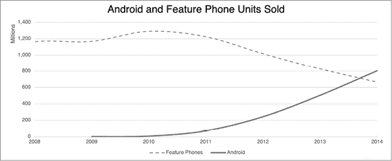
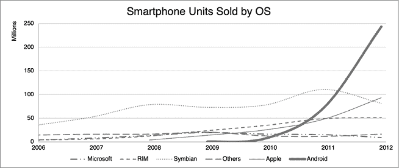

# 第四十七章：曲线

随着三星和其他制造商开始在全球销售自家的安卓设备，随着 Droid 的发布，销量的上升迅速且持续增加。

当 Droid 在 2009 年末发布时，安卓平台在智能手机平台中处于较低的位置。到 2010 年底，也就是一年多后，安卓设备的销量已经超越了除了诺基亚的 Symbian OS 之外的所有平台，并且在第二年又超过了 Symbian。

与此同时，越来越多的人选择智能手机而不是*功能手机*，^(1) 即传统的低端（且体积较大）手机市场，许多人选择了安卓智能手机。

安卓系统在 2008 年末发布后，花了几年时间才在智能手机市场中崭露头角。^(2)

智能手机最终影响了功能手机市场，因为人们越来越倾向于选择这些更强大的设备，而不是那些功能有限的低端手机。^(3)

如果你扩大视野，考虑到所有计算设备，包括个人电脑，那么这些数字就更加有趣了。正如早期安卓创业团队在其推介中提到的一个要点，^(4) 自 2011 年以来，安卓设备的销量已经超越了个人电脑，并且自 2015 年以来，它们的销量是个人电脑的四倍以上。^(5)

乍一看，这个对比似乎让人困惑；个人电脑（各类台式机和笔记本）几十年来一直是现代生活的必需品。但世界上许多人把个人电脑视为奢侈品，而非必需品；他们购买的第一台计算设备是智能手机。智能手机与个人电脑不同，已经成为了*必需品*；它们满足了人们的各种需求（如通信、导航、娱乐、商务等），同时价格足够亲民，使得以前无法承担电脑的人也能够购买智能手机。智能手机也具有个人化特点，而“个人电脑”却并非如此；个人电脑通常是家庭共享设备，而大多数智能手机只有一个人使用，这使得智能手机的潜在市场远远大于个人电脑的市场。

这些趋势在随后的几年里持续发展。到 2021 年 5 月，全球活跃的安卓设备已经超过了三十亿部。^(6)^(7)
