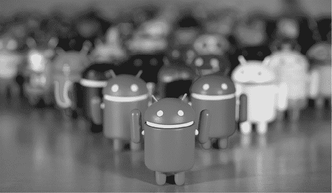

# 第五十一章：成功！我们还在这里！

> 我们达到了 20 亿活跃用户，我猜这算是一种“我们做到了”的表现。但天啊，竞争：它永无止境。它是无情的。我们每天都在竞争。
> 
> 就是感觉从来没有结束过。这就是我为什么还在这里的原因。
> 
> —广濑宏

这本书的最初目的是尝试回答这个问题：“为什么 Android 能够成功？”

但“成功”并不是最合适的词，甚至不是最准确的概念。在任何项目中，成功从来都不是保证的，无论在任何时刻看起来有多么光鲜亮丽。在科技领域尤其如此，因为硬件、软件、时尚、消费者兴趣，或者其他成千上万的因素的变化，都可能让一个看似成功的产品几乎在一夜之间陷入过时的深渊。这个领域的变化如此之快，以至于永远不会有“我们成功了！”的感觉，而是带着一点紧张的“我们还在这里！”，或者甚至带着怀疑的“我们还在这里？”同时回头看一看，看看谁在你背后，追赶得有多快。

对于 Android 来说，这个平台在过去几年里获得了足够的制造商、运营商、开发者和用户的支持，使其能够继续存在并不断改进。在高科技领域，这已经算是相当不错的成绩了。
