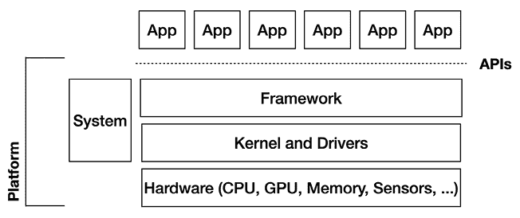

# 第五十二章：行话

这本书从来不是为那些喜欢所有技术细节的工程师而写的技术书籍。相反，它是一本面向所有对商业和技术的迅猛崛起，以及背后努力的人们感兴趣的读者的书。

但是，当这些人编写代码并创造出带来这些结果的高度技术性内容时，很难避免偶尔会陷入技术细节的困扰。所以，当我解释，比如 Ficus Kirkpatrick 喜欢在系统的低层工作，或者 Brian Swetland 曾在 Danger 和 Android 上工作过内核，或者 Be 和 PalmSource 的工程师们为软件开发者创造了一个平台和 API 时，使用一些术语是有必要的，尽管这些术语可能会让非工程师的听众感到困惑或迷失。

为了尽量减少技术性噪音，我把许多相关的解释压缩到了这个附录中。希望这一简短的部分能够帮助解释重要的术语，更重要的是，解释系统中不同部分之间是如何相互关联的。

## 首先，系统概述

在我的行业中，讨论平台软件时，通常会画出我们称之为“层状图”的白板图，这个图显示了系统中各个组件之间的关系。这个示意图通常展示了从硬件到各个组件的层级结构。在图的顶部，我们看到用户交互的部分，而在底部，我们看到直接与硬件通信的组件。中间的所有部分是由工程师编写的软件层，目的是将用户的高层操作（例如，点击按钮）传递到硬件（例如，显示按钮的按下状态、启动应用程序、启动核弹等）。

这是一个（非常简化的）Android 操作系统示意图：

这里其实并没有什么特别针对 Android 的内容；这是一种典型的操作系统视图。Android 显然有一些独特的元素，这些元素在其他地方有解释。但总体而言，Android 平台与大多数其他操作系统相似。

让我们从上到下看一下这个示意图，讨论这些部分是什么，它们如何协同工作。

### 应用

Android 上的*应用*是用户的主要入口点。用户从应用图标启动应用，点击按钮、列表以及应用中的其他组件，点击应用中的链接以启动其他应用，等等。这基本上是用户所处的世界，直接与应用进行交互，而所有平台功能的访问则是间接的，通过这些应用暴露的接口来实现。

请注意，系统提供的主屏幕、导航栏、状态栏和锁屏等功能都被视为应用程序。即使它们是由平台提供的（无论是 Android 本身，还是某些情况下由像三星这样的制造商提供的系统应用程序），它们仍然只是应用程序。

### API

*应用程序编程接口（APIs）*是平台中应用程序与之交互的功能模块。平台 API 是平台中公开的函数、变量及其他代码片段。例如，如果应用程序需要计算平方根，它们可能会调用平台提供的平方根 API 函数。或者，如果应用程序想要向用户显示一个按钮，它们可能会使用按钮 API 来处理按钮的功能和视觉效果。

API 是平台的冰山一角。虽然 Android 中有成千上万的 API，但它们其实只是平台功能的入口点，其中大多数功能嵌入在实现这些 API 的代码中。所以，举个例子，应用程序可能通过调用几个 API 函数来创建一个按钮，但在幕后，平台会做很多工作来处理按钮涉及的所有细节（包括如何显示按钮、如何处理点击事件以及如何绘制按钮的标签文本）。

### 框架

*框架*是处理所有通过公共 API 暴露功能的大层次系统软件。也就是说，框架既负责 API，也负责这些 API 的实现。在前面的示例中，这里就是按钮功能所在的地方，当然还有其他部分。框架涵盖了平台能够做的所有事情，比如位置服务、数据存储、电话服务、图形、用户界面，简而言之，几乎所有内容。Android 的 UI 工具包是框架功能的一个子集，专门针对用户界面 API 及其实现。

### 系统

上图中的系统部分表示正在运行的软件，它不能被应用程序直接访问，但它负责设备的整体功能。例如，在 Android 中，*窗口管理器*负责将应用程序显示在各自的窗口中，并在不同的应用程序启动时进行窗口切换。还有一个服务在运行，它通过杀死那些最近未被使用的应用程序来处理低内存情况，以便为最近使用的应用程序腾出所需的内存。所有这些操作间接地为用户执行。

系统调用公共 API 来实现各种必要的框架功能，但系统也可能直接调用框架中的函数（这就是为什么在图中它显示在 API 层旁边，而不是位于其上方）。

### 内核

*内核*，以及它的设备驱动程序，是运行在设备上的最低层软件。它处理设备的基本功能，是整个系统所需要的。例如，每个应用程序运行在一个 *进程* 中；管理设备上运行的多个进程（将它们相互隔离，并为它们分配 CPU 运行时间）是内核的职责。内核还负责加载和执行系统上的驱动程序。我们目前讨论的所有软件都适用于任何设备，但驱动程序是特定于某些硬件的。例如，要接收按钮上的点击，设备中的某个硬件能够将触摸屏上的触摸转换为触摸发生的位置信息。内核中的驱动程序完成这个工作，将硬件特定的数据转化为事件，然后将这些事件发送到框架中进行处理。同样，设备可能有用于存储、传感器、显示、相机等硬件的驱动程序。内核在设备启动时加载这些驱动程序，并在需要时通过驱动程序与硬件进行通信。

### 平台

最后，我使用 *平台* 这个术语来包含除应用程序外的所有内容。这是一个非常通用的术语，我广泛地用它来指代 Android 为应用开发者和用户提供的一切。Android 的平台软件包括所有为开发者编写应用程序提供功能的内容，以及设备所需的所有内容，用以展示基本的 UI 和功能。因此，当我谈论 Android 平台团队时，基本上指的是除了应用程序以外，负责上述所有内容的团队：包括负责内核、框架、系统软件和 API 的工程师。

## 其他技术术语

除了前面图表中便利地呈现的所有内容之外，书中还使用了一些其他技术术语，也值得解释。我相信我可能会遗漏一些。如果网络上有某种“搜索引擎”功能，读者可以轻松查找我不小心忘记提到的术语，那该多好啊……

### Changelist

*Changelist (CL)* 指的是修复 bug、实现新功能、更新文档等所需的代码更改。一个 CL 可以是简单的一行修复，也可以是数千行代码，来实现一大堆新的 API 和功能。同行开发者更喜欢前者，因为一行代码容易审查和批准。对于那些依赖团队审查 10,000 行 CL 的开发者来说，运气不佳，因为大家都忙于交付自己的修复和功能。

Changelist 显然是一个主要由 Google 工程团队使用的术语。其他软件系统使用类似 *补丁* 或 *PR*（拉取请求）这样的术语来表示相同的意思。

### 模拟器

*仿真器*是一个模拟硬件设备的软件程序。开发者使用仿真器（特别是 Android 仿真器）来简化在他们用于编写应用程序的主机计算机上运行和测试程序的过程。与每次重新编译程序时都需要将其下载到物理设备并可能面临延迟不同，开发者可以直接在强大的桌面计算机上运行虚拟设备。

*仿真器*和*模拟器*之间存在差异；仿真器实际上模拟了真实设备上发生的一切，包括 CPU 和其运行的指令。模拟器通常是一个更简单（且通常更快速）的程序，因为它并不模拟设备上的所有内容，而是仅仅模拟足够的部分，使其基本上像设备一样运行。模拟器足以测试程序的基本功能，但可能会忽略一些重要细节（如硬件传感器的工作方式），因此开发者最好使用仿真器或真实设备来验证实际功能。Android 在早期有一个模拟器，但最终停止了对其的维护，转而仅保留了仿真器。

### IDE

*IDE（集成开发环境）*是一套程序员用于编写、构建、运行、调试和测试应用程序的工具。这包括像文本编辑器这样的工具——通常了解程序员所使用的编程语言，并具备格式化和高亮显示该语言编写的代码的快捷方式，以及其他如代码补全和链接等功能——还有用于构建应用程序的编译器。例如，Android Studio（Android 团队为开发者提供的 IDE）包括一套庞大且不断增长的工具，其中包括各种编辑器（用于 Java、XML 和 C/C++），用于将代码构建为 Android 应用的编译器，一个用于在设备上逐步执行程序的调试器，以及其他分析性能、监控内存使用和构建 UI 资源的特定工具。

### Java ME/J2ME

Java ME（或在 Android 开发早期阶段的 J2ME，^(1)）是 Java 平台微型版（Java Platform, Micro Edition）的缩写，是早期移动设备的一个软件平台。Java ME 使用 Java 编程语言，并提供了应用程序开发者所需的功能，用于为这些设备编写应用。

J2ME 在移动领域承诺了开发者迫切需要的一项功能：一个通用平台，使他们能够为许多不同的设备编写应用程序，而不必为截然不同的硬件重新调整应用。

然而，与桌面或服务器版本的 Java 不同，Java ME 有多种版本，称为*配置文件*，这意味着任何特定实现的 Java ME 在设备上的功能未必与另一设备相同，因此 Java ME 开发者最终仍需处理设备多样性的问题。

### OEM

*OEM（原始设备制造商）*是指制造实际硬件的公司。

### 面向对象编程：类、字段和方法

用于编写 Android 平台和 Android 应用程序的软件，采用了名为*面向对象编程（OOP）*的方法。大多数流行的现代语言也使用类似的方法，包括 Java、C++、Kotlin 等。在 OOP 系统中，有一些称为*类*的功能模块，提供一套特定功能的 API。例如，Android 有一个 `String` 类，用于执行文本字符串的操作。

每个类可能包含一组*字段*或*属性*，用于保存值。例如，`String` 对象可能保存一个文本字符串的值，例如 `"I want a sandwich."`

每个类还可能包含一组*方法*或*函数*，对该类（以及可能对其他类）执行操作。例如，Android 的 `String` 类有一个名为 `toUpperCase()` 的方法，正如其名称所示，它将返回一个大写字母的字符串。所以，之前的三明治字符串，如果调用 `toUpperCase()`，将返回值 `"I WANT A SANDWICH."`

类及其各种方法和字段可以捆绑在一起创建一个*库*。该库中的类、字段和方法代表该库的 API，应用程序（或其他库）可以从它们的代码中调用这些 API，执行库所提供的操作。

### SDK

一个*SDK（软件开发工具包）*包含了程序员编写特定平台程序所需的组件。它包括程序员可以调用的平台功能的 API 以及实现这些 API 的库。通过使用 SDK，程序员可以编写应用程序。然后使用工具（通常随 SDK 一起提供），他们可以构建应用程序（将其编译成设备可理解的格式）。最后，他们可以在与编译后应用程序兼容的设备（或模拟器）上运行和调试程序。

### 工具包

*工具包*在含义和使用上与框架、库和 API 有重叠。通常，工具包指的是专门用于用户界面（UI）组件的框架。在 Android 中，工具包与*UI 工具包*同义，指的是 Android 用户界面技术的 API 和实现。它被视为整体 Android 框架的一部分，特别是该框架中处理大部分视觉方面的子集。

### 视图

所有 UI 平台都有某种 UI 元素的概念，比如按钮、复选框、滑块、文本或包含所有这些对象的容器。但是，它们对这些元素的称呼在不同平台之间有所不同，因此很难判断开发者在谈论哪个平台，因为他们使用了不同的术语。Java 的 Swing 工具包称这些为*组件*，一些平台称其为*元素*或*小部件*。在 Android 中，UI 元素被称为*视图*（Views），这一名称来源于所有这些元素继承自的类（View）。视图的容器（包括其他容器）被称为 ViewGroup。最后，*视图层次结构*，如其名称所示，是指视图和 ViewGroup 的层次结构，从顶级父视图 ViewGroup 开始，包含它的子视图，再到其中包含的任何 ViewGroup 及其子视图，依此类推。
