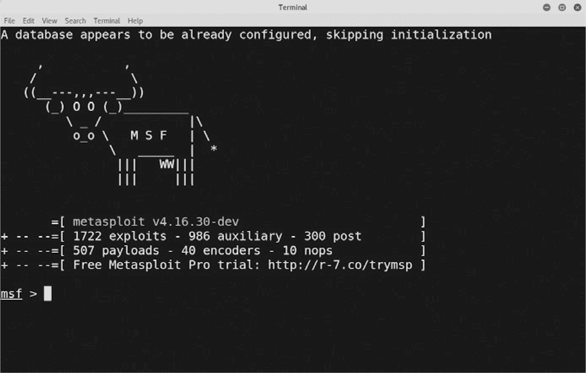

# 第一章：**让我们黑客攻击一个网站**

本书将教你作为一个有效的网页开发者所需要的基本安全知识。在开始之前，一个有用的练习是看看你将如何攻击一个网站。让我们站在对手的角度，看看我们面对的是什么。 本章将展示黑客是如何操作的，以及开始黑客攻击有多么容易。

### 软件漏洞和暗网

黑客利用软件中的安全漏洞，比如网站。在黑客社区中，用来展示如何利用安全漏洞的代码称为*exploit*（漏洞利用代码）。一些黑客——也就是所谓的*白帽黑客*——会为了乐趣而发现安全漏洞，并且会在公开漏洞之前通知软件厂商和网站所有者。这样的黑客通常会因为发现漏洞而获得经济奖励。

负责任的软件厂商会尽快发布补丁来修复*零日漏洞*（那些被公开不足一天或根本没有公开的漏洞）。然而，即使软件厂商发布了修复漏洞的补丁，许多使用该漏洞的软体实例仍会在一段时间内没有得到修复。

那些伦理观念较弱的黑客——*黑帽黑客*——会囤积漏洞利用代码，最大化他们能利用漏洞的时间，或者甚至将漏洞利用代码在黑市上以比特币出售。在今天的互联网环境中，漏洞利用代码迅速被武器化，并融入到黑客社区广泛使用的命令行工具中。

对于使用这些漏洞利用工具的黑帽黑客来说，存在强大的经济激励。针对被盗信用卡信息、被黑用户账户以及零日漏洞的黑市在*暗网*上存在，暗网是通过特殊的网络节点来匿名化 IP 地址的网络。像图 1-1 中展示的这种暗网站点，进行着盗取信息和侵入服务器的生意。

*图 1-1：你好，是的，我想购买一些被盗的信用卡号码，因为你显然是一个高级的俄罗斯黑客，而不是在暗网进行卧底行动的 FBI 特工。*

可以利用最新漏洞的黑客工具是免费的，并且很容易设置。你甚至不需要访问暗网，因为你需要的一切只需要通过快速的 Google 搜索就能找到。让我们看看如何做。

### 如何黑客攻击一个网站

开始进行黑客攻击非常简单。下面是如何做的：

1.  在 Google 上搜索**kali linux 下载**。*Kali Linux*是一个专门为黑客打造的 Linux 操作系统版本。它预装了 600 多种安全和黑客工具。它完全免费，由 Offensive Security 的一个小团队维护，致力于专业的安全研究。

1.  在您的计算机上安装一个虚拟容器。*虚拟容器*是主机环境，允许您在计算机上安装其他操作系统，而不会覆盖当前的操作系统。Oracle 的 VirtualBox 可以免费使用，并且可以在 Windows、macOS 或 Linux 上安装。这应该能让您在计算机上运行 Kali Linux，而无需太多配置。

1.  在容器中安装 Kali Linux。下载并双击安装程序以开始安装。

1.  启动 Kali Linux 并打开 Metasploit 框架。*Metasploit*，如图 1-2 所示，是最流行的命令行工具，用于测试网站的安全性并检查漏洞。

    

    *图 1-2：黑客攻击只有在足够的 ASCII 艺术奶牛帮助下才能实现。*

1.  在 Metasploit 命令行上运行 `wmap` 工具，扫描目标网站并查看您能找到哪些漏洞。输出应该类似于图 1-3 所示。`wmap` 工具将扫描一系列 URL，测试 Web 服务器是否存在安全漏洞。确保您只在自己拥有的网站上运行此工具！

    

    *图 1-3：黑客攻击已启动——预计不久后会收到执法部门的拜访。*

1.  从 Metasploit 数据库中选择一个漏洞利用程序，允许您利用该漏洞。

到此为止，我们将停止黑客教程，因为下一步可能构成犯罪。然而，主要的观点应该很明显：启动黑客攻击网站真的很容易！Metasploit 和 Kali Linux 被现实中的黑客使用，可以在几分钟内设置完成。它们不需要任何特别的专业知识，但在识别和利用网站漏洞方面异常出色。

这就是我们今天作为 Web 开发人员所面对的现实。我们构建的网站对任何拥有互联网连接的人都可用，而用于攻击它们的黑客工具也是如此。不过，不用惊慌！到书的最后，您将（希望）对安全性了解得像黑客一样多，并为他们攻击您的网站做好充分准备。那么，让我们开始讨论互联网协议套件的构建模块吧。
