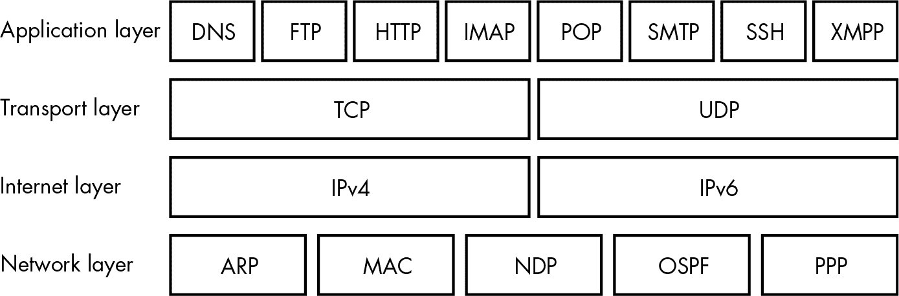

## **2**

**互联网如何工作**


要成为网络安全专家，你需要扎实掌握互联网基础的网络技术和协议。本章将探讨互联网协议套件，它规定了计算机如何在网络上交换数据。你还将了解有状态连接和加密，这些都是现代网络的关键元素。我将重点指出安全漏洞可能出现的地方。

### **互联网协议套件**

在互联网早期，数据交换并不可靠。首条通过*高级研究计划局网络（ARPANET）*发送的消息是一个`LOGIN`命令，目标是斯坦福大学的远程计算机。网络发送了前两个字母`LO`，然后崩溃了。这对美国军方来说是个问题，因为他们希望找到一种方式将远程计算机连接起来，以便即使苏联的核打击使网络的各个部分下线，也能继续交换信息。

为了解决这个问题，网络工程师开发了*传输控制协议（TCP）*，以确保计算机之间的信息可靠交换。TCP 是约 20 种网络协议中的一种，这些协议共同构成了*互联网协议套件*。当计算机通过 TCP 向另一台计算机发送消息时，消息会被拆分成数据包，并带有目标地址，朝着最终的目的地发送。组成互联网的计算机将每个数据包推向目标，而无需处理整个消息。

一旦接收计算机收到数据包，它会根据每个数据包上的*序列号*将它们重新组装成可用的顺序。每次接收方收到一个数据包时，它都会发送确认。如果接收方未能确认收到某个数据包，发送方会重新发送该数据包，可能通过不同的网络路径。在这种方式下，TCP 使计算机能够在预期不可靠的网络中传输数据。

随着互联网的发展，TCP 经历了显著的改进。现在，数据包会带有*校验和*，使接收方能够检测数据损坏并判断是否需要重新发送数据包。发送方还会根据数据的消费速度预先调整发送速率。（互联网服务器通常比接收消息的客户端强大得多，因此它们需要小心不要超负荷客户端的处理能力。）

**注意**

*TCP 由于其交付保障仍然是最常用的协议，但如今，互联网还使用了其他几种协议。比如*用户数据报协议 (UDP)* 是一种更新的协议，故意允许丢失数据包，以便可以保持数据以恒定速率流传。UDP 通常用于直播视频流，因为用户更愿意接受几帧丢失，而不是在网络拥堵时视频延迟。*

#### ***互联网协议地址***

互联网中的数据包会被发送到*互联网协议 (IP) 地址*，这些地址分配给每一台联网的计算机。每个 IP 地址必须是唯一的，因此新的 IP 地址会以结构化的方式发布。

在最高层级，*互联网名称与数字地址分配机构 (ICANN)* 将 IP 地址块分配给区域性管理机构。这些区域性管理机构再将地址块分配给其区域内的*互联网服务提供商 (ISP)* 和托管公司。当你连接到互联网时，ISP 会为你的计算机分配一个固定几个月的 IP 地址。（ISP 通常会定期轮换客户端的 IP 地址。）同样，托管互联网内容的公司会为它们连接到网络的每个服务器分配一个 IP 地址。

IP 地址是二进制数字，通常采用*IP 版本 4 (IPv4)* 语法表示，允许 2³²（4,294,967,296）个地址。例如，Google 的域名服务器的地址是 `8.8.8.8`。由于 IPv4 地址的使用速度不可持续，互联网正在转向*IP 版本 6 (IPv6)* 地址，以支持更多连接的设备，IPv6 地址由八组四个十六进制数字组成，用冒号分隔（例如：`2001:0db8:0000:0042:0000:8a2e:0370:7334`）。

#### ***域名系统***

浏览器和其他联网软件能够识别并将流量路由到 IP 地址，但 IP 地址对人类来说并不容易记住。为了让网站地址对用户更友好，我们使用一个全球目录——*域名系统 (DNS)*，将人类可读的*域名*（例如 *[example.com](http://example.com)*) 翻译为 IP 地址，如 `93.184.216.119`。域名只是 IP 地址的占位符。域名和 IP 地址一样是唯一的，在使用之前必须通过叫做*域名注册商*的私人机构进行注册。

当浏览器第一次遇到一个域名时，它们会使用本地*域名服务器*（通常由 ISP 托管）进行查询，然后将结果缓存，以防止未来进行耗时的查询。这种缓存行为意味着新域名或现有域名的更改需要一段时间才能在互联网上传播。具体传播时间由*生存时间（TTL）*变量控制，该变量设置在 DNS 记录上并指示 DNS 缓存何时过期。DNS 缓存使得一种名为*DNS 劫持*的攻击成为可能，即本地 DNS 缓存被故意破坏，导致数据被路由到攻击者控制的服务器。

除了为特定域名返回 IP 地址外，域名服务器还托管可以通过*规范名称（CNAME）记录*描述域别名的记录，从而允许多个域名指向同一个 IP 地址。DNS 还可以通过使用*邮件交换（MX）*记录帮助路由电子邮件。我们将在第十六章中探讨 DNS 记录如何帮助应对垃圾邮件（spam）。

### **应用层协议**

TCP 允许两台计算机在互联网上可靠地交换数据，但它并没有规定发送的数据应该如何解释。为了实现这一点，双方计算机需要通过协议套件中的另一个更高层的协议达成一致来交换信息。建立在 TCP（或 UDP）之上的协议被称为*应用层协议*。图 2-1 展示了应用层协议如何位于 TCP 之上，构成互联网协议套件的一部分。

互联网协议套件的低层协议提供网络上的基本数据路由，而应用层的高层协议为应用程序交换数据提供了更多的结构。许多类型的应用程序在互联网上使用 TCP 作为传输机制。例如，电子邮件通过简单邮件传输协议（SMTP）发送，即时通讯软件通常使用可扩展消息与状态协议（XMPP），文件服务器通过文件传输协议（FTP）提供下载，网页服务器则使用超文本传输协议（HTTP）。由于我们主要关注的是 Web，接下来我们将更详细地了解 HTTP。



*图 2-1：构成互联网协议套件的各个层次*

#### ***超文本传输协议***

Web 服务器使用 *超文本传输协议（HTTP）* 将网页及其资源传输到 *用户代理*，例如 web 浏览器。在 HTTP 会话中，用户代理会生成特定资源的 *请求*。Web 服务器在接收到这些请求后，会返回 *响应*，其中包含请求的资源，或者如果请求无法完成，则返回错误代码。HTTP 请求和响应都是纯文本消息，尽管它们通常以压缩和加密的形式发送。本书中描述的所有攻击方法都以某种方式使用 HTTP，因此了解构成 HTTP 会话的请求和响应的工作原理是很有价值的。

##### **HTTP 请求**

浏览器发送的 HTTP 请求包含以下元素：

**方法** 也叫做 *动词*，用于描述用户代理希望服务器执行的操作。

**统一资源定位符（URL）** 这描述了被操作或获取的资源。

**头部** 这些提供了元数据，如用户代理期望的内容类型或是否接受压缩响应。

**主体** 这个可选组件包含任何需要发送到服务器的额外数据。

清单 2-1 显示了一个 HTTP 请求。

```
   GET❶ http://example.com/❷
❸ User-Agent: Mozilla/5.0 (Macintosh; Intel Mac OS X 10_13_6)
   AppleWebKit/537.36 (KHTML, like Gecko) Chrome/67.0.3396.99 Safari/537.36
❹ Accept: text/html,application/xhtml+xml,application/xml; */*
   Accept-Encoding: gzip, deflate
   Accept-Language: en-GB,en-US;q=0.9,en;q=0.8
```

*清单 2-1：一个简单的 HTTP 请求*

方法 ❶ 和 URL ❷ 出现在第一行。接下来是 HTTP 头，它们分别出现在不同的行。`User-Agent` 头 ❸ 告诉网站发出请求的浏览器类型。`Accept` 头 ❹ 告诉网站浏览器期望的内容类型。

使用 `GET` 方法的请求——简称为 `GET` 请求——是互联网上最常见的请求类型。`GET` 请求会获取 web 服务器上的特定资源，该资源通过特定的 URL 进行标识。`GET` 请求的响应会包含一个资源：可能是一个网页、一张图片，甚至是搜索请求的结果。清单 2-1 中的示例请求表示尝试加载 *[example.com](http://example.com)* 的首页，并且当用户在浏览器的导航栏中输入 *[example.com](http://example.com)* 时会生成该请求。

如果浏览器需要向服务器发送信息，而不仅仅是获取数据，它通常会使用 `POST` 请求。当你在网页上填写表单并提交时，浏览器会发送一个 `POST` 请求。因为 `POST` 请求包含发送到服务器的信息，浏览器会将这些信息放在 *请求体* 中，在 HTTP 头之后发送。

在 第八章 中，你将看到为什么在向服务器发送数据时，使用 `POST` 而不是 `GET` 请求很重要。错误地使用 `GET` 请求来执行除获取资源外的其他操作的站点容易受到跨站请求伪造攻击。

在编写网站时，你还可能遇到 `PUT`、`PATCH` 和 `DELETE` 请求。这些请求分别用于上传、编辑或删除服务器上的资源，通常由嵌入在网页中的 JavaScript 触发。表 2-1 记录了其他一些值得了解的方法。

**表 2-1：** 较少为人知的 HTTP 方法

| **HTTP 方法** | **功能和实现** |
| --- | --- |
| `HEAD` | `HEAD` 请求检索与 `GET` 请求相同的信息，但指示服务器返回没有主体的响应（换句话说，就是没有有效的部分）。如果你在 web 服务器上实现了 `GET` 方法，服务器通常会自动响应 `HEAD` 请求。 |
| `CONNECT` | `CONNECT` 启动双向通信。如果你需要通过代理连接，您将在 HTTP 客户端代码中使用它。 |
| `OPTIONS` | 发送 `OPTIONS` 请求允许用户代理询问某个资源支持哪些其他方法。你的 web 服务器通常会根据你实现的其他方法自动响应 `OPTIONS` 请求。 |
| `TRACE` | 对 `TRACE` 请求的响应将包含原始 HTTP 请求的精确副本，这样客户端就可以看到是否有中间服务器进行了修改。听起来很有用，但通常建议你在 web 服务器中禁用 `TRACE` 请求，因为它们可能成为安全漏洞。例如，它们可能允许注入到页面中的恶意 JavaScript 访问故意对 JavaScript 隐藏的 cookies。 |

一旦 web 服务器收到 HTTP 请求，它会用 HTTP 响应回复用户代理。我们来解析一下响应的结构。

##### **HTTP 响应**

由 web 服务器返回的 HTTP 响应以协议描述、三位数的 *状态码* 开头，通常还包括 *状态信息*，表示请求是否能够被完成。响应还包含头部，提供指示浏览器如何处理内容的元数据。最后，大多数响应包含一个主体，其中包含所请求的资源。清单 2-2 显示了一个简单的 HTTP 响应的内容。

```
   HTTP/1.1❶ 200❷ OK❸
❹ Content-Encoding: gzip
   Accept-Ranges: bytes
   Cache-Control: max-age=604800
   Content-Type: text/html
   Content-Length: 606

❺ <!doctype html>
   <html>
      <head>
         <title>Example Domain</title>
     ❻ <style type="text/css">
            body {
               background-color: #f0f0f2;
               font-family: "Open Sans", "Helvetica Neue", Helvetica, sans-serif;
            }
            div {
               width: 600px;
               padding: 50px;
               background-color: #fff;
               border-radius: 1em;
            }
         </style>
      </head>
  ❼ <body>
         <div>
            <h1>Example Domain</h1>
            <p>This domain is established to be used for illustrative examples.</p>
            <p>
              <a href="http://www.iana.org/domains/example">More information...</a>
            </p>
         </div>
      </body>
   </html>
```

*清单 2-2：来自* [example.com](http://example.com) 的 HTTP 响应，*世界上最无聊的网站*

响应以协议描述 ❶、状态码 ❷ 和状态信息 ❸ 开头。状态码格式为 `2xx` 表示请求被理解、接受并已回应。格式为 `3xx` 的代码会将客户端重定向到不同的 URL。格式为 `4xx` 的代码表示客户端错误：浏览器生成了一个看似无效的请求。（这种错误最常见的是 `HTTP 404 Not Found`）。格式为 `5xx` 的代码表示服务器错误：请求是有效的，但服务器无法完成请求。

接下来是 HTTP 头部 ❹。几乎所有 HTTP 响应都包括一个 `Content-Type` 头部，表示返回的数据类型。响应 `GET` 请求时，通常还会包含一个 `Cache-Control` 头部，指示客户端应当将大资源（例如图像）本地缓存。

如果 HTTP 响应成功，正文将包含客户端试图访问的资源——通常是*超文本标记语言（HTML）* ❺，描述了请求的网页的结构。在这种情况下，响应包含了样式信息 ❻ 以及页面内容本身 ❼。其他类型的响应可能返回 JavaScript 代码、用于样式化 HTML 的层叠样式表（CSS）或正文中的二进制数据。

### **有状态连接**

Web 服务器通常同时处理多个用户代理，但 HTTP 本身并没有区分哪些请求来自哪个用户代理。在互联网的早期，这并不是一个重要的考虑因素，因为网页大多是只读的。然而，现代网站通常允许用户登录，并会跟踪他们在访问和与不同页面互动时的活动。为了实现这一点，HTTP 会话需要变得有状态。当客户端和服务器之间的连接或会话是*有状态*的，它们会进行“握手”，并继续交换数据包，直到其中一方决定终止连接。

当一个 Web 服务器想要跟踪它响应的用户，并从而实现有状态的 HTTP 会话时，它需要建立一种机制来跟踪用户代理在后续请求中的活动。特定用户代理与 Web 服务器之间的整个对话称为*HTTP 会话*。最常见的跟踪会话的方式是，服务器在初始 HTTP 响应中返回一个 `Set-Cookie` 头部。这要求接收响应的用户代理存储一个*cookie*，它是与该特定 Web 域相关的小段文本数据。然后，用户代理会在任何后续 HTTP 请求的 `Cookie` 头部中返回相同的数据给 Web 服务器。如果实现正确，往返传递的 cookie 内容唯一标识了用户代理，从而建立了 HTTP 会话。

存储在 cookies 中的会话信息是黑客的一个美味目标。如果攻击者窃取了另一个用户的 cookie，他们就可以冒充该用户在网站上活动。同样，如果攻击者成功说服网站接受伪造的 cookie，他们就能冒充任何他们想要的用户。在第十章中，我们将探讨窃取和伪造 cookie 的各种方法。

### **加密**

当互联网最初发明时，HTTP 请求和响应是以明文形式发送的，这意味着任何拦截数据包的人都可以读取它们；这种拦截方式被称为*中间人攻击*。由于现代网络中私人通信和在线交易变得普遍，网页服务器和浏览器通过使用*加密*来保护用户免受此类攻击，方法是通过传输过程中对消息内容进行编码，以防止被窥探者读取。

为了确保通信安全，网页服务器和浏览器使用*传输层安全（TLS）*来发送请求和响应，这是一种提供隐私和数据完整性的加密方法。TLS 确保被第三方拦截的数据包在没有适当加密密钥的情况下无法解密。它还确保任何篡改数据包的尝试都可以被检测到，从而保证数据完整性。

使用 TLS 进行的 HTTP 对话被称为*HTTP 安全（HTTPS）*。HTTPS 要求客户端和服务器执行*TLS 握手*，在此过程中双方就加密方法（即密码算法）达成一致并交换加密密钥。一旦握手完成，任何进一步的消息（包括请求和响应）都将对外界不可见。

加密是一个复杂的话题，但对于保护你的网站至关重要。我们将在第十三章中讨论如何为你的网站启用加密。

### **总结**

在本章中，你了解了互联网的基础架构。TCP 使得具有 IP 地址的互联网连接计算机之间可以可靠地进行通信。域名系统为 IP 地址提供了人类可读的别名。HTTP 建立在 TCP 之上，从用户代理（如网页浏览器）向网页服务器发送 HTTP 请求，网页服务器再回复 HTTP 响应。每个请求都发送到特定的 URL，并且你学习了各种类型的 HTTP 方法。网页服务器通过状态码回应，并发送回 cookies 以建立有状态连接。最后，*加密*（以 HTTPS 的形式）可用于保护用户代理和网页服务器之间的通信安全。

在下一章，你将了解当网页浏览器接收到 HTTP 响应时会发生什么——网页是如何呈现的，以及用户的操作如何生成更多的 HTTP 请求。
