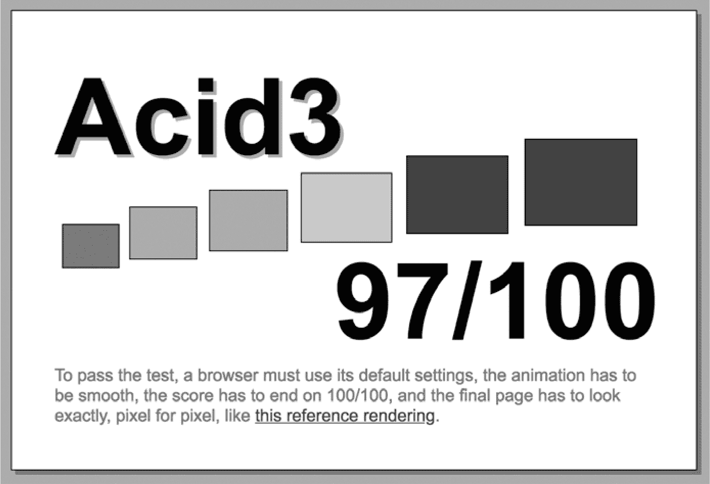

## **3**

**浏览器是如何工作的**

大多数互联网用户通过浏览器与网站进行互动。要构建安全的网站，你需要理解浏览器如何将用来描述网页的超文本标记语言（HTML）转换为你在屏幕上看到的互动式视觉表现。本章将介绍现代浏览器如何渲染网页，并重点讲解它为保护用户所采取的安全措施——*浏览器安全模型*。我们还将探讨黑客试图突破这些安全措施的各种方式。

### **网页渲染**

浏览器内负责将网页 HTML 转换为你在屏幕上看到的视觉表示的组件被称为*渲染管道*。渲染管道负责解析页面的 HTML，理解文档的结构和内容，并将其转换为操作系统可以理解的一系列绘制操作。

在互联网早期，网站的这一过程相对简单。网页的 HTML 包含的样式信息很少（如颜色、字体和字体大小），因此渲染大多是加载文本和图片，并按 HTML 文档中的顺序将它们绘制到屏幕上。HTML 被视为一种*标记语言*，意味着它通过将网页分解为语义元素并注释信息结构的方式来描述网页。早期的网络看起来比较粗糙，但对于传递文本内容来说非常高效。

如今，网页设计更为精致，视觉效果也更具吸引力。网页开发者将样式信息编码到单独的*Cascading Style Sheets (CSS)* 文件中，指示浏览器如何精确地显示每个页面元素。像谷歌 Chrome 这样的现代化超优化浏览器，包含数百万行代码，能够以快速、统一的方式正确解析和渲染 HTML，并处理冲突的样式规则。了解渲染管道的各个阶段将有助于你理解这一复杂性。

#### ***渲染管道概览***

我们稍后会详细介绍渲染管道的每个阶段，但首先让我们来看一下高层次的过程。

当浏览器收到 HTTP 响应时，它会将响应体中的 HTML 解析为*文档对象模型（DOM）*：一种内存中的数据结构，表示浏览器对页面结构的理解。在解析 HTML 和将其绘制到屏幕上之间，生成 DOM 是一个过渡步骤。在现代 HTML 中，页面的布局无法确定，直到整个 HTML 被解析完毕，因为 HTML 标签的顺序并不一定决定其内容的位置。

一旦浏览器生成了 DOM，但在任何内容显示到屏幕上之前，必须先对每个 DOM 元素应用样式规则。这些样式规则声明了每个页面元素的显示方式——前景色和背景色、字体样式和大小、位置和对齐方式等。最后，在浏览器完成页面结构并确定如何应用样式信息后，它会将网页绘制到屏幕上。所有这些都发生在一瞬间，并且随着用户与页面的交互不断重复。

浏览器在构建 DOM 时还会加载并执行它遇到的任何 JavaScript 代码。JavaScript 代码可以动态地修改 DOM 和样式规则，无论是在页面渲染之前还是响应用户的操作。

现在让我们更详细地看一下每个步骤。

#### ***文档对象模型***

当浏览器首次接收到包含 HTML 的 HTTP 响应时，它会将 HTML 文档解析成 DOM，一个描述 HTML 文档为一系列嵌套元素的数据结构，这些元素被称为*DOM 节点*。DOM 中的某些节点对应于需要在屏幕上渲染的元素，如输入框和段落文本；其他节点，如脚本和样式元素，控制页面的行为和布局。

每个 DOM 节点大致相当于原始 HTML 文档中的一个标签。DOM 节点可以包含文本内容，或者包含其他 DOM 节点，类似于 HTML 标签可以嵌套在一起的方式。由于每个节点可以以分支的方式包含其他节点，网页开发者称之为*DOM 树*。

一些 HTML 标签，如 `<script>`、`<style>`、`<image>`、`` 和 `<video>` 标签，可以在属性中引用外部 URL。当这些标签被解析到 DOM 中时，它们会导致浏览器导入外部资源，这意味着浏览器必须发起进一步的 HTTP 请求。现代浏览器会并行执行这些请求与页面渲染，以加快页面加载时间。

从 HTML 构建 DOM 的设计目标是尽可能强大。浏览器对于格式错误的 HTML 是宽容的；它们会自动关闭未闭合的标签，插入缺失的标签，并根据需要忽略损坏的标签。浏览器厂商不会因为网站的错误而惩罚网页用户。

#### ***样式信息***

一旦浏览器构建了 DOM 树，它需要确定哪些 DOM 节点对应于屏幕上的元素，如何布局这些元素以及应该应用哪些样式信息。虽然这些样式规则可以在 HTML 文档中内联定义，但网页开发者更喜欢将样式信息编码到单独的 CSS 文件中。将样式信息与 HTML 内容分离使得重新样式化现有内容更加容易，并且保持 HTML 内容尽可能干净和语义化。它还使得 HTML 对于屏幕阅读器等替代浏览技术更容易解析。

在使用 CSS 时，网页开发者会创建一个或多个*样式表*来声明页面元素的渲染方式。HTML 文档会通过使用`<style>`标签来导入这些样式表，该标签引用了托管样式表的外部 URL。每个样式表包含*选择器*，它们会挑选出 HTML 文档中的标签，并为每个标签分配样式信息，如字体大小、颜色和位置等。选择器可能很简单：例如，它可能会说明`<h1>`标签中的标题文本应以蓝色显示。对于更复杂的网页，选择器会变得更加复杂：一个选择器可能会描述当用户将鼠标移到超链接上时，超链接的颜色变化速度。

渲染管道实施了很多逻辑来解读最终的样式，因为关于如何应用样式需要遵循严格的优先级规则。每个选择器可以应用于多个页面元素，而且每个页面元素通常会有多个选择器提供的样式信息。早期互联网的一大难题是如何创建一个在不同类型的浏览器中渲染时看起来相同的网站。现代浏览器通常在渲染网页时保持一致性，但它们之间仍然存在差异。行业对网页标准合规性的基准是 Acid3 测试，如图 3-1 所示。只有少数浏览器能获得 100 分。你可以访问*[`acid3.acidtests.org/`](http://acid3.acidtests.org/)*来体验 Acid3 测试。

*图 3-1：Acid3，自 2008 年以来确保浏览器能够正确渲染彩色矩形*

DOM 树的构建和样式规则的应用与网页中包含的 JavaScript 代码的处理是并行进行的。这个 JavaScript 代码可以在页面渲染之前改变页面的结构和布局，所以让我们快速了解一下 JavaScript 执行是如何与渲染管道交织在一起的。

### **JavaScript**

现代网页使用 JavaScript 来响应用户的操作。*JavaScript*是一种完整的编程语言，当网页渲染时，它会由浏览器的 JavaScript 引擎执行。JavaScript 可以通过使用`<script>`标签嵌入到 HTML 文档中；代码可以直接嵌入到 HTML 文档内，或者更常见的是，`<script>`标签引用一个从外部 URL 加载的 JavaScript 文件。

默认情况下，任何 JavaScript 代码都会在相关的`<script>`标签解析为 DOM 节点后立即由浏览器执行。对于从外部 URL 加载的 JavaScript 代码，这意味着代码一旦加载就会立即执行。

如果渲染管道尚未完成解析 HTML 文档，这种默认行为会引发问题；JavaScript 代码将尝试与可能尚未存在于 DOM 中的页面元素进行交互。为了避免这种情况，`<script>` 标签通常会标记 `defer` 属性。这会导致 JavaScript 仅在整个 DOM 构建完成后才执行。

正如你所想象的那样，浏览器会急切地执行它遇到的任何 JavaScript 代码，这带来了安全隐患。黑客的最终目标通常是在另一台用户的机器上远程执行代码，而互联网使这一目标变得更容易，因为很少有计算机不是以某种方式连接到网络。因此，现代浏览器通过*浏览器安全模型*严格限制 JavaScript。这一模型规定，JavaScript 代码必须在一个*沙箱*中执行，在这里，它*不能*执行以下任何操作：

+   启动新进程或访问其他现有进程。

+   读取任意的系统内存块。作为一个*托管内存语言*，JavaScript 无法读取其沙箱之外的内存。

+   访问本地磁盘。现代浏览器允许网站在本地存储少量数据，但这种存储被从文件系统本身进行了抽象。

+   访问操作系统的网络层。

+   调用操作系统功能。

在浏览器沙箱中执行的 JavaScript *被允许*执行以下操作：

+   读取和操作当前网页的 DOM。

+   通过注册事件监听器，监听并响应当前页面上用户的操作。

+   代表用户发起 HTTP 请求。

+   打开新的网页或刷新当前页面的 URL，但仅能响应用户的操作。

+   向浏览器历史记录中写入新条目，并在历史记录中向前和向后导航。

+   请求用户的位置信息。例如，“Google Maps 想要使用您的位置。”

+   请求发送桌面通知的权限。

即使有这些限制，攻击者仍然可以通过将恶意 JavaScript 注入到你的网页中，利用跨站脚本攻击来读取用户输入的信用卡信息或凭证。即使是少量注入的 JavaScript 代码也构成威胁，因为注入的代码可以在 DOM 中添加 `<script>` 标签来加载恶意有效载荷。我们将在第七章中讨论如何防范这种类型的跨站脚本攻击。

### **渲染前后：浏览器所做的一切**

浏览器不仅仅是一个渲染管线和 JavaScript 引擎。除了渲染 HTML 和执行 JavaScript，现代浏览器还包含了处理其他多项任务的逻辑。浏览器与操作系统连接以解析和缓存 DNS 地址，解释和验证安全证书，如果需要，使用 HTTPS 编码请求，并根据 Web 服务器的指示存储和传输 cookie。为了理解这些责任是如何协调工作的，我们来看看用户登录 Amazon 的幕后过程：

1.  用户在他们喜欢的浏览器中访问*[www.amazon.com](http://www.amazon.com)*。

1.  浏览器尝试将域名(*[amazon.com](http://amazon.com)*)解析为 IP 地址。首先，浏览器查询操作系统的 DNS 缓存。如果没有结果，它会请求互联网服务提供商（ISP）查看提供商的 DNS 缓存。如果 ISP 中的任何人之前没有访问过 Amazon 网站，ISP 将通过权威 DNS 服务器来解析该域名。

1.  现在浏览器已经解析了 IP 地址，尝试与对应 IP 地址的服务器发起 TCP 握手，以建立安全连接。

1.  一旦 TCP 会话建立，浏览器会构建一个 HTTP `GET`请求发送到*[www.amazon.com](http://www.amazon.com)*。TCP 将 HTTP 请求拆分为数据包并将其发送到服务器进行重组。

1.  在此时，HTTP 会话升级为 HTTPS 以确保安全通信。浏览器和服务器进行 TLS 握手，商定加密算法，并交换加密密钥。

1.  服务器通过安全通道返回包含 Amazon 首页 HTML 的 HTTP 响应。浏览器解析并显示该页面，通常会触发多个其他 HTTP `GET`请求。

1.  用户进入登录页面，输入登录凭证并提交登录表单，生成一个`POST`请求发送到服务器。

1.  服务器验证登录凭证并通过返回`Set-Cookie`头部信息来建立会话。浏览器将这个 cookie 存储在规定的时间内，并在后续请求中发送给 Amazon。

所有这些完成后，用户可以访问他们的 Amazon 账户。

### **总结**

本章回顾了浏览器如何将用来描述网页的 HTML 转换为你在屏幕上看到的互动、视觉化展示。浏览器的渲染管线将 HTML 文档解析为文档对象模型（DOM），应用来自层叠样式表（CSS）文件的样式信息，然后在屏幕上布局 DOM 节点。

你还了解了浏览器安全模型。浏览器在严格的安全规则下执行`<script>`标签中的 JavaScript。你还回顾了一个简单的 HTTP 对话，展示了浏览器在呈现页面之外的许多其他职责：从 TCP 数据包重建 HTTP、验证安全证书并使用 HTTPS 确保通信安全，以及存储和传输 Cookies。

在下一章，你将了解 HTTP 对话的另一端：Web 服务器。
