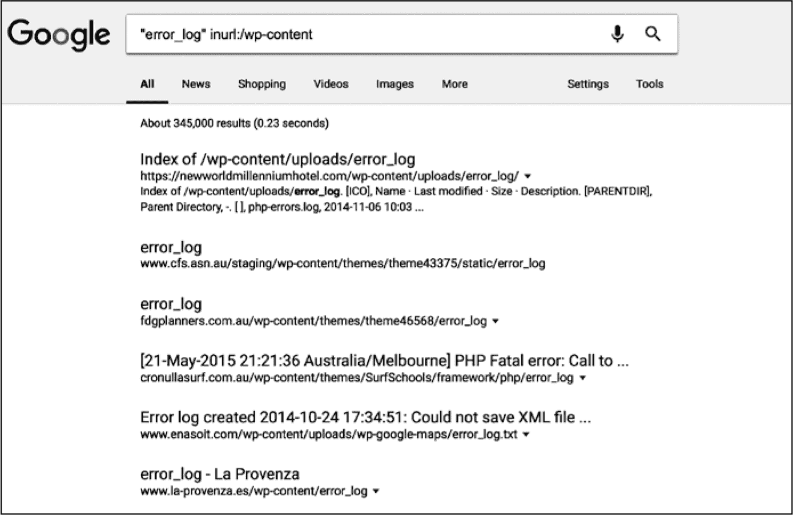

# 第四章：**Web 服务器的工作原理**

在上一章中，你了解了浏览器如何通过互联网进行通信，并渲染组成网站的 HTML 页面和其他资源。在这一章中，你将学习 Web 服务器如何构建这些 HTML 页面。

从最简单的定义来看，*Web 服务器* 是一个计算机程序，它在响应 HTTP 请求时返回 HTML 页面。然而，现代 Web 服务器所包含的功能远远超出了这一点。当浏览器发出 HTTP 请求时，现代 Web 服务器允许执行代码以动态生成网页的 HTML，且通常会结合来自数据库的内容。作为 Web 开发者，你将大部分时间都花费在编写和测试这种类型的代码上。

本章将介绍开发者如何在 Web 服务器中组织代码和资源。我还将指出 Web 服务器中常见的弱点，这些弱点可能导致安全漏洞的发生，并讨论如何避免这些陷阱。

### 静态资源与动态资源

Web 服务器在响应 HTTP 请求时提供两种类型的内容：静态资源和动态资源。*静态资源* 是 HTML 文件、图像文件或其他类型的文件，Web 服务器在 HTTP 响应中返回这些文件时不做任何修改。*动态资源* 是代码、脚本或模板，Web 服务器会在响应 HTTP 请求时执行或解析这些内容。现代 Web 服务器能够同时托管静态资源和动态资源。服务器执行或返回哪个资源，取决于 HTTP 请求中的 URL。你的 Web 服务器会根据一个配置文件来解析 URL，将 URL 模式映射到特定资源。

让我们来看看 Web 服务器如何处理静态资源和动态资源。

### 静态资源

在互联网的早期，网站大多由静态资源组成。开发者手动编写 HTML 文件，网站由单个 HTML 文件组成，这些文件被部署到 Web 服务器上。网站的“部署”要求开发者将所有 HTML 文件复制到 Web 服务器并重启服务器进程。当用户想访问网站时，他们会在浏览器中输入网站的 URL。浏览器会向托管网站的 Web 服务器发出 HTTP 请求，服务器会将传入的 URL 解析为对磁盘上某个文件的请求。最终，Web 服务器会按原样返回 HTML 文件作为 HTTP 响应。

一个例子是 1996 年电影 *Space Jam* 的网站。它完全由静态资源组成，而且至今仍在线，网址为 *[spacejam.com](http://spacejam.com)*。浏览这个网站让我们回到了一个简单、审美上也不那么精致的网页开发时代。如果你访问该网站，你会注意到每个像 *[`www.spacejam.com/cmp/sitemap.html`](https://www.spacejam.com/cmp/sitemap.html)* 这样的 URL 都以 *.html* 后缀结尾，表明每个网页都对应服务器上的一个 HTML 文件。

提姆·伯纳斯-李（Tim Berners-Lee）最初的网络愿景看起来与*Space Jam*网站非常相似：一个由静态文件组成的网络，这些文件托管在网络服务器上，包含了全世界的信息。

#### *URL 解析*

现代网络服务器处理静态资源的方式与其旧版服务器非常相似。要在浏览器中访问一个资源，您需要在 URL 中包含资源名称，网络服务器将按请求从磁盘返回资源文件。为了显示图 4-1 中的图片，URL 包含资源名称*/images/hedgehog_in_spaghetti.png*，网络服务器从磁盘返回相应的文件。

*图 4-1：静态资源示例*

现代网络服务器还有一些额外的技巧。现代网络服务器允许将任何 URL 映射到特定的静态资源。我们预期*hedgehog_in_spaghetti.png*资源应该是位于网络服务器的*/images*目录中的一个文件，但实际上，开发者可以将其命名为任何他们选择的名称。通过将 URL 与文件路径解绑，网络服务器为开发者提供了更多组织代码的自由。例如，这可能允许每个用户使用相同路径，但具有不同的个人资料图片。

在返回静态资源时，现代网络服务器通常会在 HTTP 响应中添加数据，或在返回资源之前处理静态资源。例如，网络服务器通常会使用`gzip`算法动态压缩大型资源文件，以减少响应中使用的带宽，或者在 HTTP 响应中添加缓存头，指示浏览器在用户在定义的时间窗口内再次查看该静态资源时，缓存并使用静态资源的本地副本。这使得网站对用户更加响应迅速，并减少了服务器需要处理的负载。

由于静态资源只是某种形式的文件，它们本身并不容易出现安全漏洞。然而，解析 URL 到文件的过程*可能*会引入漏洞。如果用户指定某些类型的文件为私密（例如，他们上传的图片），则需要在网络服务器上定义*访问控制*规则。我们将在第十一章中查看黑客如何尝试绕过访问控制规则。

#### *内容分发网络*

一项旨在提高静态文件传输速度的现代创新是*内容分发网络（CDN）*，它会在全球各地的数据中心存储静态资源的重复副本，并从最近的物理位置快速将这些资源传递到浏览器。像 Cloudflare、Akamai 或 Amazon CloudFront 这样的 CDN 将大资源文件（如图像）的传输负担交给第三方。因此，它们使得即便是小公司也能在没有庞大服务器支出的情况下，制作响应式网站。将 CDN 集成到你的站点中通常是直接的，CDN 服务会根据你部署的资源量收取月费。

使用 CDN 还会引入安全复杂性。与 CDN 集成实际上允许第三方以你的安全证书为依据提供内容，因此你需要安全地设置 CDN 集成。我们将在第十四章中研究如何安全地集成第三方服务，如 CDN。

#### *内容管理系统*

许多网站仍然主要由静态内容构成。这些网站通常不是手动编写的，而是通过*内容管理系统（CMS）*构建的，这些系统提供了几乎不需要技术知识的创作工具，用于编写内容。CMS 通常对页面强制执行统一样式，并允许管理员直接在浏览器中更新内容。

CMS 插件还可以提供分析功能来跟踪访问者，增加预约管理或客户支持功能，甚至创建在线商店。这种插件方法是网站利用来自第三方公司的专业服务构建定制功能的一个更大趋势。例如，网站通常使用 Google Analytics 进行客户追踪，使用 Facebook 登录进行身份验证，使用 Zendesk 提供客户支持。你只需要几行代码和一个 API 密钥，就可以添加这些功能，从而使从零开始构建功能丰富的网站变得更加容易。

使用他人的代码来构建你的网站，无论是通过集成 CMS 还是使用插件服务，从理论上讲可以让你更加安全，因为这些第三方雇用了安全专业人员，并且有动机确保其服务的安全性。然而，这些服务和插件的普及也使它们成为黑客的攻击目标。例如，许多自托管的 WordPress 实例（最受欢迎的 CMS）很少进行修补。你可以通过简单的 Google 搜索轻松发现 WordPress 漏洞，正如图 4-2 所示。

当你使用第三方代码时，需要关注安全公告，并在安全补丁发布后尽快部署。我们将在第十四章中调查第三方代码和服务相关的风险。

*图 4-2：来获取你未加固的 WordPress 实例。*

### 动态资源

尽管使用静态资源更简单，但手动编写单独的 HTML 文件却非常耗时。试想一下，如果零售网站每次新增库存商品时都必须编写一个新的网页，那将浪费每个人的时间（尽管这会确保网页开发人员的工作安全）。

大多数现代网站则使用动态资源。通常，动态资源的代码从数据库中加载数据，以填充 HTTP 响应。通常，动态资源输出 HTML，尽管根据浏览器的预期，其他内容类型也可以被返回。

动态资源使零售网站能够实现一个能够展示多种类型产品的单一产品网页。每次用户查看网站上的某个特定产品时，网页都会从 URL 中提取产品代码，从数据库加载产品价格、图片和描述，并将这些数据插入到 HTML 中。然后，向零售商库存中添加新产品只需在数据库中添加新行。

动态资源有许多其他用途。如果你访问你的银行网站，它会查找你的账户信息并将其集成到 HTML 中。像 Google 这样的搜索引擎从 Google 庞大的搜索索引中返回匹配的结果，并将其显示在动态页面中。许多网站，包括社交媒体和网页邮箱网站，在每个用户登录后显示不同的内容，因为它们会在用户登录后动态生成 HTML。

动态资源虽然非常有用，但它们也带来了新的安全漏洞。将内容动态插入 HTML 的过程可能会受到攻击。我们将在第七章中探讨如何防止恶意注入的 JavaScript，并在第八章中了解来自其他网站的 HTTP 请求如何造成危害。

#### *模板*

第一个动态资源是简单的脚本文件，通常是用 Perl 语言编写的，网站服务器在用户访问特定 URL 时执行这些脚本文件。这些脚本文件会输出构成特定网页的 HTML。

以这种方式构成动态资源的代码通常不容易阅读。如果一个网页由静态资源组成，你可以查看静态的 HTML 文件来了解它是如何组织的，但如果是包含一千行 Perl 代码的动态资源，就很难做到这一点。本质上，你有一种语言（Perl）在用另一种语言（HTML）输出内容，而浏览器最终会将这些内容渲染到屏幕上。在编辑 Perl 代码时，要时刻考虑最终渲染输出的样子，这是一项艰巨的任务。

为了解决这个问题，web 开发人员通常使用模板文件来构建动态网页。*模板*主要是 HTML，但其中穿插了程序逻辑，包含了对 web 服务器的指令。这些逻辑通常很简单，通常执行以下三种操作之一：从数据库或 HTTP 请求中提取数据并将其插入到 HTML 中，条件性地渲染 HTML 模板中的某些部分，或者遍历数据结构（例如，项目列表）以重复渲染一段 HTML。所有现代 web 框架都使用模板文件（语法上有所不同），因为将代码片段嵌入 HTML 中通常能让代码更简洁和易读。

#### *数据库*

当一个 web 服务器执行动态资源中的代码时，它通常会从数据库中加载数据。如果你访问一个零售网站，web 服务器会在数据库中查找产品 ID，并使用存储在数据库中的产品信息来构建页面。如果你登录一个社交媒体网站，web 服务器会从底层数据库中加载你的时间线和通知，以便生成 HTML。事实上，大多数现代网站都使用数据库来存储用户信息，而 web 服务器与数据库之间的接口是黑客攻击的常见目标。

数据库技术早于 web 的发明。随着计算机在 1960 年代的普及，企业开始认识到数字化和集中存储记录的重要性，以便更容易地进行搜索和维护。随着 web 的诞生，将一个 web 前端加到产品库存数据库上，成为企业向在线零售拓展的自然发展。

数据库对于身份验证也至关重要。如果一个网站想要识别回访用户，它需要记录哪些用户已经注册，并在用户返回时通过与存储的凭证核对，来验证或*认证*他们的登录信息。

最常用的两种数据库类型是 SQL 和 NoSQL。让我们来看一下这两者。

##### SQL 数据库

目前最常用的数据库是关系型数据库，它们实现了*结构化查询语言 (SQL)*，这是一种声明式编程语言，用于维护和提取数据。

**注意**

*SQL 的发音可以是“ess-qew-ell”或者“sequel”，不过如果你想看看你的数据库管理员会不会感到不舒服，你可以尝试把它发音为“squeal”。*

SQL 数据库是*关系型*的，这意味着它们将数据存储在一个或多个*表*中，并且这些表之间有正式规定的关系。你可以把表想象成类似 Microsoft Excel 的电子表格，包含行和列，每一行代表一个数据项，每一列代表该数据项的一个数据点。SQL 数据库中的列有预定义的数据类型，通常是文本字符串（通常是固定长度）、数字或日期。

关系型数据库中的数据库表通过*键*彼此关联。通常，每个表中的每一行都有一个唯一的数字*主键*，并且表格可以通过*外键*引用其他表的行。例如，如果你在存储用户订单的数据库记录，那么`orders`表会有一个名为`user_id`的外键列，表示下订单的用户。与其直接在`orders`表中存储用户信息，不如让`user_id`列包含引用`users`表中特定行主键（即`id`列）值的外键。这样可以确保你不能在没有存储用户的情况下在数据库中存储订单，并且确保每个用户只有唯一的真实数据来源。

关系型数据库还具有*数据完整性约束*，可以防止数据损坏，并使得对数据库的统一查询成为可能。像外键一样，其他类型的数据完整性约束也可以在 SQL 中定义。例如，你可以要求`email_address`列在`users`表中只包含唯一值，从而强制每个数据库中的用户拥有不同的电子邮件地址。你还可以要求表格中的字段不能为 null，这样数据库必须为每个用户指定一个电子邮件地址。

SQL 数据库也展现了事务性和一致性行为。一个数据库*事务*是一组批量执行的 SQL 语句。如果每个事务是“全有或全无”的，那么这个数据库就是*事务性的*：也就是说，如果批量中的任何 SQL 语句执行失败，整个事务将失败，并保持数据库状态不变。SQL 数据库是*一致性的*，因为每次成功的事务都会将数据库从一个有效状态带到另一个有效状态。任何尝试在 SQL 数据库中插入无效数据的行为都会导致整个事务失败，并且数据库保持不变。

由于存储在 SQL 数据库中的数据通常高度敏感，黑客会攻击数据库，试图将其内容销往黑市。黑客还经常利用构造不安全的 SQL 语句。我们将在第六章中详细讨论这一点。

##### NoSQL 数据库

SQL 数据库往往是 Web 应用性能的瓶颈。如果大多数 HTTP 请求都需要访问数据库，那么数据库服务器将承受巨大的负载，导致网站的性能变慢，影响所有用户的使用体验。

这些性能问题导致了 NoSQL 数据库的日益流行——这些数据库牺牲了传统 SQL 数据库的严格数据完整性要求，以实现更好的可扩展性。NoSQL 涵盖了多种存储和访问数据的方法，但其中一些趋势已逐渐显现。

NoSQL 数据库通常是*无模式*的，允许你在不需要升级任何数据结构的情况下为新记录添加字段。为了实现这种灵活性，数据通常以*键值*形式存储，或者以*JavaScript 对象表示法 (JSON)* 存储。

NoSQL 数据库技术通常更侧重于数据的广泛复制而非绝对一致性。SQL 数据库保证不同客户端程序的同时查询将得到相同的结果；而 NoSQL 数据库则通常放宽这一约束，仅保证 *最终一致性*。

NoSQL 数据库使得存储非结构化或半结构化数据变得非常容易。提取和查询数据则相对复杂一些——一些数据库提供了编程接口，而其他数据库则实现了自己的查询语言，将类似 SQL 的语法适应到其数据结构中。NoSQL 数据库同 SQL 数据库一样容易受到注入攻击，尽管攻击者必须正确猜测数据库类型才能成功发起攻击。

#### *分布式缓存*

动态资源也可以从内存中的分布式 *缓存* 加载数据，这是一种实现大型网站所需巨大可扩展性的常见方法。*缓存* 指的是将其他地方存储的数据副本以易于检索的形式存储，以加速数据的检索。像 Redis 或 Memcached 这样的 *分布式缓存* 使得缓存数据变得简单，并允许软件在不同的服务器和进程间共享数据结构，以一种与语言无关的方式。分布式缓存可以在 Web 服务器之间共享，非常适合存储频繁访问的数据，这些数据原本需要从数据库中提取。

大型互联网公司通常将其技术栈实施为一系列 *微服务*——简单、模块化的服务，按需执行单一操作——并使用分布式缓存来实现它们之间的通信。服务通常通过存储在分布式缓存中的 *队列* 进行通信：这些数据结构可以将任务置于等待状态，从而让多个工作进程一次完成一个任务。服务还可以使用 *发布-订阅* 通道，允许多个进程注册对某种事件的兴趣，并在事件发生时一次性通知它们。

分布式缓存和数据库一样容易受到黑客攻击。幸运的是，Redis 和 Memcached 是在这些威胁已经广为人知的时代开发的，因此最佳实践通常已经内置于 *软件开发工具包（SDKs）* 中，这些是你用来连接缓存的代码库。

#### *Web 编程语言*

Web 服务器会在评估动态资源的过程中执行代码。大量编程语言可以用来编写 Web 服务器代码，每种语言都有不同的安全考虑。

让我们来看一些更常用的语言。我们将在后续章节中使用这些语言进行代码示例。

##### Ruby (on Rails)

*Ruby* 编程语言像 *龙珠 Z* 和汤姆·塞立克主演的电影 *棒球先生* 一样，是在 90 年代中期由日本发明的。不同于 *龙珠 Z* 或汤姆·塞立克，它直到 Ruby on Rails 平台发布后才开始流行，整整过了十年。

*Ruby on Rails* 融合了许多构建大规模 Web 应用的最佳实践，并且使它们能够以最少的配置轻松实现。Rails 社区也非常重视安全。Rails 是最早实现防止跨站请求伪造攻击（CSRF）的 Web 服务器之一。然而，Rails 的普及性也使它成为黑客的常见攻击目标。近年来，发现了几个重大的安全漏洞（并迅速修补）。

简化版的 Ruby Web 服务器，通常被称为 *微框架*（例如 *Sinatra*），近年来已成为 Rails 的流行替代品。微框架允许你将执行单一功能的代码库组合在一起，使得你的 Web 服务器在设计上非常简洁。这与 Rails 的“包罗万象”部署模型形成了鲜明对比。使用微框架的开发者通常通过使用 RubyGems 包管理器来找到他们所需的额外功能。

##### Python

*Python* 语言是在 1980 年代末期发明的。其简洁的语法、灵活的编程范式以及丰富的模块库使得该语言异常流行。Python 的新手经常会惊讶于空格和缩进具有语义含义，这在编程语言中是比较少见的。空格在 Python 社区中如此重要，以至于他们为是否应该使用制表符或空格进行缩进展开了“圣战”。

Python 被广泛应用于各种领域，常常成为数据科学和科学计算项目的首选语言。Web 开发者可以选择多种活跃维护的 Web 服务器（如流行的 Django 和 Flask）。这些 Web 服务器的多样性也充当了安全特性，因为黑客不太可能针对某一特定平台。

##### JavaScript 和 Node.js

*JavaScript* 最初是作为一种在浏览器中执行小脚本的简单语言，但后来成为编写 Web 服务器代码的流行语言，并通过 *Node.js* 运行时迅速发展。Node.js 运行在 V8 JavaScript *引擎* 之上，V8 是 Google Chrome 用来在浏览器中解释 JavaScript 的软件组件。尽管 JavaScript 仍然存在许多怪癖，但在客户端和服务器端使用同一种语言的前景使得 Node 成为增长最快的 Web 开发平台。

Node 中最大的安全风险来源于其快速增长——每天都会增加数百个模块。在使用第三方代码时，你需要特别小心。

##### PHP

*PHP* 语言源自一组用于在 Linux 上构建动态网站的 C 二进制文件。PHP 后来发展成了一门完整的编程语言，尽管该语言的无计划演化在其杂乱无章的特性中有所体现。PHP 在实现许多内建函数时不一致。例如，变量名区分大小写，而函数名则不区分。尽管存在这些怪癖，PHP 仍然很受欢迎，曾一度支持了互联网 10% 的网站。

如果你在编写 PHP，通常是在维护一个遗留系统。由于较老的 PHP 框架存在一些最为严重的安全漏洞，你应该更新遗留的 PHP 系统以使用现代的库。每种类型的漏洞，无论是命令执行、目录遍历，还是缓冲区溢出，都曾让 PHP 程序员夜不能寐。

##### Java

*Java* 和 *Java 虚拟机（JVM）* 在企业领域得到了广泛使用和实现，使得你可以跨多个操作系统运行 Java 编译后的字节码。当性能是一个重要考虑因素时，Java 通常是一个可靠的工作语言。

开发者曾使用 Java 来做各种事情，无论是机器人技术、移动应用开发、大数据应用，还是嵌入式设备。尽管作为一种 Web 开发语言，它的流行度有所下降，但数百万行 Java 代码仍然驱动着互联网。从安全角度来看，Java 因其过去的流行而“受到困扰”；遗留应用程序包含大量运行旧版 Java 语言和框架的 Java 代码。Java 开发者需要及时更新到安全版本，以免成为黑客的目标。

如果你是一个更具冒险精神的开发者，你会发现其他流行的运行在 JVM 上并与 Java 庞大的第三方库生态系统兼容的语言。Clojure 是一种流行的 Lisp 方言；Scala 是一种具有静态类型的函数式语言；Kotlin 是一种较新的面向对象语言，旨在与 Java 向后兼容，同时使脚本编写更为简便。

##### C#

*C#* 是微软为 .NET 计划设计的语言。C#（以及其他 .NET 语言，如 VB.NET）使用一种名为 *公共语言运行时（CLR）* 的虚拟机。C# 相对于操作系统的抽象程度低于 Java，并且你可以愉快地将 C++ 代码与 C# 混合使用。

微软晚年转向开源布道，值得庆幸的是，C# 的参考实现现在已经开源。Mono 项目使得 .NET 应用可以在 Linux 和其他操作系统上运行。然而，大多数使用 C# 的公司依然部署在 Windows 服务器和典型的微软堆栈上。Windows 在安全方面有着令人不安的历史——例如，它是 *病毒* 最常见的攻击平台——因此任何计划采用 .NET 作为平台的人都需要意识到其风险。

##### 客户端 JavaScript

作为一名 Web 开发者，你可以选择多种语言来编写 Web 服务器代码。但当你的代码需要在浏览器中执行时，你只有一个选择：JavaScript。正如我之前提到的，JavaScript 作为服务器端语言的流行部分归功于 Web 开发者在客户端编程中对它的熟悉。

浏览器中的 JavaScript 已经远远超越了早期网页中用于简单表单验证逻辑和动画小部件的功能。像 Facebook 这样复杂的网站使用 JavaScript 在用户与页面交互时重新绘制页面区域——例如，当用户点击图标时渲染菜单，或者当他们点击照片时打开对话框。网站还经常在后台事件发生时更新用户界面，例如在别人留言或发布新帖时添加通知标记。

实现这种无需刷新整个页面且不打断用户体验的动态用户界面，需要客户端 JavaScript 在内存中管理大量的状态。已经开发出多个框架来组织内存状态并高效地渲染页面。它们还允许在网站的多个页面中模块化重用 JavaScript 代码，这是当你需要管理数百万行 JavaScript 时的重要设计考虑因素。

其中一个 JavaScript 框架是 *Angular*，最初由 Google 以开源许可证发布。Angular 借鉴了服务器端的范式，并使用客户端模板来渲染网页。Angular 模板引擎——在页面加载时执行——解析服务器提供的模板 HTML，并处理出现的任何指令。由于模板引擎本质上是在浏览器中执行的 JavaScript，它可以直接写入 DOM，并绕过浏览器渲染管道的一些步骤。随着内存状态的变化，Angular 会自动重新渲染 DOM。这种分离方式使代码更加简洁，Web 应用程序也更易于维护。

由 Facebook 开发团队发布的开源 *React* 框架，采取了与 Angular 略有不同的方法。React 鼓励开发者将类似 HTML 的标签直接写入 JavaScript，而不是将代码插入到 HTML 模板中。React 开发者通常创建 *JavaScript XML (JSX)* 文件，并通过预处理器将其编译成 JavaScript，然后再发送到浏览器中。

初次编写像 `return <h1>Hello, {format(user)}</h1>` 这样的 JavaScript 代码时，对于习惯将 JavaScript 和 HTML 文件分开的开发者来说，可能会觉得很奇怪，但通过将 HTML 作为 JavaScript 语法的第一类元素，React 实现了一些有用的功能（例如，语法高亮和代码补全），这些功能否则会很难支持。

富有表现力的客户端 JavaScript 框架，如 Angular 和 React，适用于构建和维护复杂的网站。然而，直接操作 DOM 的 JavaScript 代码容易受到一种新的安全漏洞的影响：基于 DOM 的跨站脚本攻击，关于这一点我们将在第七章中详细探讨。

请注意，尽管 JavaScript 是浏览器通常执行的唯一语言，但这并不意味着你必须把所有客户端代码都写成 JavaScript。许多开发者使用像 CoffeeScript 或 TypeScript 这样的语言，这些语言在构建过程中会被*转换*成 JavaScript，然后再发送到浏览器。这些语言在执行时会受到与 JavaScript 相同的安全漏洞的影响，所以在本书中，我会主要讨论纯粹的 JavaScript。

### 总结

Web 服务器在响应 HTTP 请求时提供两种类型的内容：静态资源，如图片，以及动态资源，后者执行自定义代码。

静态资源是我们可以直接从文件系统或内容分发网络提供的资源，用来提高网站的响应速度。网站所有者通常使用内容管理系统（CMS）编写完全由静态资源构成的网站，这允许非技术管理员在浏览器中直接编辑它们。

动态资源是我们通常以模板的形式定义的资源，HTML 中夹杂了需要由服务器解释的编程指令。它们通常从数据库或缓存中读取数据，以决定页面的渲染方式。最常见的数据库类型是 SQL 数据库，它以表格形式存储数据，并对数据的结构有严格的定义规则。大型网站通常使用 NoSQL 数据库，这是一种较新的数据库类型，放宽了传统 SQL 数据库的一些约束，以实现更大的可扩展性。我们用一种 Web 编程语言编写动态资源，而这类语言有很多种。

在下一章，你将会学习到编写代码的过程。编写安全、无 bug 的代码的关键在于有条理的开发流程；我将向你展示你应该如何编写、测试、构建和部署代码。
