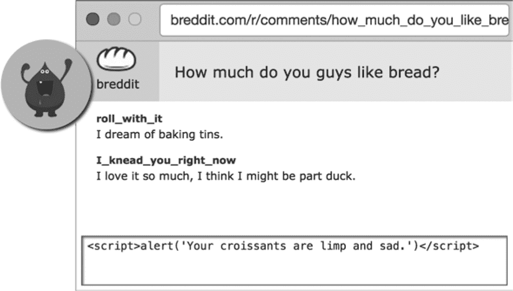
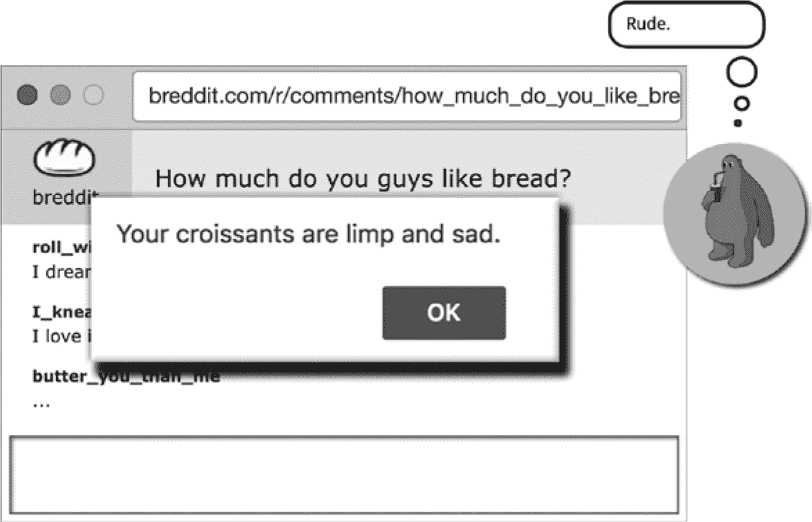
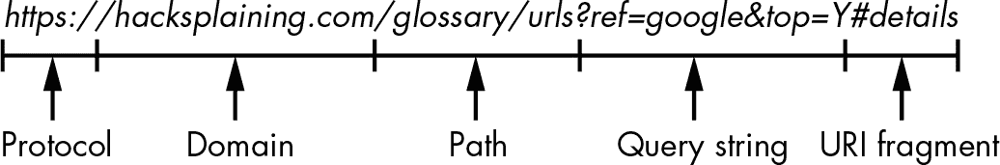

# **跨站脚本攻击**


在上一章中，你了解了攻击者如何将代码注入到 web 服务器中以危害网站。如果你的 web 服务器是安全的，黑客的下一个注入目标通常是 web 浏览器。浏览器会顺从地执行网页中出现的任何 JavaScript 代码，因此，如果攻击者能找到一种方法将恶意 JavaScript 注入到用户浏览器中，而该用户正在访问你的网站，那么这个用户将会面临麻烦。我们称这种代码注入为*跨站脚本（XSS）攻击*。

JavaScript 可以读取或修改网页的任何部分，因此攻击者可以利用跨站脚本漏洞做很多事情。他们可以窃取登录凭据或用户输入的其他敏感信息，如信用卡号。如果 JavaScript 能读取 HTTP 会话信息，他们可以完全劫持用户的会话，从而远程以该用户身份登录。（你将在第十章中了解更多关于会话劫持的内容。）

跨站脚本攻击是一种非常常见的攻击类型，其带来的危害显而易见。本章介绍了三种最常见的跨站脚本攻击类型，并解释了如何防范这些攻击。

### 存储型跨站脚本攻击

网站通常会使用存储在数据库中的信息生成和渲染 HTML。零售网站会将产品信息存储在数据库中，社交媒体网站会存储用户对话。网站会根据用户访问的 URL 从数据库中提取内容，并将其插入页面中生成最终的 HTML。

来自数据库的任何页面内容都可能成为攻击者的攻击载体。攻击者会尝试将 JavaScript 代码注入到数据库中，以便 web 服务器在渲染 HTML 时将 JavaScript 输出到页面。我们称这种攻击为*存储型跨站脚本*攻击：JavaScript 被写入数据库，但在无防备的受害者查看网站的特定页面时，在浏览器中执行。

恶意 JavaScript 可以通过使用第六章中描述的 SQL 注入方法植入数据库，但攻击者更常见的做法是通过合法途径插入恶意代码。例如，如果一个网站允许用户发布评论，网站会将评论文本存储在数据库中，并将其显示给查看相同评论线程的其他用户。在这种情况下，黑客执行跨站脚本攻击的一个简单方法是将包含 `<script>` 标签的评论写入数据库。如果该网站未能安全构造 HTML，那么每当页面渲染给其他用户时，`<script>` 标签就会被输出，恶意 JavaScript 就会在受害者的浏览器中执行。

让我们来看一个具体的例子。假设你经营一个受欢迎的烘焙网站，*https://breddit.com*。你的网站鼓励用户参与有关面包相关话题的讨论线程。在使用在线论坛进行讨论时，大多数内容是由用户自己贡献的。当用户添加帖子时，你的网站会将其记录到数据库并展示给其他参与同一线程的用户。这是攻击者通过评论注入 JavaScript 的一个完美机会，如 图 7-1 所示。



*图 7-1：攻击者通过评论注入 JavaScript。*

如果你的网站在渲染 HTML 时没有对注入的脚本进行转义（如我们在接下来的章节中将讨论的那样），下一个查看该线程的用户将会看到攻击者的 `<script>` 标签被写入到他们的浏览器并执行，如 图 7-2 所示。



*图 7-2：攻击者的 `<script>` 标签被写入受害者的浏览器并执行。*

一个恶意的 `alert()` 弹窗更多的是一种困扰而非真正的威胁，但攻击者通常会从这种方式开始，检查是否可能进行跨站脚本攻击。如果攻击者能够调用 `alert()` 函数，他们可以升级为更危险的攻击，比如窃取其他用户的会话，或者将受害者重定向到恶意网站。烘焙社区将再也无法安心地在线活动！

评论线程并不是唯一可能展示此类漏洞的地方。*任何*由用户控制的内容都是潜在的攻击途径，你需要对此进行加固。例如，攻击者曾通过将恶意脚本标签注入用户名、个人主页和在线评论中来进行跨站脚本攻击。让我们看看你应该实施的一些简单防护措施。

#### *缓解措施 1：转义 HTML 字符*

为了防止存储型跨站脚本攻击，你需要对所有来自数据存储的动态内容进行转义，这样浏览器就能知道将其视为 HTML 标签的*内容*，而不是原始的 HTML。浏览器中的*转义*意味着将 HTML 中的控制字符替换为它们相应的*实体编码*，如 表 7-1 所示。

**表 7-1：** HTML 控制字符的实体编码

| **字符** | **实体编码** |
| --- | --- |
| `"` | `&quot;` |
| `&` | `&amp;` |
| `'` | `&apos;` |
| `<` | `&lt;` |
| `>` | `&gt;` |

在 HTML 中具有特殊含义的字符，如表示标签开始和结束的`<`和`>`字符，都有对应的安全实体编码。当浏览器遇到*实体编码*时，会将其识别为转义字符，并将其呈现为适当的字符，但最重要的是，它们不会被视为 HTML 标签。列表 7-1 展示了一个安全网站如何写出攻击者在图 7-1 中输入的评论。加粗文本表示可以用来构建 HTML 标签的字符。

```
<div class="comment">
  &lt;script&gt;alert(&quot;HAXXED&quot;)&lt;/script&gt;
</div>
```

*列表 7-1：此 XSS 攻击尝试已被化解。*

转义字符到未转义字符的转换发生在*浏览器构建页面 DOM 之后*，因此浏览器*不会*执行`<script>`标签。以这种方式转义 HTML 控制字符可以有效防止大多数跨站脚本攻击。

由于跨站脚本攻击是一种常见的漏洞，现代 web 框架通常默认会转义动态内容。特别是模板，通常会在没有要求的情况下转义插值值。插值变量在*嵌入式 Ruby (ERB)* 模板中的语法如下所示：列表 7-2。

```
<div class="comment">
  <%= comment %>
</div>
```

*列表 7-2：在嵌入式 Ruby 模板中隐式转义动态内容*

当动态内容被评估时，ERB 模板引擎会通过`<%= comment %>`语法自动转义敏感字符。

为了写出原始、未转义的 HTML（从而容易受到 XSS 攻击），ERB 模板需要明确调用`raw`函数，如列表 7-3 所示。

```
<div class="comment">
  <%= raw comment %>
</div>
```

*列表 7-3：在嵌入式 Ruby 模板中允许原始 HTML 注入的语法*

所有安全的模板语言都遵循相同的设计原则：模板引擎会隐式转义动态内容，除非开发者明确选择构建原始 HTML。确保你理解在模板中转义是如何工作的，并在代码审查时检查动态内容是否安全转义！特别是，如果你有帮助函数或方法构建原始 HTML 以注入模板中，要检查攻击者是否能够滥用它们的输入进行跨站脚本攻击。

#### *缓解措施 2：实施内容安全策略*

现代浏览器允许网站设置*内容安全策略*，你可以利用它来锁定网站上的 JavaScript 执行。跨站脚本攻击依赖于攻击者能够在受害者的网页上运行恶意脚本，通常是通过在页面的`<html>`标签内某处注入`<script>`标签，这也被称为*内联* JavaScript。图 7-2 中展示的黑客攻击示例就是使用内联 JavaScript，作为评论文本书写。

通过在你的 HTTP 响应头中设置内容安全策略，你可以告诉浏览器*永远*不执行内联 JavaScript。浏览器只有在 JavaScript 通过 `<script>` 标签的 `src` 属性导入时才会执行页面上的 JavaScript。一个典型的内容安全策略头部如下所示：Listing 7-4。该策略指定脚本可以从同一域（`'self'`）或*apis.google.com*域导入，但不应执行内联 JavaScript。

```
Content-Security-Policy: script-src 'self' https://apis.google.com
```

*Listing 7-4: 在 HTTP 响应头中设置的内容安全策略*

你还可以在 HTML 页面的 `<head>` 元素中的 `<meta>` 标签里设置你网站的内容安全策略，如 Listing 7-5 所示。

```
<meta http-equiv="Content-Security-Policy" content="script-src 'self' https://apis.google.com">
```

*Listing 7-5: 在 HTML 文档的 <head> 元素中设置的等效内容安全策略*

通过将浏览器加载脚本的域名列入白名单，你隐含地声明不允许使用内联 JavaScript。在这个示例的内容安全策略中，浏览器将仅从*apis.google.com*和网站的域名加载 JavaScript——例如，* [breddit.com](http://breddit.com)*。要允许内联 JavaScript，策略中必须包含`unsafe-inline`关键词。

阻止内联 JavaScript 执行是一个很好的安全措施，但这意味着你需要将你网站当前实现的任何内联 JavaScript 移动到单独的导入文件中。换句话说，页面上的 `<script>` 标签必须通过 `src` 属性引用一个单独的 JavaScript 文件，而不是将 JavaScript 直接写在开始和结束标签之间。

将 JavaScript 分离到外部文件中是 Web 开发中推荐的方法，因为这样可以使代码库更加有序。内联脚本标签在现代 Web 开发中被认为是不好的实践，因此禁止内联 JavaScript 实际上迫使你的开发团队养成良好的习惯。然而，内联脚本标签在旧的遗留网站中仍然很常见。事实上，可能需要一些时间来重构你的模板，以移除所有内联 JavaScript 标签。

为了帮助重构，考虑使用内容安全策略*违规报告*。如果你在内容安全策略头中添加`report-uri`指令，如 Listing 7-6 所示，浏览器会通知你任何策略违规，而不是阻止 JavaScript 执行。

```
Content-Security-Policy-Report-Only: script-src 'self'; report-uri https://example.com/csr-reports
```

*Listing 7-6: 一个内容安全策略，它指示浏览器将任何内容安全违规报告到* https://example.com/csr-reports

如果你将所有这些违规报告收集到日志文件中，开发团队应该能够看到他们需要重写的所有页面，以符合提议的内容安全策略所施加的限制。

除了转义 HTML 外，你还应设置内容安全策略，因为这将有效地保护你的用户！攻击者很难同时找到未转义的内容*并*将恶意脚本偷偷传送到你的白名单域名中。我们称这种针对同一漏洞使用多层防御的做法为深度防御，正如你在第六章中学到的那样；这将是本书的一个主题。

### 反射型跨站脚本攻击

数据库中的恶意 JavaScript 并不是跨站脚本攻击的唯一途径。如果你的网站会获取 HTTP 请求的一部分并将其显示回渲染的网页中，那么你的渲染代码需要防范通过 HTTP 请求注入恶意 JavaScript 的攻击。我们将这种类型的攻击称为*反射型跨站脚本*攻击。

几乎所有网站都会在渲染的 HTML 中显示 HTTP 请求的某一部分。以谷歌搜索页面为例：如果你搜索`cats`，谷歌会将搜索词作为 URL 中的一部分传递：*[`www.google.com/search?q=cats`](https://www.google.com/search?q=cats)*。搜索词`cats`会显示在搜索结果上方的搜索框中。

如果谷歌是一个安全性较差的公司，那么就有可能将 URL 中的*cats*参数替换为恶意 JavaScript，并让该 JavaScript 代码在任何人打开该 URL 时执行。攻击者可以通过电子邮件将该 URL 作为链接发送给受害者，或者通过将其添加到评论中来欺骗用户访问该 URL。这就是*反射型*跨站脚本攻击的本质：攻击者在 HTML 请求中发送恶意代码，然后服务器将其反射回来。

幸运的是，谷歌聘用了不止几位安全专家，因此如果你尝试将`<script>`标签插入其搜索结果中，服务器是不会执行该 JavaScript 的。过去，黑客*确实*发现了谷歌应用管理界面中存在反射型跨站脚本漏洞，地址为*[`admin.google.com`](https://admin.google.com)*，这说明即使是大公司也会被发现漏洞。如果你想有机会保护你的用户安全，你必须防范这种攻击途径。

#### *缓解措施：对 HTTP 请求中的动态内容进行转义*

你可以通过与缓解存储型跨站脚本漏洞相同的方式来缓解反射型跨站脚本漏洞：通过转义网站将动态内容插入 HTML 页面中的控制字符。无论动态内容来自后端数据库还是 HTTP 请求，你都需要以相同的方式进行转义。

幸运的是，模板语言通常会对*所有*插值变量进行转义，无论模板是从数据库加载它们还是从 HTTP 请求中提取它们。然而，你的开发团队仍然需要在审查代码时意识到通过 HTTP 请求进行注入的风险。代码审查通常会忽略反射型跨站脚本漏洞，因为开发人员过于专注于寻找存储型跨站脚本漏洞。

反射型跨站脚本攻击的常见目标是搜索页面和错误页面，因为它们通常会将查询字符串的部分内容显示回用户。确保你的团队理解这些风险，并知道如何在审查代码更改时识别漏洞。存储型跨站脚本攻击往往更具危害性，因为单个恶意 JavaScript 注入到数据库表中后可以一再攻击你的用户。但是反射型攻击更常见，因为它们更容易实现。

在我们结束本章之前，让我们再看看一种跨站脚本攻击类型。

### 基于 DOM 的跨站脚本攻击

防御大多数跨站脚本攻击意味着检查和保护服务器端代码；然而，客户端代码的丰富框架越来越流行，导致了*基于 DOM 的跨站脚本攻击*的兴起，在这种攻击中，攻击者通过 URI 片段将恶意 JavaScript 偷偷塞入用户的网页中。

要理解这些攻击，首先需要了解 URI 片段的工作原理。让我们从回顾一下*URL（统一资源定位符）*开始，浏览器地址栏中显示的地址是如何构成的。一个典型的 URL 如图 7-3 所示。



*图 7-3：典型 URL 的各个部分*

URI 片段是 URL 中*#*符号后的可选部分。浏览器使用*URI 片段*进行*页面内*导航——如果页面上的 HTML 标签具有与 URI 片段匹配的`id`属性，浏览器在打开页面后会滚动到该标签。例如，如果你在浏览器中加载 URL *[`en.wikipedia.org/wiki/Cat#Grooming`](https://en.wikipedia.org/wiki/Cat#Grooming)*，浏览器会打开网页并滚动到 Wikipedia 猫咪页面的美容部分。之所以这样，是因为该部分的标题标签看起来像清单 7-7。

```
<h3 id="Grooming">Grooming</h3>
```

*清单 7-7：与 URI 片段#Grooming 对应的 HTML 标签*

利用这一有用的浏览器内建行为，Wikipedia 允许用户直接链接到页面中的某个部分，这样你和你的室友终于可以解决那个关于猫咪美容的争论了。

*单页面应用*通常也使用 URI 片段以直观的方式记录和重新加载状态。这些类型的应用程序通常使用像 Angular、Vue.js 和 React 这样的 JavaScript 框架编写，实际上是基于 JavaScript 的网页，旨在避免浏览器重新加载网页时出现的渲染*闪烁*。

避免这种渲染闪烁的一个潜在方法是将整个应用设计为在一个永远不变的静态 URL 下加载，因为浏览器地址栏中 URL 的变化通常会导致网页重新加载。然而，如果用户刷新一个不变的 URL，浏览器会将网页重置为初始状态，丢失用户之前的操作信息。

许多单页面应用通过使用 URI 片段在浏览器刷新时保持状态来克服这一问题。你通常会看到网页实现*无限滚动*：用户向下滚动页面时，图片列表会动态加载。URI 片段会更新，指示用户滚动的进度。即便浏览器刷新，JavaScript 代码也可以解释 URI 片段的内容，并在页面刷新时加载相关数量的图片。

从设计上讲，浏览器在渲染页面时不会将 URI 片段发送到服务器。当浏览器接收到带有 URI 片段的 URL 时，它会记录下该片段，将其从 URL 中剥离，并将剥离后的 URL 发送到 Web 服务器。页面上执行的任何 JavaScript 都可以读取 URI 片段，且浏览器会将完整的 URL 写入浏览器历史记录或书签中，如果用户将页面加入书签的话。

不幸的是，这意味着 URI 片段无法被任何服务器端代码使用——因此保护服务器端代码*不能*缓解基于 DOM 的 XSS 攻击。客户端 JavaScript 代码在解释和使用 URI 片段时，必须小心如何处理这些片段的内容。如果内容没有转义并直接写入网页的 DOM，攻击者可以通过这个渠道偷偷注入恶意 JavaScript。攻击者可以构造一个带有恶意 JavaScript 的 URL，利用 URI 片段中的内容，然后欺骗用户访问该 URL 发起跨站脚本攻击。

基于 DOM 的跨站脚本攻击是一种相对较新的攻击方式，但它特别危险，因为代码注入完全发生在客户端，且通过检查 Web 服务器日志无法检测到！这意味着在进行代码审查时，你需要特别警觉这种漏洞，并知道如何缓解它。

#### *缓解措施：转义来自 URI 片段的动态内容*

在浏览器中执行的任何 JavaScript 代码，如果使用 URI 片段构造 HTML，容易受到基于 DOM 的跨站脚本攻击。这意味着，在用客户端代码将 URI 片段中的内容插入 HTML 时，需要特别注意*转义*这些内容，就像你在服务器端代码中处理时一样。

现代 JavaScript 模板框架的作者充分意识到 URI 片段所带来的风险，并且不鼓励在代码中构造原始 HTML。例如，在 React 框架中，编写未经转义的 HTML 语法需要开发者调用 `dangerouslySetInnerHTML` 函数，如在第 7-8 列表中所示。

```
function writeSomeHTML () {
  return {__html: 'First &middot; Second'};
}
function MyComponent() {
  return <div dangerouslySetInnerHTML={writeSomeHTML()} />;
}
```

*列出 7-8：在 React 框架中危险地设置来自文本的原始 HTML*

如果你的客户端 JavaScript 代码比较复杂，可以考虑切换到一个现代的 JavaScript 框架。这将使代码库更加易于管理，安全性问题也会更加明显。而且，一如既往，务必设置适当的内容安全策略。

### 总结

在本章中，你学习了跨站脚本攻击（XSS），攻击者通过在用户浏览页面时将 JavaScript 注入到你站点的页面中来实施攻击。攻击者通常将恶意 JavaScript 注入到来自数据库、HTTP 请求或 URI 片段的动态内容中。你可以通过转义动态内容中的 HTML 控制字符，并设置内容安全策略来防止执行内联 JavaScript，从而抵御跨站脚本攻击。

在下一章中，你将了解攻击者如何利用跨站请求伪造（CSRF）攻击你的站点用户。
