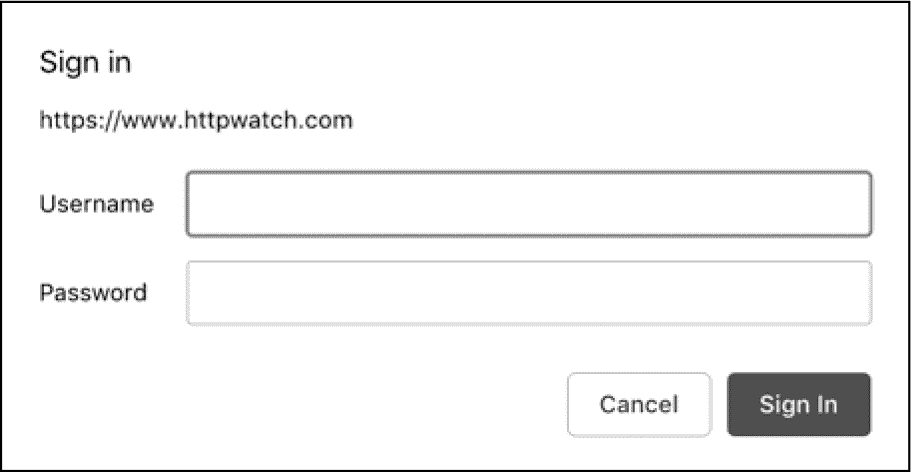
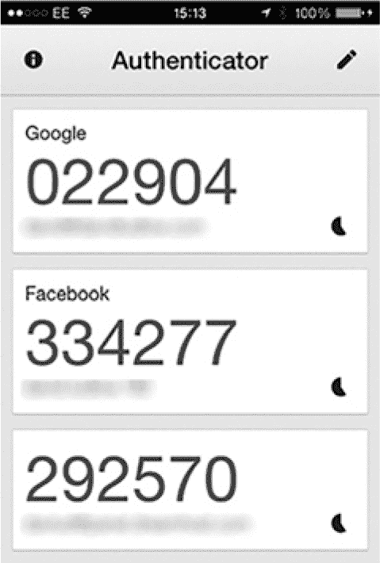
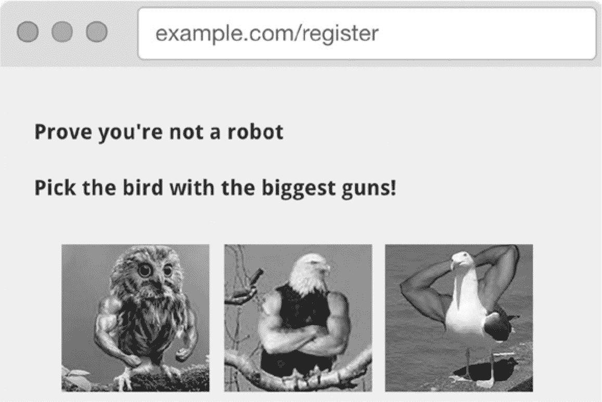

# 第九章：**身份验证的风险**


大多数网站都提供某种形式的登录功能。这是一种*身份验证*形式，即当用户返回网站时识别其身份的过程。验证用户身份使他们能够在一个在线社区中拥有身份，贡献内容、发送消息、进行购买等。

如今，互联网用户习惯于使用用户名和密码注册网站，并在下次使用时重新登录。尤其是浏览器和插件有助于缓存或选择密码，而第三方身份验证服务也变得无处不在。

然而，这也有一个缺点。获取用户账户的访问权限对黑客来说是一个诱人的前景。在互联网时代，黑客通过暗网出售被盗凭证、劫持社交媒体账户传播诱饵链接，以及进行金融欺诈从未如此容易。

在本章中，你将探讨黑客在登录和身份验证过程中如何破坏用户账户的几种方式。（下一章将讨论用户登录并建立会话后面临的漏洞。）在这里，你将首先看到网站实现身份验证的最常见方式，并了解攻击者如何通过暴力破解攻击来利用这些方式。然后，你将学习如何通过第三方身份验证、单点登录以及保护你自己身份验证系统的方式来防止这些攻击。

### 实现身份验证

身份验证是超文本传输协议（HTTP）的一部分。为了提出身份验证挑战，Web 服务器需要在 HTTP 响应中返回 `401` 状态码，并添加 `WWW-Authenticate` 头部，描述首选的身份验证方法。（常见的两种身份验证方法是基本身份验证和摘要身份验证。）为了满足这一要求，用户代理——通常是 Web 浏览器——需要向用户请求用户名和密码，从而创建登录功能。

在*基本身份验证*方案中，浏览器将用户提供的用户名和密码与冒号（`:`）字符连接起来，生成字符串 username`:`password。然后，它使用 Base64 算法对该字符串进行编码，并在 HTTP 请求的 `Authorization` 头部将其发送回服务器。

*摘要身份验证*方案稍微复杂一些，要求浏览器生成一个哈希值，该哈希值由用户名、密码和 URL 组成。*哈希*是单向加密算法的输出，它使得为一组输入数据生成唯一的“指纹”变得容易，但如果只有算法的输出，则很难猜测输入值。在本章后面，我们将更深入地讨论哈希，当我们讲解如何安全存储密码时。

#### *HTTP 原生身份验证*

尽管身份验证是超文本传输协议的一部分，但流行的网站很少使用基本认证或摘要认证——主要是由于可用性考虑。原生的浏览器身份验证提示*并不是*一个美观的设计。它看起来类似于 JavaScript 警告对话框，抢占浏览器的焦点，打断用户使用网站的体验，如图 9-1 所示。

因为浏览器将身份验证提示实现为 HTML 之外的内容，我们无法将本地身份验证提示样式化以匹配网站。作为一个不在网页中显示的本地浏览器窗口，浏览器也无法自动填充用户的凭据。最后，由于 HTTP 身份验证未指定忘记密码时的重置方法，我们必须在登录提示之外单独实现一个重置功能，这会导致用户体验的混乱。



*图 9-1：原生 Google Chrome 登录提示粗鲁地打断了你的浏览会话。*

#### *非本地身份验证*

由于这种不友好的设计，内置的 HTTP 身份验证方法通常仅用于那些用户体验不太重要的应用程序。现代网站通常会使用 HTML 自定义登录表单，就像在清单 9-1 中展示的那样。

```

<form action="/login" method="post">
❶ <input type="email" name="username" placeholder="Type your email">
❷ <input type="password" name="password" placeholder="Type your password">
   <input type="submit" name="login" value="Log in">
</form>
```

*清单 9-1：HTML 中的典型登录表单*

一个典型的登录表单包含一个 `<input type="text">` 元素 ❶，要求用户提供用户名，还有一个 `<input type="password">` 元素 ❷，该元素用 `•` 字符替换输入的字符以隐藏密码。用户提交表单时，提供的用户名和密码作为 `POST` 请求发送到服务器。如果登录失败，因为用户无法通过身份验证，服务器会在 HTTP 响应中返回 `401` 状态码。如果登录成功，服务器会将用户重定向到其主页。

#### *暴力破解攻击*

攻击者经常试图通过猜测密码在身份验证环节入侵你的网站。电影中通常描绘黑客使用目标的个人信息来猜测密码。虽然这可能是高曝光目标的一个问题，但黑客通常更成功于使用*暴力破解攻击*，它通过脚本尝试成千上万的常用密码来攻击登录页面。因为之前的数据泄露已经泄漏了包括清单 9-2 中的成千上万的常用密码，攻击者很容易确定应该首先尝试哪些密码。

```
1\. 123456
2\. password
3\. 12345678
4\. qwerty
5\. 12345
6\. 123456789
7\. letmein
8\. 1234567
9\. football
10\. iloveyou
```

*清单 9-2：安全研究人员每年发布最常用密码的列表；这些密码几乎每年变化不大。（这个列表由互联网安全公司 SplashData 提供。）*

让我们来看看一些你可以实施并保护身份验证免受这种类型威胁的方法。

### 缓解措施 1：使用第三方身份验证

最安全的认证系统是你不需要自己编写的系统。与其自己实现认证系统，不如考虑使用像 Facebook Login 这样的第三方服务，让用户可以用他们的社交媒体凭据登录你的网站。这对他们来说很方便，也减轻了你存储用户密码的负担。

大型科技公司提供了其他类似的认证服务。它们大多基于*开放认证（OAuth）*或*OpenID*标准——这些是将认证委托给第三方的常用协议。你可以随时混合使用不同的认证系统。它们通常易于集成，因此选择一个或多个与用户群体匹配的系统。如果你提供与电子邮件相关的服务，可以集成 Google OAuth，要求用户授权访问其 Gmail 账户。如果你提供技术服务，可以使用像 GitHub OAuth 这样的系统。Twitter、Microsoft、LinkedIn、Reddit 和 Tumblr 等都提供认证选项，其他数百个网站也是如此。

### 缓解措施 2：与单点登录集成

如果你与 OAuth 或 OpenID 身份提供者集成，用户通常会使用他们的个人电子邮件地址作为用户名。然而，如果你的网站目标用户群是企业用户，可以考虑与*单点登录（SSO）*身份提供者（如 Okta、OneLogin 或 Centrify）集成，这些身份提供者集中管理企业系统中的认证，使员工可以无缝地使用他们的企业邮箱登录第三方应用。公司管理员可以控制哪些员工可以访问哪些网站，用户凭据也会安全地存储在公司的服务器上。

要与单点登录提供者集成，你通常需要使用*安全断言标记语言（SAML）*，这是一种比 OAuth 或 OpenID 更古老（且不太友好）的标准，尽管大多数编程语言都有成熟的 SAML 库可供使用。

### 缓解措施 3：保护你自己的认证系统

尽管第三方认证通常比你自己的系统更安全，但仅依赖第三方认证可能会在某种程度上限制你的用户群，因为并不是每个人都有社交媒体账户或 Gmail 账户。对于其他用户，你需要创建一种方式，让他们注册并手动选择用户名和密码。这意味着需要在你的网站上创建独立的页面，让用户能够注册、登录和退出；同时编写代码来存储和更新凭据，并在用户重新输入时检查凭据是否正确。很可能，你还需要为用户提供更改密码的机制。

这需要实现很多功能！在开始编写代码之前，你需要做一些设计决策。我们来看看你需要做对的关键事情，以便拥有一个安全的认证系统。

#### *要求用户名、电子邮件地址或两者*

用户在注册时需要选择一个用户名和密码。大多数网站还会要求用户在注册时提交一个有效的电子邮件地址，这样他们就可以在用户忘记凭证时发送密码重置邮件。

对于许多网站来说，用户的电子邮件地址*就是*他们的用户名。因为每个电子邮件地址必须对一个账户唯一，所以通常选择单独的用户名是多余的。例外情况是当用户在网站上有可见存在时；例如，当用户有公开个人资料，或在评论区与其他用户互动时。这类网站要求用户选择一个单独的*显示名称*。将电子邮件地址作为显示名称是不好的做法，因为这会引发骚扰和垃圾邮件。

##### 验证电子邮件地址

如果你打算从你的网站发送电子邮件——例如，允许用户重置密码——你需要验证每个用户的电子邮件地址是否对应一个有效的电子邮件账户。网站生成的电子邮件被称为*事务性电子邮件*，因为网站是响应用户的操作而发送这些邮件。向未经验证的地址发送事务性电子邮件会迅速使你被电子邮件服务提供商列入黑名单，因为他们不愿意为垃圾邮件提供支持。

首先，验证用户的电子邮件地址是否在表面上有效。这意味着验证电子邮件仅包含有效字符：字母、数字或任何特殊字符（``!#$%&'*+-/=?^_`{|}~;.``）。

地址必须包含一个*@*符号，并且右边必须有一个有效的互联网域名。通常，但不总是，域名应对应一个网站，例如*@gmail.com*地址对应* [www.gmail.com](http://www.gmail.com)*。至少，互联网的*域名系统(DNS)*，我们在第二章中讨论过的，必须包含该域的邮件交换(MX)记录，以告诉软件邮件应该路由到哪里。在验证过程中，您可以查找 MX 记录，正如在清单 9-3 中所示。

```
import dns.resolver
def email_domain_is_valid(domain):
  for _ in dns.resolver.query(domain, 'MX'):
    return True
  return False
```

*清单 9-3：通过使用 dnsresolver 库验证一个域名是否能够接收电子邮件*

然而，验证一个地址是否对应一个有效的电子邮件账户的唯一 100%可靠方法是发送一封电子邮件并检查是否收到。这意味着你需要向每个用户发送一封包含*电子邮件验证链接*的邮件，该链接指向你的网站并包含一个*验证令牌*——一个大而随机生成的字符串，你会将其存储在数据库中与用户的电子邮件地址关联。当用户点击链接以验证他们的电子邮件地址的所有权时，你可以检查验证令牌是否与你发送的相符，从而确认他们确实能够访问该电子邮件账户。

许多网站要求用户在完成注册过程之前验证他们的电子邮件。其他网站则允许用户在未验证状态下使用网站的部分功能，以减少注册过程的繁琐。你永远不能假设用户已经验证过电子邮件账户，直到你验证他们之前。直到那时，不要发送任何其他类型的交易邮件或将用户添加到邮件列表！

##### 禁止使用一次性电子邮件账户

一些用户不愿意使用常用的电子邮件地址进行注册，他们会使用像 10 Minute Mail 或 Mailinator 这样的服务生成临时电子邮件账户，或使用图 9-2 所示的服务。这些服务生成一个一次性电子邮件账户，在接收几封邮件后即会关闭。如果用户使用这种类型的服务，通常意味着他们担心被加入邮件列表（考虑到电子邮件营销人员的无休止骚扰，这种担心是很合理的）。

你可能需要禁止用户使用一次性电子邮件地址注册，例如，当部分用户生成临时账户以骚扰他人时。此时，你可以使用维护良好的一次性电子邮件服务提供商黑名单，在注册过程中检测、拒绝并禁止一次性电子邮件域名。


*图 9-2：想要一个临时的电子邮件地址吗？来这里获取：* [`www.sharklasers.com/`](https://www.sharklasers.com/)。*（是的，这是一个真实的网站。嘭嘭嘭。）*

##### 保护密码重置

拥有每个用户的已验证电子邮件地址，能帮助你处理用户忘记密码的（不可避免的）情况。只需向他们发送一封包含*密码重置链接*的邮件，链接内带有新的验证令牌。当健忘的用户打开邮件并点击链接时，你可以验证收到的令牌，并允许用户为其账户选择一个新密码。

密码重置链接应该是短期有效的，在用户使用后应立即过期。一个好的经验法则是，在 30 分钟后使重置令牌过期，以防止攻击者滥用过时的重置链接。如果攻击者入侵了用户的电子邮件账户，你不能让他们搜索包含重置链接的邮件，并使用这些链接以受害者身份访问你的网站。

#### *要求复杂密码*

复杂密码通常更难猜测，因此你应该要求用户在选择密码时满足一定的密码复杂度标准，以保障他们的安全。复杂密码包含数字和符号以及字母，大小写字母混合，且密码长度较长而非较短。至少，你应该强制要求密码长度不低于八个字符，但密码越长越好。（研究表明，密码长度比混合使用不常见字符更为重要。）

然而，用户通常很难记住复杂的密码，所以如果你强制要求过于严格的密码复杂性要求，用户通常会在其他网站上重新使用他们以前输入过的密码。一些安全的网站会防止用户重复使用他们以前用过的密码，迫使他们每次都选择新的、独特的密码，从而让他们远离懒惰的习惯。不幸的是，大多数用户通常通过在常用密码的末尾添加一个数字来循环使用密码，这样并不会显著降低密码的猜测难度。

最终，每个用户对其在线安全负责，因此通常更好的是引导用户选择强密码，而不是强迫他们通过繁琐的步骤。有些 JavaScript 库，比如`password-strength-calculator`库，可以在用户输入密码时对其复杂性进行评分，并指出常见的密码，你可以在注册和密码重置页面上使用这些库，促使用户选择更安全的密码。

#### *安全存储密码*

在用户选择密码后，你需要以某种形式将其记录在数据库中与用户名关联，以便在用户再次登录时重新验证其凭据。*不要*直接存储密码原文——我们称之为*明文存储*，这是一个巨大的安全隐患。如果攻击者访问了存储明文密码的数据库，他们可以危及每个用户账户，并且还会影响这些用户在其他网站上使用相同凭据的账户。幸运的是，有一种方法可以安全地存储密码，使其在数据库中不可读，但可以在稍后的时候验证用户是否正确地重新输入密码。

##### 哈希密码

密码应该在存储到数据库之前，使用*加密哈希算法*进行处理。这将把原始输入字符串转换为一个固定长度的比特字符串，使得反向过程在计算上不可行。然后，你应该将该算法的输出值——*哈希值*——与每个用户名一起存储。

哈希算法是一种单向数学函数。猜测生成给定哈希输出（或简称*哈希*）的输入字符串的唯一实际方法是逐一尝试每一个可能的输入字符串。通过存储用户密码的哈希值，当用户重新输入密码时，你可以重新计算哈希值，并比较新旧哈希值以确认他们是否输入了正确的密码。

存在许多加密哈希算法，每种算法都有不同的实现方式和强度。一个好的哈希算法应该计算快速，但又不能*过于*快速。否则，随着计算速度的提升，通过暴力破解枚举所有可能的输入来尝试破解密码变得可行。因此，一个不错的算法是*bcrypt*，如示例 9-4 所示，它允许随着时间推移增加额外的迭代次数，使得哈希函数随着计算能力变得更强且更加耗时。

```
import bcrypt
password = "super secret password"

# Hash a password for the first time, with a randomly-generated salt
hashed = bcrypt.hashpw(password, bcrypt.gensalt(rounds=14❶))

# Check that an unhashed password matches one that has previously been hashed
if bcrypt.checkpw(password, hashed):
    print("It matches!")
else:
    print("It does not match :(")
```

*示例 9-4：使用 bcrypt 算法在 Python 中对密码进行哈希并进行测试*

❶处的`rounds`参数可以增加，从而使密码哈希变得更强。存储哈希密码而不是明文密码要安全得多。包括你在内的任何访问数据库的人都无法直接解密密码，但你的网站仍然可以判断用户是否正确重新输入了密码。这为你减轻了安全负担——即使攻击者入侵了你的数据库，他们也无法对哈希密码做什么。

##### 哈希加盐

对密码进行哈希处理可以使你的网站更加安全，但用户在选择密码时通常缺乏想象力。在*破解*密码列表——对泄露的密码哈希进行逆向工程——时，黑客经常使用*彩虹表*，这是一种包含了常用密码的列表，这些密码已经通过已知的哈希算法处理过。将哈希与预先计算的值进行匹配，可以为攻击者带来很好的回报，使他们能够破解许多哈希值的密码，甚至是大多数。

为了防范彩虹表攻击，你需要*加盐*你的密码哈希，这意味着向哈希算法中加入随机元素，使得输入的密码不会单独决定生成的哈希值。你可以将盐值输入存储在配置文件中，或者更好地，为每个用户生成一个单独的盐值，并将其与密码哈希一起存储。这使得彩虹表攻击变得不可行，因为攻击者必须为你使用的每个盐值重新生成整个彩虹表，而这在计算上是不可承受的，因而需要很长时间。

#### *要求多因素认证*

无论你如何安全地存储密码，基于密码的认证系统始终容易受到暴力破解密码攻击。为了真正保护你的网页，考虑通过要求*多因素认证（MFA）*来增加一层安全防护，这要求回访用户通过以下三类信息中的至少两项来确认身份：他们*知道*的东西、他们*拥有*的东西和他们*本身*的特征。多因素认证的一个例子是银行自动取款机（ATM），它要求账户持有人的 PIN 码（他们知道的东西）和银行卡（他们拥有的东西）。另一个例子是使用生物识别技术来识别个人的设备，例如智能手机上的指纹扫描（他们本身的特征）。

对于网站，多因素认证通常意味着要求输入用户名和密码（用户知道的东西），并确认用户的智能手机上安装了认证器应用（用户拥有的东西）。每个用户在注册时需要将认证器应用与网站同步（通常通过拍摄屏幕上的二维码）。之后，应用会生成一个六位数的随机数字，用户需要在登录时提供该数字，才能成功登录，就像在图 9-3 中所示。



*图 9-3：你的用户会喜欢输入六位数的数字。*

这迫使攻击者既要知道受害者的凭证*又*要获得受害者的智能手机才能破坏他们的账户，这种组合是非常不可能发生的。鉴于智能手机的普及，多因素认证的支持逐渐成为常态。如果你的网站涉及任何类型的财务处理，绝对应该实施多因素认证。幸运的是，许多代码库使得集成它变得相对简单。

#### *实现和保护注销功能*

如果你在网站上验证用户身份，别忘了添加一个功能，让他们也能退出网站。这看起来可能有些过时，因为用户似乎总是保持社交媒体的永久登录状态，但对于在共享设备上登录的用户来说，拥有注销功能是一个关键的安全考虑。许多家庭共享一台笔记本电脑或 iPad，公司也常常重复使用计算机和便携设备，所以一定要确保让用户能够注销！

你的注销功能应该清除浏览器中的会话 cookie，*并*且如果你在服务器端存储了会话标识符，也应使其失效。这可以防止攻击者在事后截获会话 cookie，并尝试利用被窃取的 cookie 重新建立会话。清除会话 cookie 就像通过 HTTP 响应发送一个带有空值的 `Set-Cookie` 头部来清空会话参数一样简单。

#### *防止用户枚举*

如果攻击者无法*枚举*用户（即通过测试用户名列表中的每个用户名来查看其是否存在于你的网站上），那么你可以降低攻击者危及你的认证系统的风险。攻击者经常使用从先前泄露的密码中获得的凭据，尝试验证这些用户名是否存在于目标网站上。在缩小列表范围后，他们会尝试对匹配的用户名进行密码猜测。

##### 防止潜在的枚举漏洞

登录页面通常允许攻击者确定用户名是否已在网站上注册。如果页面对错误密码的错误信息与对未知用户的错误信息不同，攻击者便能从响应中推测出某些用户名是否对应你网站上存在的帐户。为了避免泄露这类信息，重要的是保持错误信息的通用性。例如，无论用户名是否未被识别，或者密码是否错误，都可以使用错误信息`用户名或密码错误`。

攻击者还可能通过*时延攻击*来枚举用户，方法是通过测量 HTTP 响应时间。哈希密码是一个耗时操作；尽管通常不到一秒钟，但依然是一个可测量的时间。如果你的网站只在用户输入有效用户名时计算密码哈希，攻击者可以通过测量略微更慢的响应时间来推断哪些帐户在网站上存在。确保你的网站即使在无效用户名的情况下也进行密码哈希计算。

你应该防止密码重置页面透露某个用户名是否存在。如果攻击者点击“忘记密码”链接并输入电子邮件地址请求密码重置链接，页面上的响应信息不应透露是否发送了重置邮件。这可以防止攻击者得知该电子邮件地址是否与网站上的帐户相关联。保持消息中立，例如：`请检查您的收件箱`。

##### 实现验证码

你还可以通过实现*验证码（完全自动化公共图灵测试区分计算机与人类）*来化解用户枚举攻击，验证码要求网页用户完成一些对人类来说简单、对计算机来说棘手的图像识别任务。图 9-4 中所示的验证码，使得攻击者无法通过黑客脚本滥用网页。

验证码并不完美。攻击者可以通过使用复杂的机器学习技术或支付人工用户代替他们完成任务来绕过验证码。然而，验证码通常足够可靠，能有效威慑大多数黑客攻击，而且你可以轻松地将其添加到网站上。例如，谷歌实现了一个名为 reCAPTCHA 的验证码小部件，你可以通过几行代码将其安装到你的网站上。



*图 9-4：某些任务对计算机来说实在是太难完成了。*

### 总结

黑客经常试图攻击你的认证系统，企图窃取用户的凭证。为了保护你的网站，你可以使用第三方认证系统，如 Facebook 登录或单点登录身份提供者。

如果你正在实现自己的认证系统，你需要让用户在注册时选择用户名和密码。你还应该为每个用户存储并验证电子邮件地址。除非你需要用户有可见的显示名称，否则使用电子邮件作为用户名是合理的。

验证电子邮件地址的唯一可靠方法是发送一封包含唯一临时验证令牌的链接的电子邮件，用户点击后你的网站可以检查此令牌。对于忘记密码的用户，密码重置机制应采用相同的方式。密码重置邮件和初始验证邮件应在一段时间后超时，且在第一次使用后失效。

在存储密码之前，你应该使用加密哈希算法处理密码。你还应该为密码哈希加盐，以防止彩虹表攻击。

如果你的网站托管敏感数据，考虑添加多因素认证。确保在你的网站上某处包含注销功能。保持登录失败消息的通用性，避免黑客枚举你网站上的用户名。

在下一章中，你将调查用户在登录后如何可能因为会话被攻击者窃取而导致账户被入侵。
