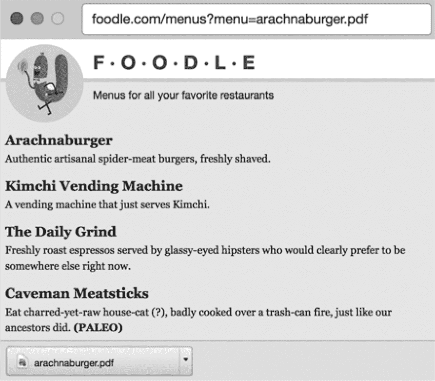
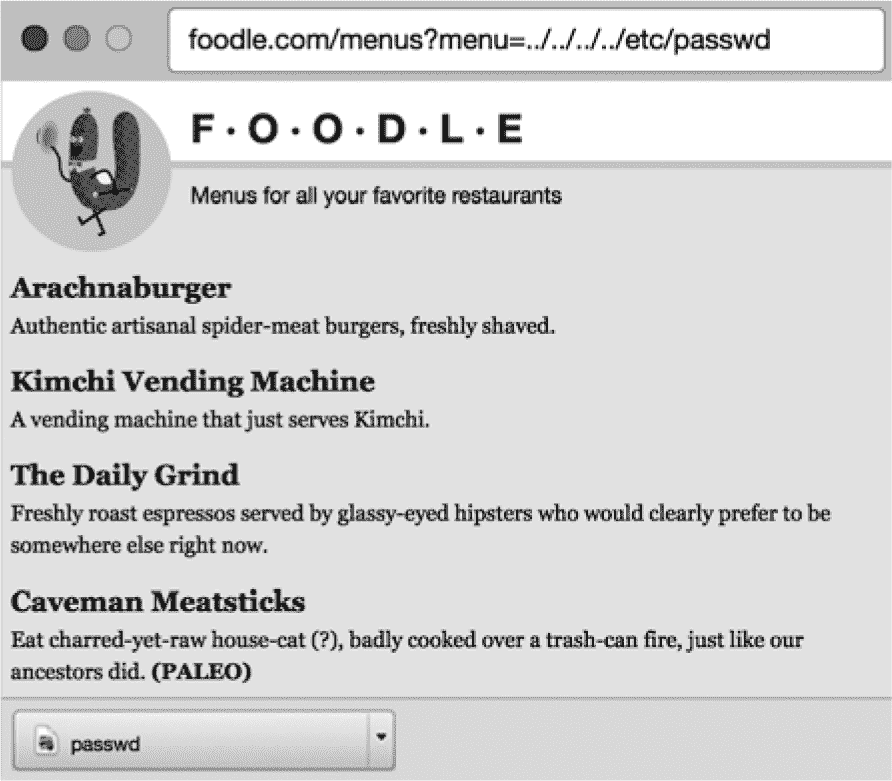

# **权限**


网站上的用户通常会拥有不同级别的权限。例如，在内容管理系统中，一些用户是管理员，拥有编辑站点内容的权限，而大多数用户只能查看和互动内容。社交媒体网站的权限更加复杂：用户可以选择只与朋友分享某些内容，或将个人资料设置为私密。对于网页邮件网站，每个用户应只能访问自己的电子邮件！重要的是，您需要在站点上正确且统一地执行这些权限，否则用户将失去对您的信任。

Facebook 在 2018 年 9 月遭遇了一次灾难性的用户权限失败，当时黑客利用其视频上传工具中的漏洞生成了访问令牌。该站点最多有 5000 万个用户帐户受到影响。黑客窃取了用户的私人资料，如用户名、电子邮件和电话号码。Facebook 修复了该漏洞，发布了安全公告，并通过媒体进行道歉。然而，这一事件发生在包含许多关于 Facebook 商业行为不利报道的一年末，公司股价也受到了重创。

Facebook 的黑客攻击是一个*特权升级*的例子，其中恶意用户篡夺了其他用户的权限。确保您的站点安全，并为每个用户正确应用权限的过程称为实施*访问控制*。本章涵盖了这两个概念，并介绍了一种黑客常用的、利用访问控制不足的方法，称为*目录遍历*。

### 特权升级

安全专家将特权升级攻击分为两类：垂直升级和水平升级。

在*垂直升级*中，攻击者获得比自己权限更广泛的帐户访问权限。如果攻击者能够在您的服务器上部署*web shell*（一个可执行脚本，它获取 HTTP 请求的元素并在命令行上运行），他们的首要目标之一将是升级到*root 权限*，以便在服务器上执行任何他们想做的操作。通常，发送到 web shell 的命令将在与 web 服务器运行相同的操作系统帐户下执行，该帐户通常具有有限的网络和磁盘访问权限。黑客已经找到了许多在操作系统上执行垂直升级攻击的方法，试图获得 root 权限——这使他们可以通过 web shell 感染整个服务器。

在*横向升级*攻击中，攻击者访问另一个与自己权限相似的账户。在前几章中，我们讨论了执行这种类型攻击的常见方法：猜测密码、劫持会话或恶意构造 HTTP 请求数据。2018 年 9 月的 Facebook 黑客事件就是一个横向升级的例子，由于 API 在没有正确验证用户权限的情况下发放了访问令牌。

为了保护你的站点免受升级攻击，你需要为所有敏感资源安全地实施访问控制。让我们来讨论一下如何做到这一点。

### 访问控制

你的访问控制策略应涵盖三个关键方面：

**身份验证** 在用户返回站点时正确识别用户

**授权** 在用户确认身份后，决定哪些操作是他们应该或不应该执行的

**权限检查** 在用户尝试执行某个操作时，评估其授权情况

第九章和第十章详细讨论了身份验证；你了解了如何通过保护登录功能和会话管理来可靠地判断是哪个用户发出了 HTTP 请求。然而，在此之后，你仍然需要确定每个用户可以执行哪些操作，而这就是一个更开放性的问题。

一个好的访问控制策略包括三个阶段：设计授权模型、实现访问控制和测试访问控制。完成这些后，你还可以添加审计追踪，确保没有遗漏常见的疏忽。让我们详细了解每个阶段。

#### *设计授权模型*

在软件应用中，有几种常见的方式来建模授权规则。当你设计授权模型时，重要的是记录你将如何将所选模型应用到你的用户。没有一套公认的规则，难以定义“正确”的实现方式。

鉴于此，让我们看看一些常见的授权规则建模方式。

##### 访问控制列表

*访问控制列表（ACLs）* 是一种简单的授权建模方式，它将一个权限列表附加到系统中的每个对象上，指定每个用户或账户可以在该对象上执行的操作。基于 ACL 模型的典型示例是 Linux 文件系统，它可以单独授予每个用户对每个文件和目录的读、写或执行权限。大多数 SQL 数据库也实现了基于 ACL 的授权——你用来连接数据库的账户决定了你可以读取或更新哪些表，或者是否可以更改表结构。

##### 白名单和黑名单

一种更简单的授权建模方式是使用白名单或黑名单。*白名单*描述了可以访问特定资源的用户或账户，并禁止所有其他用户。*黑名单*明确描述了被禁止访问某个资源的用户或账户，这意味着该资源应该对任何其他用户或账户开放。垃圾邮件过滤器通常使用白名单和黑名单来区分电子邮件地址，决定电子邮件应用是否应该直接将其发送到垃圾邮件文件夹，或永远不予处理。

##### 基于角色的访问控制

最全面的授权模型可能是*基于角色的访问控制（RBAC）*，它授予用户*角色*，或者将用户添加到已授予特定角色的*组*中。系统中的*策略*定义了每个角色如何与特定的*对象*——计算系统中的资源——进行交互。

一个简单的 RBAC 系统可能通过将某些用户添加到管理员组中来指定其为管理员，这样就会赋予他们管理员角色。然后，一个策略会允许具有管理员角色的用户或组编辑你网站上的特定内容。

亚马逊网络服务的*身份与访问管理（IAM）*系统是一个综合角色基础系统的例子，微软的 Active Directory 也是如此。基于角色的访问控制非常强大，但常常容易变得复杂。策略可能互相矛盾，导致开发者需要解决的冲突，而且用户可能属于多个重叠关注点的组。在这种情况下，有时很难看清为什么系统会做出某些访问控制决策，或者为什么在特定情况下优先考虑某些规则。

##### 基于所有权的访问控制

在社交媒体时代，围绕*所有权*组织访问控制规则变得越来越普遍，其中每个用户对他们上传的照片或创建的帖子拥有完全控制权。社交媒体用户本质上是自己内容的管理员：他们可以创建、上传、删除并控制自己帖子、评论、照片和故事的可见性。他们可以在照片等内容中标记其他用户，尽管这些其他用户可能需要在标签公开之前批准这些标签。在社交媒体网站上，每种类型的内容都有隐含的隐私级别：互相评论通常是在公开场合进行的，而直接消息则是私密的（尽管你应该尝试向我祖母解释这一点）。

#### *实现访问控制*

选择了授权模型并定义了站点的访问规则后，你需要在代码中实现它们。你应当尝试将访问控制决策集中化到代码库中，这样在代码审查时就能更轻松地根据设计文档验证它们。你不一定需要让所有访问决策都流经同一代码路径，但有一个标准的访问控制决策评估方法是很重要的。

实现授权规则有很多方法：使用函数或方法装饰器（给函数打上特定权限级别的标签）、URL 检查（例如，将敏感路径前缀设置为*/admin*），或在代码中插入内联断言。有些实现会将访问控制决策委托给专门的权限组件或内部 API。示例 11-1 展示了如何在 Python 函数中添加权限检查。

```
   from django.contrib.auth.decorators import login_required, permission_required

❶ @login_required
❷ @permission_required('content.can_publish')
   def publish_post(request):
       # Publish a post to the front page.
```

*示例 11-1：在 Python 中使用 django 网络服务器检查权限*

在允许用户发布帖子之前，网络服务器要求用户已登录 ❶ 且具有发布内容的权限 ❷。

示例 11-2 展示了如何在 Ruby 中使用 `pundit` 库内联检查权限。

```
def publish
  @post = Post.find(params[:id])
❶ authorize @post, :update?
  @post.publish!
  redirect_to @post
end
```

*示例 11-2：使用 Ruby 中的 pundit 库检查权限*

方法调用 ❶ 会询问库当前登录的用户是否有权限更新由 `@post` 对象描述的社交媒体帖子。

无论你使用什么方法实现权限检查，务必确保基于经过适当审查的身份数据做出访问控制决策。不要依赖 HTTP 请求中除了会话 cookie 之外的任何内容来推断哪个用户正在访问某个资源以及他们具有什么权限！恶意用户可以篡改请求中的其他内容，从而进行特权升级攻击。

#### *测试访问控制*

彻底测试访问控制系统非常重要。确保你的测试程序确实尝试找到访问控制方案中的漏洞；如果你像攻击者一样对待它，当你首次遇到真实攻击时，你会更好地准备。

编写单元测试，声明谁可以访问特定资源，更重要的是，谁*不应该*能够访问这些资源。养成在向站点添加新功能时编写描述访问控制规则的单元测试的习惯。如果你的站点有管理界面，这一点尤其重要，因为它们是攻击者在黑客攻击网站时常利用的后门。示例 11-3 展示了一个简单的 Ruby 单元测试，声明用户必须登录才能执行敏感操作。

```
class PostsTest < ApplicationSystemTestCase
  test "users should be redirected to the login page if they are not logged in" do
     visit publish_post_url
     assert_response :redirect
     assert_selector "h1", text: "Login"
  end
end
```

*示例 11-3：一个 Ruby 单元测试，检查未授权用户在尝试发布帖子时是否会被重定向到登录页面*

最后，如果你有时间和预算，考虑聘请一个外部团队进行渗透测试。该团队可以探测是否存在缺失或错误的访问控制规则，攻击者可能会利用这些漏洞。

#### *添加审计轨迹*

因为你的代码将在用户访问资源时识别用户并测试他们的授权级别，所以你应该添加审计轨迹以帮助故障排除和取证分析。*审计轨迹* 是在用户执行操作时记录的日志文件或数据库条目。简单地在用户浏览你的网站时添加日志语句（例如：`14:32:06 2019-02-05: 用户 example@gmail.com 登录`）可以帮助你诊断运行时发生的问题，并在遭受攻击时提供关键证据。

#### *避免常见疏忽*

你在许多网站上看到的一个常见疏忽是，网站没有对不打算被发现的资源进行访问控制。人们容易认为你网站上没有被其他地方链接到的页面会对黑客隐藏，因为这些页面在黑客爬取你的网站时不会被突出显示。但事实并非如此。

黑客工具可以快速枚举具有不透明 ID 的私人 URL，例如 *http://example.com/item?id=423242*，而且更容易访问结构可以猜测的私人 URL，例如 *http://example.com/profiles/user/bob*。依赖攻击者无法猜测 URL 的方式被称为 *安全通过模糊*，这种方式被视为一种风险。

保护敏感资源对于那些设计为 *禁止* 资源的站点尤其重要，这些资源必须在特定时间点才可访问。财务报告网站通常在这种限制下运作。上市公司必须在事先约定的报告渠道内，向所有投资者同时发布季度或半年财务报告。

一些网站会提前上传这些报告（例如，上传到格式为 */reports/<company-name>/<month-year>* 的 URL），有些欺诈性投资者已经知道会提前查看这些 URL，以便在市场其他人查看之前就能访问到报告。金融监管机构曾因访问逻辑错误而对公司处以巨额罚款！确保你的访问控制规则考虑到任何时间要求。

网站上的每个敏感资源都需要访问控制。如果你的网站允许用户下载文件，黑客可能会尝试访问他们不应被允许下载的文件，使用一种被称为目录遍历的黑客方法。让我们来看一下如何操作。

### 目录遍历

如果你的网站的 URL 中包含描述文件路径的参数，攻击者可能会利用目录遍历绕过你的访问控制规则。在*目录遍历*攻击中，攻击者操控 URL 参数，以访问你本不希望被访问的敏感文件。目录遍历攻击通常涉及将 URL 参数替换为相对文件路径，该路径使用*../*语法“爬出”当前目录。让我们分解一下这一过程是如何运作的。

#### *文件路径和相对文件路径*

在大多数文件系统中，每个文件的位置可以通过*文件路径*来描述。例如，在 Linux 上，文件路径*/tmp/logs/web.log*通过列举包含文件的*目录*（在此案例中，是顶级*tmp*目录中的*logs*目录），并由*路径分隔符*字符（*/*）连接。

*相对文件路径*是一个以点（.）字符开头的文件路径，表示它位于当前目录；相对路径*./web.log*表示文件*web.log*位于当前目录。什么被视为“当前”目录取决于路径评估的上下文。例如，在命令行提示符下，当前目录是用户最近导航到的目录。

相对路径同样使用*..*语法来引用包含当前目录的*父*目录。使用*..*语法两次，表示引用当前目录的父目录的父目录。例如，文件系统将路径*../../etc/passwd*解释为要求向上移动两个目录，找到一个名为*etc*的目录，然后返回该目录中的*passwd*文件。使用相对路径类似于描述亲戚：你的叔叔是你祖父母的儿子，因此要找到他，就得在你的家谱中回溯两代，然后寻找一位男性后代。

如果你的服务器端代码允许攻击者传递并评估相对文件路径来替代文件名，他们可以探查你的文件系统，寻找看起来有趣的文件，从而破坏访问控制。相对路径语法让攻击者可以读取网页服务器主目录之外的文件，进而探查常存储密码或配置文件的目录，并读取其中的数据。让我们来看一个这样的攻击示例。

#### *目录遍历攻击的结构*

假设你有一个网站，托管着存储在服务器文件系统中的餐厅菜单 PDF 文件。你的站点邀请用户通过点击一个引用文件名的链接来下载每个 PDF，如图 11-1 所示。



*图 11-1：一个允许下载文件的网站*

如果文件名参数没有被安全地解释，攻击者可以在 URL 中用相对路径替代菜单文件名，从而访问服务器上的用户账户信息，如图 11-2 所示。



*图 11-2：使用目录遍历攻击访问包含账户信息的 Unix 文件*

在这个例子中，黑客将`menu`参数中的菜单名称替换为相对路径（*../../../../etc/passwd*），以便下载一个敏感文件。读取*passwd*文件会告诉攻击者在底层 Linux 操作系统中存在哪些用户账户，揭示出敏感的系统信息，帮助攻击者入侵服务器。你当然不希望攻击者能够读取这种信息！让我们来看看如何化解目录遍历攻击。

#### *缓解措施 1：信任你的 Web 服务器*

为了保护自己免受目录遍历攻击，首先要了解你的 Web 服务器如何解析静态内容 URL。几乎所有网站都会以某种方式将 URL 转换为文件路径——通常在服务器响应静态内容请求时，如 JavaScript 文件、图片或样式表。如果你发现自己需要提供一些更为特殊类型的静态文件（例如，餐厅菜单），尝试使用 Web 服务器的内建 URL 解析逻辑，而不是自己编写。你的 Web 服务器的静态托管功能通常已经经过严格测试，并能有效防范目录遍历攻击。

#### *缓解措施 2：使用托管服务*

如果你提供的文件不是你代码库的一部分，可能是因为用户或网站管理员上传了它们，你应该强烈考虑将这些文件托管在内容分发网络、云存储或内容管理系统中。这些软件类型不仅可以缓解文件上传漏洞，如第六章所讨论的那样，还能通过允许你使用安全的 URL 或不透明的文件标识符来引用文件，从而化解目录遍历攻击。在这些替代方案中，CDN 通常允许的权限较粗粒度（例如，如果某些文件只需对特定用户可用），但通常也是最容易集成的。

#### *缓解措施 3：使用间接文件引用*

如果你编写自己的代码从本地磁盘提供文件，那么化解目录遍历攻击最安全的方法是通过*间接性*：你为每个文件分配一个*不透明 ID*，该 ID 对应一个文件路径，然后让所有 URL 通过该 ID 引用每个文件。这需要你保持某种注册表，将每个文件 ID 与路径配对，比如保存在数据库中。

#### *缓解措施 4：清理文件引用*

最后，如果您确实在 URL 中使用直接的文件引用——也许是因为您继承了遗留代码库，且没有足够的时间或资源来重构文件存储方式——那么您需要确保对站点代码进行安全处理，以确保无法传递任意路径来替代文件名。最安全的方法是简单地禁止任何包含路径分隔符字符的文件引用，包括*编码过的*分隔符字符。（请注意，基于 Windows 和 Unix 的操作系统使用不同的路径分隔符：分别是 *\* 和 */*。）

另一种方法是使用*正则表达式（regex）*验证文件名，以过滤掉任何看起来像路径语法的内容。所有现代 Web 编程语言都包含某种类型的正则表达式实现，因此可以轻松地将传入的文件名参数与“安全”的表达式进行匹配。但要小心这种技术：黑客不断研究新的、晦涩的路径编码方式，因为目录遍历攻击非常普遍。如果可能，尝试使用第三方库来清理文件名。清单 11-4 展示了 Ruby Sinatra gem 中清理路径参数的逻辑。

```
def cleanup(path)
   parts     = []
❶ unescaped = path.gsub(/%2e/i, dot).gsub(/%2f/i, slash).gsub(/%5c/i, backslash)
   unescaped = unescaped.gsub(backslash, slash)

❷ unescaped.split(slash).each do |part|
     next if part.empty? or part == dot
     part == '..' ? parts.pop : parts << part
   end

❸ cleaned = slash + parts.join(slash)
   cleaned << slash if parts.any? and unescaped =~ %r{/\.{0,2}$}
   cleaned
end
```

*清单 11-4：在 Sinatra Ruby gem 中清理路径参数的逻辑*

首先，代码标准化它识别出的任何模糊字符编码 ❶。然后，它将路径拆分为单独的组件 ❷。最后，它使用标准分隔符 ❸ 重新构建路径，确保开头字符为斜杠。

清单 11-4 中所示的复杂性是必要的，因为在目录遍历攻击中，相对路径可以以多种方式进行编码。清单 11-5 展示了在不同操作系统上，父目录语法的八种编码方式。

```
../
..\
..\/
%2e%2e%2f
%252e%252e%252f
%c0%ae%c0%ae%c0%af
%uff0e%uff0e%u2215
%uff0e%uff0e%u2216
```

*清单 11-5：相对路径在不同操作系统中可以通过多种方式进行编码。Gulp。*

### 总结

您网站的用户通常会有不同的权限级别，因此需要实现访问控制规则，在用户尝试访问资源时进行评估。访问控制规则需要清晰记录、全面实现，并进行严格测试。开发时间表应包括足够的缓冲时间，以便团队评估所有新代码更改的安全影响。

通过文件名引用的静态资源容易受到目录遍历攻击，这是克服访问控制规则的一种常见方法。可以通过使用您的 Web 服务器现有的静态文件提供方法，或从安全的第三方系统提供静态文件，或者通过间接方式引用静态文件来防止目录遍历攻击。如果您必须使用文件名，请确保清理用于构建文件路径的任何 HTTP 参数。

在下一章中，您将了解一些可能暴露您网站使用的技术栈的方法，这会给黑客提供攻击的思路。
