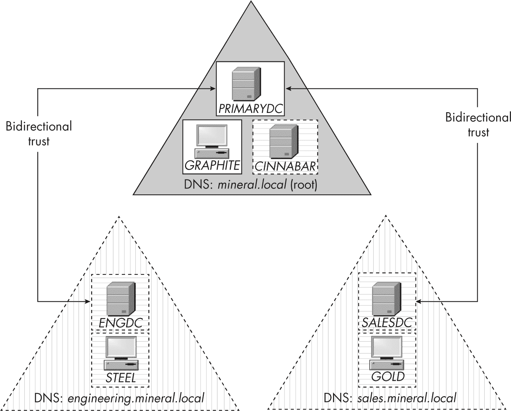

<hgroup>

# <samp class="SANS_Futura_Std_Bold_Condensed_B_11">A</samp> <samp class="SANS_Dogma_OT_Bold_B_11">构建一个用于测试的 Windows 域网络</samp>

</hgroup>


本书中的几个章节提到了一个可以用于测试的 Windows 域网络。虽然你不需要设置这样的网络来跟随章节内容，但你可以使用它来运行示例，然后修改提供的命令以观察不同的结果。如果你手头没有合适的 Windows 域网络用于测试，本附录将带你通过虚拟机设置一个网络。

在虚拟机中运行 Windows 有许多优点。首先，它可以让你完全灵活地配置（或错误配置）Windows，而不会影响你日常安装的安全性。虚拟化平台通常允许你对虚拟机进行快照，以便在出现问题时将其恢复到已知的良好状态。你还可以隔离网络流量，防止它影响同一网络中的其他系统。最后，你可以在非 Windows 环境中使用虚拟机运行 Windows。

域配置步骤尽可能使用 PowerShell。请注意，除非另有说明，你必须以管理员身份运行所有这些 PowerShell 命令。

## <samp class="SANS_Futura_Std_Bold_B_11">域网络</samp>

图 A-1 是我们将要构建的网络图。如果你想了解更多关于域网络结构的一般信息，可以参考 第十章。



<samp class="SANS_Futura_Std_Book_Oblique_I_11">图 A-1：域网络配置</samp>

网络包括一个由三个域组成的森林。该森林的根 DNS 名称是 *mineral.local*，其两个子域分别是 *engineering.mineral.local* 和 *sales.mineral.local*。为了创建一个用于测试的最小功能域，你只需要 *PRIMARYDC*（根域控制器）和 *GRAPHITE*（加入该域的工作站）。任何包含在虚线中的内容都是可选的。接下来的章节将向你展示如何设置域网络，并配置虚拟机以包含你想要的每个 Windows 系统。

## <samp class="SANS_Futura_Std_Bold_B_11">安装和配置 Windows Hyper-V</samp>

我们将使用 Hyper-V 来设置 Windows 域网络，Hyper-V 是一种虚拟化软件，Windows 专业版、企业版和教育版的 64 位版本都提供免费使用。如果你没有运行 Windows 或不想使用 Hyper-V，另一个很好的免费选项是 Oracle 的 VirtualBox（*[`<wbr>www<wbr>.virtualbox<wbr>.org`](https://www.virtualbox.org)*）。

要安装 Hyper-V 及其工具，启动一个管理员 PowerShell 控制台并运行以下命令。安装后确保重新启动系统：

```
PS> **Enable-WindowsOptionalFeature -Online -FeatureName Microsoft-Hyper-V -All** 
```

下一步是为虚拟机配置一个新的网络，如清单 A-1 所示。这使你能够完全控制域网络的所有网络配置，并将其与实际网络隔离。

```
PS> **New-VMSwitch -Name "Domain Network" -SwitchType Internal**
PS> **$index = (Get-NetAdapter |**
**Where-Object Name -Match "Domain Network").ifIndex**
PS> **New-NetIPAddress -IPAddress 192.168.99.1 -PrefixLength 24**
**-InterfaceIndex $index**
PS> **New-NetNat -Name DomNAT -InternalIPInterfaceAddressPrefix 192.168.99.0/24** 
```

清单 A-1：创建新的虚拟机网络交换机

我们首先使用<sup class="SANS_TheSansMonoCd_W5Regular_11">New-VMSwitch</sup>命令为域网络创建一个新的交换机，这个过程只需在初始配置时执行一次。我们为该交换机命名为<sup class="SANS_TheSansMonoCd_W7Bold_B_11">"</sup><sup class="SANS_TheSansMonoCd_W5Regular_11">Domain Network</sup><sup class="SANS_TheSansMonoCd_W7Bold_B_11">"</sup>，并将其类型设置为<sup class="SANS_TheSansMonoCd_W5Regular_11">Internal</sup>，这意味着它是一个可以与虚拟机主机通信的虚拟网络。

接下来，我们需要为为交换机创建的虚拟网络适配器分配一个 IP 地址。<samp class="SANS_TheSansMonoCd_W5Regular_11">Get-NetAdapter</samp> 命令列出所有网络适配器，并查找我们域网络适配器的唯一索引号。然后，我们为该适配器分配 IP 地址 192.168.99.1，并设置子网前缀为 24 位（通常以子网掩码 255.255.255.0 的形式表示）。你可以将 IP 地址设置为任何你喜欢的值，但请记住，如果你更改地址，接下来在本附录中的其他地方也需要相应更新它。

最后的步骤是为 IP 地址设置*网络地址转换（NAT）*，使用<sup class="SANS_TheSansMonoCd_W5Regular_11">New-NetNat</sup>命令。这将允许网络上的计算机通过将默认网关设置为适配器的 IP 地址（在此案例中为 192.168.99.1）来访问互联网。

> <samp class="SANS_Dogma_OT_Bold_B_15">注意</samp>
> 
> *此配置不会设置动态主机配置协议（DHCP）服务器来自动分配 IP 地址给网络上的计算机。由于网络规模较小，我们将手动为计算机分配 IP 地址。*

## <samp class="SANS_Futura_Std_Bold_B_11">创建虚拟机</samp>

表 A-1 列出了我们将要设置的虚拟机，以及每个虚拟机的操作系统类型和 IP 地址。我将带你设置*PRIMARYDC*、*GRAPHITE*和可选的*SALESDC*虚拟机。表中的其他虚拟机是完全可选的；如果你想创建它们，可以在设置每个虚拟机的章节中，使用表格中适当的值替换指定的值。

<samp class="SANS_Futura_Std_Heavy_B_11">表 A-1：</samp> <samp class="SANS_Futura_Std_Book_11">虚拟机名称和 IP 地址</samp>

| <samp class="SANS_Futura_Std_Heavy_B_11">虚拟机名称</samp> | <samp class="SANS_Futura_Std_Heavy_B_11">操作系统</samp> | <samp class="SANS_Futura_Std_Heavy_B_11">IP 地址</samp> |
| --- | --- | --- |
| <samp class="SANS_Futura_Std_Book_Oblique_I_11">PRIMARYDC</samp> | <samp class="SANS_Futura_Std_Book_11">Windows Server</samp> | <samp class="SANS_Futura_Std_Book_11">192.168.99.10</samp> |
| <samp class="SANS_Futura_Std_Book_Oblique_I_11">GRAPHITE</samp> | <samp class="SANS_Futura_Std_Book_11">Windows Professional 或 Enterprise</samp> | <samp class="SANS_Futura_Std_Book_11">192.168.99.50</samp> |
| <samp class="SANS_Futura_Std_Book_Oblique_I_11">CINNABAR</samp> | <samp class="SANS_Futura_Std_Book_11">Windows Server</samp> | <samp class="SANS_Futura_Std_Book_11">192.168.99.20</samp> |
| <samp class="SANS_Futura_Std_Book_Oblique_I_11">SALESDC</samp> | <samp class="SANS_Futura_Std_Book_11">Windows Server</samp> | <samp class="SANS_Futura_Std_Book_11">192.168.99.110</samp> |
| <samp class="SANS_Futura_Std_Book_Oblique_I_11">GOLD</samp> | <samp class="SANS_Futura_Std_Book_11">Windows Professional 或 Enterprise</samp> | <samp class="SANS_Futura_Std_Book_11">192.168.99.150</samp> |
| <samp class="SANS_Futura_Std_Book_Oblique_I_11">ENGDC</samp> | <samp class="SANS_Futura_Std_Book_11">Windows Server</samp> | <samp class="SANS_Futura_Std_Book_11">192.168.99.210</samp> |
| <samp class="SANS_Futura_Std_Book_Oblique_I_11">STEEL</samp> | <samp class="SANS_Futura_Std_Book_11">Windows Professional 或 Enterprise</samp> | <samp class="SANS_Futura_Std_Book_11">192.168.99.220</samp> |

微软提供 Windows Enterprise 和 Windows Server 的试用版虚拟机。我建议你使用你喜欢的搜索引擎查找微软网站上的最新链接。对于每台虚拟机，安装正确的 Windows 版本，然后使用 PowerShell 配置它。

要使用 Hyper-V 运行 Windows 虚拟机，你需要 Windows Professional 或 Enterprise 和 Windows Server 的安装介质及许可证密钥。获得这些的常见方式是通过 Microsoft Visual Studio 订阅。我们将讨论的主题与所使用的 Windows 和 Server 版本无关。

> <samp class="SANS_Dogma_OT_Bold_B_15">注意</samp>
> 
> *服务器安装包括一个长期服务分支，配有 Windows 桌面版本，以及一个更新版，称为* 服务器核心版本*，它仅包含命令行界面。我们将使用 PowerShell 配置服务器安装，因此两种版本都适用。不过，如果你更习惯使用图形界面，可以选择带桌面的长期服务分支版本。*

列表 A-2 定义了我们将用来执行大部分虚拟机设置工作的函数，<samp class="SANS_TheSansMonoCd_W5Regular_11">New-TestVM</samp>。

```
PS> **function New-TestVM {**
 **param(**
 **[Parameter(Mandatory)]**
 **[string]$VmName,**
 **[Parameter(Mandatory)]**
 **[string]$InstallerImage,**
 **[Parameter(Mandatory)]**
 **[string]$VmDirectory**
 **)**
❶ **New-VM -Name $VmName -MemoryStartupBytes 2GB -Generation 2**
**-NewVHDPath "$VmDirectory\$VmName\$VmName.vhdx" -NewVHDSizeBytes 80GB**
**-Path "$VmDirectory" -SwitchName "Domain Network"**
❷ **Set-VM -Name $VmName -ProcessorCount 2 -DynamicMemory**
❸ **Add-VMScsiController -VMName $VmName**
 **Add-VMDvdDrive -VMName $VmName -ControllerNumber 1 -ControllerLocation 0**
**-Path $InstallerImage**
 **$dvd = Get-VMDvdDrive -VMName $VmName**
 **Set-VMFirmware -VMName $VmName -FirstBootDevice $dvd**
**}** 
```

列表 A-2：定义 New-TestVM 函数

<samp class="SANS_TheSansMonoCd_W5Regular_11">New-TestVM</samp> 函数接受虚拟机的名称，以便它能够创建安装 DVD 镜像的路径以及虚拟机资产的基本目录。我们首先调用 <samp class="SANS_TheSansMonoCd_W5Regular_11">New-VM</samp> 命令来创建虚拟机 ❶。我们将其内存设置为 4GB，并创建一个 80GB 的虚拟硬盘。（如果需要，可以增加这些大小。）我们还分配了默认的网络适配器，使用我们在 列表 A-1 中创建的 <samp class="SANS_TheSansMonoCd_W7Bold_B_11">"</samp><samp class="SANS_TheSansMonoCd_W5Regular_11">Domain Network</samp><samp class="SANS_TheSansMonoCd_W7Bold_B_11">"</samp> 开关。

接下来，我们使用 <samp class="SANS_TheSansMonoCd_W5Regular_11">Set-VM</samp> 命令配置一些 <samp class="SANS_TheSansMonoCd_W5Regular_11">New-VM</samp> ❷ 命令未显示的虚拟机选项。我们为虚拟机分配两个 CPU，因为我发现现代版本的 Windows 在只有一个 CPU 时运行困难。如果你的主机有多个 CPU 核心，可以增加 CPU 数量。

我们还启用了动态内存。这使得 Windows 能根据需要调整虚拟机的内存使用量。我发现，通常服务器安装时运行时只需要大约 2GB 的内存，但特别是对于客户端，可能会更多。动态内存可以根据需要增加或减少分配的内存。

最后，我们在虚拟 SCSI 控制器上设置 DVD 驱动器，并将 DVD 镜像分配给它 ❸。我们将使用这个驱动器作为主要启动驱动器，从 DVD 镜像安装操作系统。

现在我们需要使用我们定义的函数创建每个虚拟机，并开始安装过程。

### <samp class="SANS_Futura_Std_Bold_Condensed_Oblique_BI_11">PRIMARYDC 服务器</samp>

*PRIMARYDC* 机器是一个 Windows 服务器，将作为我们森林的根域控制器。在 列表 A-3 中，我们首先作为管理员创建虚拟机。

```
PS> **New-TestVM -VmName "PRIMARYDC" -InstallerImage "C:\iso\server.iso"**
**-VmDirectory "C:\vms"**
PS> **vmconnect localhost PRIMARYDC**
PS> **Start-VM -VmName "PRIMARYDC"** 
```

列表 A-3：创建并启动 <samp class="SANS_Futura_Std_Book_11">PRIMARYDC</samp> 虚拟机

我们从 DVD 镜像文件 *C:\iso\server.iso* 安装 *PRIMARYDC* 虚拟机，并在 *C:\vms* 目录下创建虚拟机。这将会在虚拟机目录下为 *PRIMARYDC* 服务器的文件创建一个新的目录，从而使我们能够为每个虚拟机分隔资源。接下来，我们启动虚拟机的用户界面，以便与安装过程进行交互，然后启动虚拟机。

现在你可以与虚拟机进行交互，你可以像其他 Windows Server 安装一样按照安装步骤进行。我不会提供详细的步骤，因为它基本上是选择你的区域和安装驱动器，并按照默认流程进行。

在安装过程中，如果系统询问 *Administrator* 用户的密码，你可以设置任意密码，但在本书中我假设它将设置为 <samp class="SANS_TheSansMonoCd_W5Regular_11">Passw0rd</samp>。由于这是一个弱密码，请勿将这些虚拟机暴露到不可信的网络中。然而，出于测试和演示的目的，使用易于记忆的密码通常是个不错的选择。

一旦你获得了桌面访问权限（如果使用的是长期服务分支版本的服务器）或命令行访问权限（如果使用的是服务器核心版本），你可以完成基本设置。所有后续的 PowerShell 命令都将在虚拟机本身上运行，而不是在主机上。首先启动一个管理员权限的 PowerShell 来运行 清单 A-4 中的命令。

```
PS> **$index = (Get-NetAdapter).ifIndex**
PS> **New-NetIPAddress -InterfaceIndex $index -IPAddress 192.168.99.10**
**-PrefixLength 24 -DefaultGateway 192.168.99.1**
PS> **Set-DnsClientServerAddress -InterfaceIndex $index -ServerAddresses 8.8.8.8** 
```

清单 A-4：设置 <samp class="SANS_Futura_Std_Book_11">PRIMARYDC</samp> 虚拟机网络

由于我们之前创建的网络交换机不支持 DHCP，它在安装过程中不会自动分配 IP 地址。因此，我们需要使用静态 IP 地址来设置网络。清单 A-4 从设置网络适配器的 IP 地址开始；你应该使用 表 A-1 中为你正在配置的虚拟机指定的 IP 地址。<samp class="SANS_TheSansMonoCd_W5Regular_11">DefaultGateway</samp> 参数应该是你在 清单 A-1 中为主机设置的 IP 地址，以便流量能够路由到外部网络。

你还需要为网络适配器指定一个 DNS 服务器地址。在 清单 A-4 中，我们将其设置为公共 Google DNS 服务器的地址 8.8.8.8。如果你知道你的互联网服务提供商的 IP 地址或其他首选 DNS 服务器的地址，可以使用那个。设置完域控制器后，我们将不再需要这个 DNS 服务器，因为域控制器有自己的 DNS 服务器。

现在你应该能够访问外部网络。如果你没有使用试用版的 Windows Server，你可能需要激活你的 Windows Server 副本。你还需要确保 Windows 版本是最新的，包括所有安全补丁。尽管网络会在一定程度上将虚拟机与外部网络隔离，但这并不意味着它们不能被攻破，因此最好确保一切安全。

接下来，使用 <samp class="SANS_TheSansMonoCd_W5Regular_11">Rename-Computer</samp> 命令重命名计算机，如 清单 A-5 所示。

```
PS> **Rename-Computer -NewName "PRIMARYDC" -Restart** 
```

清单 A-5：重命名计算机

这个名称将用于域网络，因此使用容易记住的名称会很有帮助。如果你更喜欢，可以将 *PRIMARYDC* 替换为你自己的名称。

一旦你重命名了计算机，就需要将服务器配置为 *mineral.local* 域的域控制器。以管理员身份登录服务器并运行 清单 A-6 中的命令。

```
PS> **Install-WindowsFeature AD-Domain-Services**
PS> **Install-ADDSForest -DomainName mineral.local -DomainNetbiosName MINERAL**
**-InstallDns -Force**
SafeModeAdministratorPassword: ************
Confirm SafeModeAdministratorPassword: ************ 
```

清单 A-6：安装和配置活动目录域服务

首先，我们安装 <samp class="SANS_TheSansMonoCd_W5Regular_11">AD-Domain-Services</samp> 功能。该功能会安装活动目录服务器及相关服务，将服务器作为域控制器运行。接下来，我们运行 <samp class="SANS_TheSansMonoCd_W5Regular_11">Install-ADDSForest</samp> 命令来设置林并创建根域。我们指定域的 DNS 名称，在此案例中为 *mineral.local*。我们还指定域的简单名称为 *MINERAL* 并请求安装本地 DNS 服务器。活动目录在没有 DNS 服务器的情况下无法工作，而由于这是一个隔离网络，在域控制器服务器上运行 DNS 服务器是有意义的。

在设置森林时，你将被要求指定一个安全模式管理员密码。这个密码允许你恢复活动目录数据库。在如此小的、非生产域中，你不太可能需要此功能，但仍然应该指定一个你能记住的密码。你在安装过程中可能会看到一些警告，这些可以放心忽略。一旦命令完成，服务器将自动重启。

重启完成后，你需要重新验证服务器身份，但请确保使用用户名*MINERAL\Administrator*，以便你可以使用域管理员账户。域管理员的密码应该与你最初安装服务器时配置的密码相同。然后，启动 PowerShell 实例并运行清单 A-7 中的命令，进行一些基本的用户设置。

```
❶ PS> **Set-ADDefaultDomainPasswordPolicy -Identity mineral.local** 
**-MaxPasswordAge 0**
❷ PS> **$pwd = ConvertTo-SecureString -String "Passw0rd1" -AsPlainText -Force**
PS> **New-ADUser -Name alice -Country USA -AccountPassword $pwd**
**-GivenName "Alice Bombas" -Enabled $true**
PS> **$pwd = ConvertTo-SecureString -String "Passw0rd2" -AsPlainText -Force**
PS> **New-ADUser -Name bob -Country JP -AccountPassword $pwd**
**-GivenName "Bob Cordite" -Enabled $true**

❸ PS> **New-ADGroup -Name 'Local Resource' -GroupScope DomainLocal**
PS> **Add-ADGroupMember -Identity 'Local Resource' -Members 'alice'**
PS> **New-ADGroup -Name 'Universal Group' -GroupScope Universal**
PS> **Add-ADGroupMember -Identity 'Universal Group' -Members 'bob'**
PS> **New-ADGroup -Name 'Global Group' -GroupScope Global**
PS> **Add-ADGroupMember -Identity 'Global Group' -Members 'alice','bob'** 
```

清单 A-7：配置域密码策略及添加用户和组

首先，我们设置域的密码策略，以防止密码过期❶。没有什么比几个月后回到虚拟机时，看到需要更改密码，而你立刻忘记密码更糟糕的了。

> <samp class="SANS_Dogma_OT_Bold_B_15">注意</samp>
> 
> *尽管新域的默认密码过期时间为 42 天，微软不再建议启用强制密码过期功能。这是因为频繁要求用户更改密码可能会适得其反，促使用户使用简单的密码，以免忘记。*

然后，我们创建两个域用户，*alice* 和 *bob*，并为每个用户分配一个密码❷。我们还为每个用户设置了一些活动目录属性：具体来说，他们的姓名和国家。我已经在表 A-2 中总结了要指定的值。当然，你可以根据需要设置任何名称和值。

<samp class="SANS_Futura_Std_Heavy_B_11">表 A-2：</samp> <samp class="SANS_Futura_Std_Book_11">根域的默认用户</samp>

| <samp class="SANS_Futura_Std_Heavy_B_11">用户名</samp> | <samp class="SANS_Futura_Std_Heavy_B_11">姓名</samp> | <samp class="SANS_Futura_Std_Heavy_B_11">国家</samp> | <samp class="SANS_Futura_Std_Heavy_B_11">密码</samp> |
| --- | --- | --- | --- |
| <samp class="SANS_Futura_Std_Book_Oblique_I_11">alice</samp> | <samp class="SANS_Futura_Std_Book_11">Alice Bombas</samp> | <samp class="SANS_Futura_Std_Book_11">USA</samp> | <samp class="SANS_TheSansMonoCd_W5Regular_11">Passw0rd1</samp> |
| <samp class="SANS_Futura_Std_Book_Oblique_I_11">bob</samp> | <samp class="SANS_Futura_Std_Book_11">Bob Cordite</samp> | <samp class="SANS_Futura_Std_Book_11">JP</samp> | <samp class="SANS_TheSansMonoCd_W5Regular_11">Passw0rd2</samp> |

列表 A-7 中的最终任务是创建三个 Active Directory 组 ❸，每个组对应一个作用域。我们还将这两个用户分配到这些组的组合中。

### <samp class="SANS_Futura_Std_Bold_Condensed_Oblique_BI_11">GRAPHITE 工作站</samp>

配置好域控制器后，我们可以开始设置工作站。运行 列表 A-8 中的脚本创建虚拟机，正如我们在 *PRIMARYDC* 上所做的那样。

```
PS> **New-TestVM -VmName "GRAPHITE" -InstallerImage "C:\iso\client.iso"**
**-VmDirectory "C:\vms"**
PS> **vmconnect localhost GRAPHITE**
PS> **Start-VM -VmName "GRAPHITE"** 
```

列表 A-8：创建并启动 <samp class="SANS_Futura_Std_Book_11">GRAPHITE</samp> 虚拟机

在这种情况下，你将使用 Windows Professional 或 Enterprise 的磁盘镜像，而不是服务器安装。任何当前支持的 Windows 10 或更高版本都足够了。按照正常的方式进行安装，创建机器的用户名和密码。本书假设你将使用用户名 *admin* 和密码 <samp class="SANS_TheSansMonoCd_W5Regular_11">Passw0rd</samp>，但你可以选择任何你喜欢的用户名和密码。

列表 A-9 像列表 A-4 一样设置网络。

```
PS> **$index = (Get-NetAdapter).ifIndex**
PS> **New-NetIPAddress -InterfaceIndex $index -IPAddress 192.168.99.50**
**-PrefixLength 24 -DefaultGateway 192.168.99.1**
PS> **Set-DnsClientServerAddress -InterfaceIndex $index**
**-ServerAddresses 192.168.99.10**
PS> **Resolve-DnsName primarydc.mineral.local**
NameType   TTL   Section    IPAddress
--------   ---   -------    ---------
primarydc.mineral.local  A      3600  Answer     192.168.99.10

PS> **Rename-Computer -NewName "GRAPHITE" -Restart** 
```

列表 A-9：设置域 DNS 服务器并检查其解析

唯一的不同之处在于我们将 DNS 服务器配置为使用我们在域控制器上安装的服务器地址 192.168.99.10\。你可以通过尝试解析 *primarydc.mineral.local* 服务器地址来验证 DNS 服务器是否正常工作。你还应该能够解析互联网域名，因为域控制器会将请求转发。

再次提醒，配置好网络后，如果需要，确保激活 Windows 安装并下载任何更新。如果需要，你可以在继续之前将工作站重命名为你选择的名称。

在 列表 A-10 中，我们将工作站加入域。

```
PS> **$creds = Get-Credential**
PS> **Add-Computer -DomainName MINERAL -Credential $creds**
WARNING: The changes will take effect after you restart the computer GRAPHITE.

PS> **Add-LocalGroupMember -Group 'Administrators' -Member 'MINERAL\alice'**
PS> **Restart-Computer** 
```

列表 A-10：将 <samp class="SANS_Futura_Std_Book_11">GRAPHITE</samp> 工作站加入域

我们首先需要的是域中用户的凭据。正如我在 第十一章 中解释的那样，这个用户不需要是域管理员；它可以是一个普通用户。例如，你可以在 <samp class="SANS_TheSansMonoCd_W5Regular_11">Get-Credential</samp> 命令的图形界面提示中输入 *alice* 用户的凭据。

接下来，我们调用 <samp class="SANS_TheSansMonoCd_W5Regular_11">Add-Computer</samp> 命令，将工作站加入 *MINERAL* 域，并使用用户的凭据。如果成功，它会打印出一条警告，提示你重启计算机。然而，此时不要重启；你需要先使用 <samp class="SANS_TheSansMonoCd_W5Regular_11">Add-LocalGroupMember</samp> 命令将域用户（例如 *alice*）添加到本地 *Administrators* 组。如果你不执行此步骤，之后你将必须使用域管理员或原始的本地管理员账户来验证工作站的身份。将用户添加到此组可以使你以该用户身份进行验证，并成为本地管理员。完成此操作后，你可以重新启动计算机。

这就是设置工作站的全部内容。你可以通过域控制器上的组策略配置工作站的其余设置。一旦工作站重新启动，你应该能够以任何域用户身份进行身份验证。

### <samp class="SANS_Futura_Std_Bold_Condensed_Oblique_BI_11">SALESDC 服务器</samp>

*SALESDC* 虚拟机是一个 Windows 服务器，它为森林内的 *sales.mineral.local* 域提供域控制器服务。设置此机器（或其兄弟机器 *ENGDC*）是可选的：你不需要多个域森林来运行本书中的大多数示例。然而，它将允许你测试不同的行为。

列表 A-11 包括与运行 *PRIMARYDC* 虚拟机相同的命令，但使用不同的值。

```
PS> **New-TestVM -VmName "SALESDC" -InstallerImage "C:\iso\server.iso"**
**-VmDirectory "C:\vms"**
PS> **vmconnect localhost SALESDC**
PS> **Start-VM -VmName "SALESDC"** 
```

列表 A-11：创建并启动 <samp class="SANS_Futura_Std_Book_11">SALESDC</samp> 虚拟机

按照常规安装过程进行操作，当系统要求输入 *Administrator* 用户的密码时，可以设置为你喜欢的任何值。在本书中，我假设它将被设置为 <samp class="SANS_TheSansMonoCd_W5Regular_11">Passw0rd</samp>。

列表 A-12 使用 *PRIMARYDC* 上的 DNS 服务器配置虚拟机的网络。

```
PS> **$index = (Get-NetAdapter).ifIndex**
PS> **New-NetIPAddress -InterfaceIndex $index -IPAddress 192.168.99.110**
**-PrefixLength 24 -DefaultGateway 192.168.99.1**
PS> **Set-DnsClientServerAddress -InterfaceIndex $index**
**-ServerAddresses 192.168.99.10**
PS> **Rename-Computer -NewName "SALESDC" -Restart** 
```

列表 A-12：设置 <samp class="SANS_Futura_Std_Book_11">SALESDC</samp> 虚拟机网络

在森林中创建新域时，确保 DNS 客户端指向根域控制器，这一点至关重要，以便你能够解析根域信息。重命名计算机后，你需要将服务器配置为 *sales.mineral.local* 域的域控制器。以管理员身份登录服务器，并运行 列表 A-13 中的命令。

```
PS> **Install-WindowsFeature AD-Domain-Services**
PS> **Install-ADDSDomain -NewDomainName sales -ParentDomainName mineral.local**
**-NewDomainNetbiosName SALES -InstallDns -Credential (Get-Credential) -Force**
SafeModeAdministratorPassword: ************
Confirm SafeModeAdministratorPassword: ************ 
```

列表 A-13：为子域安装和配置活动目录域服务

在这里，首先像之前一样安装 <samp class="SANS_TheSansMonoCd_W5Regular_11">AD-Domain-Services</samp> 功能，然后运行 <samp class="SANS_TheSansMonoCd_W5Regular_11">Install-ADDSDomain</samp> 命令，在现有的森林中创建一个新的域。你将会被提示输入安全模式密码，和根域一样。你还必须指定根域中的管理员账户来建立信任关系。你可以使用现有的*MINERAL\Administrator*账户。

如果此步骤成功，服务器应该会重启。当你能够重新以*SALES\Administrator*用户身份进行身份验证时，你可以使用 <samp class="SANS_TheSansMonoCd_W5Regular_11">Get-ADTrust</samp> 命令验证你是否已经建立了信任关系，具体操作请参见列表 A-14。

```
PS> **Get-ADTrust -Filter * | Select Target, Direction**
Target            Direction
------            ---------
mineral.local     BiDirectional 
```

列表 A-14：验证 <samp class="SANS_Futura_Std_Book_11">SALES</samp> 域和根域之间的信任关系

你应该能看到根*mineral.local*域的一个条目。如果命令执行失败，等待几分钟让所有内容启动并重试。

此时，你可以向*SALES*域添加自己的用户和组，该域将与根域分开，尽管由于已配置的信任关系，用户应该能够跨域进行身份验证。你还可以按照为*GRAPHITE*描述的步骤安装自己的工作站，确保使用*SALESDS*的 IP 地址来指定 DNS 服务器。

你也可以在森林中创建一个单独的工程域，或者进行其他任何你想要的操作。只需重复这些步骤，修改你分配的 IP 地址和名称。然后，你应该拥有一个基本的域和森林配置，可以用来运行本书中的示例。

尽管我们已为本书配置了你需要的每个系统，但如果你愿意，你可以自由地进一步配置和自定义这些域。请记住，修改某些配置（如名称或密码）可能会改变你在书中示例中需要提供的输入。
