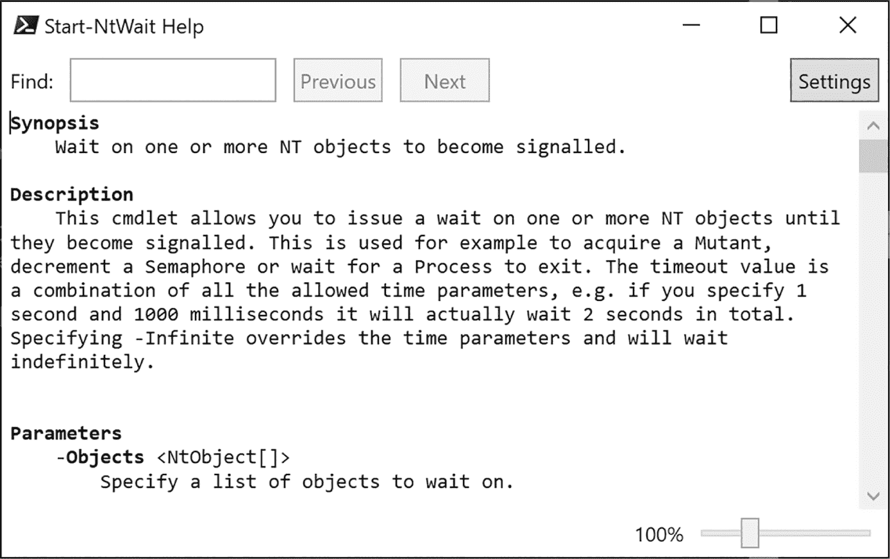
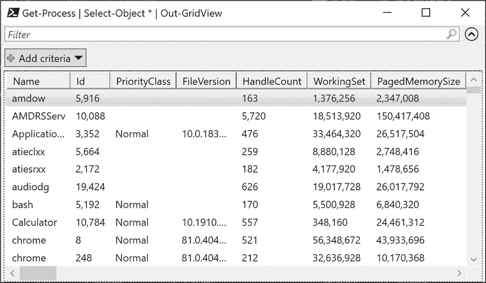

## 1 设置 PowerShell 测试环境


在本章中，你将配置 PowerShell，以便能够通过本书后续的代码示例。然后，我们将快速概述 PowerShell 语言，包括其类型、变量和表达式。我们还将介绍如何执行命令、如何获取帮助以及如何导出数据以供以后使用。

### 选择 PowerShell 版本

要有效使用本书，最重要的工具就是 PowerShell，它从 Windows 7 开始默认安装在 Windows 操作系统中。然而，这个工具有许多不同的版本。当前受支持版本的 Windows 默认安装的是 PowerShell 5.1，这对于我们的目的已经足够，尽管微软不再完全支持它。更新版本的 PowerShell 是跨平台和开源的，但需要在 Windows 上单独安装。

本书中展示的所有代码都可以在 PowerShell 5.1 和最新的开源版本中运行，因此你选择哪个版本都无妨。如果你想使用开源 PowerShell，请访问该项目的 GitHub 页面 *[`<wbr>github<wbr>.com<wbr>/PowerShell<wbr>/PowerShell`](https://github.com/PowerShell/PowerShell)*，在该页面上可以找到适用于你版本 Windows 的安装说明。

### 配置 PowerShell

在 PowerShell 中，我们首先需要设置*脚本执行策略*，它决定了 PowerShell 可以执行哪些类型的脚本。对于运行 PowerShell 5.1 的 Windows 客户端，默认策略是 Restricted，它会阻止所有脚本的执行，除非这些脚本经过受信任证书签名。由于本书中的脚本没有签名，我们将把执行策略更改为 RemoteSigned。此执行策略允许我们运行本地创建的未签名 PowerShell 脚本，但不允许执行通过 Web 浏览器下载或附加在电子邮件中的未签名脚本。运行以下命令以设置执行策略：

```
PS> **Set-ExecutionPolicy -Scope CurrentUser -ExecutionPolicy RemoteSigned -Force** 
```

该命令仅更改当前用户的执行策略，而不会影响整个系统。如果你想更改所有用户的策略，需要以管理员身份启动 PowerShell，然后重新运行该命令，去掉 Scope 参数。

如果你正在使用开源版本的 PowerShell 或在 Windows Server 上使用版本 5.1，则默认的脚本执行策略是 RemoteSigned，你无需更改任何设置。

现在我们可以运行未签名的脚本了，接下来可以安装本书中将使用的 PowerShell 模块。PowerShell *模块* 是一组脚本和 .NET 二进制文件，导出 PowerShell 命令。每个 PowerShell 安装都预装了多个模块，处理从配置应用程序到设置 Windows 更新等任务。你可以通过复制模块文件手动安装模块，但最简单的方法是使用 PowerShell Gallery（*[`<wbr>www<wbr>.powershellgallery<wbr>.com`](https://www.powershellgallery.com)*），这是一个在线模块库。

要从 PowerShell Gallery 安装模块，我们使用 PowerShell 的 Install-Module 命令。对于本书，我们需要安装 NtObjectManager 模块，使用以下命令可以完成安装：

```
PS> **Install-Module NtObjectManager -Scope CurrentUser -Force** 
```

确保如果安装程序问你任何问题时都选择“是”（当然是在你已阅读并理解问题后）。如果你已经安装了模块，可以通过使用 Update-Module 命令来确保你拥有最新版本：

```
PS> **Update-Module NtObjectManager**
```

安装完成后，你可以使用 Import-Module 命令加载模块：

```
PS> **Import-Module NtObjectManager** 
```

如果在导入模块后看到任何错误，仔细检查你是否正确设置了执行策略；这通常是模块加载不正确的最常见原因。作为最后的测试，让我们运行一个随模块附带的命令，检查它是否正常工作。执行 列表 1-1 中的命令，并验证输出是否与 PowerShell 控制台中显示的内容匹配。我们将在后续章节中探讨此命令的目的。

```
PS> **New-NtSecurityDescriptor**
Owner DACL ACE Count SACL ACE Count Integrity Level
----- -------------- -------------- ---------------
NONE  NONE           NONE           NONE 
```

列表 1-1：测试 NtObjectManager 模块是否正常工作

如果一切正常，并且你对 PowerShell 感到舒适，可以继续阅读下一章。如果你需要快速回顾 PowerShell 语言，可以继续阅读本节。

### PowerShell 语言概述

本书不打算对 PowerShell 进行全面介绍。然而，本节会涉及你需要熟悉的各种语言特性，以便更有效地使用本书。

#### 理解类型、变量和表达式

PowerShell 支持许多不同的类型，从基本的整数和字符串到复杂的对象。表 1-1 显示了一些最常见的内建类型，以及它们对应的 .NET 运行时类型和一些简单的示例。

表 1-1： 常见的基本 PowerShell 类型与 .NET 类型及示例

| 类型 | .NET 类型 | 示例 |
| --- | --- | --- |
| int | System.Int32 | 142, 0x8E, 0216 |
| long | System.Int64 | 142L, 0x8EL, 0216L |
| string | System.String | "Hello", 'World!' |
| double | System.Double | 1.0, 1e10 |
| bool | System.Boolean | $true, $false |
| array | System.Object[] | @(1, "ABC", $true) |
| hashtable | System.Collections.Hashtable | @{A=1; B="ABC"} |

要对基本类型进行计算，可以使用常见的运算符，如 +、−、* 和 /。这些运算符可以被重载；例如，+ 除了用于加法外，还用于连接字符串和数组。表 1-2 提供了常见运算符的列表，包括简单的示例及其结果。你可以自己测试这些示例，查看每个运算符的输出。

表 1-2: 常见操作符

| 操作符 | 名称 | 示例 | 结果 |
| --- | --- | --- | --- |
| + | 加法或连接 | 1 + 2, "Hello" + "World!" | 3, "HelloWorld!" |
| − | 减法 | 2 − 1 | 1 |
| * | 乘法 | 2 * 4 | 8 |
| / | 除法 | 8 / 4 | 2 |
| % | 取余 | 6 % 4 | 2 |
| [] | 索引 | @(3, 2, 1, 0)[1] | 2 |
| -f | 字符串格式化器 | "0x{0:X} {1}" -f 42, 123 | "0x2A 123" |
| -band | 按位与 | 0x1FF -band 0xFF | 255 |
| -bor | 按位或 | 0x100 -bor 0x20 | 288 |
| -bxor | 按位异或 | 0xCC -bxor 0xDD | 17 |
| -bnot | 按位取反 | -bnot 0xEE | -239 |
| -and | 布尔与 | $true -and $false | $false |
| -or | 布尔或 | $true -or $false | $true |
| -not | 布尔取反 | -not $true | $false |
| -eq | 等于 | "Hello" -eq "Hello" | $true |
| -ne | 不等于 | "Hello" -ne "Hello" | $false |
| -lt | 小于 | 4 -lt 10 | $true |
| -gt | 大于 | 4 -gt 10 | $false |

你可以使用赋值运算符=将值赋给变量。变量有一个字母数字的名称，前面带有$字符。例如，清单 1-2 展示了如何将数组捕获到变量中，并使用索引运算符查找值。

```
PS> **$var = 3, 2, 1, 0**
PS> **$var[1]**
2 
```

清单 1-2：将数组捕获到变量中，并通过变量名称进行索引

本书的其余部分还将使用一些预定义的变量。这些变量包括：

$null  表示 NULL 值，表示在比较中不存在值

$pwd  包含当前工作目录

$pid  包含 Shell 的进程 ID

$env  访问进程环境（例如，$env:WinDir 获取*Windows* 目录）

你可以使用 Get-Variable 命令枚举所有变量。

在表 1-1 中，你可能注意到有两个字符串示例，一个使用双引号，另一个使用单引号。它们之间的一个区别是，双引号字符串支持*字符串插值*，你可以在字符串中插入变量名作为占位符，PowerShell 会将其值包含在结果中。示例 1-3 展示了当你在双引号和单引号字符串中进行操作时的结果。

```
PS> **$var = 42**
PS> **"The magic number is $var"**
The magic number is 42

PS> **'It is not $var'**
It is not $var 
```

示例 1-3：字符串插值示例

首先，我们定义一个值为 42 的变量，以便插入到字符串中。然后，我们创建一个双引号字符串，其中包含变量名。结果是字符串，其中变量名被其格式化为字符串的值替换。（如果你希望更好地控制格式，可以使用表 1-2 中定义的字符串格式化操作符。）

接下来，为了演示单引号字符串的不同表现，我们定义了一个内联包含变量名的单引号字符串。我们可以观察到，在这种情况下，变量名被逐字复制，并没有被值替换。

另一个区别是双引号字符串可以包含在单引号字符串中被忽略的字符转义。这些转义使用类似于 C 语言的语法，但 PowerShell 使用反引号（`）而不是反斜杠字符（\）。这是因为 Windows 使用反斜杠作为路径分隔符，如果每次都需要转义反斜杠，编写文件路径会非常麻烦。表 1-3 列出了你可以在 PowerShell 中使用的字符转义。

表 1-3： 字符串字符转义

| 字符转义 | 名称 |
| --- | --- |
| `0 | NUL 字符，值为零 |
| `a | 铃声 |
| `b | 退格符 |
| `n | 换行符 |
| `r | 回车符 |
| `t | 水平制表符 |
| `v | 垂直制表符 |
| `` | 反引号字符 |
| `" | 双引号字符 |

如果你想在双引号字符串中插入一个双引号字符，你需要使用`"转义字符。要在单引号字符串中插入单引号字符，你需要将引号字符加倍：例如，'Hello''There'会转换成Hello'There。另外请注意表格中提到的 NUL 字符。由于 PowerShell 使用的是.NET 字符串类型，它可以包含嵌入的 NUL 字符。与 C 语言不同，添加 NUL 字符不会提前终止字符串。

因为所有值都是.NET 类型，所以我们可以在对象上调用方法并访问属性。例如，下面的代码调用了ToCharArray方法，将字符串转换为单个字符的数组：

```
PS> **"Hello".ToCharArray()**
H
e
l
l
o 
```

我们可以使用 PowerShell 构造几乎任何.NET 类型。最简单的方法是通过在方括号中指定.NET 类型来将值转换为该类型。在进行类型转换时，PowerShell 会尝试查找适合该类型的构造函数并调用它。例如，下面的命令将字符串转换为System.Guid对象；PowerShell 会找到接受字符串的构造函数并调用它：

```
PS> **[System.Guid]"6c0a3a17-4459-4339-a3b6-1cdb1b3e8973"** 
```

你也可以通过在类型上调用new方法显式地调用构造函数。之前的示例可以重写如下：

```
PS> **[System.Guid]::new("6c0a3a17-4459-4339-a3b6-1cdb1b3e8973")** 
```

这种语法也可以用来调用类型上的静态方法。例如，下面的代码调用了NewGuid静态方法来创建一个新的随机全局唯一标识符（GUID）：

```
PS> **[System.Guid]::NewGuid()** 
```

你也可以使用New-Object命令来创建新对象：

```
PS> **New-Object -TypeName Guid -ArgumentList "6c0a3a17-4459-4339-a3b6-1cdb1b3e8973"** 
```

这个示例等同于调用静态的new函数。

#### 执行命令

几乎所有 PowerShell 命令都遵循一种常见的命名模式：一个动词和一个名词，通过连字符分隔。例如，考虑命令 Get-Item。Get 动词表示获取现有资源，而 Item 则是要返回的资源类型。

每个命令都可以接受一系列参数，这些参数控制命令的行为。例如，Get-Item 命令接受一个 Path 参数，该参数指示要检索的现有资源，如下所示：

```
PS> **Get-Item -Path "C:\Windows"** 
```

Path 参数是一个 *位置* 参数。这意味着你可以省略参数的名称，PowerShell 会尽力选择最合适的匹配项。因此，之前的命令也可以写成如下形式：

```
PS> **Get-Item "C:\Windows"** 
```

如果一个参数接受字符串值，并且字符串不包含任何特殊字符或空格，那么你无需在字符串周围使用引号。例如，Get-Item 命令也可以像下面这样使用：

```
PS> **Get-Item C:\Windows** 
```

单个命令的输出是零个或多个值，这些值可以是基本类型或复杂对象类型。你可以使用 *管道*（由竖线字符 | 表示）将一个命令的输出作为输入传递给另一个命令。稍后在本章中，我们会通过过滤、分组和排序的例子来演示如何使用管道。

你可以将整个命令或管道的结果捕获到一个变量中，然后与结果进行交互。例如，下面的命令捕获了 Get-Item 命令的结果，并查询 FullName 属性：

```
PS> **$var = Get-Item -Path "C:\Windows"**
PS> **$var.FullName**
C:\Windows 
```

如果你不想将结果捕获到变量中，你可以将命令括在圆括号中，直接访问其属性和方法：

```
PS> **(Get-Item -Path "C:\Windows").FullName**
C:\Windows 
```

命令行的长度实际上是无限的。然而，你应该尝试将长行分开，以使命令更易读。Shell 会在管道字符上自动拆分一行。如果你需要拆分一行且没有管道符，你可以使用反引号字符，然后开始新的一行。反引号必须是行尾的最后一个字符；否则，脚本解析时会发生错误。

#### 发现命令和获取帮助

默认安装的 PowerShell 有成百上千的命令可供选择。这意味着找到执行特定任务的命令可能很困难，即使你找到了命令，如何使用它也可能不清晰。为了帮助，你可以使用两个内置命令，Get-Command和Get-Help。

Get-Command命令可用于列举所有可用的命令。在最简单的形式下，你可以在不带任何参数的情况下执行它，它将打印出所有模块中的所有命令。然而，通常更有用的是筛选出你感兴趣的特定词。例如，Listing 1-4 将仅列出名称中包含SecurityDescriptor的命令。

```
PS> **Get-Command -Name *SecurityDescriptor***
CommandType     Name                              Source
-----------     ----                              ------
Function        Add-NtSecurityDescriptorControl   NtObjectManager
Function        Add-NtSecurityDescriptorDaclAce   NtObjectManager
Function        Clear-NtSecurityDescriptorDacl    NtObjectManager
Function        Clear-NtSecurityDescriptorSacl    NtObjectManager
`--snip--` 
```

Listing 1-4：使用 Get-Command 列举命令

这个命令使用*通配符语法*来列出仅包含指定单词的命令。通配符语法使用*字符来表示任何字符或字符序列。在这里，我们在SecurityDescriptor的两侧都加上了*，表示它前后可以有任意文本。

你还可以列出某个模块中可用的命令。例如，Listing 1-5 将仅列出由NtObjectManager模块导出的并以动词Start开头的命令。

```
PS> **Get-Command -Module NtObjectManager -Name Start-***
CommandType     Name                             Source
-----------     ----                             ------
Function        Start-AccessibleScheduledTask    NtObjectManager
Function        Start-NtFileOplock               NtObjectManager
Function        Start-Win32ChildProcess          NtObjectManager
Cmdlet          Start-NtDebugWait                NtObjectManager
Cmdlet          Start-NtWait                     NtObjectManager 
```

Listing 1-5：使用 Get-Command 列举 NtObjectManager 模块中的命令

一旦你找到了一个看起来有前景的命令，你可以使用Get-Help命令来检查它的参数并获取一些用法示例。在 Listing 1-6 中，我们从 Listing 1-5 中拿出<code>Start-NtWait</code>命令并传递给Get-Help。

```
PS> **Get-Help Start-NtWait**
NAME
  ❶ Start-NtWait
SYNOPSIS
  ❷ Wait on one or more NT objects to become signaled.
SYNTAX
  ❸ Start-NtWait [-Object] <NtObject[]> [-Alertable <SwitchParameter>]
    [-Hour <int>] [-MilliSecond <long>]
    [-Minute <int>] [-Second <int>] [-WaitAll <SwitchParameter>]
    [<CommonParameters>]

    Start-NtWait [-Object] <NtObject[]> [-Alertable <SwitchParameter>]
    [-Infinite <SwitchParameter>] [-WaitAll <SwitchParameter>]
    [<CommonParameters>]
DESCRIPTION
  ❹ This cmdlet allows you to issue a wait on one or more NT
    objects until they become signaled.
`--snip--` 
```

Listing 1-6：显示 Start-NtWait 命令的帮助

默认情况下，Get-Help输出命令的名称❶，简短的概述❷，命令的语法❸，以及更深入的描述❹。在命令语法部分，你可以看到它的多种可能操作模式：在这种情况下，可以指定小时、分钟、秒和/或毫秒的时间，或者指定Infinite来无限期等待。

当语法的任何部分显示在括号中[]时，表示它是可选的。例如，唯一必需的参数是Object，它接受一个NtObject值的数组。即使该参数的名称也是可选的，因为-Object是括起来的。

你可以通过使用Parameter命令获取更多关于参数的信息。列表 1-7 显示了<Object>参数的详细信息。

```
PS> **Get-Help Start-NtWait -Parameter Object**
-Object <NtObject[]>
    Specify a list of objects to wait on.

    Required?                    true
    Position?                    0
    Default value
    Accept pipeline input?       true (ByValue)
    Accept wildcard characters?  False 
```

列表 1-7：使用 Parameter 命令查询 Object 参数的详细信息

你可以使用通配符语法来选择一组相似的参数名称。例如，如果你指定Obj*，那么你将获取所有名称以Obj为前缀的参数的详细信息。

如果你想查看命令的使用示例，请使用Examples参数，如列表 1-8 所示。

```
PS> **Get-Help Start-NtWait -Examples**
`--snip--`
    ----------  EXAMPLE 1  ----------
 ❶ $ev = Get-NtEvent \BaseNamedObjects\ABC
    Start-NtWait $ev -Second 10

 ❷ Get an event and wait for 10 seconds for it to be signaled.
`--snip--` 
```

列表 1-8：显示 Start-NtWait 的示例

每个示例应包括一行或两行 PowerShell 脚本片段 ❶ 和对其功能的描述 ❷。你还可以通过指定Full参数查看命令的完整帮助输出。要在单独的弹出窗口中查看该输出，请使用ShowWindow参数。例如，可以尝试运行以下命令：

```
PS> **Get-Help Start-NtWait -ShowWindow** 
```

你应该会看到在图 1-1 中显示的对话框。



图 1-1：使用 ShowWindow 参数显示 Get-Help 信息的对话框

最后要提到的一点是关于命令的，你可以设置*别名*，即命令的替代名称。例如，你可以使用别名来使命令的输入更短。PowerShell 提供了许多预定义的别名，你也可以使用New-Alias命令定义自己的别名。例如，我们可以将Start-NtWait命令设置为别名swt，方法如下：

```
PS> **New-Alias -Name swt -Value Start-NtWait** 
```

要显示所有已定义的别名列表，请使用Get-Alias命令。我们将在本书中尽量避免不必要地使用别名，因为如果你不知道别名代表什么，脚本可能会变得更加混乱。

#### 定义函数

和所有编程语言一样，PowerShell 中减少复杂性是很有必要的。减少复杂性的一种方法是将常用代码组合成一个函数。定义了函数后，PowerShell 脚本可以调用该函数，而无需在多个地方重复相同的代码。PowerShell 中的基本函数语法很简单；Listing 1-9 展示了一个示例。

```
PS> **function Get-NameValue** **{**
    **param(**
        **[string]$Name = "",**
        **$Value**
    **)**
    **return "We've got $Name with value $Value"**
**}**

PS> **Get-NameValue -Name "Hello" -Value "World"**
We've got Hello with value World

PS> **Get-NameValue "Goodbye" 12345**
We've got Goodbye with value 12345 
```

Listing 1-9: 定义一个名为 Get-NameValue 的简单 PowerShell 函数

定义函数的语法以关键字function开始，后面跟着你想定义的函数名。虽然不要求使用标准的 PowerShell 命令命名约定（即动词后跟名词），但这样做是有好处的，因为它能清楚地告诉用户你的函数功能是什么。

接下来，定义函数的命名参数。像变量一样，参数通过名称前加$来定义，如 Listing 1-9 所示。你可以在方括号中指定类型，但这是可选的；在这个例子中，$Name是一个字符串，而$Value参数可以接受调用方传递的任何值。指定命名参数并不是必须的。如果没有包含param块，则所有传递的参数将放入$args数组中。第一个参数位于$args[0]，第二个位于$args[1]，以此类推。

Get-NameValue函数的主体接受参数，并使用字符串插值构建一个字符串。该函数通过return关键字返回字符串，且同时立即结束函数。在这种情况下，你可以省略return关键字，因为 PowerShell 会返回未被变量捕获的任何值。

定义完函数后，我们调用它。你可以显式指定参数名称。然而，如果调用没有歧义，那么不需要指定参数名称。Listing 1-9 展示了这两种方法。

如果你想运行一个小块代码而不定义函数，可以创建一个脚本块。*脚本块*是一个或多个语句，封装在大括号{}中。这个块可以赋值给一个变量，并在需要时使用Invoke-Command命令或&运算符执行，如 Listing 1-10 所示。

```
PS> **$script = {Write-Output "Hello"}**
PS> **& $script**
Hello 
```

列表 1-10：创建脚本块并执行它

#### 显示和操作对象

如果你执行命令但没有将结果捕获到变量中，结果会传递到 PowerShell 控制台。控制台会使用格式化器来显示结果，采用表格或列表格式（格式会根据结果中包含的对象类型自动选择）。也可以指定自定义格式化器。例如，如果使用内置的 Get-Process 命令来检索正在运行的进程列表，PowerShell 会使用自定义格式化器将条目显示为表格，如 列表 1-11 所示。

```
PS> **Get-Process**
Handles  NPM(K)    PM(K)      WS(K)     CPU(s)     Id  SI ProcessName
-------  ------    -----      -----     ------     --  -- -----------
    476      27    25896      32044      2.97   3352   1 ApplicationFrameHost
    623      18    25096      18524    529.95  19424   0 audiodg
    170       8     6680       5296       0.08   5192   1 bash
    557      31    23888        332       0.59  10784   1 Calculator
`--snip--` 
```

列表 1-11：将进程列表输出为表格

如果你想减少输出中的列数，可以使用 Select-Object 命令来选择你需要的属性。例如，列表 1-12 选择了 Id 和 ProcessName 属性。

```
PS> **Get-Process | Select-Object Id, ProcessName**
   Id ProcessName
   -- -----------
 3352 ApplicationFrameHost
19424 audiodg
 5192 bash
10784 Calculator
`--snip--` 
```

列表 1-12：仅选择 Id 和 ProcessName 属性

你可以通过使用 Format-Table 或 Format-List 命令来改变输出的默认行为，这会强制分别采用表格或列表格式。例如，列表 1-13 展示了如何使用 Format-List 命令将输出更改为列表。

```
PS> **Get-Process | Format-List**
Id      : 3352
Handles : 476
CPU     : 2.96875
SI      : 1
Name    : ApplicationFrameHost
`--snip--` 
```

列表 1-13：使用 Format-List 以列表视图显示进程

要查找可用属性的名称，可以在 Get-Process 返回的一个对象上使用 Get-Member 命令。例如，列表 1-14 列出了 Process 对象的属性。

```
PS> **Get-Process | Get-Member -Type Property**
   TypeName: System.Diagnostics.Process
Name                MemberType Definition
----                ---------- ----------
BasePriority        Property   int BasePriority {get;}
Container           Property   System.ComponentModel.IContainer Container {get;}
EnableRaisingEvents Property   bool EnableRaisingEvents {get;set;}
ExitCode            Property   int ExitCode {get;}
ExitTime            Property   datetime ExitTime {get;}
`--snip--` 
```

列表 1-14：使用 Get-Member 命令列出 Process 对象的属性

你可能注意到输出中没有包括其他属性。要显示这些属性，需要覆盖自定义格式化。访问隐藏属性的最简单方法是使用 Select-Object 显式提取值，或者指定要显示的属性给 Format-Table 或 Format-List 命令。你可以使用 * 作为通配符来显示所有属性，如 列表 1-15 所示。

```
PS> **Get-Process | Format-List ***
Name            : ApplicationFrameHost
Id              : 3352
PriorityClass   : Normal
FileVersion     : 10.0.18362.1 (WinBuild.160101.0800)
HandleCount     : 476
WorkingSet      : 32968704
PagedMemorySize : 26517504
`--snip--` 
```

列表 1-15：以列表方式显示 Process 对象的所有属性

许多对象还具有可以调用的方法，以在对象上执行某些操作。列表 1-16 显示了如何使用 Get-Member 查询方法。

```
PS> **Get-Process | Get-Member -Type Method**
   TypeName: System.Diagnostics.Process

Name                MemberType Definition
----                ---------- ----------
BeginErrorReadLine  Method     void BeginErrorReadLine()
BeginOutputReadLine Method     void BeginOutputReadLine()
CancelErrorRead     Method     void CancelErrorRead()
CancelOutputRead    Method     void CancelOutputRead()
Close               Method     void Close()
`--snip--` 
```

列表 1-16：在 Process 对象上显示方法

如果命令的输出太长，无法在屏幕上完全显示，你可以通过 *分页* 输出，让只有第一部分显示，控制台会等待你按下一个键后再显示更多内容。你可以通过将输出通过管道传递给 Out-Host 命令并指定 Paging 参数，或者使用 more 命令来启用分页。列表 1-17 显示了一个示例。

```
PS> **Get-Process | Out-Host -Paging**
Handles  NPM(K)    PM(K)      WS(K)     CPU(s)     Id  SI ProcessName
-------  ------    -----      -----     ------     --  -- -----------
    476      27    25896      32044       2.97   3352   1 ApplicationFrameHost
    623      18    25096      18524     529.95  19424   0 audiodg
    170       8     6680       5296       0.08   5192   1 bash
    557      31    23888        332       0.59  10784   1 Calculator
<SPACE> next page; <CR> next line; Q quit 
```

列表 1-17：使用 Out-Host 分页输出

你可以通过在自己的脚本中使用 Write-Host 命令直接向控制台窗口写入内容。这允许你使用 ForegroundColor 和 BackgroundColor 参数更改输出的颜色，以适应你的个人喜好。它还有一个优点，即默认情况下不会将对象插入管道，如下所示：

```
PS> **$output = Write-Host "Hello"**
Hello 
```

这意味着默认情况下，你不能将输出重定向到文件或管道。然而，你可以通过使用以下命令将其流重定向到标准输出流来重定向主机输出：

```
PS> **$output = Write-Host "Hello" 6>&1**
PS> **$output**
Hello 
```

PowerShell 还支持一个基本的图形用户界面（GUI）来显示对象的表格。要访问它，使用 Out-GridView 命令。请注意，定制格式仍然会限制 PowerShell 显示的列。如果你想查看其他列，可以在管道中使用 Select-Object 来选择属性。以下示例展示了如何在网格视图 GUI 中显示所有属性：

```
PS> **Get-Process | Select-Object * | Out-GridView** 
```

运行此命令应该会显示类似于 图 1-2 的对话框。



图 1-2：在网格视图中显示 Process 对象

你可以在网格视图 GUI 中筛选和操作数据。试着操作控制项。你还可以为 Out-GridView 指定 PassThru 参数，这样命令将等待你在 GUI 中点击确认按钮。点击确认时，视图中选择的任何行都会写入命令管道。

#### 筛选、排序和分组对象

传统的 shell 在命令之间传递原始文本；而 PowerShell 传递对象。传递对象使你能够访问对象的单个属性并轻松地过滤管道。你甚至可以轻松地对对象进行排序和分组。

你可以使用<sup>Where-Object</sup>命令来过滤对象，该命令有别名<sup>Where</sup>和<sup>?</sup>。最简单的过滤方法是检查参数的值，如在清单 1-18 中所示，我们通过内建的<sup>Get-Process</sup>命令的输出来过滤并查找<sup>explorer</sup>进程。

```
PS> **Get-Process | Where-Object ProcessName -EQ "explorer"**
Handles  NPM(K)    PM(K)      WS(K)     CPU(s)     Id  SI ProcessName
-------  ------    -----      -----     ------     --  -- -----------
   2792     130   118152     158144     624.83    6584  1 explorer 
```

清单 1-18：使用 Where-Object 过滤进程列表

在清单 1-18 中，我们只通过<sup>Process</sup>对象，其中<sup>ProcessName</sup>等于(<sup>-EQ</sup>) <sup>"explorer"</sup>。有许多运算符可以用于过滤，其中一些显示在表 1-4 中。

表 1-4： Where-Object 常见运算符 Where-Object

| 运算符 | 示例 | 描述 |
| --- | --- | --- |
| -EQ | ProcessName -EQ "explorer" | 与值相等 |
| -NE | ProcessName -NE "explorer" | 与值不相等 |
| -Match | ProcessName -Match "ex.*" | 使用正则表达式匹配字符串 |
| -NotMatch | ProcessName -NotMatch "ex.*" | 反向匹配 -Match 操作符 |
| -Like | ProcessName -Like "ex*" | 与通配符匹配的字符串 |
| -NotLike | ProcessName -NotLike "ex*" | -Like 操作符的 反向 |
| -GT | ProcessName -GT "ex" | 大于比较 |
| -LT | ProcessName -LT "ex" | 小于比较 |

你可以通过在 Where-Object 命令上使用 Get-Help 来调查所有受支持的操作符。如果过滤条件比简单的比较更复杂，你可以使用脚本块。脚本块应该返回 True 以保持对象在管道中，或者返回 False 以过滤它。例如，你也可以像下面这样编写 Listing 1-18：

```
PS> **Get-Process | Where-Object {$_.ProcessName -eq "explorer"}** 
```

传递给脚本块的 $_ 变量表示管道中的当前对象。通过使用脚本块，你可以在过滤中访问整个语言功能，包括调用函数。

要对对象进行排序，使用 Sort-Object 命令。如果对象可以排序（如字符串或数字），你只需要将对象传送到命令中。否则，你需要指定一个属性来排序。例如，你可以按句柄计数（由 Handles 属性表示）对进程列表进行排序，如 Listing 1-19 中所示。

```
PS> **Get-Process | Sort-Object Handles**
Handles  NPM(K)    PM(K)      WS(K)     CPU(s)     Id  SI ProcessName
-------  ------    -----      -----     ------     --  -- -----------
      0       0       60          8                 0   0 Idle
     32       9     4436       6396              1032   1 fontdrvhost
     53       3     1148       1080               496   0 smss
     59       5      804       1764               908   0 LsaIso
`--snip--` 
```

Listing 1-19: 按句柄数量排序进程

要按降序而非升序排序，请使用 Descending 参数，如 Listing 1-20 中所示。

```
PS> **Get-Process | Sort-Object Handles -Descending**
Handles   NPM(K)    PM(K)      WS(K)     CPU(s)      Id   SI  ProcessName
-------  ------     -----      -----     ------      --   --  -----------
   5143       0       244      15916                  4    0  System
   2837     130    116844     156356     634.72    6584    1  explorer
   1461      21     11484      16384               1116    0  svchost
   1397      52     55448       2180      12.80   12452    1  Microsoft.Photos 
```

Listing 1-20: 按句柄数量降序排序进程

你也可以通过在此阶段指定 Unique 参数来过滤重复项，使用 Sort-Object 命令。

最后，您可以使用 Group-Object 命令根据属性名称对对象进行分组。 列表 1-21 显示该命令返回一个对象列表，每个对象包含 Count、Name 和 Group 属性。

```
PS> **Get-Process | Group-Object ProcessName**
Count Name                 Group
----- ----                 -----
    1 ApplicationFrameHost {System.Diagnostics.Process (ApplicationFrameHost)}
    1 Calculator           {System.Diagnostics.Process (Calculator)}
   11 conhost              {System.Diagnostics.Process (conhost)...}
`--snip--` 
```

列表 1-21：按 ProcessName 分组进程对象

另外，您也可以将所有这些命令一起使用在一个管道中，如 列表 1-22 所示。

```
PS> **Get-Process | Group-Object ProcessName |**
**Where-Object Count -GT 10 | Sort-Object Count**
Count Name                 Group
----- ----                 -----
   11 conhost              {System.Diagnostics.Process (conhost),...}
   83 svchost              {System.Diagnostics.Process (svchost),...} 
```

列表 1-22：结合 Where-Object、Group-Object 和 Sort-Object

#### 导出数据

一旦您获得了想要检查的完美对象集，您可能想将这些信息持久化到磁盘上的文件中。PowerShell 提供了许多选项，我将讨论其中的几个。第一个选项是使用 Out-File 将对象输出到文件作为文本。此命令捕获格式化后的文本输出并将其写入文件。您可以使用 Get-Content 重新读取该文件，如 列表 1-23 所示。

```
PS> **Get-Process | Out-File processes.txt**
PS> **Get-Content processes.txt**
Handles  NPM(K)    PM(K)      WS(K)     CPU(s)     Id  SI ProcessName
-------  ------    -----      -----     ------     --  -- -----------
    476      27    25896      32044       2.97   3352   1 ApplicationFrameHost
    623      18    25096      18524     529.95  19424   0 audiodg
    170       8     6680      5296       0.08   5192   1 bash
    557      31    23888        332       0.59  10784   1 Calculator
`--snip--` 
```

列表 1-23：将内容写入文本文件并重新读取

您也可以使用大于符号将输出发送到文件，就像在其他 Shell 中一样。例如：

```
PS> **Get-Process > processes.txt** 
```

如果您需要更结构化的格式，可以使用 Export-Csv 将对象转换为逗号分隔值（CSV）表格格式。然后，您可以将此文件导入电子表格程序，以便离线分析。 列表 1-24 中的示例选择了 Process 对象的一些属性，并将它们导出到 CSV 文件 *processes.csv* 中。

```
PS> **Get-Process | Select-Object Id, ProcessName |**
**Export-Csv processes.csv -NoTypeInformation**
PS> **Get-Content processes.csv**
"Id","ProcessName"
"3352","ApplicationFrameHost"
"19424","audiodg"
"5192","bash"
"10784","Calculator"
`--snip--` 
```

列表 1-24：将对象导出到 CSV 文件

您可以使用 Import-Csv 命令重新导入 CSV 数据。不过，如果您计划导出数据并在稍后重新导入，您可能会更倾向于使用 CLI XML 格式。该格式可以包含原始对象的结构和类型，从而在导入数据时重建它。 列表 1-25 显示了如何使用 Export-CliXml 和 Import-CliXml 命令以这种格式导出对象并重新导入。

```
PS> **Get-Process | Select-Object Id, ProcessName | Export-CliXml processes.xml**
PS> **Get-Content processes.xml**
<Objs Version="1.1.0.1" xmlns="http://schemas.microsoft.com/powershell/2004/04">
  <Obj RefId="0">
    <TNRef RefId="0" />
    <MS>
      <I32 N="Id">3352</I32>
      <S N="ProcessName">ApplicationFrameHost</S>
    </MS>
  </Obj>
`--snip--`
</Objs>
PS> **$ps = Import-CliXml processes.xml**
PS> **$ps[0]**
  Id ProcessName
  -- -----------
3352 ApplicationFrameHost 
```

列表 1-25：导出并重新导入 CLI XML 文件

这就是我们对 PowerShell 语言的讨论。如果您有些生疏，建议您读一本关于这个主题的好书，例如 Adam Bertram 的 *PowerShell for Sysadmins*（No Starch Press，2020）。

### 总结

本章简要概述了如何设置 PowerShell 环境，以便运行本书中包含的代码示例。我们讨论了配置 PowerShell 以运行脚本和安装所需的外部 PowerShell 模块。

本章的其余部分介绍了 PowerShell 语言的背景知识。这包括 PowerShell 语法的基础，以及如何使用 Get-Command 查找命令，使用 Get-Help 获取帮助，以及显示、筛选、分组和导出 PowerShell 对象。

在掌握了 PowerShell 的基础知识后，我们可以开始深入了解 Windows 操作系统的内部工作原理。在下一章，我们将讨论 Windows 内核以及如何使用 PowerShell 与它进行交互。
