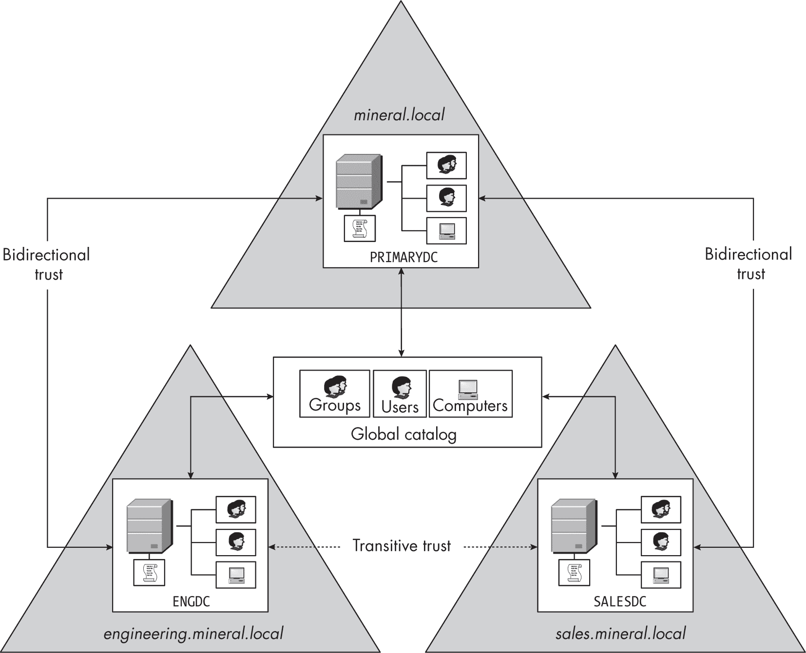
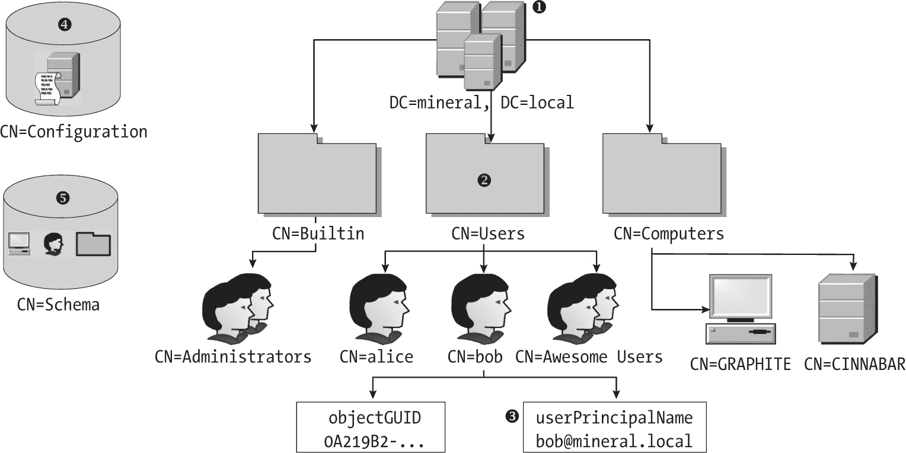
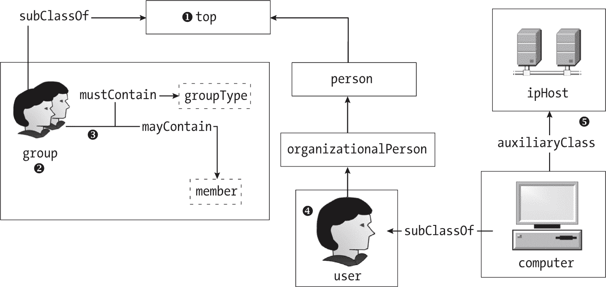
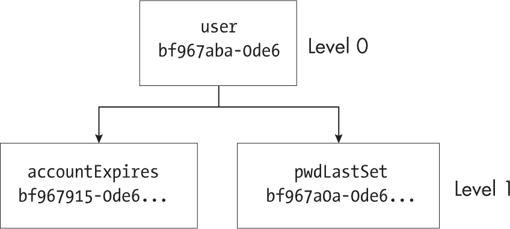
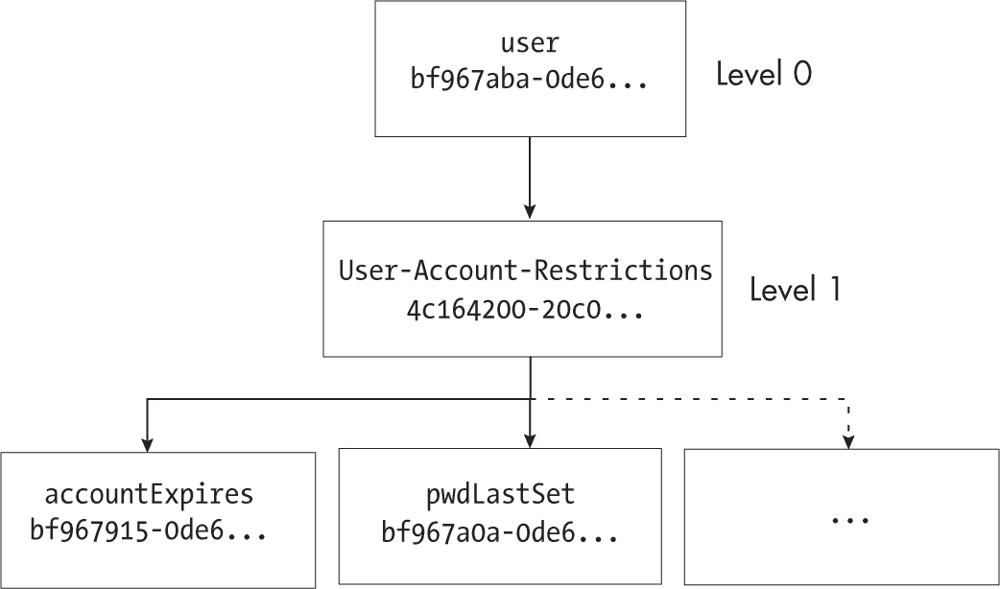
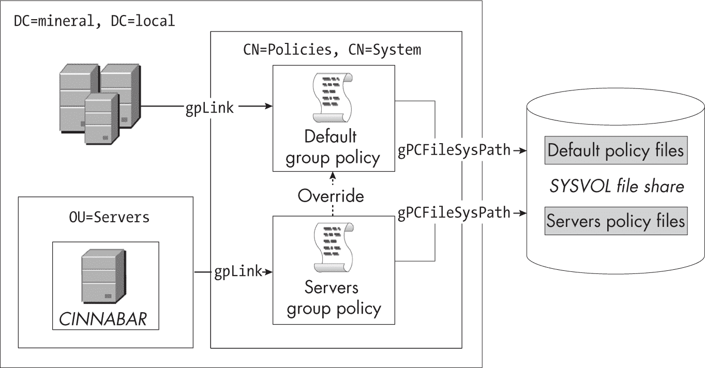

<hgroup>

## <samp class="SANS_Futura_Std_Bold_Condensed_B_11">11</samp> <samp class="SANS_Dogma_OT_Bold_B_11">ACTIVE DIRECTORY</samp>

</hgroup>


上一章描述了本地域的身份验证配置。在本章中，我们将详细介绍 Active Directory 如何在企业网络域上存储用户和组配置。我们将从检查域配置开始，使用各种 PowerShell 命令列出已配置的信任关系、用户和组。然后，我们将深入探讨 Active Directory 的结构，以及如何通过网络访问其原始信息。

一旦你理解了 Active Directory 的结构，我们将探讨 Windows 如何确定谁可以检查和修改它。正如你将看到的，和大多数 Windows 平台一样，Active Directory 使用安全描述符来授予或拒绝对配置的访问权限。

### <samp class="SANS_Futura_Std_Bold_B_11">Active Directory 简史</samp>

在 Windows 2000 之前，企业网络的用户配置存储在网络域控制器上的 SAM 数据库中。域控制器通过 Netlogon 协议对用户进行身份验证，该协议依赖于 MD4 密码哈希格式。要修改 SAM 数据库，你可以使用之前章节中提到的 SAM 远程服务。该服务允许管理员在域控制器上添加或删除用户和组。

随着企业网络变得越来越复杂，SAM 数据库格式证明了其局限性。Windows 2000 对企业网络进行全面改革，将用户配置转移到 Active Directory，并将主要的身份验证协议从 Netlogon 更改为 Kerberos。

Active Directory 相对于 SAM 数据库提供了几个优势，因为它是可扩展的，并且可以存储任意数据。例如，管理员可以将额外的信息与用户的配置一起存储，以表示他们的安全许可级别，应用程序可以在授予或拒绝访问资源时检查这些信息。Active Directory 还具有细粒度的安全性，允许管理员比 SAM 更轻松地将配置的部分委派给不同的用户。

Active Directory 存储在域控制器本地，网络中的计算机可以使用 *轻量目录访问协议（LDAP）* 访问它，该协议通过 TCP/IP 网络连接在端口 389 上暴露。LDAP 源自更复杂的 *目录访问协议（DAP）*，后者是 X.500 目录服务规范的一部分。如果你熟悉 X.509 证书格式，用于在安全网站上交换公钥信息，那么接下来的某些概念可能会显得熟悉。

### <samp class="SANS_Futura_Std_Bold_B_11">使用 PowerShell 探索 Active Directory 域</samp>

让我们从高层次了解一下域配置，开始探索 Active Directory。图 11-1 展示了一个示例森林（当然，你的配置可能有所不同）。



<samp class="SANS_Futura_Std_Book_Oblique_I_11">图 11-1：一个示例 Windows 森林</samp>

为了探索这个森林，我们将运行各种 PowerShell 命令，以列举它的域、用户、组和设备。如果你想跟随操作，你可以在附录 A 中找到类似域配置的设置说明。

#### <samp class="SANS_Futura_Std_Bold_Condensed_Oblique_BI_11">远程服务器管理工具</samp>

我们可以通过 PowerShell 的<samp class="SANS_TheSansMonoCd_W5Regular_11">ActiveDirectory</samp>模块与 Active Directory 服务器进行交互，该模块随可选的远程服务器管理工具(RSAT)Windows 功能一起提供。默认情况下，只有域控制器安装了 RSAT，因为这些命令是为管理目录设计的（并非每个客户端系统都需要执行这些操作）。

因此，你可能需要在运行本章示例脚本之前安装 RSAT。如果你使用的是 Windows 10 版本 1809 之前的旧版 Windows，你必须从微软网站下载 RSAT。如果你使用的是更新版本的 Windows，你可以通过在管理员 PowerShell 控制台中运行清单 11-1 中的命令来安装 RSAT。

```
PS> **$cap_name = Get-WindowsCapability -Online |**
**Where-Object Name -Match 'Rsat.ActiveDirectory.DS-LDS.Tools'**
PS> **Add-WindowsCapability -Name $cap_name.Name -Online** 
```

清单 11-1：安装远程服务器管理工具

请注意，除非在加入 Windows 企业网络的计算机上运行这些命令，否则本节中的示例将无法正常工作，具体网络配置请参见附录 A。

#### <samp class="SANS_Futura_Std_Bold_Condensed_Oblique_BI_11">基本的森林和域信息</samp>

让我们从收集一些关于我们连接的森林和域的基本信息开始。你可以通过在示例森林的根域*mineral.local*的计算机上执行清单 11-2 中的命令来跟随操作。

```
❶ PS> **$forest = Get-ADForest**
❷ PS> **$forest.Domains**
mineral.local
sales.mineral.local
engineering.mineral.local

❸ PS> **$forest.GlobalCatalogs**
PRIMARYDC.mineral.local
SALESDC.sales.mineral.local
ENGDC.engineers.mineral.local

❹ PS> **Get-ADDomain | Format-List PDCEmulator, DomainSID, DNSRoot, NetBIOSName**
PDCEmulator : PRIMARYDC.mineral.local
DomainSID   : S-1-5-21-1195776225-522706947-2538775957
DNSRoot     : mineral.local
NetBIOSName : MINERAL

❺ PS> **Get-ADDomainController | Select-Object Name, Domain**
Name      Domain
----      ------
PRIMARYDC mineral.local

❻ PS> **Get-ADTrust -Filter * | Select-Object Target, Direction, TrustType**
Target                     Direction       TrustType
------                     ---------       ---------
engineering.mineral.local  BiDirectional   Uplevel
sales.mineral.local        BiDirectional   Uplevel 
```

清单 11-2：列出森林和域的基本信息

我们首先使用<samp class="SANS_TheSansMonoCd_W5Regular_11">Get-ADForest</samp>命令❶请求当前森林的信息。返回的对象有许多属性，但这里我们重点关注其中的两个。<samp class="SANS_TheSansMonoCd_W5Regular_11">Domains</samp>属性返回该森林中域的域名系统(DNS)名称列表❷。在此示例中，它与图 11-1 中的森林相匹配。我们还检查<samp class="SANS_TheSansMonoCd_W5Regular_11">GlobalCatalogs</samp>属性，该属性列出了所有维护共享全局目录副本的系统❸。我们可以使用这些信息来检查森林级别的配置。

然后我们运行 <samp class="SANS_TheSansMonoCd_W5Regular_11">Get-ADDomain</samp> 命令，它返回有关当前系统连接的域的信息 ❹。在这里，我们选择了四个属性。第一个是 <samp class="SANS_TheSansMonoCd_W5Regular_11">PDCEmulator</samp>，它是 *主域控制器 (PDC) 模拟器* 的 DNS 名称。PDC 曾是本地域中的主要域控制器，曾作为权威的用户数据库。（备份域控制器作为次级数据库，以防 PDC 故障。）随着 Active Directory 的引入，能够在没有 PDC 的情况下更加均匀地分配身份验证工作负载。然而，Windows 仍然对 PDC 模拟器给予优先处理；例如，当你更改密码时，操作系统总是首先尝试在 PDC 上更改密码。PDC 还运行遗留的 Netlogon 服务，以兼容旧版本的 Windows。

下一个属性是 <samp class="SANS_TheSansMonoCd_W5Regular_11">DomainSID</samp>。这个 SID 作为该域中所有其他用户和组 SID 的基础。它相当于我们在 第十章 中看到的计算机 SID，但它适用于整个网络。最后两个属性是 <samp class="SANS_TheSansMonoCd_W5Regular_11">DNSRoot</samp> 和 <samp class="SANS_TheSansMonoCd_W5Regular_11">NetBIOSName</samp>。这两个是域的根 DNS 名称和简单域名，Windows 保留它们是为了支持遗留兼容性。

一个很好的例子，说明了如何支持这一遗留情况，涉及到域中用户的命名。官方上，你应该使用完全合格的名称，即 *用户主体名称 (UPN)*，其形式为 *alice@mineral.local*。然而，在你用来登录计算机的用户界面中，你通常不会输入 UPN 作为用户名；而是输入类似 *MINERAL\alice* 的名称，这被我们称为 *下级登录名*。

接下来，我们使用 <samp class="SANS_TheSansMonoCd_W5Regular_11">Get-ADDomainController</samp> 命令 ❺ 列出系统连接的域中的域控制器。由于我们正在检查一个简单的域，因此 列表 11-2 只包含一个条目，<samp class="SANS_TheSansMonoCd_W5Regular_11">PRIMARYDC</samp>。不过，正如我们之前看到的，森林包含多个域。我们可以使用 <samp class="SANS_TheSansMonoCd_W5Regular_11">Get-ADTrust</samp> 命令 ❻ 枚举配置的信任关系。输出显示所有的信任关系都是双向的。第三列标识了每个域的类型：<samp class="SANS_TheSansMonoCd_W5Regular_11">Uplevel</samp> 表示该域也基于 Active Directory，而 <samp class="SANS_TheSansMonoCd_W5Regular_11">Downlevel</samp> 则表示一个 Windows 2000 之前的域。

#### <samp class="SANS_Futura_Std_Bold_Condensed_Oblique_BI_11">用户</samp>

现在让我们列出存储在 Active Directory 服务器上的用户帐户信息。我们可以使用 <samp class="SANS_TheSansMonoCd_W5Regular_11">Get-ADUser</samp> 命令，如 Listing 11-3 所示。

```
PS> **Get-ADUser -Filter * | Select-Object SamAccountName, Enabled, SID**
SamAccountName Enabled SID
-------------- ------- ---
Administrator     True S-1-5-21-1195776225-522706947-2538775957-500
Guest            False S-1-5-21-1195776225-522706947-2538775957-501
krbtgt           False S-1-5-21-1195776225-522706947-2538775957-502
bob               True S-1-5-21-1195776225-522706947-2538775957-1108
alice            True S-1-5-21-1195776225-522706947-2538775957-1110 
```

Listing 11-3：显示 Active Directory 服务器的用户

使用 <samp class="SANS_TheSansMonoCd_W5Regular_11">Get-ADUser</samp> 类似于使用 <samp class="SANS_TheSansMonoCd_W5Regular_11">Get-LocalUser</samp>，只不过你需要指定一个过滤器。在 Listing 11-3 中，我们指定了 <samp class="SANS_TheSansMonoCd_W5Regular_11">*</samp> 来获取所有用户，但在实际的网络中，你会发现过滤器非常重要，以减少输出，因为 Active Directory 服务器可能包含成百上千的用户。

输出显示了每个用户的纯用户名（在 <samp class="SANS_TheSansMonoCd_W5Regular_11">SamAccountName</samp> 列中）、用户是否启用以及其 SID。与本地用户一样，每个 SID 都有一个共同的前缀，应该与 Listing 11-2 中的域 SID 匹配。

用户的密码存储在 Active Directory 服务器中的一个特殊的只写属性中。除非通过目录的备份或在目录在域控制器之间复制时，否则我们无法从域控制器外部读取此密码。

#### <samp class="SANS_Futura_Std_Bold_Condensed_Oblique_BI_11">组</samp>

要列出 Active Directory 服务器中的安全组，我们可以使用 <samp class="SANS_TheSansMonoCd_W5Regular_11">Get-ADGroup</samp> 命令（见 Listing 11-4）。

```
PS> **Get-ADGroup -Filter * | Select-Object SamAccountName, SID, GroupScope**
SamAccountName    SID                                           GroupScope
--------------    ---                                           ----------
Administrators    S-1-5-32-544                                  DomainLocal
Users             S-1-5-32-545                                  DomainLocal
Guests            S-1-5-32-546                                  DomainLocal
`--snip--`
Enterprise Admins S-1-5-21-1195776225-522706947-2538775957-519  Universal
Cert Publishers   S-1-5-21-1195776225-522706947-2538775957-517  DomainLocal
Domain Admins     S-1-5-21-1195776225-522706947-2538775957-512  Global
Domain Users      S-1-5-21-1195776225-522706947-2538775957-513  Global
`--snip--` 
```

Listing 11-4：显示 Active Directory 服务器的组

请注意，输出包括了 *BUILTIN* 组，例如 *Administrators*，以及域组，例如 *Enterprise Admins*。你可以通过组的 SID 前缀所使用的域 SID 来轻松区分这些组类型。在此示例中，域 SID 前缀是 <samp class="SANS_TheSansMonoCd_W5Regular_11">S-1-5-21-1195776225-522706947-2538775957</samp>。

系统仅在用户进行域控制器身份验证时使用 *BUILTIN* 组。例如，将用户添加到 *BUILTIN\Administrators* 组会授予该用户对域控制器上数据库的管理员访问权限，但不会在网络中其他任何计算机上授予此权限。另一方面，域组会在用户进行身份验证时添加到用户的令牌中，并且可以用于本地计算机的访问检查。

域组可以有三种可能的作用域。<samp class="SANS_TheSansMonoCd_W5Regular_11">全局</samp>组的作用域对整个林内可见。虽然林内的任何域都可以使用该组，但它只包含定义域中的用户或组。<samp class="SANS_TheSansMonoCd_W5Regular_11">全局</samp>组相当于我们在上一章中介绍的 SAM 配置中的组对象。相比之下，<samp class="SANS_TheSansMonoCd_W5Regular_11">域本地</samp>组只在定义域内可见，但可以包含来自任何受信任域的任何用户或组。它相当于 SAM 数据库中的别名对象。

<samp class="SANS_TheSansMonoCd_W5Regular_11">通用</samp>组作用域结合了另外两个作用域的全局可见性和广泛的成员资格：此作用域中的组对整个林可见，并且可以包含任何用户或组。

为了突出<samp class="SANS_TheSansMonoCd_W5Regular_11">通用</samp>组和<samp class="SANS_TheSansMonoCd_W5Regular_11">全局</samp>组作用域之间的区别，我们来看看两个组的区别，*企业管理员*和*域管理员*。*企业管理员*包括所有可以管理林的用户。虽然这个组应该只有一个实例，并且定义在根域中，但你可能希望能够将林中任何用户添加为成员。因此，正如你在示例 11-4 中看到的，它是一个<samp class="SANS_TheSansMonoCd_W5Regular_11">通用</samp>组。所有域都可以使用它，并且它可以包含任何人。

相反，*域管理员*包含的是单一域的管理员用户。如果其他域需要使用该组作为资源，它们可以通过配置授予访问权限，但该组的成员限制在定义域内。因此，它是一个<samp class="SANS_TheSansMonoCd_W5Regular_11">全局</samp>组。如果你只管理一个域，这些作用域之间的区别并不是特别重要。

SAM 远程服务在枚举别名对象时会返回<samp class="SANS_TheSansMonoCd_W5Regular_11">域本地</samp>组，在枚举组对象时则返回<samp class="SANS_TheSansMonoCd_W5Regular_11">通用</samp>和<samp class="SANS_TheSansMonoCd_W5Regular_11">全局</samp>组。你可能会觉得奇怪，为什么服务会将<samp class="SANS_TheSansMonoCd_W5Regular_11">通用</samp>组作为组对象返回；毕竟，操作组对象成员的 API 允许你仅使用域的相对 ID 来指定成员，这就阻止了你使用 SAM 远程服务来修改如果组中有任何来自域外的成员的<samp class="SANS_TheSansMonoCd_W5Regular_11">通用</samp>组。无论如何，你不应该真正使用 SAM 远程服务来管理 Active Directory 域。

你可以使用<samp class="SANS_TheSansMonoCd_W5Regular_11">Get-ADGroupMember</samp>命令列出 Active Directory 服务器组的成员，如列表 11-5 所示。

```
PS> **Get-ADGroupMember -Identity Administrators | Select Name, objectClass**
Name              objectClass
----              -----------
Domain Admins     group
Enterprise Admins group
Administrator     user

PS> **Get-LocalGroupMember -Name Administrators**
ObjectClass Name                   PrincipalSource
----------- ----                   ---------------
Group       MINERAL\Domain Admins  ActiveDirectory
User        MINERAL\alice          ActiveDirectory
User        GRAPHITE\admin         Local
User        GRAPHITE\Administrator Local 
```

列表 11-5：在计算机加入域后显示<samp class="SANS_Futura_Std_Book_11">Administrators</samp>组成员

在这里，我们列出了在域控制器上*BUILTIN\Administrators*组的成员。因为这是一个*BUILTIN*组，用户只有在通过域控制器认证后，才能成为该组的成员。

然而，当你将计算机加入域时，你可以修改该计算机上的本地组，以包含域组。例如，当我们使用<samp class="SANS_TheSansMonoCd_W5Regular_11">Get-LocalGroupMember</samp>列出本地*BUILTIN\Administrators*组的成员时，我们看到*Domain Admins*组已被添加为成员。此更改允许域中的所有管理员成为域内任何计算机的本地管理员。

#### <samp class="SANS_Futura_Std_Bold_Condensed_Oblique_BI_11">计算机</samp>

当你将计算机加入域时，域中会创建一个账户。这些特殊的用户账户在任何用户认证系统之前，授予计算机访问某些域服务的权限。计算机账户对于配置组策略以及用户认证系统特别重要，正如我们在第十四章中将看到的那样。

你可以使用<samp class="SANS_TheSansMonoCd_W5Regular_11">Get-ADComputer</samp>命令列出 Active Directory 服务器上的计算机账户，如列表 11-6 所示。

```
PS> **Get-ADComputer -Filter * | Select-Object SamAccountName, Enabled, SID**
SamAccountName Enabled SID
-------------- ------- ---
PRIMARYDC$        True S-1-5-21-1195776225-522706947-2538775957-1000
GRAPHITE$         True S-1-5-21-1195776225-522706947-2538775957-1104
CINNABAR$         True S-1-5-21-1195776225-522706947-2538775957-1105
TOPAZ$            True S-1-5-21-1195776225-522706947-2538775957-1106
PYRITE$           True S-1-5-21-1195776225-522706947-2538775957-1109
HEMATITE$         True S-1-5-21-1195776225-522706947-2538775957-1113 
```

列表 11-6：显示计算机账户的 SID

正如该输出所示，计算机账户的名称通常以一个美元符号（<samp class="SANS_TheSansMonoCd_W5Regular_11">$</samp>）结尾，这使得计算机账户与用户账户之间容易区分。我们还可以再次看到，SID 使用域 SID 作为前缀。（计算机本身会继续在本地 SAM 数据库中存储它们各自的机器 SID。）

计算机账户需要密码来进行域认证，域加入的计算机和域控制器会自动管理此密码。默认情况下，计算机会每 30 天生成一个新的复杂密码，并在域控制器上更改密码。由于计算机必须在没有用户交互的情况下更改密码，它将密码存储在一个名为<samp class="SANS_TheSansMonoCd_W5Regular_11">$MACHINE.ACC</samp>的 LSA 秘密对象中。

清单 11-7 展示了如何使用<samp class="SANS_TheSansMonoCd_W5Regular_11">Get -LsaPrivateData</samp>命令查询计算机的 LSA 密钥。你需要以管理员身份运行此命令。这与我们在上一章中看到的<samp class="SANS_TheSansMonoCd_W5Regular_11">Get-LsaSecret</samp>命令类似，不同之处在于我们不需要手动打开策略和密钥对象。

```
PS> **Get-LsaPrivateData '$MACHINE.ACC' | Out-HexDump -ShowAll**
          00 01 02 03 04 05 06 07 08 09 0A 0B 0C 0D 0E 0F  - 0123456789ABCDEF
-----------------------------------------------------------------------------
00000000: 00 00 00 01 5F 5D 25 70 36 13 17 41 92 57 5F 50  - ...._]%p6..A.W_P
00000010: 89 EA AA 35 03 00 00 00 00 00 00 00 94 B1 CD 81  - ...5............
00000020: 98 86 67 2A 31 17 1B E1 2F 5D 78 48 7B ED 0C 95  - ..g*1.../]xH{...
`--snip--` 
```

清单 11-7：查询$MACHINE.ACC LSA 密钥

LSA 会混淆密钥对象的内容，因此仅仅读取其值不足以提取计算机帐户使用的密码。

我们已经对 Active Directory 服务器配置进行了高级探索。现在，让我们看看目录是如何在低级别上配置的，以便我们理解它是如何被保护的。

### <samp class="SANS_Futura_Std_Bold_B_11">对象和唯一名称</samp>

虽然我们可以使用<samp class="SANS_TheSansMonoCd_W5Regular_11">ActiveDirectory</samp>模块中的命令来访问用户配置，但这些命令隐藏了 Active Directory 服务器的真实结构，服务器实际上是由一个条目的层次树组成，如图 11-2 所示。



<samp class="SANS_Futura_Std_Book_Oblique_I_11">图 11-2：Active Directory 服务器的结构</samp>

目录中有几种不同类型的条目，但我们关心的只有*对象*，它们存储用户配置。要引用树中的一个对象，我们使用它的*唯一名称*（distinguished name），该名称在整个目录中必须是唯一的。唯一名称是由一个或多个*相对唯一名称*（relative distinguished names）组成的序列，名称之间用逗号分隔。在 Active Directory 服务器中，你最可能遇到以下几种相对唯一名称类型：

<samp class="SANS_TheSansMonoCd_W7Bold_B_11">C   </samp>国家名称

<samp class="SANS_TheSansMonoCd_W7Bold_B_11">CN  </samp>常见名称

<samp class="SANS_TheSansMonoCd_W7Bold_B_11">DC  </samp>域组件

<samp class="SANS_TheSansMonoCd_W7Bold_B_11">O   </samp>组织名称

<samp class="SANS_TheSansMonoCd_W7Bold_B_11">OU  </samp>组织单位名称

<samp class="SANS_TheSansMonoCd_W7Bold_B_11">ST  </samp>州或省的名称

例如，在目录的根部是域对象❶，它具有域名<samp class="SANS_TheSansMonoCd_W5Regular_11">DC=mineral,DC=local</samp>。<samp class="SANS_TheSansMonoCd_W5Regular_11">DC</samp>相对唯一名称表示域组件，它是 DNS 名称的一部分。总的来说，这个唯一名称表示*mineral.local*域的 DNS 名称。

根对象下是一个描述域配置的对象树。我在图 11-2 中仅展示了其中的三个。<samp class="SANS_TheSansMonoCd_W5Regular_11">CN</samp>表示通用名称，这是对象的简单标签。<samp class="SANS_TheSansMonoCd_W5Regular_11">CN=Users</samp>对象❷包含域中的用户和组对象。其他两个对象，<samp class="SANS_TheSansMonoCd_W5Regular_11">CN=Builtin</samp>和<samp class="SANS_TheSansMonoCd_W5Regular_11">CN=Computers</samp>，分别包含域控制器上*BUILTIN*域的组账户和计算机账户列表。

要引用<samp class="SANS_TheSansMonoCd_W5Regular_11">Users</samp>对象，你需要使用其完整的唯一名称，<samp class="SANS_TheSansMonoCd_W5Regular_11">CN=Users,DC=mineral,DC=local</samp>。每个用户对象可能包含进一步的对象，但通常它们只包含一系列表示用户配置的属性值❸。例如，用户对象可能包含<samp class="SANS_TheSansMonoCd_W5Regular_11">userPrincipalName</samp>属性，表示用户在 Active Directory 服务器中的 UPN。

每个对象还可以包含一个<samp class="SANS_TheSansMonoCd_W5Regular_11">objectGUID</samp>属性，带有一个唯一标识对象的 GUID。尽管是唯一的，唯一名称无法始终如一地标识一个对象，因为如果对象被移动或重命名，唯一名称也会发生变化。而<samp class="SANS_TheSansMonoCd_W5Regular_11">objectGUID</samp>属性即使唯一名称发生变化，仍然保持不变。

有两个独立的根对象存储域根的管理信息。它们是配置对象❹和架构对象❺。存储在配置对象中的信息对于 Active Directory 安全性非常重要，而架构对象定义了目录的结构。我们将在后面的章节中更深入地讨论这两个对象。

#### <samp class="SANS_Futura_Std_Bold_Condensed_Oblique_BI_11">列举目录对象</samp>

Active Directory 服务器的默认安装使用知名的唯一名称、配置和架构对象。然而，管理员可以更改这些名称或向数据库中添加新的目录。因此，Active Directory 服务器提供了一个特殊的目录条目，称为*根目录系统代理专用条目（RootDSE）*，它包含了目录的高级配置。

列表 11-8 展示了如何使用<samp class="SANS_TheSansMonoCd_W5Regular_11">Get-ADRootDSE</samp>命令访问当前域的 RootDSE 条目。

```
PS> **Get-ADRootDSE | Format-List '*NamingContext'**
configurationNamingContext : CN=Configuration,DC=mineral,DC=local
defaultNamingContext       : DC=mineral,DC=local
rootDomainNamingContext    : DC=mineral,DC=local
schemaNamingContext        : CN=Schema,CN=Configuration,DC=mineral,DC=local 
```

列表 11-8：检查当前域的 RootDSE 条目

作为属性，我们选择区分名称用于*naming contexts*，它们表示目录中的顶级对象。使用这些命名上下文，我们可以使用<samp class="SANS_TheSansMonoCd_W5Regular_11">Get-ADObject</samp>命令在 Active Directory 服务器上查询对象（列表 11-9）。

```
❶ PS> **$root_dn = (Get-ADRootDSE).defaultNamingContext**
❷ PS> **Get-ADObject -SearchBase $root_dn -SearchScope OneLevel -Filter * |**
**Select-Object DistinguishedName, ObjectClass**
DistinguishedName                                ObjectClass
-----------------                                -----------
❸ CN=Builtin,DC=mineral,DC=local                   builtinDomain
CN=Computers,DC=mineral,DC=local                 container
OU=Domain Controllers,DC=mineral,DC=local        organizationalUnit
CN=ForeignSecurityPrincipals,DC=mineral,DC=local container
`--snip--`

❹ PS> **Get-ADObject -Identity "CN=Builtin,$root_dn" | Format-List**
DistinguishedName : CN=Builtin,DC=mineral,DC=local
Name              : Builtin
ObjectClass       : builtinDomain
ObjectGUID        : 878e2263-2496-4a56-9c6e-7b4db24a6bed

❺ PS> **Get-ADObject -Identity "CN=Builtin,$root_dn" -Properties * | Format-List**
CanonicalName        : mineral.local/Builtin
CN                   : Builtin
`--snip--` 
```

列表 11-9：查询 Active Directory 服务器的对象

首先，我们从 RootDSE 中获取根域命名上下文❶。此命名上下文表示目录根域对象的区分名称，我们可以用它来查询对象。

然后我们使用<samp class="SANS_TheSansMonoCd_W5Regular_11">Get-ADObject</samp>命令查询根的子对象❷。该命令接受各种选项来限制返回的子对象范围。第一个选项是<samp class="SANS_TheSansMonoCd_W5Regular_11">SearchBase</samp>参数，它仅返回某个对象的子对象（在这种情况下，仅返回默认命名上下文）。我们在这里提供了默认值，尽管这不是必需的，但在其他情况下该参数非常有用。

第二个选项是<samp class="SANS_TheSansMonoCd_W5Regular_11">SearchScope</samp>参数，它决定搜索的递归程度。我们指定<samp class="SANS_TheSansMonoCd_W5Regular_11">OneLevel</samp>以仅搜索搜索基准的直接子对象。其他值包括<samp class="SANS_TheSansMonoCd_W5Regular_11">Base</samp>，它仅返回搜索基准对象，以及<samp class="SANS_TheSansMonoCd_W5Regular_11">Subtree</samp>，它递归搜索所有子对象。<samp class="SANS_TheSansMonoCd_W5Regular_11">Filter</samp>参数限制返回的值。在这种情况下，我们使用<samp class="SANS_TheSansMonoCd_W5Regular_11">*</samp>来返回所有内容。

输出包括<samp class="SANS_TheSansMonoCd_W5Regular_11">DistinguishedName</samp>和<samp class="SANS_TheSansMonoCd_W5Regular_11">ObjectClass</samp>属性❸。<samp class="SANS_TheSansMonoCd_W5Regular_11">ObjectClass</samp>属性表示模式类型的名称，我们将在第 353 页的“模式”中进一步讨论。我们可以通过指定<samp class="SANS_TheSansMonoCd_W5Regular_11">Identity</samp>参数的值来选择一个特定的区分名称❹。返回的对象包含目录对象的属性列表，作为 PowerShell 属性。例如，我们可以看到<samp class="SANS_TheSansMonoCd_W5Regular_11">objectGUID</samp>属性，它表示对象的唯一标识符。

在这种情况下，命令只返回四个值。出于性能考虑，它查询的是一小部分属性，因为某些属性值可能非常大。要查询更多属性，可以指定<samp class="SANS_TheSansMonoCd_W5Regular_11">Properties</samp>参数，并传递一个属性名称的列表，或者使用<samp class="SANS_TheSansMonoCd_W7Bold_B_11">*</samp>来返回所有属性❺。

#### <samp class="SANS_Futura_Std_Bold_Condensed_Oblique_BI_11">访问其他域中的对象</samp>

如果你在林中的一个域的计算机上，并且想要访问另一个域的活动目录服务器怎么办？你可以尝试使用你感兴趣的对象的区分名称，如示例 11-10 所示。

```
PS> **Get-ADObject -Identity 'CN=Users,DC=sales,DC=mineral,DC=local'**
Get-ADObject : Cannot find an object with identity: 'CN=Users,DC=sales,
DC=mineral,DC=local' under: 'DC=mineral,DC=local'. 
```

示例 11-10：尝试访问另一个域的活动目录

如你所见，尝试访问另一个域的活动目录服务器时会失败；该命令尝试搜索具有指定区分名称的子对象，但无法找到它。

要查看另一个域的活动目录服务器，你有几种选择，详见示例 11-11。

```
PS> **$dn = 'CN=Users,DC=sales,DC=mineral,DC=local****'**
❶ PS> **$obj_sales = Get-ADObject -Identity $dn -Server SALES -Properties ***
PS> **$obj_sales.DistinguishedName**
CN=Users,DC=sales,DC=mineral,DC=local

❷ PS> **$obj_gc = Get-ADObject -Identity $dn -Server :3268 -Properties ***
PS> **$obj_gc.DistinguishedName**
CN=Users,DC=sales,DC=mineral,DC=local

❸ PS> **($obj_sales | Get-Member -MemberType Property | Measure-Object).Count**
28
PS> **($obj_gc | Get-Member -MemberType Property | Measure-Object).Count**
25 
```

示例 11-11：访问另一个域中活动目录服务器的对象

第一个选项是使用<samp class="SANS_TheSansMonoCd_W5Regular_11">Get-ADObject</samp>命令显式指定目标域，并使用<samp class="SANS_TheSansMonoCd_W5Regular_11">Server</samp>参数❶。该参数接受域的简单名称或 DNS 名称，以及域内域控制器的主机名。在此示例中，我们指定了<samp class="SANS_TheSansMonoCd_W5Regular_11">SALES</samp>，由于该域是我们林的一部分，查询将返回一个合适的域控制器。

第二个选项是查询全球目录。如示例 11-2 所示，域中的服务器通过复制自其他活动目录服务器的数据来管理此目录。通过指定著名端口<samp class="SANS_TheSansMonoCd_W5Regular_11">3268</samp>作为<samp class="SANS_TheSansMonoCd_W5Regular_11">Server</samp>参数❷，可以选择全球目录。在这个例子中，我们没有指定域或服务器名称，这样默认会选择当前域中的全球目录。然而，如果你愿意，你也可以通过在端口前加上域名来查询另一个域的全球目录。

需要记住的一点是，全球目录仅包含活动目录服务器中完整数据的一个子集。如果我们计算返回的属性数量，可以看到该对象包含 28 个属性❸，而其全球目录版本只返回 25 个属性。对于某些对象类，属性数量的差异可能更加明显。

你可能会想：为什么不直接查询域以获取 Active Directory 信息呢？基本上，这是一个局部性的问题。你运行命令的域可能位于目标域的另一端，通过高延迟的卫星链路连接。直接查询目标域可能很慢、很昂贵，或者两者兼有。相反，本地全局目录可能位于下一个办公室的域控制器上，这虽然提供的细节级别较低，但提供了便利。

### <samp class="SANS_Futura_Std_Bold_B_11">模式</samp>

Active Directory 服务器的模式描述了存在的对象类、这些类可能包含的属性以及类之间的关系。目录中的每个对象都被分配到一个或多个类中；例如，一个组属于 <samp class="SANS_TheSansMonoCd_W5Regular_11">group</samp> 类。你可以在对象的 <samp class="SANS_TheSansMonoCd_W5Regular_11">objectClass</samp> 属性中找到对象的类。

每个对象类都有一个对应的模式类型。模式可以按层次结构组织这些类型，如图 11-3 所示。



<samp class="SANS_Futura_Std_Book_Oblique_I_11">图 11-3：用于组、用户和</samp> <samp class="SANS_Futura_Std_Book_Oblique_I_11">计算机类的模式层次结构</samp>

所有的模式类类型都派生自一个基础类型，即 <samp class="SANS_TheSansMonoCd_W5Regular_11">top</samp> 类❶，每个类对象的 <samp class="SANS_TheSansMonoCd_W5Regular_11">subClassOf</samp> 属性指定了它派生的类。例如，<samp class="SANS_TheSansMonoCd_W5Regular_11">group</samp> 类型❷指定了 <samp class="SANS_TheSansMonoCd_W5Regular_11">top</samp> 作为唯一的 <samp class="SANS_TheSansMonoCd_W5Regular_11">subClassOf</samp> 值。

每种类类型还可以包括一个实例可能包含的属性列表❸。这个列表分为 <samp class="SANS_TheSansMonoCd_W5Regular_11">mustContain</samp>（必需的属性）和 <samp class="SANS_TheSansMonoCd_W5Regular_11">mayContain</samp>（可选的属性）。例如，在图 11-3 中，<samp class="SANS_TheSansMonoCd_W5Regular_11">mustContain</samp> 属性包含了必需的 <samp class="SANS_TheSansMonoCd_W5Regular_11">groupType</samp> 属性，用于指示该组是 <samp class="SANS_TheSansMonoCd_W5Regular_11">Universal</samp>（全局的）、<samp class="SANS_TheSansMonoCd_W5Regular_11">Global</samp>（全局的）还是 <samp class="SANS_TheSansMonoCd_W5Regular_11">DomainLocal</samp>（域本地的）。然而，<samp class="SANS_TheSansMonoCd_W5Regular_11">member</samp> 属性是可选的，因为一个组可能没有成员。

第二组属性列表，<samp class="SANS_TheSansMonoCd_W5Regular_11">systemMustContain</samp>和<samp class="SANS_TheSansMonoCd_W5Regular_11">systemMayContain</samp>，保存只有 Active Directory 服务器才能修改的必需和可选属性；普通用户无法更改这些属性。

不是所有的类模式类型都像<samp class="SANS_TheSansMonoCd_W5Regular_11">group</samp>那样简单。例如，<samp class="SANS_TheSansMonoCd_W5Regular_11">user</samp>类 ❹是<samp class="SANS_TheSansMonoCd_W5Regular_11">organizationalPerson</samp>的子类，而<sup class="SANS_TheSansMonoCd_W5Regular_11">organizationalPerson</samp>又是<samp class="SANS_TheSansMonoCd_W5Regular_11">person</samp>的子类，<samp class="SANS_TheSansMonoCd_W5Regular_11">person</samp>又是<samp class="SANS_TheSansMonoCd_W5Regular_11">top</samp>的子类。每种模式类类型都可以为最终的子类对象提供必需和可选的属性。

一个类也可以包含辅助类的列表，这些辅助类通过<samp class="SANS_TheSansMonoCd_W5Regular_11">auxiliaryClass</samp>和<samp class="SANS_TheSansMonoCd_W5Regular_11">systemAuxiliaryClass</samp>属性定义 ❺。我们可以使用这些类来为模式类添加额外的属性，而不将它们作为继承层次的一部分。

每个类都有一个<samp class="SANS_TheSansMonoCd_W5Regular_11">objectClassCategory</samp>属性，用于定义该类的使用方式。它可以是以下值之一：

<samp class="SANS_TheSansMonoCd_W7Bold_B_11">结构类</samp> 该类可以用作对象。

<samp class="SANS_TheSansMonoCd_W7Bold_B_11">抽象类</samp> 该类只能用于继承。

<samp class="SANS_TheSansMonoCd_W7Bold_B_11">辅助类</samp> 该类只能用作辅助类。

另一种类型，<samp class="SANS_TheSansMonoCd_W5Regular_11">Class88</samp>，表示在最早的 LDAP 规范中定义的类。只有某些系统类使用此类型，新的模式类不应使用它。

#### <samp class="SANS_Futura_Std_Bold_Condensed_Oblique_BI_11">检查模式</samp>

我们可以使用与检查用户或组对象相同的工具来检查模式。管理员还可以修改模式，以添加新的类型和属性。例如，Exchange 邮件服务器可能会修改它安装的 Active Directory 服务器，以为用户对象添加额外的电子邮件地址属性。

由于模式是目录的一部分，我们可以使用<samp class="SANS_TheSansMonoCd_W5Regular_11">Get-ADObject</samp>命令来检查它，如 Listing 11-12 所示。

```
❶ PS> **$schema_dn = (Get-ADRootDSE).schemaNamingContext**
PS> **Get-ADObject -SearchBase $schema_dn -SearchScope OneLevel -Filter *** **|**
**Sort-Object Name | Select-Object Name, ObjectClass**
Name                    ObjectClass
----                    -----------
❷ account                 classSchema
Account-Expires         attributeSchema
Account-Name-History    attributeSchema
`--snip--`

❸ PS> **Get-ADObject -SearchBase $schema_dn -Filter {**
 **ObjectClass -eq "classSchema"**
**} -Properties * | Sort-Object Name |**
**Format-List Name, {[guid]$_.schemaIDGUID}, mayContain,**
**mustContain, systemMayContain, systemMustContain, auxiliaryClass,**
**systemAuxiliaryClass,** **SubClassOf**
Name                  : account
❹ [guid]$_.schemaIDGUID : 2628a46a-a6ad-4ae0-b854-2b12d9fe6f9e
❺ mayContain            : {uid, host, ou, o...}
mustContain           : {}
systemMayContain      : {}
systemMustContain     : {}
❻ auxiliaryClass        : {}
systemAuxiliaryClass  : {}
❼ SubClassOf            : top
`--snip--`

❽ PS> **Get-ADObject -SearchBase $schema_dn -Filter {**
    **lDAPDisplayName -eq "uid"**
**} -Properties * | Format-List adminDescription, {[guid]$_.schemaIDGUID},**
**attributeSyntax, oMSyntax, oMObjectClass**
adminDescription      : A user ID.
[guid]$_.schemaIDGUID : 0bb0fca0-1e89-429f-901a-1413894d9f59
attributeSyntax       : 2.5.5.12
oMSyntax              : 64
oMObjectClass         : 
```

Listing 11-12: 枚举模式对象

我们首先查询架构命名上下文下的所有对象，并将其显示到 shell 中 ❶。输出结果显示每个架构对象的名称及其对象类 ❷。我们可以看到两个类，<samp class="SANS_TheSansMonoCd_W5Regular_11">classSchema</samp> 和 <samp class="SANS_TheSansMonoCd_W5Regular_11">attributeSchema</samp>，分别代表对象类和属性的架构类型。

接下来，我们再次查询架构对象和属性，但这次我们使用过滤器只选择那些其 <samp class="SANS_TheSansMonoCd_W5Regular_11">ObjectClass</samp> 属性等于 <samp class="SANS_TheSansMonoCd_W5Regular_11">classSchema</samp> 的对象 ❸。<samp class="SANS_TheSansMonoCd_W5Regular_11">Filter</samp> 属性接受 PowerShell 风格的表达式，可以根据对象的属性过滤返回的对象。服务器会评估这个过滤器以提高性能，因为它不会返回与过滤器不匹配的对象。

请注意，过滤器字符串并不是一个完整的 PowerShell 脚本，尽管它使用了类似的语法，因此你不能在过滤器中执行复杂的脚本操作。<samp class="SANS_TheSansMonoCd_W5Regular_11">ActiveDirectory</samp> 模块中的命令也支持 <samp class="SANS_TheSansMonoCd_W5Regular_11">LDAPFilter</samp> 参数，该参数使用 LDAP 规范的过滤语法（这种语法相对不那么直观）。（从技术上讲，即使你使用了 <samp class="SANS_TheSansMonoCd_W5Regular_11">Filter</samp> 参数，PowerShell 也会在发送查询到 LDAP 服务器之前将其转换为 LDAP 过滤器，因为 Active Directory 尚未直接执行 PowerShell 代码。）

返回的类对象会出现在控制台中，我已经标出了其中一些重要属性。第一个是 <samp class="SANS_TheSansMonoCd_W5Regular_11">schemaIDGUID</samp> 属性 ❹，它表示架构类型的唯一标识符。微软文档记录了大部分这些架构标识符，尽管管理员也可以添加自己的标识符。目录将 <samp class="SANS_TheSansMonoCd_W5Regular_11">schemaIDGUID</samp> 属性存储为字节数组，因此我们将其转换为 <samp class="SANS_TheSansMonoCd_W5Regular_11">guid</samp> 对象，以便更容易查看其值。

请注意，<samp class="SANS_TheSansMonoCd_W5Regular_11">schemaIDGUID</samp> 与分配给对象的 <samp class="SANS_TheSansMonoCd_W5Regular_11">objectGUID</samp> 属性不匹配。<samp class="SANS_TheSansMonoCd_W5Regular_11">objectGUID</samp> 在目录中应该是唯一的，但它不一定在全球范围内唯一。<samp class="SANS_TheSansMonoCd_W5Regular_11">schemaIDGUID</samp> 应该在所有 Active Directory 服务器实例中具有相同的值。

接下来的四个属性 ❺ 代表类可以包含的属性列表。在这种情况下，只有 <samp class="SANS_TheSansMonoCd_W5Regular_11">mayContain</samp>（即可选类属性列表）有值。每个条目都由一个在 Active Directory 服务器中唯一的名称标识。

然而，这些列表并不详尽；除了这些，类还可能包含其配置的辅助类的属性（尽管在此示例中，未列出任何辅助类 ❻）。它还将包含从父类继承的任何属性，这些属性可以在 <samp class="SANS_TheSansMonoCd_W5Regular_11">SubClassOf</samp> 属性中找到 ❼。要获取类可能包含的所有属性的完整列表，你需要枚举整个继承链和所有辅助类。

由于它是唯一的，我们可以通过指定特定的 <samp class="SANS_TheSansMonoCd_W5Regular_11">lDAPDisplayName</samp> 属性值来返回一个属性的架构类型。在这种情况下，我们使用属性列表中的第一个值，<samp class="SANS_TheSansMonoCd_W5Regular_11">uid</samp> ❽，并显示该架构类型的几个属性，包括属性的描述和 <samp class="SANS_TheSansMonoCd_W5Regular_11">schemaIDGUID</samp>。

#### <samp class="SANS_Futura_Std_Bold_Condensed_Oblique_BI_11">访问安全属性</samp>

正如你刚才所见，手动检查架构是一个复杂的过程。不过，我们需要理解架构以分析目录的安全性。因此，<samp class="SANS_TheSansMonoCd_W5Regular_11">NtObjectManager</samp> 模块提供了一些返回架构安全特定属性的命令。列表 11-13 显示了这些命令中最简单的一个，<samp class="SANS_TheSansMonoCd_W5Regular_11">Get-DsSchemaClass</samp>。

```
PS> **Get-DsSchemaClass | Sort-Object Name**
Name              SchemaId                             Attributes
----              --------                             ----------
account           2628a46a-a6ad-4ae0-b854-2b12d9fe6f9e 7
aCSPolicy         7f561288-5301-11d1-a9c5-0000f80367c1 17
aCSResourceLimits 2e899b04-2834-11d3-91d4-0000f87a57d4 5
aCSSubnet         7f561289-5301-11d1-a9c5-0000f80367c1 26
`--snip--` 
```

列表 11-13：枚举所有架构类

当我们不指定任何参数时，命令会从架构中查找所有类类型对象并返回它们。输出显示每个类型的 LDAP 名称和架构标识符，以及该类型可以包含的所有属性的总数，包括所有必需的和系统属性。

> <samp class="SANS_Dogma_OT_Bold_B_15">注意</samp>
> 
> *根据架构的复杂性和网络速度，查询所有架构类型可能需要一些时间。然而，一旦命令下载了这些类型，它会将其缓存，因此下次在同一 PowerShell 会话中请求时，应该会得到快速响应。*

列表 11-14 显示了如何使用模块的命令检查 <samp class="SANS_TheSansMonoCd_W5Regular_11">account</samp> 类型。

```
PS> **$cls = Get-DsSchemaClass -Name "account"**
PS> **$cls | Format-List**
Name        : account
CommonName  : account
Description : The account object class is used to define entries...
SchemaId    : 2628a46a-a6ad-4ae0-b854-2b12d9fe6f9e
SubClassOf  : top
Category    : Structural
Attributes  : {uid, host, ou, o...}

❶ PS> **$cls.Attributes**
Name        Required System
----        -------- ------
uid            False  False
host           False  False
ou             False  False
o              False  False
l              False  False
seeAlso        False  False
description    False  False

❷ PS> **$cls.Attributes | Get-DsSchemaAttribute**
Name        SchemaId                             AttributeType
----        --------                             -------------
uid         0bb0fca0-1e89-429f-901a-1413894d9f59 String(Unicode)
host        6043df71-fa48-46cf-ab7c-cbd54644b22d String(Unicode)
ou          bf9679f0-0de6-11d0-a285-00aa003049e2 String(Unicode)
o           bf9679ef-0de6-11d0-a285-00aa003049e2 String(Unicode)
l           bf9679a2-0de6-11d0-a285-00aa003049e2 String(Unicode)
seeAlso     bf967a31-0de6-11d0-a285-00aa003049e2 Object(DS-DN)
description bf967950-0de6-11d0-a285-00aa003049e2 String(Unicode)

❸ PS> **Get-DsSchemaClass -Parent $cls -Recurse**
Name SchemaId                             Attributes
---- --------                             ----------
top  bf967ab7-0de6-11d0-a285-00aa003049e2 125 
```

列表 11-14：检查单个类架构类型

你可以使用 <samp class="SANS_TheSansMonoCd_W5Regular_11">Name</samp> 参数指定类的 LDAP 名称，或者使用 <samp class="SANS_TheSansMonoCd_W5Regular_11">SchemaId</samp> 参数指定架构标识符。

返回的对象包含一个 <samp class="SANS_TheSansMonoCd_W5Regular_11">Attributes</samp> 属性，该属性保存类的所有属性列表 ❶。命令并不单独列出每个属性的列表，而是为每个属性分配 <samp class="SANS_TheSansMonoCd_W5Regular_11">Required</samp> 和 <samp class="SANS_TheSansMonoCd_W5Regular_11">System</samp> 属性，指示它们来自哪个列表。

要获取更多关于属性的信息，可以将它们通过管道传递到 <samp class="SANS_TheSansMonoCd_W5Regular_11">Get-DsSchemaAttribute</samp> 命令，该命令查找模式属性类型 ❷。该命令返回 LDAP 名称（<samp class="SANS_TheSansMonoCd_W5Regular_11">Name</samp>）和模式标识符（<samp class="SANS_TheSansMonoCd_W5Regular_11">SchemaId</samp>）属性，以及解码后的属性类型（<samp class="SANS_TheSansMonoCd_W5Regular_11">AttributeType</samp>）。例如，我们可以看到 <samp class="SANS_TheSansMonoCd_W5Regular_11">uid</samp> 类型是一个 Unicode 字符串，而 <samp class="SANS_TheSansMonoCd_W5Regular_11">seeAlso</samp> 类型是包含区分名称的字符串。

最后，你可以直接通过使用 <samp class="SANS_TheSansMonoCd_W5Regular_11">Parent</samp> 参数并指定现有的类对象 ❸ 来查找父类。你还可以指定 <samp class="SANS_TheSansMonoCd_W5Regular_11">Recurse</samp> 参数以递归列举所有父类。在这种情况下，唯一的父类是 <samp class="SANS_TheSansMonoCd_W5Regular_11">top</samp>，但查询一个更复杂的类，例如 <samp class="SANS_TheSansMonoCd_W5Regular_11">user</samp>，将返回多个其他模式类。

### <samp class="SANS_Futura_Std_Bold_B_11">安全描述符</samp>

几乎在任何时候，当我们必须在 Windows 中保护一个资源时，我们都会依赖安全描述符和访问检查，在 Active Directory 中也不例外。LDAP 支持身份验证，Active Directory 服务器使用它来创建表示用户的令牌。然后，它使用这个令牌来确定给定用户可以操作的对象和属性。让我们从讨论如何查询和存储 Active Directory 服务器上的安全描述符开始。

#### <samp class="SANS_Futura_Std_Bold_Condensed_Oblique_BI_11">查询目录对象的安全描述符</samp>

每个目录对象在创建时都会分配一个安全描述符。该对象将此安全描述符作为字节数组存储在名为 <samp class="SANS_TheSansMonoCd_W5Regular_11">nTSecurityDescriptor</samp> 的强制属性中。由于此属性在 <samp class="SANS_TheSansMonoCd_W5Regular_11">top</samp> 类中定义，所有对象类都需要它。清单 11-15 检查该属性的模式类，并显示 <samp class="SANS_TheSansMonoCd_W5Regular_11">Required</samp> 为 <samp class="SANS_TheSansMonoCd_W5Regular_11">True</samp>。

```
PS> **(Get-DsSchemaClass top).Attributes |**
**Where-Object Name -Match nTSecurityDescriptor**
Name                 Required System
----                 -------- ------
nTSecurityDescriptor     True   True 
```

列表 11-15：检查顶级类中的 nTSecurityDescriptor 属性

> <samp class="SANS_Dogma_OT_Bold_B_15">注意</samp>
> 
> *小写* n *在名称 <samp class="SANS_TheSansMonoCd_W5Regular_Italic_I_11">nTSecurityDescriptor</samp> 中可能看起来很奇怪，但它是正确的。虽然 LDAP 名称查找不区分大小写，但名称本身是使用小驼峰命名法定义的。*

为了读取安全描述符，用户必须被授予对该对象的 <samp class="SANS_TheSansMonoCd_W5Regular_11">ReadControl</samp> 或 <samp class="SANS_TheSansMonoCd_W5Regular_11">AccessSystemSecurity</samp> 访问权限，具体取决于他们请求的安全描述符的部分。列表 11-16 展示了两种检索 Active Directory 服务器对象的安全描述符的技术。

```
PS> **$root_dn = (Get-ADRootDSE).defaultNamingContext**
❶ PS> **$obj = Get-ADObject -Identity $root_dn -Properties "nTSecurityDescriptor"**
PS> **$obj.nTSecurityDescriptor.Access**
ActiveDirectoryRights : ReadProperty
InheritanceType       : None
ObjectType            : 00000000-0000-0000-0000-000000000000
InheritedObjectType   : 00000000-0000-0000-0000-000000000000
ObjectFlags           : None
AccessControlType     : Allow
IdentityReference     : Everyone
IsInherited           : False
InheritanceFlags      : None
PropagationFlags      : None
`--snip--`

❷ PS> **Format-Win32SecurityDescriptor -Name $root_dn -Type Ds**
Path: DC=mineral,DC=local
Type: DirectoryService
Control: DaclPresent, DaclAutoInherited

<Owner>
 - Name  : BUILTIN\Administrators
 - Sid   : S-1-5-32-544

<Group>
 - Name  : BUILTIN\Administrators
 - Sid   : S-1-5-32-544

<DACL> (Auto Inherited)
 - Type  : AllowedObject
 - Name  : BUILTIN\Pre-Windows 2000 Compatible Access
 - SID   : S-1-5-32-554
 - Mask  : 0x00000010
 - Access: ReadProp
 - Flags : ContainerInherit, InheritOnly
 - ObjectType: 4c164200-20c0-11d0-a768-00aa006e0529
 - InheritedObjectType: 4828cc14-1437-45bc-9b07-ad6f015e5f28
`--snip--` 
```

列表 11-16：访问根对象的安全描述符

第一种技术通过 <samp class="SANS_TheSansMonoCd_W5Regular_11">nTSecurityDescriptor</samp> ❶ 查询对象的安全描述符。<samp class="SANS_TheSansMonoCd_W5Regular_11">Get-ADObject</samp> 命令会自动将安全描述符转换为 .NET 的 <samp class="SANS_TheSansMonoCd_W5Regular_11">ActiveDirectorySecurity</samp> 类实例，因此我们可以使用 <samp class="SANS_TheSansMonoCd_W5Regular_11">Access</samp> 属性展示其 DACL。

第二种技术使用来自 <samp class="SANS_TheSansMonoCd_W5Regular_11">NtObjectManager</samp> 模块的 Win32 安全描述符命令，指定 <samp class="SANS_TheSansMonoCd_W5Regular_11">Ds</samp> 类型和路径名作为对象的区别名。在这个例子中，我们使用 <samp class="SANS_TheSansMonoCd_W5Regular_11">Format-Win32SecurityDescriptor</samp> 命令 ❷ 来获取安全描述符并立即格式化它。

你什么时候可能选择一种技术而不是另一种？如果你安装了 <samp class="SANS_TheSansMonoCd_W5Regular_11">NtObjectManager</samp> 模块，Win32 安全描述符命令是一个更好的选择，因为它们不会修改从安全描述符中检索到的信息。例如，你可能会注意到从每个命令返回的 DACL 中的第一个 ACE 不相同。一个属于 *Everyone* 用户，另一个属于 *BUILTIN\Pre-Windows 2000 Compatible Access*。

区别在于，<samp class="SANS_TheSansMonoCd_W5Regular_11">Get-ADObject</samp> 命令用来从其属性返回安全描述符时，会自动将 DACL 规范化，从而允许用户访问它。这个规范化过程可能会隐藏安全配置错误。而 Win32 命令则不会进行任何规范化。

请注意，如果通过 SAM 远程服务访问域控制器，你实际上是在访问 Active Directory 服务器的用户配置，而不是本地 SAM 数据库。但如果你检查不同支持对象的安全描述符，SAM 远程服务不会返回 Active Directory 中的那些对象。相反，LSA 将从预定义的集合中选择一个安全描述符，选择最接近目录对象中描述符的那个。不过，这仅仅是为了显示；最终，所有的访问检查都会针对存储在 Active Directory 服务器中的安全描述符进行。

#### <samp class="SANS_Futura_Std_Bold_Condensed_Oblique_BI_11">为新目录对象分配安全描述符</samp>

当我们创建一个新的 Active Directory 对象时，可以通过为对象的 <samp class="SANS_TheSansMonoCd_W5Regular_11">nTSecurityDescriptor</samp> 属性提供一个字节数组来分配安全描述符。清单 11-17 显示了如何在以域管理员身份运行 PowerShell 时设置这个安全描述符。不要在生产环境中运行这些命令，因为修改 Active Directory 可能会产生不利影响。

```
❶ PS> **$sd = New-NtSecurityDescriptor -Type DirectoryService**
PS> **Add-NtSecurityDescriptorAce $sd -KnownSid BuiltinAdministrators**
**-Access All**
PS> **$root_dn = (Get-ADRootDSE).defaultNamingContext**
❷ PS> **$obj = New-ADObject -Type "container" -Name "SDDEMO" -Path $root_dn**
**-OtherAttributes @{nTSecurityDescriptor=$sd.ToByteArray()} -PassThru**
PS> **Format-Win32SecurityDescriptor -Name $obj.DistinguishedName -Type Ds**
Path: cn=SDDEMO,DC=mineral,DC=local
Type: DirectoryService
Control: DaclPresent, DaclAutoInherited

<Owner>
 - Name  : MINERAL\Domain Admins
 - Sid   : S-1-5-21-146569114-2614008856-3334332795-512

<Group>
 - Name  : MINERAL\Domain Admins
 - Sid   : S-1-5-21-146569114-2614008856-3334332795-512

<DACL> (Auto Inherited)
 ❸ - Type  : Allowed
 - Name  : BUILTIN\Administrators
 - SID   : S-1-5-32-544
 - Mask  : 0x000F01FF
 - Access: Full Access
 - Flags : None

 ❹ - Type  : AllowedObject
 - Name  : BUILTIN\Pre-Windows 2000 Compatible Access
 - SID   : S-1-5-32-554
 - Mask  : 0x00000010
 - Access: ReadProp
 - Flags : ContainerInherit, InheritOnly, Inherited
 - ObjectType: 4c164200-20c0-11d0-a768-00aa006e0529
 - InheritedObjectType: 4828cc14-1437-45bc-9b07-ad6f015e5f28
`--snip--` 
```

清单 11-17：创建一个带有安全描述符的新 Active Directory 对象

我们首先创建一个包含单个 ACE 的安全描述符，该 ACE 允许 *Administrators* 组完全访问 ❶。然后，我们使用 <samp class="SANS_TheSansMonoCd_W5Regular_11">New-ADObject</samp> 命令 ❷ 创建一个新的容器对象，命名为 <samp class="SANS_TheSansMonoCd_W5Regular_11">SDDEMO</samp>，并通过 <samp class="SANS_TheSansMonoCd_W5Regular_11">OtherAttributes</samp> 参数指定安全描述符。

接下来，我们格式化新对象的安全描述符。如你所见，我们指定的 ACE 位于 DACL 的顶部 ❸，但在我们指定的 ACE 之后还出现了其他 ACE ❹，因为自动继承规则适用于父对象的 DACL 和 SACL。（如第六章所述，你可以通过指定 <samp class="SANS_TheSansMonoCd_W5Regular_11">DaclProtected</samp> 和 <samp class="SANS_TheSansMonoCd_W5Regular_11">SaclProtected</samp> 安全描述符控制标志来防止继承的 ACE 被应用到对象上，但我们在这里没有这样做。）

如果我们在创建对象时没有指定安全描述符值，会怎样呢？在这种情况下，对象将使用从架构类对象的 <samp class="SANS_TheSansMonoCd_W5Regular_11">defaultSecurityDescriptor</samp> 属性中获取的默认安全描述符。清单 11-18 显示了如何基于此默认安全描述符属性手动创建一个新的对象安全描述符。这模拟了 Active Directory 服务器执行的操作。

```
PS> **$root_dn = (Get-ADRootDSE).defaultNamingContext**
❶ PS> **$cls = Get-DsSchemaClass -Name "container"**
❷ PS> **$parent = Get-Win32SecurityDescriptor $root_dn -Type Ds**
❸ PS> **$sd = New-NtSecurityDescriptor -Parent $parent -EffectiveToken**
**-ObjectType $cls.SchemaId -Creator $cls.DefaultSecurityDescriptor**
**-Type DirectoryService -AutoInherit DaclAutoInherit, SaclAutoInherit**
**-Container**
PS> **Format-NtSecurityDescriptor $sd -Summary**
<Owner> : MINERAL\alice
<Group> : MINERAL\Domain Users
<DACL> (Auto Inherited)
MINERAL\Domain Admins: (Allowed)(None)(Full Access)
NT AUTHORITY\SYSTEM: (Allowed)(None)(Full Access)
`--snip--`

❹ PS> **$std_sd = Edit-NtSecurityDescriptor $sd -Standardize -PassThru**
❺ PS> **Compare-NtSecurityDescriptor $std_sd $sd -Report**
WARNING: DACL ACE 1 mismatch.
WARNING: Left : Type Allowed - Flags None - Mask 00020094 - Sid S-1-5-11
WARNING: Right: Type Allowed - Flags None - Mask 000F01FF - Sid S-1-5-18
WARNING: DACL ACE 2 mismatch.
WARNING: Left : Type Allowed - Flags None - Mask 000F01FF - Sid S-1-5-18
WARNING: Right: Type Allowed - Flags None - Mask 00020094 - Sid S-1-5-11
False 
```

清单 11-18：创建一个新的对象安全描述符

首先，我们获取 <samp class="SANS_TheSansMonoCd_W5Regular_11">container</samp> 架构类 ❶。通过检查该类的架构标识符，我们可以确定哪些对象 ACE 被继承（那些具有 <samp class="SANS_TheSansMonoCd_W5Regular_11">InheritedObjectType</samp> 值设置的对象），并识别该类的默认安全描述符。然后，我们从父对象获取安全描述符，该父对象是根域对象 ❷。

接下来，我们调用 <samp class="SANS_TheSansMonoCd_W5Regular_11">New-NtSecurityDescriptor</samp>，指定父安全描述符、默认安全描述符以及对象类型 ❸。我们还指定了自动继承标志，以便自动继承任何 DACL 或 SACL ACE，并使用 <samp class="SANS_TheSansMonoCd_W5Regular_11">Container</samp> 参数来表明安全描述符将保护一个容器，从而确保使用正确的继承规则。最后，我们可以格式化新创建的安全描述符，该描述符已自动继承了 DACL。

新的安全描述符具有您可能期望的所有者和组 SID：即基于其创建的 <samp class="SANS_TheSansMonoCd_W5Regular_11">Token</samp> 对象的用户 SID 和主组 SID。然而，这并不总是如此。如果对象的创建者是 Active Directory 服务器上的本地管理员，服务器将把所有者和组 SID 更改为以下 SID 之一：

***Domain Admins    ***为域根下默认命名上下文中的任何对象设置

***Enterprise Admins    ***为配置命名上下文中的任何对象设置

***Schema Admins    ***为架构命名上下文中的任何对象设置

将所有者和组 SID 更改为这些值之一，确保森林中的资源具有适当的所有者。例如，如果 *Enterprise Admins* 不是配置对象的默认所有者，那么森林中另一个域的管理员可能会创建一个对象，另一个域中的管理员即使在正确的组内，也无法访问该对象。

要创建最终的安全描述符，我们必须执行最后一步：标准化。*安全描述符标准化*是 Windows Server 2003 中引入的一项功能，并且默认启用。它确保非继承的 ACE 始终以二进制比较顺序出现。这与 第五章 中描述的 ACL 规范化过程不同，后者是根据 ACE 类型而不是其二进制值对 ACE 进行排序。因此，两个具有相同 ACE 条目的规范 ACL 可能有不同的排序。

我们可以使用 <samp class="SANS_TheSansMonoCd_W5Regular_11">Edit-NtSecurityDescriptor</samp> 命令和 <samp class="SANS_TheSansMonoCd_W5Regular_11">Standardize</samp> 参数 ❹ 来标准化安全描述符。然而，请注意，标准化后的 ACL 形式并不总是与规范化形式一致。实际上，如果我们将原始的规范化安全描述符（如 清单 11-16 所示）与标准化后的描述符进行比较，<samp class="SANS_TheSansMonoCd_W5Regular_11">Compare-NtSecurityDescriptor</samp> 命令会显示两个重新排序的 ACE ❺。理论上，这种差异可能会改变访问检查的结果，但实际上不太可能发生这种情况，因为 <samp class="SANS_TheSansMonoCd_W5Regular_11">Denied</samp> ACE 始终出现在 <samp class="SANS_TheSansMonoCd_W5Regular_11">Allowed</samp> ACE 之前，无论其他 ACE 排序规则如何。

管理员可以通过在目录的特殊 <samp class="SANS_TheSansMonoCd_W5Regular_11">dsHeuristics</samp> 属性中设置标志来禁用标准化功能。你可以使用 <samp class="SANS_TheSansMonoCd_W5Regular_11">Get-DsHeuristics</samp> PowerShell 命令查询此标志，如 清单 11-19 所示。

```
PS> **(Get-DsHeuristics).DontStandardizeSDs**
False 
```

清单 11-19：检查是否启用了安全描述符标准化

如果命令返回 <samp class="SANS_TheSansMonoCd_W5Regular_11">True</samp>，则表示禁用了安全描述符标准化。

#### <samp class="SANS_Futura_Std_Bold_Condensed_Oblique_BI_11">为现有对象分配安全描述符</samp>

你可以使用 <samp class="SANS_TheSansMonoCd_W5Regular_11">Set-Win32SecurityDescriptor</samp> PowerShell 命令，根据对象的区分名来更改现有对象的安全描述符。清单 11-20 演示了如何针对对象 <samp class="SANS_TheSansMonoCd_W5Regular_11">CN=SomeObject,DC=mineral,DC=local</samp> 执行此操作。在运行脚本之前，请将此名称更改为你 Active Directory 配置中存在的对象名称。

```
PS> **$dn = "CN=SomeObject,DC=mineral,DC=local"**
PS> **$sd = New-NtSecurityDescriptor "D:(A;;GA;;;WD)"**
PS> **Set-Win32SecurityDescriptor $dn -Type Ds -SecurityDescriptor $sd**
**-SecurityInformation Dacl** 
```

清单 11-20：使用 Set-Win32SecurityDescriptor 命令设置对象的安全描述符

该命令向目录服务器发送修改请求，以设置 <samp class="SANS_TheSansMonoCd_W5Regular_11">NtSecurityDescriptor</samp> 属性。如 第六章 中所讨论，修改安全描述符的用户必须被授予对该对象的适当访问权限（如 <samp class="SANS_TheSansMonoCd_W5Regular_11">WriteDac</samp> 访问权限），才能修改安全描述符的相应部分。

安全信息标志指定了可以修改的安全描述符的部分。要获取这些信息，请请求对象的构造后的 <samp class="SANS_TheSansMonoCd_W5Regular_11">sDRightsEffective</samp> 属性。<samp class="SANS_TheSansMonoCd_W5Regular_11">Get-DsSDRightsEffective</samp> PowerShell 命令会暴露此属性，如 列表 11-21 所示。

```
PS> **Get-DsSDRightsEffective -DistinguishedName $dn**
Owner, Group, Dacl 
```

列表 11-21：查询有效的安全信息

输出结果表示当前调用者将被授予对所有者、组和 DACL 的写访问权限。这个结果考虑了如 <samp class="SANS_TheSansMonoCd_W5Regular_11">SeTakeOwnershipPrivilege</samp> 等特权，该特权允许调用者修改所有者，即使安全描述符未授予 <samp class="SANS_TheSansMonoCd_W5Regular_11">WriteOwner</samp> 访问权限。目录还允许调用者通过特权绕过某些检查；例如，它可以检查 <samp class="SANS_TheSansMonoCd_W5Regular_11">SeRestorePrivilege</samp> 来确定调用者是否可以设置任意所有者 SID。

> <samp class="SANS_Dogma_OT_Bold_B_15">注意</samp>
> 
> *要使用 <samp class="SANS_TheSansMonoCd_W5Regular_Italic_I_11">Set-Win32SecurityDescriptor</samp> 命令添加或移除受 DACL 保护的标志，您需要使用 <samp class="SANS_TheSansMonoCd_W5Regular_Italic_I_11">ProtectedDacl</samp> 或 UnprotectedDacl 安全信息标志。这些标志不会传递到服务器；相反，它们会在安全描述符的控制标志中设置，然后发送到服务器。*

在 列表 11-22 中，我们为一个对象构建了一个新的安全描述符，从三个值中派生：用户提供的安全描述符、当前的安全描述符以及父级安全描述符。

```
PS> **$root_dn = (Get-ADRootDSE).defaultNamingContext**
PS> **$user_dn =** **"CN=Users,$root_dn"**
❶ PS> **$curr_sd = Get-Win32SecurityDescriptor "CN=Users,$root_dn" -Type Ds**
PS> **Format-NtSecurityDescriptor $curr_sd -Summary**
<Owner> : DOMAIN\Domain Admins
<Group> : DOMAIN\Domain Admins
<DACL> (Auto Inherited)
NT AUTHORITY\SYSTEM: (Allowed)(None)(Full Access)
`--snip--`

❷ PS> **$new_sd = New-NtSecurityDescriptor "D:(A;;GA;;;WD)"**
❸ PS> **Edit-NtSecurityDescriptor -SecurityDescriptor $curr_sd**
**-NewSecurityDescriptor $new_sd -SecurityInformation Dacl**
**-Flags DaclAutoInherit, SaclAutoInherit**

PS> **$cls = Get-DsObjectSchemaClass $user_dn**
PS> **$parent = Get-Win32SecurityDescriptor $root_dn -Type Ds**
❹ PS> **$sd = New-NtSecurityDescriptor -Parent $parent**
**-ObjectType $cls.SchemaId -Creator $curr_sd -Container**
**-Type DirectoryService -AutoInherit DaclAutoInherit, SaclAutoInherit,**
**AvoidOwnerCheck, AvoidOwnerRestriction, AvoidPrivilegeCheck**
**-EffectiveToken**

❺ PS> **Edit-NtSecurityDescriptor $sd -Standardize**
PS> **Format-NtSecurityDescriptor $sd -Summary**
<Owner> : DOMAIN\Domain Admins
<Group> : DOMAIN\Domain Admins
<DACL> (Auto Inherited)
Everyone: (Allowed)(None)(Full Access)
`--snip--` 
```

列表 11-22：为对象创建一个新的安全描述符

首先，我们获取对象的当前安全描述符。在这个例子中，我选择了 <samp class="SANS_TheSansMonoCd_W5Regular_11">Users</samp> 容器，因为它提供了一个简单的示例 ❶，但您可以选择目录中的任何对象。接下来，我们创建一个新的安全描述符 ❷，并使用 <samp class="SANS_TheSansMonoCd_W5Regular_11">Edit-NtSecurityDescriptor</samp> PowerShell 命令修改对象现有的安全描述符，将其替换为我们刚刚创建的 ❸。在此命令中，我们必须指定安全信息标志以及自动继承标志。

然后我们使用修改后的安全描述符作为创建者安全描述符，利用父级安全描述符和目标对象的类信息进行继承 ❹。我们指定了一些额外的自动继承标志来禁用所有者检查；这样可以确保我们根据原始安全描述符正确设置所有者值。禁用检查不是安全问题，因为调用者必须已设置<samp class="SANS_TheSansMonoCd_W5Regular_11">Owner</samp>安全信息标志才能更改所有者，并且<samp class="SANS_TheSansMonoCd_W5Regular_11">Edit-NtSecurityDescriptor</samp>会检查所有者 SID，防止用户绕过检查。

我们现在可以标准化安全描述符并格式化它 ❺。如您所见，它现在包含了<samp class="SANS_TheSansMonoCd_W5Regular_11">Everyone</samp> ACE，符合我们指定的新安全描述符。此时，服务器还将枚举我们正在修改的安全描述符的任何子对象，并将继承的任何更改应用于我们引入的新安全描述符。

请注意，每当父级对象的安全描述符发生变化时，服务器会自动将可继承的 ACE 传播到子对象。这一行为与文件和注册表项的行为不同，因为在这些情况下，由 Win32 API 负责手动传播继承给子对象。自动传播引入了一个有趣的结果：服务器不会检查设置安全描述符的用户是否具有适当的访问权限来访问子对象。因此，在层级结构中具有<samp class="SANS_TheSansMonoCd_W5Regular_11">WriteDac</samp>访问权限的用户可以设置一个新的可继承 ACE，并授予他们对先前无法访问的子对象的访问权限。

缓解这种行为的唯一方法是通过在对象的安全描述符中设置<samp class="SANS_TheSansMonoCd_W5Regular_11">DaclProtected</samp>控制标志来阻止继承（以及管理员永远不应授予非管理员用户<samp class="SANS_TheSansMonoCd_W5Regular_11">WriteDac</samp>访问权限这一事实）。

#### <samp class="SANS_Futura_Std_Bold_Condensed_Oblique_BI_11">检查安全描述符的继承安全性</samp>

由于安全描述符是基于对象层级分配的，因此可以使用<samp class="SANS_TheSansMonoCd_W5Regular_11">Search-Win32SecurityDescriptor</samp> PowerShell 命令定位其继承的 ACE 来源。在列表 11-23 中，我们找到了<samp class="SANS_TheSansMonoCd_W5Regular_11">Users</samp>容器的继承 ACE。

```
PS> **$root_dn = (Get-ADRootDSE).defaultNamingContext**
PS> **$user_dn = "CN=Users,$root_dn"**
PS> **$cls = Get-DsObjectSchemaClass -DistinguishedName $user_dn**
PS> **Search-Win32SecurityDescriptor -Name $user_dn -Type Ds**
**-ObjectType $cls.SchemaId**
Name                Depth User                             Access
----                ----- ----                             ------
                    0     NT AUTHORITY\SYSTEM              GenericAll
                    0     MINERAL\Domain Admins            CreateChild|...
                    0     BUILTIN\Account Operators        CreateChild|...
                    0     BUILTIN\Account Operators        CreateChild|...
                    0     BUILTIN\Print Operators          CreateChild|...
                    0     NT AUTHORITY\Authenticated Users GenericRead
                    0     BUILTIN\Account Operators        CreateChild|...
DC=mineral,DC=local 1     BUILTIN\Pre-Windows 2000...      ReadProp
DC=mineral,DC=local 1     BUILTIN\Pre-Windows 2000...      ReadProp
DC=mineral,DC=local 1     BUILTIN\Pre-Windows 2000...      ReadProp 
```

列表 11-23：搜索继承 ACE 的来源

你可以像使用文件一样，几乎相同地在活动目录对象上使用此命令。重要的区别是，你必须将<samp class="SANS_TheSansMonoCd_W5Regular_11">Type</samp>属性设置为<samp class="SANS_TheSansMonoCd_W5Regular_11">Ds</samp>，以便在服务器上查找活动目录对象。

你还必须使用<samp class="SANS_TheSansMonoCd_W5Regular_11">ObjectType</samp>参数指定继承 ACE 的架构类 GUID；否则，命令可能无法找到源 ACE，因为它们可能基于对象的类型继承。在我的测试中，当我未指定对象类型时，有时搜索成功，但在大多数情况下，操作因无关的错误而失败。

### <samp class="SANS_Futura_Std_Bold_B_11">访问检查</samp>

现在我们可以查询对象的安全描述符，可以执行访问检查以确定它是否会授予用户某些特定访问权限。活动目录指定了九种类型特定的访问权限，目录对象可以授予这些权限，此外还有一些标准权限，如<samp class="SANS_TheSansMonoCd_W5Regular_11">ReadControl</samp>和<samp class="SANS_TheSansMonoCd_W5Regular_11">WriteDac</samp>（分别用于读取和写入对象上的安全描述符）。它们包括：

<samp class="SANS_TheSansMonoCd_W7Bold_B_11">CreateChild  </samp>启用创建新子对象

<samp class="SANS_TheSansMonoCd_W7Bold_B_11">DeleteChild  </samp>启用删除子对象

<samp class="SANS_TheSansMonoCd_W7Bold_B_11">List  </samp>启用列出子对象

<samp class="SANS_TheSansMonoCd_W7Bold_B_11">Self  </samp>启用写入属性值（服务器将验证此值）

<samp class="SANS_TheSansMonoCd_W7Bold_B_11">ReadProp  </samp>启用读取属性值

<samp class="SANS_TheSansMonoCd_W7Bold_B_11">WriteProp</samp><samp class="SANS_TheSansMonoCd_W7Bold_B_11">  </samp>启用写入属性值

<samp class="SANS_TheSansMonoCd_W7Bold_B_11">DeleteTree  </samp>启用删除一棵对象树

<samp class="SANS_TheSansMonoCd_W7Bold_B_11">ListObject  </samp>启用列出特定对象

<samp class="SANS_TheSansMonoCd_W7Bold_B_11">ControlAccess  </samp>授予目录操作访问权限

这些访问权限中的一些需要比其他权限更多的解释。在接下来的章节中，我们将逐步讲解它们代表的各种操作以及如何用它们来确定用户可以在目录服务器上执行的操作。请注意，这些访问权限的行为同样适用于对象的 SACL 中指定的 ACE，这意味着你应该能够将这里提供的描述应用于审计事件的生成。

#### <samp class="SANS_Futura_Std_Bold_Condensed_Oblique_BI_11">创建对象</samp>

如果用户被授予 <samp class="SANS_TheSansMonoCd_W5Regular_11">CreateChild</samp> 访问权限，他们可以为该对象创建子对象。对象的 <samp class="SANS_TheSansMonoCd_W5Regular_11">AllowedObject</samp> ACE 决定了用户可以创建哪些类型的子对象。列表 11-24 展示了如何为特定对象类型授予 <samp class="SANS_TheSansMonoCd_W5Regular_11">CreateChild</samp> 访问权限。

```
PS> **$sd = New-NtSecurityDescriptor -Type DirectoryService -Owner "SY"**
**-Group "SY"**
❶ PS> **Add-NtSecurityDescriptorAce $sd -KnownSid World -Type Allowed**
**-Access List**
❷ PS> **$user = Get-DsSchemaClass -Name "user"**
PS> **Add-NtSecurityDescriptorAce $sd -KnownSid World -Type AllowedObject**
**-Access CreateChild -ObjectType $user.SchemaId**
PS> **Format-NtSecurityDescriptor $sd -Summary** **-SecurityInformation Dacl**
**-ResolveObjectType**
<DACL>
Everyone: (Allowed)(None)(List)
Everyone: (AllowedObject)(None)(CreateChild)(OBJ:User)

❸ PS> **Get-NtGrantedAccess $sd -ObjectType $user**
CreateChild, List

❹ PS> **$cont = Get-DsSchemaClass -Name "container"**
PS> **Get-NtGrantedAccess $sd -ObjectType $cont**
List 
```

列表 11-24：测试 CreateChild 对象类型访问权限

我们首先创建一个新的安全描述符，并添加一个授予每个人 <samp class="SANS_TheSansMonoCd_W5Regular_11">List</samp> 访问权限的 ACE ❶。此 ACE 没有指定对象类型，因此它将适用于每个匹配 SID 的用户。接下来，我们获取 <samp class="SANS_TheSansMonoCd_W5Regular_11">user</samp> 模式类 ❷，并使用它创建第二个 ACE，授予 <samp class="SANS_TheSansMonoCd_W5Regular_11">CreateChild</samp> 访问权限，指定模式标识符作为对象类型。

我们显示安全描述符以验证我们是否创建了正确的 ACE，传递 <samp class="SANS_TheSansMonoCd_W5Regular_11">ResolveObjectType</samp> 参数给 <samp class="SANS_TheSansMonoCd_W5Regular_11">Format-NtSecurityDescriptor</samp> 以返回目录对象类型的名称。如果不使用此参数，命令将打印 GUID，尽管这没有那么有用；不过请注意，返回这些名称可能非常耗时，可能会导致命令挂起。

我们现在请求最大授予的安全描述符访问权限 ❸，指定模式类作为检查的对象类型，并获得 <samp class="SANS_TheSansMonoCd_W5Regular_11">CreateChild</samp> 和 <samp class="SANS_TheSansMonoCd_W5Regular_11">List</samp> 访问权限。目录服务器在执行子创建操作的访问检查时也会执行相同的操作；它将查找正在创建的对象类的模式类标识符，并将其传递给访问检查 API。如果授予了 <samp class="SANS_TheSansMonoCd_W5Regular_11">CreateChild</samp> 访问权限，操作将继续进行。

最后，我们重复访问检查，但这次指定 <samp class="SANS_TheSansMonoCd_W5Regular_11">container</samp> 类 ❹。这一次，我们只获得 <samp class="SANS_TheSansMonoCd_W5Regular_11">List</samp> 访问权限——因为我们没有在检查的对象类型列表中传递 <samp class="SANS_TheSansMonoCd_W5Regular_11">user</samp> 类的标识符，访问检查忽略了 <samp class="SANS_TheSansMonoCd_W5Regular_11">CreateChild</samp> ACE。

如果对象的安全描述符包含一个 ACE，它授予了<sup class="SANS_TheSansMonoCd_W5Regular_11">CreateChild</sup>访问权限且未指定对象类型，则用户可以创建任何子对象。然而，仍然存在一些限制。首先，用户只能创建结构类的新对象；服务器应拒绝创建来自抽象类或辅助类的对象。其次，每个模式类都有一个可能的父类列表，或者称为*上级*，这些信息存储在<sup class="SANS_TheSansMonoCd_W5Regular_11">possSuperiors</sup>和<sup class="SANS_TheSansMonoCd_W5Regular_11">systemPossSuperiors</sup>属性中。服务器仅在父对象的类位于此类列表中时，才允许创建子对象。

确定所有允许的子类可能会非常复杂，因为涉及类继承的规则。幸运的是，目录服务器还构建了<sup class="SANS_TheSansMonoCd_W5Regular_11">possibleInferiors</sup>属性，它列出了目录将允许作为给定模式类子类的类。你可以通过使用<sup class="SANS_TheSansMonoCd_W5Regular_11">Get-DsSchemaClass</sup> PowerShell 命令，结合<sup class="SANS_TheSansMonoCd_W5Regular_11">Inferior</sup>参数来查询这些类，如 Listing 11-25 所示。

```
PS> **Get-DsSchemaClass "user" -Inferior**
Name                          SchemaId                             Attributes
----                          --------                             ----------
ms-net-ieee-80211-GroupPolicy 1cb81863-b822-4379-9ea2-5ff7bdc6386d 3
nTFRSSubscriptions            2a132587-9373-11d1-aebc-0000f80367c1 3
classStore                    bf967a84-0de6-11d0-a285-00aa003049e2 4
ms-net-ieee-8023-GroupPolicy  99a03a6a-ab19-4446-9350-0cb878ed2d9b 3 
```

Listing 11-25：列出用户模式类的下级类

Listing 11-25 展示了允许的用户对象的四个子类。如果尝试创建不在子类列表中的类，将导致错误并中止创建操作。管理员可以通过将<sup class="SANS_TheSansMonoCd_W5Regular_11">user</sup>类添加到另一个类的<sup class="SANS_TheSansMonoCd_W5Regular_11">possSuperiors</sup>属性中来更改此列表。

#### <sup class="SANS_Futura_Std_Bold_Condensed_Oblique_BI_11">删除对象</sup>

有三个访问权限控制删除操作：<sup class="SANS_TheSansMonoCd_W5Regular_11">Delete</sup>、<sup class="SANS_TheSansMonoCd_W5Regular_11">DeleteChild</sup>和<sup class="SANS_TheSansMonoCd_W5Regular_11">DeleteTree</sup>。每个访问权限对应不同的删除操作。<sup class="SANS_TheSansMonoCd_W5Regular_11">Delete</sup>访问权限仅适用于当前对象；如果对象有子对象，服务器将拒绝删除该对象。（客户端应用程序可以通过递归地枚举所有子对象，并在用户具有必要访问权限时删除它们，从而绕过此限制。）

如果用户被授予 <samp class="SANS_TheSansMonoCd_W5Regular_11">DeleteChild</samp> 访问权限，他们可以删除任何直接子对象，尽管如果该子对象还有自己的子对象，则会适用与 <samp class="SANS_TheSansMonoCd_W5Regular_11">Delete</samp> 相同的限制。授予 <samp class="SANS_TheSansMonoCd_W5Regular_11">DeleteChild</samp> 访问权限的 ACE 可以使用对象类型来限制用户可以删除的对象类。

最后，<samp class="SANS_TheSansMonoCd_W5Regular_11">DeleteTree</samp> 访问权限允许用户删除整个对象树，包括根对象。此删除操作完全在服务器端执行，使用特定的树删除命令。如果用户拥有此权限，他们无需对子对象拥有删除权限。

你可以使用 <samp class="SANS_TheSansMonoCd_W5Regular_11">Remove-ADObject</samp> PowerShell 命令删除对象。要使用 <samp class="SANS_TheSansMonoCd_W5Regular_11">DeleteTree</samp> 访问权限，必须指定 <samp class="SANS_TheSansMonoCd_W5Regular_11">Recursive</samp> 参数。

#### <samp class="SANS_Futura_Std_Bold_Condensed_Oblique_BI_11">列出对象</samp>

访问权限列表包括用于列出对象的两种权限：<samp class="SANS_TheSansMonoCd_W5Regular_11">List</samp> 和 <samp class="SANS_TheSansMonoCd_W5Regular_11">ListObject</samp>。这两者之间有一些区别。默认情况下，如果用户没有被授予 <samp class="SANS_TheSansMonoCd_W5Regular_11">List</samp> 访问权限，他们无法检查对象的任何子对象。然而，这一限制并不是传递性的；例如，如果某个子对象授予了 <samp class="SANS_TheSansMonoCd_W5Regular_11">List</samp> 访问权限，用户仍然可以检查该子对象的子对象，即使他们不能从父对象中列出该对象。（这意味着用户需要知道子对象的名称才能进行检查。）

<samp class="SANS_TheSansMonoCd_W5Regular_11">ListObject</samp> 访问权限适用于单个对象，而非父对象。如果用户拥有某个对象的 <samp class="SANS_TheSansMonoCd_W5Regular_11">ListObject</samp> 访问权限，但没有父对象的 <samp class="SANS_TheSansMonoCd_W5Regular_11">List</samp> 访问权限，用户仍然可以列出并与该对象进行交互。默认情况下，Active Directory 服务器不会检查 <samp class="SANS_TheSansMonoCd_W5Regular_11">ListObject</samp> 访问权限，可能是出于性能原因。

如果用户未被授予某对象的 <samp class="SANS_TheSansMonoCd_W5Regular_11">List</samp> 访问权限，但尝试列举其子对象，服务器需要对每个子对象进行访问检查，以确定哪些可以通过允许 <samp class="SANS_TheSansMonoCd_W5Regular_11">ListObject</samp> 访问权限来显示。对于具有大量子对象的目录对象，这将是一个非常昂贵的操作。

您可以通过目录中的 <samp class="SANS_TheSansMonoCd_W5Regular_11">dsHeuristics</samp> 属性中的标志启用此访问权限。使用 <samp class="SANS_TheSansMonoCd_W5Regular_11">Get-DsHeuristics</samp> PowerShell 命令查询此标志：

```
PS> **(Get-DsHeuristics).DoListObject** 
```

如果输出为 <samp class="SANS_TheSansMonoCd_W5Regular_11">True</samp>，则 <samp class="SANS_TheSansMonoCd_W5Regular_11">ListObject</samp> 访问权限已启用。

#### <samp class="SANS_Futura_Std_Bold_Condensed_Oblique_BI_11">读取和写入属性</samp>

<samp class="SANS_TheSansMonoCd_W5Regular_11">ReadProp</samp> 和 <samp class="SANS_TheSansMonoCd_W5Regular_11">WriteProp</samp> 访问权限分别控制对对象属性的读取和写入。可以通过没有对象类型的 ACE 允许读取和写入对象的所有属性。然而，更常见的情况是，对象允许读取所有属性，但通过指定 ACE 的对象类型为属性的模式标识符来限制可以写入的属性。

列表 11-26 展示了如何实现读取和写入属性的访问检查的示例。

```
❶ PS> **$sd = New-NtSecurityDescriptor -Type DirectoryService -Owner "DA"**
**-Group "DA"**
PS> **Add-NtSecurityDescriptorAce $sd -KnownSid World -Type Allowed**
**-Access ReadProp**
❷ PS> **$attr = Get-DsSchemaAttribute -Name "accountExpires"**
PS> **Add-NtSecurityDescriptorAce $sd -KnownSid World -Type AllowedObject**
**-Access WriteProp -ObjectType $attr.SchemaId**
❸ PS> **Get-NtGrantedAccess $sd -ObjectType $attr**
ReadProp, WriteProp

❹ PS> **$pwd = Get-DsSchemaAttribute -Name "pwdLastSet"**
PS> **Get-NtGrantedAccess $sd -ObjectType $pwd**
ReadProp 
```

列表 11-26：测试 ReadProp 和 WriteProp 访问权限

我们首先创建一个新的安全描述符，带有一个 <samp class="SANS_TheSansMonoCd_W5Regular_11">Allowed</samp> ACE，授予 <samp class="SANS_TheSansMonoCd_W5Regular_11">ReadProp</samp> 访问权限，但没有指定对象类型 ❶。然后，我们添加一个 ACE，授予对 <samp class="SANS_TheSansMonoCd_W5Regular_11">accountExpires</samp> 属性的 <samp class="SANS_TheSansMonoCd_W5Regular_11">WriteProp</samp> 访问权限 ❷。

接下来，我们执行一个访问检查，指定该属性的模式标识符作为对象类型 ❸，并且我们被授予了 <samp class="SANS_TheSansMonoCd_W5Regular_11">ReadProp</samp> 和 <samp class="SANS_TheSansMonoCd_W5Regular_11">WriteProp</samp> 访问权限。然而，如果我们使用不同的属性类型 ❹ 运行访问检查，则只会授予一般的 <samp class="SANS_TheSansMonoCd_W5Regular_11">ReadProp</samp> 访问权限。

请注意，安全描述符可能包含一个 <samp class="SANS_TheSansMonoCd_W5Regular_11">Denied</samp> ACE，阻止特定属性的读取或写入，即使另一个独立的 ACE 允许读取或写入所有属性。例如，如果 <samp class="SANS_TheSansMonoCd_W5Regular_11">Denied</samp> ACE 阻止了我们在这里查询的 <samp class="SANS_TheSansMonoCd_W5Regular_11">pwdLastSet</samp> 属性的读取，即使有 <samp class="SANS_TheSansMonoCd_W5Regular_11">ReadProp</samp> 访问权限，也不会被授予。目录服务器必须确保它为要检查的属性指定了正确的对象类型。

> <samp class="SANS_Dogma_OT_Bold_B_15">注意</samp>
> 
> *即使访问检查显示某个属性可以被读取或写入，目录服务器也不一定会遵循这一决定。目录中包含多个普通用户无法读取或写入的属性。例如，用户无法读取或写入存储在 unicodePwd 属性中的密码，只有系统可以访问该属性。配置安全描述符的任何方式都不应改变这一行为（尽管一个单独的机制允许用户写入密码；* *我们将在“控制访问权限”一章第 376 页回到这个问题）。还需要注意的是，普通用户不能修改任何标记为系统专用的属性，这些属性在架构中由 systemOnly 属性表示。*

#### <samp class="SANS_Futura_Std_Bold_Condensed_Oblique_BI_11">检查多个属性</samp>

为了避免让你向目录服务器发送多个请求，LDAP 支持在单次请求中读取和写入多个属性。然而，如果每个属性的架构标识符都需要单独进行访问检查，以确定你能读取或写入什么，这将是非常昂贵的。

如我在第七章中所述，访问检查过程允许你构建一个对象类型树，在一次检查中验证多个属性。该树列出了每个对象类型以及它将被授予的访问权限，使得目录服务器能够快速判断是否应该批准请求。清单 11-27 展示了如何在访问检查中使用对象类型树。这是对清单 11-26 命令的扩展。

```
❶ PS> **$user = Get-DsSchemaClass -Name "user"**
PS> **$obj_tree = New-ObjectTypeTree $user**
PS> **Add-ObjectTypeTree -Tree $obj_tree $attr**
PS> **Add-ObjectTypeTree -Tree $obj_tree $pwd**

❷ PS> **Get-NtGrantedAccess $sd -ObjectType $obj_tree -ResultList -PassResult |**
**Format-Table Status, SpecificGrantedAccess, Name**
        Status SpecificGrantedAccess Name
        ------ --------------------- ----
STATUS_SUCCESS              ReadProp user
STATUS_SUCCESS   ReadProp, WriteProp accountExpires
STATUS_SUCCESS              ReadProp pwdLastSet

❸ PS> **Get-NtGrantedAccess $sd -ObjectType $obj_tree -ResultList -PassResult**
**-Access WriteProp | Format-Table Status, SpecificGrantedAccess, Name**
              Status SpecificGrantedAccess Name
              ------ --------------------- ----
STATUS_ACCESS_DENIED                  None user
      STATUS_SUCCESS             WriteProp accountExpires
STATUS_ACCESS_DENIED                  None pwdLastSet 
```

清单 11-27：使用对象类型树检查多个属性

我们首先获取<samp class="SANS_TheSansMonoCd_W5Regular_11">user</samp>架构类 ❶，并利用它构建树，将该类的架构标识符设置为树的根。然后，我们将要检查的两个属性，<samp class="SANS_TheSansMonoCd_W5Regular_11">accountExpires</samp>和<samp class="SANS_TheSansMonoCd_W5Regular_11">pwdLastSet</samp>，作为叶节点添加到根节点中，使用<samp class="SANS_TheSansMonoCd_W5Regular_11">Add-ObjectTypeTree</samp>命令。图 11-4 展示了最终树的结构。



<samp class="SANS_Futura_Std_Book_Oblique_I_11">图 11-4：用户对象的对象类型树及其 accountExpires</samp> <samp class="SANS_Futura_Std_Book_Oblique_I_11">和 pwdLastSet 属性</samp>

接下来，我们将树传递给<samp class="SANS_TheSansMonoCd_W5Regular_11">Get-NtGrantedAccess</samp> ❷，并确保指定我们想要查看所有结果列表，而不是单一的授予访问值。结果显示，只有<samp class="SANS_TheSansMonoCd_W5Regular_11">accountExpires</samp>属性被授予了<samp class="SANS_TheSansMonoCd_W5Regular_11">ReadProp</samp>和<samp class="SANS_TheSansMonoCd_W5Regular_11">WriteProp</samp>访问权限，而<samp class="SANS_TheSansMonoCd_W5Regular_11">user</samp>对象和<samp class="SANS_TheSansMonoCd_W5Regular_11">pwdLastSet</samp>属性仅被授予了<samp class="SANS_TheSansMonoCd_W5Regular_11">ReadProp</samp>访问权限。

通常，Active Directory 服务器会指定一个明确的访问权限来进行检查，而不仅仅是请求最大授予的访问权限。我们可以通过指定<samp class="SANS_TheSansMonoCd_W5Regular_11">Access</samp>参数，并将其值设置为<samp class="SANS_TheSansMonoCd_W5Regular_11">WriteProp</samp>来测试这一点，并检查结果行为 ❸。结果显示，<samp class="SANS_TheSansMonoCd_W5Regular_11">user</samp>对象及其<samp class="SANS_TheSansMonoCd_W5Regular_11">pwdLastSet</samp>属性被拒绝访问，但<samp class="SANS_TheSansMonoCd_W5Regular_11">accountExpires</samp>属性被授予了<samp class="SANS_TheSansMonoCd_W5Regular_11">WriteProp</samp>访问权限。

对象类在树中被指定的事实导致了一个有趣的行为，如列表 11-28 所示。

```
PS> **Add-NtSecurityDescriptorAce $sd -KnownSid World -Type AllowedObject**
**-Access WriteProp -ObjectType $user.SchemaId**
PS> **Get-NtGrantedAccess $sd -ObjectType $obj_tree -ResultList -PassResult |**
**Format-Table Status, SpecificGrantedAccess, Name**
        Status SpecificGrantedAccess Name
        ------ --------------------- ----
STATUS_SUCCESS   ReadProp, WriteProp user
STATUS_SUCCESS   ReadProp, WriteProp accountExpires
STATUS_SUCCESS   ReadProp, WriteProp pwdLastSet 
```

列表 11-28：为模式类授予 WriteProp 访问权限

如你所见，可以添加一个 ACE 来授予对指定对象类所有属性的访问权限。在这里，我们添加了一个 ACE，授予<samp class="SANS_TheSansMonoCd_W5Regular_11">WriteProp</samp>访问权限，并指定了<samp class="SANS_TheSansMonoCd_W5Regular_11">user</samp>类的模式标识符。当我们重复访问检查时，这次我们发现<samp class="SANS_TheSansMonoCd_W5Regular_11">WriteProp</samp>访问权限已被授予树中的所有属性。

这种行为，赋予对所有属性的访问权限，可能是实现的一个涌现特性，而不是一个有意的设计决策；Windows 用户界面在修改目录对象的安全描述符时无法理解 ACE，并将其显示为未授予任何特定的访问权限。攻击者可能利用这一行为，隐藏对安全描述符的恶意修改，避免管理员发现。

#### <samp class="SANS_Futura_Std_Bold_Condensed_Oblique_BI_11">分析属性集</samp>

如列表 11-29 所示，一个对象类可以有许多属性——以<samp class="SANS_TheSansMonoCd_W5Regular_11">user</samp>类为例，如果包括其所有辅助类的属性，总共有 428 个。

```
PS> **(Get-DsSchemaClass user -Recurse -IncludeAuxiliary |**
**Sort-Object SchemaId -Unique |**
**Select-Object -ExpandProperty Attributes).Count**
428 
```

列表 11-29：为用户模式类计数属性

如果你想为所有这些属性授予特定的访问权限，DACL 很快就会变得难以管理；ACL 甚至可能会超出其允许的 64KB 空间。

为了部分解决这个问题，Active Directory 配置可以定义任意的 *属性集*，它将多个属性组合在一个 GUID 下。然后，它可以使用这个标识符作为 ACE 中的对象类型，一次性授予或拒绝对一组属性的访问。属性集只是 *扩展权限* 的一种类型，扩展权限允许管理员为目录添加额外的访问权限。我们将在接下来的章节中介绍另外两种控制访问权限和验证写入访问权限。 清单 11-30 展示了如何获取当前目录中的所有扩展权限。

```
PS> **$config_dn = (Get-ADRootDSE).configurationNamingContext**
PS> **$extended_dn = "CN=Extended-Rights,$config_dn"**
PS> **Get-ADObject -SearchBase $extended_dn -SearchScope OneLevel -Filter ***
**-Properties * | Group-Object {**
   **Get-NtAccessMask $_.validAccesses -AsSpecificAccess DirectoryService**
**}**
Count Name                      Group
----- ----                      -----
   60 ControlAccess             {CN=Add-GUID,CN=Extended-Rights,...}
   15 ReadProp, WriteProp       {CN=DNS-Host-Name-Attributes,...}
    6 Self                      {CN=DS-Validated-Write-Computer,...} 
```

清单 11-30：获取扩展权限并按 validAccesses 属性进行分组

一个对象可以在其 <samp class="SANS_TheSansMonoCd_W5Regular_11">validAccesses</samp> 属性中指定一种特定类型的扩展权限，该属性存储表示目录对象访问权限的整数。我们使用 <samp class="SANS_TheSansMonoCd_W5Regular_11">Get-NtAccessMask</samp> PowerShell 命令将该属性转换为访问权限枚举。如果 <samp class="SANS_TheSansMonoCd_W5Regular_11">validAccesses</samp> 属性（因此 <samp class="SANS_TheSansMonoCd_W5Regular_11">Name</samp> 列中的值）设置为 <samp class="SANS_TheSansMonoCd_W5Regular_11">ReadProp</samp> 和 <samp class="SANS_TheSansMonoCd_W5Regular_11">WriteProp</samp>，则扩展权限为属性集。

为了简化扩展权限和属性集的分析，<samp class="SANS_TheSansMonoCd_W5Regular_11">NtObjectManager</samp> 模块实现了 <samp class="SANS_TheSansMonoCd_W5Regular_11">Get-DsExtendedRight</samp> PowerShell 命令，如 清单 11-31 所示。

```
❶ PS> **$attr = Get-DsSchemaAttribute -Name "accountExpires"**
PS> **$prop_set = Get-DsExtendedRight -Attribute $attr**
PS> **$prop_set**
Name                             RightsId
----                      --------
❷ User-Account-Restrictions 4c164200-20c0-11d0-a768-00aa006e0529

❸ PS> **$prop_set.AppliesTo  | Select-Object Name**
Name
----
msDS-GroupManagedServiceAccount
inetOrgPerson
msDS-ManagedServiceAccount
computer
user

❹ PS> **$user = Get-DsSchemaClass user**
PS> **Get-DsExtendedRight -SchemaClass $user**
Name                           RightsId
----                           --------
Allowed-To-Authenticate        68b1d179-0d15-4d4f-ab71-46152e79a7bc
Email-Information              e45795b2-9455-11d1-aebd-0000f80367c1
General-Information            59ba2f42-79a2-11d0-9020-00c04fc2d3cf
`--snip--` 
```

清单 11-31：获取属性集及其可能的架构类

我们首先获取之前使用的 <samp class="SANS_TheSansMonoCd_W5Regular_11">accountExpires</samp> 属性，并将其传递给 <samp class="SANS_TheSansMonoCd_W5Regular_11">Get-DsExtendedRight</samp> 命令 ❶。如果该属性是属性集的一部分，命令将返回扩展权限。这里，输出列出了该属性作为 <samp class="SANS_TheSansMonoCd_W5Regular_11">User-Account-Restrictions</samp> 属性集的一部分 ❷。

<samp class="SANS_TheSansMonoCd_W5Regular_11">RightsId</samp> 列提供了你在 ACE 中使用的 GUID，用于允许或拒绝对对象类型的访问。你可以在架构属性的 <samp class="SANS_TheSansMonoCd_W5Regular_11">attributeSecurityGUID</samp> 属性中找到该 GUID。每个属性集还列出了允许包含它的架构类 ❸。这使得目录服务器能够知道在进行访问检查时需要构建哪个对象类型树。

最后，我们执行反向操作；查找适用于特定模式类的所有属性集，<samp class="SANS_TheSansMonoCd_W5Regular_11">user</samp> ❹。

Listing 11-32 展示了在访问检查中使用属性集。

```
❶ PS> **$sd = New-NtSecurityDescriptor -Type DirectoryService**
**-Owner "SY" -Group "SY"**
PS> **Add-NtSecurityDescriptorAce $sd -KnownSid World -Type AllowedObject**
**-Access ReadProp -ObjectType $prop_set.RightsId**
❷ PS> **Add-NtSecurityDescriptorAce $sd -KnownSid World -Type AllowedObject**
**-Access WriteProp -ObjectType $attr.SchemaId**
❸ PS> **$obj_tree = New-ObjectTypeTree -SchemaObject $user**
PS> **Add-ObjectTypeTree -Tree $obj_tree -SchemaObject $prop_set**
❹ PS> **Get-NtGrantedAccess $sd -ObjectType $prop_set -ResultList -PassResult |**
**Format-Table SpecificGrantedAccess, Name**
SpecificGrantedAccess Name
--------------------- ----
             ReadProp user
             ReadProp User-Account-Restrictions
  ReadProp, WriteProp accountExpires
             ReadProp msDS-AllowedToActOnBehalfOfOtherIdentity
             ReadProp msDS-User-Account-Control-Computed
             ReadProp msDS-UserPasswordExpiryTimeComputed
             ReadProp pwdLastSet
             ReadProp userAccountControl
             ReadProp userParameters 
```

Listing 11-32: 使用属性集执行访问检查

我们构建一个新的安全描述符来进行检查 ❶，并根据属性集标识符授予 <samp class="SANS_TheSansMonoCd_W5Regular_11">ReadProp</samp> 访问权限。我们还授予 <samp class="SANS_TheSansMonoCd_W5Regular_11">WriteProp</samp> 访问权限，针对该集中的 <samp class="SANS_TheSansMonoCd_W5Regular_11">accountExpires</samp> 属性，使用我们在 Listing 11-31 中定义的 <samp class="SANS_TheSansMonoCd_W5Regular_11">attr</samp> 变量 ❷。

接下来，我们需要构建对象类型树 ❸。与之前一样，树的根是对象类。然后我们将属性集作为树的子节点，生成 Figure 11-5 中所示的对象类型树。



<samp class="SANS_Futura_Std_Book_Oblique_I_11">Figure 11-5: 属性集对象类型树</samp>

该对象类型树包含第一级的属性集和第二级中每个属性的条目。此树结构允许我们基于属性集标识符或单个属性授予访问权限。

请注意，目录服务器实现单独的属性检查略有不同；它总是尽可能使用属性集，但如果某个属性不在属性集中，它会使用一个名为 <samp class="SANS_TheSansMonoCd_W5Regular_11">PROPSET_GUID_DEFAULT</samp> 的虚拟 GUID 作为占位符。您可能会在审计日志条目中看到此 GUID，尽管配置的扩展权限没有指定它。

我们将对象类型树和安全描述符传递给访问检查 ❹，由于我们授予了属性集 <samp class="SANS_TheSansMonoCd_W5Regular_11">ReadProp</samp> 访问权限，因此该集中的所有属性至少获得此级别的访问权限。因为我们明确授予了 <samp class="SANS_TheSansMonoCd_W5Regular_11">WriteProp</samp> 访问权限给 <samp class="SANS_TheSansMonoCd_W5Regular_11">accountExpires</samp> 属性，它也会获得该访问权限。

如您所见，如果安全描述符授予了属性集中的每个属性 <samp class="SANS_TheSansMonoCd_W5Regular_11">WriteProp</samp> 访问权限，那么该访问权限将传播到第一级的属性集节点。因此，如果服务器仅检查属性集的授予访问权限，那么无论安全描述符是直接使用属性集标识符授予访问权限，还是为该集中的每个单独属性授予访问权限，都无关紧要。

最后需要强调的是，当我们为属性集中的属性添加 <samp class="SANS_TheSansMonoCd_W5Regular_11">Denied</samp> ACE 时会发生什么情况。Listing 11-33 显示了一个示例。

```
❶ PS> **$pwd = Get-DsSchemaAttribute -Name "pwdLastSet"**
PS> **Add-NtSecurityDescriptorAce $sd -KnownSid World -Type DeniedObject**
**-Access ReadProp -ObjectType $pwd.SchemaId**
❷ PS> **Edit-NtSecurityDescriptor $sd -CanonicalizeDacl**
PS> **Get-NtGrantedAccess $sd -ObjectType $obj_tree -ResultList -PassResult |**
**Format-Table SpecificGrantedAccess, Name**
SpecificGrantedAccess Name
--------------------- ----
               ❸ None user
                 None User-Account-Restrictions
  ReadProp, WriteProp accountExpires
             ReadProp msDS-AllowedToActOnBehalfOfOtherIdentity
             ReadProp msDS-User-Account-Control-Computed
             ReadProp msDS-UserPasswordExpiryTimeComputed
                 None pwdLastSet
             ReadProp userAccountControl
             ReadProp userParameters 
```

清单 11-33：拒绝对属性集中的属性进行访问

在这个清单中，我们为<samp class="SANS_TheSansMonoCd_W5Regular_11">pwdLastSet</samp>属性添加了一个<samp class="SANS_TheSansMonoCd_W5Regular_11">Denied</samp> ACE，以限制<samp class="SANS_TheSansMonoCd_W5Regular_11">ReadProp</samp>访问权限❶。你必须记得在添加 ACE 后规范化 DACL❷；否则，它不会出现在列表的开始位置，访问检查过程将忽略它。

当我们运行访问检查时，可以看到<samp class="SANS_TheSansMonoCd_W5Regular_11">Denied</samp> ACE 已经从<samp class="SANS_TheSansMonoCd_W5Regular_11">pwdLastSet</samp>属性中移除了<samp class="SANS_TheSansMonoCd_W5Regular_11">ReadProp</samp>访问权限，并将此更改传播到属性集和<samp class="SANS_TheSansMonoCd_W5Regular_11">user</samp>类，亦移除了它们的访问权限❸。该属性集中的所有其他属性仍保留其<samp class="SANS_TheSansMonoCd_W5Regular_11">ReadProp</samp>访问权限。这种行为是合理的：如果属性集中的某个属性被拒绝访问，则该属性集整体不会被授予<samp class="SANS_TheSansMonoCd_W5Regular_11">ReadProp</samp>访问权限。

如果属性集标识符用于<samp class="SANS_TheSansMonoCd_W5Regular_11">DeniedObject</samp> ACE，则该集中的所有属性都将被拒绝<samp class="SANS_TheSansMonoCd_W5Regular_11">ReadProp</samp>访问权限。然而，<samp class="SANS_TheSansMonoCd_W5Regular_11">accountExpires</samp>仍将被授予<samp class="SANS_TheSansMonoCd_W5Regular_11">WriteProp</samp>访问权限，因为它有一个单独的 ACE 授予该权限。

Active Directory 服务器管理员可以将他们自己的属性集添加到配置中，以扩展此功能到常用属性；这可以减少对象安全描述符的复杂性。

#### <samp class="SANS_Futura_Std_Bold_Condensed_Oblique_BI_11">检查控制访问权限</samp>

第二种扩展权限类型，*控制访问权限*，不一定对应任何对象属性；相反，它们告诉 Active Directory 服务器用户是否可以执行特定操作。让我们首先列出部分控制访问权限，如在清单 11-34 中所示。

```
PS> **Get-DsExtendedRight | Where-Object {**
 **$_.IsControl -and $_.Name -match "password"**
**} | Select-Object Name, RightsId**
Name                               RightsId
----                               --------
User-Force-Change-Password         00299570-246d-11d0-a768-00aa006e0529
Unexpire-Password                  ccc2dc7d-a6ad-4a7a-8846-c04e3cc53501
Update-Password-Not-Required-Bit   280f369c-67c7-438e-ae98-1d46f3c6f541
User-Change-Password               ab721a53-1e2f-11d0-9819-00aa0040529b 
```

清单 11-34：列出带有密码名称的控制访问权限

使用<samp class="SANS_TheSansMonoCd_W5Regular_11">IsControl</samp>属性，我们过滤输出，以便仅包含名称中包含<samp class="SANS_TheSansMonoCd_W5Regular_11">password</samp>的控制访问权限。如果扩展权限的<sup class="SANS_TheSansMonoCd_W5Regular_11">validAccesses</sup>属性设置为<samp class="SANS_TheSansMonoCd_W5Regular_11">ControlAccess</samp>，则<samp class="SANS_TheSansMonoCd_W5Regular_11">IsControl</samp>属性为<samp class="SANS_TheSansMonoCd_W5Regular_11">true</samp>。结果包括两个常用的控制访问权限，<samp class="SANS_TheSansMonoCd_W5Regular_11">User-Change-Password</samp>和<samp class="SANS_TheSansMonoCd_W5Regular_11">User-Force-Change-Password</samp>，它们允许用户修改其用户对象的<samp class="SANS_TheSansMonoCd_W5Regular_11">unicodePwd</samp>只写属性。我们不能通过<samp class="SANS_TheSansMonoCd_W5Regular_11">WriteProp</samp>访问权限授予此能力。

这两种权限之间的区别在于，<samp class="SANS_TheSansMonoCd_W5Regular_11">User-Change-Password</samp>要求用户在修改操作中提供旧密码，而<samp class="SANS_TheSansMonoCd_W5Regular_11">User-Force-Change-Password</samp>则不需要提供旧密码。这两者对应于我们在第十章中讨论的<samp class="SANS_TheSansMonoCd_W5Regular_11">ChangePassword</samp>和<samp class="SANS_TheSansMonoCd_W5Regular_11">ForcePasswordChange</samp> SAM 用户访问权限，目的相同。

为了举例说明目录服务器如何检查控制访问权限，假设一个用户想要更改另一个用户的密码。列表 11-35 显示了服务器如何实现访问检查，以允许更改操作。

```
❶ PS> **$sd = New-NtSecurityDescriptor -Type DirectoryService -Owner "SY"** 
**-Group "SY"**
PS> **$right = Get-DsExtendedRight -Name 'User-Change-Password'**
PS> **Add-NtSecurityDescriptorAce $sd -KnownSid World -Type AllowedObject**
**-Access ControlAccess -ObjectType $right.RightsId**
❷ PS> **$user = Get-DsSchemaClass user**
PS> **$obj_tree = New-ObjectTypeTree -SchemaObject $user**
PS> **Add-ObjectTypeTree -Tree $obj_tree -SchemaObject $right**
❸ PS> **$force = Get-DsExtendedRight -Name 'User-Force-Change-Password'**
PS> **Add-ObjectTypeTree -Tree $obj_tree -SchemaObject $force**
❹ PS> **Get-NtGrantedAccess $sd -ObjectType $obj_tree -ResultList -PassResult |**
**Format-Table Status, SpecificGrantedAccess, Name**
              Status SpecificGrantedAccess Name
              ------ --------------------- ----
STATUS_ACCESS_DENIED                  None user
      STATUS_SUCCESS         ControlAccess User-Change-Password
STATUS_ACCESS_DENIED                  None User-Force-Change-Password 
```

列表 11-35：检查 User-Change-Password 控制访问权限

首先，我们创建一个新的安全描述符，获取控制访问权限，并向安全描述符中添加一个 ACE，授予<samp class="SANS_TheSansMonoCd_W5Regular_11">ControlAccess</samp>访问权限给<samp class="SANS_TheSansMonoCd_W5Regular_11">User-Change-Password</samp> ❶。接下来，我们查询<samp class="SANS_TheSansMonoCd_W5Regular_11">用户</samp>模式类，并使用它来构建对象类型树 ❷。我们需要将对象类作为根节点，但我们将控制访问权限作为它的直接子节点。我们还查询<samp class="SANS_TheSansMonoCd_W5Regular_11">User-Force-Change-Password</samp>控制访问权限，并将其添加到树中 ❸。如果用户被授予此权限，服务器将允许他们强制更改密码，即使他们无法提供当前设置的密码。

然后我们运行访问检查 ❹，发现用户已被授予对 <samp class="SANS_TheSansMonoCd_W5Regular_11">User-Change-Password</samp> 控制访问权限的 <samp class="SANS_TheSansMonoCd_W5Regular_11">ControlAccess</samp> 权限。现在，目录服务器可以继续执行操作。

与其他类型的访问一样，安全描述符可以通过非对象 ACE 或在对象类上授予 <samp class="SANS_TheSansMonoCd_W5Regular_11">ControlAccess</samp>。从访问检查的角度来看，<samp class="SANS_TheSansMonoCd_W5Regular_11">ControlAccess</samp> 被授予控制访问权限；目录服务器不一定知道其中的区别。管理员也可以扩展控制访问权限列表，尽管这通常需要第三方应用程序来检查该权限，因为目录服务器不会知道它。

#### <samp class="SANS_Futura_Std_Bold_Condensed_Oblique_BI_11">分析写验证访问权限</samp>

扩展权限的最后一种类型是写验证访问权限。当 <samp class="SANS_TheSansMonoCd_W5Regular_11">validAccesses</samp> 属性设置为 <samp class="SANS_TheSansMonoCd_W5Regular_11">Self</samp> 时，它们被定义。列表 11-36 显示了如何通过筛选 <samp class="SANS_TheSansMonoCd_W5Regular_11">IsValidatedWrite</samp> 属性来列出写验证访问权限。

```
PS> **Get-DsExtendedRight | Where-Object IsValidatedWrite**
Name                                     RightsId
----                                     --------
Validated-MS-DS-Behavior-Version         d31a8757-2447-4545-8081-3bb610cacbf2
Self-Membership                          bf9679c0-0de6-11d0-a285-00aa003049e2
Validated-MS-DS-Additional-DNS-Host-Name 80863791-dbe9-4eb8-837e-7f0ab55d9ac7
Validated-SPN                            f3a64788-5306-11d1-a9c5-0000f80367c1
DS-Validated-Write-Computer              9b026da6-0d3c-465c-8bee-5199d7165cba 
```

列表 11-36：列出写验证访问权限

写验证访问权限授予用户写入对象某些属性的能力，服务器会在写入之前验证该属性的新值。举例来说，如果用户想要向组对象中添加新成员，他们需要在 <samp class="SANS_TheSansMonoCd_W5Regular_11">member</samp> 属性上拥有 <samp class="SANS_TheSansMonoCd_W5Regular_11">WriteProp</samp> 访问权限，该属性包含该组所有用户和组的唯一名称列表。被授予 <samp class="SANS_TheSansMonoCd_W5Regular_11">WriteProp</samp> 访问权限将允许用户修改成员列表，添加或删除用户或组对象。没有该访问权限的用户可能仍然能够添加或删除自己的用户帐户名称，前提是他们被授予对组对象的 <samp class="SANS_TheSansMonoCd_W5Regular_11">Self</samp> 访问权限，以及 <samp class="SANS_TheSansMonoCd_W5Regular_11">Self-Membership</samp> 写验证访问权限。虽然此操作仍然会修改 <samp class="SANS_TheSansMonoCd_W5Regular_11">member</samp> 属性，但服务器会确保添加或删除的值与调用用户的唯一名称相对应，并拒绝任何其他修改。

访问权限的名称<samp class="SANS_TheSansMonoCd_W5Regular_11">Self</samp>可能来源于它作为自我组成员机制的使用。随着时间的推移，它的使用已扩展到涵盖一些其他属性。微软的 Active Directory 技术规范(*MS-ADTS*，可在线访问)将其称为<samp class="SANS_TheSansMonoCd_W5Regular_11">RIGHT_DS_WRITE_PROPERTY_EXTENDED</samp>，这是一个稍微更好的描述。

我们不会执行写入验证访问的示例访问检查，因为它与列表 11-35 中控制访问权限的检查相同；只需更改查询的扩展权限，并检查是否授予了<samp class="SANS_TheSansMonoCd_W5Regular_11">Self</samp>访问权限。与<samp class="SANS_TheSansMonoCd_W5Regular_11">ControlAccess</samp>一样，非对象 ACE 也可以授予<samp class="SANS_TheSansMonoCd_W5Regular_11">Self</samp>访问权限，而无需为写入验证访问权限有特定的 ACE。

请注意，管理员无法修改写入验证访问权限列表；这是因为目录服务器无法知道如何执行该限制。第三方应用程序也无法实现此行为，因为它的目的是限制对目录的更改。

#### <samp class="SANS_Futura_Std_Bold_Condensed_Oblique_BI_11">访问 SELF SID</samp>

当我在第七章中讨论对象类型访问检查时，我还提到过一个主 SID，您可以指定它来替代 ACE 中的*SELF* SID。Active Directory 使用*SELF* SID 根据请求者是否是“自我”来授予资源访问权限。它从对象的<samp class="SANS_TheSansMonoCd_W5Regular_11">objectSID</samp>属性中提取 SID，用作此主 SID，该属性用于存储用户或计算机帐户的 SID，以及组 SID。

例如，如果您想修改目录中的用户对象，服务器将查找对象的安全描述符并查询对象的<samp class="SANS_TheSansMonoCd_W5Regular_11">objectSID</samp>属性。如果该属性存在，访问检查将使用该值作为主 SID，并结合安全描述符一起使用。如果该属性不存在，则不会设置主 SID，并且任何具有*SELF* SID 的 ACE 将不会被评估。列表 11-37 展示了如何提取<samp class="SANS_TheSansMonoCd_W5Regular_11">objectSID</samp>属性。

```
PS> **$computer = Get-ADComputer -Identity $env:COMPUTERNAME**
PS> **$computer.SID.ToString()**
S-1-5-21-1195776225-522706947-2538775957-1104

PS> **Get-DsObjectSid -DistinguishedName $computer.DistinguishedName**
Name              Sid
----              ---
MINERAL\GRAPHITE$ S-1-5-21-1195776225-522706947-2538775957-1104 
```

列表 11-37：获取计算机帐户的 objectSID

访问该属性的方式有多种。最简单的方法是使用 <samp class="SANS_TheSansMonoCd_W5Regular_11">Get-ADComputer</samp>、<samp class="SANS_TheSansMonoCd_W5Regular_11">Get-ADUser</samp> 或 <samp class="SANS_TheSansMonoCd_W5Regular_11">Get-ADGroup</samp> 命令，它们会自动提取 SID。在 列表 11-37 中，我们获取了当前计算机的 SID。或者，如果你使用的是 <samp class="SANS_TheSansMonoCd_W5Regular_11">Get-ADObject</samp>，你可以请求 <samp class="SANS_TheSansMonoCd_W5Regular_11">objectSID</samp> 属性，直接访问该属性。

你还可以使用 <samp class="SANS_TheSansMonoCd_W5Regular_11">NtObjectManager</samp> 模块中附带的命令：<samp class="SANS_TheSansMonoCd_W5Regular_11">Get-DsObjectSid</samp>，该命令需要查询对象的完整区分名称。这个命令的主要优点是，它返回一个 <samp class="SANS_TheSansMonoCd_W5Regular_11">Sid</samp> 类，你可以在访问检查中使用它，而无需将值转换为正确的格式。你可以将返回的 SID 传递给 <samp class="SANS_TheSansMonoCd_W5Regular_11">Get-NtGrantedAccess</samp> 的 <samp class="SANS_TheSansMonoCd_W5Regular_11">Principal</samp> 参数。我们将在本章结尾的示例中使用它。

#### <samp class="SANS_Futura_Std_Bold_Condensed_Oblique_BI_11">执行额外的安全检查</samp>

在大多数情况下，访问检查过程会根据分配给对象的安全描述符授予对目录的访问权限，但也有几个例外。例如，目录支持如 <samp class="SANS_TheSansMonoCd_W5Regular_11">SeRestorePrivilege</samp> 和 <samp class="SANS_TheSansMonoCd_W5Regular_11">SeTakeOwnershipPrivilege</samp> 等权限，用于更改安全描述符的组件。让我们讨论一些额外的非标准检查。

##### <samp class="SANS_Futura_Std_Bold_Condensed_B_11">将工作站添加到域</samp>

在默认的域配置中，*经过身份验证的用户*组在域控制器上被授予一个特殊的权限，称为 <samp class="SANS_TheSansMonoCd_W5Regular_11">SeMachineAccountPrivilege</samp>。这个权限允许任何域用户将计算机加入到域中，从低层次上看，这意味着创建一个计算机对象。

当用户尝试创建计算机对象时，目录服务器会检查调用者是否具有目标对象的 <samp class="SANS_TheSansMonoCd_W5Regular_11">CreateChild</samp> 访问权限。如果没有，它会检查用户是否具有 <samp class="SANS_TheSansMonoCd_W5Regular_11">SeMachineAccountPrivilege</samp> 权限。如果有，它会允许创建操作。

然而，在后一种情况下，服务器限制用户在创建时可以设置的属性。例如，<samp class="SANS_TheSansMonoCd_W5Regular_11">SeMachineAccountPrivilege</samp> 权限不允许用户设置任意的 <samp class="SANS_TheSansMonoCd_W5Regular_11">NtSecurityDescriptor</samp> 属性；对象必须使用默认的安全描述符。用户可以设置的属性值，如用户名，也必须符合固定模式，且安全描述符必须使用 *Domain Admins* SID 作为其所有者和组 SID，这限制了用户在对象创建后的访问。

每个用户只能创建固定数量的计算机账户。默认情况下，目录根目录中的 <samp class="SANS_TheSansMonoCd_W5Regular_11">ms-DS-MachineAccountQuota</samp> 属性将此限制设置为 10。为了在创建新计算机对象时执行此限制，服务器会搜索所有现有的计算机对象并检查它们的 <samp class="SANS_TheSansMonoCd_W5Regular_11">mS-DS-CreatorSID</samp> 属性，该属性存储创建该对象的用户的 SID。然后，服务器计算调用者已经添加的计算机数量，如果超过配额，它会拒绝请求。然而，如果调用者具有 <samp class="SANS_TheSansMonoCd_W5Regular_11">CreateChild</samp> 访问权限，则不适用配额。清单 11-38 显示了如何查询这些值。

```
PS> **$root_dn = (Get-ADRootDSE).defaultNamingContext**
PS> **$obj = Get-ADObject $root_dn -Properties 'ms-DS-MachineAccountQuota'**
PS> **$obj['ms-DS-MachineAccountQuota']**
10

PS> **Get-ADComputer -Filter * -Properties 'mS-DS-CreatorSID' | ForEach-Object {**
 **$creator = $_['mS-DS-CreatorSID']**
 **if ($creator.Count -gt 0) {**
 **$sid = Get-NtSid -Sddl $creator[0]**
 **Write-Host $_.Name, " - ", $sid.Name**
 **}**
**}**
GRAPHITE - MINERAL\alice
TOPAZ - MINERAL\alice
PYRITE - MINERAL\bob 
```

清单 11-38：查询用于强制执行计算机账户创建配额的 SID

你可以使用 <samp class="SANS_TheSansMonoCd_W5Regular_11">New-ADComputer</samp> 命令创建一个新计算机账户，指定所需的属性。例如，清单 11-39 创建了计算机账户 *DEMOCOMP* 并设置了已知密码。

```
PS> **$pwd = ConvertTo-SecureString -String "Passw0rd1!!!" -AsPlainText -Force**
PS> **$name = "DEMOCOMP"**
PS> **$dnsname = "$name.$((Get-ADDomain).DNSRoot)"**
PS> **New-ADComputer -Name $name -SAMAccountName "$name`$" -DNSHostName $dnsname**
**-ServicePrincipalNames "HOST/$name" -AccountPassword $pwd -Enabled $true** 
```

清单 11-39：在域中创建新计算机账户

你也可以通过 SAM 远程服务创建一个账户，如清单 11-40 所示。

```
PS> **$sam = Connect-SamServer -ServerName PRIMARYDC**
PS> **$domain = Get-SamDomain -Server $sam -User**
PS> **$user = New-SamUser -Domain $domain -Name 'DEMOCOMP$' -AccountType** 
**Workstation**
PS> **$pwd = ConvertTo-SecureString -String "Passw0rd1!!!" -AsPlainText -Force**
PS> **$user.SetPassword($pwd, $false)** 
```

清单 11-40：通过 SAM 远程服务在域中创建新计算机

服务器通常在将计算机加入域时以这种方式创建账户。

##### <samp class="SANS_Futura_Std_Bold_Condensed_B_11">用户委托权限</samp>

在默认的域配置中，*Administrators* 组在域控制器上拥有特殊权限：<samp class="SANS_TheSansMonoCd_W5Regular_11">SeEnableDelegationPrivilege</samp> 权限，该权限允许用户修改 Kerberos 委托设置。具体来说，它允许用户执行以下操作：

+   设置 <samp class="SANS_TheSansMonoCd_W5Regular_11">TrustedForDelegation</samp> 用户账户控制标志。

+   设置 <samp class="SANS_TheSansMonoCd_W5Regular_11">TrustedToAuthenticateForDelegation</samp> 用户账户控制标志。

+   修改用户或计算机对象的 <samp class="SANS_TheSansMonoCd_W5Regular_11">msDS-AllowedToDelegateTo</samp> 属性。

我们将在第十四章中更详细地讨论 Kerberos 委派和这些设置的使用。

##### <samp class="SANS_Futura_Std_Bold_Condensed_B_11">受保护的对象</samp>

目录的根域与整个森林共享其域配置和模式，这意味着对其他域中用户的更改最终将在根域中复制。但允许子域修改域配置或模式并不是一个好主意，因此服务器实现了一种保护对象不被直接修改、删除或移动的方法。

服务器不是将此保护存储为对象属性或 ACE，而是将资源管理器控制标志设置为安全描述符中的 <samp class="SANS_TheSansMonoCd_W5Regular_11">1</samp>。技术规范将此位标志称为 <samp class="SANS_TheSansMonoCd_W5Regular_11">SECURITY_PRIVATE_OBJECT</samp>。如果对象的安全描述符中设置了此标志，并且该对象位于模式或配置的命名上下文中，则用户无法修改该对象，除非他们的所有者 SID 属于与正在执行修改的域控制器相同的域。

例如，配置中的大多数对象由*Enterprise Admins*组拥有，这是一个在根域中定义的*Universal*组。因此，如果某个对象受保护，只有根域中的域控制器才能直接修改它。清单 11-41 包含一个简短的脚本，通过检查资源管理器控制标志来搜索配置命名上下文中的受保护对象。根据我的了解，其他 Windows 功能并没有使用这些资源管理器控制标志。

```
PS> **$conf_nc = (Get-ADRootDSE).configurationNamingContext**
PS> **Get-ADObject -SearchBase $conf_nc -SearchScope Subtree -Filter * |**
**ForEach-Object {**
 **$sd = Get-Win32SecurityDescriptor -Name $_.DistinguishedName -Type Ds**
 **if ($sd.RmControl -eq 1) {**
 **$_.DistinguishedName**
 **}**
**}** 
```

清单 11-41：查找受保护的配置对象

在默认安装的 Active Directory 服务器中，清单 11-41 应该不返回任何结果，因为目录中不应该有任何受保护的对象。

这结束了我们对访问检查的讨论，尽管我们将在章节末尾通过一个详细的实例回到这个话题。接下来，我们将讨论两个最终的 Active Directory 主题：用户和设备声明如何在目录中存储，以及如何配置组策略。

### <samp class="SANS_Futura_Std_Bold_B_11">声明和中央访问策略</samp>

在前面的章节中，我们讨论了用户和设备声明、令牌如何将它们存储为安全属性，以及访问检查如何使用它们。声明对于启用中央访问策略尤其重要，正如我们在第七章中讨论的那样。

域的活动目录服务器存储声明和中央访问策略，并且可以在用户进行身份验证或计算机同步其策略时应用这些声明和策略。清单 11-42 展示了如何使用 <samp class="SANS_TheSansMonoCd_W5Regular_11">Get-ADClaimType</samp> PowerShell 命令查询活动目录服务器中的声明，该命令用于搜索 <samp class="SANS_TheSansMonoCd_W5Regular_11">msDS-ClaimType</samp>*.* 模式类的对象。

```
PS> **Get-ADClaimType -Filter {DisplayName -eq "Country"} |**
**Format-List ID, ValueType, SourceAttribute, AppliesToClasses**
ID              : ad://ext/country
ValueType        : String
SourceAttribute  : CN=Text-Country,CN=Schema,CN=Configuration,...
AppliesToClasses : {CN=User,CN=Schema,CN=Configuration,...} 
```

清单 11-42：显示国家声明的属性

在此示例中，我们发现管理员在设置域时配置了 <samp class="SANS_TheSansMonoCd_W5Regular_11">Country</samp> 声明；它默认情况下不可用。该声明表示用户所在国家的名称。

我们仅展示该对象的几个相关属性。第一个是声明的 ID，用于令牌中的安全属性；在此情况下，它是 <samp class="SANS_TheSansMonoCd_W5Regular_11">ad://ext/country</samp>。我们还展示了值的类型，用于确定要添加到令牌中的安全属性值；在此情况下，它是字符串类型。

下一个属性是从中派生值的模式属性的唯一名称。（声明也可以从其他数据派生，例如用户智能卡上的值，但从模式属性派生声明是最简单的情况。）当用户进行身份验证时，令牌将根据其用户对象中的属性值构建声明；如果该属性未设置，则不会将声明添加到令牌中。管理员可以修改目录模式，添加新的属性来派生他们自己的声明，例如用户的安全许可级别。

最后，我们显示此声明适用的模式类列表。在此情况下，只有 <samp class="SANS_TheSansMonoCd_W5Regular_11">user</samp> 模式类出现在列表中。如果此列表包含 <samp class="SANS_TheSansMonoCd_W5Regular_11">computer</samp> 类的唯一名称，则它将是设备声明，而不是用户声明，尽管声明可以适用于用户和计算机。

清单 11-43 展示了如何在目录中显示中央访问策略的属性。

```
PS> **$policy = Get-ADCentralAccessPolicy -Identity "Secure Room Policy"**
PS> **$policy | Format-List PolicyID, Members**
PolicyID : S-1-17-3260955821-1180564752-550833841-1617862776
Members  : {CN=Secure Rule,CN=Central Access Rules,CN=Claims...}

PS> **$policy.Members | ForEach-Object {Get-ADCentralAccessRule -Identity $_} |**
**Format-List Name, ResourceCondition, CurrentAcl**
Name              : Secure Rule
ResourceCondition : (@RESOURCE.EnableSecure == 1)
CurrentAcl        : D:(XA;;FA;;;WD;((@USER.ad://ext/clearance... 
```

清单 11-43：显示中央访问策略的属性

管理员根据组策略配置将中央访问策略部署到域的计算机和服务器。这使他们能够选择性地将策略部署到域中某个特定子集的系统。然而，策略的配置存储在目录中。

策略由两个组件组成：策略对象本身，由 <samp class="SANS_TheSansMonoCd_W5Regular_11">msAuthz-CentralAccessPolicy</samp> 模式类表示，以及一个或多个中央访问规则，由 <samp class="SANS_TheSansMonoCd_W5Regular_11">msAuthz-CentralAccessRule</samp> 模式类表示。

在清单 11-43 中，我们首先使用<samp class="SANS_TheSansMonoCd_W5Regular_11">Get-ADCentralAccessPolicy</samp> PowerShell 命令查询一个名为 <samp class="SANS_TheSansMonoCd_W5Regular_11">Secure Room Policy</samp> 的特定中央访问策略。通过该策略，我们可以提取策略的 SID，利用它将策略应用到资源上，并获取每个成员规则的区分名称列表。

> <samp class="SANS_Dogma_OT_Bold_B_15">注意</samp>
> 
> *<samp class="SANS_TheSansMonoCd_W5Regular_Italic_I_11">Get-ADCentralAccessPolicy</samp> 命令与我在第七章中演示的 <samp class="SANS_TheSansMonoCd_W5Regular_Italic_I_11">Get-CentralAccessPolicy</samp> 命令不同。前者从 Active Directory 服务器读取所有策略，而后者仅显示在本地系统上配置为启用的策略。*

然后我们使用 <samp class="SANS_TheSansMonoCd_W5Regular_11">Get-ADCentralAccessRule</samp> 命令来获取每个策略规则。在这个例子中，只有一条规则。我们显示它的名称、用于确定规则何时启用的资源条件，以及 DACL，它决定了用户在资源上获得的访问级别，该资源应用了该规则。有关中央访问策略实施的更多信息，请参阅第五章和第七章。

### <samp class="SANS_Futura_Std_Bold_B_11">组策略</samp>

在独立系统中，本地策略将 LSA 策略配置与定义应用程序权限的各种注册表设置结合起来。在域网络中，管理员可以使用*组策略*为整个网络配置策略。加入域的计算机会定期下载这些策略（默认情况下通常是每 90 分钟一次）。然后，计算机会将这些组策略与任何现有的本地策略设置合并，以定义计算机的整体策略。

图 11-6 展示了域网络如何配置组策略。



<samp class="SANS_Futura_Std_Book_Oblique_I_11">图 11-6：组策略的配置</samp>

根域和任何组织单位对象都可以包含 <samp class="SANS_TheSansMonoCd_W5Regular_11">gpLink</samp> 属性。*组织单位*是表示组织中某一结构的目录容器。例如，管理员可以为不同的办公室创建不同的组织单位，然后为这些组织单位内的计算机应用不同的策略。

<samp class="SANS_TheSansMonoCd_W5Regular_11">gpLink</samp> 属性包含属于应用于组织单位的组策略对象的域名列表。组策略对象本身不包含实际的策略设置。相反，该对象包含一个 <samp class="SANS_TheSansMonoCd_W5Regular_11">gPCFileSysPath</samp> 属性，该属性表示指向策略配置文件的文件路径，文件中包含了设置。这条文件路径通常指向一个特殊的网络文件共享，即 *SYSVOL*，它包含了配置文件。

应用哪些策略取决于计算机帐户对象在目录中的存储位置。例如，在 图 11-6 中，管理员创建了 *Servers* 组织单位，然后将 *CINNABAR* 服务器帐户添加到该容器中。组织单位具有 <samp class="SANS_TheSansMonoCd_W5Regular_11">gpLink</samp> 属性，该属性链接到 Servers 组策略对象。

然而，组织单位也位于根域中，该域有自己的 <samp class="SANS_TheSansMonoCd_W5Regular_11">gpLink</samp> 属性和分配的策略。当 *CINNABAR* 服务器更新其组策略时，它会发现父目录层次中的所有这些链接的组策略，并使用这些信息下载并应用策略。最具体的策略具有优先权；例如，对于 *CINNABAR*，Servers 组策略将覆盖默认组策略中的冲突设置。服务器将在创建最终策略时合并任何不冲突的设置。

在 列表 11-44 中，我们查询了 Active Directory 服务器上的组策略对象。

```
❶ PS> **Get-ADOrganizationalUnit -Filter * -Properties gpLink |**
**Format-List Name, LinkedGroupPolicyObjects**
Name                     : Domain Controllers
LinkedGroupPolicyObjects : {CN={6AC1786C-016F-11D2-945F-00C04fB984F9},...}

❷ PS> **$policy = Get-ADObject -Filter {**
 **ObjectClass -eq "groupPolicyContainer"** 
**} -Properties ***
PS> **$policy | Format-List displayName, gPCFileSysPath**
displayName: Default Domain Policy
gPCFileSysPath : \\mineral.local\sysvol\mineral.local\Policies\{31B2F340-...}

displayName: Default Domain Controllers Policy
gPCFileSysPath : \\mineral.local\sysvol\mineral.local\Policies\{6AC1786C-...}

displayName: Default Servers Domain Policy
gPCFileSysPath : \\mineral.local\sysvol\mineral.local\Policies\{6B108F70-...}

❸ PS> **ls $policy[0].gPCFileSysPath**
Directory: \\mineral.local\sysvol\mineral.local\Policies\{31B2F340-016D-...}

ModeLastWriteTime         Length Name
----                 -------------         ------ ----
d-----         3/12/2023  12:56 PM                 Adm
d-----         3/12/2023  1:02 PM                 MACHINE
d-----          4/6/2023   8:18 PM                 USER
-a----          4/6/2023   8:24 PM             22  GPT.INI

❹ PS> **$dc_policy = $policy |**
**Where-Object DisplayName -eq "Default Domain Controllers Policy"**
PS> **$dc_path = $dc_policy.gPCFileSysPath**
PS> **Get-Content "$dc_path\MACHINE\Microsoft\Windows NT\SecEdit\GptTmpl.inf" |**
**Select-String "SeEnableDelegationPrivilege", "SeMachineAccountPrivilege"**
❺ SeMachineAccountPrivilege = *S-1-5-11
SeEnableDelegationPrivilege = *S-1-5-32-544 
```

列表 11-44：查找组策略对象

首先，我们使用 <samp class="SANS_TheSansMonoCd_W5Regular_11">Get-ADOrganizationalUnit</samp> 命令查询目录中的组织单位对象，并请求 <samp class="SANS_TheSansMonoCd_W5Regular_11">gpLink</samp> 属性 ❶。我们显示每个组织单位的名称和组策略对象列表。

我们现在可以从 <samp class="SANS_TheSansMonoCd_W5Regular_11">gpLink</samp> 属性中获取组策略对象的唯一名称，并手动查找每一个。相反，我们可以简单地使用 <samp class="SANS_TheSansMonoCd_W5Regular_11">Get-ADObject</samp> PowerShell 命令 ❷ 搜索所有属于 <samp class="SANS_TheSansMonoCd_W5Regular_11">groupPolicyContainer</samp> 类的对象。这将显示每个策略对象的名称，以及指向 *SYSVOL* 文件服务器上真实策略存储路径的信息。

我们还可以列出文件服务器上策略目录的内容 ❸。根据策略的复杂程度，文件共享可能包含许多不同的文件。组策略可以应用于特定的机器，也可以按用户为基础应用，这就是为什么会有单独的 *MACHINE* 和 *USER* 目录的原因。

我们不会进一步讨论组策略的配置，但我建议在进行安全研究时检查文件共享中包含的文件。组策略可以包含大量与计算机和用户在域中配置相关的信息。有时，这些策略配置包括用户帐户的共享密码或私钥材料。由于网络上的任何用户都可以访问*SYSVOL*共享，攻击者可以提取这些信息来获得网络上的额外权限。

作为信息泄漏的一个小示例，您可以确定哪些 SID 将被授予在域控制器上两个特殊权限，<samp class="SANS_TheSansMonoCd_W5Regular_11">SeMachineAccountPrivilege</samp> 和 <samp class="SANS_TheSansMonoCd_W5Regular_11">SeEnableDelegationPrivilege</samp>。分配给域控制器的组策略通常将这些权限分配信息存储在 *GptTmpl.inf* 文件中，任何域中的用户都可以访问该文件。（第十章中讨论的 LSA 域策略远程服务也可以提供这些信息，但它需要管理员权限。）

在清单 11-44 中，我们检索了默认的域控制器策略 ❹，这是我们简单环境中唯一应用的策略。然后，我们使用简单的字符串选择从文件中提取权限。在这个例子中，我们发现默认配置：*Authenticated Users* 被授予了 <samp class="SANS_TheSansMonoCd_W5Regular_11">SeMachineAccountPrivilege</samp>，而 *BUILTIN\Administrators* 被授予了 <samp class="SANS_TheSansMonoCd_W5Regular_11">SeEnableDelegationPrivilege</samp> ❺。

### <samp class="SANS_Futura_Std_Bold_B_11">示例分析</samp>

在本章的单一示例中，我们将通过一个脚本检查用户对本地 Active Directory 服务器中所有可以找到的对象的访问权限。这个过程相当复杂，所以我将其分为多个部分。

#### <samp class="SANS_Futura_Std_Bold_Condensed_Oblique_BI_11">构建授权上下文</samp>

在本章中，我们一直使用 <samp class="SANS_TheSansMonoCd_W5Regular_11">Get-NtGrantedAccess</samp> 命令来运行安全描述符的访问检查。这个命令对于测试目的来说是可以的，但当用于检查实际的 Active Directory 服务器中的安全描述符时，它会引发一个微妙的问题。

该命令使用了<samp class="SANS_TheSansMonoCd_W5Regular_11">NtAccessCheck</samp>系统调用，该调用使用<samp class="SANS_TheSansMonoCd_W5Regular_11">Token</samp>对象来表示用户的身份。然而，令牌的组成员资格基于本地系统的 LSA 用户配置，域控制器不太可能使用相同的组。例如，目录中的许多安全描述符授予*BUILTIN\Administrators*组完全访问权限，但这些本地管理员不一定也是域控制器上的管理员。

我们需要一种方法来使用来自域控制器的组信息运行访问检查。一个选择是在域控制器本身上运行访问检查。然而，这只有在我们对网络拥有完全控制权时才有效，而这种情况最好避免。第二个选择是手动创建一个包含必要组的令牌，但这仍然需要提升的本地权限。最后，我们可以使用我们自己实现的访问检查，比如我们在第七章中构建的那个，但这有可能引入不正确的行为。

我们确实有另一个选择：Windows 提供了<samp class="SANS_TheSansMonoCd_W5Regular_11">AuthZ</samp>（授权）API，其中有一个名为<samp class="SANS_TheSansMonoCd_W5Regular_11">AuthZAccessCheck</samp>的函数，我们可以使用它根据构建的授权上下文而不是令牌来执行访问检查。该 API 完全在用户模式下运行，用户的授权上下文可以包含调用者喜欢的任何组。如果你不想启用审计，API 也可以在没有任何提升权限的情况下工作。

使用<samp class="SANS_TheSansMonoCd_W5Regular_11">AuthZ</samp> API 而非自定义访问检查实现的一个重要优点是，它与内核自己的访问检查实现共享代码，因此，它应该是正确的。作为额外的好处，它也是 Active Directory 服务器用于执行访问检查的相同 API，因此在提供正确的授权上下文时，其结果应该与服务器匹配。

我们可以仅基于从域中提取的信息构建一个域用户的授权上下文，而无需管理员权限。Listing 11-45 展示了如何构建授权上下文。

```
❶ PS> **function Add-Member($Set, $MemberOf) {**
 **foreach($name in $MemberOf) {**
 **if ($Set.Add($name)) {**
 **$group = Get-ADGroup $name -Properties MemberOf**
 **Add-Member $Set $group.MemberOf**
 **}**
 **}**
**}**

❷ PS> **function Get-UserGroupMembership($User) {**
 **$groups = [System.Collections.Generic.HashSet[string]]::new(**
 **[System.StringComparer]::OrdinalIgnoreCase**
 **)**
❸ **Add-Member $groups $User.PrimaryGroup**
 **Add-Member $groups $User.MemberOf**

❹ **$auth_users = Get-ADObject -Filter {**
 **ObjectClass -eq "foreignSecurityPrincipal" -and Name -eq "S-1-5-11"**
 **} -Properties memberOf**
 **Add-Member $groups $auth_users.MemberOf**
❺ **$groups | ForEach-Object {Get-DsObjectSid $_}**
**}**

PS> **function Get-AuthContext($username) {**
  ❻ **$user = Get-ADUser -Identity $username -Properties memberOf, primaryGroup**
**-ErrorAction Continue**
 **if ($null -eq $user) {**
 **$user = Get-ADComputer -Identity $username -Properties memberOf,**
**primaryGroup**
 **}**
 **$sids = Get-UserGroupMembership $user**

❼ **$rm = New-AuthZResourceManager**
❽ **$ctx = New-AuthZContext -ResourceManager $rm -Sid $user.SID.Value**
**-Flags SkipTokenGroups**
❾ **Add-AuthZSid $ctx -KnownSid World**
 **Add-AuthZSid $ctx -KnownSid AuthenticatedUsers**
 **Add-AuthZSid $ctx -Sid $sids**
 **$rm.Dispose()**
 **$ctx**
**}**

❿ PS> **$ctx = Get-AuthContext "alice"**
PS> **$ctx.Groups**
Name                                       Attributes
----                                       ----------
Everyone                                   Enabled
NT AUTHORITY\Authenticated Users           Enabled
MINERAL\Domain Users                       Enabled
BUILTIN\Users                              Enabled
BUILTIN\Pre-Windows 2000 Compatible Access Enabled 
```

Listing 11-45：为访问检查构建授权上下文

在目录中，用户和组对象有一个<samp class="SANS_TheSansMonoCd_W5Regular_11">memberOf</samp>属性，列出了用户或组所属的所有组对象的区分名称。我们可以使用这个列表递归地检查目录，找到所有组。这就是<samp class="SANS_TheSansMonoCd_W5Regular_11">Add-Member</samp>函数的作用 ❶。

然后我们定义一个函数，从用户对象中获取成员 SID 列表❷。我们需要添加根组，其中包括用户的主组❸和通过<samp class="SANS_TheSansMonoCd_W5Regular_11">memberOf</samp>属性引用的组。我们还需要添加来自域外 SID 的组。这些 SID 存储为外部安全主体。在这个示例中，我们找到了*Authenticated Users*组的条目，这个组是所有用户的成员，并添加了它的组成员关系❹。我们现在有了组对象的可分辨名称列表，我们将其转换为可以添加到授权上下文中的 SID 列表❺。

接下来，我们构建授权上下文本身。我们首先查询用户对象❻；如果失败，我们检查计算机对象，并获取该账户所属于的 SID 列表。然后我们创建一个<samp class="SANS_TheSansMonoCd_W5Regular_11">AuthZ</samp>资源管理器❼，它（顾名思义）用于管理资源。例如，我们可以使用它在上下文之间缓存访问检查。

我们使用<samp class="SANS_TheSansMonoCd_W5Regular_11">New-AuthZContext</samp>命令创建授权上下文❽。创建上下文时，我们需要指定<samp class="SANS_TheSansMonoCd_W5Regular_11">SkipTokenGroups</samp>标志，以确保只将用户的 SID 添加到上下文中。否则，上下文将包含本地组列表，这会违背在域控制器上收集组的目的。

然后，我们使用<samp class="SANS_TheSansMonoCd_W5Regular_11">Add-AuthZSid</samp>命令将组 SID 添加到上下文中❾，确保包括默认的*World*和*Authenticated Users*组。最后，我们测试用户*alice*❿的函数行为，打印出该用户在域控制器上所属的域组列表。

#### <samp class="SANS_Futura_Std_Bold_Condensed_Oblique_BI_11">收集对象信息</samp>

拥有授权上下文后，我们可以开始访问检查。我们将使用<samp class="SANS_TheSansMonoCd_W5Regular_11">Get-AuthZGrantedAccess</samp>命令，它的工作原理与<samp class="SANS_TheSansMonoCd_W5Regular_11">Get-NtGrantedAccess</samp>几乎相同，但依赖于我们创建的上下文。我们将从收集有关要检查的对象的信息开始。我们需要以下详细信息：

+   对象的安全描述符

+   如果存在，用于主体 SID 的对象 SID

+   所有模式类，包括辅助类和子类

+   允许的模式属性及其关联的属性集

+   适用的控制和写验证访问权限

列表 11-46 实现了<samp class="SANS_TheSansMonoCd_W5Regular_11">Get-ObjectInformation</samp>函数，该函数根据对象的可分辨名称收集有关该对象的信息。

```
PS> **function Get-ObjectInformation($Name) {**
 **$schema_class = Get-DsObjectSchemaClass $Name**
 **$sid = Get-DsObjectSid $Name**
 **$all_classes = Get-DsSchemaClass $schema_class.Name -Recurse -IncludeAuxiliary**
 **$attrs = $all_classes.Attributes | Get-DsSchemaAttribute |**
**Sort Name -Unique**
 **$infs = Get-DsSchemaClass $schema_class.Name -Inferior**
 **$rights = $all_classes | ForEach-Object {Get-DsExtendedRight -SchemaClass $_} |** 
**Sort Name -Unique**
 **[PSCustomObject]@{**
 **Name=$Name**
 **SecurityDescriptor=Get-Win32SecurityDescriptor -Name $Name -Type Ds**
 **SchemaClass=Get-DsObjectSchemaClass $Name**
 **Principal=$sid**
 **Attributes=$attrs**
 **Inferiors=$infs**
 **PropertySets=$rights | Where-Object IsPropertySet**
 **ControlRight=$rights | Where-Object IsControl**
 **ValidatedWrite=$rights | Where-Object IsValidatedWrite**
 **}**
**}** 
```

列表 11-46：实现 Get-ObjectInformation 函数

我们可以通过传递对象的唯一标识符来测试该函数，如 列表 11-47 中所示。

```
PS> **$dn_root = (Get-ADRootDSE).defaultNamingContext**
PS> **Get-ObjectInformation $dn_root**
Name               : DC=mineral,DC=local
SchemaClass        : domainDNS
Principal          : S-1-5-21-146569114-2614008856-3334332795
Attributes         : {adminDescription, adminDisplayName...}
Inferiors          : {device, samServer, ipNetwork, organizationalUnit...}
PropertySets       : {Domain-Other-Parameters, Domain-Password}
ControlRight       : {Add-GUID, Change-PDC, Create-Inbound-Forest-Trust...}
ValidatedWrite     :
SecurityDescriptor : O:BAG:BAD:AI(OA;CIIO;RP;4c164200-20c0-11d0-... 
```

列表 11-47：收集对象信息

在这个示例中，我们请求根域对象的信息。你可以缓存大部分关于模式类的返回信息，因为通常只有安全描述符和对象 SID 在不同对象间发生变化。然而，为了简单起见，我们将为每个请求收集信息。

#### <samp class="SANS_Futura_Std_Bold_Condensed_Oblique_BI_11">运行访问检查</samp>

现在我们已经拥有了执行对象最大访问检查所需的所有内容。然而，这并不像仅仅传递安全描述符和授权上下文给 <samp class="SANS_TheSansMonoCd_W5Regular_11">AuthZ</samp> 访问检查 API 然后结束这么简单。我们必须分别处理每种资源类型（如类、属性、控制访问权限和写验证的访问权限），以确保我们捕获最大允许的访问权限。

列表 11-48 包含了运行访问检查过程的函数。为了简单起见，我们将专注于捕获可能导致修改对象的访问权限。然而，你也可以轻松修改这些函数来捕获读取访问权限。

```
❶ PS> **function Test-Access($Ctx, $Obj, $ObjTree, $Access) {**
    **Get-AuthZGrantedAccess -Context $ctx -ObjectType $ObjTree**
**-SecurityDescriptor $Obj.SecurityDescriptor -Principal $Obj.Principal**
**-Access $Access | Where-Object IsSuccess**
**}**

PS> **function Get-PropertyObjTree($Obj) {**
 **$obj_tree = New-ObjectTypeTree $obj.SchemaClass**
❷ **foreach($prop_set in $Obj.PropertySets) {**
 **Add-ObjectTypeTree $obj_tree $prop_set**
 **}**

❸ **$fake_set = Add-ObjectTypeTree $obj_tree -PassThru**
**-ObjectType "771727b1-31b8-4cdf-ae62-4fe39fadf89e"**
 **foreach($attr in $Obj.Attributes) {**
 **if (-not $attr.IsPropertySet) {**
 **Add-ObjectTypeTree $fake_set $attr**
 **}**
 **}**
 **$obj_tree**
**}**

PS> **function Get-AccessCheckResult($Ctx, $Name) {**
 **try {**
❹ **$obj = Get-ObjectInformation $Name**
 **$access = Test-Access $ctx $obj $obj.SchemaClass "MaximumAllowed" |**
 **Select-Object -ExpandProperty SpecificGrantedAccess**

❺ **$obj_tree = Get-PropertyObjTree $obj**
 **$write_attr = Test-Access $ctx $obj $obj_tree "WriteProp"**
 **$write_sets = $write_attr | Where-Object Level -eq 1 |**
**Select-Object -ExpandProperty Name**
 **$write_attr = $write_attr | Where-Object Level -eq 2 |**
**Select-Object -ExpandProperty Name**

❻ **$obj_tree = New-ObjectTypeTree**
**-ObjectType "771727b1-31b8-4cdf-ae62-4fe39fadf89e"**
 **$obj.Inferiors | Add-ObjectTypeTree -Tree $obj_tree**

 **$create_child = Test-Access $ctx $obj $obj_tree "CreateChild" |**
**Where-Object Level -eq 1 | Select-Object -ExpandProperty Name**
 **$delete_child = Test-Access $ctx $obj $obj_tree "DeleteChild" |**
**Where-Object Level -eq 1 | Select-Object -ExpandProperty Name**

❼ **$control = if ($obj.ControlRight.Count -gt 0) {**
 **$obj_tree = New-ObjectTypeTree -SchemaObject $obj.SchemaClass**
 **$obj.ControlRight | Add-ObjectTypeTree $obj_tree**
 **Test-Access $ctx $obj $obj_tree "ControlAccess" |**
**Where-Object Level -eq 1 | Select-Object -ExpandProperty Name**
 **}**

❽ **$write_valid = if ($obj.ValidatedWrite.Count -gt 0) {**
 **$obj_tree = New-ObjectTypeTree -SchemaObject $obj.SchemaClass**
 **$obj.ValidatedWrite | Add-ObjectTypeTree $obj_tree**
 **Test-Access $ctx $obj $obj_tree "Self" |**
**Where-Object Level -eq 1 | Select-Object -ExpandProperty Name**
 **}**

❾ **[PSCustomObject]@{**
 **Name=$Obj.Name**
 **Access=$access**
 **WriteAttributes=$write_attr**
 **WritePropertySets=$write_sets**
 **CreateChild=$create_child**
 **DeleteChild=$delete_child**
 **Control=$control**
 **WriteValidated=$write_valid**
 **}**
 **} catch {**
 **Write-Error "Error testing $Name - $_"**
 **}**
**}** 
```

列表 11-48：运行对象访问检查

我们首先定义了一些辅助函数。第一个函数 <samp class="SANS_TheSansMonoCd_W5Regular_11">Test-Access</samp> 根据授权上下文、安全描述符、对象类型树和所需的访问掩码 ❶ 来运行访问检查。访问检查返回每个被检查对象类型的结果列表。我们只关心那些成功的结果，即授予某些访问权限的结果。

下一个辅助函数 <samp class="SANS_TheSansMonoCd_W5Regular_11">Get-PropertyObjTree</samp> 构建用于检查属性集和属性的对象类型树。树的根是对象的模式类标识符。从那里开始，我们首先填充所有可用的属性集 ❷。然后，我们将所有剩余的、不在属性集中的属性放入一个单独的虚拟集 ❸。

现在我们可以继续进行多个访问检查函数的操作。首先，我们根据对象的唯一标识符获取对象信息 ❹。然后我们仅通过对象的模式类标识符作为对象类型，获取该对象的最大授予访问权限。这让我们了解用户将被授予的基本权限，例如删除对象或修改其安全描述符的权限。

接下来，我们为属性集和属性❺构建树，并使用<Test-Access>函数进行访问检查。我们只对授予<WriteProp>访问权限的结果感兴趣（大多数对象允许任何用户读取它们的属性，因此这些信息不太重要）。我们将访问检查结果分为可写的属性集和可写的单个属性。

现在我们通过从模式类标识符❻构建对象类型树来集中关注子类。即使目录服务器一次只检查一个类，我们仍然会一次性进行所有检查。我们执行两个访问检查，一个是检查<CreateChild>访问权限，另一个是检查<DeleteChild>访问权限。

有一点需要注意的是，我们使用虚拟标识符作为根对象类型。如果我们改用该对象的模式类标识符，授予该类的访问权限会传播到所有子类，可能会导致错误的结果。使用一个不是真实模式类的标识符应该可以帮助我们避免这种情况。

我们对控制访问权限❼和写验证访问权限❽执行类似的访问检查，分别请求<ControlAccess>和<Self>权限。最后，我们将所有结果打包成一个自定义对象，返回给调用者❾。

示例 11-49 演示了如何调用<Get-AccessCheckResult>函数来检查 Active Directory 对象的访问权限。

```
PS> **$dn = "CN=GRAPHITE,CN=Computers,DC=mineral,DC=local"**
PS> **$ctx = Get-AuthContext 'alice'** ❶
PS> **Get-AccessCheckResult $ctx $dn** ❷
Name              : CN=GRAPHITE,CN=Computers,DC=mineral,DC=local
Access            : List, ReadProp, ListObject, ControlAccess, ReadControl
WriteAttributes   : {displayName, sAMAccountName, description, accountExpires...}
WritePropertySets : {User-Account-Restrictions, User-Logon}
CreateChild       :
DeleteChild       :
Control           : {Allowed-To-Authenticate, Receive-As, Send-As,...}
WriteValidated    : Validated-SPN

PS> **$ctx = Get-AuthContext $dn**
PS> **Get-AccessCheckResult $ctx $dn** ❸
Name              : CN=GRAPHITE,CN=Computers,DC=mineral,DC=local
Access            : CreateChild, DeleteChild, List, ReadProp, ListObject,...
WriteAttributes   : {streetAddress, homePostalAddress, assistant, info...}
WritePropertySets : {Personal-Information, Private-Information}
CreateChild       : {msFVE-RecoveryInformation, ms-net-ieee-80211-...}
DeleteChild       : {msFVE-RecoveryInformation, ms-net-ieee-80211-...}
Control           : User-Change-Password
WriteValidated    : {DS-Validated-Write-Computer, Validated-SPN} 
```

示例 11-49：测试 Get-AccessCheckResult 函数

在这个例子中，我使用了*GRAPHITE*计算机对象，但你可以将这个区分名称更改为目录中任何你想要检查的对象。我们首先需要获取用户（这里是*alice*）的认证上下文❶。这个用户创建了*GRAPHITE*对象，因此拥有其他用户没有的某些特殊访问权限。

接下来，我们运行访问检查并将结果显示到控制台❷。你可以在<Access>属性中看到，<ControlAccess>权限已普遍授予。这意味着*alice*可以使用任何控制访问权限，除非通过 ACE 显式拒绝（<Denied> ACE 也适用于当用户或计算机被标记为“用户无法更改密码”时，阻止< User-Change-Password>控制访问权限）。

我们可以看到用户拥有一些可写的属性和属性集，但无法创建或删除任何子对象。我们还可以看到已授予的控制权限和写验证权限列表。控制访问权限是基于顶级授予的访问权限授予的，但<samp class="SANS_TheSansMonoCd_W5Regular_11">Validated-SPN</samp>访问权限必须显式授予。

接下来，我们使用计算机帐户❸重复检查。如果你将输出与*alice*的输出进行比较，你会注意到一些差异。首先，用户可以写入的属性和属性集发生了变化。更重要的是，计算机帐户可以创建和删除任何子对象。计算机帐户还具有较少的控制访问权限，但更多的写验证访问权限。

你可以使用<samp class="SANS_TheSansMonoCd_W5Regular_11">Get-ADObject</samp>命令枚举本地 Active Directory 服务器中的所有对象，然后将每个区分名称传递给<samp class="SANS_TheSansMonoCd_W5Regular_11">Get -AccessCheckResult</samp>函数，以枚举整个目录中的可写访问权限。

这就结束了我们的工作示例。希望它能帮助你更好地理解 Active Directory 服务器访问检查过程的细节。如果你想深入了解访问检查的现有实现，<samp class="SANS_TheSansMonoCd_W5Regular_11">NtObjectManager</samp>模块提供了<samp class="SANS_TheSansMonoCd_W5Regular_11">Get-AccessibleDsObject</samp>命令，该命令不仅检查写访问权限，还检查读访问权限，并缓存域信息以提高性能。你可以使用它运行当前用户的 Active Directory 服务器全递归扫描，命令见 Listing 11-50。

```
PS> **Get-AccessibleDsObject -NamingContext Default -Recurse**
Name      ObjectClass   UserName      Modifiable Controllable
----      -----------   --------      ---------- ------------
domain    domainDNS     MINERAL\alice False      True
Builtin   builtinDomain MINERAL\alice False      False
Computers container     MINERAL\alice False      False
`--snip--` 
```

Listing 11-50: 执行访问检查

表格输出指示用户是否可以修改每种类型的对象，例如通过更改其属性或创建子对象，以及是否已授予用户对此对象的任何控制访问权限。

### <samp class="SANS_Futura_Std_Bold_B_11">总结</samp>

我们从本章开始时，首先对 Active Directory 中存储的信息进行了高层次的概述，例如域中的用户和组，并通过 PowerShell 使用远程服务器管理工具检查了目录的配置。

然后我们更深入地研究了 Active Directory 服务器，首先从其架构开始，该架构定义了目录的结构。Active Directory 服务器由可以包含称为属性的命名值的层次结构对象组成。每个对象和属性都有一个架构表示，定义了它可以包含什么内容。

接下来，我们讨论了 Active Directory 服务器如何通过强制安全描述符属性来保护对象。我们查看了查询现有对象的安全描述符的示例，以及如何为新对象创建安全描述符。我们还看到如何为现有对象分配安全描述符。

一旦我们理解了对象的安全描述符是如何配置的，我们探讨了目录服务器如何确定用户对对象及其属性的访问权限。这个访问检查过程使用来自模式表示的唯一标识符来构建对象类型树。这些树使得访问检查变得更加细致，能够在不需要成千上万个硬编码检查的情况下，只授予用户对特定属性的访问权限。

Active Directory 配置还包含两种特殊类型的访问权限：控制访问权限和写验证访问权限。这些权限允许用户对对象执行特殊操作，例如更改用户的密码；它们还防止用户在未经服务器确认的情况下修改某些属性值。

访问检查过程也包含了一些例外。例如，用户可以被授予<samp class="SANS_TheSansMonoCd_W5Regular_11">SeMachineAccountPrivilege</samp>权限，即使没有目录对象授予他们必要的权限，也允许他们创建计算机对象。这使得用户可以将计算机加入到域中，而无需管理员账户。然而，目录服务器限制了用户对新计算机账户的操作，以降低被攻击的风险。

最后，我们简要回顾了域如何通过链接外部网络文件系统来配置组策略。我们指出，这种设计可能会将域控制器上用户的配置信息泄露给没有管理员权限的用户。

我们将在讨论第十四章中的 Kerberos 认证时，回到 Active Directory 的话题。请记住，实际部署 Windows 域可能非常复杂，比这里涉及的安全细节要多得多。如果你想了解更多关于 Active Directory 的功能以及它所呈现的各种安全边缘案例，可以参考微软关于 Active Directory 的技术规范（*MS-ADTS*）。

在下一章，我们将深入探讨 Windows 上如何实现交互式认证。这种认证允许你登录到桌面并使用计算机的用户界面。
