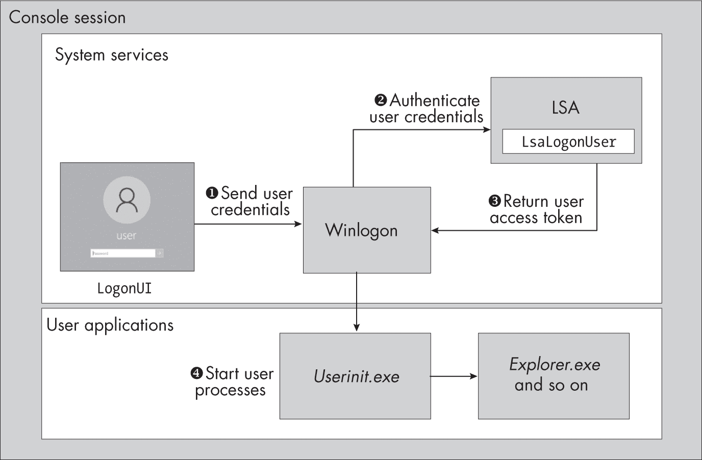
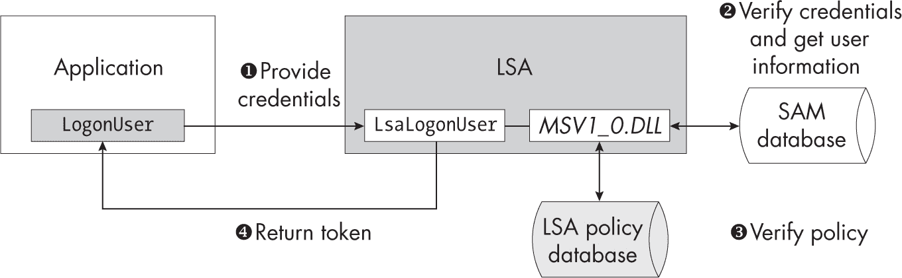
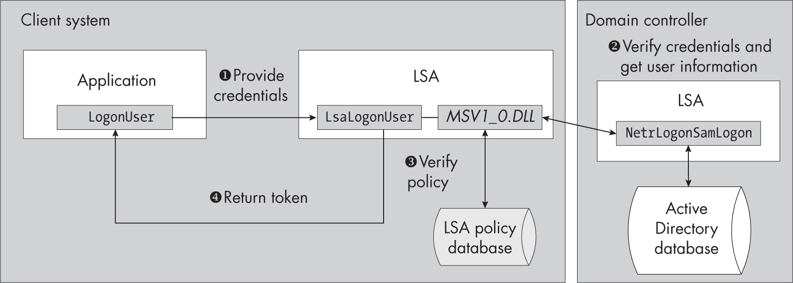
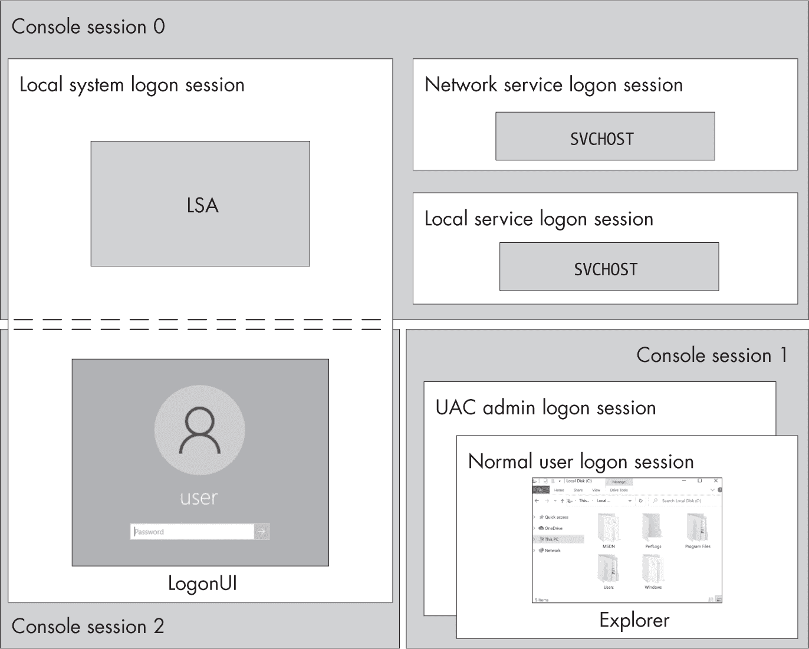

## 第四章：12 交互式认证


当你登录到 Windows 系统时，通常会看到一个登录界面，输入凭据后，你会进入桌面。但在幕后有许多操作确保这个认证过程正常工作。*交互式认证*是将一组凭据转换为一个 Token 对象的机制，你可以使用这个对象与授权系统交互，如访问检查。

Windows 为了不同的用途使用了多种类型的交互式认证。例如，当用户创建交互式桌面时使用一种类型的认证，而当用户为网络服务提供凭据时则使用另一种类型。本章将首先探讨 Windows 如何在你登录 Windows 系统时创建交互式桌面。接着，我们将介绍通过 LsaLogonUser API 实现的交互式认证。最后，我们将讨论各种交互式认证的类型、它们之间的区别以及何时使用它们。

### 创建用户桌面

与 Windows 系统交互最常见的方式是通过桌面上的用户界面。图 12-1 总结了创建用户桌面的过程。



图 12-1：交互式桌面创建概述

当 Windows 系统启动时，会话管理器会创建一个控制台会话，如第三章所述。在此控制台会话中，它会启动 Winlogon 进程实例，该进程收集凭据并在凭据验证后启动新用户的进程。然后，Winlogon 进程创建 LogonUI 进程以显示用户界面。LogonUI 进程从用户处读取凭据并将其传回 Winlogon ❶。

接下来，Winlogon 进程将凭据发送到 LSA 的 LsaLogonUser API，以验证凭据是否正确 ❷。如果用户成功认证，一个表示用户身份的令牌将返回给 Winlogon ❸。然后，控制台会话可以重新配置用户，这个过程包括创建窗口站和桌面，并使用用户的令牌启动用户初始化进程 ❹。

LsaLogonUser API 直接支持最常见的凭证类型，即用户名和密码对。然而，Windows 也允许许多其他本地身份验证因素，例如生物特征数据（例如扫描用户面部）或简单的 PIN 码。为了处理这些，Winlogon 在需要时加载凭证提供程序。每个提供程序负责将其凭证类型映射到 LsaLogonUser 支持的凭证类型，从而获取令牌。

### LsaLogonUser API

我们已经了解了如何在 Windows 上创建桌面的基本知识。现在，让我们深入探讨 LsaLogonUser API 如何实现 Winlogon 和其他应用程序在本地系统上的交互式身份验证服务。这个 API 可能看起来很复杂，但实际上它只需要应用程序提供三项信息即可验证用户：

+   请求的登录类型

+   安全包标识符

+   用户的凭证

该 API 使用 *登录类型* 来适应不同的身份验证场景。表 12-1 列出了应用程序最常使用的登录类型。

表 12-1： 常见的登录类型

| 登录类型 | 描述 |
| --- | --- |
| 交互式 | 通过本地桌面与系统进行交互。 |
| 批处理 | 作为后台进程运行，即使没有桌面可用。 |
| 服务 | 作为系统服务运行。 |
| 网络 | 通过网络客户端与系统进行交互。 |
| NetworkCleartext | 执行网络身份验证，但将用户的凭证存储以备后用。 |
| NewCredentials | 克隆调用者的令牌并更改网络用户凭证。 |
| RemoteInteractive | 通过远程桌面协议与桌面进行交互。 |
| 解锁 | 验证用户凭证以解锁桌面。 |

解锁 是 Winlogon 用于在锁屏界面上验证用户凭据的特殊类型，通常不会被应用程序直接使用。我们将在本章稍后回到其他几种登录类型。

Windows 将身份验证的细节抽象为一个*安全包*，该包提供了一个标准化的接口来实现身份验证协议。身份验证协议是一个正式的过程，它接受一组凭据并验证其有效性。它还提供了一种机制，用于返回关于经过验证的用户的信息，如其组成员身份。有时我们也将安全包称为*安全支持提供者（SSP）*。

我们可以使用 Get-LsaPackage PowerShell 命令列举可用的安全包，如 清单 12-1 所示。

```
PS> **Get-LsaPackage | Select-Object Name, Comment**
Name                                         Comment
----                                         -------
Negotiate                                    Microsoft Package Negotiator ❶
NegoExtender                                 NegoExtender Security Package
Kerberos                                     Microsoft Kerberos V1.0
NTLM                                         NTLM Security Package ❷
TSSSP                                        TS Service Security Package
pku2u                                        PKU2U Security Package
CloudAP                                      Cloud AP Security Package
WDigest                                      Digest Authentication for Windows
Schannel                                     Schannel Security Package
Microsoft Unified Security Protocol Provider Schannel Security Package
Default TLS SSP                              Schannel Security Package
CREDSSP                                      Microsoft CredSSP Security Provider 
```

清单 12-1：列举支持的安全包

应用程序通常通过一个更通用的 API 访问安全包，该 API 与所使用的身份验证协议无关。例如，LsaLogonUser 通过接受一个用于指定包的唯一标识符，跨多个不同的包工作。安全包还可以实现网络身份验证协议，我们将在后续章节中详细介绍。

最常用的本地身份验证安全包是*Negotiate* ❶ 和 *NT LAN Manager (NTLM)* ❷。NTLM 身份验证协议在 Windows NT 3.1 中首次引入，在文档中有时也被称为*Microsoft 身份验证包 V1.0*。Negotiate 包可以根据具体情况自动选择不同的身份验证协议。例如，它可能会在本地对 SAM 数据库进行身份验证时选择 NTLM，或者在对域进行身份验证时选择 Kerberos。

支持的凭据类型取决于用于身份验证的安全包。例如，NTLM 只支持用户名和密码凭据，而 Kerberos 除了支持用户名和密码外，还支持 X.509 证书和智能卡身份验证。

#### 本地身份验证

让我们更详细地探讨 LsaLogonUser API 如何进行用户身份验证。图 12-2 给出了本地 SAM 数据库中用户身份验证过程的概述。



图 12-2：使用 LsaLogonUser 进行本地身份验证的过程

由于LsaLogonUser API 的复杂性，应用程序通常会使用系统提供的更简单的 API。例如，LogonUser API 接受用户名、域名、密码和登录类型，并为底层安全包适当地格式化参数。

然后，它将这些参数，包括用户的凭证，转发给 LSA 进程中的LsaLogonUser API ❶。该 API 又将身份验证请求转发给所选的安全包，在这种情况下是实现于*MSV1_0.DLL*库中的 NTLM 包。

安全包检查用户是否存在于本地 SAM 数据库中。如果存在，用户的密码将被转换为 NT 哈希（在第十章中讨论），然后与数据库中存储的值进行比较 ❷。如果哈希值匹配且用户帐户已启用，则身份验证继续进行，用户的详细信息，例如组成员身份，将从 SAM 数据库中读取，用于身份验证过程。

现在安全包已经知道了用户的组成员身份和帐户详细信息，它可以检查本地安全策略是否允许该用户进行身份验证 ❸。主要的策略检查请求的登录类型是否被授予帐户权限。表 12-2 列出了登录类型以及用户必须被授予的帐户权限，才能进行身份验证。请注意，NewCredentials 登录类型不需要特定的帐户权限；我们将在 407 页的“网络凭据”框中解释原因。

表 12-2： 登录类型及相关的允许与拒绝帐户权限

| 登录类型 | 允许帐户权限 | 拒绝帐户权限 |
| --- | --- | --- |
| 交互式 | SeInteractiveLogonRight | SeDenyInteractiveLogonRight |
| 批处理 | SeBatchLogonRight | SeDenyBatchLogonRight |
| 服务 | SeServiceLogonRight | SeDenyServiceLogonRight |
| Network | SeNetworkLogonRight | SeDenyNetworkLogonRight |
| NetworkCleartext | SeNetworkLogonRight | SeDenyNetworkLogonRight |
| NewCredentials | N/A | N/A |
| RemoteInteractive | SeRemoteInteractiveLogonRight | SeDenyRemoteInteractiveLogonRight |
| Unlock | 与 Interactive 或 RemoteInteractive 相同 | 与 Interactive 或 RemoteInteractive 相同 |

如果用户没有被授予必要的账户权限或明确被拒绝该权限，身份验证将失败。身份验证还可能受到其他限制；例如，您可以配置用户使其仅在特定时间段或甚至仅在特定的星期几进行身份验证。如果用户未满足某个策略要求，安全包将拒绝该身份验证。

如果用户的凭证有效且策略允许其进行身份验证，LSA 可以使用 NtCreateToken 系统调用，根据从 SAM 和 LSA 策略数据库中提取的有关用户及其权限的信息创建一个令牌 ❹。应用程序接收一个令牌句柄，用户随后可以使用该令牌进行模拟，或在分配的限制范围内创建新进程，具体说明见 第四章。

#### 域身份验证

对用户进行域控制器身份验证与本地身份验证没有显著差异，但值得强调的是其中的一些小区别。 图 12-3 展示了域身份验证过程。



图 12-3：使用 LsaLogonUser 的域身份验证过程

域认证过程的开始方式与本地认证相同。应用程序将凭据和其他参数提供给运行在 LSA 进程中的 LsaLogonUser API ❶。此时，API 很可能会使用 Negotiate 安全包来选择最合适的安全包进行认证。

在这个例子中，它再次使用 NTLM 安全包，这个包容易理解。然而，在现代的 Windows 网络中，更常见的是使用 Kerberos。Kerberos 的交互式认证要复杂得多，所以我将在第十四章中详细讲解它。

Windows 还支持在线认证协议，如用于 Microsoft 和 Azure Active Directory 账户的协议。这些账户的认证使用 *CloudAP* 安全包，若这是最佳的安全包，Negotiate 将自动选择它。尽管我们会在第十五章中涉及 Negotiate 的一些方面，但这个选择过程的细节超出了本书的范围。

NTLM 安全包再次生成 NT 哈希，但它不再查询本地 SAM 数据库，而是确定用户域的域控制器。然后，它通过 *Netlogon* 网络协议将包含用户名称和 NT 哈希的认证请求转发到域控制器的 NetrLogonSamLogon API。

虽然 Windows 已经弃用了 Netlogon 协议用于主域认证，但在最新版本中该协议并未被移除。不删除旧有功能可能会导致重要的安全问题，因为随着技术过时和安全需求的变化，原有的安全措施可能变得不再适用。例如，CVE-2020-1472，俗称 *Zerologon*，是 Netlogon 协议中的一个严重漏洞，允许未经认证的用户利用该协议中弱加密的缺陷来攻破整个域网络。

域控制器在域的用户数据库中验证用户的凭据 ❷。对于现代版本的 Windows，这是 Active Directory，而不是 SAM 数据库。用户也必须启用才能使认证成功。如果哈希匹配，用户的信息将从 Active Directory 提取并返回到客户端系统。

一旦用户的凭据被验证，客户端系统可以验证其本地策略 ❸，以确定用户是否被允许基于登录类型和其他限制（如时间限制）进行认证。如果每项检查都通过，LSA 将生成令牌并返回给应用程序 ❹。

#### 登录和控制台会话

一旦LsaLogonUser API 验证了用户的凭据，它就可以为用户创建初始令牌。然而，在调用NtCreateToken之前，LSA 必须设置一个关联的登录会话。我们在第四章中讨论了登录会话，特别是在令牌的身份验证 ID 上下文中，但值得更深入地了解它所包含的内容。

让我们首先使用Get-NtLogonSession PowerShell 命令查询 LSA 以获取所有当前的登录会话，如清单 12-2 所示。你应该以管理员身份运行此命令，以显示系统上的所有登录会话。

```
PS> **Get-NtLogonSession | Sort-Object LogonId**
LogonId           UserName                     LogonType          SessionId
-------           --------                     ---------          ---------
❶ 00000000-000003E4 NT AUTHORITY\NETWORK SERVICE Service            0
00000000-000003E5 NT AUTHORITY\LOCAL SERVICE   Service            0
❷ 00000000-000003E7 NT AUTHORITY\SYSTEM          UndefinedLogonType 0
❸ 00000000-00006A39 Font Driver Host\UMFD-0      Interactive        0
00000000-00006A96 Font Driver Host\UMFD-1      Interactive        1
00000000-0000C5E9 Window Manager\DWM-1         Interactive        1
❹ 00000000-00042A51 GRAPHITE\user                Interactive        1
00000000-00042AB7 GRAPHITE\user                Interactive        1
00000000-000E7A72 Font Driver Host\UMFD-3      Interactive        2
00000000-000E7CF2 Window Manager\DWM-3         Interactive        2 
```

清单 12-2：显示所有当前的登录会话

我们可以看到，前两个会话是服务帐户❶，这是由LogonType值指示的。奇怪的是，第三个会话也是服务帐户，属于*SYSTEM*用户，但请注意，LogonType是未定义的❷。这是因为内核在 LSA 进程启动之前就创建了*SYSTEM*登录会话，这意味着没有进行身份验证。

剩余的登录会话是互动帐户，如Interactive登录类型❸所示。只有一个用户被验证❹；其他帐户属于系统进程，如用户模式字体驱动程序（UMFD）和桌面窗口管理器（DWM）。我们不会详细讨论这些系统进程。请注意，当前用户有两个登录会话。这是由于 UAC（在第四章中介绍）；我们将在“令牌创建”部分（第 407 页）回到为什么 UAC 会生成两个会话。

还请注意，每个登录会话都会显示一个SessionId，除了用于标识帐户的身份验证标识符（LogonId）。这是控制台会话 ID。不要将登录会话和控制台会话类型混淆非常重要。正如这个输出所示，一个控制台会话可以托管多个独立的登录会话，而一个登录会话也可以跨多个控制台会话使用。

LSA 存储与登录会话关联的原始控制台会话 ID，当它被创建时。在清单 12-3 中，我们使用Get-NtConsoleSession查询 LSA 获取所有当前的控制台会话。这种行为允许多个用户共享同一个控制台和桌面。

```
PS> **Get-NtConsoleSession**
SessionId UserName      SessionName            State
--------- --------      -----------            -----
0                       Services               Disconnected
1         GRAPHITE\user 31C5CE94259D4006A9E4#0 Active
2                      Console                Connected 
```

清单 12-3：显示所有当前的控制台会话

SessionName 列表示控制台会话连接的位置。会话 0 是一个 Services 控制台，意味着它仅用于系统服务。State 列表示 UI 的状态。对于会话 0，它被设置为 Disconnected，因为没有显示 UI。

会话 1 在用户成功完成交互式身份验证过程后按需创建。UserName 列标识经过身份验证的用户。会话状态被设置为 Active，因为这是我运行 PowerShell 命令的控制台会话。会话名称是一个唯一值，表明这是一个远程桌面连接。

最后，会话 2 位于物理控制台上。它显示为 Connected 状态，因为它当前承载 LogonUI，以防用户尝试通过物理方式登录到计算机。然而，此时会话 2 中没有经过身份验证的用户，如列表中没有 UserName 所示。

图 12-4 总结了本示例中登录会话和控制台会话之间的关系。控制台会话是背景中的灰色框，而登录会话是前景中的白色框。



图 12-4：控制台和登录会话

请注意，控制台会话 0 包含服务登录会话，例如本地系统、网络服务和本地服务的会话。本地系统登录会话还用于控制台会话 2 中运行的 LogonUI 进程。右下角是控制台会话 1，其中包含两个用户登录会话：一个是 UAC 管理员会话，另一个是过滤后的非管理员会话。

#### 令牌创建

在新的登录会话中，LSA 可以为用户创建最终的 Token 对象。为此，它必须收集有关令牌的各种安全属性的信息，包括用户的组、特权和登录会话 ID，然后将这些信息传递给 NtCreateToken。

你可能会想，用户的组是从哪里来的。由于域身份验证是最复杂的情况，让我们考虑一下 Winlogon 在对用户进行身份验证时，分配给域用户令牌的组。（在本地身份验证过程中，组分配会相似，唯一的不同是 LSA 只会考虑本地组。）表 12-3 显示了 *alice* 用户的组分配。

表 12-3： 在域加入系统的交互令牌中添加的组

| 组名 | 组来源 |
| --- | --- |
| MINERAL\alice | 域用户帐户 |
| MINERAL\Domain Users | 域组成员 |
| 身份验证机构声明的身份 |
| NT AUTHORITY\Claims Valid |
| MINERAL\Local Resource | 域本地资源组成员 |
| BUILTIN\Administrators | 本地组成员 |
| BUILTIN\Users |
| NT AUTHORITY\INTERACTIVE | 自动 LSA 组 |
| NT AUTHORITY\Authenticated Users |
| Everyone |
| Mandatory Label\High Mandatory Level |
| NT AUTHORITY\LogonSessionId_0_6077548 | Winlogon 组 |
| LOCAL |

正如你所看到的，添加到令牌中的组来自六个来源。第一个条目来自域用户帐户。（在本地身份验证场景中，组将来自本地用户帐户。）

接下来是域组成员身份。这些成员来自前一章讨论的 Universal 和 Global 组范围。*alice* 用户是第一个组 *Domain Users* 的成员。其他两个组是在用户认证时自动生成的。*Authentication authority asserted identity* 组与名为 *Service for User (S4U)* 的功能相关，我们将在讨论 Kerberos 身份验证时详细介绍该功能，详见第十四章。

以下源包括具有 DomainLocal 范围的组。这些域本地组在令牌中以 Resource 组属性标记，尽管该属性不会影响其在访问检查中的使用。用户所属的域本地资源组列表会在 NetrLogonSamLogon API 的响应中返回，该列表称为 *特权属性证书 (PAC)*。我们将在第十四章中进一步讨论 PAC。

接下来，任何用户所在的本地组将被添加到令牌中。这些本地组可以根据认证过程中提供的域 SID 进行选择。

然后是自动添加的 LSA 组。*Everyone* 和 *Authenticated Users* 组的成员身份会自动赋予所有已认证的令牌。*INTERACTIVE* 组的成员身份会在使用 Interactive 登录类型进行身份验证时授予。 表 12-4 提供了为不同登录类型添加的 SID 列表。如果用户被认为是管理员（例如，如果他们属于 *Administrators* 组或拥有某些高级权限），LSA 会自动添加 *Mandatory Label\High Mandatory Level* SID。这会将令牌的完整性级别设置为 High。普通用户会获得 *Medium Mandatory Level* SID，而系统服务用户（如 *SYSTEM*）则会获得 *System Mandatory Level* SID。

表 12-4： 每种登录类型为令牌添加的 SID

| 登录类型 | 名称 | SID |
| --- | --- | --- |
| 交互式 | NT AUTHORITY\INTERACTIVE | S-1-5-4 |
| 批处理 | NT AUTHORITY\BATCH | S-1-5-3 |
| 服务 | NT AUTHORITY\SERVICE | S-1-5-6 |
| 网络 | NT AUTHORITY\NETWORK | S-1-5-2 |
| 网络明文 | NT AUTHORITY\NETWORK | S-1-5-2 |
| 新凭证 | 与原始令牌相同 | 不适用 |
| 远程交互 | NT AUTHORITY\INTERACTIVENT AUTHORITY\REMOTE INTERACTIVE LOGON | S-1-5-4S-1-5-14 |
| 解锁 | 与正在解锁的登录会话相同 | 不适用 |

为每种登录类型提供唯一的 SID 允许安全描述符根据登录类型保护资源。例如，安全描述符可以明确拒绝对 *NT AUTHORITY\NETWORK* SID 的访问，这意味着从网络认证的用户将被拒绝访问该资源，而其他认证用户将被允许访问。

添加到令牌中的第六组 SID 是 Winlogon 在调用 LsaLogonUser API 时为添加的组。该 API 允许启用 SeTcbPrivilege 的调用者将任意组 SID 添加到创建的令牌中，因此 Winlogon 添加了一个登录会话和一个 *本地* SID。该登录会话 SID 的两个 RID 值是由 NtAllocateLocallyUniqueId 系统调用生成的 LUID 中的两个 32 位整数。你可能认为 LUID 会与用于登录会话的 LUID 匹配。然而，由于该 SID 在调用创建登录会话的 LSA 之前创建，因此这是不可能的。这个 SID 用于保护短暂的资源，例如用户的 *BaseNamedObjects* 目录。

> 注意
> 
> *如果在创建令牌时未指定登录会话 SID，LSA 会为你添加一个。但它会遵循相同的模式，使用与令牌登录会话不同的 LUID。*

如第十章所讨论，令牌的权限基于存储在本地 LSA 策略数据库中的账户权限。这在域认证中也适用；然而，账户权限可以通过部署到域内计算机的域组策略进行修改。

如果用户被认为是管理员，UAC 启用，并且用户使用 Interactive 或 RemoteInteractive 登录类型进行身份验证，LSA 将首先构建完整的令牌并创建一个新的登录会话，然后创建一个包含新登录会话的完整令牌副本，但会调用 NtFilterToken 来移除管理员权限（有关更详细的描述，请参见第四章）。然后，LSA 将把这两个令牌链接在一起，并将过滤后的令牌返回给调用者。这种行为就是为什么我们在清单 12-2 中观察到同一个用户有两个登录会话的原因。

你可以通过调整系统的 UAC 设置来禁用令牌拆分行为。对于*管理员*用户，默认情况下它是禁用的，该用户在安装 Windows 时总会创建，但仅在 Windows Server 系统上默认启用。LSA 会检查用户 SID 的最后 RID：如果是 500，与*管理员*用户匹配，则令牌不会被拆分。

### 从 PowerShell 使用 LsaLogonUser API

现在你已经了解了 LsaLogonUser API 的工作原理，我们来看看如何通过 NtObjectManager PowerShell 模块访问该 API。除非你以 SeTcbPrivilege 运行 PowerShell，否则 API 的某些功能将被阻止，例如向令牌添加新的组 SID，但如果你有用户的用户名和密码，你仍然可以创建一个新的令牌。

我们通过 Get-NtToken 命令和 Logon 参数访问该 API。清单 12-4 展示了如何使用 Get-NtToken 来验证新用户。

```
PS> **$password = Read-Host -AsSecureString -Prompt "Password"**
Password: ************
PS> **$token = Get-NtToken -Logon -User** **`user`** **-Domain $env:COMPUTERNAME**
**-Password $password -LogonType Network**
PS> **Get-NtLogonSession -Token $token**
LogonId           UserName         LogonType SessionId
-------           --------         --------- ---------
00000000-9BBFFF01 GRAPHITE\user    Network   3 
```

清单 12-4：验证用户身份

最好不要在命令行中输入密码。相反，我们使用 Read-Host 配合 AsSecureString 属性将密码作为安全字符串读取。

然后我们可以调用 Get-NtToken，并指定用户名、域名和密码。（将此示例中的用户名 user 替换为有效的本地用户。）我们将域名设置为本地计算机的名称，表示我们希望使用本地账户进行身份验证。你可以设置任何登录类型，但在此例中我们指定 Network，它适用于所有用户。LSA 是否允许其他登录类型取决于分配的账户权限。

> 注意
> 
> *默认情况下，LsaLogonUser API 在物理控制台之外不会验证具有空密码的用户。如果你尝试使用一个空密码的用户帐户运行该命令，调用将失败。*

登录类型还决定了 LsaLogonUser 根据所创建令牌的预期用途（如创建新进程或模拟）返回何种类型的令牌。表 12-5 显示了登录类型与令牌类型的映射。（我们可以通过复制自由地在主令牌和模拟令牌之间转换，因此这些令牌不必按预期的方式使用。）

表 12-5： 登录类型与令牌类型的映射

| 登录类型 | 令牌类型 |
| --- | --- |
| 交互式 | 主账户 |
| 批处理 | 主账户 |
| 服务 | 主账户 |
| 网络 | 模拟 |
| 网络明文 | 模拟 |
| 新凭据 | 主账户 |
| 远程交互式 | 主账户 |
| 解锁 | 主账户 |

在 Listing 12-4 中，命令返回了一个模拟令牌。你可能会问：我们是否允许在没有启用SeImpersonatePrivilege的情况下模拟令牌，特别是当令牌属于其他用户时？LSA 会将新令牌的源 ID 设置为调用者的身份验证 ID，因此根据第四章中讨论的模拟规则，即使令牌属于不同的用户，我们也可以进行模拟。

这不被认为是安全问题，因为如果你知道用户的密码，你已经能够完全以该用户身份进行身份验证。在 Listing 12-5 中，我们检查使用Get-NtTokenId命令时，源 ID 和身份验证 ID 是否匹配。

```
PS> **Get-NtTokenId -Authentication**
LUID
----
00000000-000A0908

PS> **Get-NtTokenId -Token $token -Origin**
LUID
----
00000000-000A0908 
```

Listing 12-5：比较身份验证 ID 和源 ID

我们查询主令牌的身份验证 ID，然后查询新令牌的源 ID。输出显示这两个 ID 是相同的。

然而，模拟令牌时存在一个限制。如果被身份验证的用户是管理员，并且身份验证过程使用的是非Interactive的登录类型，则命令不会返回过滤后的令牌。相反，它将返回一个具有High完整性级别的管理员。这个完整性级别会阻止从Medium级别进程模拟该令牌。但由于返回的令牌句柄具有写访问权限，我们可以在模拟之前将其完整性级别降低为Medium。我们在 Listing 12-6 中执行了这一操作。

```
PS> **Get-NtTokenIntegrityLevel -Token $token**
High

PS> **Test-NtTokenImpersonation $token**
False

PS> **Set-NtTokenIntegrityLevel -Token $token Medium**
PS> **Test-NtTokenImpersonation $token**
True 
```

Listing 12-6：测试是否能够模拟返回的令牌

在这种情况下，我们验证的令牌是*管理员*组的成员，因此具有High完整性级别。我们尝试模拟它，正如你所看到的，命令返回False。然后，我们将令牌的完整性级别设置为Medium并再次测试模拟。此时操作返回True。

### 使用令牌创建新进程

如果你使用返回Primary令牌的登录类型，你可能会认为该令牌可以让你创建新进程。为了测试这一点，作为非管理员用户运行 Listing 12-7，并确保将用户名更改为有效账户的用户名。

```
PS> **$token = Get-NtToken -Logon -User** **`user`** **-Domain $env:COMPUTERNAME**
**-Password $password -LogonType Interactive**
PS> **New-Win32Process cmd.exe -Token $token**
Exception calling "CreateProcess": "A required privilege is not held
by the client" 
```

Listing 12-7：使用身份验证令牌创建新进程

你会发现创建新进程失败。这是因为新令牌未满足 第四章 中描述的主令牌分配要求。如果调用进程具有 SeAssignPrimaryTokenPrivilege，进程创建将成功，Winlogon 会具备该权限；然而，普通用户进程没有这个权限。

然而，如果你以管理员身份重新运行该命令，它应该会成功，即使管理员默认并未被授予该权限。让我们来探讨一下为什么它能够成功。New-Win32Process 命令首先尝试使用 CreateProcessAsUser API 创建进程，该 API 在进程内运行。由于调用进程没有 SeAssignPrimaryTokenPrivilege，因此该操作失败。

在此失败情况下，New-Win32Process API 将回退到调用另一个替代 API，CreateProcessWithToken。该 API 并未在进程内实现；相反，它是在一个系统服务中实现的，即辅助登录服务，该服务具有 SeAssignPrimaryTokenPrivilege。在这种情况下，服务将在创建新进程之前检查调用者是否具有 SeImpersonatePrivilege。

因此，该命令适用于被授予 SeImpersonatePrivilege 的管理员。即便如此，管理员不应完全依赖 CreateProcessWithToken，因为该 API 不支持 CreateProcessAsUser 的许多功能，例如继承任意句柄到新进程。

非管理员用户也可以以其他用户身份创建进程。辅助登录服务公开了第二个 API，CreateProcessWithLogon，它接受用户名、域名和密码来创建用户，而不是令牌句柄。服务使用 LsaLogonUser 进行用户身份验证，然后使用经过身份验证的令牌与 CreateProcessAsUser。由于服务具有 SeAssignPrimaryTokenPrivilege，因此进程创建将成功。

在调用 New-Win32Process 命令时，可以指定 Credential 参数来使用 CreateProcessWithLogon，如 Listing 12-8 所示。

```
PS> **$creds = Read-LsaCredential**
UserName: **alice**
Domain: **MINERAL**
Password: ************

PS> **$proc = New-Win32Process -CommandLine cmd.exe -Credential $creds**
PS> **$proc.Process.User**
Name          Sid
----          ---
MINERAL\alice S-1-5-21-1195776225-522706947-2538775957-1110 
```

Listing 12-8: 使用 New-Win32Process 调用 CreateProcessWithLogon

在这里，我们读取 *alice* 用户的凭证，并使用 New-Win32Process 创建新进程，通过 Credential 参数指定凭证。这将调用 CreateProcessWithLogon API。

该 API 将返回一个进程和线程句柄供使用。例如，我们可以查询进程的用户，显示它是通过认证的 *alice* 用户的令牌创建的。

该 API 不允许你指定用户的登录类型（默认值是 Interactive），但你可以向 LogonFlags 参数指定 NetCredentialsOnly 标志，以改为使用 NewCredentials 登录类型。

### 服务登录类型

让我们通过再谈一下 Service 登录类型来总结这一章。服务控制管理器使用此登录类型为系统服务进程创建令牌。它将允许任何已被授予 SeServiceLogonRight 账户权限的用户进行身份验证。

然而，LSA 还支持四个著名的本地服务帐户，这些帐户并未存储在 SAM 数据库中。我们可以通过指定域名为 NT AUTHORITY 和服务登录类型 Service，以及 表 12-6 中的用户名之一，使用 LsaLogonUser 创建它们，该表也显示了用户 SID。

表 12-6： 服务登录类型的用户名和 SID

| 用户名 | 用户 SID |
| --- | --- |
| IUSR | S-1-5-17 |
| SYSTEM | S-1-5-18 |
| 本地服务 或 LocalService | S-1-5-19 |
| 网络服务 或 NetworkService | S-1-5-20 |

*SYSTEM* 用户是四个用户中唯一的管理员；其他三个用户不是 *Administrators* 组的成员，但它们确实拥有高权限，例如 SeImpersonatePrivilege，这使得它们实际上等同于管理员。

*IUSR* 帐户代表匿名互联网用户。它可用于减少配置为匿名身份验证的 Internet 信息服务（IIS）Web 服务器的权限。当没有用户凭据的请求发送到 IIS Web 服务器时，它将在打开任何资源（如文件）之前模拟 *IUSR* 帐户令牌。这可以防止意外地以特权用户身份远程暴露资源。

对于这些内置服务帐户，你无需指定密码，但需要调用 LsaLogonUser 并启用 SeTcbPrivilege 权限，这样可以防止它在系统服务之外被使用。列表 12-9 演示了如何使用 Get-NtToken 来创建 *SYSTEM* 用户令牌。以管理员身份运行这些命令。

```
PS> **Get-NtToken -Logon -LogonType Service -Domain 'NT AUTHORITY' -User SYSTEM** 
**-WithTcb**
User                GroupCount PrivilegeCount AppContainer Restricted
----                ---------- -------------- ------------ ----------
NT AUTHORITY\SYSTEM 11         31             False        False

PS> **Get-NtToken -Service System -WithTcb**
User                GroupCount PrivilegeCount AppContainer Restricted
----                ---------- -------------- ------------ ----------
NT AUTHORITY\SYSTEM 11         31             False        False 
```

列表 12-9：获取 SYSTEM 用户令牌

即使是管理员，默认情况下也不会获得 SeTcbPrivilege 权限，因此该命令支持一个 WithTcb 参数，该参数会自动模拟一个启用了该权限的令牌。你还可以通过使用 Service 参数并指定要创建的服务用户名称，来简化服务帐户的创建。

### 示例

让我们通过一些示例来演示如何在安全研究或系统分析中使用本章介绍的各种命令。

#### 测试权限和登录帐户权限

我在第十章中提到过，你可以使用 Add-NtAccountRight 命令将 SID 添加到账户权限列表中。现在我们已经知道如何认证用户，接下来让我们使用这个命令来探索这些账户权限。在清单 12-10 中，我们为一个新用户分配了特权和登录账户权限。请以管理员身份运行这些命令。

```
PS> **$password = Read-Host -AsSecureString -Prompt "Password"**
Password: ************
❶ PS> **$user = New-LocalUser -Name "Test" -Password $password**
PS> **$sid = $user.Sid.Value**
❷ PS> **$token = Get-NtToken -Logon -User $user.Name -SecurePassword $password**
**-LogonType Interactive**
PS> **$token.ElevationType**
Default

PS> **$token.Close()**
❸ PS> **Add-NtAccountRight -Privilege SeDebugPrivilege -Sid $sid**
PS> **$token = Get-NtToken -Logon -User $user.Name -SecurePassword $password**
**-LogonType Interactive**
PS> **Enable-NtTokenPrivilege -Token $token SeDebugPrivilege -PassThru**
❹ WARNING: Couldn't set privilege SeDebugPrivilege

PS> **$token.ElevationType**
Limited

PS> **$token.Close()**
❺ PS> **$token = Get-NtToken -Logon -User $user.Name -SecurePassword $password**
**-LogonType Network**
PS> **Enable-NtTokenPrivilege -Token $token SeDebugPrivilege -PassThru**
Name             Luid              Enabled
----             ----              -------
❻ SeDebugPrivilege 00000000-00000014 True

PS> **$token.ElevationType**
Default

PS> **$token.Close()**
❼ PS> **Add-NtAccountRight -LogonType SeDenyInteractiveLogonRight -Sid $sid**
PS> **Add-NtAccountRight -LogonType SeBatchLogonRight -Sid $sid**
❽ PS> **Get-NtToken -Logon -User $user.Name -SecurePassword $password**
**-LogonType Interactive**
Get-NtToken : (0x80070569) - Logon failure: the user has not been granted
the requested logon type at this computer.

PS> **$token = Get-NtToken -Logon -User $user.Name -SecurePassword $password**
**-LogonType Batch**
PS> **Get-NtTokenGroup $token | Where-Object {$_.Sid.Name -eq** 
**"NT AUTHORITY\BATCH"}**
Sid        : S-1-5-3
Attributes : Mandatory, EnabledByDefault, Enabled
Enabled    : True
Mandatory  : True
DenyOnly   : False
❾ Name       : NT AUTHORITY\BATCH

PS> **$token.Close()**
❿ PS> **Remove-NtAccountRight -Privilege SeDebugPrivilege -Sid $sid**
PS> **Remove-NtAccountRight -LogonType SeDenyInteractiveLogonRight -Sid $sid**
PS> **Remove-NtAccountRight -LogonType SeBatchLogonRight -Sid $sid**
PS> **Remove-LocalUser $user** 
```

清单 12-10：为新用户分配账户权限

我们首先创建一个新用户 ❶ 并测试是否可以进行交互式身份验证 ❷。我们之所以能够这么做，是因为该用户自动属于 *BUILTIN\Users* 组，该组默认具有 SeInteractiveLogonRight 权限。我们还检查了令牌是否没有被 UAC 过滤，通过查看 ElevationType 参数，该参数显示为 Default，表明没有发生过滤。

接下来，我们为用户分配了 SeDebugPrivilege 权限 ❸。这是一个高级权限，因此我们应该预期 LSA 会执行 UAC 过滤。当我们认证用户时，我们发现确实如此：我们无法启用 SeDebugPrivilege，因为它已经被过滤 ❹，并且 ElevationType 已设置为 Limited。

然而，我们可以改用网络身份验证 ❺，它不受默认 UAC 过滤规则的限制。我们现在可以启用 SeDebugPrivilege ❻，并且 ElevationType 再次变为 Default，表明没有发生过滤。

然后我们测试登录账户权限。记住，用户被授予了 SeInteractiveLogonRight 权限，因为他们是 *BUILTIN\Users* 组的成员。我们不能在不将他们从该组中移除的情况下删除该登录权限，因此我们通过将他们的 SID 显式添加到 SeDenyInteractiveLogonRight ❼ 来拒绝该权限。然后我们通过尝试交互式登录 ❽ 来验证预期的行为，此时会返回一个错误。

我们还将用户的 SID 添加到了 SeBatchLogonRight 中，这允许他们作为批处理登录会话进行身份验证。通常，只有 *Administrators* 组的成员才会获得此访问权限。我们通过检查 LSA 分配的 *NT AUTHORITY\BATCH* 组 ❾ 来验证我们已作为批处理登录会话进行了身份验证。

最后，我们使用`Remove-NtAccountRight`命令❿清理账户权限分配。这不是严格必要的，因为当本地用户被删除时，LSA 会自动清理这些分配，但我在这里包含了这些操作以演示该命令的使用。

#### 在不同控制台会话中创建进程

在某些情况下，你可能希望在不同的控制台会话中启动进程。例如，如果你在使用会话 0 运行系统服务中的代码，你可能希望在当前认证的用户桌面上显示一条消息。

要在另一个桌面上成功创建进程，你需要`SeTcbPrivilege`来更改令牌的会话 ID，并且需要`SeAssignPrimaryTokenPrivilege`来创建进程。默认情况下，管理员用户没有这两个权限，因此要测试这里提供的示例代码，你需要以*SYSTEM*用户身份运行 PowerShell。

首先，以管理员身份运行以下命令，在桌面上创建一个具有所需权限的 shell 进程：

```
PS> **Start-Win32ChildProcess ((Get-NtProcess -Current).Win32ImagePath)**
**-RequiredPrivilege SeTcbPrivilege,SeAssignPrimaryTokenPrivilege** 
```

接下来，确保在同一台机器上有两个用户同时在不同的桌面上进行身份验证。如果你使用快速用户切换功能，你将能够轻松确认在每个桌面上都创建了进程。

清单 12-11 开始时通过查找新进程的控制台会话。以*SYSTEM*用户身份运行这些命令。

```
PS> **$username = "GRAPHITE\user"**
❶ PS> **$console = Get-NtConsoleSession |**
**Where-Object FullyQualifiedUserName -eq $username**
❷ PS> **$token = Get-NtToken -Duplicate -TokenType Primary**
PS> **Enable-NtTokenPrivilege SeTcbPrivilege**
PS> **$token.SessionId = $console.SessionId**
PS> **$cmd = "cmd.exe"**
❸ PS> **$proc = New-Win32Process $cmd -Token $token -Desktop "WinSta0\Default"**
**-CreationFlags NewConsole**
❹ PS> **$proc.Process.SessionId -eq $console.SessionId**
True

PS> **$proc.Dispose()**
PS> **$token.Close()** 
```

清单 12-11：在不同控制台会话中创建新进程

我们首先选择属于名为*GRAPHITE\user*的用户的控制台会话❶。然后我们创建一个当前令牌的副本（该令牌属于*SYSTEM*用户），启用`SeTcbPrivilege`，并将控制台会话 ID 分配给该令牌❷。

使用这个新令牌，我们可以通过`New-Win32Process`命令创建一个新进程，并指定`Token`参数❸。在这种情况下，我们正在创建一个记事本的副本，但你可以通过修改命令将此进程更改为任何你想要的应用程序。还需要注意的是，我们为新进程设置了窗口站和桌面的名称，并用反斜杠分隔。分别使用`WinSta0`和`Default`，确保我们在默认桌面上创建应用程序；否则，用户界面将会被隐藏。

我们可以通过将预期的会话 ID 与分配给该进程的实际会话 ID 进行比较，来验证我们是否已经在目标会话中创建了进程 ❹。在这种情况下，比较返回 True，表示成功。如果此时你切换回另一个用户，你应该会在桌面上看到以 *SYSTEM* 用户身份运行的记事本副本。

#### 认证虚拟账户

在 第十章 中，我提到过可以使用 Add-NtSidName 命令在 LSA 中创建自己的 SID 到名称的映射。一旦设置了映射，你还可以通过 LsaLogonUser 为该 SID 创建新的令牌。清单 12-12 演示了这一过程；请以管理员身份运行这些命令。

```
PS> **$domain_sid = Get-NtSid "S-1-5-99"** ❶
PS> **$group_sid = Get-NtSid -BaseSid $domain_sid -RelativeIdentifier 0**
PS> **$user_sid = Get-NtSid -BaseSid $domain_sid -RelativeIdentifier 1**
PS> **$domain = "CUSTOMDOMAIN"**
PS> **$group = "ALL USERS"**
PS> **$user = "USER"**
PS> **$token = Invoke-NtToken -System {**❷
    **Add-NtSidName -Domain $domain -Sid $domain_sid -Register** ❸
    **Add-NtSidName -Domain $domain -Name $group -Sid $group_sid -Register**
    **Add-NtSidName -Domain $domain -Name $user -Sid $user_sid -Register**
    **Add-NtAccountRight -Sid $user_sid -LogonType SeInteractiveLogonRight** ❹
    **Get-NtToken -Logon -Domain $domain -User $user -LogonProvider Virtual**
**-LogonType Interactive** ❺
    **Remove-NtAccountRight -Sid $user_sid -LogonType SeInteractiveLogonRight** ❻
    **Remove-NtSidName -Sid $domain_sid -Unregister**
**}**
PS> **Format-NtToken $token -User -Group**
USER INFORMATION
----------------
Name              Sid
----              ---
CUSTOMDOMAIN\User S-1-5-99-1 ❼

GROUP SID INFORMATION
-----------------
Name                                   Attributes
----                                   ----------
Mandatory Label\Medium Mandatory Level Integrity, IntegrityEnabled
Everyone                               Mandatory, EnabledByDefault, Enabled
BUILTIN\Users                          Mandatory, EnabledByDefault, Enabled
NT AUTHORITY\INTERACTIVE               Mandatory, EnabledByDefault, Enabled
NT AUTHORITY\Authenticated Users       Mandatory, EnabledByDefault, Enabled
NT AUTHORITY\This Organization         Mandatory, EnabledByDefault, Enabled
NT AUTHORITY\LogonSessionId_0_10173    Mandatory, EnabledByDefault, Enabled, LogonId
CUSTOMDOMAIN\ALL USERS                 Mandatory, EnabledByDefault, Enabled ❽ 
```

清单 12-12：创建虚拟账户令牌

我们首先设置一些参数，以便在后续命令中使用 ❶。我们创建了三个 SID：域、组和用户。这些值不需要反映实际的 SID 或名称。接下来我们需要添加这些 SID 并创建令牌，这一过程都需要 SeTcbPrivilege，所以我们模拟了一个 *SYSTEM* 令牌 ❷。

我们使用 Add-NtSidName 命令注册这三个 SID ❸。请注意，必须指定 Register 参数；否则，你将仅仅把 SID 添加到 PowerShell 模块的名称缓存中，而不会在 LSASS 中注册它。一旦我们添加了 SID，就需要授予用户 SeInteractiveLogonRight，这样我们就可以认证用户并接收令牌 ❹。如果需要，也可以选择其他的登录权限，例如 SeServiceLogonRight。

现在我们可以通过 LsaLogonUser 使用 Get-NtToken ❺ 进行用户认证。确保指定 Virtual 登录提供程序和 Interactive 登录类型。你不需要指定密码，但在没有 SeTcbPrivilege 的情况下，无法执行该操作。

在完成模拟之前，我们移除了登录权限，然后删除了域 SID ❻。删除域 SID 会自动删除组和用户的 SID。

最后，我们对令牌进行了格式化。现在我们可以看到用户 SID 是我们创建的虚拟 SID ❼，并且令牌也自动被授予了组 SID ❽。请注意，如果我们没有为组 SID 添加 SID 到名称的映射，我们仍然会获得该 SID，但该 SID 无法解析为名称。现在我们可以模拟该令牌，或者使用它创建一个以该用户身份运行的新进程。

### 总结

如你所见，交互式认证，即用于访问 Windows 桌面的过程，是一个极其复杂的话题。认证过程需要结合用户界面来收集凭证，并通过 Winlogon 进程调用 LSA 的 LsaLogonUser API。API 验证用户凭证后，会创建一个新的登录会话，并生成一个令牌，Winlogon 可以使用该令牌来创建用户的初始进程。登录会话还可以缓存凭证，这样用户就不需要重新输入凭证来访问网络服务。

接下来，我们定义了本地认证和域认证之间的区别。在这里我们只简要介绍了认证如何通过 Netlogon 工作，但我们将在第十四章中详细讲解更常见的 Kerberos。掌握了基本的认证机制后，我们讨论了 LSA 如何使用用户信息构建令牌，包括如何分配组和权限，以及 UAC 如何导致管理员令牌过滤。

然后我们讨论了如何使用 PowerShell 模块的 Get-NtToken 命令调用 LsaLogonUser API。我们看到，借助从 API 返回的令牌，我们可以模拟一个用户，因为 LSA 会将令牌的来源 ID 设置为调用者的认证 ID。我们还看到如何通过 New-Win32Process 命令调用的 CreateProcessWithLogon API 创建一个以不同用户身份运行的新进程。

最后，我们简要了解了 Service 登陆类型和 LSA 预定义的四个账户。服务控制管理器使用这些账户来管理其系统服务进程。在下一章，我们将开始探索网络认证如何使用户能够对另一个 Windows 系统进行身份验证。这也将帮助我们理解域认证使用的协议。
