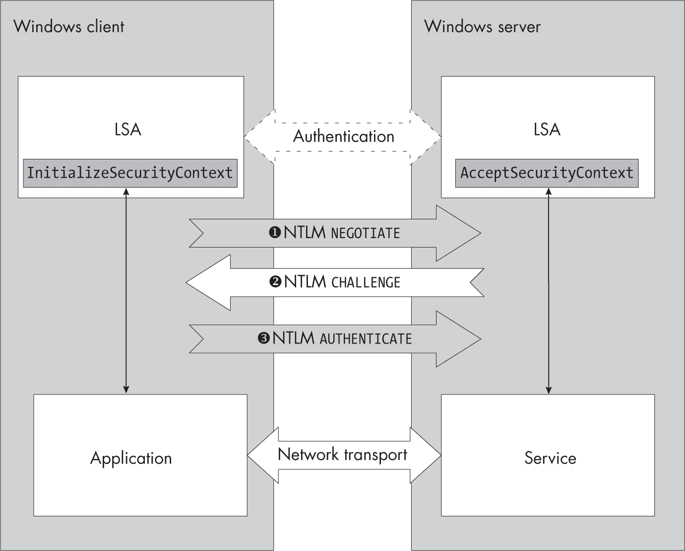
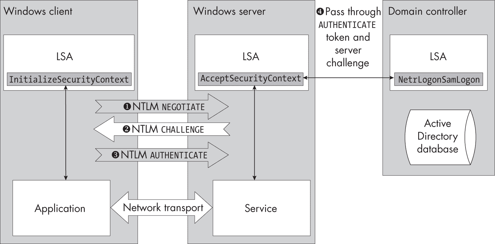
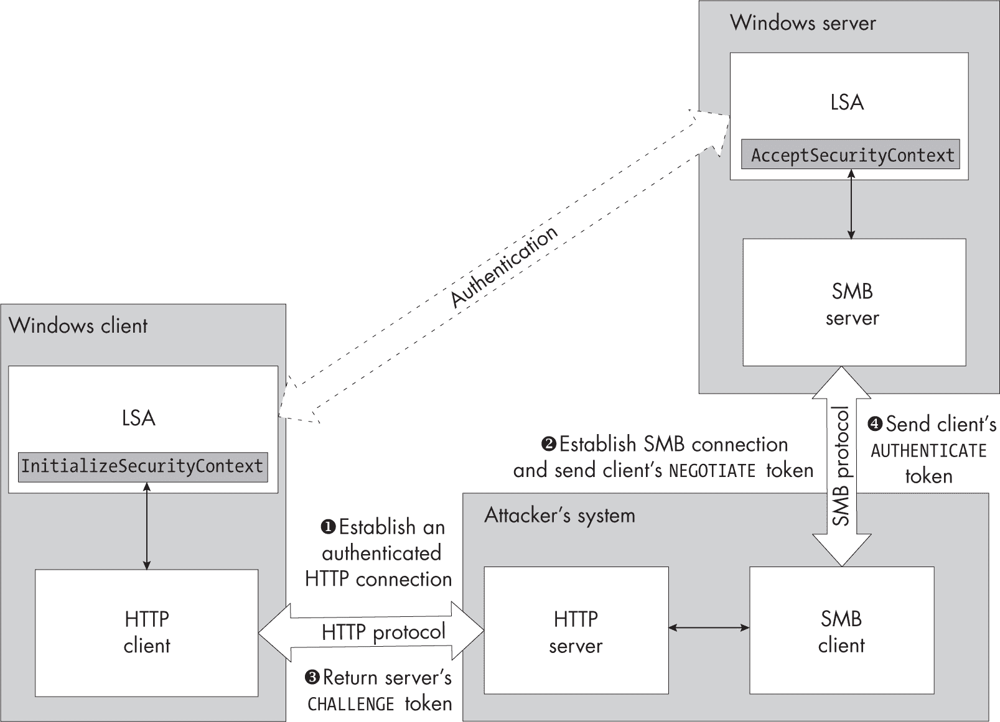
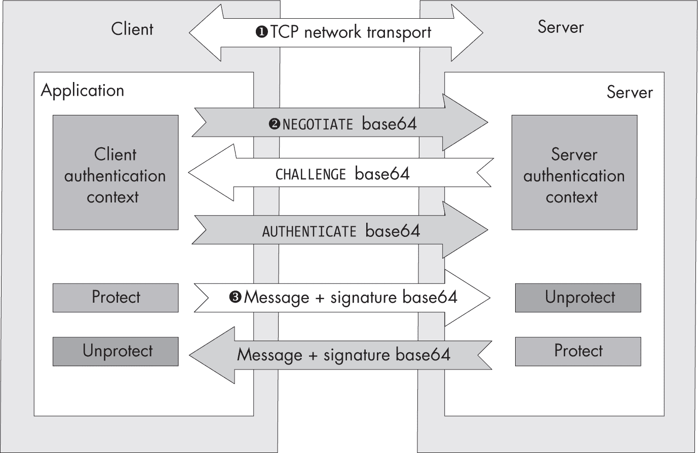

<hgroup>

## <samp class="SANS_Futura_Std_Bold_Condensed_B_11">13</samp> <samp class="SANS_Dogma_OT_Bold_B_11">网络身份验证</samp>

</hgroup>


上一章讨论了交互式身份验证，它允许用户登录到计算机并与桌面进行交互。相比之下，*网络身份验证*发生在用户已经在 Windows 系统上进行身份验证，但希望在另一台 Windows 系统上使用资源时，通常是通过网络进行的。

执行网络身份验证的最简单方法可能是将用户的凭据传输到远程系统。接收凭据的服务随后可以调用<samp class="SANS_TheSansMonoCd_W5Regular_11">LsaLogonUser</samp> API，并指定<samp class="SANS_TheSansMonoCd_W5Regular_11">Network</samp>登录类型来创建一个非交互式登录会话。然而，这种方法并不安全。要使用<samp class="SANS_TheSansMonoCd_W5Regular_11">LsaLogonUser</samp>，一个面向网络的服务必须知道用户的完整凭据，并且将这些凭据提供给远程系统在许多方面存在问题。首先，我们必须信任远程服务能够安全地处理这些凭据。其次，如果身份验证发生在一个敌对网络上，攻击者可能会捕获这些凭据。

为了缓解这些安全问题，Windows 实现了多种网络身份验证协议。这些协议不需要将用户的凭据发送给网络服务，也不需要将明文密码通过网络传输。（当然，也有一些警告，我们将在本章过程中指出。）你将在上一章中讨论的安全包中找到这些网络身份验证协议，并且可以通过通用 API 访问它们，从而允许应用程序轻松地更改所使用的身份验证协议。

本章首先详细介绍了*NT LAN Manager (NTLM)*身份验证协议，它是仍在使用的最古老的 Windows 协议，涵盖了它如何使用用户的凭据防止在网络上泄露。接下来我们将讨论一种著名的攻击方式——*NTLM 中继*，以及 Microsoft 为减轻这一攻击所采取的措施。

### <samp class="SANS_Futura_Std_Bold_B_11">NTLM 网络身份验证</samp>

NTLM 源自于*LAN Manager (LM)*身份验证协议，LAN Manager 操作系统支持 Server Message Block (SMB)文件共享协议。Microsoft 在 Windows 3.11（著名的 Windows for Workgroups）中重新实现了该身份验证协议，随后进一步扩展并命名为 NTLM，首次出现在 Windows NT 中。在最新版本的 Windows 中，使用了三种 NTLM 变体：

**NTLMv1    **原始的 NTLM 版本，首次在 Windows NT 3.1 中引入

**NTLMv2    **NTLM 的一个版本，于 NT 4 服务包 4 中引入，增加了额外的安全功能

**NTLMv2 会话    **NTLMv1，但具有 NTLMv2 的附加安全特性

我们将重点介绍 NTLMv2，这是唯一在 Windows Vista 及更高版本中默认接受的版本。在混合操作系统环境中（例如，当访问基于 Linux 的网络存储设备时），你仍然可能会遇到 NTLMv1 或 NTLMv2 会话，但在现代 Windows 环境中，这些情况应该是罕见的。

图 13-1 显示了发生在 Windows 客户端应用程序和 Windows 服务器之间的 NTLM 认证过程概览。



<samp class="SANS_Futura_Std_Book_Oblique_I_11">图 13-1：NTLM 认证协议概览</samp>

NTLM 认证从客户端应用程序与服务器建立网络连接开始。客户端和服务器随后交换一系列由两台机器上的 LSA 生成的二进制*认证令牌*。对于 NTLM，这些令牌由三个认证消息组成：客户端的<samp class="SANS_TheSansMonoCd_W5Regular_11">NEGOTIATE</samp>消息，它指定客户端支持的功能❶；服务器的<samp class="SANS_TheSansMonoCd_W5Regular_11">CHALLENGE</samp>消息，它选择客户端的一个功能并提供一个随机挑战值，用于交换过程中❷；以及客户端的<samp class="SANS_TheSansMonoCd_W5Regular_11">AUTHENTICATE</samp>消息，它包含一个证明客户端掌握用户密码的值❸。

从高层次来看，认证过程发生在两个 LSA 之间。然而，应用程序和服务器负责通过某些网络协议传输这些认证令牌。微软在*MS-NLMP*中描述了认证协议，该文档可以在线获得。文档省略了一些功能，我们将在讲解示例时指出这些功能。

#### <samp class="SANS_Futura_Std_Bold_Condensed_Oblique_BI_11">使用 PowerShell 进行 NTLM 认证</samp>

让我们使用 PowerShell 进行网络认证，这样你就可以看到认证令牌包含的信息。我们将使用本地用户帐户，尽管域帐户同样可以正常工作。

##### <samp class="SANS_Futura_Std_Bold_Condensed_B_11">初始化客户端</samp>

认证过程在客户端应用程序调用安全支持提供程序接口（SSPI）API <samp class="SANS_TheSansMonoCd_W5Regular_11">AcquireCredentialsHandle</samp>时开始。系统实现 SSPI API 以抽象由安全包实现的认证协议。这使得应用程序更容易更改它们使用的网络认证协议。

这个<samp class="SANS_TheSansMonoCd_W5Regular_11">AcquireCredentialsHandle</samp> API 选择用于网络身份验证的安全包，并在需要时提供明确的身份验证凭据。它返回一个句柄，供第二个 SSPI API <samp class="SANS_TheSansMonoCd_W5Regular_11">InitializeSecurityContext</samp>使用，该 API 使用选定的安全包，但在 LSA 中执行。

LSA 中的安全包处理<samp class="SANS_TheSansMonoCd_W5Regular_11">InitializeSecurityContext</samp>，然后请求并返回一个<samp class="SANS_TheSansMonoCd_W5Regular_11">NEGOTIATE</samp>身份验证令牌给调用者。<samp class="SANS_TheSansMonoCd_W5Regular_11">NEGOTIATE</samp>令牌描述客户端支持的身份验证功能，并应通过网络协议发送到服务器。列表 13-1 在 PowerShell 中执行此客户端初始化。

```
PS> **$credout = New-LsaCredentialHandle -Package "NTLM"**
**-UseFlag Outbound -UserName $env:USERNAME -Domain $env:USERDOMAIN**
PS> **$client = New-LsaClientContext -CredHandle $credout**
PS> **$negToken = $client.Token**
PS> **Format-LsaAuthToken -Token $negToken**
<NTLM NEGOTIATE>
Flags: Unicode, Oem, RequestTarget, NTLM, AlwaysSign, ExtendedSessionSecurity,
Version, Key128Bit, Key56Bit
Version: 10.0.XXXXX.XX 
```

列表 13-1：初始化 NTLM 身份验证的客户端并格式化 NEGOTIATE 身份验证令牌

我们首先通过使用<samp class="SANS_TheSansMonoCd_W5Regular_11">New-LsaCredentialHandle</samp>命令来获取凭据句柄，该命令调用<samp class="SANS_TheSansMonoCd_W5Regular_11">AcquireCredentialsHandle</samp>。通过使用<samp class="SANS_TheSansMonoCd_W5Regular_11">Package</samp>参数指定<samp class="SANS_TheSansMonoCd_W5Regular_11">NTLM</samp>，我们选择使用 NTLM 安全包。我们还指定这些凭据用于出站身份验证（即从客户端到服务器）。最后，我们指定当前环境中的用户名和域。

注意，我们没有指定密码；这是因为 LSA 已经在我们的登录会话中缓存了密码。我们不需要指定密码这一事实是*集成 Windows 身份验证（IWA）*的关键部分，它允许用户自动使用其凭据进行网络身份验证，而无需提示他们输入密码。

使用凭据句柄，我们通过调用<samp class="SANS_TheSansMonoCd_W5Regular_11">New-LsaClientContext</samp>命令并指定该句柄来创建客户端身份验证上下文。在后台，此命令调用<samp class="SANS_TheSansMonoCd_W5Regular_11">InitializeSecurityContext</samp> API。如果对 API 的调用成功，客户端上下文现在包含<samp class="SANS_TheSansMonoCd_W5Regular_11">NEGOTIATE</samp>令牌。我们存储该令牌的副本以备后用，然后将其传递给<samp class="SANS_TheSansMonoCd_W5Regular_11">Format-LsaAuthToken</samp>命令，以解析其内容并将其打印到 Shell 中。

令牌的主要组成部分是一个标志列表，反映了客户端请求的功能、客户端支持的功能以及令牌的有效部分。在这种情况下，令牌设置了九个标志，尽管这些标志会根据系统配置的不同而变化。表 13-1 展示了这些标志在此上下文中的含义。

<samp class="SANS_Futura_Std_Heavy_B_11">表 13-1：</samp> <samp class="SANS_Futura_Std_Book_11">选择 NTLM 标志</samp>

| <samp class="SANS_Futura_Std_Heavy_B_11">标志名称</samp> | <samp class="SANS_Futura_Std_Heavy_B_11">描述</samp> |
| --- | --- |
| <samp class="SANS_TheSansMonoCd_W5Regular_11">Unicode</samp> | <samp class="SANS_Futura_Std_Book_11">客户端支持 Unicode 字符串。</samp> |
| <samp class="SANS_TheSansMonoCd_W5Regular_11">Oem</samp> | <samp class="SANS_Futura_Std_Book_11">客户端支持字节字符字符串（例如，ASCII）。</samp> |
| <samp class="SANS_TheSansMonoCd_W5Regular_11">RequestTarget</samp> | <samp class="SANS_Futura_Std_Book_11">客户端要求服务器在响应中发送目标名称。</samp> |
| <samp class="SANS_TheSansMonoCd_W5Regular_11">NTLM</samp> | <samp class="SANS_Futura_Std_Book_11">客户端请求使用 NTLM 哈希。</samp> |
| <samp class="SANS_TheSansMonoCd_W5Regular_11">AlwaysSign</samp> | <samp class="SANS_Futura_Std_Book_11">客户端请求对身份验证进行签名以确保完整性。</samp> |
| <samp class="SANS_TheSansMonoCd_W5Regular_11">ExtendedSessionSecurity</samp> | <samp class="SANS_Futura_Std_Book_11">客户端请求 NTLMv2 会话安全性。</samp> |
| <samp class="SANS_TheSansMonoCd_W5Regular_11">Version</samp> | <samp class="SANS_Futura_Std_Book_11">客户端已发送操作系统和 NTLM 协议版本。</samp> |
| <samp class="SANS_TheSansMonoCd_W5Regular_11">Key128Bit</samp> | <samp class="SANS_Futura_Std_Book_11">客户端请求 128 位签名密钥。</samp> |
| <samp class="SANS_TheSansMonoCd_W5Regular_11">Key56Bit</samp> | <samp class="SANS_Futura_Std_Book_11">客户端请求 56 位签名密钥。</samp> |

你可能会想知道为什么设置了 <samp class="SANS_TheSansMonoCd_W5Regular_11">ExtendedSessionSecurity</samp> 标志。这个标志将 NTLMv1 更改为 NTLMv2 会话安全性，但我之前提到过 NTLMv1 默认情况下是禁用的。尽管如此，LSA 还是会设置这个标志，以防服务器响应 NTLMv1 请求。除了 <samp class="SANS_TheSansMonoCd_W5Regular_11">Version</samp> 之外，这些标志都表示客户端所要求的功能。<samp class="SANS_TheSansMonoCd_W5Regular_11">Version</samp> 标志表示操作系统版本的主版本号、次版本号和构建值，以及 NTLM 协议版本，自 Windows Server 2003 起已固定为 15。

为确保身份验证协议的完整性，NTLM 基于交换中的值生成加密密钥，然后使用该密钥为整个交换应用*消息完整性码（MIC）*。MIC 是当前交换中发送和接收的身份验证令牌的加密哈希值，用于检测身份验证令牌在网络中是否被篡改。

由于加密出口限制，NTLM 支持 40 位密钥、56 位密钥和 128 位密钥，具体取决于 <samp class="SANS_TheSansMonoCd_W5Regular_11">Key56Bit</samp> 和 <samp class="SANS_TheSansMonoCd_W5Regular_11">Key128Bit</samp> 标志是否存在。如果这两个标志都未设置，NTLM 将使用 40 位密钥。<samp class="SANS_TheSansMonoCd_W5Regular_11">Format-LsaAuthToken</samp> 命令隐藏了身份验证令牌的底层二进制值，但为了查看十六进制格式的令牌，我们可以将 <samp class="SANS_TheSansMonoCd_W5Regular_11">AsBytes</samp> 参数传递给该命令，如示例 13-2 所示。

```
PS> **Format-LsaAuthToken -Token $client.Token -AsBytes**
          00 01 02 03 04 05 06 07 08 09 0A 0B 0C 0D 0E 0F  - 0123456789ABCDEF
-----------------------------------------------------------------------------
❶ 00000000: 4E 54 4C 4D 53 53 50 00 01 00 00 00 07 82 08 A2  - NTLMSSP.........
00000010: 00 00 00 00 00 00 00 00 00 00 00 00 00 00 00 00  - ................
00000020: 0A 00 BA 47 00 00 00 0F                          - ...G.... 
```

示例 13-2：以十六进制格式显示身份验证令牌

在十六进制格式中，我们可以看到数据的开头有一个格式指示符 <samp class="SANS_TheSansMonoCd_W5Regular_11">NTLMSSP</samp> ❶。如果你在分析的数据中看到这个指示符，很可能你遇到了 NTLM 网络身份验证过程。我不会显示其余令牌的十六进制内容，因为如果你有兴趣，修改脚本以查看十六进制输出是非常容易的。

##### <samp class="SANS_Futura_Std_Bold_Condensed_B_11">初始化服务器</samp>

客户端已初始化其身份验证上下文并生成了 <samp class="SANS_TheSansMonoCd_W5Regular_11">NEGOTIATE</samp> 令牌。现在，它必须将此令牌发送给服务器应用程序，以便服务器可以初始化其自身的身份验证上下文。当服务器收到令牌时，它会通过 <samp class="SANS_TheSansMonoCd_W5Regular_11">AcceptSecurityContext</samp> API 将其传递给 LSA。LSA 检查令牌，确定是否支持请求的功能，并生成 <samp class="SANS_TheSansMonoCd_W5Regular_11">CHALLENGE</samp> 身份验证令牌作为响应。此令牌允许服务器验证客户端是否没有重放从先前身份验证交换中捕获的值。

让我们使用 PowerShell 演示服务器如何处理 NTLM。在示例 13-3 中，我们在与客户端相同的进程中创建服务器身份验证上下文（但请记住，服务器通常会运行在不同的系统上）。

```
PS> **$credin = New-LsaCredentialHandle -Package "NTLM" -UseFlag Inbound**
PS> **$server = New-LsaServerContext -CredHandle $credin**
PS> **Update-LsaServerContext -Server $server -Token $client.Token**
PS> **$challengeToken = $server.Token**
PS> **Format-LsaAuthToken -Token $server.Token**
<NTLM CHALLENGE>
Flags     : Unicode, RequestTarget, NTLM, AlwaysSign, TargetTypeDomain,
ExtendedSessionSecurity, TargetInfo, Version, Key128Bit, Key56Bit
TargetName: DOMAIN
Challenge : D568EB90F6A283B8
Reserved  : 0000000000000000
Version   : 10.0.XXXXX.XX
=> Target Info
NbDomainName - DOMAIN
NbComputerName - GRAPHITE
DnsDomainName - domain.local
DnsComputerName - GRAPHITE.domain.local
DnsTreeName - domain.local
Timestamp - 5/1 4:21:17 PM 
```

示例 13-3：初始化 NTLM 身份验证服务器并格式化 CHALLENGE 身份验证令牌

我们首先创建入站凭据句柄。创建此句柄时无需提供任何凭据；事实上，即使您提供了凭据，NTLM 也会忽略它们。接下来，我们创建服务器的认证上下文，并通过调用 <samp class="SANS_TheSansMonoCd_W5Regular_11">Update-LsaServerContext</samp> PowerShell 命令，将客户端的 <samp class="SANS_TheSansMonoCd_W5Regular_11">NEGOTIATE</samp> 令牌提供给 <samp class="SANS_TheSansMonoCd_W5Regular_11">AcceptSecurityContext</samp> API。如果 LSA 接受 <samp class="SANS_TheSansMonoCd_W5Regular_11">NEGOTIATE</samp> 令牌，服务器上下文将包含其自身的令牌，即 <samp class="SANS_TheSansMonoCd_W5Regular_11">CHALLENGE</samp> 令牌。如前所述，我们捕获该令牌以供后续使用，并将其传递给 <samp class="SANS_TheSansMonoCd_W5Regular_11">Format-LsaAuthToken</samp> 来打印出其中包含的信息。

令牌的标志表示网络认证过程支持的值，并且基于客户端发送的标志。例如，在 Listing 13-1 中，我们看到客户端在其 <samp class="SANS_TheSansMonoCd_W5Regular_11">NEGOTIATE</samp> 令牌中设置了 <samp class="SANS_TheSansMonoCd_W5Regular_11">Oem</samp> 和 <samp class="SANS_TheSansMonoCd_W5Regular_11">Unicode</samp> 字符串格式标志，表示它可以支持 Unicode 和字节字符格式字符串。服务器选择以 Unicode 格式发送字符串，因此它在 <samp class="SANS_TheSansMonoCd_W5Regular_11">CHALLENGE</samp> 令牌中清除了 <samp class="SANS_TheSansMonoCd_W5Regular_11">Oem</samp> 标志。

根据客户端的要求，输出中还包含了 <samp class="SANS_TheSansMonoCd_W5Regular_11">TargetName</samp>，在此情况下，它是服务器的域名，由 <samp class="SANS_TheSansMonoCd_W5Regular_11">TargetTypeDomain</samp> 标志指示。如果服务器不在域网络中，<samp class="SANS_TheSansMonoCd_W5Regular_11">TargetName</samp> 将是服务器的计算机名称，令牌将使用 <samp class="SANS_TheSansMonoCd_W5Regular_11">TargetTypeServer</samp> 标志。

<samp class="SANS_TheSansMonoCd_W5Regular_11">CHALLENGE</samp> 令牌包含由 LSA 生成的随机 8 字节服务器挑战。接下来的步骤中计算的所有值都依赖于挑战值；由于它对于每个请求都是不同的，这就防止了攻击者捕获先前的认证交换并将其重放到服务器上。令牌的最后部分是目标信息，通过存在的 <samp class="SANS_TheSansMonoCd_W5Regular_11">TargetInfo</samp> 标志来表示。这部分包含有关服务器的附加信息。

请注意，NTLM 可以在无连接模式下工作，在这种模式下，客户端永远不会发送初始的<samp class="SANS_TheSansMonoCd_W5Regular_11">NEGOTIATE</samp>消息。在这种情况下，认证过程从服务器发送的<samp class="SANS_TheSansMonoCd_W5Regular_11">CHALLENGE</samp>消息开始。然而，无连接 NTLM 认证在实际应用中很少使用。

##### <samp class="SANS_Futura_Std_Bold_Condensed_B_11">将令牌传回客户端</samp>

接下来，服务器必须将<samp class="SANS_TheSansMonoCd_W5Regular_11">CHALLENGE</samp>令牌发送到客户端的认证上下文。在实际的网络协议中，这将在网络上发生，但在列表 13-4 中，我们将令牌传递到相同的脚本中。

```
PS> **Update-LsaClientContext -Client $client -Token $server.Token**
PS> **$authToken = $client.Token**
PS> **Format-LsaAuthToken -Token $client.Token**
<NTLM AUTHENTICATE>
Flags      : Unicode, RequestTarget, NTLM, AlwaysSign, ExtendedSessionSecurity,
TargetInfo, Version, Key128Bit, Key56Bit
Domain     : GRAPHITE
UserName   : user
Workstation: GRAPHITE
LM Response: 000000000000000000000000000000000000000000000000 ❶
<NTLMv2 Challenge Response>
NT Response          : 532BB4804DD9C9DF418F8A18D67F5510 ❷
Challenge Verison    : 1
Max Challenge Verison: 1
Reserved 1           : 0x0000
Reserved 2           : 0x00000000
Timestamp            : 5/1 5:14:01 PM
Client Challenge     : 0EC1FF45C43619A0 ❸
Reserved 3           : 0x00000000
NbDomainName - DOMAIN
NbComputerName - GRAPHITE
DnsDomainName - domain.local
DnsComputerName - GRAPHITE.domain.local
DnsTreeName - domain.local
Timestamp - 5/1 5:14:01 PM
Flags - MessageIntegrity ❹
SingleHost - Z4 0x0 - Custom Data: 0100000000200000 Machine ID: 5FB8... ❺
ChannelBinding - 00000000000000000000000000000000 ❻
TargetName -
</NTLMv2 Challenge Response>
MIC        : F0E95DBEB53C885C0619FB61C5AF5956 ❼ 
```

列表 13-4：为 NTLM 认证更新客户端并格式化 AUTHENTICATE 令牌

我们使用<samp class="SANS_TheSansMonoCd_W5Regular_11">Update-LsaClientContext</samp>命令，它再次调用<samp class="SANS_TheSansMonoCd_W5Regular_11">InitializeSecurityContext</samp>，并使用原始的凭证句柄和<samp class="SANS_TheSansMonoCd_W5Regular_11">CHALLENGE</samp>令牌。如果<samp class="SANS_TheSansMonoCd_W5Regular_11">InitializeSecurityContext</samp>接受该令牌，LSA 将生成最终的<samp class="SANS_TheSansMonoCd_W5Regular_11">AUTHENTICATE</samp>令牌，然后我们可以对其进行格式化。这是唯一一个依赖于密码值的令牌；其他两个令牌则可以在没有任何特殊知识的情况下生成。

<samp class="SANS_TheSansMonoCd_W5Regular_11">AUTHENTICATE</samp>令牌以最终商定的标志和有关用户的信息开始，包括他们的用户名和域。因为我们使用的是本地账户，域被设置为工作站名称<samp class="SANS_TheSansMonoCd_W5Regular_11">GRAPHITE</samp>。接下来是 LM 响应，在本例中是全零❶。LM 响应通常被禁用，这就是为什么它没有被指定，而 NTLMv2 根本不使用 LM 哈希。

接下来我们继续讲解完整的 NTLMv2 响应，它包含了大量的信息。首先是 8 字节的 NT 响应❷，也叫做协议文档中的<samp class="SANS_TheSansMonoCd_W5Regular_11">NTProofStr</samp>。稍后我们将回顾这个值是如何计算的。在 NT 响应之后，是一些关于协议的其他参数，包括 8 字节的客户端挑战❸。NTLMv1 已经包含了服务器挑战，以防止重放攻击，但 NTLMv2 增加了客户端挑战，使得攻击者更难使用<samp class="SANS_TheSansMonoCd_W5Regular_11">AUTHENTICATE</samp>令牌破解用户的密码。

<samp class="SANS_TheSansMonoCd_W5Regular_11">AUTHENTICATE</samp>令牌从<samp class="SANS_TheSansMonoCd_W5Regular_11">CHALLENGE</samp>消息复制了大部分目标信息，尽管它还包含了一些额外的条目。标志位表明该消息包含了带有<samp class="SANS_TheSansMonoCd_W5Regular_11">MessageIntegrity</samp>值❹的 MIC，正如你将很快看到的那样。<samp class="SANS_TheSansMonoCd_W5Regular_11">SingleHost</samp>标志包含了生成<samp class="SANS_TheSansMonoCd_W5Regular_11">AUTHENTICATE</samp>令牌的客户端机器的随机 ID❺。<samp class="SANS_TheSansMonoCd_W5Regular_11">ChannelBinding</samp>和<samp class="SANS_TheSansMonoCd_W5Regular_11">TargetName</samp>❻值用于防止凭证转发攻击，我们稍后也会讲到；在这种情况下，标志未指定。最后是 MIC，它是一个基于 MD5 哈希的消息认证码（HMAC），该码是通过对当前交换中发送和接收的认证令牌进行计算得到的❼。哈希的密钥是在认证过程中计算出来的，而 MIC 用于检测令牌是否被篡改。

客户端将<samp class="SANS_TheSansMonoCd_W5Regular_11">AUTHENTICATE</samp>令牌发送到服务器，服务器再次调用<samp class="SANS_TheSansMonoCd_W5Regular_11">AcceptSecurityContext</samp>，并将令牌传递给它。LSA 运行所需的计算，以验证 NT 响应是否与预期值匹配，以及 MIC 是否有效，指示令牌没有被篡改。如果两个值与预期的值匹配，则认证成功。

NTLMv1 和 NTLMv2 生成的格式化输出之间有几个不同之处。首先，如果使用的是 NTLMv1，那么<samp class="SANS_TheSansMonoCd_W5Regular_11">AUTHENTICATE</samp>令牌中的 NT 响应将是一个 24 字节的二进制值，而不是示例 13-4 中看到的结构化响应。例如，它可能如下所示：

```
NT Response: 96018E031BBF1666211D91304A0939D27EA972776C6C0191 
```

你还可以通过查看标志位和 LM 哈希来区分 NTLMv1 和 NTLMv2 会话。如果设置了<samp class="SANS_TheSansMonoCd_W5Regular_11">ExtendedSessionSecurity</samp>标志，你就知道正在使用 NTLMv2 会话；否则，系统正在使用 NTLMv1。LM 哈希字段在 NTLMv2 中被重新用于包含客户端挑战，这可能会让你感到困惑，因为你可能会误以为 LM 哈希已经进行了协商。你可以通过检查哈希和客户端挑战之间的区别来分辨两者，因为客户端挑战只有 8 字节长，如下所示：

```
LM Response: CB00748C3F04CB5700000000000000000000000000000000 
```

剩下的 16 个字节会被零填充。

##### <samp class="SANS_Futura_Std_Bold_Condensed_B_11">请求令牌对象</samp>

现在身份验证过程已完成，服务器可以请求 LSA 通过<samp class="SANS_TheSansMonoCd_W5Regular_11">QuerySecurityContextToken</samp> API 为已验证的用户生成一个<samp class="SANS_TheSansMonoCd_W5Regular_11">Token</samp>对象，如清单 13-5 所示。

```
PS> **Update-LsaServerContext -Server $server -Token $client.Token**
PS> **if ((Test-LsaContext $client) -and (Test-LsaContext $server)) {**
    **Use-NtObject($token = Get-LsaAccessToken $server) {**
        **Get-NtLogonSession -Token $token**
    **}**
**}**
LogonId           UserName       LogonType SessionId
-------           --------       --------- ---------
00000000-0057D74A GRAPHITE\user  Network   0 
```

清单 13-5：完成 NTLM 身份验证过程

我们首先再次调用<samp class="SANS_TheSansMonoCd_W5Regular_11">Update-LsaServerContext</samp>来完成身份验证过程。一旦所有令牌被传输，客户端和服务器上下文将进入*完成状态*，这意味着它们不再需要任何其他信息来完成身份验证过程。你可以使用<samp class="SANS_TheSansMonoCd_W5Regular_11">Test-LsaContext</samp>命令来验证这个状态。

完成身份验证后，我们可以调用<samp class="SANS_TheSansMonoCd_W5Regular_11">Get-LsaAccessToken</samp>命令，返回用户的<samp class="SANS_TheSansMonoCd_W5Regular_11">Token</samp>对象。我们显示该<samp class="SANS_TheSansMonoCd_W5Regular_11">Token</samp>的登录会话，并验证它是否使用了网络身份验证。

#### <samp class="SANS_Futura_Std_Bold_Condensed_Oblique_BI_11">加密派生过程</samp>

NTLM 过程从不在网络上传输用户的明文密码。尽管如此，NTLM 仍然使用密码的值来派生最终的 NT 响应和 MIC。让我们使用 PowerShell 来逐步演示这个加密派生过程，并生成 NT 响应和 MIC。为了进行派生，我们需要用户的密码，以及<samp class="SANS_TheSansMonoCd_W5Regular_11">CHALLENGE</samp>和<samp class="SANS_TheSansMonoCd_W5Regular_11">AUTHENTICATE</samp>身份验证令牌。

我们还需要一个函数来计算一组字节的 MD5 HMAC。MD5 HMAC 是一种带密钥的加密哈希算法，通常用于签名数据，以便验证其完整性。在派生过程中，我们将多次使用此函数，定义在清单 13-6 中。

```
PS> **function Get-Md5Hmac {**
❶ **Param(**
 **$Key,**
 **$Data**
 **)**

 **$algo = [System.Security.Cryptography.HMACMD5]::new($Key)**
 **if ($Data -is [string]) {**
 **$Data = [System.Text.Encoding]::Unicode.GetBytes($Data)**
 **}**
❷ **$algo.ComputeHash($Data)**
**}** 
```

清单 13-6：定义 Get-Md5Hmac 函数

这个函数很简单：它创建了一个 .NET 类<samp class="SANS_TheSansMonoCd_W5Regular_11">HMACMD5</samp>，并传递给它一个密钥 ❶，然后对数据 ❷调用<samp class="SANS_TheSansMonoCd_W5Regular_11">ComputeHash</samp>。如果数据是一个字符串，它首先会将其转换为 Unicode 编码的字节数组。

我们定义的下一个函数计算*NT 单向函数版本 2 (NTOWFv2)*，如清单 13-7 所示。此函数将用户名、域名和密码转换为一个 16 字节的密钥，供进一步使用。

```
PS> **function Get-NtOwfv2 {**
 **Param(**
 **$Password,**
 **$UserName,**
 **$Domain**
 **)**

❶ **$key = Get-MD4Hash -String $Password**
❷ **Get-Md5Hmac -Key $key -Data ($UserName.ToUpperInvariant() + $Domain)**
**}**

❸ PS> **$key = Get-NtOwfv2 -Password "pwd" -UserName $authToken.UserName**
**-Domain $authToken.Domain**
PS> **$key | Out-HexDump**
❹ D6 B7 52 89 D4 54 09 71 D9 16 D5 23 CD FB 88 1F 
```

清单 13-7：定义 NT 单向函数

首先，请注意系统使用 MD4 算法对密码进行哈希 ❶。如前所述，SAM 数据库存储这些 MD4 哈希，以便 LSA 不需要存储其明文版本。

我们将密码的 MD4 哈希作为密钥提供给<samp class="SANS_TheSansMonoCd_W5Regular_11">Get-Md5Hmac</samp>函数，然后使用此函数对与域名连接的用户名的大写形式进行哈希 ❷。在此情况下，这些值为<samp class="SANS_TheSansMonoCd_W5Regular_11">user</samp>和<samp class="SANS_TheSansMonoCd_W5Regular_11">GRAPHITE</samp>，因此我们对字符串<samp class="SANS_TheSansMonoCd_W5Regular_11">USERGRAPHITE</samp>进行哈希。

为执行此操作，我们调用刚刚定义的<samp class="SANS_TheSansMonoCd_W5Regular_11">Get-NtOwfv2</samp>函数，传入来自<samp class="SANS_TheSansMonoCd_W5Regular_11">AUTHENTICATE</samp>标记的用户名和域名 ❸，这些值我们存储在<samp class="SANS_TheSansMonoCd_W5Regular_11">$authToken</samp>变量中。该函数会生成一个 16 字节的密钥 ❹。

现在我们有了一个基于用户密码的密钥，我们将使用它通过 Listing 13-8 中定义的函数计算 NT 响应值。

```
PS> **function Get-NtProofStr {**
 **Param(**
 **$Key,**
 **$ChallengeToken,**
 **$AuthToken**
 **)**

❶ **$data = $ChallengeToken.ServerChallenge**
 **$last_index = $AuthToken.NtChallengeResponse.Length - 1**
 **$data += $AuthToken.NtChallengeResponse[16..$last_index]**
❷ **Get-Md5Hmac -Key $Key -Data $data**
**}**
PS> **$proof = Get-NtProofStr -Key $key -ChallengeToken $ChallengeToken**
**-AuthToken $AuthToken**
PS> **$proof | Out-HexDump**
❸ 53 2B B4 80 4D D9 C9 DF 41 8F 8A 18 D6 7F 55 10 
```

Listing 13-8：计算 NtProofStr 值

我们使用 NTOWFv2 密钥以及<samp class="SANS_TheSansMonoCd_W5Regular_11">CHALLENGE</samp>和<samp class="SANS_TheSansMonoCd_W5Regular_11">AUTHENTICATE</samp>标记进行 NT 响应计算。首先，我们将来自<samp class="SANS_TheSansMonoCd_W5Regular_11">CHALLENGE</samp>标记的 8 字节服务器挑战与来自<samp class="SANS_TheSansMonoCd_W5Regular_11">AUTHENTICATE</samp>标记的<NtChallengeResponse>进行连接，减去提供的 16 字节 NT 响应 ❶。然后，我们使用<samp class="SANS_TheSansMonoCd_W5Regular_11">Get-Md5Hmac</samp>函数计算 NT 值，密钥为 NTOWFv2 ❷。结果 ❸ 应该与 Listing 13-4 中的 NT 响应值匹配（如果您使用的是实际密码而不是列表中使用的<samp class="SANS_TheSansMonoCd_W5Regular_Italic_I_11">pwd</samp>占位符）。

服务器现在可以通过检查两个 NT 响应值是否匹配来验证客户端是否有权访问用户的正确密码。然而，我们仍然希望验证消息是否未被以某种方式篡改，因此我们需要计算 MIC。我们在 Listing 13-9 中定义了执行此操作的函数。

```
PS> **function Get-Mic {**
 **Param(**
 **$Key,**
 **$Proof,**
 **$NegToken,**
 **$ChallengeToken,**
 **$AuthToken**
 **)**

❶ **$session_key = Get-Md5Hmac -Key $Key -Data $Proof**

 **$auth_data = $AuthToken.ToArray()**
❷ **[array]::Clear($auth_data, $AuthToken.MessageIntegrityCodeOffset, 16)**
❸ **$data = $NegToken.ToArray() + $ChallengeToken.ToArray() + $auth_data**
❹ **Get-Md5Hmac -Key $session_key -Data $data**
**}**
PS> **$mic = Get-Mic -Key $key -Proof $proof -NegToken $NegToken**
**-ChallengeToken $ChallengeToken -AuthToken $AuthToken**
PS> **$mic | Out-HexDump**
❺ F0 E9 5D BE B5 3C 88 5C 06 19 FB 61 C5 AF 59 56 
```

Listing 13-9：计算消息完整性代码

<samp class="SANS_TheSansMonoCd_W5Regular_11">Get-Mic</samp> 函数接受五个参数：NTOWFv2 密钥、NT 响应以及客户端与服务器之间传递的所有三个令牌。首先的任务是再次使用 <samp class="SANS_TheSansMonoCd_W5Regular_11">Get-Md5Hmac</samp> 来计算会话密钥 ❶。我们使用 NTOWFv2 密钥进行该 HMAC 操作，并提供 NT 响应作为数据。接下来，我们将 <samp class="SANS_TheSansMonoCd_W5Regular_11">AUTHENTICATE</samp> 令牌中的 MIC 字段置为零 ❷，然后将令牌连接起来 ❸。我们将会话密钥和连接后的令牌传递给 <samp class="SANS_TheSansMonoCd_W5Regular_11">Get-Md5Hmac</samp> 来生成 MIC ❹。MIC 的值 ❺ 应该与在 清单 13-4 中生成的值相匹配。

#### <samp class="SANS_Futura_Std_Bold_Condensed_Oblique_BI_11">透传认证</samp>

为了使客户端和服务器能够成功地使用 NTLM 进行认证，双方必须知道用户的密码（或者，更准确地说，是其 NT 哈希值）。如果你正在对一个独立的机器进行认证，密码必须设置在该机器的本地 SAM 数据库中。在一个小型网络中配置这个值并不困难，但在一个由许多机器组成的大型网络中，手动进行此操作变得难以管理。

在域网络中，域控制器负责管理用户的 NT 哈希值。那么，NTLM 如何在这样的环境中工作呢？域控制器上的 Netlogon 服务支持 *透传认证* 概念，以便在域内的其他系统上促进 NTLM 认证。图 13-2 提供了域中 NTLM 认证过程的示例。



<samp class="SANS_Futura_Std_Book_Oblique_I_11">图 13-2：NTLM 透传认证概述</samp>

NTLM 认证过程正常开始：客户端将 <samp class="SANS_TheSansMonoCd_W5Regular_11">NEGOTIATE</samp> 令牌发送到服务器 ❶，服务器生成挑战并通过 <samp class="SANS_TheSansMonoCd_W5Regular_11">CHALLENGE</samp> 令牌返回给客户端 ❷。然后客户端使用用户的 NT 哈希值生成 <samp class="SANS_TheSansMonoCd_W5Regular_11">AUTHENTICATE</samp> 令牌，并将其发送到服务器 ❸。

到此为止，问题出现了。服务器没有用户的 NT 哈希值，因此无法推导出必要的加密值，例如 NT 挑战。因此，服务器将服务器挑战和 <samp class="SANS_TheSansMonoCd_W5Regular_11">AUTHENTICATE</samp> 令牌打包，并将其发送到域控制器上的 <samp class="SANS_TheSansMonoCd_W5Regular_11">NetrLogonSamLogon</samp> API ❹。你可能还记得在第十二章中，Windows 使用该 API 进行交互式认证。该 API 有多种模式，其中一种可以在不需要用户密码的情况下验证 NTLM 认证值。

请注意，域控制器不会验证 MIC，因为这需要所有三个身份验证令牌。相反，服务器根据用户的 NT 哈希值和 NT 挑战值计算用于验证的会话密钥，并将其返回给请求的服务器。这使得服务器能够确保身份验证没有被篡改。

Windows 服务器从未能够访问用户的完整密码或 NT 哈希值，只有会话密钥。这导致了*双跳问题*：经过身份验证的用户可以访问服务器上本地存储的资源，但该用户不能用于访问域网络中其他服务器上的资源。

从安全角度来看，这是件好事，因为它防止恶意服务重用用户的身份。然而，这也减少了灵活性，因为这意味着你无法轻松实现一个认证代理服务而不要求用户在该代理后面的每个服务中重新认证。Kerberos 通过委托解决了双跳问题，正如我在第十四章中会更详细地描述的那样。

#### <samp class="SANS_Futura_Std_Bold_Condensed_Oblique_BI_11">本地回环认证</samp>

在前面的示例中，我选择在获取出站身份验证凭据句柄时指定了用户名和域。虽然集成 Windows 认证并不要求你指定用户名或域，但如果你想在本地机器上创建网络登录会话，则需要这样做。让我们更改列表 13-1 中的脚本，以便在没有用户名或域的情况下构建出站凭据：

```
PS> **$credout = New-LsaCredentialHandle -Package "NTLM" -UseFlag Outbound** 
```

现在重新运行认证会话。格式化后的令牌应与列表 13-10 中的令牌类似。

```
<NTLM NEGOTIATE>
Flags: Unicode, Oem, RequestTarget, NTLM, OemDomainSupplied,
OemWorkstationSupplied, AlwaysSign, ExtendedSessionSecurity, Version,
Key128Bit, Key56Bit
❶ Domain: DOMAIN
Workstation: GRAPHITE
Version: 10.0.XXXXX.XX

<NTLM CHALLENGE>
❷ Flags     : Unicode, RequestTarget, NTLM, LocalCall,...
TargetName: DOMAIN
Challenge : 9900CFB9C182FA39
❸ Reserved  : 5100010000000000
Version   : 10.0.XXXXX.XX
`--snip--`

<NTLM AUTHENTICATE>
❹ Flags      : Unicode, RequestTarget, NTLM, LocalCall,...
❺ LM Response:
NT Response:
Version    : 10.0.XXXXX.XX
MIC        : 34D1F09E07EF828ABC2780335EE3E452

PS> **Get-NtLogonSession -Token $token**
LogonId           UserName       LogonType         SessionId
-------           --------       ---------         ---------
❻ 00000000-000A0908 GRAPHITE\user  Interactive       2

PS> **Get-NtTokenId -Authentication**
LUID
----
❼ 00000000-000A0908 
```

列表 13-10：来自本地回环认证的格式化令牌

你可能会注意到，所有三个身份验证令牌已经发生变化。第一个变化出现在<samp class="SANS_TheSansMonoCd_W5Regular_11">NEGOTIATE</samp>令牌中，它现在包含了域名和工作站名称❶。接下来的变化出现在<samp class="SANS_TheSansMonoCd_W5Regular_11">CHALLENGE</samp>令牌中：出现了一个新的标志，<samp class="SANS_TheSansMonoCd_W5Regular_11">LocalCall</samp>❷，并且之前为零的<samp class="SANS_TheSansMonoCd_W5Regular_11">Reserved</samp>字段现在有了一个值❸。<samp class="SANS_TheSansMonoCd_W5Regular_11">LocalCall</samp>标志表示身份验证来自本地机器，而<samp class="SANS_TheSansMonoCd_W5Regular_11">Reserved</samp>字段是创建<samp class="SANS_TheSansMonoCd_W5Regular_11">CHALLENGE</samp>令牌的服务器安全上下文的唯一标识符。

最后的更改出现在<samp class="SANS_TheSansMonoCd_W5Regular_11">AUTHENTICATE</samp>令牌中。尽管<samp class="SANS_TheSansMonoCd_W5Regular_11">LocalCall</samp>标志仍然存在❹，但<samp class="SANS_TheSansMonoCd_W5Regular_11">LM Response</samp>和<samp class="SANS_TheSansMonoCd_W5Regular_11">NT Response</samp>字段完全为空❺。这清楚地表明认证过程已发生变化。如果我们检查最终<samp class="SANS_TheSansMonoCd_W5Regular_11">Token</samp>对象的登录会话，会发现它是交互式会话，而非网络会话❻。原因在于 LSA 已将调用者的令牌副本返回给服务器，正如通过比较登录 ID 与有效令牌中的认证 ID 所看到的❼。

让我们更详细地看一下<samp class="SANS_TheSansMonoCd_W5Regular_11">LocalCall</samp>标志。它的值基于<samp class="SANS_TheSansMonoCd_W5Regular_11">NEGOTIATE</samp>认证令牌中的域名和工作站名称。如果这些值指向本地机器，则启用本地回环认证。初始令牌中没有其他唯一标识符来设定该标志，且不需要进行持续的外向认证过程来选择该标志。此外，该标志并未在<samp class="SANS_TheSansMonoCd_W5Regular_11">NEGOTIATE</samp>令牌的标志中指定，因此它不会在客户端和服务器之间进行协商。

截至本文撰写时，微软并未在*MS-NLMP*中文档化<samp class="SANS_TheSansMonoCd_W5Regular_11">LocalCall</samp>标志，可能是因为它不应该在本地机器之外被支持。然而，正如您所看到的，仅仅提供正确的<samp class="SANS_TheSansMonoCd_W5Regular_11">NEGOTIATE</samp>令牌就会触发本地回环认证。文档化该标志可以更容易地诊断可能在网络中出现的认证失败问题。

为什么 LSA 要实现本地回环认证？一个原因是网络认证会导致用户被重新认证，而一些本地服务，如 SMB，允许本地交互式用户访问文件共享，但不允许网络用户访问。因此，这种本地回环使得 SMB 服务器能够看到本地用户并授予访问权限。

#### <samp class="SANS_Futura_Std_Bold_Condensed_Oblique_BI_11">替代客户端凭证</samp>

我们已经看到如何使用 PowerShell 命令以调用用户的身份进行认证。这通常是您希望实现的行为，因为当前用户通常旨在以自己身份访问一些网络资源。然而，底层 API 支持几种机制，允许您通过网络以不同用户的身份进行认证。更改用户身份非常有用，因为它使您能够在不进行交互式重新认证的情况下访问网络资源。

##### <samp class="SANS_Futura_Std_Bold_Condensed_B_11">使用显式凭据</samp>

如果你知道新用户的完整凭据，可以在为客户端身份验证上下文创建凭据句柄时指定这些凭据。为此，调用 <samp class="SANS_TheSansMonoCd_W5Regular_11">New-LsaCredentialHandle</samp> 并传入 <samp class="SANS_TheSansMonoCd_W5Regular_11">UserName</samp>、<samp class="SANS_TheSansMonoCd_W5Regular_11">Domain</samp> 和 <samp class="SANS_TheSansMonoCd_W5Regular_11">Password</samp> 参数。

然而，你可能不希望将用户的密码留在 PowerShell 的命令历史记录中。一种替代方法是指定 <samp class="SANS_TheSansMonoCd_W5Regular_11">ReadCredential</samp> 参数，该参数会在不将凭据存储在命令历史中的情况下从用户那里读取凭据。清单 13-11 显示了一个示例。

```
PS> **$cout = New-LsaCredentialHandle -Package NTLM -UseFlag Outbound** 
**-ReadCredential**
PS> UserName: **admin**
PS> Domain: **GRAPHITE**
PS> Password: ************ 
```

清单 13-11：使用用户指定的凭据创建凭据句柄

你现在可以将凭据句柄传递给 <samp class="SANS_TheSansMonoCd_W5Regular_11">New-LsaClientContext</samp> 来创建客户端上下文。你不需要更改服务器端，它将使用 LSA 管理的凭据。

##### <samp class="SANS_Futura_Std_Bold_Condensed_B_11">模拟一个令牌</samp>

在创建凭据句柄时，LSA 通常根据调用 SSPI API 的进程的主令牌来确定要使用的网络凭据。不过，如果你有其他用户的令牌，你可以在创建凭据句柄时模拟该用户，从而使用不同的身份。以管理员身份运行 清单 13-12 中的命令。

```
PS> **$credout = Invoke-NtToken -System {**
    **New-LsaCredentialHandle -Package "NTLM" -UseFlag Outbound**
**}** 
```

清单 13-12：为 <samp class="SANS_Futura_Std_Book_11">SYSTEM</samp> 用户创建凭据句柄

在 清单 13-12 中，我们为 *SYSTEM* 用户创建了凭据句柄。*SYSTEM* 用户没有显式的密码，无法使用 清单 13-11 中的方法进行身份验证；因此，你必须模拟该令牌来为其创建凭据句柄。

你只需要在调用 <samp class="SANS_TheSansMonoCd_W5Regular_11">New-LsaCredentialHandle</samp> 命令时模拟一次令牌。之后所有用于创建和更新客户端上下文的调用都不需要再次模拟令牌。

如果你拥有完整的凭据，另一种方法是使用 <samp class="SANS_TheSansMonoCd_W5Regular_11">NewCredentials</samp> 登录类型来创建令牌，这在 第十二章 中简要提到过。这将创建一个具有相同本地用户身份的令牌，但会替换网络身份验证凭据，如 清单 13-13 中所示。

```
PS> **$password = Read-Host -AsSecureString -Prompt "Password"**
PS> **$new_token = Get-NtToken -Logon -LogonType NewCredentials**
**-User "Administrator" -Domain "GRAPHITE" -SecurePassword $password**
PS> **$credout = Invoke-NtToken $new_token {**
    **New-LsaCredentialHandle -Package "NTLM" -UseFlag Outbound**
**}** 
```

清单 13-13：使用 NewCredentials 令牌创建凭据句柄

在这里，我们通过使用 <samp class="SANS_TheSansMonoCd_W5Regular_11">Get-NtToken</samp> 命令生成一个 <samp class="SANS_TheSansMonoCd_W5Regular_11">NewCredentials</samp> 类型的令牌，然后在调用 <samp class="SANS_TheSansMonoCd_W5Regular_11">New-LsaCredentialHandle</samp> 时进行模拟。

你可能会想，如果你知道完整的凭据，为什么不在创建凭据句柄时直接指定它们呢？在这个例子中，确实这是更简单的解决方案。然而，有时你无法直接控制凭据句柄的创建。如果网络认证发生在另一个 API 中，该 API 使用调用者的身份访问远程资源，那么就会出现这种情况。在这种情况下，你可以在调用 API 时模拟 <samp class="SANS_TheSansMonoCd_W5Regular_11">NewCredentials</samp> 令牌，使用你指定的凭据。重要的是，由于模拟，只有网络凭据会发生变化；本地身份保持不变，因此你不会不小心使用错误的用户帐户访问本地资源。

让我们通过描述一个针对 NTLM 认证协议的实际攻击来结束本章。此攻击允许你在不需要知道用户密码的情况下，重新利用其他用户的凭据。

### <samp class="SANS_Futura_Std_Bold_B_11">NTLM 中继攻击</samp>

你可能会注意到 NTLM 的一个特点：尽管 LSA 执行认证，但客户端和服务器应用程序负责传输认证令牌。那么，LSA 如何确保它正在对正确的计算机进行认证呢？它无法直接做到这一点：它需要客户端和服务器应用程序的帮助。这就导致了一个安全漏洞，攻击者可以利用一个叫做 *NTLM 中继* 的攻击来进行利用。在本节中，我们将探讨这种攻击以及微软如何尝试修复这个漏洞。

#### <samp class="SANS_Futura_Std_Bold_Condensed_Oblique_BI_11">攻击概述</samp>

图 13-3 展示了 NTLM 中继攻击的基本设置。



<samp class="SANS_Futura_Std_Book_Oblique_I_11">图 13-3：NTLM 中继攻击的示例</samp>

这个攻击涉及三个系统：一个 Windows 客户端机器、一个 Windows 服务器和攻击者的机器。攻击者的目标是访问服务器上的 SMB 文件共享。然而，他们没有成功执行 NTLM 认证所需的凭据。另一方面，客户端确实拥有合适的凭据，并且由于交互式 Windows 认证，如果请求得当，它会在不与用户交互的情况下使用这些凭据。

第一步是攻击者说服客户端机器连接到攻击者的 Web 服务器。虽然攻击者想要访问 SMB，但客户端的 NTLM 身份验证可以通过任何支持身份验证的协议进行，包括 HTTP。说服客户端建立连接可能像在客户端访问的网页中添加一张指向攻击者 Web 服务器的图片一样简单。

攻击者接受客户端的 HTTP 连接并启动 NTLM 身份验证过程，结果是客户端向攻击者发送一个 <samp class="SANS_TheSansMonoCd_W5Regular_11">NEGOTIATE</samp> 令牌 ❶。攻击者不会处理该令牌，而是打开到目标 SMB 服务器的新连接，并将 <samp class="SANS_TheSansMonoCd_W5Regular_11">NEGOTIATE</samp> 令牌传递给它，就好像是他们自己创建的一样 ❷。

SMB 服务器将响应一个 <samp class="SANS_TheSansMonoCd_W5Regular_11">CHALLENGE</samp> 令牌，攻击者可以将其转发给客户端，以继续身份验证过程 ❸。客户端应向攻击者的 Web 服务器响应一个 <samp class="SANS_TheSansMonoCd_W5Regular_11">AUTHENTICATE</samp> 令牌，攻击者可以将其转发给 SMB 服务器 ❹。假设服务器接受客户端的凭证，攻击者现在已经在不知晓用户密码的情况下，成功建立了与 SMB 服务器的身份验证连接。

这种攻击是一个严重的安全问题。微软尝试通过增加更多功能到 NTLM 来实现各种修复，主要是为了向后兼容。然而，这些修复的问题在于它们是选择性的：NTLM 和 SMB 是如此古老的协议，以至于某些客户端和服务器不支持新功能。尽管如此，我们还是来讨论一下 Windows 如何减轻这一漏洞。

#### <samp class="SANS_Futura_Std_Bold_Condensed_Oblique_BI_11">活动服务器挑战</samp>

执行 NTLM 中继攻击的最简单方法是通过受害者的机器进行身份验证。例如，在图 13-3 中，HTTP 客户端和 SMB 服务器可以位于同一台 Windows 机器上。如果机器同时是客户端和服务器，那么身份验证凭证将始终有效。

为了解决这一攻击，Windows 开始维护一个当前活动的服务器挑战表，并拒绝在 <samp class="SANS_TheSansMonoCd_W5Regular_11">AUTHENTICATE</samp> 令牌中创建 <samp class="SANS_TheSansMonoCd_W5Regular_11">CHALLENGE</samp> 令牌，前提是该令牌包含来自同一台机器发出的服务器挑战。两台机器之间发生冲突的机会很小，但由于挑战是随机生成的 8 字节，因此这种情况很少发生。

#### <samp class="SANS_Futura_Std_Bold_Condensed_Oblique_BI_11">签名与封装</samp>

对抗 NTLM 中继攻击的另一种方法是使包含 NTLM 认证的外部协议（如 SMB）以某种方式依赖于认证过程。这归结为使用攻击者没有的唯一信息：用户的密码。

SSPI API 和 NTLM 支持将随机生成的会话密钥包含在由用户密码加密的 <samp class="SANS_TheSansMonoCd_W5Regular_11">AUTHENTICATE</samp> 令牌中。然后，这个会话密钥可以用于生成一个 MIC，文档中称之为 *签名*。MIC 是通过 <samp class="SANS_TheSansMonoCd_W5Regular_11">MakeSignature</samp> SSPI API 为外部协议生成的，并通过 <samp class="SANS_TheSansMonoCd_W5Regular_11">VerifySignature</samp> API 进行验证。该密钥还可以用于使用 <samp class="SANS_TheSansMonoCd_W5Regular_11">EncryptMessage</samp> 和 <samp class="SANS_TheSansMonoCd_W5Regular_11">DecryptMessage</samp> API 加密和解密任意数据，文档中称之为 *封装*。因为攻击者无法在不知道密码的情况下解密会话密钥，所以他们无法生成有效的签名或加密数据与中继服务器进行通信。

要请求会话密钥，可以在使用 <samp class="SANS_TheSansMonoCd_W5Regular_11">RequestAttribute</samp> 参数创建客户端或服务器上下文时，指定 <samp class="SANS_TheSansMonoCd_W5Regular_11">Confidentiality</samp> 或 <samp class="SANS_TheSansMonoCd_W5Regular_11">Integrity</samp> 标志。例如，在调用 <samp class="SANS_TheSansMonoCd_W5Regular_11">New-LsaClientContext</samp> 时，可以指定以下命令：

```
PS> **$client = New-LsaClientContext -CredHandle $credout -RequestAttribute** 
**Integrity** 
```

示例 13-14 显示了客户端的 <samp class="SANS_TheSansMonoCd_W5Regular_11">AUTHENTICATE</samp> 令牌，如果我们在创建客户端和服务器上下文时指定了 <samp class="SANS_TheSansMonoCd_W5Regular_11">Integrity</samp> 请求属性标志。

```
<NTLM AUTHENTICATE>
❶ Flags      : Unicode, RequestTarget, Signing, NTLM, AlwaysSign,
ExtendedSessionSecurity, TargetInfo, Version,
Key128Bit, KeyExchange, Key56Bit
`--snip--`
</NTLMv2 Challenge Response>
❷ Session Key: 5B13E92C08E140D37E156D2FE4B0EAB9
Version    : 10.0.18362.15
MIC        : 5F5E9B1F1556ADA1C07E83A715A7809F 
```

示例 13-14：检查会话密钥的 AUTHENTICATE 令牌

如输出所示，这两种方法以两种重要的方式改变了 NTLM 过程。首先，NTLM 中新增了 <samp class="SANS_TheSansMonoCd_W5Regular_11">KeyExchange</samp> 标志 ❶。此标志表示客户端已生成会话密钥。标志中现在还包括 <samp class="SANS_TheSansMonoCd_W5Regular_11">Signing</samp>，它告诉服务器客户端希望基于会话密钥允许内容的签名。如果使用 <samp class="SANS_TheSansMonoCd_W5Regular_11">Confidentiality</samp> 请求属性标志，则设置两个 <samp class="SANS_TheSansMonoCd_W5Regular_11">AUTHENTICATE</samp> 标志，分别为 <samp class="SANS_TheSansMonoCd_W5Regular_11">Signing</samp> 和 <samp class="SANS_TheSansMonoCd_W5Regular_11">Sealing</samp>。

如果设置了任何一个标志，NTLMv2 挑战将包含客户端生成的加密会话密钥 ❷。这是用于所有进一步加密操作的基本密钥。该密钥使用 RC4 加密算法和从用户哈希值以及 NT 响应派生的密钥进行加密。

如果在启用签名或封装后验证 MIC，你会注意到生成的值与<samp class="SANS_TheSansMonoCd_W5Regular_11">AUTHENTICATE</samp>令牌中的值不再匹配。这是因为如果加密会话密钥可用，它将代替基本会话密钥。你可以通过修改在列表 13-9 中显示的<samp class="SANS_TheSansMonoCd_W5Regular_11">Get-Mic</samp>函数来修复此行为，添加列表 13-15 中加粗的部分。

```
$session_key = Get-Md5Hmac -Key $Key -Data $Proof
**if ($authToken.EncryptedSessionKey.Count -gt 0) {**
    **$session_key = Unprotect-RC4 -Key $session_key**
**-Data $AuthToken.EncryptedSessionKey**
**}** 
```

列表 13-15：修改 Get-Mic 函数以解密会话密钥以进行 MIC 计算

<samp class="SANS_TheSansMonoCd_W5Regular_11">MakeSignature</samp>和<samp class="SANS_TheSansMonoCd_W5Regular_11">VerifySignature</samp>API 通过<samp class="SANS_TheSansMonoCd_W5Regular_11">Get-LsaContextSignature</samp>和<samp class="SANS_TheSansMonoCd_W5Regular_11">Test-LsaContextSignature</samp>命令公开，而<samp class="SANS_TheSansMonoCd_W5Regular_11">EncryptMessage</samp>和<samp class="SANS_TheSansMonoCd_W5Regular_11">DecryptMessage</samp>API 则通过<samp class="SANS_TheSansMonoCd_W5Regular_11">Protect-LsaContextMessage</samp>和<samp class="SANS_TheSansMonoCd_W5Regular_11">Unprotect-LsaContextMessage</samp>命令公开。我们将在本章末尾的工作示例中介绍这些加密命令的使用；目前，列表 13-16 展示了签名命令的简单使用。

```
❶ PS> **$server = New-LsaServerContext -CredHandle $credin**
PS> **Update-LsaServerContext $server $client**
PS> **Update-LsaClientContext $client $server**
PS> **Update-LsaServerContext $server $client**
PS> **$msg = $(0, 1, 2, 3)**
❷ PS> **$sig = Get-LsaContextSignature -Context $client -Message $msg**
PS> **$sig | Out-HexDump**
01 00 00 00 A7 6F 57 90 8B 90 54 2B 00 00 00 00

❸ PS> **Test-LsaContextSignature -Context $server -Message $msg -Signature $sig**
True

❹ PS> **Test-LsaContextSignature -Context $server -Message $msg -Signature $sig**
False 
```

列表 13-16：生成和验证消息签名

我们首先完成客户端到服务器的身份验证过程，以设置完整性支持 ❶。然后，我们使用客户端认证上下文为一个简单的 4 字节消息生成签名 ❷。这个过程假设数据正在发送到服务器进行验证；我们可以通过指定不同的认证上下文来反转这一过程。我们以十六进制形式显示生成的签名值。

然后，我们使用服务器认证上下文通过<samp class="SANS_TheSansMonoCd_W5Regular_11">Test-LsaContextSignature</samp>命令 ❸来验证签名。该命令返回一个布尔值，指示签名是否有效。在此调用中，验证返回<samp class="SANS_TheSansMonoCd_W5Regular_11">True</samp>。但是，如果我们第二次检查签名 ❹，现在得到<samp class="SANS_TheSansMonoCd_W5Regular_11">False</samp>，这表明签名不再有效。为什么会这样？

客户端和服务器身份验证上下文保持一个 *序列号*，该序列号从 0 开始，并在每次签名或加密操作时递增。生成或验证签名时，此序列号会自动包含在内，服务器可以使用它检查是否有旧的签名被重放（例如，如果攻击者试图两次发送相同的网络数据）。

在 Listing 13-16 中的示例中，我们生成了客户端的签名，序列号为 0。第一次验证时，服务器的身份验证上下文也有一个初始值 0，因此验证成功。然而，验证完成后，服务器的序列号增加到 1。因此，当我们尝试再次验证相同的签名时，序列号不再匹配，验证失败。

用于签名和封装的 RC4 加密算法存在许多弱点，这些内容超出了本书的范围。然而，它在一定程度上可以减轻 NTLM 中继攻击，并且如果没有其他密钥交换机制，仍能为外部网络协议提供基本的完整性和机密性保护。

SMB 支持从身份验证过程派生的签名和加密。然而，由于 RC4 的弱点，SMB 不使用 <samp class="SANS_TheSansMonoCd_W5Regular_11">MakeSignature</samp> 或 <samp class="SANS_TheSansMonoCd_W5Regular_11">EncryptMessage</samp> API；相反，它使用 <samp class="SANS_TheSansMonoCd_W5Regular_11">QueryContextAttribute</samp> SSPI API 提取解密的会话密钥，并使用自己的加密和完整性检查算法。您可以通过访问客户端或服务器身份验证上下文中的 <samp class="SANS_TheSansMonoCd_W5Regular_11">SessionKey</samp> 属性来查询会话密钥，如 Listing 13-17 所示。

```
PS> **$server.SessionKey | Out-HexDump**
F3 FA 3A E0 8D F7 EE 34 75 C5 00 9F BF 77 0E E1
PS> **$client.SessionKey | Out-HexDump**
F3 FA 3A E0 8D F7 EE 34 75 C5 00 9F BF 77 0E E1 
```

Listing 13-17: 提取身份验证上下文的会话密钥

#### <samp class="SANS_Futura_Std_Bold_Condensed_Oblique_BI_11">目标名称</samp>

阻止 NTLM 中继攻击的另一种方法是向 <samp class="SANS_TheSansMonoCd_W5Regular_11">AUTHENTICATE</samp> 令牌添加一个标识符，该标识符指示 NTLM 身份验证的目标名称。由于 <samp class="SANS_TheSansMonoCd_W5Regular_11">AUTHENTICATE</samp> 令牌由 MIC 保护，MIC 是从用户的密码派生的，因此目标名称很难被篡改。

在我们的 NTLM 中继示例中，如果客户端启用了目标名称，它可能会将目标名称设置为*HTTP/attacker.domain.local*，其中*HTTP*表示请求的服务类型，*attacker.domain.local*是其认证的地址。攻击者可以将<samp class="SANS_TheSansMonoCd_W5Regular_11">AUTHENTICATE</samp>令牌传递给 SMB 服务器，但由于该服务器运行的是不同的服务，*CIFS*，并且位于不同的网络地址，*fileserver.domain.local*，名称将不匹配，认证将失败。

要指定目标名称，在创建客户端认证上下文时设置<samp class="SANS_TheSansMonoCd_W5Regular_11">Target</samp>参数：

```
PS> **$client = New-LsaClientContext -CredHandle $credout -Target "HTTP/localhost"** 
```

请注意，目标名称可以是完全任意的，但服务类型或网络地址不能。例如，名称*BLAH*不会被拒绝，但名称*BLAH/microsoft.com*会被拒绝（除非你恰好在*microsoft.com*上运行一个服务器）。名称格式遵循 Kerberos 认证中使用的服务主体名称（SPN）的格式。我们将在下一章中描述 Kerberos 如何使用 SPN。

当你运行 NTLM 认证时，你现在应该在 NTLMv2 挑战响应块中看到目标名称：

```
TargetName - HTTP/localhost 
```

你可以通过<samp class="SANS_TheSansMonoCd_W5Regular_11">ClientTargetName</samp>属性从服务器认证内容中提取目标名称：

```
PS> **$server.ClientTargetName**
HTTP/localhost 
```

目标名称保护的问题在于，它必须启用才能生效。默认情况下，客户端不会设置它，SMB 服务器也不要求指定它。此外，攻击者可以伪造名称，因为它通常基于某个网络地址。例如，攻击者可能能够毒化客户端的 DNS 缓存或使用其他本地网络攻击来劫持服务器的 IP 地址。

#### <samp class="SANS_Futura_Std_Bold_Condensed_Oblique_BI_11">通道绑定</samp>

我们将讨论的针对 NTLM 中继的最终保护措施是*通道绑定*，微软也称之为*扩展认证保护（EPA）*。通道绑定的目的是向 NTLMv2 <samp class="SANS_TheSansMonoCd_W5Regular_11">AUTHENTICATE</samp>令牌添加一个额外的值，MIC 将保护该值免受篡改。

通道绑定不是使用任意名称，而是允许客户端和服务器指定与外部网络协议某个属性相关的二进制令牌。通道绑定的一个常见用途是在*传输层安全性（TLS）*中，TLS 是一种加密并验证其他流协议的通用网络协议。这可以防止加密协议的内容被任何检查网络流量的人披露，并启用篡改检测。例如，它用于保护 HTTP 作为 HTTPS。

在 TLS 通信中，客户端和服务器可以指定 TLS 服务器的 X.509 证书作为通道绑定令牌。TLS 协议首先验证证书，并确保连接确实是与目标服务器建立的。然后它将 NTLM 身份验证绑定到该通道。这样可以防止攻击者通过向 TLS 通道注入数据来劫持身份验证。如果攻击者将 TLS 连接重定向到他们自己的服务器，证书将会不同，且会使用不同的通道绑定值。

要启用通道绑定，在客户端和服务器身份验证上下文中指定<samp class="SANS_TheSansMonoCd_W5Regular_11">ChannelBinding</samp>参数：

```
PS> **$client = New-LsaClientContext -CredHandle $credout -ChannelBinding @(1, 2, 3)**
PS> **$server = New-LsaServerContext -CredHandle $credin -ChannelBinding @(1, 2, 3)** 
```

如果现在运行 NTLM 身份验证过程，你会发现通道绑定值，原来是全零，现在变成了类似以下的值：

```
ChannelBinding - BAD4B8274DC394EDC375CA8ABF2D2AEE 
```

<samp class="SANS_TheSansMonoCd_W5Regular_11">ChannelBinding</samp>值是<samp class="SANS_TheSansMonoCd_W5Regular_11">SEC_CHANNEL_BINDINGS</samp>结构的 MD5 哈希值，该结构包括指定给身份验证上下文的通道绑定数据。该值对于使用相同数据的每次身份验证应该始终相同。对于 PowerShell 模块中使用的实现，可以使用清单 13-18 中的函数来计算哈希值。

```
PS> **function Get-BindingHash {**
    **Param(**
         **[byte[]]$ChannelBinding**
    **)**
    **$stm = [System.IO.MemoryStream]::new()**
    **$writer = [System.IO.BinaryWriter]::new($stm)**
    **$writer.Write(0) # dwInitiatorAddrType**
    **$writer.Write(0) # cbInitiatorLength**
    **$writer.Write(0) # dwAcceptorAddrType**
    **$writer.Write(0) # cbAcceptorLength**
    **$writer.Write($ChannelBinding.Count) # cbApplicationDataLength**
    **$writer.Write($ChannelBinding) # Application Data**
    **[System.Security.Cryptography.MD5Cng]::new().ComputeHash($stm.ToArray())**
**}**
PS> **Get-BindingHash -ChannelBinding @(1, 2, 3) | Out-HexDump**
BA D4 B8 27 4D C3 94 ED C3 75 CA 8A BF 2D 2A EE 
```

清单 13-18：计算通道绑定哈希

与目标名称一样，系统必须选择启用此功能。如果服务器没有指定通道绑定令牌，则不会检查<samp class="SANS_TheSansMonoCd_W5Regular_11">AUTHENTICATE</samp>令牌中的通道绑定哈希值。只有当服务器指定的通道绑定令牌与之不匹配时，身份验证过程才会失败。

### <samp class="SANS_Futura_Std_Bold_B_11">实际示例</samp>

让我们通过本章中介绍的命令来完成一个实际示例。在这个示例中，我们将开发一个简单的网络协议，使用 NTLM 和身份验证上下文机制通过网络验证用户身份，提供加密和完整性验证。由于这个示例将会相当复杂，我会将其分成几个部分。

#### <samp class="SANS_Futura_Std_Bold_Condensed_Oblique_BI_11">概述</samp>

.NET 框架已经包含了<samp class="SANS_TheSansMonoCd_W5Regular_11">NegotiateStream</samp>类，该类使用 SSPI 进行网络通信的身份验证和加密。不过，你会发现自己构建类似机制会更具启发性。我们将开发的网络协议既不强大，也不安全；它仅仅是展示本章中所述命令的实际应用。

NTLM 的安全特性（以及它的加密和完整性验证机制）在现代标准下非常薄弱，因此如果你需要一个强大的加密网络协议，应该改用 TLS。TLS 可以通过 .NET 中的 <samp class="SANS_TheSansMonoCd_W5Regular_11">SslStream</samp> 类来实现。

图 13-4 展示了我们将要构建的协议的基本概述。



<samp class="SANS_Futura_Std_Book_Oblique_I_11">图 13-4：网络协议概述</samp>

我们将使用 TCP 来促进客户端和服务器之间的通信❶。TCP 是一种可靠的协议，几乎内置于地球上所有计算设备中——但由于它是流协议，发送或接收的消息之间没有间隔。我们需要一种方法来拆分流，以便客户端和服务器知道何时读取到一条完整的消息。为了简便起见，我们将数据以 ASCII 文本形式发送，并在消息结尾加上换行符来表示消息的结束。

一旦建立了 TCP 连接，我们将执行 NTLM 身份验证❷。由于 NTLM 的认证令牌是二进制的，我们将使用 base64 算法对其进行编码，base64 算法将二进制数据转换为由 64 个 ASCII 字符组成的文本字符串。

然后我们可以在客户端和服务器之间来回发送消息❸。我们将使用 <samp class="SANS_TheSansMonoCd_W5Regular_11">Protect-LsaContextMessage</samp> 和 <samp class="SANS_TheSansMonoCd_W5Regular_11">Unprotect-LsaContextMessage</samp> PowerShell 命令来加密和解密数据。由于加密过程会生成加密消息和一个单独的签名，我们将它们作为两个独立的 base64 文本行发送。

#### <samp class="SANS_Futura_Std_Bold_Condensed_Oblique_BI_11">代码模块</samp>

客户端和服务器将执行许多相同的任务，例如发送和接收消息，因此将这些代码放入一个独立的模块中，便于双方轻松引用是合理的。为示例代码创建一个目录，并将清单 13-19 复制到一个名为*network_protocol*_*common.psm1*的文件中，因为服务器和客户端实现都需要访问它。

```
Import-Module NtObjectManager
function Get-SocketClient {
    param(
        [Parameter(Mandatory)]
        $Socket
    )

    $Socket.Client.NoDelay = $true
    $stream = $Socket.GetStream()
    $reader = [System.IO.StreamReader]::new($stream)
    $writer = [System.IO.StreamWriter]::new($stream)
    $writer.AutoFlush = $true
    return @{
        Reader = $reader
        Writer = $writer
    }
}

function Send-Message {
    param(
        [Parameter(Mandatory)]
        $Client,
        [Parameter(Mandatory)]
        $Message
    )

    Write-Verbose "Sending Message"
    Format-HexDump -Byte $Message -ShowAll | Write-Verbose
    $text = [System.Convert]::ToBase64String($Message)
    $Client.Writer.WriteLine($text)
}

function Receive-Message {
    param(
        [Parameter(Mandatory)]
        $Client
    )

    $text = $Client.Reader.ReadLine()
    $ba = [System.Convert]::FromBase64String($text)
    Write-Verbose "Received Message"
    Format-HexDump -Byte $ba -ShowAll | Write-Verbose

    Write-Output -NoEnumerate $ba
}

function Send-TextMessage {
    param(
        [Parameter(Mandatory)]
        $Client,
        [Parameter(Mandatory)]
        $Message,
        [Parameter(Mandatory)]
        $Context
    )

    $bytes = [System.Text.Encoding]::UTF8.GetBytes($Message)
    $enc = Protect-LsaContextMessage -Context $Context -Message $bytes
    Send-Message -Client $Client -Message $enc.Message
    Send-Message -Client $Client -Message $enc.Signature
}

function Receive-TextMessage {
    param(
        [Parameter(Mandatory)]
        $Client,
        [Parameter(Mandatory)]
        $Context
    )

    $msg = Receive-Message -Client $Client
    if ($msg.Length -eq 0) {
        return ""
    }

    $sig = Receive-Message -Client $Client
    if ($sig.Length -eq 0) {
        return ""
    }

    $dec = Unprotect-LsaContextMessage -Context $Context -Message $msg -Signature $sig
    [System.Text.Encoding]::UTF8.GetString($dec)
}

Export-ModuleMember -Function 'Get-SocketClient', 'Send-Message',
'Receive-Message', 'Send-TextMessage', 'Receive-TextMessage' 
```

清单 13-19：协议的共享模块代码

模块代码包含五个函数。第一个函数，<samp class="SANS_TheSansMonoCd_W5Regular_11">Get-SocketClient</samp>，接受一个已连接的 TCP 套接字，并创建一个<samp class="SANS_TheSansMonoCd_W5Regular_11">StreamReader</samp>和一个<samp class="SANS_TheSansMonoCd_W5Regular_11">StreamWriter</samp>类。这些类允许你在二进制流中读取和写入文本行，在此情况下是通过网络进行的。我们还设置了套接字的<samp class="SANS_TheSansMonoCd_W5Regular_11">NoDelay</samp>属性，禁用了所谓的 Nagle 算法。算法的细节超出了本书的范围，但它确保写入套接字的数据会立即发送到网络，而不是被缓冲。

接下来的两个函数，<samp class="SANS_TheSansMonoCd_W5Regular_11">Send-Message</samp>和<samp class="SANS_TheSansMonoCd_W5Regular_11">Receive-Message</samp>，用于通过 TCP 套接字发送和接收二进制消息。发送消息时，我们首先将二进制数据转换为 base64 字符串，然后写入写入对象。接收函数则执行相反的操作，从 TCP 套接字读取一行并将其从 base64 转换回二进制数据。请注意，我们使用<samp class="SANS_TheSansMonoCd_W5Regular_11">Write-Verbose</samp> PowerShell 命令打印我们发送和接收的消息。默认情况下，PowerShell 不会显示这些详细输出；稍后我会告诉你如何启用这个功能。

最后的两个函数，<samp class="SANS_TheSansMonoCd_W5Regular_11">Send-TextMessage</samp>和<samp class="SANS_TheSansMonoCd_W5Regular_11">Receive-TextMessage</samp>，用于发送和接收加密的文本消息。发送加密消息时，我们使用 UTF8 文本编码将消息转换为二进制数据，这样我们就可以在字符串中使用任何 Unicode 字符。然后我们使用<samp class="SANS_TheSansMonoCd_W5Regular_11">Protect-LsaContextMessage</samp>命令对二进制数据进行加密。我们必须将加密后的数据和签名作为单独的行发送，使用我们现有的<samp class="SANS_TheSansMonoCd_W5Regular_11">Send-Message</samp>命令。同样地，接收数据时，我们执行发送操作的逆过程。

#### <samp class="SANS_Futura_Std_Bold_Condensed_Oblique_BI_11">服务器实现</samp>

我们将从实现服务器开始，因为没有服务器就很难测试任何客户端代码。清单 13-20 包含了服务器的实现。

```
❶ param(
    [switch]$Global,
    [int]$Port = 6543
)

❷ Import-Module "$PSScriptRoot\network_protocol_common.psm1"
$socket = $null
$listener = $null
$context = $null
$credin = $null

try {
  ❸ $Address = if ($Global) {
        [ipaddress]::Any
    } else {
        [ipaddress]::Loopback
    }

  ❹ $listener = [System.Net.Sockets.TcpListener]::new($Address, $port)
    $listener.Start()
    $socket = $listener.AcceptTcpClient()
    $client = Get-SocketClient -Socket $socket
    Write-Host "Connection received from $($socket.Client.RemoteEndPoint)"

  ❺ $credin = New-LsaCredentialHandle -Package "NTLM" -UseFlag Inbound
    $context = New-LsaServerContext -CredHandle $credin
-RequestAttribute Confidentiality

  ❻ $neg_token = Receive-Message -Client $client
    Update-LsaServerContext -Server $context -Token $neg_token
    Send-Message -Client $client -Message $context.Token.ToArray()
    $auth_token = Receive-Message -Client $client
    Update-LsaServerContext -Server $context -Token $auth_token

    if (!(Test-LsaContext -Context $context)) {
        throw "Authentication didn't complete as expected."
    }

  ❼ $target = "BOOK/$($socket.Client.LocalEndPoint.Address)"
    if ($context.ClientTargetName -ne $target) {
        throw "Incorrect target name specified: $($context.ClientTargetName)."
    }

    $user = Use-NtObject($token = Get-LsaAccessToken -Server $context) {
        $token.User
    }
    Write-Host "User $user has authenticated."
  ❽ Send-TextMessage -Client $client -Message "OK" -Context $context

  ❾ $msg = Receive-TextMessage -Client $client -Context $context
    while($msg -ne "") {
        Write-Host "> $msg"
        $reply = "User {0} said: {1}" -f $user, $msg.ToUpper()
        Send-TextMessage -Client $client -Message $reply -Context $context
        $msg = Receive-TextMessage -Client $client -Context $context
    }
} catch {
    Write-Error $_
} finally {
    if ($null -ne $socket) {
        $socket.Close()
    }
    if ($null -ne $listener) {
        $listener.Stop()
    }
    if ($null -ne $context) {
        $context.Dispose()
    }
    if ($null -ne $credin) {
        $credin.Dispose()
    }
} 
```

清单 13-20：一个简单的服务器实现

将这段代码复制到与清单 13-19 中的模块文件相同目录下的脚本文件中，并将其保存为*network_protocol_server.ps1*。

我们首先定义一些参数 ❶。如果你将代码作为脚本使用，可以通过让它接受命令行参数来使其像一个函数一样工作。这使得修改脚本的行为变得更加容易。在这个例子中，我们定义了一个 <samp class="SANS_TheSansMonoCd_W5Regular_11">Global</samp> 参数，它会改变我们绑定到的 TCP 服务器的网络接口，以及一个 <samp class="SANS_TheSansMonoCd_W5Regular_11">Port</samp> 参数，它表示 TCP 端口号。

接下来，我们导入公共模块 ❷。这可以确保 Listing 13-19 中定义的函数可供服务器使用。然后我们设置绑定地址 ❸。如果设置了 <samp class="SANS_TheSansMonoCd_W5Regular_11">Global</samp>，则我们绑定到 <samp class="SANS_TheSansMonoCd_W5Regular_11">Any</samp>，它代表所有网络接口；如果没有设置，则我们仅绑定到回环地址，该地址仅在本地可访问。

> <samp class="SANS_Dogma_OT_Bold_B_15">注意</samp>
> 
> *在测试服务器代码时，绑定到回环地址是一种常见的做法。这可以确保网络中的其他计算机无法连接到你的服务器，防止其滥用服务器功能。只有在确信你编写的代码是安全的，或是在没有其他参与者的网络中，才应该绑定到所有网络接口。*

一旦我们确定了地址，就创建一个 <samp class="SANS_TheSansMonoCd_W5Regular_11">TcpListener</samp> 类的实例，并绑定到地址和 TCP 端口 ❹。我们调用 <samp class="SANS_TheSansMonoCd_W5Regular_11">Start</samp> 开始监听新的连接，并通过调用 <samp class="SANS_TheSansMonoCd_W5Regular_11">AcceptTcpClient</samp> 等待连接。在此时，如果没有客户端连接，脚本将停在这里。当连接建立时，我们将收到一个已连接的套接字对象，可以通过 <samp class="SANS_TheSansMonoCd_W5Regular_11">Get-SocketClient</samp> 命令将其转换为客户端。然后我们打印出已连接的客户端地址。

现在，我们可以为 NTLM 设置新的服务器认证上下文 ❺，并指定 <samp class="SANS_TheSansMonoCd_W5Regular_11">Confidentiality</samp> 请求属性，以便授权我们加密和解密消息。然后，我们与客户端协商认证 ❻。如果认证失败或我们在收到 <samp class="SANS_TheSansMonoCd_W5Regular_11">AUTHENTICATE</samp> 令牌后仍未完成认证，我们将抛出错误以停止服务器脚本。

我们还会检查客户端在认证过程中是否提供了合适的目标名称❼。它应该是*BOOK/<ADDRESS>*的格式，其中*<ADDRESS>*是服务器的 IP 地址。如果目标名称不匹配，我们也会抛出一个致命错误。为了确认认证用户的身份，我们从上下文中查询<samp class="SANS_TheSansMonoCd_W5Regular_11">Token</samp>对象并打印用户的名字。为了通知客户端认证成功，我们发送一条确认消息❽。我们会对这条消息进行加密，以确保会话密钥匹配。

最后，我们可以开始从客户端接收文本消息❾。我们读取一条文本消息，之前看到的消息将根据商定的认证上下文进行解密和验证。为了证明消息接收正确，我们将该消息写入控制台。然后，我们将消息返回给客户端，并附加用户名到消息中，且为了确保准确性，将文本转为大写。

如果收到一个空消息，我们将其视为关闭服务器的信号；我们只会接受一个连接。我们会在退出脚本之前确保清理资源，例如 TCP 服务器。现在，让我们来看看客户端的实现。

#### <samp class="SANS_Futura_Std_Bold_Condensed_Oblique_BI_11">客户端实现</samp>

客户端大多数情况下实现的是服务器的逆向操作。列表 13-21 展示了它的代码。将其复制到与列表 13-19 中模块文件相同的目录下，命名为*network_protocol_client.ps1*。

```
❶ param(
    [ipaddress]$Address = [ipaddress]::Loopback,
    [int]$Port = 6543
)

Import-Module "$PSScriptRoot\network_protocol_common.psm1"

$socket = $null
$context = $null
$credout = $null

try {
  ❷ $socket = [System.Net.Sockets.TcpClient]::new()
    $socket.Connect($Address, $port)
    $client = Get-SocketClient -Socket $socket
    Write-Host "Connected to server $($socket.Client.RemoteEndPoint)"

  ❸ $credout = New-LsaCredentialHandle -Package "NTLM" -UseFlag Outbound
    $context = New-LsaClientContext -CredHandle $credout
-RequestAttribute Confidentiality -Target "BOOK/$Address"
    Send-Message -Client $client -Message $context.Token.ToArray()
    $chal_token = Receive-Message -Client $client
    Update-LsaClientContext -Client $context -Token $chal_token
    Send-Message -Client $client -Message $context.Token.ToArray()

    if (!(Test-LsaContext -Context $context)) {
        throw "Authentication didn't complete as expected."
    }

  ❹ $ok_msg = Receive-TextMessage -Client $client -Context $context
    if ($ok_msg -ne "OK") {
        throw "Failed to authenticate."
    }

  ❺ $msg = Read-Host -Prompt "MSG"
    while($msg -ne "") {
        Send-TextMessage -Client $client -Context $context -Message $msg
        $recv_msg = Receive-TextMessage -Client $client -Context $context
        Write-Host "> $recv_msg"
        $msg = Read-Host -Prompt "MSG"
    }

} catch {
    Write-Error $_
} finally {
    if ($null -ne $socket) {
        $socket.Close()
    }
    if ($null -ne $context) {
        $context.Dispose()
    }
    if ($null -ne $credout) {
        $credout.Dispose()
    }
} 
```

列表 13-21：客户端实现

再次，我们从定义一些参数开始❶。在这种情况下，我们希望指定一个要连接的 IP 地址和 TCP 端口。默认情况下，客户端将连接到回环地址的 TCP 端口 6543。接下来，我们需要创建 TCP 套接字❷。因为这是客户端，我们可以直接创建一个<samp class="SANS_TheSansMonoCd_W5Regular_11">TcpClient</samp>对象来连接地址和端口。然后，我们可以像在服务器实现中一样，用流读取器和写入器包装套接字。

我们创建一个客户端认证上下文，以便能够对服务器进行认证❸。我们将使用当前用户的凭据，但如果需要，你可以更改此行为。我们还指定目标名称，使其与服务器的匹配；如果不这样做，服务器会断开连接。我们验证是否能读取从服务器发送的<samp class="SANS_TheSansMonoCd_W5Regular_11">OK</samp>消息❹。如果没有收到任何内容或消息与我们的预期不符，说明认证失败。

> <samp class="SANS_Dogma_OT_Bold_B_15">注意</samp>
> 
> *通常，你不应向客户端返回详细的错误信息。在网络协议中发送简单的 OK 消息或什么都不发送，可能无法帮助诊断问题，但它能防止攻击者发现认证失败的原因。例如，如果我们在密码错误时向客户端发送消息 BADPASSWORD，或在用户名未知时发送 BADUSER，攻击者就可以区分这两种情况，并尝试对有效用户进行暴力破解密码或枚举有效的用户名。*

如果认证完成，我们现在应该有一个有效的连接，因此可以开始发送消息。我们从控制台读取一行文本❺并将其发送给服务器。然后我们等待服务器的回复，并将其打印到控制台。如果我们输入一个空行，循环应退出，TCP 套接字应关闭。这将导致服务器接收到一个空消息，届时服务器也可以退出。

#### <sup class="SANS_Futura_Std_Bold_Condensed_Oblique_BI_11">NTLM 认证测试</sup>

让我们测试一下我们刚刚编写的客户端和服务器。为此，你需要两个 PowerShell 控制台。在第一个控制台中，使用以下命令运行服务器脚本：

```
PS> **.\network_protocol_server.ps1** 
```

然后，在第二个控制台中，运行客户端。当你看到<sup class="SANS_TheSansMonoCd_W5Regular_11">MSG</sup>提示符时，输入一条消息，例如<sup class="SANS_TheSansMonoCd_W7Bold_B_11">Hello</sup>，并发送给服务器。客户端的输出应该类似于以下内容：

```
PS> **.\network_protocol_client.ps1**
Connected to server 127.0.0.1:6543
MSG: **Hello**
> User GRAPHITE\user said: HELLO
MSG: 
```

在服务器控制台中，输出应该显示以下内容：

```
Connection received from 127.0.0.1:60830
User GRAPHITE\user has authenticated.
> Hello 
```

现在，如果你在客户端再次按下 ENTER 键而不输入任何消息，客户端和服务器应该都没有任何错误地退出。

你可以通过修改脚本来让它们执行不同的操作。例如，如果你想使用不同的 TCP 端口，可以将<sup class="SANS_TheSansMonoCd_W5Regular_11">Port</sup>参数传递给脚本。以下是如何将端口设置为<sup class="SANS_TheSansMonoCd_W5Regular_11">11111</sup>用于服务器；对于客户端，变化相同：

```
PS> **.\network_protocol_server.ps1 -Port 11111** 
```

最后，让我们回顾一下在公共模块代码中使用<sup class="SANS_TheSansMonoCd_W5Regular_11">Write-Verbose</sup>命令的情况。正如你在使用客户端和服务器时可能已经注意到的那样，详细输出并没有打印到控制台。如果你想查看输出，可以通过更改<sup class="SANS_TheSansMonoCd_W5Regular_11">$VerbosePreference</sup>全局变量的值来启用此功能。此变量通常设置为<sup class="SANS_TheSansMonoCd_W5Regular_11">SilentlyContinue</sup>，该值会忽略详细输出。如果你将其更改为<sup class="SANS_TheSansMonoCd_W5Regular_11">Continue</sup>，则详细输出将会显示。清单 13-22 在连接客户端之前更改了这个值。

```
PS> **$VerbosePreference = "Continue"**
PS> **.\network_protocol_client.ps1**
VERBOSE: Importing function 'Get-SocketClient'.
VERBOSE: Importing function 'Receive-Message'.
VERBOSE: Importing function 'Receive-TextMessage'.
VERBOSE: Importing function 'Send-Message'.
VERBOSE: Importing function 'Send-TextMessage'.
Connected to server 127.0.0.1:6543
VERBOSE: Sending Message
VERBOSE:           00 01 02 03 04 05 06 07 08 09 0A 0B 0C 0D 0E 0F  - 0123456789ABCDEF
-----------------------------------------------------------------------------
00000000: 4E 54 4C 4D 53 53 50 00 01 00 00 00 B7 B2 08 E2  - NTLMSSP.........
00000010: 09 00 09 00 2D 00 00 00 05 00 05 00 28 00 00 00  - ....-.......(...
`--snip--` 
```

清单 13-22：启用客户端的详细输出

你可以观察到，现在我们看到部分第一个 NTLM 认证令牌被发送到服务器。当你在客户端和服务器之间来回发送消息时，可以通过查看十六进制输出验证数据是否被加密。

这个示例虽然较长，但它应该让你更好地理解网络认证在实际网络场景中的工作方式。

### <samp class="SANS_Futura_Std_Bold_B_11">总结</samp>

本章描述了 NTLM 认证协议，并提供了脚本来演示其认证过程。我们查看了如何协商认证令牌，并使用 <samp class="SANS_TheSansMonoCd_W5Regular_11">Format-LsaAuthToken</samp> PowerShell 命令来显示协议状态。

我还向你展示了如何使用 PowerShell 推导出 NTLM 协议生成的一些加密值。这包括最终的 NT 响应值，它证明了用户密码的知识，以及消息完整性码，它保护 NTLM 认证令牌免受篡改。

为了描述与 NTLM 认证相关的风险，我们讨论了 NTLM 中继攻击以及 Windows 试图应对这些攻击的一些方法，如主动服务器挑战记录和通道绑定。我们还讲解了如何使用认证上下文生成签名和加密消息。

现在你更好地理解了网络认证以及用于生成认证令牌的 API，下一章将聚焦于更复杂的 Kerberos 认证协议。
