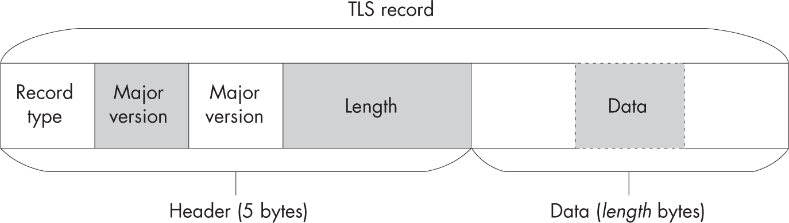
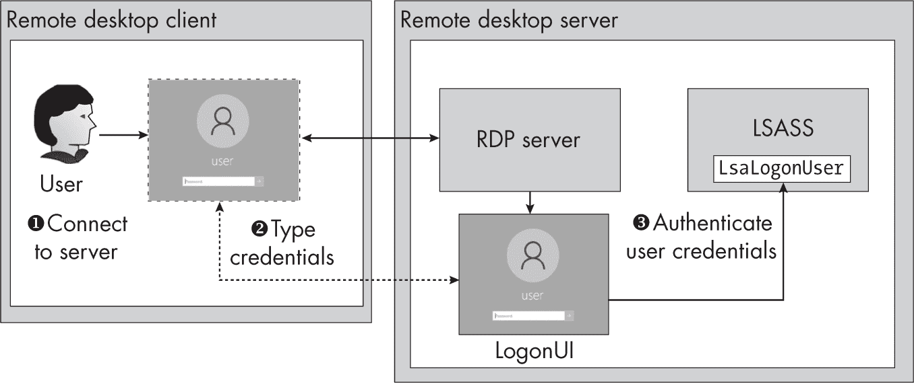
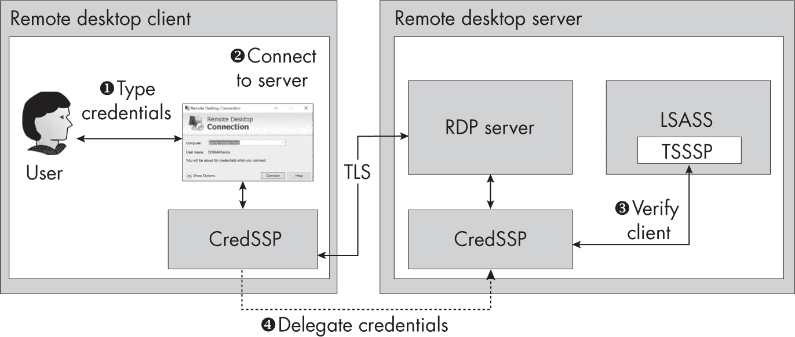
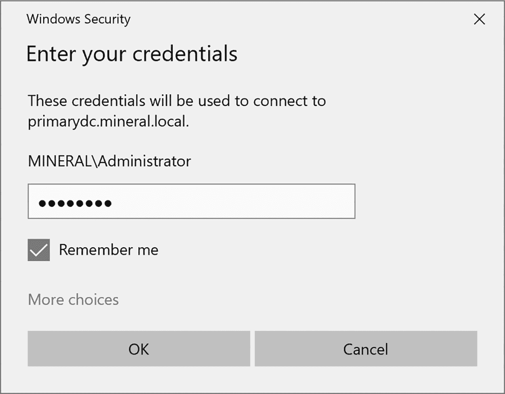
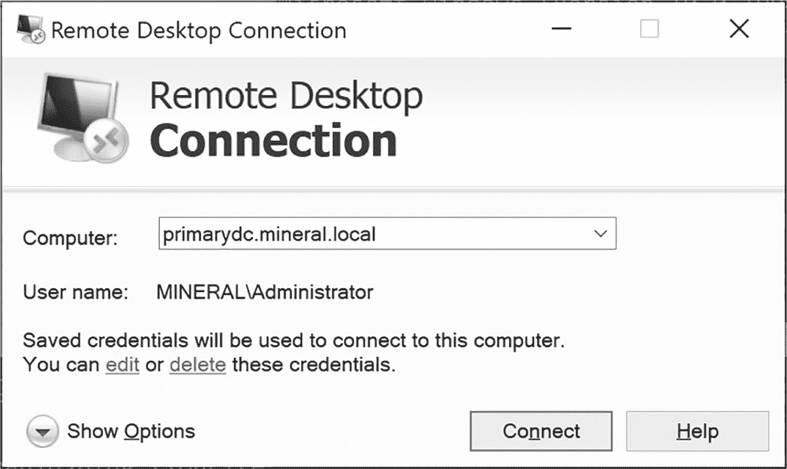

## 第七章：15 协商认证与其他安全包


之前的两章介绍了 Windows 中的两种主要网络认证协议：NTLM 和 Kerberos。然而，Windows 还支持其他多个用于执行认证的包。在这一章中，我们将简要介绍一些其他的安全包。

我将首先提供更多关于应用程序和安全包如何使用缓冲区通过 SSPI API 来传递数据的细节。这将帮助您理解一些包的特殊性。然后，我们将检查协商安全包，以及不太常见的安全通道和 CredSSP 包。我将简要概述设置网络认证上下文时的其他配置选项，并最后描述在使用低框令牌的进程中使用网络认证时发生的情况。

### 安全缓冲区

到目前为止，我暗示使用 SSPI API 是简单的：您生成客户端认证令牌，将其传递给服务器应用程序，更新服务器认证上下文，接收响应中的令牌，并重复此过程，直到认证完成。然而，由于支持的网络认证协议的复杂性，这些 API 不仅可以接受和返回认证令牌。

认证上下文、加密和签名的 API 接受作为参数的通用*安全缓冲区*结构数组。这个安全缓冲区结构，在原生 SDK 中称为SecBuffer，在 PowerShell 模块中被SecurityBuffer类封装。每个安全缓冲区结构包含一个字段，用于确定缓冲区所代表的数据类型，以及一个用于存储内容的固定大小内存缓冲区。您可以使用New-LsaSecurityBuffer PowerShell 命令创建缓冲区，指定缓冲区的类型和内容：

```
PS> **$buf = New-LsaSecurityBuffer -Type Data -Byte @(0, 1, 2, 3)** 
```

在初始化数据时，您可以指定字节数组或字符串。您还需要为缓冲区指定类型。以下是您将遇到的一些最重要的缓冲区类型的简短列表：

Empty  不包含数据；有时作为返回值的占位符使用

Data  包含初始化数据；用于传递和返回数据，例如要加密的消息

Token  包含令牌；用于传递和返回认证令牌及签名

PkgParams  包含安全包的附加配置参数

流头  包含流协议的头部

流尾  包含流协议的尾部

流  包含流协议的数据

额外  包含安全包生成的额外数据

通道绑定  包含通道绑定数据

你可以根据安全包的要求和使用的 API，选择将安全缓冲区作为输入或输出。如果你想定义一个仅输出的缓冲区，可以在创建缓冲区时使用 Size 参数：

```
PS> **$buf = New-LsaSecurityBuffer -Type Data -Size 1000** 
```

有时你可能希望传递一个初始化的缓冲区，其内容不应被安全包修改。为了表示这一点，API 指定了两个可以添加到类型中的额外标志：

只读  缓冲区是只读的，但不是签名的一部分。

ReadOnlyWithChecksum  缓冲区是只读的，并且应作为签名的一部分。

你可以在创建缓冲区时，使用 ReadOnly 或 ReadOnlyWithChecksum 参数来指定这些额外的标志，如下例所示：

```
PS> **$buf = New-LsaSecurityBuffer -Type Data -Byte @(0, 1, 2, 3) -ReadOnly** 
```

是否遵守两个只读标志之间的差异取决于安全包。例如，NTLM 忽略差异，并始终将只读缓冲区添加到签名中，而 Kerberos 只有在你提供的缓冲区具有 ReadOnlyWithChecksum 标志时，才将缓冲区作为签名的一部分添加。

#### 使用带有身份验证上下文的缓冲区

Update-LsaClientContext 和 Update-LsaServerContext PowerShell 命令使用的 SSPI API 接受两个安全缓冲区列表：一个作为 API 的输入，另一个作为输出。你可以使用 InputBuffer 和 OutputBuffer 参数指定这些缓冲区的列表，如 Listing 15-1 所示。

```
❶ PS> **$in_buf = New-LsaSecurityBuffer -Type PkgParams -String "AuthParam"**
❷ PS> **$out_buf = New-LsaSecurityBuffer -Type Data -Size 100**
❸ PS> **Update-LsaClientContext -Client $client -Token $token -InputBuffer $in_buf**
**-OutputBuffer $out_buf**
PS> **$out_buf.Type**
Extra

PS> **ConvertFrom-LsaSecurityBuffer $out_buf | Out-HexDump**
00 11 22 33 
```

Listing 15-1：在身份验证上下文中使用输入和输出缓冲区

本示例显示了在身份验证过程中使用输入和输出缓冲区的假设用法。（你将在本章的后续内容中看到实际的示例。）此示例假设你已将客户端身份验证上下文设置为 $client，并将服务器身份验证令牌设置为 $token。

我们首先创建一个类型为PkgParams的输入缓冲区，其中包含一个字符串❶。缓冲区的内容取决于所使用的包；通常，API 文档会告诉你需要指定的内容。接下来，我们创建一个类型为Data的输出缓冲区，分配最大缓冲区大小为 100 字节❷。然后，我们更新客户端上下文，传递服务器身份验证令牌以及输入和输出缓冲区❸。

该命令会将令牌作为Token类型的缓冲区添加到输入列表的开头，并且还会附加在创建上下文时指定的任何通道绑定。因此，在这种情况下，传递的输入缓冲区列表将包含Token缓冲区，后跟PkgParams缓冲区。有时包可能不希望你包含Token缓冲区；在这种情况下，你可以指定NoToken参数以将其从输入列表中排除。

该命令还会自动将输出Token缓冲区添加到输出列表中，以存储新的身份验证令牌。如果 API 调用成功，它将把该缓冲区的内容分配给上下文的Token属性。通常不需要将该缓冲区从输出中排除，因此命令不会提供这个选项。

在成功调用后，我们检查已更新的输出缓冲区。某些包可能会更改输出缓冲区的类型、大小和内容。例如，当前例子中，类型已从Data更改为Extra。我们可以使用ConvertFrom-LsaSecurityBuffer命令将缓冲区转换回字节数组。显示输出表明我们创建的 100 字节缓冲区现在只有 4 个有效字节。安全包初始化了这 4 个字节，并相应地更新了结构的长度。

#### 使用带签名和封装的缓冲区

使用 Buffer 参数，你可以在调用 Get-LsaContextSignature 和 Test-LsaContextSignature PowerShell 命令时，指定在签名和密封操作期间使用的缓冲区，以及 Protect-LsaContextMessage 和 Unprotect-LsaContextMessage。底层 API 只接受一单一的缓冲区列表，供输入和输出使用。在示例 15-2 中，我们加密了一个包含附加头的缓冲区。

```
PS> **$header = New-LsaSecurityBuffer -Type Data -Byte @(0, 1, 3, 4)**
**-ReadOnlyWithChecksum**
PS> **$data = New-LsaSecurityBuffer -Type Data -String "HELLO"**
PS> **$sig = Protect-LsaContextMessage -Context $client -Buffer $header, $data**
PS> **ConvertFrom-LsaSecurityBuffer -Buffer $header | Out-HexDump**
00 01 03 04

PS> **ConvertFrom-LsaSecurityBuffer -Buffer $data | Out-HexDump**
D5 05 4F 40 22 5A 9F F9 49 66

PS> **Unprotect-LsaContextMessage -Context $server -Buffer $header, $data**
**-Signature $sig**
PS> **ConvertFrom-LsaSecurityBuffer -Buffer $data -AsString**
HELLO 
```

示例 15-2：使用缓冲区加密消息

我们首先创建头部缓冲区，并通过校验和将其标记为只读。通过将其标记为只读，我们确保其内容不会被加密，但仍会被包含在签名中。接下来，我们从字符串中创建数据缓冲区。

然后我们将缓冲区传递给 Protect-LsaContextMessage。该命令返回加密操作的签名，并原地更新加密数据。当转储缓冲区时，我们可以看到，尽管数据缓冲区已被加密，但头部仍未加密。

我们可以使用 Unprotect-LsaContextMessage 解密缓冲区，方法与我们加密缓冲区时类似：通过将缓冲区和签名传递给命令。一旦缓冲区被解密，我们可以将其转换回字符串。如果缓冲区的签名无效，命令将抛出错误。

现在你知道如何为 SSPI API 使用安全缓冲区了，接下来我们来看一下 Negotiate 协议，它允许 Windows 根据调用者的可用凭证自动选择最佳的认证协议。

### 协商协议

如果你不知道服务器支持哪种类型的网络认证会发生什么？你可能首先尝试使用 Kerberos，如果不支持，再切换到 NTLM。但这并不是一种高效的资源利用方式。而且，如果微软稍后推出一种新的、更安全的认证协议，你将不得不更新你的应用程序以支持它。*Negotiate* 协议解决了这两个问题，允许客户端和服务器协商使用最佳的网络认证协议。微软实现的 Negotiate 协议基于*简单和保护的协商机制（SPNEGO）*，该协议在 RFC4178 中定义。

要选择 Negotiate 协议，请在客户端和服务器的身份验证上下文中都使用 Negotiate 协议包。客户端身份验证上下文生成的第一个令牌包含客户端支持的身份验证协议列表。在其 ASN.1 结构中，它还可以嵌入客户端首选的任何身份验证协议的第一个身份验证令牌。例如，它可能嵌入一个 NTLM NEGOTIATE 令牌。在 列表 15-3 中，我们初始化了 Negotiate 客户端身份验证上下文。

```
❶ PS> **$credout = New-LsaCredentialHandle -Package "Negotiate" -UseFlag Outbound**
PS> **$client = New-LsaClientContext -CredHandle $credout**
PS> **Format-LsaAuthToken -Token $client.Token**
❷ <SPNEGO Init>
❸ Mechanism List    :
1.3.6.1.4.1.311.2.2.10         - NTLM
1.2.840.48018.1.2.2            - Microsoft Kerberos
1.2.840.113554.1.2.2           - Kerberos
1.3.6.1.4.1.311.2.2.30         - Microsoft Negotiate Extended
❹ <SPNEGO Token>
<NTLM NEGOTIATE>
Flags: Unicode, Oem, RequestTarget, Signing, LMKey, NTLM,...
Domain: MINERAL
Workstation: GRAPHITE
Version: 10.0.18362.15
</SPNEGO Token> 
```

列表 15-3：初始化 Negotiate 客户端身份验证

我们指定用于使用 Negotiate 安全协议的凭据 ❶，然后继续按常规方式创建上下文。在格式化的令牌中，我们首先看到 SPNEGO Init，这表明这是一个初始化令牌 ❷。头部之后是支持的身份验证协议列表，或称为*安全机制* ❸。该列表按优先顺序降序排列，因此在这种情况下，客户端更喜欢 NTLM 而不是 Kerberos。除非你在一个域连接的系统上，否则你不会在列表中看到 Kerberos。

你可能注意到机制列表中包含两种类型的 Kerberos。Microsoft Kerberos 标识符的存在是由于 Windows 2000 的一个 bug：标识符中的值 113554，或 0x1BB92（十六进制），被截断为 16 位，导致值变为 0xBB92，或 48018。微软出于向后兼容的原因保留了这个错误，这两个值代表同一个 Kerberos 身份验证协议。微软还定义了一个扩展的协商协议，即此列表中的第四种机制，但我们在这里不讨论它。

支持协议列表后面是一个身份验证令牌 ❹。在这种情况下，客户端选择发送初始的 NTLM NEGOTIATE 令牌。

服务器身份验证上下文可以选择其支持的最合适的身份验证协议。通常，它将使用客户端首选的协议，这由支持的身份验证协议列表的顺序决定。然而，它也可以忽略客户端的偏好，若需要可以请求其他身份验证协议。它将把选定的身份验证协议和任何进一步的身份验证令牌发送给客户端。这个身份验证交换过程将持续，直到发生错误或过程完成。列表 15-4 展示了服务器如何响应客户端的请求。

```
PS> **$credin = New-LsaCredentialHandle -Package "Negotiate" -UseFlag Inbound**
PS> **$server = New-LsaServerContext -CredHandle $credin**
PS> **Update-LsaServerContext -Server $server -Token $client.Token**
PS> **Format-LsaAuthToken -Token $server.Token**
<SPNEGO Response>
Supported Mech    : 1.3.6.1.4.1.311.2.2.10 - NTLM
State             : Incomplete
<SPNEGO Token>
<NTLM CHALLENGE>
Flags     : Unicode, RequestTarget, Signing, NTLM, LocalCall, AlwaysSign,...
`--snip--` 
```

列表 15-4：在服务器上继续进行 Negotiate 身份验证

我们首先将客户端身份验证令牌传递给我们创建的服务器身份验证上下文。在格式化的输出中，我们可以看到它是一个 SPNEGO 响应，并且服务器选择使用 NTLM。响应中有一个 State 标志，表示协商当前尚未完成。接下来是身份验证令牌，正如预期，它现在是一个 NTLM 挑战 令牌。

在 列表 15-5 中，我们完成了身份验证。

```
PS> **Update-LsaClientContext -Client $client -Token $server.Token**
PS> **Format-LsaAuthToken -Token $client.Token**
<SPNEGO Response>
State             : Incomplete
<SPNEGO Token>
❶ <NTLM AUTHENTICATE>
Flags      : Unicode, RequestTarget, Signing, NTLM, LocalCall, AlwaysSign,...
`--snip--`

PS> **Update-LsaServerContext -Server $server -Token $client.Token**
PS> **Format-LsaAuthToken -Token $server.Token**
<SPNEGO Response>
❷ State            : Completed

❸ PS> **Update-LsaClientContext -Client $client -Token $server.Token**
PS> **$client.PackageName**
NTLM 
```

列表 15-5：完成 Negotiate 身份验证

下一个发送的客户端身份验证令牌是 NTLM 身份验证 令牌 ❶。请注意，支持的身份验证协议字段没有出现。这个字段只在初始服务器令牌中需要，后续令牌中会省略。

在正常的 NTLM 身份验证中，身份验证通常在此时完成。然而，在 Negotiate 身份验证中，客户端的状态被认为是 不完整，直到我们生成最终的服务器令牌并使用该令牌更新客户端，这样状态才会被标记为 完成 ❷。然后，我们可以使用 PackageName 属性 ❸ 查询最终包，这将显示我们协商的是 NTLM。

要协商使用 Kerberos，协议的工作方式类似。但由于 Kerberos 需要 SPN 才能工作，因此在创建客户端身份验证上下文时，必须使用 Target 参数指定目标名称；否则，协议将选择 NTLM。Kerberos 身份验证的输出将用 Kerberos AP-REQ 和 AP-REP 令牌替换 NTLM 令牌。

现在我们已经介绍了 Negotiate 协议，接下来让我们讨论一些在分析 Windows 系统时可能遇到的较不常见的安全包。

### 不常见的安全包

我们已经介绍了在 Windows 上最常用的三种安全包：NTLM、Kerberos 和 Negotiate。但仍有一些其他安全包具有重要功能，即使你不太可能直接使用它们。我们不会花太多时间讨论这些，但我会给你每个包的一个简单示例，让你了解它们的目的和功能。

#### 安全通道

通过互联网以未加密方式发送敏感信息（如用户凭证）通常被认为是一个坏主意。几种网络协议可以加密网络流量，但迄今为止最常见的是 *传输层安全性（TLS）*，它曾被称为 *安全套接字层（SSL）*，最初由 Netscape 在 1990 年代中期开发，用于保护 HTTP 连接。TLS 的一种变体，*数据报传输层安全性（DTLS）* 协议，可以加密来自不可靠协议的流量，如 *用户数据报协议（UDP）*。

*安全通道* 是作为安全包提供的 TLS 实现，你可以通过 Schannel 包，使用与其他网络认证协议相同的 SSPI API 来访问它。虽然你可以将安全通道用作网络流量的 TLS 或 DTLS 加密层，但你也可以通过客户端证书来为服务器提供客户端认证功能。

让我们通过一个简单的例子来演示如何使用该包。示例 15-6 首先设置客户端凭证句柄和客户端认证上下文。

```
PS> **$credout = New-LsaCredentialHandle -Package "Schannel" -UseFlag Outbound**
PS> **$name = "NotReallyReal.com"**
PS> **$client = New-LsaClientContext -CredHandle $credout -Target $name**
**-RequestAttribute ManualCredValidation**
PS> **Format-LsaAuthToken -Token $client.Token**
SChannel Record 0
Type   : Handshake
Version: 3.3
Data    :
          00 01 02 03 04 05 06 07 08 09 0A 0B 0C 0D 0E 0F  - 0123456789ABCDEF
-----------------------------------------------------------------------------
00000000: 01 00 00 AA 03 03 60 35 C2 44 30 A9 CE C7 8B 81  - ......`5.D0.....
00000010: EB 67 EC F3 9A E3 FD 71 05 70 6C BB 92 19 31 C9  - .g.....q.pl...1.
`--snip--` 
```

示例 15-6：设置安全通道客户端认证上下文

在设置上下文时，你需要指定一个目标名称，这通常是服务器的 DNS 名称。该协议使用此目标名称来验证服务器是否具有该名称的有效证书。TLS 连接也可以被缓存，因此协议可以检查是否已为目标名称存在现有的缓存条目。在这种情况下，名称不会重要，因为我们指定了 ManualCredValidation 请求属性，禁用了服务器证书检查，以便我们可以使用自签名证书为服务器提供服务。

然后，我们格式化认证令牌，它显示了 TLS 协议的简单记录结构（见 图 15-1）。



图 15-1：TLS 记录结构

记录结构包含一个 5 字节的头部，包括记录类型、协议的主版本和次版本号，以及数据长度。头部后面是一个字节列表，其解释取决于记录类型。在 示例 15-6 中，类型是 握手，这是连接设置过程中使用的记录，用于协商加密协议、交换证书和传输加密密钥。其版本是 3.3，表示 TLS 1.2。 （协议设计者认为 TLS 是 SSL 3.0 的一个小改动，因此只增加了次版本号。）

在 示例 15-7 中，我们生成了一个 X.509 证书，并完成了安全通道认证的服务器端设置。

```
PS> **$store = "Cert:\CurrentUser\My"**
❶ PS> **$cert = Get-ChildItem $store | Where-Object Subject -Match $name**
PS> **if ($null -eq $cert) {**
❷     **$cert = New-SelfSignedCertificate -DnsName $name -CertStoreLocation $store**
**}**
❸ PS> **$server_cred = Get-LsaSchannelCredential -Certificate $cert**
PS> **$credin = New-LsaCredentialHandle -Package "Schannel" -UseFlag Inbound**
**-Credential $server_cred**
PS> **$server = New-LsaServerContext -CredHandle $credin**
❹ PS> **while(!(Test-LsaContext $client) -and !(Test-LsaContext $server)) {**
    **Update-LsaServerContext -Server $server -Client $client**
    **Update-LsaClientContext -Client $client -Server $server**
**}** 
```

示例 15-7：初始化安全通道服务器上下文并完成认证

我们首先检查是否有一个证书，其主题名称为我们在创建客户端认证上下文时指定的 DNS 名称❶。PowerShell 通过 *Cert* 驱动程序暴露系统的证书库。在此案例中，我们仅检查当前用户的个人证书库，查找匹配的证书。

如果证书尚不存在，我们可以使用 New-SelfSignedCertificate 命令创建一个新的证书，DNS 名称作为主题，并将其存储在当前用户的个人证书库中❷。这个证书不被信任为 TLS 证书链的一部分。你可以将新的证书添加到 *Cert:\CurrentUser\Root*，这样它会被信任；但是，为了本示例的安全起见，最好禁用客户端中的证书检查。

要使用服务器的证书，我们需要创建一套安全通道凭据，指定供服务器使用的证书❸。请注意，证书必须具有与之关联的私钥，服务器才能使用。如果选择了没有私钥的证书，这行代码将会产生错误。我们可以使用凭据创建一个句柄，从而获得服务器认证上下文。

最后，我们在服务器和客户端认证上下文之间交换令牌，直到认证完成❹。当然，在真实的应用中，这一过程会通过网络连接交换令牌，但为了简化起见，我们在这里完全忽略了网络。

在进行其他操作之前，我们可以检查已协商的安全信息，如示例 15-8 所示。

```
PS> **$client.ConnectionInfo**
Protocol      Cipher  Hash    Exchange
--------      ------  ----    --------
TLS1_2_CLIENT AES_256 SHA_384 ECDH_EPHEM

PS> **$client.RemoteCertificate**
Thumbprint                                Subject
----------                                -------
2AB144A50D93FE86BA45C4A1F17046459D175176  CN=NotReallyReal.com

PS> **$server.ConnectionInfo**
Protocol      Cipher  Hash    Exchange
--------      ------  ----    --------
TLS1_2_SERVER AES_256 SHA_384 ECDH_EPHEM 
```

示例 15-8：检查连接信息

请注意，ConnectionInfo 属性返回已协商的协议和加密算法。在此案例中，我们已协商使用 AES256 加密算法的 TLS 1.2，使用 SHA384 进行完整性校验，并使用椭圆曲线 Diffie-Hellman 交换临时加密密钥。

我们还可以查询服务器的证书。该证书应该与我们在服务器凭据中使用的证书匹配。由于我们指定了手动凭据验证，我们可以检查证书是否有效；如果我们没有请求手动验证，握手过程将会产生错误。最后，我们还可以查询服务器的连接信息，以再次确认其与客户端的连接信息一致。

到此为止，我们已经建立了连接，但还没有向服务器传输任何用户数据。示例 15-9 展示了如何加密和解密通过网络连接发送的应用数据。

```
❶ PS> **$header = New-LsaSecurityBuffer -Type StreamHeader**
**-Size $client.StreamHeaderSize**
PS> **$data = New-LsaSecurityBuffer -Type Data -Byte 0, 1, 2, 3**
PS> **$trailer = New-LsaSecurityBuffer -Type StreamTrailer**
**-Size $client.StreamTrailerSize**
PS> **$empty = New-LsaSecurityBuffer -Empty**
PS> **$bufs = $header, $data, $trailer, $empty**
❷ PS> **Protect-LsaContextMessage -Context $client -Buffer $bufs -NoSignature**
❸ PS> **$msg = $header, $data, $trailer | ConvertFrom-LsaSecurityBuffer**
PS> **$msg_token = Get-LsaAuthToken -Context $client -Token $msg**
PS> **Format-LsaAuthToken $msg_token**
SChannel Record 0
❹ Type    : ApplicationData
Version : 3.3
Data    :
          00 01 02 03 04 05 06 07 08 09 0A 0B 0C 0D 0E 0F  - 0123456789ABCDEF
-----------------------------------------------------------------------------
00000000: 00 00 00 00 00 00 00 01 C7 3F 1B B9 3A 5E 40 7E  - .........?..:^@~
00000010: B0 6C 39 6F EC DA E7 CC CC 33 C2 95              - .l9o.....3..

❺ PS> **$header = New-LsaSecurityBuffer -Type Data -Byte $msg**
PS> **$data = New-LsaSecurityBuffer -Empty**
PS> **$trailer = New-LsaSecurityBuffer -Empty**
PS> **$empty = New-LsaSecurityBuffer -Empty**
PS> **$bufs = $header, $data, $trailer, $empty**
❻ PS> **Unprotect-LsaContextMessage -Context $server -Buffer $bufs -NoSignature**
PS> **ConvertFrom-LsaSecurityBuffer $data | Out-HexDump**
00 01 02 03 
```

示例 15-9：加密和解密应用数据

安全通道需要将四个缓冲区传递给Protect-LsaContextMessage命令❶。第一个缓冲区是 TLS 记录头部。它需要是StreamHeader类型，并且应该是通过StreamHeaderSize属性从上下文查询到的大小。

第二个缓冲区是要加密的数据，必须是Data类型。这个缓冲区有一个最大允许的大小，您可以使用StreamMaxMessageSize属性查询。最大大小通常为 16KB，因此我们在这里使用的 4 个字节应该远小于限制。如果要加密的应用数据大于最大大小，则需要将数据分成更小的部分。

第三个缓冲区将包含流尾部，必须是StreamTrailer类型，并且大小为StreamTrailerSize。最后一个缓冲区是空的。安全通道包似乎并不使用该缓冲区存储任何内容，但您必须传递它，否则调用将失败。

现在我们可以通过将所有四个缓冲区传递给Protect-LsaContextMessage命令❷来加密数据。需要注意的一点是，您还应该传递NoSignature参数。任何生成的签名将成为生成的协议数据的一部分，而不是单独返回，因此该命令不需要自动处理签名。

加密的结果是，头部、数据和尾部缓冲区会填充传输应用数据到服务器所需的数据。我们需要使用ConvertFrom-LsaSecurityBuffer命令❸将缓冲区连接起来。在这种情况下，我们已经知道生成的数据是 TLS 记录，因此我们可以使用身份验证上下文命令来检查其结构。我们可以看到记录类型现在是ApplicationData❹，而在 Listing 15-6 中，记录类型是Handshake。使用ApplicationData表明这是一个加密的数据记录。

现在我们需要在服务器上解密数据。为此，我们仍然需要四个缓冲区；然而，它们的配置稍有不同。对于解密，我们必须将整个 TLS 记录放入第一个缓冲区，类型为Data❺。接下来的三个缓冲区可以为空；它们将在解密过程中填充消息的适当部分。

我们将缓冲区传递给 Unprotect-LsaContextMessage 命令，再次指定 NoSignature 参数，因为签名是协议的一部分 ❻。当检查原本为空的数据缓冲区时，我们现在发现它已经填充了原始的未加密数据。

我已经让安全通道看起来很容易使用，但它比这里展示的要复杂得多。例如，你需要处理带外警报，这些警报表明连接存在问题。除非有未公开的特定功能需要使用，否则我建议你使用现有的类（比如 SslStream，它是 .NET 的一部分）来为你的应用程序添加 TLS 支持。

默认情况下，TLS 协议仅验证安全通道连接中的服务器，使用的是 X.509 证书；然而，服务器可以请求客户端也出示有效的证书进行验证。如果需要客户端发送证书，请在创建服务器身份验证上下文时指定 MutualAuth 请求属性。默认情况下，安全通道会尝试在客户端上为用户找到合适的证书，但你可以通过设置显式证书来覆盖这一搜索，从而生成客户端的凭证。

服务器可以通过相同的 RemoteCertificate 属性，在服务器身份验证上下文中查询客户端的证书。请注意，安全通道默认不会验证客户端证书的内容；这项工作由服务器应用程序来完成。安全通道唯一保证的是客户端能够证明自己拥有与证书相对应的私钥。如果服务器是企业网络的一部分，可以将身份证书添加到 Active Directory 中，这样客户端证书就可以映射到用户账户，并且可以查询 Token 对象以获取用户身份，无需进一步的身份验证。

#### CredSSP

我们将要查看的最终安全包是*CredSSP*，这是由微软开发的一种身份验证协议，用于提高远程桌面连接到 Windows 计算机的安全性。图 15-2 展示了原始的远程桌面实现。



图 15-2：原始远程桌面实现

在原始实现中，客户端会使用客户端应用程序 ❶ 连接到服务器。RDP 服务器会为用户创建一个 LogonUI，显示常规的 Windows 登录界面，并通过 RDP 将此 LogonUI 复制给用户，这样用户就能在客户端机器上看到相同的界面。用户随后可以将用户名和密码输入到 LogonUI ❷ 中，系统会按照 第十二章 中概述的交互式身份验证过程来验证用户的凭证 ❸，并创建桌面会话。

这种实现远程桌面的方法存在几个安全问题。首先，它没有对客户端进行验证；这使得任何人都可以连接，然后尝试猜测用户密码或利用 LogonUI 中的漏洞来获得服务器访问权限。其次，为用户界面启动桌面会话是一个非常消耗资源的操作；很容易通过建立足够的连接来耗尽远程桌面服务器的资源，导致拒绝服务的情况。最后，用户可能会被钓鱼，通过提供凭证给恶意远程服务器（他们被欺骗连接到该服务器）而导致凭证泄露的风险。

微软解决这些问题的方法是 *网络级身份验证（NLA）*。NLA 从 Windows Vista 开始提供，并且是启用远程桌面连接时使用的默认身份验证机制。NLA 通过将身份验证集成到远程桌面协议中，并在启动桌面会话之前验证用户是否具有有效凭证，避免了前面讨论的问题。这可以确认客户端的身份，防止在身份验证成功之前进行消耗资源的桌面设置操作，并且可以让用户避免向服务器泄露其凭证。

CredSSP 包实现了 NLA。它为网络级加密提供了 TLS（基于安全通道），并且有一个单独的 *TS 服务安全包（TSSSP）*，该包使用 Negotiate 协议来验证用户身份，并生成会话密钥以加密用户的凭证，并将其发送到服务器。图 15-3 显示了使用 NLA 连接远程桌面服务器的概览。



图 15-3：使用网络级身份验证的远程桌面连接

首先，用户不立即建立连接，而是将凭证提供给远程桌面客户端 ❶。通常，这包括远程服务器的用户名和密码。

客户端随后使用 CredSSP 包保护网络流量，并通过 TLS 与远程服务器建立连接❷。服务器设置相应的 CredSSP 身份验证上下文以实现这种通信。接下来，它的 CredSSP 上下文使用 TSSSP 包基于现有的网络身份验证协议（如 NTLM 或 Kerberos）来验证客户端❸。如果此验证步骤失败，服务器可以在创建昂贵的桌面之前关闭连接。

你可能期望服务器在网络身份验证完成后立即创建用户的桌面，但在连接到远程桌面时会引入一个额外的问题。通常，当你使用像 NTLM 或 Kerberos 这样的网络身份验证协议时，服务器上创建的登录会话只能访问本地资源，因为用户的凭据只存储在客户端计算机上。这就是我在第十三章中讨论 NTLM 域网络身份验证时提到的双重跳跃问题。

如果远程桌面用户仅访问服务器上的本地资源，这种行为是可以接受的。但在使用远程桌面时，用户通常期望能够通过单点登录访问网络上的其他计算机，继续在该远程桌面会话中工作。为了解决单点登录问题，客户端的 CredSSP 上下文将用户的凭据委派到服务器❹。它使用网络身份验证中协商的会话密钥加密这些凭据。

由于身份验证的会话密钥是从密码派生的，恶意服务器无法使用 NTLM 中继或转发 Kerberos 票证并捕获凭据，因为它们无法解密凭据。一旦 LSA 拥有凭据副本，远程用户就可以像进行交互式身份验证一样使用它们连接到其他网络服务。

虽然 CredSSP 是为远程桌面连接设计的，但你会发现它也用于其他需要凭据委派的用途。例如，在 PowerShell 中，可以通过 WinRM 协议使用 CredSSP，该协议用于 PowerShell 远程执行。这允许你创建一个具有客户端凭据的远程 PowerShell 会话，并且可以连接到网络上的其他系统。

我不会提供使用 CredSSP 的示例，因为在大多数情况下，它看起来像你在测试安全通道时看到的 TLS 连接。相反，让我们讨论一些我尚未提到的最后几个身份验证主题。

### 远程凭证保护和受限管理员模式

你可能会注意到委派凭据到远程桌面服务器时会遇到一个问题。使用 NLA，你可以确信服务器能够验证你的凭据，但如果攻击者攻破了服务器，他们可以在身份验证过程中凭据被解密时窃取这些凭据。也许攻击者在等待你使用具有特权的域管理员凭据连接到服务器。此外，即使你已经注销系统，服务器可能仍会将你的凭据留在 LSASS 进程的内存中，这意味着恶意攻击者可以稍后拾取这些凭据。

Windows 提供了两个可选功能来减少服务器被攻破的风险。第一个是 *远程凭据保护*，它与 Kerberos 身份验证一起工作，避免直接委派用户的凭据。通过使用远程凭据保护，客户端可以按需生成新的 Kerberos 票证来访问资源。这使得客户端能够像委派凭据一样，从远程桌面连接到其他系统。

对于安全性至关重要的是，创建新票证的通道仅在客户端连接到服务器时存在。如果客户端断开连接，服务器将无法再创建新票证，尽管任何已认证的客户端可能仍会保持认证状态。这意味着，只有在特权用户已认证且机器被积极攻破的情况下，才有可能获取有用的凭据。

你需要在域中执行一些设置步骤以启用远程凭据保护。本节不涉及设置过程，但如果该功能已启用，你可以通过运行以下命令行在远程桌面客户端中使用它：

```
PS> **mstsc.exe /remoteGuard** 
```

第二个安全功能是 *限制管理员模式*。与远程凭据保护的最大区别在于，当用户对服务器进行身份验证时，它会创建一个没有用户网络凭据的登录会话。相反，该会话会分配给服务器计算机帐户的网络凭据。因此，该登录会话主要仅在用户希望本地执行任务时有用；除非用户明确向远程服务器提供凭据，否则他们将无法以自己的身份连接到网络资源。然而，该功能确保即使服务器被攻破，也没有特权凭据可以被窃取。

要启用限制管理员模式，首先在 *HKLM\System\CurrentControlSet\Control\Lsa* 中添加一个名为 DisableRestrictedAdmin 的 DWORD 注册表键值，并将其设置为 0。然后，你可以通过以下命令行在执行客户端时启用该模式：

```
PS> **Mstsc.exe /RestrictedAdmin** 
```

这两项安全功能的一个优势（超越它们对凭证委托所施加的限制）是，它们允许远程桌面客户端基于当前用户在 LSA 登录会话中存储的凭证使用单点登录认证。这是因为这两项功能都不需要明文凭证。

### 凭证管理器

使用远程桌面连接的一个烦恼是每次连接时都需要输入密码。这似乎是不可避免的，因为你必须提供账户密码给服务器，以便远程桌面服务器能够执行单点登录。然而，LSA 支持一个功能，可以保存账户密码，以便后续认证时避免再次输入。在输入凭证时，你会看到对话框中有一个“记住我”的复选框，如图 15-4 所示。



图 15-4：输入并保存你的凭证

如果你勾选复选框并成功认证，下一次打开时，你输入服务器名称的对话框应该会稍微变化（图 15-5）。



图 15-5：带有保存凭证的连接对话框

现在，你可以看到对话框提供了编辑或删除此服务器保存的凭证的选项。

对于客户端来说，直接将用户的密码存储到磁盘上的文件中是很容易的，但这样做并不安全。相反，它使用 LSA 提供的一项服务，称为*凭证管理器*。该服务可以存储域密码以便轻松重用，尽管微软并不推荐这种做法。为了演示凭证是如何存储的，清单 15-10 首先使用了 Get-Win32Credential PowerShell 命令，该命令调用了 CredRead Win32 API，以读取远程桌面客户端的凭证。

```
PS> **Get-Win32Credential "TERMSRV/primarydc.domain.local" DomainPassword |**
**Format-Table UserName, Password**
UserName                 Password
--------                 --------
MINERAL\Administrator 
```

清单 15-10：获取远程桌面客户端的凭证

凭证是按目标名称存储的，对于域凭证来说，目标名称是服务的 SPN（在本例中是 TERMSRV/primarydc.domain.local）。查找凭证时，你还需要指定类型，在这种情况下是 DomainPassword。

在这里，我们已将输出格式化为只显示用户名和密码。然而，你可能会注意到一个问题：密码栏为空。这是该服务的故意行为。如果凭证代表一个域密码，除非调用方在 LSA 进程中运行，否则密码不会被返回。

这种行为对于其预期的目的来说是合适的：用于在 LSA 内部运行的安全包。例如，CredSSP 可以根据目标远程桌面服务的 SPN 检查用户是否有凭证，并使用它读取用户的密码以自动进行身份验证。该服务将凭证存储在用户配置文件中的单独文件中，如清单 15-11 所示。

```
PS> **ls "$env:LOCALAPPDATA\Microsoft\Credentials" -Hidden**
    Directory: C:\Users\alice\AppData\Local\Microsoft\Credentials
Mode    LastWriteTime         Length Name
----    -------------        ------ ----
-a-hs-  5/17      10:15 PM    4076   806C9533269FB8C19A759596441A2ECF
-a-hs-  5/17       9:49 PM    420    B5E4F2A09B2613B8305BA6A43DC15D1F
-a-hs-  5/6        6:33 PM    11396  DFBE70A7E5CC19A398EBF1B96859CE5D
-a-hs-  5/17       3:56 PM    1124   E05DBE15D38053457F3523A375594044 
```

清单 15-11：查看用户的凭证文件

每个文件都通过数据保护 API（DPAPI）使用每个用户的密钥进行加密，我在第十章中提到过这个。 这意味着我们应该能够使用 DPAPI 解密自己的凭证文件，通过.NET 的ProtectedData类。清单 15-12 列举了当前用户的凭证文件，并尝试使用ProtectedData解密每个文件。

```
PS> **Add-Type -AssemblyName "System.Security"**
PS> **ls "$env:LOCALAPPDATA\Microsoft\Credentials" -h | ForEach-Object {**
 **$ba = Get-Content -Path $_.FullName -Encoding Byte**
 **[Security.Cryptography.ProtectedData]::Unprotect($ba,$null,"CurrentUser")**
**}**
Exception calling "Unprotect" with "3" argument(s): "The data is invalid."
`--snip--` 
```

清单 15-12：尝试解密用户的凭证文件

不幸的是，每个文件都返回相同的错误：数据无效。虽然它是使用用户的 DPAPI 密钥加密的，但 LSA 会在二进制数据中设置一个特殊的标志，表示只有在 LSA 中运行的代码才能解密它。

有许多方法可以成功解密文件：例如，你可以向 LSA 进程中注入代码并从那里解密它们，或者你可以使用用户的密码和来自 SECURITY 数据库注册表项的值推导出 DPAPI 密钥并自行解密。如果你想走后者的路，我建议你查看现有的工具，如 Mimikatz，它已经实现了这个功能。

解密文件的另一种方法是在 Windows Vista 中引入的。一个特殊的令牌权限，SeTrustedCredmanAccessPrivilege，允许一个进程在访问某些凭证管理器 API 时被 LSA 视为可信。最有趣的这些选定 API 之一是CredBackupCredentials，它会将所有用户的凭证备份到一个文件中，日后如果需要可以用来恢复凭证。备份还包含任何受保护的密码值。

清单 15-13 展示了如何从凭证管理器备份用户的凭证。你必须以管理员身份运行这些命令，因为你需要访问一个特权进程以获得一个带有SeTrustedCredmanAccessPrivilege的令牌，而这个令牌只授予特定类型的进程。

```
PS> **Enable-NtTokenPrivilege SeDebugPrivilege**
❶ PS> **$token = Use-NtObject($ps = Get-NtProcess -Name "winlogon.exe"**
**-Access QueryLimitedInformation) {**
 **$p = $ps | Select-Object -First 1**
 **Get-NtToken -Process $p -Duplicate**
**}**
❷ PS> **$user_token = Get-NtToken**
PS> **$ba = Invoke-NtToken -Token $token {**
❸ **Enable-NtTokenPrivilege SeTrustedCredmanAccessPrivilege**
 **Backup-Win32Credential -Token $user_token**
**}**
❹ PS> **Select-BinaryString -Byte $ba -Type Unicode |**
**Select-String "^Domain:" -Context 0, 2**
> Domain:target=TERMSRV/primarydc.mineral.local
MINERAL\Administrator
Passw0rd10 
```

清单 15-13：从凭证管理器备份用户的凭证

我们首先打开特权的 Winlogon 进程并复制其主令牌 ❶。接下来，我们获取要备份的用户令牌的副本，在这种情况下是当前进程令牌 ❷。然后，我们可以模拟从 Winlogon 复制的令牌 ❸，启用SeTrustedCredmanAccessPrivilege，并调用Backup-Win32Credential PowerShell 命令，该命令调用底层的CredBackupCredentials API。

命令返回一个包含备份的字节数组。该字节数组采用专有格式，因此我们选择所有 Unicode 字符串，并查找以字符串Domain: ❹开头的任何字符串。我们可以看到存储的远程桌面服务凭据，包括名称和密码。

凭据管理器比用户可访问的文件更适合存储 LSA 安全包（如 NTLM、Kerberos 和 CredSSP）使用的凭据。然而，这并不意味着你应该使用它。虽然披露凭据需要一定的工作，但像任何保护机制一样，它最终必须提供未加密的值，攻击者可以提取这些值。

### 附加请求属性标志

当你创建客户端或服务器认证上下文时，你可以指定一组请求属性标志，以改变认证的行为。我们在前面的章节中已经看到支持签名和封装、委派和互认证的功能。但值得强调的是，Kerberos 和 NTLM 还支持一些其他的标志。

#### 匿名会话

如果你不知道目标服务器上的用户帐户怎么办？SSPI 支持*匿名会话*的概念，也称为*NULL 会话*。在匿名会话中，认证用户不需要任何凭据来生成认证令牌。服务器将像往常一样处理认证，但它将为*ANONYMOUS LOGON*用户生成令牌。这允许网络协议始终要求认证，简化协议，并根据认证用户的身份强制执行访问控制。你可以通过在创建客户端认证上下文时使用NullSession请求属性标志来指定匿名会话，如清单 15-14 所示。

```
PS> **$client = New-LsaClientContext -CredHandle $credout**
**-RequestAttribute NullSession** 
```

清单 15-14：添加 NullSession 请求属性标志

如果你随后执行本地 NTLM 网络认证，你应该注意到在清单 15-15 中显示的NTLM AUTHENTICATE令牌发生了变化。

```
<NTLM AUTHENTICATE>
❶ Flags: Unicode, RequestTarget, NTLM, Anonymous,...
Workstation: GRAPHITE
❷ LM Response: 00
NT Response:
Version: 10.0.18362.15
MIC        : 3780F9F6EC815DD34BA8A643162DC5FC

PS> **Format-NtToken -Token $token**
❸ NT AUTHORITY\ANONYMOUS LOGON 
```

清单 15-15：匿名会话中的 NTLM AUTHENTICATE 令牌

NTLM AUTHENTICATE 令牌具有 Anonymous 标志 ❶。此外，LM 响应是一个零字节，而 NT 响应缺失 ❷。查询进程的 Token 对象显示它是匿名用户的 ❸。

在 Kerberos 中，匿名身份验证令牌的格式与 NTLM 的类似，如 Listing 15-16 所示。

```
<KerberosV5 KRB_AP_REQ>
Options: None
<Ticket>
Ticket Version  : 0
ServerName      : UNKNOWN -
Realm           :
Encryption Type : NULL
Key Version    : 0
Cipher Text     :
00000000: 00
<Authenticator>
Encryption Type : NULL
Key Version: 0
Cipher Text:
00000000: 00 
```

Listing 15-16：发送匿名 Kerberos AP-REQ 消息

客户端发送带有空值的票据和认证信息的 AP-REQ 消息。如果你在网络捕获中看到此消息，就可以确定客户端正在建立匿名会话。

#### 身份令牌

当你执行网络身份验证时，最终的 Token 对象是一个模拟级别的令牌。如果服务器能够通过 第四章 中描述的模拟检查，它现在可以访问该用户的资源。如果我们不希望服务器使用我们的身份访问资源怎么办？在这种情况下，我们可以指定 Identify 请求属性标志，如 Listing 15-17 中所示，允许服务器仅接收一个身份验证级别的模拟令牌，而不是完整的模拟级别令牌。

```
PS> **$client = New-LsaClientContext -CredHandle $credout -RequestAttribute Identify** 
```

Listing 15-17：添加 Identify 请求属性标志

这将阻止服务器使用我们的身份访问资源，但仍然允许它检查谁已经进行了身份验证。如果我们随后重新进行身份验证，我们应该注意到 NTLM AUTHENTICATE 令牌发生了变化，如 Listing 15-18 中所示。

```
<NTLM AUTHENTICATE>
❶ Flags      : Unicode, RequestTarget, NTLM, Identity,...
`--snip--`

PS> **Format-NtToken -Token $token -Information**
TOKEN INFORMATION
-----------------
Type       : Impersonation
❷ Imp Level  : Identification 
```

Listing 15-18：检查 NTLM AUTHENTICATE 令牌中的标志，并显示创建的令牌的模拟级别

NTLM AUTHENTICATE 令牌的标志现在包括一个 Identity 标志 ❶。这表示客户端希望仅允许使用身份验证级别令牌。 当我们从服务器的身份验证上下文中获取令牌并进行格式化时，我们可以看到模拟级别确实设置为身份验证级别 ❷。

与 NullSession 类似，Identify 请求属性标志也可以与 Kerberos 配合使用。列表 15-19 显示，指定此标志会导致在 AP-REQ 验证器的 GSSAPI Checksum 字段中设置一个 Identity 标志。

```
<Authenticator>
`--snip--`
Checksum        : GSSAPI
Channel Binding : 00000000000000000000000000000000
Context Flags   : Identity 
```

列表 15-19：AP-REQ GSSAPI 校验和中的身份标志

### 使用低盒令牌的网络认证

当一个进程使用低盒令牌（在第四章中描述）运行时，LSA 强制对网络认证的使用进行限制。这是为了使沙箱应用程序更难滥用网络认证来获取用户的登录会话凭据，并通过这些凭据访问用户资源。

如果低盒进程能够创建客户端认证上下文，它只能在以下三种情况生成认证令牌：

+   使用企业认证功能的登录会话凭据

+   使用已知 Web 代理的登录会话凭据

+   使用显式凭据，例如用户名和密码

让我们讨论一下这些场景。

#### 使用企业认证功能进行认证

*企业认证功能*，由 SID S-1-15-3-8 表示，在创建低盒令牌时可以授予。拥有此功能时，低盒进程可以使用用户的登录会话凭据生成任何支持的网络认证令牌，例如 NTLM 或 Kerberos 令牌，且不受限制。

企业认证功能旨在供企业在内部应用中使用。对于企业以外的用户，部署低盒进程的主要方式是通过 Microsoft 应用商店，该商店在应用提交指南中限制了此功能的使用。如果你提交的应用使用了企业认证功能，它必须通过额外的审查，可能会被拒绝。然而，如果你在商店应用之外创建低盒令牌进行测试，则没有任何限制，如列表 15-20 中所示。

```
PS> **$cred = New-LsaCredentialHandle -Package "Negotiate" -UseFlag Outbound**
PS> **$sid = Get-NtSid -PackageName "network_auth_test"**
❶ PS> **Use-NtObject($token = Get-NtToken -LowBox -PackageSid $sid) {**
    **Invoke-NtToken $token {New-LsaClientContext -CredHandle $cred}**
**}**
❷ Exception calling ".ctor" with "5" argument(s): "(0x80090304) - The Local
Security Authority cannot be contacted"

PS> **$cap = Get-NtSid -KnownSid CapabilityEnterpriseAuthentication**
❸ PS> **Use-NtObject($token = Get-NtToken -LowBox -PackageSid $sid**
**-CapabilitySid $cap) {**
  ❹ **$auth = Invoke-NtToken $token {New-LsaClientContext -CredHandle $cred}**
    **Format-LsaAuthToken $auth**
**}**
<SPNEGO Init>
Mechanism List    :
1.3.6.1.4.1.311.2.2.10         - NTLM
1.2.840.48018.1.2.2            - Microsoft Kerberos
`--snip--` 
```

列表 15-20：测试低盒企业认证功能

我们首先创建没有功能的低盒 Token 对象 ❶。当我们使用 New-LsaClientContext 创建客户端身份验证上下文时，我们会遇到错误 ❷。这个错误来自 InitializeSecurityContext API，这是 PowerShell 在后台调用的。接下来，我们创建具有功能的低盒令牌 ❸。这一次，我们可以成功创建客户端身份验证上下文并格式化客户端身份验证令牌 ❹。

#### 对已知 Web 代理的身份验证

低盒进程可以为 Web 代理生成身份验证令牌，这通常要求域用户可以访问互联网。为了支持此用例，如果目标名称设置为已批准代理服务器的地址，则可以使用用户的登录会话凭据执行网络身份验证。

例如，假设目标名称是 HTTP/proxy.mineral.local。系统管理员必须通过组策略或使用*代理自动配置（PAC）*脚本来配置代理地址，这可以确保具有任意代理配置的 Web 请求不会通过 LSA 的检查。列表 15-21 展示了如何使用 Web 代理目标名称来允许网络身份验证。必须已配置系统 Web 代理才能使此脚本正常工作。

```
PS> **$cred = New-LsaCredentialHandle -Package "NTLM" -UseFlag Outbound**
❶ PS> **$client = New-Object System.Net.WebClient**
PS> **$proxy = $client.Proxy.GetProxy("http://www.microsoft.com").Authority**
❷ PS> **$target = "HTTP/$proxy"**
PS> **$target | Write-Output**
HTTP/192.168.0.10:1234

PS> **$sid = Get-NtSid -PackageName "network_auth_test"**
❸ PS> **Use-NtObject($token = Get-NtToken -LowBox -PackageSid $sid) {**
  ❹ **$client = Invoke-NtToken $token {**
        **New-LsaClientContext -CredHandle $cred -Target $target**
    **}**
    **Format-LsaAuthToken $client**
**}**
<NTLM NEGOTIATE>
Flags: Unicode, Oem, RequestTarget, NTLM, AlwaysSign,... 
```

列表 15-21：测试低盒 Web 代理身份验证

首先，我们使用 WebClient .NET 类 ❶ 查询代理设置。然后，我们构建目标 SPN，使用 HTTP 服务类和代理地址 ❷。

接下来，我们创建低盒令牌 ❸。请注意，我们没有指定企业身份验证功能。我们创建客户端身份验证上下文并使用目标 SPN ❹。初始身份验证成功，然后我们可以执行客户端对目标代理的身份验证。

这种代理身份验证被认为是安全的，因为服务应在允许身份验证之前检查目标名称。如果低盒进程为代理 SPN 生成身份验证，但随后将其发送到 SMB 服务器，则身份验证过程应失败。对于 Kerberos 身份验证，SPN 选择用于票证的密钥，因此如果将错误的 SPN 发送到错误的服务，票证应无法解密。

#### 使用显式凭据进行身份验证

最后一种选项，如列表 15-22 所示，是在创建提供给客户端身份验证上下文的凭据句柄时指定显式凭据。

```
PS> **$cred = New-LsaCredentialHandle -Package "Negotiate" -UseFlag Outbound**
**-ReadCredential**
UserName: **user**
Domain: **GRAPHITE**
Password: ************

PS> **$sid = Get-NtSid -PackageName "network_auth_test"**
PS> **Use-NtObject($token = Get-NtToken -LowBox -PackageSid $sid) {**
 **Invoke-NtToken $token {**
❶ **$c = New-LsaClientContext -CredHandle $cred -Target "CIFS/localhost"**
 **Format-LsaAuthToken $c**
 **}**
**}**
<NTLM NEGOTIATE>
Flags: Unicode, Oem, RequestTarget, NTLM, AlwaysSign,... 
```

列表 15-22：使用显式凭据初始化客户端身份验证上下文

要初始化客户端身份验证上下文，仍然需要提供目标 SPN ❶。然而，你无需指定已知的代理，因为目标可以是任何服务或主机。在这种情况下，我们指定了CIFS/ localhost SPN。

在低框令牌沙箱中，你可以充当网络身份验证服务器，因为有可能为不同的用户获取一个Token对象。然而，除非令牌的用户完全匹配调用者的用户和低框包 SID，否则返回的令牌会被设置为身份验证级别，这可以防止它被滥用以提升权限。即使低框令牌具有企业身份验证能力，这一模拟级别的限制也会生效，因为这仅授予对客户端身份验证上下文的访问权限。

### 身份验证审计事件日志

让我们总结一下关于身份验证的讨论，概述交互式和网络身份验证过程中生成的审计数据。当你监控企业网络时，你可能想知道哪些用户尝试过登录到 Windows 系统。通过分析审计日志，你可以识别他们对机器的成功和失败的身份验证尝试。

你可以在我们在第九章讨论对象审计事件时检查的相同安全事件日志中找到身份验证审计日志记录。我们可以使用类似的方法通过事件 ID 过滤日志，以获取我们感兴趣的事件。以下是一些重要身份验证事件的事件 ID：

4624  账户成功登录。

4625  账户登录失败。

4634  账户注销。

让我们看看这些事件提供的信息。列表 15-23 首先查询安全事件日志中的成功登录事件4624。以管理员身份运行此命令。

```
PS> **Get-WinEvent -FilterHashtable @{logname='Security';id=@(4624)} |**
**Select-Object -ExpandProperty Message**
An account was successfully logged on.

Subject:
        Security ID:            S-1-5-18
        Account Name:           GRAPHITE$
        Account Domain:         MINERAL
        Logon ID:               0x3E7

Logon Information:
        Logon Type:             2
        Restricted Admin Mode:  No
        Virtual Account:        No
        Elevated Token:         Yes

Impersonation Level:            Impersonation

New Logon:
        Security ID:            S-1-5-21-1195776225-522706947-2538775957-1110
        Account Name:           alice
        Account Domain:         MINERAL
        Logon ID:              0x15CB183
        Linked Logon ID:        0x15CB1B6
        Network Account Name:   -
        Network Account Domain: -
        Logon GUID:             {d406e311-85e0-3932-dff5-99bf5d834535}

Process Information:
        Process ID:             0x630
        Process Name:           C:\Windows\System32\winlogon.exe

Network Information:
        Workstation Name:       GRAPHITE
        Source Network Address: 127.0.0.1
        Source Port:            0

Detailed Authentication Information:
        Logon Process:            User32
        Authentication Package:   Negotiate
        Transited Services:       -
        Package Name (NTLM only): -
        Key Length:               0 
```

列表 15-23：成功交互式身份验证事件的日志记录

此列表显示了一个成功身份验证事件的示例条目。在一个常用的系统中，可能会有许多这样的条目，因此只需选择一个进行检查。

事件记录包含大量信息，其中一些可能在某些登录类型中没有填充。每个条目以发起认证请求的用户帐户的信息开始。对于交互式认证，您可能会发现这是一个特权帐户，例如 *SYSTEM* 计算机帐户。接下来是关于登录的信息，包括登录类型。2 表示交互式。其他一些登录类型包括网络 (3)、批处理 (4)、服务 (5) 和远程交互式 (10)。此部分还指示是否使用了受限管理员模式进行认证，并且该事件代表的会话是否已提升。接下来是指示令牌的模拟级别。

以下部分包含为成功认证创建的登录会话的详细信息，包括用户的 SID、名称和域。由于这是一次提升的交互式认证，我们看到了两个登录 ID：一个是会话本身，另一个是为 UAC 创建的链接的非提升登录会话。

接下来是发起认证请求的进程的详细信息。在此示例中，是调用了 LsaLogonUser 的进程。最后两个部分包含网络认证信息和未包含在其他类别中的附加详细信息。详细认证信息的一部分是用于认证的安全包。在这种情况下，使用了 Negotiate，因此它将选择最适合用户的认证协议。

无论是通过 LsaLogonUser 还是通过网络认证，您都会看到相同类型的事件记录。例如，如果事件是针对 NTLM 网络认证的，您应该会在详细的认证信息部分看到类似列表 15-24 的内容。

```
Detailed Authentication Information:
  Logon Process:             NtLmSsp
  Authentication Package:    NTLM
  Transited Services:        -
  Package Name (NTLM only):  NTLM V2
  Key Length:                128 
```

列表 15-24：成功的 NTLM 网络认证的详细信息

现在让我们看看一个失败的认证事件。列表 15-25 以管理员身份查询 ID 为 4625 的事件。

```
PS> **Get-WinEvent -FilterHashtable @{logname='Security';id=@(4625)} |**
**Select-Object -ExpandProperty Message**
An account failed to log on.
`--snip--`
Account For Which Logon Failed:
    Security ID:        S-1-0-0
    Account Name:       alice
    Account Domain:     MINERAL

Failure Information:
    Failure Reason:     Unknown user name or bad password.
    Status:             0xC000006D
    Sub Status:         0xC000006A
`--snip--` 
```

列表 15-25：失败的认证事件日志记录

在输出中，我仅突出显示了一个记录。它与成功认证的记录有许多相同的部分，因此我删除了在这两种类型的记录中都出现的内容。

这里显示的第一个部分包含了无法进行身份验证的用户帐户的详细信息。SID 条目并不保证有效；例如，在这个案例中，SID 并不代表 *alice* 用户。接下来，我们会看到关于失败的更多细节，首先是错误的文本版本，然后是状态代码，这里是一个 NT 状态码 STATUS_LOGON_FAILURE。子状态代码提供了更多细节；在这个案例中，它是 STATUS_WRONG_PASSWORD，表示用户没有提供有效的密码。你可能遇到的其他子状态代码包括 STATUS_NO_SUCH_USER，如果用户不存在，和 STATUS_ACCOUNT_DISABLED，如果用户的帐户已被禁用。

最后，我们将查看一个注销事件，这是在删除登录会话时生成的。通常，当没有任何 Token 对象引用该登录会话时，就会发生这种情况。以管理员身份运行 Listing 15-26 中的命令。

```
PS> **Get-WinEvent -FilterHashtable @{logname='Security';id=@(4634)} |**
**Select-Object -ExpandProperty Message**
An account was logged off.

Subject:
    Security ID:    S-1-5-21-1195776225-522706947-2538775957-1110
    Account Name:   alice
    Account Domain: MINERAL
    Logon ID:       0x15CB183

Logon Type:        2 
```

Listing 15-26：注销身份验证事件日志记录

这个事件日志记录比成功或失败的身份验证要简单得多。它只包含主体信息，包括用户名和域名。为了将成功的身份验证事件与相应的注销事件匹配，你可以比较登录 ID。

### 实际示例

最后，我们将通过本章所学的命令来进行一些实际的例子。

#### 确定身份验证失败的原因

在上一节中我提到，当身份验证过程失败时，你会在事件日志中看到两个状态代码：一个是主要状态，通常是 STATUS_LOGON_FAILURE，另一个是子状态，如 STATUS_WRONG_PASSWORD。不幸的是，事件日志只会自动将主要状态码转换为字符串，然后通常生成一个通用的“用户名或密码不正确”的消息，这对于诊断身份验证失败并没有太大帮助。让我们写一个简单的脚本来分析事件日志记录，并自动将子状态代码转换为消息。

我们必须解决的一个直接问题是如何从事件日志记录中获取子状态代码。你可以尝试手动从文本消息中解析它。然而，你会看到不同语言的不同消息，并且可能无法依赖于诸如SubStatus之类的文本字符串。然而，事件日志记录确实将所有重要信息作为单独的属性存储，并且你可以通过事件日志记录对象上的Properties属性来查询这些信息。Listing 15-27 显示了这样的查询生成的输出。

```
PS> **$record = Get-WinEvent -FilterHashtable @{logname='Security';id=@(4634)} | Select -First 1**
PS> **$record.Properties**
Value
-----
S-1-5-21-1195776225-522706947-2538775957-1110
alice
MINERAL
`--snip--` 
```

Listing 15-27: 显示事件日志的记录属性

不幸的是，属性列表仅包含值，没有显示属性名称。我们想要的是名为SubStatus的属性，这个属性可能总是位于属性列表的相同索引处，但不能保证它总是如此。因此，为了获取这些信息，我们必须手动检查存储事件日志属性的 XML。我们可以通过使用记录的ToXml方法来请求此信息。Listing 15-28 展示了如何从事件日志记录中提取命名的属性。

```
PS> **function Get-EventLogProperty {**
    **[CmdletBinding()]**
    **param(**
        **[parameter(Mandatory, Position = 0, ValueFromPipeLine)]**
        **[System.Diagnostics.Eventing.Reader.EventRecord]$Record**
    **)**

    **PROCESS {**
      ❶ **$xml = [xml]$Record.ToXml()**
        **$ht = @{**
            **TimeCreated = $Record.TimeCreated**
            **Id = $Record.Id**
        **}**
❷ **foreach($ent in $xml.Event.EventData.data) {**
 **$ht.Add($ent.Name, $ent."#text")**
 **}**
 **[PSCustomObject]$ht**
 **}**
**}**
PS> **Get-EventLogProperty $record**
SubjectUserName: alice
TimeCreated: 2/24 1:15:06 PM
IpPort                    : -
SubjectLogonId            : 0x54541
KeyLength                 : 0
LogonProcessName          : Advapi
IpAddress                 : -
LmPackageName             : -
TransmittedServices       : -
WorkstationName           : GRAPHITE
SubjectUserSid            : S-1-5-21-1195776225-522706947-2538775957-1110
❸SubStatus                 : 0xc000006a
AuthenticationPackageName : Negotiate
SubjectDomainName         : MINERAL
ProcessName               : C:\ProgramFiles\PowerShell\7\pwsh.exe
❹FailureReason             : %%2313
LogonType                 : 3
Id                        : 4625
Status                    : 0xc000006d
TargetUserSid             : S-1-0-0
TargetDomainName          : mineral.local
ProcessId                 : 0xe48
TargetUserName            : alice 
```

Listing 15-28: 提取命名的事件日志记录属性

我们首先定义Get-EventLogProperty函数，它将把每个记录转换为一个新的对象。我们需要提取事件日志记录的 XML，然后将其解析为 XML 文档 ❶。EventData XML 元素存储了属性，因此我们使用 PowerShell 提供的对象模型来提取每个元素，并根据属性名称和正文文本构建一个哈希表 ❷。然后，我们将哈希表转换为自定义的 PowerShell 对象，以便于查询。

在检查新对象的属性时，我们发现SubStatus属性现在可以轻松访问 ❸。我们的方法有一些局限性；例如，我们尚未将失败原因从资源标识符转换为字符串 ❹。然而，我们不需要失败原因，因为如果需要的话，我们可以从状态代码中获取消息。

现在让我们扩展代码，以提取身份验证失败的子状态（Listing 15-29）。

```
❶ PS> **function Get-AuthFailureStatus {**
    **[CmdletBinding()]**
    **param(**
        **[parameter(Mandatory, Position = 0, ValueFromPipeLine)]**
        **$Record**
    **)**

    **PROCESS {**
        **[PSCustomObject]@{**
            **TimeCreated = $Record.TimeCreated**
            **UserName = $Record.TargetUserName**
            **DomainName = $Record.TargetDomainName**
          ❷ **SubStatus = (Get-NtStatus -Status $Record.SubStatus).StatusName**
        **}**
    **}**
**}**

❸ PS> **Get-NtToken -Logon -User $env:USERNAME -Domain $env:USERDOMAIN**
**-Password "InvalidPassword"**
PS> **Get-NtToken -Logon -User "NotARealUser" -Domain $env:USERDOMAIN -Password "pwd"**
❹ PS> **Get-WinEvent -FilterHashtable @{logname='Security';id=@(4625)} |**
**Select-Object -First 2 | Get-EventLogProperty | Get-AuthFailureStatus**
TimeCreated           UserName      DomainName  SubStatus
-----------           --------      ----------  ---------
2/24     1:15:06 PM  alice         MINERAL     STATUS_WRONG_PASSWORD
2/24/     1:14:45 PM  NotARealUser  MINERAL     STATUS_NO_SUCH_USER 
```

Listing 15-29: 解析身份验证失败属性并转换其子状态代码

我们首先定义一个将记录属性转换为更简单的身份验证失败对象的函数 ❶。我们仅提取时间戳、用户名和域名，然后将SubStatus属性转换为其 NT 状态名称 ❷。

接着，我们执行了两次身份验证失败的操作，以便在事件日志中生成一些记录❸。我们过滤日志，只返回身份验证失败的记录，然后在管道中转换这些记录❹。在生成的输出中，我们可以看到两个条目。第一个条目的子状态是STATUS_WRONG_PASSWORD，表示用户是有效的，但密码错误。第二个条目显示STATUS_NO_SUCH_USER，表示用户不存在。

#### 使用安全通道提取服务器的 TLS 证书

接下来，让我们演示一个如何使用安全通道身份验证协议的简单例子。我们将与一个安全的 Web 服务器建立 TCP 连接，提取其服务器证书，并使用该证书获取有关该服务器所属组织的详细信息，以及证书是否有效。

请注意，获取服务器证书的方式可能有比本例中方法更好的选择。例如，大多数网页浏览器允许你通过访问服务器来显示和导出证书。然而，这并不能帮助你深入了解安全通道是如何工作的。首先，将 Listing 15-30 中的内容复制到脚本文件*get_server_cert.ps1*中。

```
❶ param(
    [Parameter(Mandatory, Position = 0)]
    [string]$Hostname,
    [int]$Port = 443
)

$ErrorActionPreference = "Stop"

❷ function Get-SocketClient {
    param(
        [Parameter(Mandatory)]
        $Socket
    )

    $Socket.ReceiveTimeout = 1000
    $Socket.Client.NoDelay = $true
    $stream = $Socket.GetStream()
    return @{
        Reader = [System.IO.BinaryReader]::new($stream)
        Writer = [System.IO.BinaryWriter]::new($stream)
    }
}

❸ function Read-TlsRecordToken {
    param(
        [Parameter(Mandatory)]
        $Client
    )
    $reader = $Client.Reader
    $header = $reader.ReadBytes(5)
    $length = ([int]$header[3] -shl 8) -bor ($header[4])
    $data = @()
  ❹ while($length -gt 0) {
        $next = $reader.ReadBytes($length)
        if ($next.Length -eq 0) {
            throw "End of stream."
        }
        $data += $next
        $length -= $next.Length
    }

    Get-LsaAuthToken -Token ($header+$data)
}

❺ Use-NtObject($socket = [System.Net.Sockets.TcpClient]::new($Hostname, 443)) {
    $tcp_client = Get-SocketClient $socket

  ❻ $credout = New-LsaCredentialHandle -Package "Schannel" -UseFlag Outbound
    $client = New-LsaClientContext -CredHandle $credout -Target $Hostname
-RequestAttribute ManualCredValidation

  ❼ while(!(Test-LsaContext -Context $client)) {
      ❽ if ($client.Token.Length -gt 0) {
            $tcp_client.Writer.Write($client.Token.ToArray())
        }

      ❾ $record = Read-TlsRecordToken -Client $tcp_client
        Update-LsaClientContext -Client $client -Token $record
    }

  ❿ $client.RemoteCertificate
} 
```

Listing 15-30: 读取 TLS 服务器证书的脚本

我们首先定义了几个参数，分别是服务器的主机名和可选的 TCP 端口❶。HTTPS 使用的是知名端口 443；然而，TLS 并不局限于这个端口，因此如果你想连接到不同的服务，可以更改端口。

然后，我们定义了几个函数。第一个函数Get-SocketClient，将 TCP 客户端对象转换为BinaryReader和BinaryWriter❷。TLS 协议具有相对简单的二进制记录结构，因此使用这些类可以更轻松地解析网络流量。

第二个函数Read-TlsRecordToken从服务器读取单个 TLS 记录，并将其作为身份验证令牌返回❸。我们首先从记录中读取 5 字节的头部，提取数据的长度，然后从流中读取数据。由于 TCP 是一个流协议，无法保证所有所需数据会在一次读取中返回，因此你需要通过循环读取，直到接收到所有所需的数据❹。

我们现在进入脚本的主体部分。首先，我们通过提供给脚本的主机名和 TCP 端口建立 TCP 连接❺。然后，我们将套接字转换为读写对象。接下来，我们创建Schannel凭据和客户端上下文❻，将客户端上下文目标设置为主机名，并启用手动凭据验证，因为在本例中，我们并不关心服务器证书是否无效。

现在，我们可以循环直到客户端上下文完成认证❼。如果需要向服务器发送令牌，我们将其转换为字节并写入 TCP 套接字❽。正如我们之前看到的，TLS 客户端和服务器可以生成多个 TLS 记录，上下文必须在生成新令牌之前处理这些记录。

一旦我们发送了客户端认证令牌，就可以从服务器读取下一个 TLS 记录并更新客户端❾。这个循环将继续，直到认证成功完成或异常停止脚本。最后，我们可以从脚本返回服务器的证书❿。

列表 15-31 展示了如何使用我们编写的脚本。

```
PS> **$cert = .\get_server_cert.ps1 -Hostname www.microsoft.com**
PS> **$cert**
Thumbprint                                Subject
----------                                -------
9B2B8AE65169AA477C5783D6480F296EF48CF14D  CN=www.microsoft.com,...

PS> **$cert | Export-Certificate -FilePath output.cer**
    Directory: C:\demo
Mode               LastWriteTime           Length Name
----               -------------           ------ ----
-a----             02-21   17:10           2173   output.cer 
```

列表 15-31：获取 www.microsoft.com 的服务器证书并将其导出到文件

你通过提供服务器的主机名来调用脚本。你可以选择指定 TCP 端口，但在本例中，我们使用端口 443，也就是大家熟知的 HTTPS，这是脚本的默认端口。返回的证书是一个可以使用 PowerShell 检查的对象。你还可以使用 Export-Certificate 命令将证书导出到文件。

### 总结

本章首先描述了安全缓冲区及其如何与 SSPI API 一起用于在网络认证、加密和签名过程中传递信息。接着概述了 Negotiate 认证协议，当双方事先不确定使用哪种认证协议时，该协议允许进行网络认证。

接下来，我们介绍了一些不常用的安全包，如安全通道和 CredSSP。这些有特定的应用领域，但相对于 NTLM 或 Kerberos，它们的使用更复杂。我们还讨论了 NTLM 和 Kerberos 中的匿名和身份网络认证，并讲解了低盒令牌沙箱内的网络认证（以及我如何多次绕过这种认证）。

本章最后概述了用户认证时生成的安全审计事件。你了解了不同的事件类型，用于描述用户认证是否成功，并了解了如何使用这些信息来找出哪些用户尝试对工作站进行认证。

### 最终思考

在我们结束本章时，我希望你能将你在这里学到的关于 Windows 安全内部结构的信息应用到你自己的工作中。我已经详细讲解了许多方面，从安全参考监视器和令牌到访问检查和身份验证，并提供了示例来演示重要主题。

然而，我无法提供脚本来演示我们讨论的每种功能组合。因此，我建议你查阅<code class="SANS_TheSansMonoCd_W5Regular_11">NtObjectManager</code>模块提供的各种命令的帮助功能，并尝试它们的使用。如果你在 Windows 虚拟机上进行测试，几乎不会造成任何损害。（事实上，如果你在实验时遇到蓝屏死机，可能是个好机会去探查原因，因为你可能发现了一个安全漏洞。）

在本章之后是一些额外的参考材料：附录 A 包含了设置测试域网络的操作指南，附录 B 包含了 SDDL 别名列表。
