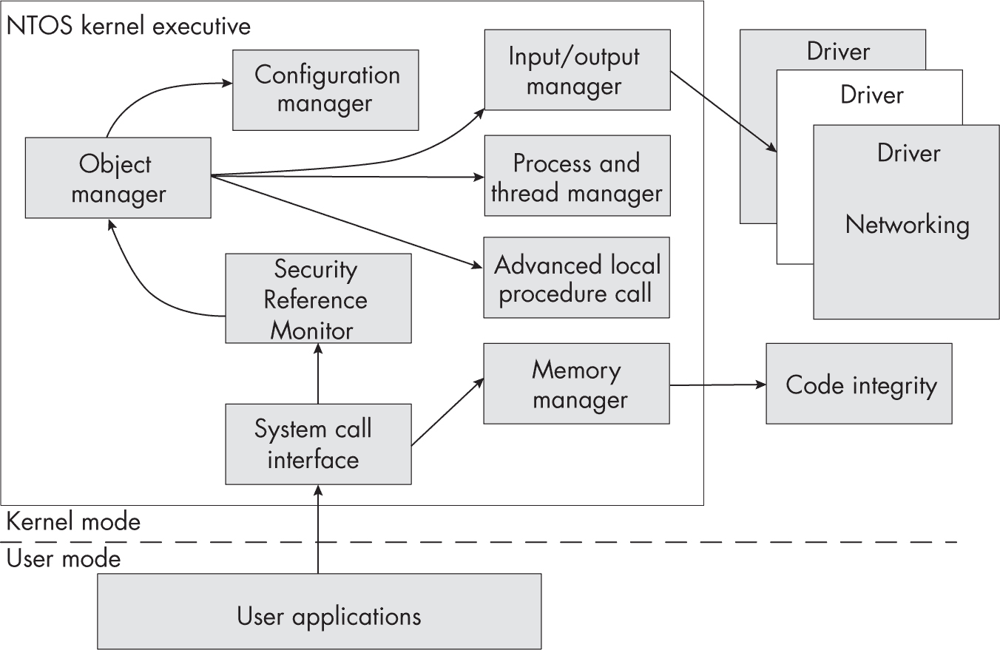
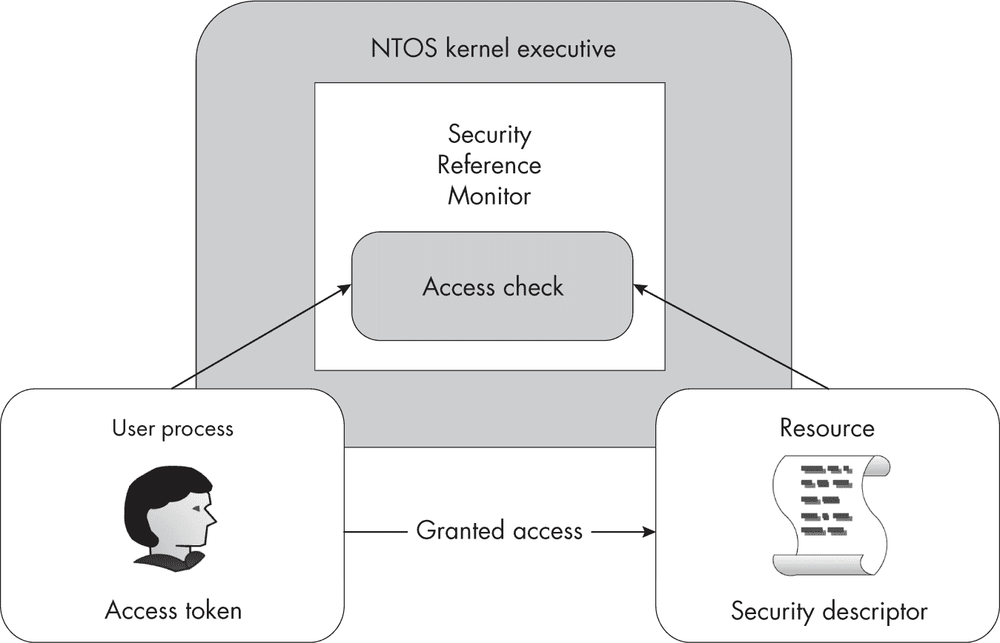
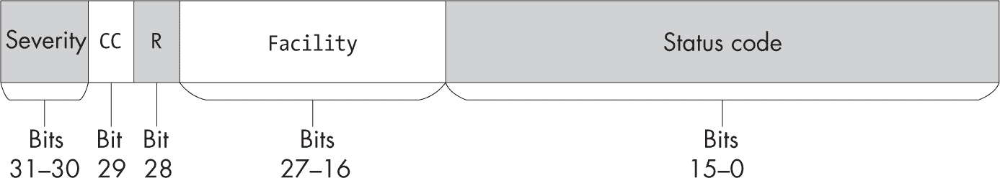
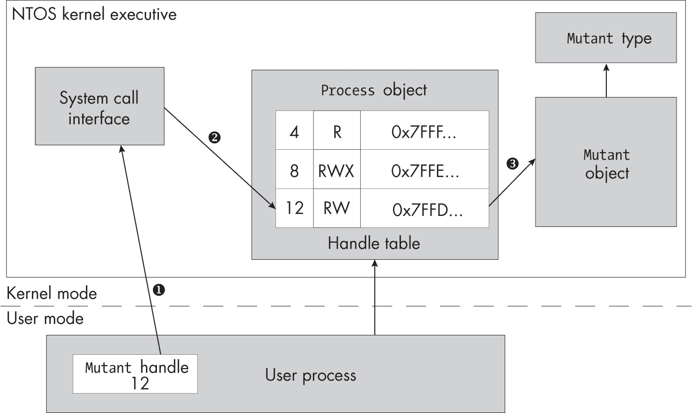
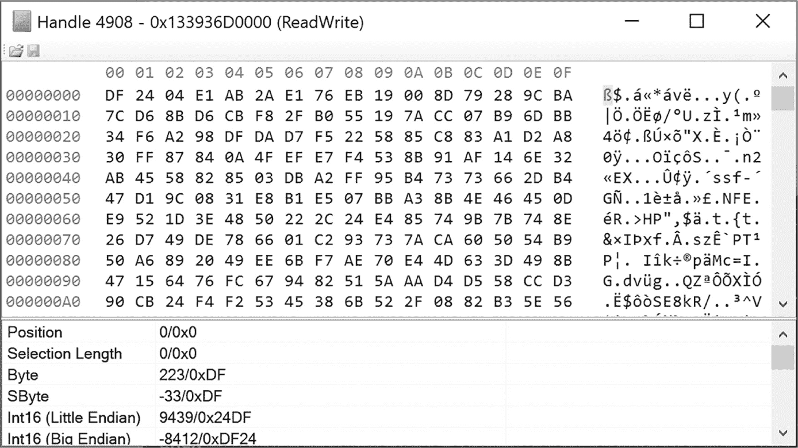

<hgroup>

## <samp class="SANS_Futura_Std_Bold_Condensed_B_11">2</samp> <samp class="SANS_Dogma_OT_Bold_B_11">WINDOWS 内核</samp>

</hgroup>


Windows 是一个安全的多用户操作系统。然而，它也是现代操作系统中最难以深入理解的系统之一。在我们深入探讨其安全性之前，本书的这一部分将为你提供操作系统结构的概述。我们还将借此机会了解如何使用本书核心的 PowerShell 模块。

我们将考虑运行中的操作系统的两个部分：内核和用户模式应用程序。内核做出决定，确定用户在系统上能做什么。然而，你在 Windows 机器上使用的大多数应用程序都运行在用户模式下。本章将重点介绍内核；下一章将重点讨论用户模式应用程序。

在接下来的章节中，我们将讨论构成 Windows 内核的各个子系统。对于每个子系统，我将解释其用途以及如何使用它。我们将从对象管理器开始，同时探索系统调用，它们允许用户模式的应用程序访问内核对象。接着我们将讨论输入/输出管理器、通过进程和线程管理器创建应用程序的方式，以及内存管理器如何表示内存。整个过程中，我将概述如何使用 PowerShell 检查这些子系统的行为。

### <samp class="SANS_Futura_Std_Bold_B_11">Windows 内核执行</samp>

*Windows NTOS 内核执行*，简称*内核*，是 Windows 的核心。它提供了操作系统的所有特权功能，并通过接口使用户应用程序能够与硬件进行通信。内核被划分为多个子系统，每个子系统都有其专门的功能。图 2-1 展示了我们在本书中最为关注的组件的示意图。



<samp class="SANS_Futura_Std_Book_Oblique_I_11">图 2-1：Windows 内核执行模块</samp>

内核执行中的每个子系统都暴露了供其他子系统调用的 API。如果你正在查看内核代码，可以通过每个 API 的两个字符前缀迅速确定它属于哪个子系统。图 2-1 中子系统的前缀在表 2-1 中有所展示。

<samp class="SANS_Futura_Std_Heavy_B_11">表 2-1：</samp> <samp class="SANS_Futura_Std_Book_11">API 前缀与子系统映射</samp>

| <samp class="SANS_Futura_Std_Heavy_B_11">前缀</samp> | <samp class="SANS_Futura_Std_Heavy_B_11">子系统</samp> | <samp class="SANS_Futura_Std_Heavy_B_11">示例</samp> |
| --- | --- | --- |
| <samp class="SANS_TheSansMonoCd_W5Regular_11">Nt</samp> <samp class="SANS_Futura_Std_Book_11">或</samp> <samp class="SANS_TheSansMonoCd_W5Regular_11">Zw</samp> | <samp class="SANS_Futura_Std_Book_11">系统调用接口</samp> | <samp class="SANS_TheSansMonoCd_W5Regular_11">NtOpenFile</samp><samp class="SANS_Futura_Std_Book_11">/</samp><samp class="SANS_TheSansMonoCd_W5Regular_11">ZwOpenFile</samp> |
| <samp class="SANS_TheSansMonoCd_W5Regular_11">Se</samp> | <samp class="SANS_Futura_Std_Book_11">安全参考监视器</samp> | <samp class="SANS_TheSansMonoCd_W5Regular_11">SeAccessCheck</samp> |
| <samp class="SANS_TheSansMonoCd_W5Regular_11">Ob</samp> | <samp class="SANS_Futura_Std_Book_11">对象管理器</samp> | <samp class="SANS_TheSansMonoCd_W5Regular_11">ObReferenceObjectByHandle</samp> |
| <samp class="SANS_TheSansMonoCd_W5Regular_11">Ps</samp> | <samp class="SANS_Futura_Std_Book_11">进程和线程管理器</samp> | <samp class="SANS_TheSansMonoCd_W5Regular_11">PsGetCurrentProcess</samp> |
| <samp class="SANS_TheSansMonoCd_W5Regular_11">Cm</samp> | <samp class="SANS_Futura_Std_Book_11">配置管理器</samp> | <samp class="SANS_TheSansMonoCd_W5Regular_11">CmRegisterCallback</samp> |
| <samp class="SANS_TheSansMonoCd_W5Regular_11">Mm</samp> | <samp class="SANS_Futura_Std_Book_11">内存管理器</samp> | <samp class="SANS_TheSansMonoCd_W5Regular_11">MmMapIoSpace</samp> |
| <samp class="SANS_TheSansMonoCd_W5Regular_11">Io</samp> | <samp class="SANS_Futura_Std_Book_11">输入/输出管理器</samp> | <samp class="SANS_TheSansMonoCd_W5Regular_11">IoCreateFile</samp> |
| <samp class="SANS_TheSansMonoCd_W5Regular_11">Ci</samp> | <samp class="SANS_Futura_Std_Book_11">代码完整性</samp> | <samp class="SANS_TheSansMonoCd_W5Regular_11">CiValidateFileObject</samp> |

我们将在接下来的章节中探讨所有这些子系统。

### <samp class="SANS_Futura_Std_Bold_B_11">安全参考监视器</samp>

对于本书的目的，*安全参考监视器 (SRM)* 是内核中最重要的子系统。它实现了安全机制，限制了哪些用户可以访问不同的资源。如果没有 SRM，你将无法防止其他用户访问你的文件。图 2-2 展示了 SRM 及其相关系统组件。



<samp class="SANS_Futura_Std_Book_Oblique_I_11">图 2-2：安全参考监视器的组成部分</samp>

每个在系统中运行的进程在创建时都会分配一个*访问令牌*。这个访问令牌由 SRM 管理，并定义与该进程关联的用户身份。然后，SRM 可以执行一种叫做*访问检查*的操作。该操作查询资源的安全描述符，将其与进程的访问令牌进行比较，计算授予的访问级别，或者指示拒绝对调用者的访问。

SRM 还负责在用户访问资源时生成审计事件。由于它可能产生大量事件，默认情况下审计功能是禁用的，因此管理员必须首先启用它。这些审计事件可以用于识别系统上的恶意行为，并帮助诊断安全配置错误。

SRM 期望用户和组被表示为称为*安全标识符 (SIDs)* 的二进制结构。然而，传递原始二进制 SID 对用户并不方便，因为用户通常通过有意义的名称（例如，用户 *bob* 或 *Users* 组）来引用用户和组。在 SRM 使用这些名称之前，需要将它们转换为 SID。名称到 SID 的转换任务由 *本地安全权限子系统 (LSASS)* 处理，它在一个与任何登录用户独立的特权进程中运行。

由于无法将每个可能的 SID 表示为名称，因此 Microsoft 定义了*安全描述符定义语言 (SDDL)* 格式，用于将 SID 表示为字符串。SDDL 可以表示资源的整个安全描述符，但目前我们仅使用它来表示 SID。在列表 2-1 中，我们使用 PowerShell 通过 <samp class="SANS_TheSansMonoCd_W5Regular_11">Get-NtSid</samp> 命令查找 *Users* 组的名称；这应该会检索该 SID 的 SDDL 字符串。

```
PS> **Get-NtSid -Name "Users"**
Name          Sid
----          ---
BUILTIN\Users S-1-5-32-545 
```

列表 2-1：使用 Get-NtSid 查询 *Users* 组的 SID

我们将 *Users* 组的名称传递给 <samp class="SANS_TheSansMonoCd_W5Regular_11">Get-NtSid</samp>，它返回完全限定的名称，并附加上本地域 *BUILTIN*。*BUILTIN\Users* SID 在不同的 Windows 系统之间始终相同。输出还包含 SID 的 SDDL 格式，它可以分解为以下破折号分隔的部分：

+   <samp class="SANS_TheSansMonoCd_W5Regular_11">S</samp>字符前缀。这表示接下来的内容是一个 SDDL SID。

+   SID 结构的十进制版本。其固定值为<samp class="SANS_TheSansMonoCd_W5Regular_11">1</samp>。

+   安全权限。权限<samp class="SANS_TheSansMonoCd_W5Regular_11">5</samp>表示内置的 NT 权限。

+   两个相对标识符 (RIDs)，以十进制表示。RIDs（这里是 <samp class="SANS_TheSansMonoCd_W5Regular_11">32</samp> 和 <samp class="SANS_TheSansMonoCd_W5Regular_11">545</samp>）表示 NT 权限组。

我们还可以使用 <samp class="SANS_TheSansMonoCd_W5Regular_11">Get-NtSid</samp> 执行反向操作，将 SDDL SID 转换回名称，如列表 2-2 所示。

```
PS> **Get-NtSid -Sddl "S-1-5-32-545"**
Name          Sid
----          ---
BUILTIN\Users S-1-5-32-545 
```

列表 2-2：使用 Get-NtSid 查找与 SID 关联的名称

我将在第四章到第九章中更深入地描述 SRM 及其功能，并且在第五章中，我们会在讨论安全描述符时重新访问 SID 结构。现在，请记住，SID 代表用户和组，我们可以将其表示为 SDDL 格式的字符串。接下来，我们将继续介绍 Windows 内核执行子系统中的另一个核心组件——对象管理器。

### <samp class="SANS_Futura_Std_Bold_B_11">对象管理器</samp>

在类 Unix 操作系统中，一切都是文件。而在 Windows 中，一切都是对象，这意味着每个文件、进程和线程都在内核内存中作为对象结构表示。对于安全性来说非常重要的是，每个对象都可以有一个分配的安全描述符，它限制了哪些用户可以访问该对象，并确定他们的访问权限类型（例如，读或写）。

*对象管理器*是内核中负责管理这些资源对象、它们的内存分配和生命周期的组件。在本节中，我们将首先讨论对象管理器支持的对象类型。然后，我们将探讨如何通过命名约定使用系统调用打开内核对象。最后，我们将看看如何使用系统调用返回的句柄访问该对象。

#### <samp class="SANS_Futura_Std_Bold_Condensed_Oblique_BI_11">对象类型</samp>

内核维护着它支持的所有对象类型的列表。这是必要的，因为每种对象类型具有不同的支持操作和安全属性。列表 2-3 展示了如何使用<samp class="SANS_TheSansMonoCd_W5Regular_11">Get-NtType</samp>命令列出内核中所有支持的类型。

```
PS> **Get-NtType**
Name
----
Type
Directory
SymbolicLink
Token
Job
Process
Thread
`--snip--` 
```

列表 2-3：执行 Get-NtType

我已经截断了类型列表（我使用的机器支持 72 种类型），但即使在这个简短的部分中，也有一些值得注意的条目。生成的列表中的第一个条目是<samp class="SANS_TheSansMonoCd_W5Regular_11">Type</samp>；即使是内核类型的列表也是由对象构建的！这里还有其他值得注意的类型，例如<samp class="SANS_TheSansMonoCd_W5Regular_11">Process</samp>和<samp class="SANS_TheSansMonoCd_W5Regular_11">Thread</samp>，分别表示进程和线程的内核对象。我们将在本章稍后部分更详细地探讨其他对象类型。

你可以使用<samp class="SANS_TheSansMonoCd_W5Regular_11">Format-List</samp>显示类型的属性，它会返回该类型的附加信息。稍后我们会看一个例子，但现在的问题是如何访问这些类型。为了回答这个问题，我们需要讨论对象管理器命名空间。

#### <samp class="SANS_Futura_Std_Bold_Condensed_Oblique_BI_11">对象管理器命名空间</samp>

作为 Windows 用户，你通常在资源管理器中看到你的文件系统驱动。然而，在用户界面下方，实际上还有一个专门为内核对象设计的额外文件系统。对这个文件系统的访问，称为 *对象管理器命名空间 (OMNS)*，大多数开发人员都没有详细文档或直接访问权限，这使得它更加有趣。

OMNS 是由 <samp class="SANS_TheSansMonoCd_W5Regular_11">Directory</samp> 对象构建的。这些对象的行为类似于文件系统，因此每个目录都包含其他对象，你可以将它们视为文件。然而，它们与你熟悉的文件目录不同。每个目录都配置了一个安全描述符，用于确定哪些用户可以列出其内容，哪些用户可以在其中创建新的子目录和对象。你可以使用反斜杠分隔的字符串指定对象的完整路径。

我们可以通过使用本书 PowerShell 模块中的驱动提供程序来枚举 OMNS。如示例 2-4 所示，这将 OMNS 显示为一个文件系统，通过列出 *NtObject* 驱动。

```
PS> **ls NtObject:\ | Sort-Object Name**
Name             TypeName
----             --------
ArcName          Directory
BaseNamedObjects Directory
BindFltPort      FilterConnectionPort
Callback         Directory
CLDMSGPORT       FilterConnectionPort
clfs             Device
CsrSbSyncEvent   Event
Device           Directory
Dfs              SymbolicLink
DosDevices       SymbolicLink
`--snip--` 
```

示例 2-4：列出根 OMNS 目录

示例 2-4 展示了根 OMNS 目录的简短片段。默认情况下，输出包括每个对象的名称及其类型。我们可以看到几个 <samp class="SANS_TheSansMonoCd_W5Regular_11">Directory</samp> 对象；如果你有权限，可以列出它们。我们还可以看到另一个重要的类型，<samp class="SANS_TheSansMonoCd_W5Regular_11">SymbolicLink</samp>。你可以使用符号链接将一个 OMNS 路径重定向到另一个路径。一个 <samp class="SANS_TheSansMonoCd_W5Regular_11">SymbolicLink</samp> 对象包含一个 <samp class="SANS_TheSansMonoCd_W5Regular_11">SymbolicLinkTarget</samp> 属性，它本身包含该链接应打开的目标。例如，示例 2-5 展示了 OMNS 根目录中符号链接的目标。

```
PS> **ls NtObject:\Dfs | Select-Object SymbolicLinkTarget**
SymbolicLinkTarget
------------------
\Device\DfsClient

PS> **Get-Item NtObject:\Device\DfsClient | Format-Table**
Name      TypeName
----      --------
DfsClient Device 
```

示例 2-5：显示符号链接的目标

在这里，我们列出 *\Dfs* OMNS 路径，然后提取 <samp class="SANS_TheSansMonoCd_W5Regular_11">SymbolicLinkTarget</samp> 属性以获取实际目标。接着，我们检查目标路径 *Device\DfsClient*，以展示它是一个 <samp class="SANS_TheSansMonoCd_W5Regular_11">Device</samp> 类型，这也是符号链接可以用来访问的内容。

Windows 预先配置了几个重要的对象目录，见表 2-2。

<samp class="SANS_Futura_Std_Heavy_B_11">表 2-2：</samp> <samp class="SANS_Futura_Std_Book_11">已知对象目录及描述</samp>

| <samp class="SANS_Futura_Std_Heavy_B_11">路径</samp> | <samp class="SANS_Futura_Std_Heavy_B_11">描述</samp> |
| --- | --- |
| <samp class="SANS_Futura_Std_Book_Oblique_I_11">\BaseNamedObjects</samp> | <samp class="SANS_Futura_Std_Book_11">用户对象的全局目录</samp> |
| <samp class="SANS_Futura_Std_Book_Oblique_I_11">\Device</samp> | <samp class="SANS_Futura_Std_Book_11">包含诸如已挂载文件系统等设备的目录</samp> |
| <samp class="SANS_Futura_Std_Book_Oblique_I_11">\GLOBAL??</samp> | <samp class="SANS_Futura_Std_Book_11">符号链接的全局目录，包括驱动器映射</samp> |
| <samp class="SANS_Futura_Std_Book_Oblique_I_11">\KnownDlls</samp> | <samp class="SANS_Futura_Std_Book_11">包含特殊已知 DLL 映射的目录</samp> |
| <samp class="SANS_Futura_Std_Book_Oblique_I_11">\ObjectTypes</samp> | <samp class="SANS_Futura_Std_Book_11">包含命名对象类型的目录</samp> |
| <samp class="SANS_Futura_Std_Book_Oblique_I_11">\Sessions</samp> | <samp class="SANS_Futura_Std_Book_11">用于单独控制台会话的目录</samp> |
| <samp class="SANS_Futura_Std_Book_Oblique_I_11">\Windows</samp> | <samp class="SANS_Futura_Std_Book_11">与窗口管理器相关的对象目录</samp> |
| <samp class="SANS_Futura_Std_Book_Oblique_I_11">\RPC Control</samp> | <samp class="SANS_Futura_Std_Book_11">远程过程调用端点的目录</samp> |

表 2-2 中的第一个目录，*BaseNamedObjects (BNO)*，在对象管理器的上下文中非常重要。它允许任何用户创建命名的内核对象。这个单一的目录允许在本地系统的不同用户之间共享资源。请注意，你不必在 BNO 目录中创建对象；这仅仅是一种约定。

我将在本章稍后更详细地描述其他对象目录。现在，你可以通过在路径前加上*NtObject:*来列出它们，正如我在示例 2-5 中所示。

#### <samp class="SANS_Futura_Std_Bold_Condensed_Oblique_BI_11">系统调用</samp>

我们如何在用户模式应用程序中访问 OMNS 中的命名对象？如果我们处于用户模式应用程序中，需要通过内核来访问这些对象，我们可以通过系统调用接口在用户模式应用程序中调用内核模式代码。大多数系统调用会对对象管理器暴露的特定类型的内核对象执行某些操作。例如，<samp class="SANS_TheSansMonoCd_W5Regular_11">NtCreateMutant</samp> 系统调用创建一个 <samp class="SANS_TheSansMonoCd_W5Regular_11">Mutant</samp> 对象，这是一个用于锁定和线程同步的互斥原语。

系统调用的名称遵循一种常见的模式。它以<samp class="SANS_TheSansMonoCd_W5Regular_11">Nt</samp>或<samp class="SANS_TheSansMonoCd_W5Regular_11">Zw</samp>开头。对于用户模式调用者，这两个前缀是等效的；然而，如果系统调用由在内核中执行的代码调用，<samp class="SANS_TheSansMonoCd_W5Regular_11">Zw</samp>前缀会改变安全检查过程。我们将在第七章中讨论<samp class="SANS_TheSansMonoCd_W5Regular_11">Zw</samp>前缀的影响，届时我们会讲到访问模式。

前缀之后是操作的动词：在<samp class="SANS_TheSansMonoCd_W5Regular_11">NtCreateMutant</samp>的情况下是<samp class="SANS_TheSansMonoCd_W5Regular_11">Create</samp>。名称的其余部分与系统调用操作的内核对象类型相关。常见的系统调用动词包括：

<samp class="SANS_TheSansMonoCd_W7Bold_B_11">Create  </samp>创建一个新对象。映射到<samp class="SANS_TheSansMonoCd_W5Regular_11">New-Nt</samp><samp class="SANS_TheSansMonoCd_W5Regular_Italic_I_11"><Type></samp> PowerShell 命令。

<samp class="SANS_TheSansMonoCd_W7Bold_B_11">Open  </samp>打开现有对象。映射到<samp class="SANS_TheSansMonoCd_W5Regular_11">Get-Nt</samp><samp class="SANS_TheSansMonoCd_W5Regular_Italic_I_11"><Type></samp> PowerShell 命令。

<samp class="SANS_TheSansMonoCd_W7Bold_B_11">QueryInformation  </samp>查询对象信息和属性。

<samp class="SANS_TheSansMonoCd_W7Bold_B_11">SetInformation  </samp>设置对象信息和属性。

某些系统调用执行特定类型的操作。例如，<samp class="SANS_TheSansMonoCd_W5Regular_11">NtQueryDirectoryFile</samp>用于查询<samp class="SANS_TheSansMonoCd_W5Regular_11">File</samp>对象目录中的条目。让我们看一下<samp class="SANS_TheSansMonoCd_W5Regular_11">NtCreateMutant</samp>系统调用的 C 语言原型，以理解典型调用需要传递哪些参数。如清单 2-6 所示，<samp class="SANS_TheSansMonoCd_W5Regular_11">NtCreateMutant</samp>系统调用创建一个新的<samp class="SANS_TheSansMonoCd_W5Regular_11">Mutant</samp>对象。

```
NTSTATUS NtCreateMutant(
    HANDLE* FileHandle,
    ACCESS_MASK DesiredAccess,
    OBJECT_ATTRIBUTES* ObjectAttributes,
    BOOLEAN InitialOwner
); 
```

清单 2-6：NtCreateMutant 的 C 语言原型

系统调用的第一个参数是指向<samp class="SANS_TheSansMonoCd_W5Regular_11">HANDLE</samp>的输出指针。许多系统调用中都常见此参数，它用于在函数成功时检索已打开的对象句柄（在此情况下是<samp class="SANS_TheSansMonoCd_W5Regular_11">Mutant</samp>）。我们使用句柄与其他系统调用一起访问属性并执行操作。在我们的<samp class="SANS_TheSansMonoCd_W5Regular_11">Mutant</samp>对象的例子中，句柄允许我们获取和释放锁，以便同步线程。

接下来是 <samp class="SANS_TheSansMonoCd_W5Regular_11">DesiredAccess</samp>，它表示调用者希望对 <samp class="SANS_TheSansMonoCd_W5Regular_11">Mutant</samp> 句柄执行的操作。例如，我们可以请求允许我们等待 <samp class="SANS_TheSansMonoCd_W5Regular_11">Mutant</samp> 解锁的访问权限。如果我们没有请求该权限，任何尝试等待 <samp class="SANS_TheSansMonoCd_W5Regular_11">Mutant</samp> 的应用程序将立即失败。授予的访问权限取决于 SRM 访问检查的结果。我们将在下一节中更详细地讨论句柄和 <samp class="SANS_TheSansMonoCd_W5Regular_11">DesiredAccess</samp>。

第三个参数是 <samp class="SANS_TheSansMonoCd_W5Regular_11">ObjectAttributes</samp>，它定义了要打开或创建的对象的属性。<samp class="SANS_TheSansMonoCd_W5Regular_11">OBJECT_ATTRIBUTES</samp> 结构的定义请参见 列表 2-7。

```
struct OBJECT_ATTRIBUTES {
    ULONG           Length;
    HANDLE          RootDirectory;
    UNICODE_STRING* ObjectName;
    ULONG           Attributes;
    PVOID           SecurityDescriptor;
    PVOID           SecurityQualityOfService;
} 
```

列表 2-7：OBJECT_ATTRIBUTES 结构

这个 C 语言结构从 <samp class="SANS_TheSansMonoCd_W5Regular_11">Length</samp> 开始，表示结构的长度。在开始时指定结构长度是 C 风格常见的写法，用来确保正确的结构已经传递到系统调用中。

接下来是 <samp class="SANS_TheSansMonoCd_W5Regular_11">RootDirectory</samp> 和 <samp class="SANS_TheSansMonoCd_W5Regular_11">ObjectName</samp>。这两个参数一起使用，因为它们指示系统调用应该如何查找正在访问的资源。<samp class="SANS_TheSansMonoCd_W5Regular_11">RootDirectory</samp> 是一个已打开内核对象的句柄，用作查找对象的基准。<samp class="SANS_TheSansMonoCd_W5Regular_11">ObjectName</samp> 字段是指向 <samp class="SANS_TheSansMonoCd_W5Regular_11">UNICODE_STRING</samp> 结构的指针。该结构是一个计数字符串，定义在 列表 2-8 中，作为 C 语言结构。

```
struct UNICODE_STRING {
    USHORT Length;
    USHORT MaximumLength;
    WCHAR* Buffer;
}; 
```

列表 2-8：UNICODE_STRING 结构

该结构通过 <samp class="SANS_TheSansMonoCd_W5Regular_11">Buffer</samp> 引用字符串数据，<samp class="SANS_TheSansMonoCd_W5Regular_11">Buffer</samp> 是指向 16 位 Unicode 字符数组的指针。该字符串以 UCS-2 编码表示；Windows 在 Unicode 许多变化（如 UTF-8 和 UTF-16）之前就已经存在。

<samp class="SANS_TheSansMonoCd_W5Regular_11">UNICODE_STRING</samp> 结构还包含两个长度字段：<samp class="SANS_TheSansMonoCd_W5Regular_11">Length</samp> 和 <samp class="SANS_TheSansMonoCd_W5Regular_11">MaximumLength</samp>。第一个长度字段表示由 <samp class="SANS_TheSansMonoCd_W5Regular_11">Buffer</samp> 指向的字符串的有效总长度，以字节为单位（而不是 Unicode 字符）。如果你有 C 语言编程背景，注意这个长度不包括任何 NUL 终止字符。事实上，NUL 字符在对象名称中是允许的。

第二个长度字段表示 <samp class="SANS_TheSansMonoCd_W5Regular_11">Buffer</samp> 所指向的字符串的最大长度（以字节为单位）。由于结构体有两个独立的长度字段，因此可以分配一个空字符串，具有较大的最大长度和有效长度为零，然后使用 <samp class="SANS_TheSansMonoCd_W5Regular_11">Buffer</samp> 指针更新字符串值。请注意，长度以 <samp class="SANS_TheSansMonoCd_W5Regular_11">USHORT</samp> 值存储，这是无符号的 16 位整数。结合表示长度的字节，这意味着字符串的最大长度为 32,767 个字符。

要指定一个对象的名称，您有两种选择：您可以将 <samp class="SANS_TheSansMonoCd_W5Regular_11">ObjectName</samp> 设置为绝对路径，例如 *\BaseNamedObjects\ABC*，或者您可以将 <samp class="SANS_TheSansMonoCd_W5Regular_11">RootDirectory</samp> 设置为 <samp class="SANS_TheSansMonoCd_W5Regular_11">Directory</samp> 对象，为 *\BaseNamedObjects*，然后将 <samp class="SANS_TheSansMonoCd_W5Regular_11">ABC</samp> 作为 <samp class="SANS_TheSansMonoCd_W5Regular_11">ObjectName</samp> 传递。这两种操作都会打开相同的对象。

返回到 清单 2-7，在 <samp class="SANS_TheSansMonoCd_W5Regular_11">ObjectName</samp> 参数之后是 <samp class="SANS_TheSansMonoCd_W5Regular_11">Attributes</samp>，它是一组标志，用于修改对象名称查找过程或更改返回句柄的属性。表 2-3 显示了 <samp class="SANS_TheSansMonoCd_W5Regular_11">Attributes</samp> 字段的有效值。

<samp class="SANS_Futura_Std_Heavy_B_11">表 2-3:</samp> <samp class="SANS_Futura_Std_Book_11">对象属性标志和描述</samp>

| <samp class="SANS_Futura_Std_Heavy_B_11">PowerShell 名称</samp> | <samp class="SANS_Futura_Std_Heavy_B_11">描述</samp> |
| --- | --- |
| <samp class="SANS_TheSansMonoCd_W5Regular_11">Inherit</samp> | <samp class="SANS_Futura_Std_Book_11">将句柄标记为可继承。</samp> |
| <samp class="SANS_TheSansMonoCd_W5Regular_11">Permanent</samp> | <samp class="SANS_Futura_Std_Book_11">将句柄标记为永久。</samp> |
| <samp class="SANS_TheSansMonoCd_W5Regular_11">Exclusive</samp> | <samp class="SANS_Futura_Std_Book_11">如果创建新对象，则将句柄标记为独占。只有相同的进程可以打开该对象的句柄。</samp> |
| <samp class="SANS_TheSansMonoCd_W5Regular_11">CaseInsensitive</samp> | <samp class="SANS_Futura_Std_Book_11">以不区分大小写的方式查找对象名称。</samp> |
| <samp class="SANS_TheSansMonoCd_W5Regular_11">OpenIf</samp> | <samp class="SANS_Futura_Std_Book_11">如果使用</samp> <samp class="SANS_TheSansMonoCd_W5Regular_11">Create</samp> <samp class="SANS_Futura_Std_Book_11">调用，则如果存在，则打开现有对象的句柄。</samp> |
| <samp class="SANS_TheSansMonoCd_W5Regular_11">OpenLink</samp> | <samp class="SANS_Futura_Std_Book_11">如果该对象是指向另一个对象的链接，则打开该对象；否则，跟随该链接。此操作仅由配置管理器使用。</samp> |
| <samp class="SANS_TheSansMonoCd_W5Regular_11">KernelHandle</samp> | <samp class="SANS_Futura_Std_Book_11">在内核模式下使用时，将句柄打开为内核句柄。这防止了用户模式应用程序直接访问该句柄。</samp> |
| <samp class="SANS_TheSansMonoCd_W5Regular_11">ForceAccessCheck</samp> | <samp class="SANS_Futura_Std_Book_11">在内核模式下使用时，确保执行所有访问检查，即使是调用</samp> <samp class="SANS_TheSansMonoCd_W5Regular_11">Zw</samp> <samp class="SANS_Futura_Std_Book_11">版本的系统调用时。</samp> |
| <samp class="SANS_TheSansMonoCd_W5Regular_11">IgnoreImpersonatedDeviceMap</samp> | <samp class="SANS_Futura_Std_Book_11">在模拟时禁用设备映射。</samp> |
| <samp class="SANS_TheSansMonoCd_W5Regular_11">DontReparse</samp> | <samp class="SANS_Futura_Std_Book_11">指示不要跟随包含符号链接的任何路径。</samp> |

<samp class="SANS_TheSansMonoCd_W5Regular_11">OBJECT_ATTRIBUTES</samp> 结构中的最后两个字段允许调用者指定对象的安全服务质量（SQoS）和安全描述符。我们将在第四章中回到 SQoS 的内容，在第五章中讨论安全描述符。

接下来是清单 2-6 中 <samp class="SANS_TheSansMonoCd_W5Regular_11">NtCreateMutant</samp> 系统调用中的 <samp class="SANS_TheSansMonoCd_W5Regular_11">InitialOwner</samp> 布尔参数，这个参数是特定于此类型的。在这种情况下，它表示创建的 <samp class="SANS_TheSansMonoCd_W5Regular_11">Mutant</samp> 是否由调用者拥有。许多其他系统调用，尤其是与文件相关的调用，具有更复杂的参数，我们将在本书后续部分更详细地讨论这些内容。

#### <samp class="SANS_Futura_Std_Bold_Condensed_Oblique_BI_11">NTSTATUS 状态码</samp>

所有系统调用都会返回一个 32 位的 <samp class="SANS_TheSansMonoCd_W5Regular_11">NTSTATUS</samp> 状态码。该状态码由多个组件组成，并打包在 32 位中，如图 2-3 所示。



<samp class="SANS_Futura_Std_Book_Oblique_I_11">图 2-3：NT 状态码结构</samp>

最重要的两个位（31 和 30）表示状态码的 *严重性*。表 2-4 显示了可用的值。

<samp class="SANS_Futura_Std_Heavy_B_11">表 2-4:</samp> <samp class="SANS_Futura_Std_Book_11">NT 状态严重性代码</samp>

| <samp class="SANS_Futura_Std_Heavy_B_11">严重性名称</samp> | <samp class="SANS_Futura_Std_Heavy_B_11">值</samp> |
| --- | --- |
| <samp class="SANS_TheSansMonoCd_W5Regular_11">STATUS_SEVERITY_SUCCESS</samp> | <samp class="SANS_TheSansMonoCd_W5Regular_11">0</samp> |
| <samp class="SANS_TheSansMonoCd_W5Regular_11">STATUS_SEVERITY_INFORMATIONAL</samp> | <samp class="SANS_TheSansMonoCd_W5Regular_11">1</samp> |
| <samp class="SANS_TheSansMonoCd_W5Regular_11">STATUS_SEVERITY_WARNING</samp> | <samp class="SANS_TheSansMonoCd_W5Regular_11">2</samp> |
| <samp class="SANS_TheSansMonoCd_W5Regular_11">STATUS_SEVERITY_ERROR</samp> | <samp class="SANS_TheSansMonoCd_W5Regular_11">3</samp> |

如果严重性级别指示一个警告或错误，则状态码的第 31 位将被设置为 <samp class="SANS_TheSansMonoCd_W5Regular_11">1</samp>。如果状态码被视为一个带符号的 32 位整数，这一位表示一个负值。常见的编码实践是认为，如果状态码为负，则表示错误；如果为正，则表示成功。从表格中可以看出，这个假设并不完全正确——负状态码也可能是警告——但在实践中通常足够有效。

图 2-3 中的下一个组件，*CC*，是客户代码。它是一个单比特标志，用于指示状态码是由微软定义的（值为 <samp class="SANS_TheSansMonoCd_W5Regular_11">0</samp>），还是由第三方定义的（值为 <samp class="SANS_TheSansMonoCd_W5Regular_11">1</samp>）。第三方并没有义务遵循这个规范，因此不能将其视为事实。

紧随客户代码的是 *R* 位，这是一个保留位，必须设置为 <samp class="SANS_TheSansMonoCd_W5Regular_11">0</samp>。

接下来的 12 位表示 *facility* ——即与状态码相关的组件或子系统。微软已经为自己的目的预定义了约 50 个 facility。第三方应定义自己的 facility，并将其与客户代码结合，以便与微软区分开来。表 2-5 展示了一些常见的 facility。

<samp class="SANS_Futura_Std_Heavy_B_11">表 2-5：</samp> <samp class="SANS_Futura_Std_Book_11">常见状态 facility 值</samp>

| <samp class="SANS_Futura_Std_Heavy_B_11">Facility 名称</samp> | <samp class="SANS_Futura_Std_Heavy_B_11">值</samp> | <samp class="SANS_Futura_Std_Heavy_B_11">描述</samp> |
| --- | --- | --- |
| <samp class="SANS_TheSansMonoCd_W5Regular_11">FACILITY_DEFAULT</samp> | <samp class="SANS_TheSansMonoCd_W5Regular_11">0</samp> | <samp class="SANS_Futura_Std_Book_11">用于常见状态码的默认值</samp> |
| <samp class="SANS_TheSansMonoCd_W5Regular_11">FACILITY_DEBUGGER</samp> | <samp class="SANS_TheSansMonoCd_W5Regular_11">1</samp> | <samp class="SANS_Futura_Std_Book_11">用于与调试器相关的代码</samp> |
| <samp class="SANS_TheSansMonoCd_W5Regular_11">FACILITY_NTWIN32</samp> | <samp class="SANS_TheSansMonoCd_W5Regular_11">7</samp> | <samp class="SANS_Futura_Std_Book_11">用于来自 Win32 API 的代码</samp> |

最后一部分，即 *状态码*，是一个 16 位数字，用于为该功能选择一个唯一的值。具体的含义由实现者定义。PowerShell 模块包含一个已知状态码的列表，我们可以通过使用无参数的 <samp class="SANS_TheSansMonoCd_W5Regular_11">Get-NtStatus</samp> 命令查询此列表（列表 2-9）。

```
PS> **Get-NtStatus**
Status     StatusName                Message
------     ----------                -------
00000000   STATUS_SUCCESS            STATUS_SUCCESS
00000001   STATUS_WAIT_1             STATUS_WAIT_1
00000080   STATUS_ABANDONED_WAIT_0   STATUS_ABANDONED_WAIT_0
000000C0   STATUS_USER_APC           STATUS_USER_APC
000000FF   STATUS_ALREADY_COMPLETE   The requested action was completed by...
00000100   STATUS_KERNEL_APC         STATUS_KERNEL_APC
00000101   STATUS_ALERTED            STATUS_ALERTED
00000102   STATUS_TIMEOUT            STATUS_TIMEOUT
00000103   STATUS_PENDING            The operation that was requested is p...
`--snip--` 
```

列表 2-9：来自 Get-NtStatus 的示例输出

注意一些状态值，例如 <samp class="SANS_TheSansMonoCd_W5Regular_11">STATUS_PENDING</samp>，具有可读的消息。这个消息并没有嵌入到 PowerShell 模块中；而是存储在 Windows 库中，并可以在运行时提取。

当我们通过 PowerShell 命令调用系统调用时，其状态代码会通过 .NET 异常呈现。例如，如果我们尝试打开一个不存在的 <samp class="SANS_TheSansMonoCd_W5Regular_11">Directory</samp> 对象，我们将在控制台中看到列表 2-10 中显示的异常。

```
PS> **Get-NtDirectory \THISDOESNOTEXIST**
❶ Get-NtDirectory : (0xC0000034) - Object Name not found.
`--snip--`

PS> **Get-NtStatus 0xC0000034 | Format-List**
Status         : 3221225524
❷ StatusSigned   : -1073741772
StatusName     : STATUS_OBJECT_NAME_NOT_FOUND
Message        : Object Name not found.
Win32Error     : ERROR_FILE_NOT_FOUND
Win32ErrorCode : 2
Code           : 52
CustomerCode   : False
Reserved       : False
Facility       : FACILITY_DEFAULT
Severity       : STATUS_SEVERITY_ERROR 
```

列表 2-10：尝试打开不存在的目录时生成的 NTSTATUS 异常

在列表 2-10 中，我们使用 <samp class="SANS_TheSansMonoCd_W5Regular_11">Get-NtDirectory</samp> 打开不存在的路径 *THISDOESNOTEXIST*。这会生成 <samp class="SANS_TheSansMonoCd_W5Regular_11">NTSTATUS 0xC0000034</samp> 异常，如下所示，并显示解码后的消息 ❶。如果你想获取更多关于状态代码的信息，可以将其传递给 <samp class="SANS_TheSansMonoCd_W5Regular_11">Get-NtStatus</samp> 并将输出格式化为列表，以查看所有属性，包括 <samp class="SANS_TheSansMonoCd_W5Regular_11">Facility</samp> 和 <samp class="SANS_TheSansMonoCd_W5Regular_11">Severity</samp>。NT 状态代码是一个无符号整数值；但是，常见的做法是将其错误地打印为带符号值 ❷。

#### <samp class="SANS_Futura_Std_Bold_Condensed_Oblique_BI_11">对象句柄</samp>

对象管理器处理指向内核内存的指针。用户模式的应用程序无法直接读写内核内存，那么它是如何访问对象的呢？它通过系统调用返回的句柄来实现，如上一节所述。每个运行中的进程都有一个相关的 *句柄表*，其中包含三项信息：

+   句柄的数字标识符

+   授予句柄的访问权限；例如，读取或写入

+   指向内核内存中对象结构的指针

在内核使用句柄之前，系统调用实现必须通过内核 API（如<samp class="SANS_TheSansMonoCd_W5Regular_11">ObReferenceObjectByHandle</samp>）从句柄表中查找内核对象指针。通过间接提供该句柄，内核组件可以将句柄编号返回给用户态应用程序，而不会直接暴露内核对象。图 2-4 展示了句柄查找过程。



<samp class="SANS_Futura_Std_Book_Oblique_I_11">图 2-4：句柄表查找过程</samp>

在图 2-4 中，用户进程正尝试对一个<samp class="SANS_TheSansMonoCd_W5Regular_11">Mutant</samp>对象执行某些操作。当用户进程想要使用句柄时，它必须首先将句柄的值传递给我们在上一节定义的系统调用❶。然后，系统调用实现会调用一个内核 API，通过引用进程句柄表中的句柄数字值，将句柄转换为内核指针❷。

为了决定是否授予访问权限，转换 API 会考虑用户请求的访问类型，以及正在访问的对象类型。如果请求的访问与句柄表条目中记录的授予访问权限不匹配，API 会返回<samp class="SANS_TheSansMonoCd_W5Regular_11">STATUS_ACCESS_DENIED</samp>，并且转换操作会失败。同样，如果对象类型不匹配❸，API 会返回<samp class="SANS_TheSansMonoCd_W5Regular_11">STATUS_OBJECT_TYPE_MISMATCH</samp>。

这两个检查对于安全性至关重要。访问检查确保用户无法对其没有访问权限的句柄执行操作（例如，对只具有读取权限的文件进行写入）。类型检查确保用户没有传递不相关的内核对象类型，这可能导致内核中的类型混淆，进而引发内存损坏等安全问题。如果转换成功，系统调用现在拥有指向对象的内核指针，可以用它来执行用户请求的操作。

##### <samp class="SANS_Futura_Std_Bold_Condensed_B_11">访问掩码</samp>

句柄表中授予的访问值是一个 32 位位域，称为*访问掩码*。这与系统调用中指定的<samp class="SANS_TheSansMonoCd_W5Regular_11">DesiredAccess</samp>参数使用的位域相同。我们将在第七章中详细讨论<samp class="SANS_TheSansMonoCd_W5Regular_11">DesiredAccess</samp>和访问检查过程如何确定授予的访问权限。

访问掩码有四个组成部分，如图 2-5 所示。


<samp class="SANS_Futura_Std_Book_Oblique_I_11">图 2-5：访问掩码结构</samp>

最重要的是 16 位*类型特定访问组件*，它定义了对特定内核对象类型允许的操作。例如，一个<samp class="SANS_TheSansMonoCd_W5Regular_11">文件</samp>对象可能有单独的位来指定在使用句柄时是否允许读取或写入该文件。相比之下，一个同步的<samp class="SANS_TheSansMonoCd_W5Regular_11">事件</samp>可能只有一个位，允许事件被触发。

从后向前，访问掩码的*标准访问*组件定义了可以应用于任何对象类型的操作。这些操作包括：

<samp class="SANS_TheSansMonoCd_W7Bold_B_11">删除  </samp>移除对象；例如，从磁盘或注册表中删除它

<samp class="SANS_TheSansMonoCd_W7Bold_B_11">读取控制  </samp>读取对象的安全描述符信息

<samp class="SANS_TheSansMonoCd_W7Bold_B_11">写入 DAC  </samp>将安全描述符的自由裁量访问控制（DAC）写入对象

<samp class="SANS_TheSansMonoCd_W7Bold_B_11">写入所有者  </samp>将所有者信息写入对象

<samp class="SANS_TheSansMonoCd_W7Bold_B_11">同步  </samp>等待对象；例如，等待一个进程退出或一个突变体被解锁

我们将在第五章和第六章中更详细地讨论与安全相关的访问。

在此之前是*保留*和*特殊访问*位。大多数这些位是保留的，但它们包括两个访问值：

<samp class="SANS_TheSansMonoCd_W7Bold_B_11">访问系统安全  </samp>读取或写入对象的审计信息

<samp class="SANS_TheSansMonoCd_W7Bold_B_11">最大允许  </samp>在执行访问检查时请求对象的最大访问权限

我们将在第九章中详细讨论<samp class="SANS_TheSansMonoCd_W5Regular_11">AccessSystemSecurity</samp>访问，并在第七章中讨论<samp class="SANS_TheSansMonoCd_W5Regular_11">MaximumAllowed</samp>访问。

最后，访问掩码的四个高位（*通用访问*组件）仅在通过系统调用的<samp class="SANS_TheSansMonoCd_W5Regular_11">DesiredAccess</samp>参数请求对内核对象的访问时使用。访问有四个大类：<samp class="SANS_TheSansMonoCd_W5Regular_11">GenericRead</samp>，<samp class="SANS_TheSansMonoCd_W5Regular_11">GenericWrite</samp>，<samp class="SANS_TheSansMonoCd_W5Regular_11">GenericExecute</samp>，和<samp class="SANS_TheSansMonoCd_W5Regular_11">GenericAll</samp>。

当你请求其中一种通用访问权限时，SRM 会首先将该访问转换为相应的特定类型访问。这意味着你永远不会获得一个带有<samp class="SANS_TheSansMonoCd_W5Regular_11">GenericRead</samp>的句柄；相反，你将获得表示该类型读取操作的特定访问掩码。为了便于转换，每个类型包含一个*通用映射表*，该表将四个通用类别映射到特定类型的访问。我们可以使用<samp class="SANS_TheSansMonoCd_W5Regular_11">Get-NtType</samp>显示映射表，如清单 2-11 所示。

```
PS> **Get-NtType | Select-Object Name, GenericMapping**
Name                            GenericMapping
----                            --------------
Type                            R:00020000 W:00020000 E:00020000 A:000F0001
Directory                       R:00020003 W:0002000C E:00020003 A:000F000F
SymbolicLink                    R:00020001 W:00020000 E:00020001 A:000F0001
Token                           R:0002001A W:000201E0 E:00020005 A:000F01FF
`--snip--` 
```

清单 2-11：显示对象类型的通用映射表

类型数据没有为每个特定访问掩码提供名称。但是，对于所有常见类型，PowerShell 模块提供了一个枚举类型，用于表示特定类型的访问。我们可以通过<samp class="SANS_TheSansMonoCd_W5Regular_11">Get-NtTypeAccess</samp>命令访问此类型。清单 2-12 展示了<samp class="SANS_TheSansMonoCd_W5Regular_11">File</samp>类型的示例。

```
PS> **Get-NtTypeAccess -Type File**
Mask       Value                GenericAccess
----       -----                -------------
00000001   ReadData             Read, All
00000002   WriteData            Write, All
00000004   AppendData           Write, All
00000008   ReadEa               Read, All
00000010   WriteEa              Write, All
00000020   Execute              Execute, All
00000040   DeleteChild          All
00000080   ReadAttributes       Read, Execute, All
00000100   WriteAttributes      Write, All
00010000   Delete               All
00020000   ReadControl          Read, Write, Execute, All
00040000   WriteDac             All
00080000   WriteOwner           All
00100000   Synchronize          Read, Write, Execute, All 
```

清单 2-12：显示 File 对象类型的访问掩码

<samp class="SANS_TheSansMonoCd_W5Regular_11">Get-NtTypeAccess</samp>命令的输出显示访问掩码值、PowerShell 模块已知的访问名称，以及它将被映射的通用访问。请注意，有些访问类型仅授予给<samp class="SANS_TheSansMonoCd_W5Regular_11">All</samp>；这意味着即使你请求了通用的读取、写入和执行权限，你也不会获得这些权限。

你可以使用<samp class="SANS_TheSansMonoCd_W5Regular_11">Get-NtAccessMask</samp>命令在数字访问掩码和特定对象类型之间进行转换，如清单 2-13 所示。

```
PS> **Get-NtAccessMask -FileAccess ReadData, ReadAttributes, ReadControl**
Access
------
00020081

PS> **Get-NtAccessMask -FileAccess GenericRead**
Access
------
80000000

PS> **Get-NtAccessMask -FileAccess GenericRead -MapGenericRights**
Access
------
00120089

PS> **Get-NtAccessMask 0x120089 -AsTypeAccess File**
ReadData, ReadEa, ReadAttributes, ReadControl, Synchronize 
```

清单 2-13：使用 Get-NtAccessMask 转换访问掩码

在列表 2-13 中，我们首先从一组 <samp class="SANS_TheSansMonoCd_W5Regular_11">File</samp> 访问名称请求访问掩码，并以十六进制接收数值访问掩码。接下来，我们获取 <samp class="SANS_TheSansMonoCd_W5Regular_11">GenericRead</samp> 访问的访问掩码；如您所见，返回的值仅仅是 <samp class="SANS_TheSansMonoCd_W5Regular_11">GenericRead</samp> 的数值。然后，我们请求 <samp class="SANS_TheSansMonoCd_W5Regular_11">GenericRead</samp> 的访问掩码，但指定希望通过 <samp class="SANS_TheSansMonoCd_W5Regular_11">MapGenericRights</samp> 参数将通用访问映射到特定访问。由于我们已经为 <samp class="SANS_TheSansMonoCd_W5Regular_11">File</samp> 类型指定了访问权限，该命令将使用 <samp class="SANS_TheSansMonoCd_W5Regular_11">File</samp> 类型的通用映射来转换为特定访问掩码。最后，我们通过 <samp class="SANS_TheSansMonoCd_W5Regular_11">AsTypeAccess</samp> 参数将原始访问掩码转换回类型访问，指定要使用的内核类型。

如列表 2-14 所示，您可以通过 PowerShell 对象的 <samp class="SANS_TheSansMonoCd_W5Regular_11">GrantedAccess</samp> 属性查询对象句柄的授权访问掩码。这将返回访问掩码的枚举类型格式。要获取数值，使用 <samp class="SANS_TheSansMonoCd_W5Regular_11">GrantedAccessMask</samp> 属性。

```
PS> **$mut = New-NtMutant**
PS> **$mut.GrantedAccess**
ModifyState, Delete, ReadControl, WriteDac, WriteOwner, Synchronize

PS> **$mut.GrantedAccessMask**
Access
------
001F0001 
```

列表 2-14：使用 GrantedAccessMask 显示访问掩码的数值

内核提供了一种通过 <samp class="SANS_TheSansMonoCd_W5Regular_11">NtQuerySystemInformation</samp> 系统调用转储系统中所有句柄表条目的功能。我们可以使用 <samp class="SANS_TheSansMonoCd_W5Regular_11">Get-NtHandle</samp> 命令从 PowerShell 访问句柄表，如列表 2-15 所示。

```
PS> **Get-NtHandle -ProcessId $pid**
ProcessId  Handle     ObjectType           Object               GrantedAccess
---------  ------     ----------           ------               -------------
22460      4          Process              FFFF800224F02080     001FFFFF
22460      8          Thread               FFFF800224F1A140     001FFFFF
22460      12         SymbolicLink         FFFF9184AC639FC0     000F0001
22460      16         Mutant               FFFF800224F26510     001F0001
`--snip--` 
```

列表 2-15：使用 Get-NtHandle 显示当前进程的句柄表

每个句柄条目包含对象类型、内核对象在内核内存中的地址和授权访问掩码。

一旦应用程序完成对句柄的使用，可以通过 <samp class="SANS_TheSansMonoCd_W5Regular_11">NtClose</samp> API 关闭句柄。如果您从 <samp class="SANS_TheSansMonoCd_W5Regular_11">Get</samp> 或 <samp class="SANS_TheSansMonoCd_W5Regular_11">New</samp> 调用中接收到 PowerShell 对象，则可以调用该对象的 <samp class="SANS_TheSansMonoCd_W5Regular_11">Close</samp> 方法来关闭句柄。您还可以通过使用 <samp class="SANS_TheSansMonoCd_W5Regular_11">Use-NtObject</samp> 命令，在 PowerShell 中自动关闭对象句柄，调用脚本块，在执行完成后关闭句柄。列表 2-16 提供了这两种方法的示例。

```
PS> **$m = New-NtMutant \BaseNamedObjects\ABC**
PS> **$m.IsClosed**
False

PS> **$m.Close()**
PS> **$m.IsClosed**
True

PS> **Use-NtObject($m = New-NtMutant \BaseNamedObjects\ABC) {**
    **$m.FullPath**
**}**
\BaseNamedObjects\ABC

PS> **$m.IsClosed**
True 
```

列表 2-16：关闭对象句柄

如果你没有手动关闭句柄，.NET 垃圾回收器将会自动关闭那些未被引用的对象的句柄（例如，存储在 PowerShell 变量中的对象）。不过，你应该养成手动关闭句柄的习惯；否则，你可能需要等待很长时间才能释放资源，因为垃圾回收器随时可能运行。

如果内核对象结构不再被引用，无论是通过句柄还是由内核组件引用，那么该对象也会被销毁。一旦对象被销毁，所有分配的内存都会被清理，如果存在，它在 OMNS 中的名称也会被移除。

##### <samp class="SANS_Futura_Std_Bold_Condensed_B_11">句柄复制</samp>

你可以使用 <samp class="SANS_TheSansMonoCd_W5Regular_11">NtDuplicateObject</samp> 系统调用来复制句柄。你可能想这么做的主要原因是允许一个进程对内核对象进行额外的引用。只有当所有指向该内核对象的句柄都被关闭时，内核对象才会被销毁，因此创建一个新的句柄可以保持该内核对象的存在。

句柄复制还可以用来在进程之间传递句柄，前提是源进程和目标进程的句柄具有 <samp class="SANS_TheSansMonoCd_W5Regular_11">DupHandle</samp> 访问权限。你也可以通过句柄复制来减少句柄的访问权限。例如，当你将文件句柄传递给新进程时，可以仅授予复制的句柄读取权限，从而防止新进程对该对象进行写操作。然而，你不应该依赖这种方式来减少句柄的授权访问权限；如果持有句柄的进程可以访问该资源，它可以重新打开该资源来获得写权限。

列表 2-17 展示了使用 <samp class="SANS_TheSansMonoCd_W5Regular_11">Copy-NtObject</samp> 命令的示例，该命令封装了 <samp class="SANS_TheSansMonoCd_W5Regular_11">NtDuplicateObject</samp>，用于在同一进程内进行一些句柄复制。我们将在 第八章 中回到句柄复制和安全检查的讨论。

```
❶ PS> **$mut = New-NtMutant "\BaseNamedObjects\ABC"**
PS> **$mut.GrantedAccess**
ModifyState, Delete, ReadControl, WriteDac, WriteOwner, Synchronize

❷ PS> **Use-NtObject($dup = Copy-NtObject $mut) {**
    **$mut**
    **$dup**
    **Compare-NtObject $mut $dup**
**}**
Handle Name NtTypeName Inherit ProtectFromClose
------ ---- ---------- ------- ----------------
1616   ABC  Mutant     False   False
2212   ABC  Mutant     False   False
True

❸ PS> **$mask = Get-NtAccessMask -MutantAccess ModifyState**
PS> **Use-NtObject($dup = Copy-NtObject $mut -DesiredAccessMask $mask) {**
    **$dup.GrantedAccess**
    **Compare-NtObject $mut $dup**
**}**
ModifyState
True 
```

列表 2-17：使用 Copy-NtObject 来复制句柄

首先，我们创建一个新的<samp class="SANS_TheSansMonoCd_W5Regular_11">Mutant</samp>对象来测试句柄重复并提取当前授予的访问权限，结果显示六个访问权限❶。对于初始的重复，我们将保持相同的授予访问权限❷。你可以在输出的第一列看到句柄不同。然而，我们调用<samp class="SANS_TheSansMonoCd_W5Regular_11">Compare-NtObject</samp>来判断这两个句柄是否指向相同的底层内核对象，返回值是<samp class="SANS_TheSansMonoCd_W5Regular_11">True</samp>。接下来，我们获取<samp class="SANS_TheSansMonoCd_W5Regular_11">Mutant ModifyState</samp>访问的访问掩码并复制句柄，请求该访问权限❸。我们可以在输出中看到，授予的访问权限现在仅为<samp class="SANS_TheSansMonoCd_W5Regular_11">ModifyState</samp>。然而，<samp class="SANS_TheSansMonoCd_W5Regular_11">Compare-NtObject</samp>的返回值仍然表明这两个句柄指向相同的对象。

与句柄复制相关的还有句柄属性<samp class="SANS_TheSansMonoCd_W5Regular_11">Inherit</samp>和<samp class="SANS_TheSansMonoCd_W5Regular_11">ProtectFromClose</samp>。设置<samp class="SANS_TheSansMonoCd_W5Regular_11">Inherit</samp>可以让新进程在创建时继承该句柄。这使得你可以将句柄传递给新进程，执行诸如将控制台输出文本重定向到文件等任务。

设置<samp class="SANS_TheSansMonoCd_W5Regular_11">ProtectFromClose</samp>可以保护句柄不被关闭。你可以通过在对象上设置<samp class="SANS_TheSansMonoCd_W5Regular_11">ProtectFromClose</samp>属性来设置该属性，这会在本地句柄上设置该属性。列表 2-18 展示了其使用示例。

```
PS> **$mut = New-NtMutant**
PS> **$mut.ProtectFromClose = $true**
PS> **Close-NtObject -SafeHandle $mut.Handle -CurrentProcess**
STATUS_HANDLE_NOT_CLOSABLE 
```

列表 2-18：测试 ProtectFromClose 句柄属性

任何尝试关闭句柄的操作都将失败，并返回<samp class="SANS_TheSansMonoCd_W5Regular_11">STATUS_HANDLE_NOT_CLOSABLE</samp>状态码，句柄将保持打开状态。

#### <samp class="SANS_Futura_Std_Bold_Condensed_Oblique_BI_11">查询和设置信息的系统调用</samp>

一个内核对象通常会存储关于其状态的信息。例如，<samp class="SANS_TheSansMonoCd_W5Regular_11">Process</samp>对象会存储其创建时间戳。为了让我们能够检索这些信息，内核本可以实现一个特定的“获取进程创建时间”系统调用。然而，由于各种类型对象存储的信息量庞大，这种方法很快就会变得不可行。

相反，内核实现了通用的 <samp class="SANS_TheSansMonoCd_W5Regular_11">Query</samp> 和 <samp class="SANS_TheSansMonoCd_W5Regular_11">Set</samp> 信息系统调用，其参数遵循所有内核对象类型的共同模式。清单 2-19 显示了 <samp class="SANS_TheSansMonoCd_W5Regular_11">Query</samp> 信息系统调用的模式，使用 <samp class="SANS_TheSansMonoCd_W5Regular_11">Process</samp> 类型作为示例；对于其他类型，只需将 <samp class="SANS_TheSansMonoCd_W5Regular_11">Process</samp> 替换为内核类型的名称。

```
NTSTATUS NtQueryInformationProcess(
    HANDLE                    Handle,
    PROCESS_INFORMATION_CLASS InformationClass,
    PVOID                     Information,
    ULONG                     InformationLength,
    PULONG                    ReturnLength
) 
```

清单 2-19：一个示例的 Query 信息系统调用，用于 Process 类型

所有 <samp class="SANS_TheSansMonoCd_W5Regular_11">Query</samp> 信息系统调用都将对象句柄作为第一个参数。第二个参数 <samp class="SANS_TheSansMonoCd_W5Regular_11">InformationClass</samp> 描述要查询的进程信息类型。信息类是一个枚举值；SDK 指定了信息类的名称，我们可以在 PowerShell 中提取并实现这些名称。查询某些类型的信息可能需要特殊权限或管理员访问权限。

对于每个信息类，我们需要指定一个不透明的缓冲区来接收查询到的信息，以及缓冲区的长度。系统调用还会返回一个长度值，具有两个用途：如果系统调用成功，它表示缓冲区中填充了多少数据；如果系统调用失败，它表示缓冲区需要多大，并返回 <samp class="SANS_TheSansMonoCd_W5Regular_11">STATUS_INFO_LENGTH_MISMATCH</samp> 或 <samp class="SANS_TheSansMonoCd_W5Regular_11">STATUS_BUFFER_TOO_SMALL</samp>。

然而，你应该小心依赖返回的长度来确定传递给查询的缓冲区大小。一些信息类和类型如果提供的缓冲区太小，可能不会正确设置所需的长度。这使得在没有提前了解其格式的情况下查询数据变得困难。不幸的是，甚至 SDK 也很少记录所需的精确大小。

如清单 2-20 所示，<samp class="SANS_TheSansMonoCd_W5Regular_11">Set</samp> 信息调用遵循类似的模式。主要区别在于没有返回长度参数，在这种情况下，缓冲区是系统调用的输入而不是输出。

```
NTSTATUS NtSetInformationProcess(
    HANDLE                    Handle,
    PROCESS_INFORMATION_CLASS InformationClass,
    PVOID                     Information,
    ULONG                     InformationLength
) 
```

清单 2-20：一个示例的 Set 信息系统调用，用于 Process 类型

在 PowerShell 模块中，你可以使用 <samp class="SANS_TheSansMonoCd_W5Regular_11">Get-NtObjectInformationClass</samp> 命令查询类型的类名，如清单 2-21 所示。请记住，某些信息类的名称可能会缺失，因为 Microsoft 并不总是会记录它们。

```
PS> **Get-NtObjectInformationClass Process**
Key                     Value
---                     -----
ProcessBasicInformation     0
ProcessQuotaLimits          1
ProcessIoCounters           2
ProcessVmCounters           3
ProcessTimes                4
`--snip--` 
```

清单 2-21：列出 Process 类型的信息类

要调用 <samp class="SANS_TheSansMonoCd_W5Regular_11">Query</samp> 信息系统调用，使用 <samp class="SANS_TheSansMonoCd_W5Regular_11">Get-NtObjectInformation</samp>，指定一个打开的对象句柄和信息类。要调用 <samp class="SANS_TheSansMonoCd_W5Regular_11">SetInformation</samp>，使用 <samp class="SANS_TheSansMonoCd_W5Regular_11">Set-NtObjectInformation</samp>。列表 2-22 显示了如何使用 <samp class="SANS_TheSansMonoCd_W5Regular_11">Get-NtObjectInformation</samp> 的示例。

```
PS> **$proc = Get-NtProcess -Current**
❶ PS> **Get-NtObjectInformation $proc ProcessTimes**
Get-NtObjectInformation : (0xC0000023) - {Buffer Too Small}
The buffer is too small to contain the entry. No information has been written to the buffer.
`--snip--`

❷ PS> **Get-NtObjectInformation $proc ProcessTimes -Length 32**
43
231
39
138
`--snip--`

❸ PS> **Get-NtObjectInformation $proc ProcessTimes -AsObject**
CreateTime         ExitTime KernelTime UserTime
----------         -------- ---------- --------
132480295787554603 0        35937500   85312500 
```

列表 2-22：查询进程对象的基本信息

<samp class="SANS_TheSansMonoCd_W5Regular_11">Process</samp> 类型没有为 <samp class="SANS_TheSansMonoCd_W5Regular_11">ProcessTimes</samp> 信息类设置返回长度，因此如果没有指定长度，操作会生成 <samp class="SANS_TheSansMonoCd_W5Regular_11">STATUS_BUFFER_TOO_SMALL</samp> 错误 ❶。但是，通过检查或暴力破解，你可以发现数据的长度是 32 字节。通过在 <samp class="SANS_TheSansMonoCd_W5Regular_11">Length</samp> 参数中指定该值 ❷，可以使查询成功并将数据作为字节数组返回。

对于许多信息类，<samp class="SANS_TheSansMonoCd_W5Regular_11">Get-NtObjectInformation</samp> 命令已经知道查询数据的大小和结构。如果你指定 <samp class="SANS_TheSansMonoCd_W5Regular_11">AsObject</samp> 参数 ❸，则可以获得预格式化的对象，而不是字节数组。

此外，对于许多信息类，句柄对象已经暴露了用于设置或查询值的属性和方法。这些值将被解码为使用格式；例如，在 列表 2-22 中，时间以内部格式呈现。对象上的 <samp class="SANS_TheSansMonoCd_W5Regular_11">CreationTime</samp> 属性将使用此内部格式并将其转换为人类可读的日期和时间。

你可以通过访问对象上的属性或使用 <samp class="SANS_TheSansMonoCd_W5Regular_11">Format-List</samp> 命令轻松检查属性。例如，列表 2-23 列出了 <samp class="SANS_TheSansMonoCd_W5Regular_11">Process</samp> 对象上的所有属性，然后查询格式化的 <samp class="SANS_TheSansMonoCd_W5Regular_11">CreationTime</samp>。

```
PS> **$proc | Format-List**
SessionId       : 2
ProcessId       : 5484
ParentProcessId : 8108
PebAddress      : 46725963776
`--snip--`

PS> **$proc.CreationTime**
Saturday, October 24, 17:12:58 
```

列表 2-23：查询句柄对象的属性并检查 CreationTime

对于某种类型，`<samp class="SANS_TheSansMonoCd_W5Regular_11">QueryInformation</samp>`和`<samp class="SANS_TheSansMonoCd_W5Regular_11">SetInformation</samp>`类通常具有相同的枚举值。内核可以将信息类的枚举值限制为某种操作类型，如果不是有效值，则返回`<samp class="SANS_TheSansMonoCd_W5Regular_11">STATUS_INVALID_INFO_CLASS</samp>`状态码。对于某些类型，例如注册表项，信息类在查询和设置时有所不同，如 Listing 2-24 所示。

```
PS> **Get-NtObjectInformationClass Key**
Key                     Value
---                     -----
KeyBasicInformation         0
`--snip--`

PS> **Get-NtObjectInformationClass Key -Set**
Key                     Value
---                     -----
KeyWriteTimeInformation     0
`--snip--` 
```

Listing 2-24: 检查 Key 类型的 QueryInformation 和 SetInformation 类

仅使用类型名称调用`<samp class="SANS_TheSansMonoCd_W5Regular_11">Get-NtObjectInformationClass</samp>`将返回`<samp class="SANS_TheSansMonoCd_W5Regular_11">QueryInformation</samp>`类。如果指定类型名称和`<samp class="SANS_TheSansMonoCd_W5Regular_11">Set</samp>`参数，则会得到`<samp class="SANS_TheSansMonoCd_W5Regular_11">SetInformation</samp>`类。注意，显示的两个条目名称不同，因此代表不同的信息。

### <samp class="SANS_Futura_Std_Bold_B_11">输入/输出管理器</samp>

输入/输出 (I/O) 管理器通过*设备驱动程序*提供对 I/O 设备的访问。这些驱动程序的主要目的是实现文件系统。例如，当你在计算机上打开一个文档时，文件通过文件系统驱动程序提供。I/O 管理器还支持其他类型的驱动程序，例如键盘和显卡，但这些其他驱动程序实际上只是伪装成文件系统驱动程序。

你可以通过`<samp class="SANS_TheSansMonoCd_W5Regular_11">NtLoadDriver</samp>`系统调用手动加载一个新驱动程序，或者通过即插即用 (PnP) 管理器自动加载。对于每个驱动程序，I/O 管理器都会在*Driver*目录中创建一个条目。只有管理员才可以列出该目录的内容。幸运的是，作为普通用户，你无需访问*Driver*目录中的任何内容。相反，你可以通过一个`<samp class="SANS_TheSansMonoCd_W5Regular_11">Device</samp>`对象与驱动程序进行交互，该对象通常是在*Device*目录中创建的。

驱动程序负责使用`<samp class="SANS_TheSansMonoCd_W5Regular_11">IoCreateDevice</samp>`API 创建新的`<samp class="SANS_TheSansMonoCd_W5Regular_11">Device</samp>`对象。一个驱动程序可以有多个与之关联的`<samp class="SANS_TheSansMonoCd_W5Regular_11">Device</samp>`对象；如果驱动程序不需要与用户交互，它也可以没有任何关联的`<samp class="SANS_TheSansMonoCd_W5Regular_11">Device</samp>`对象。如 Listing 2-25 所示，我们可以通过 OMNS 作为普通用户列出*Device*目录的内容。

```
PS> **ls NtObject:\Device**
Name                                     TypeName
----                                     --------
_HID00000034                             Device
DBUtil_2_3                               Device
000000c7                                 Device
000000b3                                 Device
UMDFCtrlDev-0f8ff736-55d7-11ea-b5d8-2... Device
0000006a                                 Device
`--snip--` 
```

Listing 2-25: 显示设备对象

在输出中，我们可以看到这些对象的类型名称都是 <samp class="SANS_TheSansMonoCd_W5Regular_11">Device</samp>。然而，如果你去寻找带有 <samp class="SANS_TheSansMonoCd_W5Regular_11">Device</samp> 名称的系统调用，你将一无所获。这是因为我们并不通过专门的系统调用与 I/O 管理器交互；相反，我们使用 <samp class="SANS_TheSansMonoCd_W5Regular_11">File</samp> 对象的系统调用，如 <samp class="SANS_TheSansMonoCd_W5Regular_11">NtCreateFile</samp>。我们可以通过 <samp class="SANS_TheSansMonoCd_W5Regular_11">New-NtFile</samp> 和 <samp class="SANS_TheSansMonoCd_W5Regular_11">Get-NtFile</samp> 来访问这些系统调用，分别用于创建和打开文件，具体如在 列表 2-26 中所示。

```
PS> **Use-NtObject($f = Get-NtFile "\SystemRoot\notepad.exe") {**
    **$f | Select-Object FullPath, NtTypeName**
**}**
FullPath                                    NtTypeName
--------                                    ----------
❶ \Device\HarddiskVolume3\Windows\notepad.exe File

PS> **Get-Item NtObject:\Device\HarddiskVolume3**
Name            TypeName
----            --------
HarddiskVolume3 Device 
```

列表 2-26：打开设备对象并显示其卷路径

在这个示例中，我们从 *Windows* 目录打开 *notepad.exe*。*SystemRoot* 符号链接指向系统驱动器上的 *Windows* 目录。由于 *SystemRoot* 符号链接是 OMNS 的一部分，因此最初由 OMNS 处理文件访问。通过打开的句柄，我们可以选择文件的完整路径和类型名称。

查看结果，我们可以看到完整路径以 *Device\HarddiskVolume3\* 开头，后跟 *Windows\notepad.exe* ❶。如果我们尝试显示该设备，会发现它是 <samp class="SANS_TheSansMonoCd_W5Regular_11">Device</samp> 类型。一旦对象管理器找到 <samp class="SANS_TheSansMonoCd_W5Regular_11">Device</samp> 对象，它就会将路径的其余部分的处理交给 I/O 管理器，后者调用内核驱动程序中的相应方法。

我们可以使用 <samp class="SANS_TheSansMonoCd_W5Regular_11">Get-NtKernelModule</samp> 命令列出加载到内核中的驱动程序（列表 2-27）。

```
PS> **Get-NtKernelModule**
Name         ImageBase        ImageSize
----         ---------        ---------
ntoskrnl.exe FFFFF8053BEAA000 11231232
hal.dll      FFFFF8053BE07000 667648
kd.dll       FFFFF8053B42E000 45056
msrpc.sys    FFFFF8053B48E000 393216
ksecdd.sys   FFFFF8053B45E000 172032
`--snip--` 
```

列表 2-27：枚举所有已加载的内核驱动程序

与其他操作系统（如 Linux）不同，Windows 并没有通过内置的系统调用实现核心网络协议（如 TCP/IP）。相反，Windows 有一个 I/O 管理器驱动程序——*辅助功能驱动程序 (AFD)*，它为应用程序提供访问网络服务的能力。你不需要直接处理该驱动程序；Win32 提供了一个 BSD 套接字风格的 API，称为 *WinSock*，用于处理访问。除了标准的互联网协议套件（如 TCP/IP）外，AFD 还实现了其他网络套接字类型，如 Unix 套接字和为虚拟机通信定制的 Hyper-V 套接字。

目前我们就先讲到这里关于 I/O 管理器的内容。接下来，让我们转向另一个重要的子系统——进程和线程管理器。

### <samp class="SANS_Futura_Std_Bold_B_11">进程和线程管理器</samp>

所有用户模式代码都运行在一个 *进程* 的上下文中，每个进程都有一个或多个 *线程* 来控制代码的执行。进程和线程都是可以被安全管理的资源。这是有道理的：如果你可以访问一个进程，你就能修改它的代码，并以不同用户身份的上下文执行它。因此，与大多数其他内核对象不同，你不能通过名称打开一个进程或线程。相反，你必须通过唯一的数字 *进程 ID (PID)* 或 *线程 ID (TID)* 来打开它们。

要获取正在运行的进程和线程列表，你可以通过对每个可能的 ID 调用系统调用来强制获取 ID 空间，但那会花费一些时间。幸运的是，<samp class="SANS_TheSansMonoCd_W5Regular_11">NtQuerySystemInformation</samp> 系统调用提供了 <samp class="SANS_TheSansMonoCd_W5Regular_11">SystemProcessInformation</samp> 信息类，这让我们可以枚举进程和线程，而无需访问 <samp class="SANS_TheSansMonoCd_W5Regular_11">Process</samp> 对象。

我们可以通过使用 <samp class="SANS_TheSansMonoCd_W5Regular_11">Get-NtProcess</samp> 和 <samp class="SANS_TheSansMonoCd_W5Regular_11">Get-NtThread</samp> 命令，并传递 <samp class="SANS_TheSansMonoCd_W5Regular_11">InfoOnly</samp> 参数来访问进程和线程列表，如 列表 2-28 所示。我们还可以使用内置的 <samp class="SANS_TheSansMonoCd_W5Regular_11">Get-Process</samp> 命令来产生类似的输出。每个返回的对象都有一个 <samp class="SANS_TheSansMonoCd_W5Regular_11">Threads</samp> 属性，我们可以查询该属性获取线程信息。

```
PS> **Get-NtProcess -InfoOnly**
PID PPID Name          SessionId
--- ---- ----          ---------
0   0    Idle          0
4   0    System        0
128 4    Secure System 0
192 4    Registry      0
812 4    smss.exe      0
920 892  csrss.exe     0
`--snip--`

PS> **Get-NtThread -InfoOnly**
TID PID ProcessName StartAddress
--- --- ----------- ------------
0   0   Idle        FFFFF8004C9CAFD0
0   0   Idle        FFFFF8004C9CAFD0
`--snip--` 
```

列表 2-28：显示没有高权限的进程和线程

输出中列出的前两个进程是特殊的。第一个是 <samp class="SANS_TheSansMonoCd_W5Regular_11">Idle</samp> 进程，PID 为 <samp class="SANS_TheSansMonoCd_W5Regular_11">0</samp>。这个进程包含在操作系统空闲时执行的线程，因此得名。它不是你需要经常处理的进程。<samp class="SANS_TheSansMonoCd_W5Regular_11">System</samp> 进程，PID 为 <samp class="SANS_TheSansMonoCd_W5Regular_11">4</samp>，非常重要，因为它完全在内核模式下运行。当内核或驱动程序需要执行后台线程时，线程将与 <samp class="SANS_TheSansMonoCd_W5Regular_11">System</samp> 进程相关联。

要打开一个进程或线程，我们可以传递 <samp class="SANS_TheSansMonoCd_W5Regular_11">Get-NtProcess</samp> 或 <samp class="SANS_TheSansMonoCd_W5Regular_11">Get-NtThread</samp> 所需的 PID 或 TID。该命令将返回一个 <samp class="SANS_TheSansMonoCd_W5Regular_11">Process</samp> 或 <samp class="SANS_TheSansMonoCd_W5Regular_11">Thread</samp> 对象，然后我们可以与之交互。例如，列表 2-29 显示了如何查询当前进程的命令行和可执行路径。

```
PS> **$proc = Get-NtProcess -ProcessId $pid**
PS> **$proc.CommandLine**
"C:\Windows\System32\WindowsPowerShell\v1.0\powershell.exe"

PS> **$proc.Win32ImagePath**
C:\Windows\System32\WindowsPowerShell\v1.0\powershell.exe 
```

示例 2-29：通过进程 ID 打开当前进程

当你使用一个 ID 打开一个<samp class="SANS_TheSansMonoCd_W5Regular_11">进程</samp>或<samp class="SANS_TheSansMonoCd_W5Regular_11">线程</samp>对象时，你会获得一个句柄。为了方便起见，内核还支持两个*伪句柄*，分别指向当前进程和当前线程。当前进程的伪句柄是将值<samp class="SANS_TheSansMonoCd_W5Regular_11">-1</samp>转换为句柄，当前线程的伪句柄则是<samp class="SANS_TheSansMonoCd_W5Regular_11">-2</samp>。你可以通过将<samp class="SANS_TheSansMonoCd_W5Regular_11">Current</samp>参数传递给<samp class="SANS_TheSansMonoCd_W5Regular_11">Get-NtProcess</samp>和<samp class="SANS_TheSansMonoCd_W5Regular_11">Get-NtThread</samp>命令，而不是 ID，来访问这些伪句柄。

请注意，进程及其线程的安全性是独立的。如果你知道一个线程的 ID，那么即使无法访问进程本身，仍然可以访问进程内的线程句柄。

### <samp class="SANS_Futura_Std_Bold_B_11">内存管理器</samp>

每个进程都有自己的虚拟内存地址空间，开发者可以根据需求自由使用。32 位进程可以访问最多 2GB 的虚拟内存地址空间（64 位 Windows 上为 4GB），而 64 位进程可以访问最多 128TB 的虚拟内存地址空间。内核的*内存管理器*子系统控制着这个地址空间的分配。

你的计算机不太可能有 128TB 的物理内存，但内存管理器有办法让它看起来像你有比实际更多的物理内存。例如，它可以使用一个文件系统上的专用文件，称为*页面文件*，在内存不再需要时临时存储数据。由于文件系统的可用存储空间远大于计算机的物理内存，这就能给人一种拥有大量内存的假象。

虚拟内存空间是由内存分配共享的，它存储着每个进程的运行状态以及可执行代码。每个内存分配可以有不同的保护状态，如<samp class="SANS_TheSansMonoCd_W5Regular_11">只读</samp>或<samp class="SANS_TheSansMonoCd_W5Regular_11">读写</samp>，这些必须根据内存的用途进行设置。例如，要执行的代码，内存必须设置为<samp class="SANS_TheSansMonoCd_W5Regular_11">执行只读</samp>或<samp class="SANS_TheSansMonoCd_W5Regular_11">执行读写</samp>的保护状态。

您可以通过调用<samp class="SANS_TheSansMonoCd_W5Regular_11">NtQueryVirtualMemory</samp>查询进程的所有内存状态信息，如果您拥有该进程句柄的<samp class="SANS_TheSansMonoCd_W5Regular_11">QueryLimitedInformation</samp>访问权限。然而，读取和写入内存数据分别需要<samp class="SANS_TheSansMonoCd_W5Regular_11">VmRead</samp>和<samp class="SANS_TheSansMonoCd_W5Regular_11">VmWrite</samp>访问权限，并且需要调用<samp class="SANS_TheSansMonoCd_W5Regular_11">NtReadVirtualMemory</samp>和<samp class="SANS_TheSansMonoCd_W5Regular_11">NtWriteVirtualMemory</samp>。

可以使用<samp class="SANS_TheSansMonoCd_W5Regular_11">NtAllocateVirtualMemory</samp>和<samp class="SANS_TheSansMonoCd_W5Regular_11">NtFreeVirtualMemory</samp>在进程中分配和释放内存，这两者都需要<samp class="SANS_TheSansMonoCd_W5Regular_11">VmOperation</samp>访问权限。最后，您可以使用<samp class="SANS_TheSansMonoCd_W5Regular_11">NtProtectVirtualMemory</samp>更改内存的保护，这也需要<samp class="SANS_TheSansMonoCd_W5Regular_11">VmOperation</samp>访问权限。

#### <samp class="SANS_Futura_Std_Bold_Condensed_Oblique_BI_11">NtVirtualMemory 命令</samp>

PowerShell 使用<samp class="SANS_TheSansMonoCd_W5Regular_11">Get-</samp>、<samp class="SANS_TheSansMonoCd_W5Regular_11">Add-</samp>、<samp class="SANS_TheSansMonoCd_W5Regular_11">Read-</samp>、<samp class="SANS_TheSansMonoCd_W5Regular_11">Write-</samp>、<samp class="SANS_TheSansMonoCd_W5Regular_11">Remove-</samp> 和 <samp class="SANS_TheSansMonoCd_W5Regular_11">Set-NtVirtualMemory</samp> 命令包装这些系统调用。请注意，这些命令都接受一个可选的<samp class="SANS_TheSansMonoCd_W5Regular_11">Process</samp>参数，允许您访问不同进程中的内存。Listing 2-30 展示了这些命令的实际操作。

```
❶ PS> **Get-NtVirtualMemory**
Address          Size   Protect          Type    State   Name
-------          ----   -------          ----    -----   ----
000000007FFE0000 4096   ReadOnly         Private Commit
000000007FFEF000 4096   ReadOnly         Private Commit
000000E706390000 241664 None             Private Reserve
000000E7063CB000 12288  ReadWrite, Guard Private Commit
000000E7063CE000 8192   ReadWrite        Private Commit
000000F6583F0000 12288  ReadOnly         Mapped  Commit  powershell.exe.mui
`--snip--`

❷ PS> **$addr = Add-NtVirtualMemory -Size 1000 -Protection ReadWrite**
PS> **Get-NtVirtualMemory -Address $addr**
Address          Size   Protect          Type    State   Name
-------          ----   -------          ----    -----   ----
000002624A440000 4096   ReadWrite        Private Commit

❸ PS> **Read-NtVirtualMemory -Address $addr -Size 4 | Out-HexDump**
00 00 00 00

❹ PS> **Write-NtVirtualMemory -Address $addr -Data @(1,2,3,4)**
4

❺ PS> **Read-NtVirtualMemory -Address $addr -Size 4 | Out-HexDump**
01 02 03 04

❻ PS> **Set-NtVirtualMemory -Address $addr -Protection ExecuteRead -Size 4**
ReadWrite

❼ PS> **Get-NtVirtualMemory -Address $addr**
Address          Size   Protect          Type    State   Name
-------          ----   -------          ----    -----   ----
000002624A440000 4096   ExecuteRead      Private Commit

❽ PS> **Remove-NtVirtualMemory -Address $addr**
PS> **Get-NtVirtualMemory -Address $addr**
Address          Size   Protect          Type    State   Name
-------          ----   -------          ----    -----   ----
000002624A440000 196608 NoAccess         None    Free 
```

Listing 2-30：对进程执行各种内存操作

在这里，我们执行了几个操作。首先，我们使用<samp class="SANS_TheSansMonoCd_W5Regular_11">Get-NtVirtualMemory</samp>列出当前进程正在使用的所有内存区域 ❶。返回的列表会很大，但这里展示的摘录应能让您大致了解信息的展示方式。它包括内存区域的地址、大小、保护状态和状态。可能的状态值有三种：

<samp class="SANS_TheSansMonoCd_W7Bold_B_11">Commit  </samp>表示虚拟内存区域已分配并可供使用。

<samp class="SANS_TheSansMonoCd_W7Bold_B_11">Reserve  </samp>表示虚拟内存区域已经分配，但当前没有后备内存。使用保留的内存区域会导致崩溃。

<samp class="SANS_TheSansMonoCd_W7Bold_B_11">Free  </samp>表示该虚拟内存区域未被使用。使用一个空闲的内存区域将导致崩溃。

你可能会想，如果使用保留和空闲内存区域都会导致崩溃，那么<samp class="SANS_TheSansMonoCd_W5Regular_11">Reserve</samp>和<samp class="SANS_TheSansMonoCd_W5Regular_11">Free</samp>之间有什么区别。<samp class="SANS_TheSansMonoCd_W5Regular_11">Reserve</samp>状态允许你保留虚拟内存区域以供后续使用，这样其他程序就不能在该内存地址范围内分配内存。你可以通过重新调用<samp class="SANS_TheSansMonoCd_W5Regular_11">NtAllocateVirtualMemory</samp>将<samp class="SANS_TheSansMonoCd_W5Regular_11">Reserve</samp>状态转换为<samp class="SANS_TheSansMonoCd_W5Regular_11">Commit</samp>。<samp class="SANS_TheSansMonoCd_W5Regular_11">Free</samp>状态表示该区域可以自由分配。我们将在本节后面介绍<samp class="SANS_TheSansMonoCd_W5Regular_11">Type</samp>和<samp class="SANS_TheSansMonoCd_W5Regular_11">Name</samp>列表示的内容。

接下来，我们分配一个 1,000 字节的读/写区域，并将地址捕获到变量❷中。将地址传递给<samp class="SANS_TheSansMonoCd_W5Regular_11">Get-NtVirtualMemory</samp>允许我们仅查询该特定的虚拟内存区域。你可能会注意到，尽管我们请求了一个 1,000 字节的区域，但返回的区域大小是 4,096 字节。这是因为在 Windows 上所有虚拟内存分配都有一个最小分配大小；在我使用的系统中，最小值为 4,096 字节。因此，不可能分配更小的区域。正因如此，这些系统调用对于一般的程序分配并不特别有用；它们更多是构建“堆”内存管理器的基础，例如 C 库中的<samp class="SANS_TheSansMonoCd_W5Regular_11">malloc</samp>。

接下来，我们对刚刚分配的内存区域进行读写操作。首先，我们使用<samp class="SANS_TheSansMonoCd_W5Regular_11">Read-NtVirtualMemory</samp>读取该内存区域的 4 个字节，发现字节全为零❸。接着，我们使用<samp class="SANS_TheSansMonoCd_W5Regular_11">Write-NtVirtualMemory</samp>将字节 1、2、3 和 4 写入内存区域❹。我们读取这些字节以确认写操作是否成功❺；这两个值应该匹配，如输出所示。

在分配内存后，我们可以使用 <samp class="SANS_TheSansMonoCd_W5Regular_11">Set -NtVirtualMemory</samp> 来更改保护。在这种情况下，我们通过将保护设置为 <samp class="SANS_TheSansMonoCd_W5Regular_11">ExecuteRead</samp> ❻ 来使分配的内存可执行。使用 <samp class="SANS_TheSansMonoCd_W5Regular_11">Get-NtVirtualMemory</samp> 命令 ❼ 查询当前内存区域的状态，显示保护已从 <samp class="SANS_TheSansMonoCd_W5Regular_11">ReadWrite</samp> 更改为 <samp class="SANS_TheSansMonoCd_W5Regular_11">ExecuteRead</samp>。还请注意，尽管我们请求仅更改 4 个字节的保护，但整个 4,096 字节的区域现在都可以执行。这是由于最小内存分配大小的原因。

最后，我们使用 <samp class="SANS_TheSansMonoCd_W5Regular_11">Remove-NtVirtualMemory</samp> 释放内存，并验证内存现在处于 <samp class="SANS_TheSansMonoCd_W5Regular_11">Free</samp> 状态 ❽。使用 <samp class="SANS_TheSansMonoCd_W5Regular_11">NtAllocateVirtualMemory</samp> 分配的内存被视为私有的，如 列表 2-30 中 <samp class="SANS_TheSansMonoCd_W5Regular_11">Type</samp> 属性所示。

#### <samp class="SANS_Futura_Std_Bold_Condensed_Oblique_BI_11">节对象</samp>

另一种分配虚拟内存的方式是通过 <samp class="SANS_TheSansMonoCd_W5Regular_11">Section</samp> 对象。<samp class="SANS_TheSansMonoCd_W5Regular_11">Section</samp> 对象是实现内存映射文件的内核类型。我们可以将 <samp class="SANS_TheSansMonoCd_W5Regular_11">Section</samp> 对象用于两个相关的目的：

+   将文件当作完全读入内存的方式进行读写

+   在进程之间共享内存，以便一个进程中的修改能够反映到另一个进程

我们可以通过 <samp class="SANS_TheSansMonoCd_W5Regular_11">NtCreateSection</samp> 系统调用或 <samp class="SANS_TheSansMonoCd_W5Regular_11">New-NtSection</samp> PowerShell 命令创建一个 <samp class="SANS_TheSansMonoCd_W5Regular_11">Section</samp> 对象。我们必须指定映射的大小、内存的保护以及一个可选的文件句柄；作为回报，我们会获得该节的句柄。

然而，创建节并不会自动允许我们访问内存；我们首先需要使用 <samp class="SANS_TheSansMonoCd_W5Regular_11">NtMapViewOfSection</samp> 或 <samp class="SANS_TheSansMonoCd_W5Regular_11">Add-NtSection</samp> 将其映射到虚拟内存地址空间。列表 2-31 提供了一个示例，我们在其中创建了一个匿名节并将其映射到内存中。

```
❶ PS> **$s = New-NtSection -Size 4096 -Protection ReadWrite**
❷ PS> **$m = Add-NtSection -Section $s -Protection ReadWrite**
PS> **Get-NtVirtualMemory $m.BaseAddress**
Address          Size Protect   Type   State  Name
-------          ---- -------   ----   -----  ----
000001C3DD0E0000 4096 ReadWrite Mapped Commit

❸ PS> **Remove-NtSection -Mapping $m**
PS> **Get-NtVirtualMemory -Address 0x1C3DD0E0000**
Address          Size Protect   Type   State  Name
-------          ---- -------   ----   -----  ----
000001C3DD0E0000 4096 NoAccess  None   Free

❹ PS> **Add-NtSection -Section $s -Protection ExecuteRead**
Exception calling "Map" with "9" argument(s):
  "(0xC000004E) - A view to a section specifies a protection which is
   incompatible with the initial view's protection." 
```

列表 2-31：创建节并将其映射到内存

首先，我们创建一个大小为 4,096 字节、保护模式为<samp class="SANS_TheSansMonoCd_W5Regular_11">ReadWrite</samp>的<samp class="SANS_TheSansMonoCd_W5Regular_11">Section</samp>对象❶。我们没有指定<samp class="SANS_TheSansMonoCd_W5Regular_11">File</samp>参数，这意味着它是匿名的，并且没有任何文件支持。如果我们为<samp class="SANS_TheSansMonoCd_W5Regular_11">Section</samp>对象指定一个 OMNS 路径，它所代表的匿名内存可以与其他进程共享。

然后，我们使用<samp class="SANS_TheSansMonoCd_W5Regular_11">Add-NtSection</samp>将部分映射到内存中，指定我们希望的内存保护，并查询映射地址以验证操作是否成功❷。请注意，<samp class="SANS_TheSansMonoCd_W5Regular_11">Type</samp>设置为<samp class="SANS_TheSansMonoCd_W5Regular_11">Mapped</samp>。当我们完成映射后，我们调用<samp class="SANS_TheSansMonoCd_W5Regular_11">Remove-NtSection</samp>解除映射部分，然后验证它是否已经被释放❸。

最后，我们演示了在创建<samp class="SANS_TheSansMonoCd_W5Regular_11">Section</samp>对象时授予的保护权限与映射时的保护权限不相符的情况❹。当我们尝试以读取和执行权限映射该部分时，由于这两者不兼容，我们会看到一个异常。

映射<samp class="SANS_TheSansMonoCd_W5Regular_11">Section</samp>对象到内存时，你可以使用的保护权限取决于两个因素。第一个因素是创建<samp class="SANS_TheSansMonoCd_W5Regular_11">Section</samp>对象时指定的保护权限。例如，如果该部分使用<samp class="SANS_TheSansMonoCd_W5Regular_11">ReadOnly</samp>保护创建，则你永远无法将其映射为可写。

第二个依赖因素是映射部分句柄时授予的访问权限。如果你想将部分映射为可读，那么句柄必须具有<samp class="SANS_TheSansMonoCd_W5Regular_11">MapRead</samp>访问权限。要将其映射为可写，你需要同时拥有<samp class="SANS_TheSansMonoCd_W5Regular_11">MapRead</samp>和<samp class="SANS_TheSansMonoCd_W5Regular_11">MapWrite</samp>访问权限。（当然，仅有<samp class="SANS_TheSansMonoCd_W5Regular_11">MapWrite</samp>访问权限不足以将部分映射为可写，如果原始<samp class="SANS_TheSansMonoCd_W5Regular_11">Section</samp>对象没有指定可写的保护权限。）

通过为<samp class="SANS_TheSansMonoCd_W5Regular_11">Add-NtSection</samp>指定一个进程句柄，可以将部分映射到另一个进程中。我们不需要为<samp class="SANS_TheSansMonoCd_W5Regular_11">Remove-NtSection</samp>指定进程，因为映射对象已经知道它是在哪个进程中映射的。在内存信息输出中，<samp class="SANS_TheSansMonoCd_W5Regular_11">Name</samp>列将填充支持文件的名称（如果存在）。

我们创建的节是匿名的，因此在 <samp class="SANS_TheSansMonoCd_W5Regular_11">Name</samp> 列中看不到任何内容，但我们可以执行查询来查找由文件支持的映射节，使用 列表 2-32 中显示的命令。

```
PS> **Get-NtVirtualMemory -Type Mapped | Where-Object Name -ne ""**
Address          Size    Protect  Type   State  Name
-------          ----    -------  ----   -----  ----
000001760DB90000 815104  ReadOnly Mapped Commit locale.nls
000001760DC60000 12288   ReadOnly Mapped Commit powershell.exe.mui
000001760DEE0000 20480   ReadOnly Mapped Commit winnlsres.dll
000001760F720000 3371008 ReadOnly Mapped Commit SortDefault.nls
`--snip--` 
```

列表 2-32：列出带名称的映射文件

除了 <samp class="SANS_TheSansMonoCd_W5Regular_11">Anonymous</samp> 和 <samp class="SANS_TheSansMonoCd_W5Regular_11">Mapped</samp> 类型之外，还有第三种节类型，即 <samp class="SANS_TheSansMonoCd_W5Regular_11">Image</samp> 类型。当提供给 Windows 可执行文件的文件句柄时，内核会自动解析该格式，并生成表示可执行文件各个组件的多个子节。要从文件创建映射图像，我们只需要对文件句柄具有 <samp class="SANS_TheSansMonoCd_W5Regular_11">Execute</samp> 权限；文件不需要对我们可读。

Windows 广泛使用映像节来简化将可执行文件映射到内存中的过程。我们可以在创建 <samp class="SANS_TheSansMonoCd_W5Regular_11">Section</samp> 对象时，通过传递 <samp class="SANS_TheSansMonoCd_W5Regular_11">Image</samp> 标志，或者使用 <samp class="SANS_TheSansMonoCd_W5Regular_11">New-NtSectionImage</samp> 命令，来指定映像节，如 列表 2-33 所示。

```
PS> **$sect = New-NtSectionImage -Win32Path "C:\Windows\notepad.exe"**
❶ PS> **$map = Add-NtSection -Section $sect -Protection ReadOnly**
PS> **Get-NtVirtualMemory -Address $map.BaseAddress**
Address          Size   Protect     Type  State  Name
-------          ----   -------     ----  -----  ----
❷ 00007FF667150000 4096   ReadOnly    Image Commit notepad.exe

❸ PS> **Get-NtVirtualMemory -Type Image -Name "notepad.exe"**
Address          Size   Protect     Type  State  Name
-------          ----   -------     ----  -----  ----
00007FF667150000 4096   ReadOnly    Image Commit notepad.exe
00007FF667151000 135168 ExecuteRead Image Commit notepad.exe
00007FF667172000 36864  ReadOnly    Image Commit notepad.exe
00007FF66717B000 12288  WriteCopy   Image Commit notepad.exe
00007FF66717E000 4096   ReadOnly    Image Commit notepad.exe
00007FF66717F000 4096   WriteCopy   Image Commit notepad.exe
00007FF667180000 8192   ReadOnly    Image Commit notepad.exe

❹ PS> **Out-HexDump -Buffer $map -ShowAscii -Length 128**
4D 5A 90 00 03 00 00 00 04 00 00 00 FF FF 00 00  - MZ..............
B8 00 00 00 00 00 00 00 40 00 00 00 00 00 00 00  - ........@.......
00 00 00 00 00 00 00 00 00 00 00 00 00 00 00 00  - ................
00 00 00 00 00 00 00 00 00 00 00 00 F8 00 00 00  - ................
0E 1F BA 0E 00 B4 09 CD 21 B8 01 4C CD 21 54 68  - ........!..L.!Th
69 73 20 70 72 6F 67 72 61 6D 20 63 61 6E 6E 6F  - is program canno
74 20 62 65 20 72 75 6E 20 69 6E 20 44 4F 53 20  - t be run in DOS
6D 6F 64 65 2E 0D 0D 0A 24 00 00 00 00 00 00 00  - mode....$....... 
```

列表 2-33：映射 <samp class="SANS_Futura_Std_Book_11">notepad.exe</samp> 并查看加载的映像

如你所见，我们在映射图像节时不需要指定 <samp class="SANS_TheSansMonoCd_W5Regular_11">ExecuteRead</samp> 或 <samp class="SANS_TheSansMonoCd_W5Regular_11">ExecuteReadWrite</samp> 保护。任何保护，包括 <samp class="SANS_TheSansMonoCd_W5Regular_11">ReadOnly</samp>，都可以正常工作❶。当我们获取基于映射地址的内存信息时，我们发现那里的内存不可执行，而且分配的大小只有 4,096 字节❷，这对于 *notepad.exe* 来说似乎太小了。这是因为该节由多个较小的映射区域组成。如果我们筛选出映射名称的内存信息❸，就可以看到可执行内存。使用 <samp class="SANS_TheSansMonoCd_W5Regular_11">Out-HexDump</samp> 命令，我们可以打印映射文件缓冲区的内容❹。

### <samp class="SANS_Futura_Std_Bold_B_11">代码完整性</samp>

一个重要的安全任务是确保在计算机上运行的代码与制造商原本希望你运行的代码相同。如果恶意用户修改了操作系统文件，你可能会遇到安全问题，例如私密数据泄露。

微软认为在 Windows 上运行的代码完整性非常重要，以至于有一个完整的子系统来处理它。这个*代码完整性*子系统通过检查代码的完整性来验证并限制可以在内核中执行的文件，选择性地也包括用户模式。当加载图像文件时，如果需要检查可执行文件是否被正确签名，内存管理器可以咨询代码完整性子系统。

几乎每个默认安装的 Windows 可执行文件都使用名为*Authenticode*的机制进行签名。此机制允许将加密签名嵌入到可执行文件中或收集到目录文件中。代码完整性子系统可以读取此签名，验证其有效性，并基于此做出信任决策。

我们可以使用<samp class="SANS_TheSansMonoCd_W5Regular_11">Get-AuthenticodeSignature</samp>命令查询可执行文件的签名状态，如列表 2-34 所示。

```
PS> **Get-AuthenticodeSignature "$env:WinDir\system32\notepad.exe" | Format-List**
SignerCertificate : [Subject]
    CN=Microsoft Windows, O=Microsoft Corporation, L=Redmond, S=Washington, C=US
`--snip--`
Status            : Valid
StatusMessage     : Signature verified.
Path              : C:\WINDOWS\system32\notepad.exe
SignatureType     : Catalog
IsOSBinary        : True 
```

列表 2-34：显示内核驱动程序的 Authenticode 签名

在这里，我们查询*notepad.exe*可执行文件的签名状态，并将命令的输出格式化为列表。输出从签名者的 X.509 证书信息开始。在这里，我只显示了主题名称，清楚地表明该文件是由微软签名的。

接下来是签名的状态；在这种情况下，状态表示文件有效且签名已通过验证。也有可能存在签名无效的签名文件；例如，当证书被撤销时。在这种情况下，状态可能会显示错误，例如<samp class="SANS_TheSansMonoCd_W5Regular_11">NotSigned</samp>。

<samp class="SANS_TheSansMonoCd_W5Regular_11">SignatureType</samp>属性显示该签名是基于目录文件，而不是嵌入到文件中的。我们还可以看到，这个文件是一个操作系统二进制文件，这是通过签名中嵌入的信息来判断的。

代码完整性子系统做出的最常见信任决策是检查是否可以加载内核驱动程序。每个驱动程序文件必须有一个签名，该签名的信任来源于微软颁发的密钥。如果签名无效或不来源于微软颁发的密钥，内核就会阻止加载该驱动程序，以维护系统完整性。

### <samp class="SANS_Futura_Std_Bold_B_11">高级本地过程调用</samp>

*高级本地过程调用（ALPC）*子系统实现了本地的跨进程通信。要使用 ALPC，首先必须使用<samp class="SANS_TheSansMonoCd_W5Regular_11">NtCreateAlpcPort</samp>系统调用创建一个服务器 ALPC 端口，并在 OMNS 中为其指定一个名称。客户端可以通过调用<samp class="SANS_TheSansMonoCd_W5Regular_11">NtConnectAlpcPort</samp>系统调用，使用这个名称连接到服务器端口。

在基本层面，ALPC 端口允许服务器和客户端之间安全地传输离散消息。ALPC 提供了 Windows 中实现的本地远程过程调用 API 的底层传输。

### <samp class="SANS_Futura_Std_Bold_B_11">配置管理器</samp>

*配置管理器*，通常被称为*注册表*，是操作系统配置中的一个重要组件。它存储了各种配置信息，从系统关键的可用 I/O 管理器设备驱动程序列表，到（较不关键的）文本编辑器窗口上最后的位置。

你可以将注册表视为一个文件系统，其中*键*像文件夹，*值*像文件。你可以通过 OMNS 访问它，尽管你必须使用特定于注册表的系统调用。注册表的根是 OMNS 路径*REGISTRY*。你可以在 PowerShell 中使用*NtObject*驱动程序列出注册表，如列表 2-35 所示。

```
PS> **ls NtObject:\REGISTRY**
Name    TypeName
----    --------
A       Key
MACHINE Key
USER    Key
WC      Key 
```

列表 2-35：枚举注册表根键

你可以将列表 2-35 中的<samp class="SANS_TheSansMonoCd_W5Regular_11">NtObject:\REGISTRY</samp>替换为<samp class="SANS_TheSansMonoCd_W5Regular_11">NtKey:\</samp>，以便更简单地访问注册表。

内核在初始化时会预创建这里显示的四个键。每个键都是一个特殊的*附加点*，在这里可以附加一个注册表配置单元。*配置单元*是一个在单一根键下的<	samp class="SANS_TheSansMonoCd_W5Regular_11">键</samp>对象的层级结构。管理员可以从文件加载新的配置单元，并将其附加到这些已存在的键上。

请注意，PowerShell 已经带有一个驱动程序提供者，可以用来访问注册表。然而，这个驱动程序提供者仅暴露注册表的 Win32 视图，隐藏了注册表的内部细节。我们将在第三章中单独介绍注册表的 Win32 视图。

你可以直接与注册表交互，使用<samp class="SANS_TheSansMonoCd_W5Regular_11">Get-NtKey</samp>和<samp class="SANS_TheSansMonoCd_W5Regular_11">New-NtKey</samp>命令分别打开和创建<samp class="SANS_TheSansMonoCd_W5Regular_11">键</samp>对象。你还可以使用<samp class="SANS_TheSansMonoCd_W5Regular_11">Get-NtKeyValue</samp>和<samp class="SANS_TheSansMonoCd_W5Regular_11">Set-NtKeyValue</samp>来获取和设置键值。要删除键或值，请使用<samp class="SANS_TheSansMonoCd_W5Regular_11">Remove-NtKey</samp>或<samp class="SANS_TheSansMonoCd_W5Regular_11">Remove-NtKeyValue</samp>。列表 2-36 展示了这些命令的应用实例。

```
PS> **$key = Get-NtKey \Registry\Machine\SOFTWARE\Microsoft\.NETFramework**
PS> **Get-NtKeyValue -Key $key**
Name                     Type   DataObject
----                     ----   ----------
Enable64Bit              Dword  1
InstallRoot              String C:\Windows\Microsoft.NET\Framework64\
UseRyuJIT                Dword  1
DbgManagedDebugger       String "C:\Windows\system32\vsjitdebugger.exe"...
DbgJITDebugLaunchSetting Dword  16 
```

列表 2-36：打开注册表项并查询其值

我们使用<samp class="SANS_TheSansMonoCd_W5Regular_11">Get-NtKey</samp>命令打开一个<samp class="SANS_TheSansMonoCd_W5Regular_11">Key</samp>对象。然后，我们可以使用<samp class="SANS_TheSansMonoCd_W5Regular_11">Get-NtKeyValue</samp>命令查询存储在<samp class="SANS_TheSansMonoCd_W5Regular_11">Key</samp>对象中的值。输出中的每一项都显示了值的名称、存储的数据类型以及数据的字符串表示。

### <samp class="SANS_Futura_Std_Bold_B_11">工作示例</samp>

使用 PowerShell，你可以轻松修改本书中的示例脚本来完成许多不同的任务。为了鼓励实验，每一章的结尾都会有一组工作示例，重新利用你所学的各种命令。

在这些示例中，我还将突出显示我使用此工具发现的安全漏洞。如果你是安全研究员，这应该能清楚地指示你在 Microsoft 或第三方应用程序中需要关注的事项；同样，对于开发人员来说，它将帮助你避免某些陷阱。

#### <samp class="SANS_Futura_Std_Bold_Condensed_Oblique_BI_11">按名称查找打开的句柄</samp>

<samp class="SANS_TheSansMonoCd_W5Regular_11">Get-NtHandle</samp>命令返回的对象具有附加属性，允许你查询对象的名称和安全描述符。这些属性默认情况下不会显示，因为查询它们代价较高；要执行此操作，需要打开包含句柄的进程以获得<samp class="SANS_TheSansMonoCd_W5Regular_11">DupHandle</samp>访问权限，将句柄复制回调用的 PowerShell 实例，最后查询属性。

如果性能对你来说不重要，那么你可以使用列表 2-37 中的代码来查找所有匹配特定文件名的打开文件。

```
PS> **$hs = Get-NtHandle -ObjectType File | Where-Object Name -Match Windows**
PS> **$hs | Select-Object ProcessId, Handle, Name**
ProcessId Handle Name
--------- ------ ----
     3140     64 \Device\HarddiskVolume3\Windows\System32
     3140   1628 \Device\HarddiskVolume3\Windows\System32\en-US\KernelBase.dll.mui
     3428     72 \Device\HarddiskVolume3\Windows\System3
     3428    304 \Device\HarddiskVolume3\Windows\System32\en-US\svchost.exe.mui
     3428    840 \Device\HarddiskVolume3\Windows\System32\en-US\crypt32.dll.mui
     3428   1604 \Device\HarddiskVolume3\Windows\System32\en-US\winnlsres.dll.mui
`--snip--` 
```

列表 2-37：查找匹配特定名称的文件对象句柄

此脚本查询所有<samp class="SANS_TheSansMonoCd_W5Regular_11">File</samp>对象句柄，并将其筛选为仅包含在<samp class="SANS_TheSansMonoCd_W5Regular_11">Name</samp>属性中包含字符串<samp class="SANS_TheSansMonoCd_W5Regular_11">Windows</samp>的句柄，该属性表示文件路径。一旦查询了<samp class="SANS_TheSansMonoCd_W5Regular_11">Name</samp>属性，它就会被缓存，以便你可以使用自定义选择将其显示到控制台上。

请注意，由于它重复了进程中的句柄，因此此脚本只能显示调用者可以打开的进程中的句柄。为了获得最佳结果，作为管理员用户运行它，这样你就可以打开最大数量的进程。

#### <samp class="SANS_Futura_Std_Bold_Condensed_Oblique_BI_11">查找共享对象</samp>

当你使用 <samp class="SANS_TheSansMonoCd_W5Regular_11">Get-NtHandle</samp> 命令查询句柄列表时，你还会得到对象在内核内存中的地址。当你打开相同的内核对象时，你会得到不同的句柄，但它们仍然指向相同的内核对象地址。

你可以使用对象地址来查找共享句柄的进程。这在安全性方面可能非常重要，特别是在一个对象被两个具有不同权限的进程共享的情况下。权限较低的进程可能能够修改该对象的属性，从而绕过权限较高的进程的安全检查，进而获得额外的权限。

事实上，我使用这项技术在 Windows 中发现了安全漏洞 CVE-2019-0943。问题的根源是一个特权进程，即 Windows 字体缓存，它与一个低权限的进程共享了 Section 句柄。低权限的进程可以将共享的 Section 映射为可写，并修改特权进程认为无法修改的内容。这实际上使得低权限进程能够修改特权进程中的任意内存，从而实现特权代码执行。

列表 2-38 给出了查找两个进程之间共享的可写 <samp class="SANS_TheSansMonoCd_W5Regular_11">Section</samp> 对象的示例。

```
PS> **$ss = Get-NtHandle -ObjectType Section -GroupByAddress |**
**Where-Object ShareCount -eq 2**
PS> **$mask = Get-NtAccessMask -SectionAccess MapWrite**
PS> **$ss = $ss | Where-Object {Test-NtAccessMask $_.AccessIntersection $mask}**
PS> **foreach($s in $ss) {**
    **$count = ($s.ProcessIds | Where-Object {**
        **Test-NtProcess -ProcessId $_ -Access DupHandle**
    **}).Count**
    **if ($count -eq 1) {**
        **$s.Handles | Select ProcessId, ProcessName, Handle**
    **}**
**}**
ProcessId ProcessName Handle
--------- ----------- ------
     9100 Chrome.exe    4400
     4072 audiodg.exe   2560 
```

列表 2-38：查找共享的 Section 句柄

我们首先获取句柄，指定 <samp class="SANS_TheSansMonoCd_W5Regular_11">GroupByAddress</samp> 参数。这样会返回根据内核对象地址组织的组列表，而不是句柄列表。你也可以使用内置的 <samp class="SANS_TheSansMonoCd_W5Regular_11">Group-Object</samp> 命令来对句柄进行分组；然而，<samp class="SANS_TheSansMonoCd_W5Regular_11">GroupByAddress</samp> 返回的组包含额外的属性，包括 <samp class="SANS_TheSansMonoCd_W5Regular_11">ShareCount</samp>，它表示对象与多少个唯一的进程共享。在这里，我们进行筛选，仅包括在两个进程之间共享的句柄。

接下来，我们想要查找可以映射为可写的 <samp class="SANS_TheSansMonoCd_W5Regular_11">Section</samp> 对象。我们首先检查所有句柄是否具有 <samp class="SANS_TheSansMonoCd_W5Regular_11">MapWrite</samp> 访问权限。如前所述，<samp class="SANS_TheSansMonoCd_W5Regular_11">Section</samp> 对象的保护也必须是可写的，才能将其映射为可写。奇怪的是，我们无法查询 <samp class="SANS_TheSansMonoCd_W5Regular_11">Section</samp> 对象创建时分配的原始保护，但检查 <samp class="SANS_TheSansMonoCd_W5Regular_11">MapWrite</samp> 访问权限是一个简单的代理。我们使用 <samp class="SANS_TheSansMonoCd_W5Regular_11">AccessIntersection</samp> 属性，它包含所有句柄共享的授权访问权限。

现在我们有了潜在的共享节候选项，我们需要确定哪些满足以下标准：我们只能够访问包含该节句柄的其中一个进程。我们在这里做出另一个假设：如果我们只能打开共享句柄的两个进程中的一个进行<samp class="SANS_TheSansMonoCd_W5Regular_11">DupHandle</samp>访问，那么我们就有一个在特权进程和低特权进程之间共享的节。毕竟，如果你对两个进程都有<samp class="SANS_TheSansMonoCd_W5Regular_11">DupHandle</samp>访问权限，你已经可以通过窃取所有句柄或复制它们的进程句柄来破坏这些进程；如果你无法访问任何一个进程的<samp class="SANS_TheSansMonoCd_W5Regular_11">DupHandle</samp>权限，那么你根本无法访问该节句柄。

列表 2-38 中显示的结果是 Chrome 和音频设备图形进程之间共享的一个节。该共享节用于从浏览器播放音频，可能不是安全问题。然而，如果你在自己的系统上运行该脚本，你可能会找到一些共享节存在安全问题。

请注意，一旦<samp class="SANS_TheSansMonoCd_W5Regular_11">Section</samp>对象被映射到内存中，句柄就不再需要。因此，你可能会错过一些在原始句柄关闭时已映射的共享节。也很可能会出现误报，例如那些故意对所有人可写的<samp class="SANS_TheSansMonoCd_W5Regular_11">Section</samp>对象。这里的目标是找到 Windows 上的潜在攻击面。你必须进一步检查句柄，看看共享它们是否引入了安全问题。

#### <samp class="SANS_Futura_Std_Bold_Condensed_Oblique_BI_11">修改映射的节</samp>

如果你找到一个有趣的<samp class="SANS_TheSansMonoCd_W5Regular_11">Section</samp>对象进行修改，你可以使用<samp class="SANS_TheSansMonoCd_W5Regular_11">Add-NtSection</samp>将其映射到内存中。但是，如何修改映射后的内存呢？从命令行的最简单方法是使用<samp class="SANS_TheSansMonoCd_W5Regular_11">Write-NtVirtualMemory</samp>命令，该命令支持传递映射的节和一个字节数组进行写入。列表 2-39 通过假设你在<samp class="SANS_TheSansMonoCd_W5Regular_11">$handle</samp>变量中有一个感兴趣的句柄来演示这一技术。

```
PS> **$sect = $handle.GetObject()**
PS> **$map = Add-NtSection -Section $sect -Protection ReadWrite**
PS> **$random = Get-RandomByte -Size $map.Length**
PS> **Write-NtVirtualMemory -Mapping $map -Data $random**
4096

PS> **Out-HexDump -Buffer $map -Length 16 -ShowAddress -ShowHeader**
                  00 01 02 03 04 05 06 07 08 09 0A 0B 0C 0D 0E 0F
-----------------------------------------------------------------
000001811C860000: DF 24 04 E1 AB 2A E1 76 EB 19 00 8D 79 28 9C BA 
```

列表 2-39：映射和修改一个 Section 对象

我们首先在句柄上调用<samp class="SANS_TheSansMonoCd_W5Regular_11">GetObject</samp>方法，将其复制到当前进程并返回一个<samp class="SANS_TheSansMonoCd_W5Regular_11">Section</samp>对象。为了成功执行此操作，运行该命令的进程必须能够访问具有该句柄的进程。然后，我们将句柄映射为<samp class="SANS_TheSansMonoCd_W5Regular_11">ReadWrite</samp>模式到当前进程的内存中。

我们现在可以创建一个随机字节数组，大小不超过映射段的大小，并使用<samp class="SANS_TheSansMonoCd_W5Regular_11">Write-NtVirtualMemory</samp>将其写入内存区域。这是一个简单而粗糙的共享内存模糊测试工具。希望通过修改内存，特权进程会错误处理内存区域的内容。如果特权进程崩溃，我们应该调查并确定是否可以通过更有针对性的共享内存修改来控制崩溃。

我们可以使用<samp class="SANS_TheSansMonoCd_W5Regular_11">Out-HexDump</samp>来显示内存。与内置的<samp class="SANS_TheSansMonoCd_W5Regular_11">Format-Hex</samp>相比，这个命令的一个有用功能是它会根据映射文件打印内存地址，而<samp class="SANS_TheSansMonoCd_W5Regular_11">Format-Hex</samp>仅打印一个从<samp class="SANS_TheSansMonoCd_W5Regular_11">0</samp>开始的偏移量。

你还可以使用<samp class="SANS_TheSansMonoCd_W5Regular_11">Show-NtSection</samp>命令创建一个 GUI 十六进制编辑器，并指定一个<samp class="SANS_TheSansMonoCd_W5Regular_11">Section</samp>对象进行编辑。由于该段可以映射到任何进程，使用 GUI 十六进制编辑器编辑它也会修改该段的所有其他映射。以下是显示十六进制编辑器的命令：

```
PS> **Show-NtSection -Section $sect** 
```

图 2-6 显示了运行先前命令后生成的编辑器示例。



<samp class="SANS_Futura_Std_Book_Oblique_I_11">图 2-6：段编辑器 GUI</samp>

图 2-6 中显示的 GUI 将段映射到内存中，然后以十六进制编辑器的形式显示。如果该段是可写的，你可以通过编辑器修改内存的内容。

#### <samp class="SANS_Futura_Std_Bold_Condensed_Oblique_BI_11">寻找可写且可执行的内存</samp>

在 Windows 中，为了让一个进程执行指令，内存必须被标记为可执行。然而，也可以将内存同时映射为可写和可执行。恶意软件有时利用这种权限组合将 Shell 代码注入到进程中，并利用主机进程的身份执行恶意代码。

清单 2-40 展示了如何检查一个既可写又可执行的进程内存。找到这种内存可能表明存在恶意行为，尽管在大多数情况下，这种内存是良性的。例如，.NET 运行时会创建可写和可执行的内存，用于将.NET 字节码即时（JIT）编译为本地指令。

```
PS> **$proc = Get-NtProcess -ProcessId $pid -Access QueryLimitedInformation**
PS> **Get-NtVirtualMemory -Process $proc | Where-Object {**
    **$_.Protect -band "ExecuteReadWrite"**
**}**
Address          Size  Protect          Type    State  Name
-------          ----  -------          ----    -----  ----
0000018176450000 4096  ExecuteReadWrite Private Commit
0000018176490000 8192  ExecuteReadWrite Private Commit
0000018176F60000 61440 ExecuteReadWrite Private Commit
`--snip--`

PS> **$proc.Close()** 
```

清单 2-40：在进程中找到可执行和可写的内存

我们首先以<samp class="SANS_TheSansMonoCd_W5Regular_11">QueryLimitedInformation</samp>权限打开一个进程，这是枚举虚拟内存区域所需的全部权限。在这里，我们打开当前的 PowerShell 进程；由于 PowerShell 是 .NET，我们知道它会有一些可写且可执行的内存区域，但你可以打开任何你想检查的进程。

然后，我们使用<samp class="SANS_TheSansMonoCd_W5Regular_11">Get-NtVirtualMemory</samp>枚举所有内存区域，并过滤出<samp class="SANS_TheSansMonoCd_W5Regular_11">ExecuteReadWrite</samp>保护类型。由于可能有额外的标志添加到保护类型中，我们需要使用按位与操作，例如<samp class="SANS_TheSansMonoCd_W5Regular_11">Guard</samp>，它会创建一个保护页，防止进行直接的相等检查。

### <samp class="SANS_Futura_Std_Bold_B_11">总结</samp>

本章介绍了 Windows 内核及其内部结构。内核由许多独立的子系统组成，如安全参考监视器、对象管理器、配置管理器（或注册表）、I/O 管理器以及进程和线程管理器。

你了解了对象管理器如何管理内核资源和类型，如何通过系统调用访问内核资源，以及如何分配具有特定访问权限的句柄。你还通过*NtObject*驱动程序提供者以及各个命令访问了对象管理器资源。

接着，我讨论了进程和线程创建的基础，并演示了如何使用诸如<samp class="SANS_TheSansMonoCd_W5Regular_11">Get-NtProcess</samp>之类的命令来查询系统中的进程信息。我解释了如何检查进程的虚拟内存，以及一些不同的内存类型。

用户不会直接与内核交互；相反，用户模式应用程序驱动用户体验。在下一章中，我们将更详细地讨论用户模式组件。
